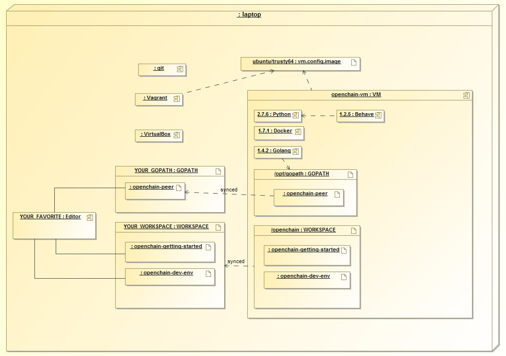

## Development Environment

If you're looking for instructions on how to setup the Hyperledger Fabric development environment, see
the [development environment setup readme](http://hyperledger-fabric.readthedocs.io/en/latest/dev-setup/devenv.html).

This folder contains the files which are used for bootstrapping the Hyperledger Fabric development environment.

Below is a deployment diagram of the current development environment. Note that version numbers may be out of date.


# Storage Backends

You may optionally choose a docker storage backend other than the default.

For a comparison of the assorted storage backends refer to [select a storage driver](https://docs.docker.com/engine/userguide/storagedriver/selectadriver/)

Presently, the default is set to AUFS, but this may change in the future.

To select a different storage backend (btrfs in this example), simply execute

```
vagrant destroy
DOCKER_STORAGE_BACKEND=btrfs vagrant up
```

Currently supported backends are btfs, and aufs, with more to be added in the future.

<a rel="license" href="http://creativecommons.org/licenses/by/4.0/"></a><br />This work is licensed under a <a rel="license" href="http://creativecommons.org/licenses/by/4.0/">Creative Commons Attribution 4.0 International License</a>.
s
