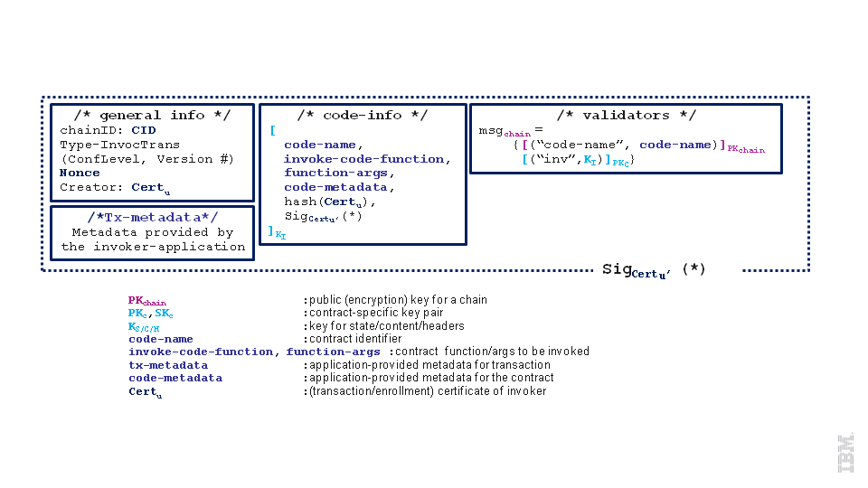
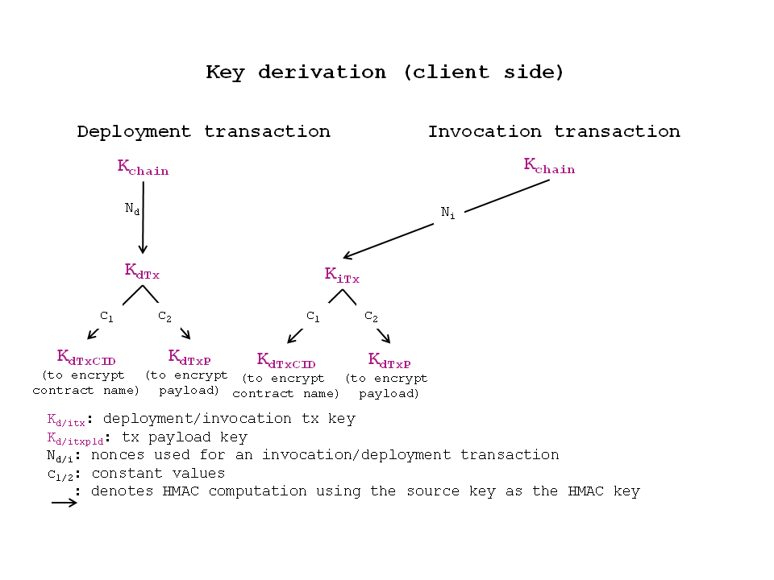

# Protocol Specification

## Preface
This document is the protocol specification for a permissioned blockchain implementation for industry use-cases. It is not intended to be a complete explanation of the implementation, but rather a description of the interfaces and relationships between components in the system and the application.

### Intended Audience
The intended audience for this specification includes the following groups:

- Blockchain vendors who want to implement blockchain systems that conform to this specification
- Tool developers who want to extend the capabilities of the fabric
- Application developers who want to leverage blockchain technologies to enrich their applications
________________________________________________________

## Table of Contents
#### [1. Introduction](#1-introduction_1)
   * [1.1 What is the fabric?](#11-what-is-the-fabric)
   * [1.2 Why the fabric?](#12-why-the-fabric)
   * [1.3 Terminology](#13-terminology)

#### [2. Fabric](#2-fabric_1)
   * [2.1 Architecture](#21-architecture)
     - [2.1.1 Membership Services](#211-membership-services)
     - [2.1.2 Blockchain Services](#212-blockchain-services)
     - [2.1.3 Chaincode Services](#213-chaincode-services)
     - [2.1.4 Events](#214-events)
     - [2.1.5 Application Programming Interface (API)](#215-application-programming-interface-api)
     - [2.1.6 Command Line Interface (CLI)](#216-command-line-interface-cli)
   * [2.2 Topology](#22-topology)
     - [2.2.1 Single Validating Peer](#221-single-validating-peer)
     - [2.2.2 Multiple Validating Peers](#222-multiple-validating-peers)
     - [2.2.3 Multichain](#223-multichain)

#### [3. Protocol](#3-protocol_1)
   * [3.1 Message](#31-message)
     - [3.1.1 Discovery Messages](#311-discovery-messages)
     - [3.1.2 Transaction Messages](#312-transaction-messages)
        * [3.1.2.1 Transaction Data Structure](#3121-transaction-data-structure)
        * [3.1.2.2 Transaction Specification](#3122-transaction-specification)
        * [3.1.2.3 Deploy Transaction](#3123-deploy-transaction)
        * [3.1.2.4 Invoke Transaction](#3124-invoke-transaction)
        * [3.1.2.5 Query Transaction](#3125-query-transaction)
     - [3.1.3 Synchronization Messages](#313-synchronization-messages)
     - [3.1.4 Consensus Messages](#314-consensus-messages)
   * [3.2 Ledger](#32-ledger)
     - [3.2.1 Blockchain](#321-blockchain)
        * [3.2.1.1 Block](#3211-block)
        * [3.2.1.2 Block Hashing](#3212-block-hashing)
        * [3.2.1.3 NonHashData](#3213-nonhashdata)
        * [3.2.1.4 Transaction Execution](#3214-transaction-execution)
     - [3.2.2 World State](#322-world-state)
        * [3.2.2.1 Hashing the world state](#3221-hashing-the-world-state)
        * [3.2.2.1.1 Bucket-tree](#32211-buckettree)
   * [3.3 Chaincode](#33-chaincode)
     - [3.3.1 Virtual Machine Instantiation](#331-virtual-machine-instantiation)
     - [3.3.2 Chaincode Protocol](#332-chaincode-protocol)
        * [3.3.2.1 Chaincode Deploy](#3321-chaincode-deploy)
        * [3.3.2.2 Chaincode Invoke](#3322-chaincode-invoke)
        * [3.3.2.3 Chaincode Query](#3323-chaincode-query)
        * [3.3.2.4 Chaincode State](#3324-chaincode-state)
   * [3.4 Pluggable Consensus Framework](#34-pluggable-consensus-framework)
     - [3.4.1 Consenter interface](#341-consenter-interface)
     - [3.4.2 CPI interface](#342-cpi-interface)
     - [3.4.3 Inquirer interface](#343-inquirer-interface)
     - [3.4.4 Communicator interface](#344-communicator-interface)
     - [3.4.5 SecurityUtils interface](#345-securityutils-interface)
     - [3.4.6 LedgerStack interface](#346-ledgerstack-interface)
     - [3.4.7 Executor interface](#347-executor-interface)
        * [3.4.7.1 Beginning a transaction batch](#3471-beginning-a-transaction-batch)
        * [3.4.7.2 Executing transactions](#3472-executing-transactions)
        * [3.4.7.3 Committing and rolling-back transactions](#3473-committing-and-rollingback-transactions)
     - [3.4.8 Ledger interface](#348-ledger-interface)
        * [3.4.8.1 ReadOnlyLedger interface](#3481-readonlyledger-interface)
        * [3.4.8.2 UtilLedger interface](#3482-utilledger-interface)
        * [3.4.8.3 WritableLedger interface](#3483-writableledger-interface)
     - [3.4.9 RemoteLedgers interface](#349-remoteledgers-interface)
     - [3.4.10 controller package](#3410-controller-package)
        * [3.4.10.1 controller.NewConsenter](#34101-controllernewconsenter)
     - [3.4.11 helper package](#3411-helper-package)
        * [3.4.11.1 High-level overview](#34111-highlevel-overview)
        * [3.4.11.2 helper.ConsensusHandler](#34112-helperconsensushandler)
        * [3.4.11.3 helper.NewConsensusHandler](#34113-helpernewconsensushandler)
        * [3.4.11.4 helper.Helper](#34114-helperhelper)
        * [3.4.11.5 helper.NewHelper](#34115-helpernewhelper)
        * [3.4.11.6 helper.HandleMessage](#34116-helperhandlemessage)
   * [3.5 Events](#35-events)
     - [3.5.1 Event Stream](#351-event-stream)
        * [3.5.1.1 Event Producer](#3511-event-producer)
        * [3.5.1.2 Event Consumer](#3512-event-consumer)
     - [3.5.2 Event Adapters](#352-event-adapters)
     - [3.5.3 Event Structure](#353-event-structure)

#### [4. Security](#4-security_1)
   * [4.1 Business security requirements](#41-business-security-requirements)
   * [4.2 User Privacy through Membership Services](#42-user-privacy-through-membership-services)
     - [4.2.1 User/Client Enrollment Process](#421-userclient-enrollment-process)
     - [4.2.2 Expiration and revocation of certificates](#422-expiration-and-revocation-of-certificates)
   * [4.3 Transaction security offerings at the infrastructure level](#43-transaction-security-offerings-at-the-infrastructure-level)
     - [4.3.1 Security Lifecycle of Transactions](#431-security-lifecycle-of-transactions)
     - [4.3.2 Transaction confidentiality](#432-transaction-confidentiality)
        * [4.3.2.1 Confidentiality against users](#4321-confidentiality-against-users)
        * [4.3.2.2 Confidentiality against validators](#4322-confidentiality-against-validators)
     - [4.3.3 Replay attack resistance](#433-replay-attack-resistance)
   * [4.4 Access control features on the application](#44-access-control-features-on-the-application)
     - [4.4.1 Invocation access control](#441-invocation-access-control)
     - [4.4.2 Read access control](#442-read-access-control)
   * [4.5 Online wallet service](#45-online-wallet-service)
   * [4.6 Network security (TLS)](#46-network-security-tls)
   * [4.7 Restrictions in the current release](#47-restrictions-in-the-current-release)
     - [4.7.1 Simplified client](#471-simplified-client)
     - [4.7.2 Simplified transaction confidentiality](#472-simplified-transaction-confidentiality)

#### [5. Byzantine Consensus](#5-byzantine-consensus_1)
   * [5.1 Overview](#51-overview)
   * [5.2 Core PBFT Functions](#52-core-pbft-functions)
   * [5.2.1 newPbftCore](#521-newpbftcore)

#### [6. Application Programming Interface](#6-application-programming-interface_1)
   * [6.1 REST Service](#61-rest-service)
   * [6.2 REST API](#62-rest-api)
     - [6.2.1 REST Endpoints](#621-rest-endpoints)
        * [6.2.1.1 Block API](#6211-block-api)
        * [6.2.1.2 Blockchain API](#6212-blockchain-api)
        * [6.2.1.3 Chaincode API](#6213-chaincode-api)
        * [6.2.1.4 Network API](#6214-network-api)
        * [6.2.1.5 Registrar API (member services)](#6215-registrar-api-member-services)
        * [6.2.1.6 Transactions API](#6216-transactions-api)
   * [6.3 CLI](#63-cli)
     - [6.3.1 CLI Commands](#631-cli-commands)
        * [6.3.1.1 node start](#6311-node-start)
        * [6.3.1.2 network login](#6312-network-login)
        * [6.3.1.3 chaincode deploy](#6313-chaincode-deploy)
        * [6.3.1.4 chaincode invoke](#6314-chaincode-invoke)
        * [6.3.1.5 chaincode query](#6315-chaincode-query)

#### [7. Application Model](#7-application-model_1)
   * [7.1 Composition of an Application](#71-composition-of-an-application)
   * [7.2 Sample Application](#72-sample-application)

#### [8. Future Directions](#8-future-directions_1)
   * [8.1 Enterprise Integration](#81-enterprise-integration)
   * [8.2 Performance and Scalability](#82-performance-and-scalability)
   * [8.3 Additional Consensus Plugins](#83-additional-consensus-plugins)
   * [8.4 Additional Languages](#84-additional-languages)

#### [9.1 Authors](#91-authors)
#### [9.2 Reviewers](#92-reviewers)
#### [9.3 Acknowledgements](#93-acknowledgements)

#### [10. References](#10-references_1)

________________________________________________________

## 1. Introduction
This document specifies the principles, architecture, and protocol of a blockchain implementation suitable for industrial use-cases.

### 1.1 What is the fabric?
The fabric is a ledger of digital events, called transactions, shared among  different participants, each having a stake in the system. The ledger can only be updated by consensus of the participants, and, once recorded, information can never be altered. Each recorded event is cryptographically verifiable with proof of agreement from the participants.

Transactions are secured, private, and confidential. Each participant registers with proof of identity to the network membership services to gain access to the system. Transactions are issued with derived certificates unlinkable to the individual participant, offering a complete anonymity on the network. Transaction content is encrypted with sophisticated key derivation functions to ensure only intended participants may see the content, protecting the confidentiality of the business transactions.

The ledger allows compliance with regulations as ledger entries are auditable in whole or in part. In collaboration with participants, auditors may obtain time-based certificates to allow viewing the ledger and linking transactions to provide an accurate assessment of the operations.

The fabric is an implementation of blockchain technology, where Bitcoin could be a simple application built on the fabric. It is a modular architecture allowing components to be plug-and-play by implementing this protocol specification. It features powerful container technology to host any main stream language for smart contracts development. Leveraging familiar and proven technologies is the motto of the fabric architecture.

### 1.2 Why the fabric?

Early blockchain technology serves a set of purposes but is often not well-suited for the needs of specific industries. To meet the demands of modern markets, the fabric is based on an industry-focused design that addresses the multiple and varied requirements of specific industry use cases, extending the learning of the pioneers in this field while also addressing issues such as scalability. The fabric provides a new approach to enable permissioned networks, privacy, and confidentially on multiple blockchain networks.

### 1.3 Terminology
The following terminology is defined within the limited scope of this specification to help readers understand clearly and precisely the concepts described here.

**Transaction** is a request to the blockchain to execute a function on the ledger. The function is implemented by a **chaincode**.

**Transactor** is an entity that issues transactions such as a client application.

**Ledger** is a sequence of cryptographically linked blocks, containing transactions and current **world state**.

**World State** is the collection of variables containing the results of executed transactions.

**Chaincode** is an application-level code (a.k.a. [smart contract](https://en.wikipedia.org/wiki/Smart_contract)) stored on the ledger as a part of a transaction. Chaincode runs transactions that may modify the world state.

**Validating Peer** is a computer node on the network responsible for running consensus, validating transactions, and maintaining the ledger.

**Non-validating Peer** is a computer node on the network which functions as a proxy connecting transactors to the neighboring validating peers. A non-validating peer doesn't execute transactions but does verify them. It also hosts the event stream server and the REST service.

**Permissioned Ledger** is a blockchain network where each entity or node is required to be a member of the network. Anonymous nodes are not allowed to connect.

**Privacy** is required by the chain transactors to conceal their identities on the network. While members of the network may examine the transactions, the transactions can't be linked to the transactor without special privilege.

**Confidentiality** is the ability to render the transaction content inaccessible to anyone other than the stakeholders of the transaction.

**Auditability** of the blockchain is required, as business usage of blockchain needs to comply with regulations to make it easy for regulators to investigate transaction records.


## 2. Fabric

The fabric is made up of the core components described in the subsections below.

### 2.1 Architecture
The reference architecture is aligned in 3 categories: Membership, Blockchain, and Chaincode services. These categories are logical structures, not a physical depiction of partitioning of components into separate processes, address spaces or (virtual) machines.


#### 2.1.1 Membership Services
Membership provides services for managing identity, privacy, confidentiality and auditability on the network. In a non-permissioned blockchain, participation does not require authorization and all nodes can equally submit transactions and/or attempt to accumulate them into acceptable blocks, i.e. there are no distinctions of roles. Membership services combine elements of Public Key Infrastructure (PKI) and decentralization/consensus to transform a non-permissioned blockchain into a permissioned blockchain. In the latter, entities register in order to acquire long-term identity credentials (enrollment certificates), and may be distinguished according to entity type. In the case of users, such credentials enable the Transaction Certificate Authority (TCA) to issue pseudonymous credentials. Such credentials, i.e., transaction certificates, are used to authorize submitted transactions. Transaction certificates persist on the blockchain, and enable authorized auditors to cluster otherwise unlinkable transactions.

#### 2.1.2 Blockchain Services
Blockchain services manage the distributed ledger through a peer-to-peer protocol, built on HTTP/2. The data structures are highly optimized to provide the most efficient hash algorithm for maintaining the world state replication. Different consensus (PBFT, Raft, PoW, PoS) may be plugged in and configured per deployment.

#### 2.1.3 Chaincode Services
Chaincode services provides a secured and lightweight way to sandbox the chaincode execution on the validating nodes. The environment is a “locked down” and secured container along with a set of signed base images containing secure OS and chaincode language, runtime and SDK layers for Go, Java, and Node.js. Other languages can be enabled if required.

#### 2.1.4 Events
Validating peers and chaincodes can emit events on the network that applications may listen for and take actions on. There is a set of pre-defined events, and chaincodes can generate custom events. Events are consumed by 1 or more event adapters. Adapters may further deliver events using other vehicles such as Web hooks or Kafka.

#### 2.1.5 Application Programming Interface (API)
The primary interface to the fabric is a REST API and its variations over Swagger 2.0. The API allows applications to register users, query the blockchain, and to issue transactions. There is a set of APIs specifically for chaincode to interact with the stack to execute transactions and query transaction results.

#### 2.1.6 Command Line Interface (CLI)
CLI includes a subset of the REST API to enable developers to quickly test chaincodes or query for status of transactions. CLI is implemented in Golang and operable on multiple OS platforms.

### 2.2 Topology
A deployment of the fabric can consist of a membership service, many validating peers, non-validating peers, and 1 or more applications. All of these components make up a chain. There can be multiple chains; each one having its own operating parameters and security requirements.

#### 2.2.1 Single Validating Peer
Functionally, a non-validating peer is a subset of a validating peer; that is, every capability on a non-validating peer may be enabled on a validating peer, so the simplest network may consist of a single validating peer node. This configuration is most appropriate for a development environment, where a single validating peer may be started up during the edit-compile-debug cycle.


A single validating peer doesn't require consensus, and by default uses the `noops` plugin, which executes transactions as they arrive. This gives the developer an immediate feedback during development.

#### 2.2.2 Multiple Validating Peers
Production or test networks should be made up of multiple validating and non-validating peers as necessary. Non-validating peers can take workload off the validating peers, such as handling API requests and processing events.


The validating peers form a mesh-network (every validating peer connects to every other validating peer) to disseminate information. A non-validating peer connects to a neighboring validating peer that it is allowed to connect to. Non-validating peers are optional since applications may communicate directly with validating peers.

#### 2.2.3 Multichain
Each network of validating and non-validating peers makes up a chain. Many chains may be created to address different needs, similar to having multiple Web sites, each serving a different purpose.


## 3. Protocol
The fabric's peer-to-peer communication is built on [gRPC](http://www.grpc.io/docs/), which allows bi-directional stream-based messaging. It uses [Protocol Buffers](https://developers.google.com/protocol-buffers) to serialize data structures for data transfer between peers. Protocol buffers are a language-neutral, platform-neutral and extensible mechanism for serializing structured data. Data structures, messages, and services are described using [proto3 language](https://developers.google.com/protocol-buffers/docs/proto3) notation.

### 3.1 Message
Messages passed between nodes are encapsulated by `Message` proto structure, which consists of 4 types: Discovery, Transaction, Synchronization, and Consensus. Each type may define more subtypes embedded in the `payload`.

```
message Message {
   enum Type {
        UNDEFINED = 0;

        DISC_HELLO = 1;
        DISC_DISCONNECT = 2;
        DISC_GET_PEERS = 3;
        DISC_PEERS = 4;
        DISC_NEWMSG = 5;

        CHAIN_STATUS = 6;
        CHAIN_TRANSACTION = 7;
        CHAIN_GET_TRANSACTIONS = 8;
        CHAIN_QUERY = 9;

        SYNC_GET_BLOCKS = 11;
        SYNC_BLOCKS = 12;
        SYNC_BLOCK_ADDED = 13;

        SYNC_STATE_GET_SNAPSHOT = 14;
        SYNC_STATE_SNAPSHOT = 15;
        SYNC_STATE_GET_DELTAS = 16;
        SYNC_STATE_DELTAS = 17;

        RESPONSE = 20;
        CONSENSUS = 21;
    }
    Type type = 1;
    bytes payload = 2;
    google.protobuf.Timestamp timestamp = 3;
}
```
The `payload` is an opaque byte array containing other objects such as `Transaction` or `Response` depending on the type of the message. For example, if the `type` is `CHAIN_TRANSACTION`, the `payload` is a `Transaction` object.

#### 3.1.1 Discovery Messages
Upon start up, a peer runs discovery protocol if `CORE_PEER_DISCOVERY_ROOTNODE` is specified. `CORE_PEER_DISCOVERY_ROOTNODE` is the IP address of another peer on the network (any peer) that serves as the starting point for discovering all the peers on the network. The protocol sequence begins with `DISC_HELLO`, whose `payload` is a `HelloMessage` object, containing its endpoint:

```
message HelloMessage {
  PeerEndpoint peerEndpoint = 1;
  uint64 blockNumber = 2;
}
message PeerEndpoint {
    PeerID ID = 1;
    string address = 2;
    enum Type {
      UNDEFINED = 0;
      VALIDATOR = 1;
      NON_VALIDATOR = 2;
    }
    Type type = 3;
    bytes pkiID = 4;
}

message PeerID {
    string name = 1;
}
```

**Definition of fields:**

- `PeerID` is any name given to the peer at start up or defined in the config file
- `PeerEndpoint` describes the endpoint and whether it's a validating or a non-validating peer
- `pkiID` is the cryptographic ID of the peer
- `address` is host or IP address and port of the peer in the format `ip:port`
- `blockNumber` is the height of the blockchain the peer currently has

If the block height received upon `DISC_HELLO` is higher than the current block height of the peer, it immediately initiates the synchronization protocol to catch up with the network.

After `DISC_HELLO`, peer sends `DISC_GET_PEERS` periodically to discover any additional peers joining the network. In response to `DISC_GET_PEERS`, a peer sends `DISC_PEERS` with `payload` containing an array of `PeerEndpoint`. Other discovery message types are not used at this point.

#### 3.1.2 Transaction Messages
There are 3 types of transactions: Deploy, Invoke and Query. A deploy transaction installs the specified chaincode on the chain, while invoke and query transactions call a function of a deployed chaincode. Another type in consideration is Create transaction, where a deployed chaincode may be instantiated on the chain and is addressable. This type has not been implemented as of this writing.

##### 3.1.2.1 Transaction Data Structure

Messages with type `CHAIN_TRANSACTION` or `CHAIN_QUERY` carry a `Transaction` object in the `payload`:

```
message Transaction {
    enum Type {
        UNDEFINED = 0;
        CHAINCODE_DEPLOY = 1;
        CHAINCODE_INVOKE = 2;
        CHAINCODE_QUERY = 3;
        CHAINCODE_TERMINATE = 4;
    }
    Type type = 1;
    string uuid = 5;
    bytes chaincodeID = 2;
    bytes payloadHash = 3;

    ConfidentialityLevel confidentialityLevel = 7;
    bytes nonce = 8;
    bytes cert = 9;
    bytes signature = 10;

    bytes metadata = 4;
    google.protobuf.Timestamp timestamp = 6;
}

message TransactionPayload {
	bytes payload = 1;
}

enum ConfidentialityLevel {
    PUBLIC = 0;
    CONFIDENTIAL = 1;
}

```
**Definition of fields:**
- `type` - The type of the transaction, which is 1 of the following:
	- `UNDEFINED` - Reserved for future use.
  - `CHAINCODE_DEPLOY` - Represents the deployment of a new chaincode.
	- `CHAINCODE_INVOKE` - Represents a chaincode function execution that may read and modify the world state.
	- `CHAINCODE_QUERY` - Represents a chaincode function execution that may only read the world state.
	- `CHAINCODE_TERMINATE` - Marks a chaincode as inactive so that future functions of the chaincode can no longer be invoked.
- `chaincodeID` - The ID of a chaincode which is a hash of the chaincode source, path to the source code, constructor function, and parameters.
- `payloadHash` - Bytes defining the hash of `TransactionPayload.payload`.
- `metadata` - Bytes defining any associated transaction metadata that the application may use.
- `uuid` - A unique ID for the transaction.
- `timestamp` - A timestamp of when the transaction request was received by the peer.
- `confidentialityLevel` - Level of data confidentiality. There are currently 2 levels. Future releases may define more levels.
- `nonce` - Used for security.
- `cert` - Certificate of the transactor.
- `signature` - Signature of the transactor.
- `TransactionPayload.payload` - Bytes defining the payload of the transaction. As the payload can be large, only the payload hash is included directly in the transaction message.

More detail on transaction security can be found in section 4.

##### 3.1.2.2 Transaction Specification
A transaction is always associated with a chaincode specification which defines the chaincode and the execution environment such as language and security context. Currently there is an implementation that uses Golang for writing chaincode. Other languages may be added in the future.

```
message ChaincodeSpec {
    enum Type {
        UNDEFINED = 0;
        GOLANG = 1;
        NODE = 2;
    }
    Type type = 1;
    ChaincodeID chaincodeID = 2;
    ChaincodeInput ctorMsg = 3;
    int32 timeout = 4;
    string secureContext = 5;
    ConfidentialityLevel confidentialityLevel = 6;
    bytes metadata = 7;
}

message ChaincodeID {
    string path = 1;
    string name = 2;
}

message ChaincodeInput {
    string function = 1;
    repeated string args  = 2;
}
```

**Definition of fields:**
- `chaincodeID` - The chaincode source code path and name.
- `ctorMsg` - Function name and argument parameters to call.
- `timeout` - Time in milliseconds to execute the transaction.
- `confidentialityLevel` - Confidentiality level of this transaction.
- `secureContext` - Security context of the transactor.
- `metadata` - Any data the application wants to pass along.

The peer, receiving the `chaincodeSpec`, wraps it in an appropriate transaction message and broadcasts to the network.

##### 3.1.2.3 Deploy Transaction
Transaction `type` of a deploy transaction is `CHAINCODE_DEPLOY` and the payload contains an object of `ChaincodeDeploymentSpec`.

```
message ChaincodeDeploymentSpec {
    ChaincodeSpec chaincodeSpec = 1;
    google.protobuf.Timestamp effectiveDate = 2;
    bytes codePackage = 3;
}
```
**Definition of fields:**
- `chaincodeSpec` - See section 3.1.2.2, above.
- `effectiveDate` - Time when the chaincode is ready to accept invocations.
- `codePackage` - gzip of the chaincode source.

The validating peers always verify the hash of the `codePackage` when they deploy the chaincode to make sure the package has not been tampered with since the deploy transaction entered the network.

##### 3.1.2.4 Invoke Transaction
Transaction `type` of an invoke transaction is `CHAINCODE_INVOKE` and the `payload` contains an object of `ChaincodeInvocationSpec`.

```
message ChaincodeInvocationSpec {
    ChaincodeSpec chaincodeSpec = 1;
}
```

##### 3.1.2.5 Query Transaction
A query transaction is similar to an invoke transaction, but the message `type` is `CHAINCODE_QUERY`.

#### 3.1.3 Synchronization Messages
Synchronization protocol starts with discovery, described above in section 3.1.1, when a peer realizes that it's behind or its current block is not the same with others. A peer broadcasts either `SYNC_GET_BLOCKS`, `SYNC_STATE_GET_SNAPSHOT`, or `SYNC_STATE_GET_DELTAS` and receives `SYNC_BLOCKS`, `SYNC_STATE_SNAPSHOT`, or `SYNC_STATE_DELTAS` respectively.

The installed consensus plugin (e.g. pbft) dictates how synchronization protocol is being applied. Each message is designed for a specific situation:

**SYNC_GET_BLOCKS** requests for a range of contiguous blocks expressed in the message `payload`, which is an object of `SyncBlockRange`. The correlationId specified is included in the `SyncBlockRange` of any replies to this message.
```
message SyncBlockRange {
    uint64 correlationId = 1;
    uint64 start = 2;
    uint64 end = 3;
}
```
A receiving peer responds with a `SYNC_BLOCKS` message whose `payload` contains an object of `SyncBlocks`
```
message SyncBlocks {
    SyncBlockRange range = 1;
    repeated Block blocks = 2;
}
```
The `start` and `end` indicate the starting and ending blocks inclusively. The order in which blocks are returned is defined by the `start` and `end` values. For example, if `start`=3 and `end`=5, the order of blocks will be 3, 4, 5. If `start`=5 and `end`=3, the order will be 5, 4, 3.

**SYNC_STATE_GET_SNAPSHOT** requests for the snapshot of the current world state. The `payload` is an object of `SyncStateSnapshotRequest`
```
message SyncStateSnapshotRequest {
  uint64 correlationId = 1;
}
```
The `correlationId` is used by the requesting peer to keep track of the response messages. A receiving peer replies with `SYNC_STATE_SNAPSHOT` message whose `payload` is an instance of `SyncStateSnapshot`
```
message SyncStateSnapshot {
    bytes delta = 1;
    uint64 sequence = 2;
    uint64 blockNumber = 3;
    SyncStateSnapshotRequest request = 4;
}
```
This message contains the snapshot or a chunk of the snapshot on the stream, and in which case, the sequence indicate the order starting at 0. The terminating message will have len(delta) == 0.

**SYNC_STATE_GET_DELTAS** requests for the state deltas of a range of contiguous blocks. By default, the Ledger maintains 500 transition deltas. A delta(j) is a state transition between block(i) and block(j) where i = j-1. The message `payload` contains an instance of `SyncStateDeltasRequest`
```
message SyncStateDeltasRequest {
    SyncBlockRange range = 1;
}
```
A receiving peer responds with `SYNC_STATE_DELTAS`, whose `payload` is an instance of `SyncStateDeltas`
```
message SyncStateDeltas {
    SyncBlockRange range = 1;
    repeated bytes deltas = 2;
}
```
A delta may be applied forward (from i to j) or backward (from j to i) in the state transition.

#### 3.1.4 Consensus Messages
Consensus deals with transactions, so a `CONSENSUS` message is initiated internally by the consensus framework when it receives a `CHAIN_TRANSACTION` message. The framework converts `CHAIN_TRANSACTION` into `CONSENSUS` then broadcasts to the validating nodes with the same `payload`. The consensus plugin receives this message and process according to its internal algorithm. The plugin may create custom subtypes to manage consensus finite state machine. See section 3.4 for more details.


### 3.2 Ledger

The ledger consists of two primary pieces, the blockchain and the world state. The blockchain is a series of linked blocks that is used to record transactions within the ledger. The world state is a key-value database that chaincodes may use to store state when executed by a transaction.

#### 3.2.1 Blockchain

##### 3.2.1.1 Block

The blockchain is defined as a linked list of blocks as each block contains the hash of the previous block in the chain. The two other important pieces of information that a block contains are the list of transactions contained within the block and the hash of the world state after executing all transactions in the block.

```
message Block {
  version = 1;
  google.protobuf.Timestamp timestamp = 2;
  bytes transactionsHash = 3;
  bytes stateHash = 4;
  bytes previousBlockHash = 5;
  bytes consensusMetadata = 6;
  NonHashData nonHashData = 7;
}

message BlockTransactions {
  repeated Transaction transactions = 1;
}
```
* `version` - Version used to track any protocol changes.
* `timestamp` - The timestamp to be filled in by the block proposer.
* `transactionsHash` - The merkle root hash of the block's transactions.
* `stateHash` - The merkle root hash of the world state.
* `previousBlockHash` - The hash of the previous block.
* `consensusMetadata` - Optional metadata that the consensus may include in a block.
* `nonHashData` - A `NonHashData` message that is set to nil before computing the hash of the block, but stored as part of the block in the database.
* `BlockTransactions.transactions` - An array of Transaction messages. Transactions are not included in the block directly due to their size.

##### 3.2.1.2 Block Hashing

* The `previousBlockHash` hash is calculated using the following algorithm.
  1. Serialize the Block message to bytes using the protocol buffer library.

  2. Hash the serialized block message to 512 bits of output using the SHA3 SHAKE256 algorithm as described in [FIPS 202](http://nvlpubs.nist.gov/nistpubs/FIPS/NIST.FIPS.202.pdf).

* The `transactionHash` is the root of the transaction merkle tree. Defining the merkle tree implementation is a TODO.

* The `stateHash` is defined in section 3.2.2.1.

##### 3.2.1.3 NonHashData

The NonHashData message is used to store block metadata that is not required to be the same value on all peers. These are suggested values.

```
message NonHashData {
  google.protobuf.Timestamp localLedgerCommitTimestamp = 1;
  repeated TransactionResult transactionResults = 2;
}

message TransactionResult {
  string uuid = 1;
  bytes result = 2;
  uint32 errorCode = 3;
  string error = 4;
}
```

* `localLedgerCommitTimestamp` - A timestamp indicating when the block was commited to the local ledger.

* `TransactionResult` - An array of transaction results.

* `TransactionResult.uuid` - The ID of the transaction.

* `TransactionResult.result` - The return value of the transaction.

* `TransactionResult.errorCode` - A code that can be used to log errors associated with the transaction.

* `TransactionResult.error` - A string that can be used to log errors associated with the transaction.


##### 3.2.1.4 Transaction Execution

A transaction defines either the deployment of a chaincode or the execution of a chaincode. All transactions within a block are run before recording a block in the ledger. When chaincodes execute, they may modify the world state. The hash of the world state is then recorded in the block.


#### 3.2.2 World State
The *world state* of a peer refers to the collection of the *states* of all the deployed chaincodes. Further, the state of a chaincode is represented as a collection of key-value pairs. Thus, logically, the world state of a peer is also a collection of key-value pairs where key consists of a tuple `{chaincodeID, ckey}`. Here, we use the term `key` to represent a key in the world state i.e., a tuple `{chaincodeID, ckey}` and we use the term `cKey` to represent a unique key within a chaincode.

For the purpose of the description below, `chaincodeID` is assumed to be a valid utf8 string and `ckey` and the `value` can be a sequence of one or more arbitrary bytes.

##### 3.2.2.1 Hashing the world state
During the functioning of a network, many occasions such as committing transactions and synchronizing peers may require computing a crypto-hash of the world state observed by a peer. For instance, the consensus protocol may require to ensure that a *minimum* number of peers in the network observe the same world state.

Since, computing the crypto-hash of the world state could be an expensive operation, this is highly desirable to organize the world state such that it enables an efficient crypto-hash computation of the world state when a change occurs in the world state. Further, different organization designs may be suitable under different workloads conditions.

Because the fabric is expected to function under a variety of scenarios leading to different workloads conditions, a pluggable mechanism is supported for organizing the world state.

###### 3.2.2.1.1 Bucket-tree

*Bucket-tree* is one of the implementations for organizing the world state. For the purpose of the description below, a key in the world state is represented as a concatenation of the two components (`chaincodeID` and `ckey`)  separated by a `nil` byte i.e., `key` = `chaincodeID`+`nil`+`cKey`.

This method models a *merkle-tree* on top of buckets of a *hash table* in order to compute the crypto-hash of the *world state*.

At the core of this method, the *key-values* of the world state are assumed to be stored in a hash-table that consists of a pre-decided number of buckets (`numBuckets`). A hash function (`hashFunction`) is employed to determine the bucket number that should contain a given key. Please note that the `hashFunction` does not represent a crypto-hash method such as SHA3, rather this is a regular programming language hash function that decides the bucket number for a given key.

For modeling the merkle-tree, the ordered buckets act as leaf nodes of the tree - lowest numbered bucket being the left most leaf node in the tree. For constructing the second-last level of the tree, a pre-decided number of leaf nodes (`maxGroupingAtEachLevel`), starting from left, are grouped together and for each such group, a node is inserted at the second-last level that acts as a common parent for all the leaf nodes in the group. Note that the number of children for the last parent node may be less than `maxGroupingAtEachLevel`. This grouping method of constructing the next higher level is repeated until the root node of the tree is constructed.

An example setup with configuration `{numBuckets=10009 and maxGroupingAtEachLevel=10}` will result in a tree with number of nodes at different level as depicted in the following table.

| Level         | Number of nodes |
| ------------- |:---------------:|
| 0             | 1               |
| 1             | 2               |
| 2             | 11              |
| 3             | 101             |
| 4             | 1001            |
| 5             | 10009           |

For computing the crypto-hash of the world state, the crypto-hash of each bucket is computed and is assumed to be the crypto-hash of leaf-nodes of the merkle-tree. In order to compute crypto-hash of a bucket, the key-values present in the bucket are first serialized and crypto-hash function is applied on the serialized bytes. For serializing the key-values of a bucket, all the key-values with a common chaincodeID prefix are serialized separately and then appending together, in the ascending order of chaincodeIDs. For serializing the key-values of a chaincodeID, the following information is concatenated:
   1. Length of chaincodeID (number of bytes in the chaincodeID)
   - The utf8 bytes of the chaincodeID
   - Number of key-values for the chaincodeID
   - For each key-value (in sorted order of the ckey)
      - Length of the ckey
      - ckey bytes
      - Length of the value
      - value bytes

For all the numeric types in the above list of items (e.g., Length of chaincodeID), protobuf's varint encoding is assumed to be used. The purpose of the above encoding is to achieve a byte representation of the key-values within a bucket that can not be arrived at by any other combination of key-values and also to reduce the overall size of the serialized bytes.

For example, consider a bucket that contains three key-values namely, `chaincodeID1_key1:value1, chaincodeID1_key2:value2, and chaincodeID2_key1:value1`. The serialized bytes for the bucket would logically look as - `12 + chaincodeID1 + 2 + 4 + key1 + 6 + value1 + 4 + key2 + 6 + value2 + 12 + chaincodeID2 + 1 + 4 + key1 + 6 + value1`

If a bucket has no key-value present, the crypto-hash is considered as `nil`.

The crypto-hash of an intermediate node and root node are computed just like in a standard merkle-tree i.e., applying a crypto-hash function on the bytes obtained by concatenating the crypto-hash of all the children nodes, from left to right. Further, if a child has a crypto-hash as `nil`, the crypto-hash of the child is omitted when concatenating the children crypto-hashes. If the node has a single child, the crypto-hash of the child is assumed to be the crypto-hash of the node. Finally, the crypto-hash of the root node is considered as the crypto-hash of the world state.

The above method offers performance benefits for computing crypto-hash when a few key-values change in the state. The major benefits include
  - Computation of crypto-hashes of the unchanged buckets can be skipped
  - The depth and breadth of the merkle-tree can be controlled by configuring the parameters `numBuckets` and `maxGroupingAtEachLevel`. Both depth and breadth of the tree has different implication on the performance cost incurred by and resource demand of different resources (namely - disk I/O, storage, and memory)

In a particular deployment, all the peer nodes are expected to use same values for the configurations `numBuckets, maxGroupingAtEachLevel, and hashFunction`. Further, if any of these configurations are to be changed at a later stage, the configurations should be changed on all the peer nodes so that the comparison of crypto-hashes across peer nodes is meaningful. Also, this may require to migrate the existing data based on the implementation. For example, an implementation is expected to store the last computed crypto-hashes for all the nodes in the tree which would need to be recalculated.


### 3.3 Chaincode
Chaincode is an application-level code deployed as a transaction (see section 3.1.2) to be distributed to the network and managed by each validating peer as isolated sandbox. Though any virtualization technology can support the sandbox, currently Docker container is utilized to run the chaincode. The protocol described in this section enables different virtualization support implementation to plug and play.

#### 3.3.1 Virtual Machine Instantiation
A virtual machine implements the VM interface:  
```
type VM interface {
	build(ctxt context.Context, id string, args []string, env []string, attachstdin bool, attachstdout bool, reader io.Reader) error
	start(ctxt context.Context, id string, args []string, env []string, attachstdin bool, attachstdout bool) error
	stop(ctxt context.Context, id string, timeout uint, dontkill bool, dontremove bool) error
}
```
The fabric instantiates the VM when it processes a Deploy transaction or other transactions on the chaincode while the VM for that chaincode is not running (either crashed or previously brought down due to inactivity). Each chaincode image is built by the `build` function, started by `start` and stopped by `stop` function.

Once the chaincode container is up, it makes a gRPC connection back to the validating peer that started the chaincode, and that establishes the channel for Invoke and Query transactions on the chaincode.

#### 3.3.2 Chaincode Protocol
Communication between a validating peer and its chaincodes is based on a bidirectional gRPC stream. There is a shim layer on the chaincode container to handle the message protocol between the chaincode and the validating peer using protobuf message.
```
message ChaincodeMessage {

    enum Type {
        UNDEFINED = 0;
        REGISTER = 1;
        REGISTERED = 2;
        INIT = 3;
        READY = 4;
        TRANSACTION = 5;
        COMPLETED = 6;
        ERROR = 7;
        GET_STATE = 8;
        PUT_STATE = 9;
        DEL_STATE = 10;
        INVOKE_CHAINCODE = 11;
        INVOKE_QUERY = 12;
        RESPONSE = 13;
        QUERY = 14;
        QUERY_COMPLETED = 15;
        QUERY_ERROR = 16;
        RANGE_QUERY_STATE = 17;
    }

    Type type = 1;
    google.protobuf.Timestamp timestamp = 2;
    bytes payload = 3;
    string uuid = 4;
}
```

**Definition of fields:**
- `Type` is the type of the message.
- `payload` is the payload of the message. Each payload depends on the `Type`.
- `uuid` is a unique identifier of the message.

The message types are described in the following sub-sections.

A chaincode implements the `Chaincode` interface, which is called by the validating peer when it processes Deploy, Invoke or Query transactions.

```
type Chaincode interface {
i	Init(stub *ChaincodeStub, function string, args []string) ([]byte, error)
	Invoke(stub *ChaincodeStub, function string, args []string) ([]byte, error)
	Query(stub *ChaincodeStub, function string, args []string) ([]byte, error)
}
```

`Init`, `Invoke` and `Query` functions take `function` and `args` as parameters to be used by those methods to support a variety of transactions. `Init` is a constructor function, which will only be invoked by the Deploy transaction. The `Query` function is not allowed to modify the state of the chaincode; it can only read and calculate the return value as a byte array.

##### 3.3.2.1 Chaincode Deploy
Upon deploy (chaincode container is started), the shim layer sends a one time `REGISTER` message to the validating peer with the `payload` containing the `ChaincodeID`. The validating peer responds with `REGISTERED` or `ERROR` on success or failure respectively. The shim closes the connection and exits if it receives an `ERROR`.

After registration, the validating peer sends `INIT` with the `payload` containing a `ChaincodeInput` object. The shim calls the `Init` function with the parameters from the `ChaincodeInput`, enabling the chaincode to perform any initialization, such as setting up the persistent state.

The shim responds with `RESPONSE` or `ERROR` message depending on the returned value from the chaincode `Init` function. If there are no errors, the chaincode initialization is complete and is ready to receive Invoke and Query transactions.

##### 3.3.2.2 Chaincode Invoke
When processing an invoke transaction, the validating peer sends a `TRANSACTION` message to the chaincode container shim, which in turn calls the chaincode `Invoke` function, passing the parameters from the `ChaincodeInput` object. The shim responds to the validating peer with `RESPONSE` or `ERROR` message, indicating the completion of the function. If `ERROR` is received, the `payload` contains the error message generated by the chaincode.

##### 3.3.2.3 Chaincode Query
Similar to an invoke transaction, when processing a query, the validating peer sends a `QUERY` message to the chaincode container shim, which in turn calls the chaincode `Query` function, passing the parameters from the `ChaincodeInput` object. The `Query` function may return a state value or an error, which the shim forwards to the validating peer using `RESPONSE` or `ERROR` messages respectively.

##### 3.3.2.4 Chaincode State
Each chaincode may define its own persistent state variables. For example, a chaincode may create assets such as TVs, cars, or stocks using state variables to hold the assets attributes. During `Invoke` function processing, the chaincode may update the state variables, for example, changing an asset owner. A chaincode manipulates the state variables by using the following message types:

###### PUT_STATE
Chaincode sends a `PUT_STATE` message to persist a key-value pair, with the `payload` containing `PutStateInfo` object.

```
message PutStateInfo {
    string key = 1;
    bytes value = 2;
}
```

###### GET_STATE
Chaincode sends a `GET_STATE` message to retrieve the value whose key is specified in the `payload`.

###### DEL_STATE
Chaincode sends a `DEL_STATE` message to delete the value whose key is specified in the `payload`.

###### RANGE_QUERY_STATE
Chaincode sends a `RANGE_QUERY_STATE` message to get a range of values. The message `payload` contains a `RangeQueryStateInfo` object.

```
message RangeQueryState {
	string startKey = 1;
	string endKey = 2;
}
```

The `startKey` and `endKey` are inclusive and assumed to be in lexical order. The validating peer responds with `RESPONSE` message whose `payload` is a `RangeQueryStateResponse` object.

```
message RangeQueryStateResponse {
    repeated RangeQueryStateKeyValue keysAndValues = 1;
    bool hasMore = 2;
    string ID = 3;
}
message RangeQueryStateKeyValue {
    string key = 1;
    bytes value = 2;
}
```

If `hasMore=true` in the response, this indicates that additional keys are available in the requested range. The chaincode can request the next set of keys and values by sending a `RangeQueryStateNext` message with an ID that matches the ID returned in the response.

```
message RangeQueryStateNext {
    string ID = 1;
}
```

When the chaincode is finished reading from the range, it should send a `RangeQueryStateClose` message with the ID it wishes to close.

```
message RangeQueryStateClose {
  string ID = 1;
}
```

###### INVOKE_CHAINCODE
Chaincode may call another chaincode in the same transaction context by sending an `INVOKE_CHAINCODE` message to the validating peer with the `payload` containing a `ChaincodeSpec` object.

###### QUERY_CHAINCODE
Chaincode may query another chaincode in the same transaction context by sending a `QUERY_CHAINCODE` message with the `payload` containing a `ChaincodeSpec` object.


### 3.4 Pluggable Consensus Framework

The consensus framework defines the interfaces that every consensus _plugin_ implements:

  - `consensus.Consenter`: interface that  allows consensus plugin to receive messages from the network.
  - `consensus.CPI`:  _Consensus Programming Interface_ (`CPI`) is used by consensus plugin to interact with rest of the stack. This interface is split in two parts:
	  - `consensus.Communicator`: used to send (broadcast and unicast) messages to other validating peers.
	  - `consensus.LedgerStack`: which is used as an interface to the execution framework as well as the ledger.

As described below in more details, `consensus.LedgerStack` encapsulates, among other interfaces, the `consensus.Executor` interface, which is the key part of the consensus framework. Namely, `consensus.Executor` interface allows for a (batch of) transaction to be started, executed, rolled back if necessary, previewed, and potentially committed. A particular property that every consensus plugin needs to satisfy is that batches (blocks)  of transactions are committed to the ledger (via `consensus.Executor.CommitTxBatch`) in total order across all validating peers (see `consensus.Executor` interface description below for more details).

Currently, consensus framework consists of 3 packages `consensus`, `controller`, and `helper`. The primary reason for `controller` and `helper` packages is to avoid "import cycle" in Go (golang) and minimize code changes for plugin to update.

- `controller` package specifies the consensus plugin used by a validating peer.
- `helper` package is a shim around a consensus plugin that helps it interact with the rest of the stack, such as maintaining message handlers to other peers.

There are 2 consensus plugins provided: `pbft` and `noops`:

-  `pbft` package contains consensus plugin that implements the *PBFT* [1] consensus protocol. See section 5 for more detail.
-  `noops` is a ''dummy'' consensus plugin for development and test purposes. It doesn't perform consensus but processes all consensus messages. It also serves as a good simple sample to start learning how to code a consensus plugin.


#### 3.4.1 `Consenter` interface

Definition:
```
type Consenter interface {
	RecvMsg(msg *pb.Message) error
}
```
The plugin's entry point for (external) client requests, and consensus messages generated internally (i.e. from the consensus module) during the consensus process. The `controller.NewConsenter` creates the plugin `Consenter`. `RecvMsg` processes the incoming transactions in order to reach consensus.

See `helper.HandleMessage` below to understand how the peer interacts with this interface.

#### 3.4.2 `CPI` interface

Definition:
```
type CPI interface {
	Inquirer
	Communicator
	SecurityUtils
	LedgerStack
}
```
`CPI` allows the plugin to interact with the stack. It is implemented by the `helper.Helper` object. Recall that this object:

  1. Is instantiated when the `helper.NewConsensusHandler` is called.
  2. Is accessible to the plugin author when they construct their plugin's `consensus.Consenter` object.

#### 3.4.3 `Inquirer` interface

Definition:
```
type Inquirer interface {
        GetNetworkInfo() (self *pb.PeerEndpoint, network []*pb.PeerEndpoint, err error)
        GetNetworkHandles() (self *pb.PeerID, network []*pb.PeerID, err error)
}
```
This interface is a part of the `consensus.CPI` interface. It is used to get the handles of the validating peers in the network (`GetNetworkHandles`) as well as details about the those validating peers (`GetNetworkInfo`):

Note that the peers are identified by a `pb.PeerID` object. This is a protobuf message (in the `protos` package), currently defined as (notice that this definition will likely be modified):

```
message PeerID {
    string name = 1;
}
```

#### 3.4.4 `Communicator` interface

Definition:

```
type Communicator interface {
	Broadcast(msg *pb.Message) error
	Unicast(msg *pb.Message, receiverHandle *pb.PeerID) error
}
```

This interface is a part of the `consensus.CPI` interface. It is used to communicate with other peers on the network (`helper.Broadcast`, `helper.Unicast`):

#### 3.4.5 `SecurityUtils` interface

Definition:

```
type SecurityUtils interface {
        Sign(msg []byte) ([]byte, error)
        Verify(peerID *pb.PeerID, signature []byte, message []byte) error
}
```

This interface is a part of the `consensus.CPI` interface. It is used to handle the cryptographic operations of message signing (`Sign`) and verifying signatures (`Verify`)

#### 3.4.6 `LedgerStack` interface

Definition:

```
type LedgerStack interface {
	Executor
	Ledger
	RemoteLedgers
}
```

A key member of the `CPI` interface, `LedgerStack` groups interaction of consensus with the rest of the fabric, such as the execution of transactions, querying, and updating the ledger. This interface supports querying the local blockchain and state, updating the local blockchain and state, and querying the blockchain and state of other nodes in the consensus network. It consists of three parts: `Executor`, `Ledger` and `RemoteLedgers` interfaces. These are described in the following.

#### 3.4.7 `Executor` interface

Definition:

```
type Executor interface {
	BeginTxBatch(id interface{}) error
	ExecTXs(id interface{}, txs []*pb.Transaction) ([]byte, []error)  
	CommitTxBatch(id interface{}, transactions []*pb.Transaction, transactionsResults []*pb.TransactionResult, metadata []byte) error  
	RollbackTxBatch(id interface{}) error  
	PreviewCommitTxBatchBlock(id interface{}, transactions []*pb.Transaction, metadata []byte) (*pb.Block, error)  
}
```

The executor interface is the most frequently utilized portion of the `LedgerStack` interface, and is the only piece which is strictly necessary for a consensus network to make progress. The interface allows for a transaction to be started, executed, rolled back if necessary, previewed, and potentially committed. This interface is comprised of the following methods.

##### 3.4.7.1 Beginning a transaction batch

```
BeginTxBatch(id interface{}) error
```

This call accepts an arbitrary `id`, deliberately opaque, as a way for the consensus plugin to ensure only the transactions associated with this particular batch are executed. For instance, in the pbft implementation, this `id` is the an encoded hash of the transactions to be executed.

##### 3.4.7.2 Executing transactions

```
ExecTXs(id interface{}, txs []*pb.Transaction) ([]byte, []error)
```

This call accepts an array of transactions to execute against the current state of the ledger and returns the current state hash in addition to an array of errors corresponding to the array of transactions. Note that a transaction resulting in an error has no effect on whether a transaction batch is safe to commit. It is up to the consensus plugin to determine the behavior which should occur when failing transactions are encountered. This call is safe to invoke multiple times.

##### 3.4.7.3 Committing and rolling-back transactions

```
RollbackTxBatch(id interface{}) error
```

This call aborts an execution batch. This will undo the changes to the current state, and restore the ledger to its previous state. It concludes the batch begun with `BeginBatchTx` and a new one must be created before executing any transactions.

```
PreviewCommitTxBatchBlock(id interface{}, transactions []*pb.Transaction, metadata []byte) (*pb.Block, error)
```

This call is most useful for consensus plugins which wish to test for non-deterministic transaction execution. The hashable portions of the block returned are guaranteed to be identical to the block which would be committed if `CommitTxBatch` were immediately invoked. This guarantee is violated if any new transactions are executed.

```
CommitTxBatch(id interface{}, transactions []*pb.Transaction, transactionsResults []*pb.TransactionResult, metadata []byte) error
```

This call commits a block to the blockchain. Blocks must be committed to a blockchain in total order. ``CommitTxBatch`` concludes the transaction batch, and a new call to `BeginTxBatch` must be made before any new transactions are executed and committed.


#### 3.4.8 `Ledger` interface

Definition:

```
type Ledger interface {
	ReadOnlyLedger
	UtilLedger
	WritableLedger
}
```

``Ledger`` interface is intended to allow the consensus plugin to interrogate and possibly update the current state and blockchain. It is comprised of the three interfaces described below.

##### 3.4.8.1 `ReadOnlyLedger` interface

Definition:

```
type ReadOnlyLedger interface {
	GetBlock(id uint64) (block *pb.Block, err error)
	GetCurrentStateHash() (stateHash []byte, err error)
	GetBlockchainSize() (uint64, error)
}
```

`ReadOnlyLedger` interface is intended to query the local copy of the ledger without the possibility of modifying it. It is comprised of the following functions.

```
GetBlockchainSize() (uint64, error)
```

This call returns the current length of the blockchain ledger. In general, this function should never fail, though in the unlikely event that this occurs, the error is passed to the caller to decide what if any recovery is necessary. The block with the highest number will have block number `GetBlockchainSize()-1`.

Note that in the event that the local copy of the blockchain ledger is corrupt or incomplete, this call will return the highest block number in the chain, plus one. This allows for a node to continue operating from the current state/block even when older blocks are corrupt or missing.

```
GetBlock(id uint64) (block *pb.Block, err error)
```

This call returns the block from the blockchain with block number `id`. In general, this call should not fail, except when the block queried exceeds the current blocklength, or when the underlying blockchain has somehow become corrupt. A failure of `GetBlock` has a possible resolution of using the state transfer mechanism to retrieve it.


```
GetCurrentStateHash() (stateHash []byte, err error)
```

This call returns the current state hash for the ledger. In general, this function should never fail, though in the unlikely event that this occurs, the error is passed to the caller to decide what if any recovery is necessary.


##### 3.4.8.2 `UtilLedger` interface

Definition:

```
type UtilLedger interface {
	HashBlock(block *pb.Block) ([]byte, error)
	VerifyBlockchain(start, finish uint64) (uint64, error)
}
```

`UtilLedger`  interface defines some useful utility functions which are provided by the local ledger. Overriding these functions in a mock interface can be useful for testing purposes. This interface is comprised of two functions.

```
HashBlock(block *pb.Block) ([]byte, error)
```

Although `*pb.Block` has a `GetHash` method defined, for mock testing, overriding this method can be very useful. Therefore, it is recommended that the `GetHash` method never be directly invoked, but instead invoked via this `UtilLedger.HashBlock` interface. In general, this method should never fail, but the error is still passed to the caller to decide what if any recovery is appropriate.

```
VerifyBlockchain(start, finish uint64) (uint64, error)
```

This utility method is intended for verifying large sections of the blockchain. It proceeds from a high block `start` to a lower block `finish`, returning the block number of the first block whose `PreviousBlockHash` does not match the block hash of the previous block as well as an error. Note, this generally indicates the last good block number, not the first bad block number.


##### 3.4.8.3 `WritableLedger` interface

Definition:

```
type WritableLedger interface {
	PutBlock(blockNumber uint64, block *pb.Block) error
	ApplyStateDelta(id interface{}, delta *statemgmt.StateDelta) error
	CommitStateDelta(id interface{}) error
	RollbackStateDelta(id interface{}) error
	EmptyState() error
}
```

`WritableLedger`  interface allows for the caller to update the blockchain. Note that this is _NOT_ intended for use in normal operation of a consensus plugin. The current state should be modified by executing transactions using the `Executor` interface, and new blocks will be generated when transactions are committed. This interface is instead intended primarily for state transfer or corruption recovery. In particular, functions in this interface should _NEVER_ be exposed directly via consensus messages, as this could result in violating the immutability promises of the blockchain concept. This interface is comprised of the following functions.

  -
  	```
	PutBlock(blockNumber uint64, block *pb.Block) error
	```

	This function takes a provided, raw block, and inserts it into the blockchain at the given blockNumber. Note that this intended to be an unsafe interface, so no error or sanity checking is performed. Inserting a block with a number higher than the current block height is permitted, similarly overwriting existing already committed blocks is also permitted. Remember, this does not affect the auditability or immutability of the chain, as the hashing techniques make it computationally infeasible to forge a block earlier in the chain. Any attempt to rewrite the blockchain history is therefore easily detectable. This is generally only useful to the state transfer API.

  -
  	```
	ApplyStateDelta(id interface{}, delta *statemgmt.StateDelta) error
	```

	This function takes a state delta, and applies it to the current state. The delta will be applied to transition a state forward or backwards depending on the construction of the state delta. Like the `Executor` methods, `ApplyStateDelta` accepts an opaque interface `id` which should also be passed into `CommitStateDelta` or `RollbackStateDelta` as appropriate.

  -
 	```
	CommitStateDelta(id interface{}) error
	```

	This function commits the state delta which was applied in `ApplyStateDelta`. This is intended to be invoked after the caller to `ApplyStateDelta` has verified the state via the state hash obtained via `GetCurrentStateHash()`. This call takes the same `id` which was passed into `ApplyStateDelta`.

  -
  	```
	RollbackStateDelta(id interface{}) error
	```

	This function unapplies a state delta which was applied in `ApplyStateDelta`. This is intended to be invoked after the caller to `ApplyStateDelta` has detected the state hash obtained via `GetCurrentStateHash()` is incorrect. This call takes the same `id` which was passed into `ApplyStateDelta`.


  -
  	```
   	EmptyState() error
   	```

	This function will delete the entire current state, resulting in a pristine empty state. It is intended to be called before loading an entirely new state via deltas. This is generally only useful to the state transfer API.

#### 3.4.9 `RemoteLedgers` interface

Definition:

```
type RemoteLedgers interface {
	GetRemoteBlocks(peerID uint64, start, finish uint64) (<-chan *pb.SyncBlocks, error)
	GetRemoteStateSnapshot(peerID uint64) (<-chan *pb.SyncStateSnapshot, error)
	GetRemoteStateDeltas(peerID uint64, start, finish uint64) (<-chan *pb.SyncStateDeltas, error)
}
```

The `RemoteLedgers` interface exists primarily to enable state transfer and to interrogate the blockchain state at  other replicas. Just like the `WritableLedger` interface, it is not intended to be used in normal operation and is designed to be used for catchup, error recovery, etc. For all functions in this interface it is the caller's responsibility to enforce timeouts. This interface contains the following functions.

  -  
  	```
  	GetRemoteBlocks(peerID uint64, start, finish uint64) (<-chan *pb.SyncBlocks, error)
  	```

	This function attempts to retrieve a stream of `*pb.SyncBlocks` from the peer designated by `peerID` for the range from `start` to `finish`. In general, `start` should be specified with a higher block number than `finish`, as the blockchain must be validated from end to beginning. The caller must validate that the desired block is being returned, as it is possible that slow results from another request could appear on this channel. Invoking this call for the same `peerID` a second time will cause the first channel to close.

  -  
  	```
   	GetRemoteStateSnapshot(peerID uint64) (<-chan *pb.SyncStateSnapshot, error)
   	```

	This function attempts to retrieve a stream of `*pb.SyncStateSnapshot` from the peer designated by `peerID`. To apply the result, the existing state should first be emptied via the `WritableLedger` `EmptyState` call, then the contained deltas in the stream should be applied sequentially.

  -
  	```
   	GetRemoteStateDeltas(peerID uint64, start, finish uint64) (<-chan *pb.SyncStateDeltas, error)
   	```

	This function attempts to retrieve a stream of `*pb.SyncStateDeltas` from the peer designated by `peerID` for the range from `start` to `finish`. The caller must validated that the desired block delta is being returned, as it is possible that slow results from another request could appear on this channel. Invoking this call for the same `peerID` a second time will cause the first channel to close.

#### 3.4.10 `controller` package

##### 3.4.10.1 controller.NewConsenter

Signature:

```
func NewConsenter(cpi consensus.CPI) (consenter consensus.Consenter)
```

This function reads the `peer.validator.consensus` value in `core.yaml` configuration file, which is the  configuration file for the `peer` process. The value of the `peer.validator.consensus` key defines whether the validating peer will run with the `noops` consensus plugin or the `pbft` one. (Notice that this should eventually be changed to either `noops` or `custom`. In case of `custom`, the validating peer will run with the consensus plugin defined in `consensus/config.yaml`.)

The plugin author needs to edit the function's body so that it routes to the right constructor for their package. For example, for `pbft` we point to the `pbft.GetPlugin` constructor.

This function is called by `helper.NewConsensusHandler` when setting the `consenter` field of the returned message handler. The input argument `cpi` is the output of the `helper.NewHelper` constructor and implements the `consensus.CPI` interface.

#### 3.4.11 `helper` package

##### 3.4.11.1 High-level overview

A validating peer establishes a message handler (`helper.ConsensusHandler`) for every connected peer, via the `helper.NewConsesusHandler` function (a handler factory). Every incoming message is inspected on its type (`helper.HandleMessage`); if it's a message for which consensus needs to be reached, it's passed on to the peer's consenter object (`consensus.Consenter`). Otherwise it's passed on to the next message handler in the stack.

##### 3.4.11.2 helper.ConsensusHandler

Definition:

```
type ConsensusHandler struct {
	chatStream  peer.ChatStream
	consenter   consensus.Consenter
	coordinator peer.MessageHandlerCoordinator
	done        chan struct{}
	peerHandler peer.MessageHandler
}
```

Within the context of consensus, we focus only on the `coordinator` and `consenter` fields. The `coordinator`, as the name implies, is used to coordinate between the peer's message handlers. This is, for instance, the object that is accessed when the peer wishes to `Broadcast`. The `consenter` receives the messages for which consensus needs to be reached and processes them.

Notice that `fabric/peer/peer.go` defines the `peer.MessageHandler` (interface), and `peer.MessageHandlerCoordinator` (interface) types.

##### 3.4.11.3 helper.NewConsensusHandler

Signature:

```
func NewConsensusHandler(coord peer.MessageHandlerCoordinator, stream peer.ChatStream, initiatedStream bool, next peer.MessageHandler) (peer.MessageHandler, error)
```

Creates a `helper.ConsensusHandler` object. Sets the same `coordinator` for every message handler. Also sets the `consenter` equal to: `controller.NewConsenter(NewHelper(coord))`

##### 3.4.11.4 helper.Helper

Definition:

```
type Helper struct {
	coordinator peer.MessageHandlerCoordinator
}
```

Contains the reference to the validating peer's `coordinator`. Is the object that implements the `consensus.CPI` interface for the peer.

##### 3.4.11.5 helper.NewHelper

Signature:

```
func NewHelper(mhc peer.MessageHandlerCoordinator) consensus.CPI
```

Returns a `helper.Helper` object whose `coordinator` is set to the input argument `mhc` (the `coordinator` field of the `helper.ConsensusHandler` message handler). This object implements the `consensus.CPI` interface, thus allowing the plugin to interact with the stack.


##### 3.4.11.6 helper.HandleMessage

Recall that the `helper.ConsesusHandler` object returned by `helper.NewConsensusHandler` implements the `peer.MessageHandler` interface:

```
type MessageHandler interface {
	RemoteLedger
	HandleMessage(msg *pb.Message) error
	SendMessage(msg *pb.Message) error
	To() (pb.PeerEndpoint, error)
	Stop() error
}
```

Within the context of consensus, we focus only on the `HandleMessage` method. Signature:

```
func (handler *ConsensusHandler) HandleMessage(msg *pb.Message) error
```

The function inspects the `Type` of the incoming `Message`. There are four cases:

  1. Equal to `pb.Message_CONSENSUS`: passed to the handler's `consenter.RecvMsg` function.
  2. Equal to `pb.Message_CHAIN_TRANSACTION` (i.e. an external deployment request): a response message is sent to the user first, then the message is passed to the `consenter.RecvMsg` function.
  3. Equal to `pb.Message_CHAIN_QUERY` (i.e. a query): passed to the `helper.doChainQuery` method so as to get executed locally.
  4. Otherwise: passed to the `HandleMessage` method of the next handler down the stack.


### 3.5 Events
The event framework provides the ability to generate and consume predefined and custom events. There are 3 basic components:
  - Event stream
  - Event adapters
  - Event structures

#### 3.5.1 Event Stream
An event stream is a gRPC channel capable of sending and receiving events. Each consumer establishes an event stream to the event framework and expresses the events that it is interested in. the event producer only sends appropriate events to the consumers who have connected to the producer over the event stream.

The event stream initializes the buffer and timeout parameters. The buffer holds the number of events waiting for delivery, and the timeout has 3 options when the buffer is full:

- If timeout is less than 0, drop the newly arriving events
- If timeout is 0, block on the event until the buffer becomes available
- If timeout is greater than 0, wait for the specified timeout and drop the event if the buffer remains full after the timeout


##### 3.5.1.1 Event Producer
The event producer exposes a function to send an event, `Send(e *pb.Event)`, where `Event` is either a pre-defined `Block` or a `Generic` event. More events will be defined in the future to include other elements of the fabric.

```
message Generic {
    string eventType = 1;
    bytes payload = 2;
}
```

The `eventType` and `payload` are freely defined by the event producer. For example, JSON data may be used in the `payload`. The `Generic` event may also be emitted by the chaincode or plugins to communicate with consumers.

##### 3.5.1.2 Event Consumer
The event consumer enables external applications to listen to events. Each event consumer registers an event adapter with the event stream. The consumer framework can be viewed as a bridge between the event stream and the adapter. A typical use of the event consumer framework is:

```
adapter = <adapter supplied by the client application to register and receive events>
consumerClient = NewEventsClient(<event consumer address>, adapter)
consumerClient.Start()
...
...
consumerClient.Stop()
```

#### 3.5.2 Event Adapters
The event adapter encapsulates three facets of event stream interaction:
  - an interface that returns the list of all events of interest
  - an interface called by the event consumer framework on receipt of an event
  - an interface called by the event consumer framework when the event bus terminates

The reference implementation provides Golang specific language binding.
```
      EventAdapter interface {
         GetInterestedEvents() ([]*ehpb.Interest, error)
         Recv(msg *ehpb.Event) (bool,error)
         Disconnected(err error)
      }
```
Using gRPC as the event bus protocol allows the event consumer framework to be ported to different language bindings without affecting the event producer framework.

#### 3.5.3 Event Structure

This section details the message structures of the event system. Messages are described directly in Golang for simplicity.

The core message used for communication between the event consumer and producer is the Event.
```
    message Event {
        oneof Event {
            //consumer events
            Register register = 1;

            //producer events
            Block block = 2;
            Generic generic = 3;
       }
    }
```
Per the above definition, an event has to be one of `Register`, `Block` or `Generic`.

As mentioned in the previous sections, a consumer creates an event bus by establishing a connection with the producer and sending a `Register` event. The `Register` event is essentially an array of `Interest` messages declaring the events of interest to the consumer.
```
    message Interest {
        enum ResponseType {
            //don't send events (used to cancel interest)
            DONTSEND = 0;
            //send protobuf objects
            PROTOBUF = 1;
            //marshall into JSON structure
            JSON = 2;
        }
        string eventType = 1;
        ResponseType responseType = 2;
    }
```
Events can be sent directly as protobuf structures or can be sent as JSON structures by specifying the `responseType` appropriately.

Currently, the producer framework can generate a `Block` or a `Generic` event. A `Block` is a message used for encapsulating properties of a block in the blockchain.


## 4. Security

This section discusses the setting depicted in the figure below.
In particular, the system consists of the following entities:
membership management infrastructure, i.e., a set of entities that are
responsible for identifying an individual user (using any form of identification
considered in the system, e.g., credit cards, id-cards), open an account for
that user to be able to register, and issue the necessary credentials to
successfully create transactions and deploy or invoke chaincode successfully
through the fabric.

 * Peers, that are classified as validating peers, and non-validating peers.
   Validating peers (also known as validators) order and process (check validity, execute,
   and add to the blockchain) user-messages (transactions) submitted to the network.
   Non validating peers (also known as peers) receive user transactions on behalf of users,
   and after some fundamental validity checks, they forward the transactions to their
   neighboring validating peers. Peers maintain an up-to-date copy of the blockchain,
   but in contradiction to validators, they do not execute transactions
   (a process also known as *transaction validation*).
 * End users of the system, that have registered to our membership service administration,
   after having demonstrated ownership of what is considered *identity* in the system,
   and have obtained credentials to install the client-software and submit transactions
   to the system.
 * Client-software, the software that needs to be installed at the client side for the
   latter to be able to complete his registration to our membership service and submit
   transactions to the system.
 * Online wallets, entities that are trusted by a user to maintain that user's credentials,
   and submit transactions solely upon user request to the network. Online wallets come
   with their own software at the client-side, that is usually light-weight, as the
   client only needs to authenticate himself and his requests to the wallet.
   While it can be the case that peers can play the role of *online wallet* for a set of
   users, in the following sessions the security of online wallets is detailed separately.

Users who wish to make use of the fabric, open an account at the membership management
administration, by proving ownership of identity as discussed in previous sections, new chaincodes
are announced to the blockchain network by the chaincode creator (developer) through the means
of a deployment transaction that the client-software would construct on behalf of the developer.
Such transaction is first received by a peer or validator, and afterwards circulated
in the entire network of validators, this transaction is executed and finds its place to
the blockchain network. Users can also invoke a function of an already deployed chain-code
through an invocation transaction.

The next section provides a summary of the business goals of the system that drive the security requirements. We then overview the security components and their operation and show how this design fulfills the security requirements.

### 4.1 Business security requirements
This section presents business security requirements that are relevant to the context of the fabric.
**Incorporation of identity and role management.**

In order to adequately support real business applications it is necessary to progress beyond ensuring cryptographic continuity. A workable B2B system must consequently move towards addressing proven/demonstrated identities or other attributes relevant to conducting business. Business transactions and consumer interactions with financial institutions need to be unambiguously mapped to account holders. Business contracts typically require demonstrable affiliation with specific institutions and/or possession of other specific properties of transacting parties. Accountability and non-frameability are two reasons that identity management is a critical component of such systems.

Accountability means that users of the system, individuals, or corporations, who misbehave can be traced back and be set accountable for their actions. In many cases, members of a B2B system are required to use their identities (in some form) to participate in the system, in a way such that accountability is guaranteed. Accountability and non-frameability are both essential security requirements in B2B systems and they are closely related. That is, a B2B system should guarantee that an honest user of such system cannot be framed to be accused as responsible for transactions originated by other users.

In addition a B2B system should be renewable and flexible in order to accommodate changes of participants’s roles and/or affiliations.

**Transactional privacy.**

In B2B relationships there is a strong need for transactional privacy, i.e., allowing the end-user of a system to control the degree to which it interacts and shares information with its environment. For example, a corporation doing business through a transactional B2B system requires that its transactions are not visible to other corporations or industrial partners that are not authorized to share classified information with.


Transactional privacy in the fabric is offered by the mechanisms to achieve two properties with respect to non authorized users:

* Transaction anonymity, where the owner of a transaction is hidden among the so called *anonymity set*, which in the fabric, is the set of users.

* Transaction unlinkability, where two or more transactions of the same user should not be linked as such.

Clearly depending on the context, non-authorized users can be anyone outside the system, or a subset of users.

Transactional privacy is strongly associated to the confidentiality of the content of a contractual agreement between two or more members of a B2B system, as well as to the anonymity and unlinkability of any authentication mechanism that should be in place within transactions.

**Reconciling transactional privacy with identity management.**

As described later in this document, the approach taken here to reconcile identity management with user privacy and to enable competitive institutions to transact effectively on a common blockchain (for both intra- and inter-institutional transactions) is as follows:

1. add certificates to transactions to implement a “permissioned” blockchain

2. utilize a two-level system:

   1. (relatively) static enrollment certificates (ECerts), acquired via registration with an enrollment certificate authority (CA).

   2. transaction certificates (TCerts) that faithfully but pseudonymously represent enrolled users, acquired via a transaction CA.

3. offer mechanisms to conceal the content of transactions to unauthorized members of the system.

**Audit support.** Commercial systems are occasionally subjected to audits. Auditors in such cases should be given the means to check a certain transaction, or a certain group of transactions, the activity of a particular user of the system, or the operation of the system itself. Thus, such capabilities should be offered by any system featuring transactions containing contractual agreements between business partners.

### 4.2 User Privacy through Membership Services

Membership Services consists of an infrastructure of several entities that together manage the identity and privacy of users on the network. These services validate user’s identity, register the user in the system, and provide all the credentials needed for him/her to be an active and compliant participant able to create and/or invoke transactions. A Public Key Infrastructure (PKI) is a framework based on public key cryptography that ensures not only the secure exchange of data over public networks but also affirms the identity of the other party. A PKI manages the generation, distribution and revocation of keys and digital certificates. Digital certificates are used to establish user credentials and to sign messages. Signing messages with a certificate ensures that the message has not been altered. Typically a PKI has a Certificate Authority (CA), a Registration Authority (RA), a certificate database, and a certificate storage. The RA is a trusted party that authenticates users and vets the legitimacy of data, certificates or other evidence submitted to support the user’s request for one or more certificates that reflect that user’s identity or other properties. A CA, upon advice from an RA, issues digital certificates for specific uses and is certified directly or hierarchically by a root CA. Alternatively, the user-facing communications and due diligence responsibilities of the RA can be subsumed as part of the CA. Membership Services is composed of the entities shown in the following figure. Introduction of such full PKI reinforces the strength of this system for B2B (over, e.g. Bitcoin).


*Root Certificate Authority (Root CA):* entity that represents the trust anchor for the PKI scheme. Digital certificates verification follows a chain of trust. The Root CA is the top-most CA in the PKI hierarchy.

*Registration Authority (RA):* a trusted entity that can ascertain the validity and identity of users who want to participate in the permissioned blockchain. It is responsible for out-of-band communication with the user to validate his/her identity and role. It creates registration credentials needed for enrollment and information on root of trust.

*Enrollment Certificate Authority (ECA):*  responsible for issuing Enrollment Certificates (ECerts) after validating the registration credentials provided by the user.

*Transaction Certificate Authority (TCA):* responsible for issuing Transaction Certificates (TCerts) after validating the enrollment credentials provided by the user.

*TLS Certificate Authority (TLS-CA):* responsible for issuing TLS certificates and credentials that allow the user to make use of its network. It validates the credential(s) or evidence provided by the user that justifies issuance of a TLS certificate that includes specific information pertaining to the user.

In this specification, membership services is expressed through the following associated certificates issued by the PKI:

*Enrollment Certificates (ECerts)*
ECerts are long-term certificates. They are issued for all roles, i.e. users, non-validating peers, and validating peers. In the case of users, who submit transactions for candidate incorporation into the blockchain and who also own TCerts (discussed below), there are two possible structure and usage models for ECerts:

 * Model A:  ECerts contain the identity/enrollmentID of their owner and can be used to offer only nominal entity-authentication for TCert requests and/or within transactions. They contain the public part of two key pairs – a signature key-pair and an encryption/key agreement key-pair. ECerts are accessible to everyone.

 * Model B: ECerts contain the identity/enrollmentID of their owner and can be used to offer only nominal entity-authentication for TCert requests. They contain the public part of a signature key-pair, i.e., a signature verification public key. ECerts are preferably accessible to only TCA and auditors, as relying parties. They are invisible to transactions, and thus (unlike TCerts) their signature key pairs do not play a non-repudiation role at that level.

*Transaction Certificates (TCerts)*
TCerts are short-term certificates for each transaction. They are issued by the TCA upon authenticated user-request. They securely authorize a transaction and may be configured to not reveal the identities of who is involved in the transaction or to selectively reveal such identity/enrollmentID information. They include the public part of a signature key-pair, and may be configured to also include the public part of a key agreement key pair. They are issued only to users. They are uniquely associated to the owner – they may be configured so that this association is known only by the TCA (and to authorized auditors). TCerts may be configured to not carry information of the identity of the user. They enable the user not only to anonymously participate in the system but also prevent linkability of transactions.

However, auditability and accountability requirements assume that the TCA is able to retrieve TCerts of a given identity, or retrieve the owner of a specific TCert. For details on how TCerts are used in deployment and invocation transactions see Section 4.3, Transaction Security offerings at the infrastructure level.

TCerts can accommodate encryption or key agreement public keys (as well as digital signature verification public keys).
If TCerts are thus equipped, then enrollment certificates need not also contain encryption or key agreement public keys.

Such a key agreement public key, Key_Agreement_TCertPub_Key, can be generated by the transaction certificate authority (TCA) using a method that is the same as that used to generate the Signature_Verification_TCertPub_Key, but using an index value of TCertIndex + 1 rather than TCertIndex, where TCertIndex is hidden within the TCert by the TCA for recovery by the TCert owner.

The structure of a Transaction Certificate (TCert) is as follows:
* TCertID – transaction certificate ID (preferably generated by TCA randomly in order to avoid unintended linkability via the Hidden Enrollment ID field).
* Hidden Enrollment ID: AES_Encrypt<sub>K</sub>(enrollmentID), where key K = [HMAC(Pre-K, TCertID)]<sub>256-bit truncation</sub> and where three distinct key distribution scenarios for Pre-K are defined below as (a), (b) and (c).
* Hidden Private Keys Extraction: AES_Encrypt<sub>TCertOwner_EncryptKey</sub>(TCertIndex || known padding/parity check vector) where || denotes concatenation, and where each batch has a unique (per batch) time-stamp/random offset that is added to a counter (initialized at 1 in this implementation) in order to generate TCertIndex. The counter can be incremented by 2 each time in order to accommodate generation by the TCA of the public keys and recovery by the TCert owner of the private keys of both types, i.e., signature key pairs and key agreement key pairs.
* Sign Verification Public Key – TCert signature verification public key.
* Key Agreement Public Key – TCert key agreement public key.
* Validity period – the time window during which the transaction certificate can be used for the outer/external signature of a transaction.

There are at least three useful ways to consider configuring the key distribution scenario for the Hidden Enrollment ID field:
*(a)* Pre-K is distributed during enrollment to user clients, peers and auditors, and is available to the TCA and authorized auditors. It may, for example, be derived from K<sub>chain</sub> (described subsequently in this specification) or be independent of key(s) used for chaincode confidentiality.

*(b)* Pre-K is available to validators, the TCA and authorized auditors. K is made available by a validator to a user (under TLS) in response to a successful query transaction. The query transaction can have the same format as the invocation transaction. Corresponding to Example 1 below, the querying user would learn the enrollmentID of the user who created the Deployment Transaction if the querying user owns one of the TCerts in the ACL of the Deployment Transaction. Corresponding to Example 2 below, the querying user would learn the enrollmentID of the user who created the Deployment Transaction if the enrollmentID of the TCert used to query matches one of the affiliations/roles in the Access Control field of the Deployment Transaction.

*Example 1:*


*Example 2:*


*(c)* Pre-K is available to the TCA and authorized auditors. The TCert-specific K can be distributed the TCert owner (under TLS) along with the TCert, for each TCert in the batch. This enables targeted release by the TCert owner of K (and thus trusted notification of the TCert owner’s enrollmentID). Such targeted release can use key agreement public keys of the intended recipients and/or PK<sub>chain</sub> where SK<sub>chain</sub> is available to validators as described subsequently in this specification. Such targeted release to other contract participants can be incorporated into a transaction or done out-of-band.

If the TCerts are used in conjunction with ECert Model A above, then using (c) where K is not distributed to the TCert owner may suffice.
If the TCerts are used in conjunction with ECert Model A above, then the Key Agreement Public Key field of the TCert may not be necessary.

The Transaction Certificate Authority (TCA) returns TCerts in batches, each batch contains the KeyDF_Key (Key-Derivation-Function Key) which is not included within every TCert but delivered to the client with the batch of TCerts (using TLS). The KeyDF_Key allows the TCert owner to derive TCertOwner_EncryptKey which in turn enables recovery of TCertIndex from AES_Encrypt<sub>TCertOwner_EncryptKey</sub>(TCertIndex || known padding/parity check vector).

*TLS-Certificates (TLS-Certs)*
TLS-Certs are certificates used for system/component-to-system/component communications. They carry the identity of their owner and are used for network level security.

This implementation of membership services provides the following basic functionality: there is no expiration/revocation of ECerts; expiration of TCerts is provided via the validity period time window; there is no revocation of TCerts. The ECA, TCA, and TLS CA certificates are self-signed, where the TLS CA is provisioned as a trust anchor.

#### 4.2.1 User/Client Enrollment Process

The next figure has a high-level description of the user enrollment process. It has an offline and an online phase.


*Offline Process:* in Step 1, each user/non-validating peer/validating peer has to present strong identification credentials (proof of ID) to a Registration Authority (RA) offline. This has to be done out-of-band to provide the evidence needed by the RA to create (and store) an account for the user. In Step 2, the RA returns the associated username/password and trust anchor (TLS-CA Cert in this implementation) to the user. If the user has access to a local client then this is one way the client can be securely provisioned with the TLS-CA certificate as trust anchor.

*Online Phase:* In Step 3, the user connects to the client to request to be enrolled in the system. The user sends his username and password to the client. On behalf of the user, the client sends the request to the PKI framework, Step 4, and receives a package, Step 5, containing several certificates, some of which should correspond to private/secret keys held by the client. Once the client verifies that the all the crypto material in the package is correct/valid, it stores the certificates in local storage and notifies the user. At this point the user enrollment has been completed.


Figure 4 shows a detailed description of the enrollment process. The PKI framework has the following entities – RA, ECA, TCA and TLS-CA. After Step 1, the RA calls the function “AddEntry” to enter the (username/password) in its database. At this point the user has been formally registered into the system database. The client needs the TLS-CA certificate (as trust anchor) to verify that the TLS handshake is set up appropriately with the server. In Step 4, the client sends the registration request to the ECA along with its enrollment public key and additional identity information such as username and password (under the TLS record layer protocol). The ECA verifies that such user really exists in the database. Once it establishes this assurance the user has the right to submit his/her enrollment public key and the ECA will certify it. This enrollment information is of a one-time use. The ECA updates the database marking that this registration request information (username/password) cannot be used again. The ECA constructs, signs and sends back to the client an enrollment certificate (ECert) that contains the user’s enrollment public key (Step 5). It also sends the ECA Certificate (ECA-Cert) needed in future steps (client will need to prove to the TCA that his/her ECert was created by the proper ECA). (Although the ECA-Cert is self-signed in the initial implementation, the TCA and TLS-CA and ECA are co-located.) The client verifies, in Step 6, that the public key inside the ECert is the one originally submitted by the client (i.e. that the ECA is not cheating). It also verifies that all the expected information within the ECert is present and properly formed.

Similarly, In Step 7, the client sends a registration request to the TLS-CA along with its public key and identity information. The TLS-CA verifies that such user is in the database. The TLS-CA generates, and signs a TLS-Cert that contains the user’s TLS public key (Step 8). TLS-CA sends the TLS-Cert and its certificate (TLS-CA Cert). Step 9 is analogous to Step 6, the client verifies that the public key inside the TLS Cert is the one originally submitted by the client and that the information in the TLS Cert is complete and properly formed. In Step 10, the client saves all certificates in local storage for both certificates. At this point the user enrollment has been completed.

In this implementation the enrollment process for validators is the same as that for peers. However, it is possible that a different implementation would have validators enroll directly through an on-line process.


*Client:* Request for TCerts batch needs to include (in addition to count), ECert and signature of request using ECert private key (where Ecert private key is pulled from Local Storage).

*TCA generates TCerts for batch:* Generates key derivation function key, KeyDF_Key, as HMAC(TCA_KDF_Key, EnrollPub_Key). Generates each TCert public key (using TCertPub_Key = EnrollPub_Key + ExpansionValue G, where 384-bit ExpansionValue = HMAC(Expansion_Key, TCertIndex) and 384-bit Expansion_Key = HMAC(KeyDF_Key, “2”)). Generates each AES_Encrypt<sub>TCertOwner_EncryptKey</sub>(TCertIndex || known padding/parity check vector), where || denotes concatenation and where TCertOwner_EncryptKey is derived as [HMAC(KeyDF_Key, “1”)]<sub>256-bit truncation</sub>.

*Client:* Deriving TCert private key from a TCert in order to be able to deploy or invoke or query: KeyDF_Key and ECert private key need to be pulled from Local Storage. KeyDF_Key is used to derive TCertOwner_EncryptKey as [HMAC(KeyDF_Key, “1”)]<sub>256-bit truncation</sub>; then TCertOwner_EncryptKey is used to decrypt the TCert field AES_Encrypt<sub>TCertOwner_EncryptKey</sub>(TCertIndex || known padding/parity check vector); then TCertIndex is used to derive TCert private key: TCertPriv_Key = (EnrollPriv_Key + ExpansionValue) modulo n, where 384-bit ExpansionValue = HMAC(Expansion_Key, TCertIndex) and 384-bit Expansion_Key = HMAC(KeyDF_Key, “2”).

#### 4.2.2 Expiration and revocation of certificates

It is practical to support expiration of transaction certificates. The time window during which a transaction certificate can be used is expressed by a ‘validity period’ field. The challenge regarding support of expiration lies in the distributed nature of the system. That is, all validating entities must share the same information; i.e. be consistent with respect to the expiration of the validity period associated with the transactions to be executed and validated. To guarantee that the expiration of validity periods is done in a consistent manner across all validators, the concept of validity period identifier is introduced. This identifier acts as a logical clock enabling the system to uniquely identify a validity period. At genesis time the “current validity period” of the chain gets initialized by the TCA. It is essential that this validity period identifier is given monotonically increasing values over time, such that it imposes a total order among validity periods.

A special type of transactions, system transactions, and the validity period identified are used together to announce the expiration of a validity period to the Blockchain. System transactions refer to contracts that have been defined in the genesis block and are part of the infrastructure. The validity period identified is updated periodically by the TCA invoking a system chaincode. Note that only the TCA should be allowed to update the validity period. The TCA sets the validity period for each transaction certificate by setting the appropriate integer values in the following two fields that define a range: ‘not-before’ and ‘not-after’ fields.

TCert Expiration:
At the time of processing a TCert, validators read from the state table associated with the ledger the value of ‘current validity period’ to check if the outer certificate associated with the transaction being evaluated is currently valid. That is, the current value in the state table has to be within the range defined by TCert sub-fields ‘not-before’ and ‘not-after’. If this is the case, the validator continues processing the transaction. In the case that the current value is not within range, the TCert has expired or is not yet valid and the validator should stop processing the transaction.

ECert Expiration:
Enrollment certificates have different validity period length(s) than those in transaction certificates.

Revocation is supported in the form of Certificate Revocation Lists (CRLs). CRLs identify revoked certificates. Changes to the CRLs, incremental differences, are announced through the Blockchain.

### 4.3 Transaction security offerings at the infrastructure level

Transactions in the fabric are user-messages submitted to be included
in the ledger. As discussed in previous sections, these messages have a
specific structure, and enable users to deploy new chaincodes, invoke existing
chaincodes, or query the state of existing chaincodes.
Therefore, the way transactions are formed, announced and processed plays
an important role to the privacy and security offerings of the entire system.

On one hand our membership service provides the means to authenticate transactions as
having originated by valid users of the system, to disassociate transactions with user identities,
but while efficiently tracing the transactions a particular individual under certain conditions
(law enforcement, auditing). In other words, membership services offer to transactions authentication
mechanisms that marry user-privacy with accountability and non-repudiation.

On the other hand, membership services alone cannot offer full privacy of user-activities within
the fabric. First of all, for privacy provisions offered by the fabric to be complete,
privacy-preserving authentication mechanisms need to be accompanied by transaction confidentiality.
This becomes clear if one considers that the content of a chaincode, may leak information on who may have
created it, and thus break the privacy of that chaincode's creator. The first subsection
discusses transaction confidentiality.

<!-- @Binh, @Frank: PLEASE REVIEW THIS PARAGRAPH -->
<!-- Edited by joshhus ... April 6, 2016 -->
Enforcing access control for the invocation of chaincode is an important security requirement.
The fabric exposes to the application (e.g., chaincode creator) the means for the application
to perform its own invocation access control, while leveraging the fabric's membership services.
Section 4.4 elaborates on this.

<!--Enforcing access control on the invocation of chaincodes is another requirement associated
to the security of chaincodes. Though for this one can leverage authentication mechanisms
of membership services, one would need to design invocation ACLs and perform their
validation in a way that non-authorized parties cannot link multiple invocations of
the same chaincode by the same user. Subection 5.2.2 elaborates on this.-->

Replay attacks is another crucial aspect of the security of the chaincode,
as a malicious user may copy a transaction that was added to the Blockchain
in the past, and replay it in the network to distort its operation.
This is the topic of Section 4.3.3.

The rest of this Section presents an overview of how security mechanisms in the
infrastructure are incorporated in the transactions' lifecycle,
and details each security mechanism separately.


#### 4.3.1 Security Lifecycle of Transactions
Transactions are created on the client side. The client can be either plain
client, or a more specialized application, i.e., piece of
software that handles (server) or invokes (client) specific chaincodes
through the blockchain. Such applications are built on top of the
platform (client) and are detailed in Section 4.4.

Developers of new chaincodes create a new deploy transaction by passing to
the fabric infrastructure:
* the confidentiality/security version or type they want the transaction to conform with,
* the set of users who wish to be given access to parts of the chaincode and
  a proper representation of their (read) access rights
<!-- (read-access code/state/activity, invocation-access) -->
* the chaincode specification,
* code metadata, containing information that should be passed to the chaincode
  at the time of its execution
  (e.g., configuration parameters), and
* transaction metadata, that is attached to the transaction structure,
  and is only used by the application that deployed the chaincode.

Invoke and query transactions corresponding to chaincodes with confidentiality
restrictions are created using a similar approach. The transactor provides the
identifier of the chaincode to be executed, the name of the function to be
invoked and its arguments. Optionally, the invoker can pass to the
transaction creation function, code invocation metadata, that will be provided
to the chaincode at the time of its execution. Transaction metadata is another
field that the application of the invoker or the invoker himself can leverage
for their own purposes.

Finally transactions at the client side, are signed by a certificate of their
creator and released to the network of validators.
Validators receive the confidential transactions, and pass them through the following phases:
* *pre-validation* phase, where validators validate the transaction certificate against the accepted root certificate authority,
  verify transaction certificate signature included in the transaction (statically), and check whether the transaction is a replay (see, later section for details on replay attack protection).
* *consensus* phase, where the validators add this transaction to the total order of transactions (ultimately included in the ledger)
* *pre-execution* phase, where validators verify the validity of the transaction / enrollment certificate against the current validity period,
  decrypt the transaction (if the transaction is encrypted), and check that the transaction's plaintext is correctly formed(e.g., invocation access control is respected, included TCerts are correctly formed);
  mini replay-attack check is also performed here within the transactions of the currently processed block.
* *execution* phase, where the (decrypted) chaincode is passed to a container, along with the associated code metadata, and is executed
* *commit* phase, where (encrypted) updates of that chaincodes state is committed to the ledger with the transaction itself.


#### 4.3.2 Transaction confidentiality

Transaction confidentiality requires that under the request of the developer, the plain-text
of a chaincode, i.e., code, description, is not accessible or inferable (assuming a computational
attacker) by any unauthorized entities(i.e., user or peer not authorized by the developer).
For the latter, it is important that for chaincodes with confidentiality requirements the
content of both *deploy* and *invoke* transactions remains concealed. In the same spirit,
non-authorized parties, should not be able to associate invocations (invoke transactions) of a
chaincode to the chaincode itself (deploy transaction) or these invocations to each other.

Additional requirements for any candidate solution is that it respects and supports the privacy
and security provisions of the underlying membership service. In addition, it should not prevent
the enforcement of any invocation access control of the chain-code functions in the fabric, or
the implementation of enforcement of access-control mechanisms on the application (See Subsection 4.4).

In the following is provided the specification of transaction confidentiality
mechanisms at the granularity of users. The last subsection provides some guidelines
on how to extend this functionality at the level of validators.
Information on the features supported in current release and its security
provisions, you can find in Section 4.7.

The goal is to achieve a design that will allow for granting or restricting
access to an entity to any subset of the following parts of a chain-code:
1. chaincode content, i.e., complete (source) code of the
   chaincode,
<!--& roles of users in that chaincode-->
2. chaincode function headers, i.e., the prototypes of the functions included in a chaincode,
<!--access control lists, -->
<!--and their respective list of (anonymous) identifiers of users who should be
   able to invoke each function-->
3. chaincode [invocations &] state, i.e., successive updates to the state of a specific chaincode,
   when one or more functions of its are invoked
4. all the above

Notice, that this design offers the application the capability to leverage the fabric's
membership service infrastructure and its public key infrastructure to build their own access
control policies and enforcement mechanisms.

##### 4.3.2.1 Confidentiality against users

To support fine-grained confidentiality control, i.e., restrict read-access to the
plain-text of a chaincode to a subset of users that the chaincode creator
defines, a chain is bound to a single long-term encryption key-pair
(PK<sub>chain</sub>, SK<sub>chain</sub>).
Though initially this key-pair is to be stored and maintained by each chain's
PKI, in later releases, however, this restriction will be moved away,
as chains (and the associated key-pairs) can be triggered through the Blockchain
by any user with *special* (admin) privileges (See, Section 4.3.2.2).

**Setup**. At enrollment phase, users obtain (as before) an enrollment certificate,
denoted by Cert<sub>u<sub>i</sub></sub> for user u<sub>i</sub>, while each
validator v<sub>j</sub> obtain its enrollment certificate denoted by
Cert<sub>v<sub>j</sub></sub>. Enrollment would grant users and validators the
following credentials:

1. Users:

   a. claim and grant themselves signing key-pair (spk<sub>u</sub>, ssk<sub>u</sub>),

   b. claim and grant themselves encryption key-pair (epk<sub>u</sub>, esk<sub>u</sub>),

   c. obtain the encryption (public) key of the chain PK<sub>chain</sub>

2. Validators:

   a. claim and grant themselves signing key-pair (spk<sub>v</sub>, ssk<sub>v</sub>),

   b. claim and grant themselves an encryption key-pair (epk<sub>v</sub>, esk<sub>v</sub>),

   c. obtain the decryption (secret) key of the chain SK<sub>chain</sub>

Thus, enrollment certificates contain the public part of two key-pairs:
* one signature key-pair [denoted by (spk<sub>v<sub>j</sub></sub>,ssk<sub>v<sub>j</sub></sub>)
  for validators and by (spk<sub>u<sub>i</sub></sub>, ssk<sub>u<sub>i</sub></sub>) for users], and
* an encryption key-pair [denoted by (epk<sub>v<sub>j</sub></sub>,esk<sub>v<sub>j</sub></sub>)
  for validators and (epk<sub>u<sub>i</sub></sub>, esk<sub>u<sub>i</sub></sub>) for users]

Chain, validator and user enrollment public keys are accessible to everyone.

In addition to enrollment certificates, users who wish to anonymously
participate in transactions issue transaction certificates. For simplicity
transaction certificates of a user u<sub>i</sub> are denoted by
TCert<sub>u<sub>i</sub></sub>. Transaction certificates include the public part
of a signature key-pair denoted by  
(tpk<sub>u<sub>i</sub></sub>,tsk<sub>u<sub>i</sub></sub>).

The following section provides a high level description of how transaction
format accommodates read-access restrictions at the granularity of users.

**Structure of deploy transaction.**
The following figure depicts the structure of a typical deploy
transaction with confidentiality enabled.


One can notice that a deployment transaction consists of several sections:
* Section *general-info*: contains the administration details of the
  transaction, i.e., which chain this transaction corresponds to (chained),
  the type of transaction (that is set to ''deplTrans''), the version number of
  confidentiality policy implemented, its creator identifier (expressed by means
  of transaction certificate TCert of enrollment certificate Cert), and a Nonce,
  that facilitates primarily replay-attack resistance techniques.
* Section *code-info*: contains information on the chain-code source code,
  and function headers. As shown in the figure below, there is a symmetric key
  used for the source-code of the chaincode (K<sub>C</sub>), and another
  symmetric key used for the function prototypes (K<sub>H</sub>). A signature of
  the creator of the chaincode is included on the plain-text code such that
  the latter cannot be detached from the transaction and replayed by another
  party.
* Section *chain-validators*: where appropriate key material is passed to the
  validators for the latter to be able to (i) decrypt the chain-code source
  (K<sub>C</sub>), (ii) decrypt the headers,  and
  (iii) encrypt the state when the chain-code has been
  invoked accordingly(K<sub>S</sub>). In particular, the chain-code creator
  generates an encryption key-pair for the chain-code it deploys
  (PK<sub>C</sub>, SK<sub>C</sub>). It then uses PK<sub>C</sub>
  to encrypt all the keys associated to the chain-code:
  <center> [(''code'',K<sub>C</sub>) ,(''headr'',K<sub>H</sub>),(''code-state'',K<sub>S</sub>), Sig<sub>TCert<sub>u<sub>c</sub></sub></sub>(\*)]<sub>PK<sub>c</sub></sub>, </center>
  and passes the secret key SK<sub>C</sub> to the validators using the
  chain-specific public key:
  <center>[(''chaincode'',SK<sub>C</sub>), Sig<sub>TCert<sub>u<sub>c</sub></sub></sub>(*)]<sub>PK<sub>chain</sub></sub>.</center>
* Section *contract-users*: where the public encryption keys of the contract users,
  i.e., users who are given read-access to parts of the chaincode, are used to encrypt
  the keys  associated to their access rights:

  1. SK<sub>c</sub> for the users to be able to read any message associated to
     that chain-code (invocation, state, etc),

  2. K<sub>C</sub> for the user to be able to read only the contract code,

  3. K<sub>H</sub> for the user to only be able to read the headers,

  4. K<sub>S</sub> for the user to be able to read the state associated to that contract.

  Finally users are given the contract's public key PK<sub>c</sub>,
  for them to be able to encrypt information related to that contract for the validators
  (or any in possession of SK<sub>c</sub>) to be able to read it. Transaction certificate
  of each contract user is appended to the transaction and follows that user's message.
  This is done for users to be able to easily search the blockchain
  for transactions they have been part of. Notice that the deployment transaction also
  appends a message to the creator u<sub>c</sub> of the chain-code, for the
  latter to be able to retrieve this transaction through parsing the ledger and without
  keeping any state locally.


The entire transaction is signed by a certificate of the chaincode creator, i.e., enrollment
or transaction certificate as decided by the latter.
Two noteworthy points:
* Messages that are included in a transaction in an encrypted format, i.e., code-functions, code-hdrs,
  are signed before they are encrypted using the same TCert the entire transaction is signed with, or
  even with a different TCert or the ECert of the user (if the transaction deployment should carry the identity
  of its owner. A binding to the underlying transaction carrier should be included in the signed message, e.g.,
  the hash of the TCert the transaction is signed, such that mix\&match attacks are not possible.
  Though we detail such attacks in Section 4.4, in these cases an attacker who sees a transaction should not be able
  to isolate the ciphertext corresponding to, e.g., code-info, and use it for another transaction of her own.
  Clearly, such an ability would disrupt the operation of the system, as a chaincode that was first created by user A,
  will now also belong to malicious user B (who is not even able to read it).
* To offer the ability to the users to cross-verify they are given access to the
  correct key, i.e., to the same key as the other contract users, transaction
  ciphertexts that are encrypted with a key K are accompanied by a commitment
  to K, while the opening of this commitment value is passed to all users who
  are entitled access to K in contract-users, and chain-validator sections.
  <!-- @adecaro: please REVIEW this! -->
  In this way, anyone who is entitled access to that key can verify that the key
  has been properly passed to it. This part is omitted in the figure above to
  avoid confusion.


**Structure of invoke transaction.**
A transaction invoking the chain-code triggering the execution of a function of the chain-code with
user-specified arguments is structured as depicted in the figure below.


Invocation transaction as in the case of deployment transaction consists of a
*general-info* section, a *code-info* section, a section for the *chain-validators*,
and one for the *contract users*, signed altogether with one of the invoker's
transaction certificates.

- General-info follows the same structure as the corresponding section of the
deployment transaction.
The only difference relates to the transaction type that is now set to ''InvocTx'',
and the chain-code identifier or name that is now encrypted under the
chain-specific encryption (public) key.

- Code-info exhibits the same structure as the one of the deployment transaction.
Code payload, as in the case of deployment transaction, consists of function
invocation details (the name of the function invoked, and associated arguments),
code-metadata provided by the application and the transaction's creator
(invoker's u) certificate, TCert<sub>u</sub>. Code payload is signed by the
transaction certificate TCert<sub>u</sub> of the invoker u, as in the case
of deploy transactions. As in the case of
deploy transactions, code-metadata, and tx-metadata, are fields that are
provided by the application and can be used (as described in Section 4.4),
for the latter to implement their own access control mechanisms and roles.

- Finally, contract-users and chain-validator sections provide the key the payload
is encrypted with, the invoker's key, and the chain encryption key respectively.
Upon receiving such transactions, the validators decrypt [code-name]<sub>PK<sub>chain</sub></sub> using the
chain-specific secret key SK<sub>chain</sub> and obtain the invoked chain-code identifier.
Given the latter, validators retrieve from their local storage the chaincode's
decryption key SK<sub>c</sub>, and use it to decrypt chain-validators' message,
that would equip them with the symmetric key K<sub>I</sub> the invocation
transaction's payload was encrypted with.
Given the latter, validators decrypt code-info, and execute the chain-code
function with the specified arguments,
and the code-metadata attached(See, Section 4.4 for more details on the use of
code-metadata). While the chain-code is executed, updates of the state of that
chain-code are possible.
These are encrypted using the state-specific key K<sub>s</sub> that was defined
during that chain-code's deployment. In particular, K<sub>s</sub> is used the
same way K<sub>iTx</sub> is used in the design of our current release
(See, Section 4.7).

**Structure of query transaction.**
Query transactions have the same format as invoke transactions.
The only difference is that Query transactions do not affect the state
of the chaincode, and thus there is no need for the state to be retrieved
(decrypted) and/or updated (encrypted) after the execution of the chaincode
completes.

##### 4.3.2.2 Confidentiality against validators
This section deals with ways of how to support execution of certain transactions
under a different (or subset) sets of validators in the current chain. This
section inhibits IP restrictions and will be expanded in the following few weeks.


#### 4.3.3 Replay attack resistance
In replay attacks the attacker "replays" a message it "eavesdropped" on the network or ''saw'' on the Blockchain.
Replay attacks are a big problem here, as they can incur into the validating entities re-doing a computationally intensive
process (chaincode invocation) and/or affect the state of the corresponding chaincode, while it requires minimal or no
power from the attacker side. To make matters worse, if a transaction was a payment transaction, replays could
potentially incur into the payment being performed more than once, without this being the original intention of the payer.
Existing systems resist replay attacks as follows:
* Record hashes of transactions in the system. This solution would require that validators maintain a log of the hash of
  each transaction that has ever been announced through the network, and compare a new transaction against their locally
  stored transaction record. Clearly such approach cannot scale for large networks, and could easily result into validators
  spending a lot of time to do the check of whether a transaction has been replayed, than executing the actual transaction.
* Leverage state that is maintained per user identity (Ethereum). Ethereum keeps some state, e.g., counter (initially set to 1)
  for each identity/pseudonym in the system. Users also maintain their own counter (initially set to 0) for each
  identity/pseudonym of theirs. Each time a user sends a transaction using an identity/pseudonym of his, he increases
  his local counter by one and adds the resulting value to the transaction. The transaction is subsequently signed by that
  user identity and released to the network. When picking up this transaction, validators check the counter value included
  within and compare it with the one they have stored locally; if the value is the same, they increase the local value of
  that identity's counter and accept the transaction. Otherwise, they reject the transaction as invalid or replay.
  Although this would work well in cases where we have limited number of user identities/pseudonyms (e.g., not too large),
  it would ultimately not scale in a system where users use a different identifier (transaction certificate) per transaction,
  and thus have a number of user pseudonyms proportional to the number of transactions.

Other asset management systems, e.g., Bitcoin, though not directly dealing with replay attacks, they resist them. In systems
that manage (digital) assets, state is maintained on a per asset basis, i.e., validators only keep a record of who owns what.
Resistance to replay attacks come as a direct result from this, as replays of transactions would be immediately be
deemed as invalid by the protocol (since can only be shown to be derived from older owners of an asset/coin). While this would
be appropriate for asset management systems, this does not abide with the needs of a Blockchain systems with more generic
use than asset management.

In the fabric, replay attack protection uses a hybrid approach.
That is, users add in the transaction a nonce that is generated in a different manner
depending on whether the transaction is anonymous (followed and signed by a transaction certificate) or not
(followed and signed by a long term enrollment certificate). More specifically:

* Users submitting a transaction with their enrollment certificate should include in that
  transaction a nonce that is a function of the nonce they used in the previous transaction
  they issued with the same certificate (e.g., a counter function or a hash). The nonce included
  in the first transaction of each enrollment certificate can be either pre-fixed by the system
  (e.g., included in the genesis block) or chosen by the user. In the first case, the genesis block
  would need to include nonceall , i.e., a fixed number and the nonce used by user with identity
  IDA for his first enrollment certificate signed transaction would be
  <center>nonce<sub>round<sub>0</sub>IDA</sub> <- hash(IDA, nonce<sub>all</sub>),</center>
  where IDA appears in the enrollment certificate. From that point onward successive transactions of
  that user with enrollment certificate would include a nonce as follows
  <center>nonce<sub>round<sub>i</sub>IDA</sub> <- hash(nonce<sub>round<sub>{i-1}</sub>IDA</sub>),</center>
  that is the nonce of the ith transaction would be using the hash of the nonce used in the {i-1}th transaction of that certificate.
  Validators here continue to process a transaction they receive, as long as it satisfies the condition mentioned above.
  Upon successful validation of transaction's format, the validators update their database with that nonce.

  **Storage overhead**:

  1. on the user side: only the most recently used nonce,

  2. on validator side: O(n), where n is the number of users.
* Users submitting a transaction with a transaction certificate
  should include in the transaction a random nonce, that would guarantee that
  two transactions do not result into the same hash. Validators add the hash of
  this transaction in their local database if the transaction certificate used within
  it has not expired. To avoid storing large amounts of hashes, validity periods of transaction certificates
  are leveraged. In particular validators maintain an updated record of received
  transactions' hashes within the current or future validity period.

  **Storage overhead** (only makes sense for validators here):  O(m), where m is the approximate number of
  transactions within a validity period and corresponding validity period identifier (see below).

### 4.4 Access control features on the application

An application, is a piece of software that runs on top of a Blockchain client software, and,
performs a special task over the Blockchain, i.e., restaurant table reservation.
Application software have a version of
developer, enabling the latter to generate and manage a couple of chaincodes that are necessary for
the business this application serves, and a client-version that would allow the application's end-users
to make use of the application, by invoking these chain-codes.
The use of the Blockchain can be transparent to the application end-users or not.

This section describes how an application leveraging chaincodes can implement its own access control policies,
and guidelines on how our Membership services PKI can be leveraged for the same purpose.

The presentation is divided into enforcement of invocation access control,
and enforcement of read-access control by the application.


#### 4.4.1 Invocation access control
To allow the application to implement its own invocation access control at the
application layer securely, special support by the fabric must be provided.
In the following we elaborate on the tools exposed by the fabric to the
application for this purpose, and provide guidelines on how these should be used
by the application for the latter to enforce access control securely.


**Support from the infrastructure.**
For the chaincode creator, let it be, *u<sub>c</sub>*,
to be able to implement its own invocation access control at
the application layer securely, special support by the fabric must be provided.
More specifically fabric layer gives access to following capabilities:

1. The client-application can request the fabric to sign and verify any message with specific transaction certificates or enrollment certificate the client owns; this is expressed via the Certificate Handler interface

2. The client-application can request the fabric a unique *binding* to be used to bind authentication data of the application to the underlying transaction transporting it; this is expressed via the Transaction Handler interface

3. Support for a transaction format, that allows for the application to specify metadata, that are passed to the chain-code at deployment, and invocation time; the latter denoted by code-metadata.


The **Certificate Handler** interface allows to sign and verify any message using signing key-pair underlying the associated certificate.
The certificate can be a TCert or an ECert.

```
// CertificateHandler exposes methods to deal with an ECert/TCert
type CertificateHandler interface {

    // GetCertificate returns the certificate's DER
    GetCertificate() []byte

    // Sign signs msg using the signing key corresponding to the certificate
    Sign(msg []byte) ([]byte, error)

    // Verify verifies msg using the verifying key corresponding to the certificate
    Verify(signature []byte, msg []byte) error

    // GetTransactionHandler returns a new transaction handler relative to this certificate
    GetTransactionHandler() (TransactionHandler, error)
}
```


The **Transaction Handler** interface allows to create transactions and give access to the underlying *binding* that can be leveraged to link
application data to the underlying transaction. Bindings are a concept that have been introduced in network transport protocols (See, https://tools.ietf.org/html/rfc5056),
known as *channel bindings*, that *allows applications to establish that the two end-points of a secure channel at one network layer are the same as at a higher layer
by binding authentication at the higher layer to the channel at the lower layer.
This allows applications to delegate session protection to lower layers, which has various performance benefits.*
Transaction bindings offer the ability to uniquely identify the fabric layer of the transaction that serves as the container that
application data uses to be added to the ledger.

```
// TransactionHandler represents a single transaction that can be uniquely determined or identified by the output of the GetBinding method.
// This transaction is linked to a single Certificate (TCert or ECert).
type TransactionHandler interface {

    // GetCertificateHandler returns the certificate handler relative to the certificate mapped to this transaction
    GetCertificateHandler() (CertificateHandler, error)

    // GetBinding returns a binding to the underlying transaction (container)
    GetBinding() ([]byte, error)

    // NewChaincodeDeployTransaction is used to deploy chaincode
    NewChaincodeDeployTransaction(chaincodeDeploymentSpec *obc.ChaincodeDeploymentSpec, uuid string) (*obc.Transaction, error)

    // NewChaincodeExecute is used to execute chaincode's functions
    NewChaincodeExecute(chaincodeInvocation *obc.ChaincodeInvocationSpec, uuid string) (*obc.Transaction, error)

    // NewChaincodeQuery is used to query chaincode's functions
    NewChaincodeQuery(chaincodeInvocation *obc.ChaincodeInvocationSpec, uuid string) (*obc.Transaction, error)
}
```
For version 1, *binding* consists of the *hash*(TCert, Nonce), where TCert, is the transaction certificate
used to sign the entire transaction, while Nonce, is the nonce number used within.

The **Client** interface is more generic, and offers a mean to get instances of the previous interfaces.

```
type Client interface {

    ...

    // GetEnrollmentCertHandler returns a CertificateHandler whose certificate is the enrollment certificate
    GetEnrollmentCertificateHandler() (CertificateHandler, error)

    // GetTCertHandlerNext returns a CertificateHandler whose certificate is the next available TCert
    GetTCertificateHandlerNext() (CertificateHandler, error)

    // GetTCertHandlerFromDER returns a CertificateHandler whose certificate is the one passed
    GetTCertificateHandlerFromDER(der []byte) (CertificateHandler, error)

}
```

To support application-level access control lists for controlling chaincode
invocation, the fabric's transaction and chaincode specification format
have an additional field to store application-specific metadata.
This field is depicted in both figures 1, by code-metadata. The content of this field is decided
by the application, at the transaction creation time.
The fabric layer treats it as an unstructured stream of bytes.


```

message ChaincodeSpec {

    ...

    ConfidentialityLevel confidentialityLevel;
    bytes metadata;

    ...
}


message Transaction {
    ...

    bytes payload;
    bytes metadata;

    ...
}
```

To assist chaincode execution, at the chain-code invocation time, the validators provide the
chaincode with additional information, like the metadata and the binding.

**Application invocation access control.**
This section describes how the application can leverage the means provided by the fabric
to implement its own access control on its chain-code functions.
In the scenario considered here, the following entities are identified:

1. **C**: is a chaincode that contains a single function, e.g., called *hello*;

2. **u<sub>c</sub>**: is the **C** deployer;

3. **u<sub>i</sub>**: is a user who is authorized to invoke **C**'s functions. User u<sub>c</sub> wants to ensure that only u<sub>i</sub> can invoke the function *hello*.

*Deployment of a Chaincode:* At deployment time, u<sub>c</sub> has full control on the deployment transaction's metadata,
 and can be used to store a list of ACLs (one per function), or a list of roles that are needed by the application. The format which is used to store these ACLs is up to the deployer's application, as the chain-code is the one
who would need to parse the metadata at execution time.
To define each of these lists/roles, u<sub>c</sub> can use any TCerts/Certs of the u<sub>i</sub> (or, if applicable, or other users who have been assigned that privilege or role). Let this be TCert<sub>u<sub>i</sub></sub>.
The exchange of TCerts or Certs among the developer and authorized users is done through an out-of-band channel.

Assume that the application of u<sub>c</sub>'s requires that to invoke the *hello* function, a certain message *M* has to be authenticated by an authorized invoker (u<sub>i</sub>, in our example).
One can distinguish the following two cases:

1. *M* is one of the chaincode's function arguments;

2. *M* is the invocation message itself, i.e., function-name, function-arguments.

*Chaincode invocation:*
To invoke C, u<sub>i</sub>'s application needs to sign *M* using the TCert/ECert, that was used to identify u<sub>i</sub>'s participation in the chain-code at the associated
deployment transaction's metadata, i.e., TCert<sub>u<sub>i</sub></sub>. More specifically, u<sub>i</sub>'s client application does the following:

1. Retrieves a CertificateHandler for Cert<sub>u<sub>i</sub></sub>, *cHandler*;

2. obtains a new TransactionHandler to issue the execute transaction, *txHandler* relative to his next available TCert or his ECert;

3. gets *txHandler*'s *binding* by invoking *txHandler.getBinding()*;

4. signs *'*M* || txBinding'* by invoking *cHandler.Sign('*M* || txBinding')*, let *sigma* be the output of the signing function;

5. issues a new execute transaction by invoking, *txHandler.NewChaincodeExecute(...)*. Now, *sigma* can be included in the transaction as one of the arguments that are passed to the function (case 1) or as part of the code-metadata section of the payload(case 2).

*Chaincode processing:*
The validators, who receive the execute transaction issued u<sub>i</sub>, will provide to *hello* the following information:

1. The *binding* of the execute transaction, that can be independently computed at the validator side;

2. The *metadata* of the execute transaction (code-metadata section of the transaction);

3. The *metadata* of the deploy transaction (code-metadata component of the corresponding deployment transaction).

Notice that *sigma* is either part of the arguments of the invoked function, or stored inside the code-metadata of the invocation transaction (properly formatted by the client-application).
Application ACLs are included in the code-metadata section, that is also passed to the chain-code at execution time.
Function *hello* is responsible for checking that *sigma* is indeed a valid signature issued by TCert<sub>u<sub>i</sub></sub>, on '*M* || *txBinding'*.

#### 4.4.2 Read access control
This section describes how the fabric's infrastructure offers support to the application to
enforce its own read-access control policies at the level of users. As in the case of invocation access
control, the first part describes the infrastructure features that can be leveraged by the application for this
purpose, and the last part details on the way applications should use these tools.

For the purpose of this discussion, we leverage a similar example as before, i.e.,

1. **C**: is a chaincode that contains a single function, e.g., called *hello*;

2. **u<sub>A</sub>**: is the **C**'s deployer, also known as application;

3. **u<sub>r</sub>**: is a user who is authorized to read **C**'s functions. User u<sub>A</sub> wants to ensure that only u<sub>r</sub> can read the function *hello*.

**Support from the infrastructure.**
For **u<sub>A</sub>** to be able to implement its own read access control at the application layer securely, our infrastructure is required to
support the transaction format for code deployment and invocation, as depicted in the two figures below.




More specifically fabric layer is required to provide the following functionality:

1. Provide minimal encryption capability such that data is only decryptable by a validator's (infrastructure) side; this means that the infrastructure should move closer to our future version, where an asymmetric encryption scheme is used for encrypting transactions. More specifically, an asymmetric key-pair is used for the chain, denoted by K<sub>chain</sub> in the Figures above, but detailed in Section <a href="./txconf.md">Transaction Confidentiality</a>.

2. The client-application can request the infrastructure sitting on the client-side to encrypt/decrypt information using a specific public encryption key, or that client's long-term decryption key.

3. The transaction format offers the ability to the application to store additional transaction metadata, that can be passed to the client-application after the latter's request. Transaction metadata, as opposed to code-metadata, is not encrypted or provided to the chain-code at execution time. Validators treat these metadata as a list of bytes they are not responsible for checking validity of.

**Application read-access control.**
For this reason the application may request and obtain access to the public encryption key of the user **u<sub>r</sub>**; let that be **PK<sub>u<sub>r</sub></sub>**. Optionally,
**u<sub>r</sub>** may be providing **u<sub>A</sub>** with a certificate of its, that would be leveraged by the application, say, TCert<sub>u<sub>r</sub></sub>; given the latter,
the application would, e.g., be able to trace that user's transactions w.r.t. the application's chain-codes. TCert<sub>u<sub>r</sub></sub>, and PK<sub>u<sub>r</sub></sub>, are
exchanged in an out-of-band channel.

At deployment time, application **u<sub>A</sub>** performs the following steps:

1. Uses the underlying infrastructure to encrypt the information of **C**, the application would like to make accessible to **u<sub>r</sub>**, using PK<sub>u<sub>r</sub></sub>.
   Let C<sub>u<sub>r</sub></sub> be the resulting ciphertext.

2. (optional) C<sub>u<sub>r</sub></sub> can be concatenated with TCert<sub>u<sub>r</sub></sub>

3. Passes the overall string as ''Tx-metadata'' of the confidential transaction to be constructed.

At invocation time, the client-application on u<sub>r</sub>'s node, would be able, by obtaining the deployment transaction to retrieve the content of **C**.
It just needs to retrieve the **tx-metadata** field of the associated deployment transaction, and trigger the decryption functionality offered by our Blockchain
infrastrucure's client, for C<sub>u<sub>r</sub></sub>. Notice that it is the application's responsibility to encrypt the correct **C** for u<sub>r</sub>.
Also, the use of **tx-metadata** field can be generalized to accommodate application-needs. E.g., it can be that invokers leverage the same field of invocation transactions
to pass information to the developer of the application, etc.

<font color="red">**Important Note:** </font> It is essential to note that validators **do not provide** any decryption oracle to the chain-code
throughout its execution. Its infrastructure is though responsible for decrypting the payload of the chain-code itself (as well as
the code-metadata fields near it), and provide those to containers for deployment/execution.

### 4.5 Online wallet service


This section describes the security design of a wallet service, which in this case is a node with which end-users can register, store their key material and through which they can perform transactions.
Because the wallet service is in possession of the user's key material, it is clear that without a secure authorization
mechanism in place a malicious wallet service could successfully impersonate the user.
We thus emphasize that this design corresponds to a wallet service that is **trusted** to only perform transactions
on behalf of its clients, with the consent of the latter.
There are two cases for the registration of an end-user to an online wallet service:

1. When the user has registered with the registration authority and acquired his/her `<enrollID, enrollPWD>`,
   but has not installed the client to trigger and complete the enrollment process;
2. When the user has already installed the client, and completed the enrollment phase.

Initially, the user interacts with the online wallet service to issue credentials that would allow him to authenticate
to the wallet service. That is, the user is given a username, and password, where username identifies the user in the
membership service, denoted by AccPub, and password is the associated secret, denoted by AccSec, that is **shared** by
both user and service.

To enroll through the online wallet service, a user must provide the following request
object to the wallet service:


    AccountRequest /* account request of u \*/
    {
        OBCSecCtx ,           /* credentials associated to network \*/
        AccPub<sub>u</sub>,   /* account identifier of u \*/
        AccSecProof<sub>u</sub>  /* proof of AccSec<sub>u</sub>\*/
     }

OBCSecCtx refers to user credentials, which depending on the stage of his enrollment process, can be either his enrollment ID and password, `<enrollID, enrollPWD>` or his enrollment certificate and associated secret key(s)
(ECert<sub>u</sub>, sk<sub>u</sub>),  where  sk<sub>u</sub> denotes for simplicity signing and decryption secret of the user.
The content of AccSecProof<sub>u</sub> is an HMAC on the rest fields of request using the shared secret. Nonce-based methods
similar to what we have in the fabric can be used to protect against replays.
OBCSecCtx would give the online wallet service the necessary information to enroll the user or issue required TCerts.

For subsequent requests, the user u should provide to the wallet service a request of similar format.

     TransactionRequest /* account request of u \*/
     {
          TxDetails,			/* specifications for the new transaction \*/
          AccPub<sub>u</sub>,		/* account identifier of u \*/
          AccSecProof<sub>u</sub>	/* proof of AccSec<sub>u</sub> \*/
     }

Here, TxDetails refer to the information needed by the online service to construct a transaction on behalf of the user, i.e.,
the type, and user-specified content of the transaction.

AccSecProof<sub>u</sub> is again an HMAC on the rest fields of request using the shared secret.
Nonce-based methods similar to what we have in the fabric can be used to protect against replays.

TLS connections can be used in each case with server side authentication to secure the request at the
network layer (confidentiality, replay attack protection, etc)


### 4.6 Network security (TLS)
The TLS CA should be capable of issuing TLS certificates to (non-validating) peers, validators, and individual clients (or browsers capable of storing a private key). Preferably, these certificates are distinguished by type, per above. TLS certificates for CAs of the various types (such as TLS CA, ECA, TCA) could be issued by an intermediate CA (i.e., a CA that is subordinate to the root CA). Where there is not a particular traffic analysis issue, any given TLS connection can be mutually authenticated, except for requests to the TLS CA for TLS certificates.

In the current implementation the only trust anchor is the TLS CA self-signed certificate in order to accommodate the limitation of a single port to communicate with all three (co-located) servers, i.e., the TLS CA, the TCA and the ECA. Consequently, the TLS handshake is established with the TLS CA, which passes the resultant session keys to the co-located TCA and ECA. The trust in validity of the TCA and ECA self-signed certificates is therefore inherited from trust in the TLS CA. In an implementation that does not thus elevate the TLS CA above other CAs, the trust anchor should be replaced with a root CA under which the TLS CA and all other CAs are certified.


### 4.7 Restrictions in the current release
This section lists the restrictions of the current release of the fabric.
A particular focus is given on client operations and the design of transaction confidentiality,
as depicted in Sections 4.7.1 and 4.7.2.

 - Client side enrollment and transaction creation is performed entirely by a
   non-validating peer that is trusted not to impersonate the user.
   See, Section 4.7.1 for more information.
 - A minimal set of confidentiality properties where a chaincode is accessible
   by any entity that is member of the system, i.e., validators and users who
   have registered through Hyperledger Fabric's Membership Services and is not accessible by anyone else.
   The latter include any party that has access to the storage area where the
   ledger is maintained, or other entities that are able to see the transactions
   that are announced in the validator network. The design of the first release
   is detailed in subsection 4.7.2
 - The code utilizes self-signed certificates for entities such as the
   enrollment CA (ECA) and the transaction CA (TCA)
 - Replay attack resistance mechanism is not available
 - Invocation access control can be enforced at the application layer:
   it is up to the application to leverage the infrastructure's tools properly
   for security to be guaranteed. This means, that if the application fails to
   *bind* the transaction binding offered by the fabric, secure transaction
   processing may be at risk.

#### 4.7.1 Simplified client

Client-side enrollment and transaction creation are performed entirely by a non-validating peer that plays the role of an online wallet.
In particular, the end-user leverages their registration credentials <username, password> to open an account to a non-validating peer
and uses these credentials to further authorize the peer to build transactions on the user's behalf. It needs to be noted, that such
a design does not provide secure **authorization** for the peer to submit transactions on behalf of the user, as a malicious peer
could impersonate the user. Details on the specifications of a design that deals with the security issues of online wallet can be found is Section 4.5.
Currently the maximum number of peers a user can register to and perform transactions through is one.

#### 4.7.2 Simplified transaction confidentiality

**Disclaimer:** The current version of transaction confidentiality is minimal, and will be used as an intermediate step
to reach a design that allows for fine grained (invocation) access control enforcement in a subsequent release.

In its current form, confidentiality of transactions is offered solely at the chain-level, i.e., that the
content of a transaction included in a ledger, is readable by all members of that chain, i.e., validators
and users. At the same time, application auditors who are not members of the system can be given
the means to perform auditing by passively observing the blockchain data, while
guaranteeing that they are given access solely to the transactions related to the application under audit.
State is encrypted in a way that such auditing requirements are satisfied, while not disrupting the
proper operation of the underlying consensus network.

More specifically, currently symmetric key encryption is supported in the process of offering transaction confidentiality. In this setting, one of the main challenges that is specific to the blockchain setting,
is that validators need to run consensus over the state of the blockchain, that, aside from the transactions themselves,
also includes the state updates of individual contracts or chaincode. Though this is trivial to do for non-confidential chaincode, for confidential chaincode, one needs to design the state encryption mechanism such that the resulting ciphertexts are semantically secure, and yet, identical if the plaintext state is the same.

To overcome this challenge, the fabric utilizes a key hierarchy that reduces the number of ciphertexts
that are encrypted under the same key. At the same time, as some of these keys are used for the generation of IVs,
this allows the validating parties to generate exactly the same ciphertext when executing the same transaction
(this is necessary to remain agnostic to the underlying consensus algorithm) and offers the possibility of controlling audit by disclosing to auditing entities only the most relevant keys.


**Method description:**
Membership service generates a symmetric key for the ledger (K<sub>chain</sub>) that is distributed
at registration time to all the entities of the blockchain system, i.e., the clients and the
validating entities that have issued credentials through the membership service of the chain.
At enrollment phase, user obtain (as before) an enrollment certificate, denoted by Cert<sub>u<sub>i</sub></sub>
for user u<sub>i</sub> , while each validator v<sub>j</sub> obtains its enrollment certificate denoted by Cert<sub>v<sub>j</sub></sub>.

Entity enrollment would be enhanced, as follows. In addition to enrollment certificates,
users who wish to anonymously participate in transactions issue transaction certificates.
For simplicity transaction certificates of a user u<sub>i</sub> are denoted by TCert<sub>u<sub>i</sub></sub>.
Transaction certificates include the public part of a signature key-pair denoted by (tpk<sub>u<sub>i</sub></sub>,tsk<sub>u<sub>i</sub></sub>).

In order to defeat crypto-analysis and enforce confidentiality, the following key hierarchy is considered for generation and validation of confidential transactions:
To submit a confidential transaction (Tx) to the ledger, a client first samples a nonce (N), which is required to be unique among all the transactions submitted to the blockchain, and derive a transaction symmetric
key (K<sub>Tx</sub>) by applying the HMAC function keyed with K<sub>chain</sub> and on input the nonce, K<sub>Tx</sub>= HMAC(K<sub>chain</sub>, N). From K<sub>Tx</sub>, the client derives two AES keys:
K<sub>TxCID</sub> as HMAC(K<sub>Tx</sub>, c<sub>1</sub>), K<sub>TxP</sub> as HMAC(K<sub>Tx</sub>, c<sub>2</sub>)) to encrypt respectively the chain-code name or identifier CID and code (or payload) P.
c<sub>1</sub>, c<sub>2</sub> are public constants. The nonce, the Encrypted Chaincode ID (ECID) and the Encrypted Payload (EP) are added in the transaction Tx structure, that is finally signed and so
authenticated. Figure below shows how encryption keys for the client's transaction are generated. Arrows in this figure denote application of an HMAC, keyed by the key at the source of the arrow and
using the number in the arrow as argument. Deployment/Invocation transactions' keys are indicated by d/i respectively.




To validate a confidential transaction Tx submitted to the blockchain by a client,
a validating entity first decrypts ECID and EP by re-deriving K<sub>TxCID</sub> and K<sub>TxP</sub>
from K<sub>chain</sub> and Tx.Nonce as done before. Once the Chaincode ID and the
Payload are recovered the transaction can be processed.


When V validates a confidential transaction, the corresponding chaincode can access and modify the
chaincode's state. V keeps the chaincode's state encrypted. In order to do so, V generates symmetric
keys as depicted in the figure above. Let iTx be a confidential transaction invoking a function
deployed at an early stage by the confidential transaction dTx (notice that iTx can be dTx itself
in the case, for example, that dTx has a setup function that initializes the chaincode's state).
Then, V generates two symmetric keys  K<sub>IV</sub>  and K<sub>state</sub> as follows:

1. It computes  as  K<sub>dTx</sub> , i.e., the transaction key of the corresponding deployment
   transaction, and then N<sub>state</sub> = HMAC(K<sub>dtx</sub> ,hash(N<sub>i</sub>)), where N<sub>i</sub>
   is the nonce appearing in the invocation transaction, and *hash* a hash function.
2. It sets K<sub>state</sub> = HMAC(K<sub>dTx</sub>, c<sub>3</sub> || N<sub>state</sub>),
   truncated opportunely deeding on the underlying cipher used to encrypt; c<sub>3</sub> is a constant number
3. It sets K<sub>IV</sub> = HMAC(K<sub>dTx</sub>, c<sub>4</sub> || N<sub>state</sub>); c<sub>4</sub> is a constant number


In order to encrypt a state variable S, a validator first generates the IV as HMAC(K<sub>IV</sub>, crt<sub>state</sub>)
properly truncated, where crt<sub>state</sub> is a counter value that increases each time a state update
is requested for the same chaincode invocation. The counter is discarded after the execution of
the chaincode terminates. After IV has been generated, V encrypts with authentication (i.e., GSM mode)
the value of S concatenated with Nstate(Actually, N<sub>state</sub>  doesn't need to be encrypted but
only authenticated). To the resulting ciphertext (CT), N<sub>state</sub> and the IV used is appended.
In order to decrypt an encrypted state CT|| N<sub>state'</sub> , a validator first generates the symmetric
keys K<sub>dTX</sub>' ,K<sub>state</sub>' using N<sub>state'</sub> and then decrypts CT.

Generation of IVs: In order to be agnostic to any underlying consensus algorithm, all the validating
parties need a method to produce the same exact ciphertexts. In order to do so, the validators need
to use the same IVs. Reusing the same IV with the same symmetric key completely breaks the security
of the underlying cipher. Therefore, the process described before is followed. In particular, V first
derives an IV generation key K<sub>IV</sub> by computing HMAC(K<sub>dTX</sub>, c<sub>4</sub> || N<sub>state</sub> ),
where c<sub>4</sub> is a constant number, and keeps a counter crt<sub>state</sub> for the pair
(dTx, iTx) with is initially set to 0. Then, each time a new ciphertext has to be generated, the validator
generates a new IV by computing it as the output of HMAC(K<sub>IV</sub>, crt<sub>state</sub>)
and then increments the crt<sub>state</sub> by one.

Another benefit that comes with the above key hierarchy is the ability to enable controlled auditing.
For example, while by releasing K<sub>chain</sub> one would provide read access to the whole chain,
by releasing only K<sub>state</sub> for a given pair of transactions (dTx,iTx) access would be granted to a state
updated by iTx, and so on.


The following figures demonstrate the format of a deployment and invocation transaction currently available in the code.


One can notice that both deployment and invocation transactions consist of two sections:

* Section *general-info*: contains the administration details of the transaction, i.e., which chain this transaction corresponds to (is chained to), the type of transaction (that is set to ''deploymTx'' or ''invocTx''), the version number of confidentiality policy implemented, its creator identifier (expressed by means of TCert of Cert) and a nonce (facilitates primarily replay-attack resistance techniques).

* Section *code-info*: contains information on the chain-code source code. For deployment transaction this is essentially the chain-code identifier/name and source code, while for invocation chain-code is the name of the function invoked and its arguments. As shown in the two figures code-info in both transactions are encrypted ultimately using the chain-specific symmetric key K<sub>chain</sub>.

## 5. Byzantine Consensus
The ``pbft`` package is an implementation of the seminal [PBFT](http://dl.acm.org/citation.cfm?id=571640 "PBFT") consensus protocol [1], which provides consensus among validators despite a threshold of validators acting as _Byzantine_, i.e., being malicious or failing in an unpredictable manner. In the default configuration, PBFT tolerates up to t<n/3 Byzantine validators.

In the default configuration, PBFT is designed to run on at least *3t+1* validators (replicas), tolerating up to *t* potentially faulty (including malicious, or *Byzantine*) replicas.

### 5.1 Overview
The `pbft` plugin provides an implementation of the PBFT consensus protocol.

### 5.2 Core PBFT Functions
The following functions control for parallelism using a non-recursive lock and can therefore be invoked from multiple threads in parallel. However, the functions typically run to completion and may invoke functions from the CPI passed in. Care must be taken to prevent livelocks.

#### 5.2.1 newPbftCore

Signature:

```
func newPbftCore(id uint64, config *viper.Viper, consumer innerCPI, ledger consensus.Ledger) *pbftCore
```

The `newPbftCore` constructor instantiates a new PBFT box instance, with the specified `id`. The `config` argument defines operating parameters of the PBFT network: number replicas *N*, checkpoint period *K*, and the timeouts for request completion and view change duration.

| configuration key            | type       | example value | description                                                    |
|------------------------------|------------|---------------|----------------------------------------------------------------|
| `general.N`                  | *integer*  | 4             | Number of replicas                                             |
| `general.K`                  | *integer*  | 10            | Checkpoint period                                              |
| `general.timeout.request`    | *duration* | 2s            | Max delay between request reception and execution              |
| `general.timeout.viewchange` | *duration* | 2s            | Max delay between view-change start and next request execution |

The arguments `consumer` and `ledger` pass in interfaces that are used
to query the application state and invoke application requests once
they have been totally ordered. See the respective sections below for
these interfaces.

## 6. Application Programming Interface

The primary interface to the fabric is a REST API. The REST API allows applications to register users, query the blockchain, and to issue transactions. A CLI is also provided to cover a subset of the available APIs for development purposes. The CLI enables developers to quickly test chaincodes or query for status of transactions.

Applications interact with a non-validating peer node through the REST API, which will require some form of authentication to ensure the entity has proper privileges. The application is responsible for implementing the appropriate authentication mechanism and the peer node will subsequently sign the outgoing messages with the client identity.

 <p>
The fabric API design covers the categories below, though the implementation is incomplete for some of them in the current release. The [REST API](#62-rest-api) section will describe the APIs currently supported.

*  Identity - Enrollment to acquire or to revoke a certificate
*  Address - Target and source of a transaction
*  Transaction - Unit of execution on the ledger
*  Chaincode - Program running on the ledger
*  Blockchain - Contents of the ledger
*  Network - Information about the blockchain peer network
*  Storage - External store for files or documents
*  Event Stream - Sub/pub events on the blockchain

### 6.1 REST Service
The REST service can be enabled (via configuration) on either validating or non-validating peers, but it is recommended to only enable the REST service on non-validating peers on production networks.

```
func StartOpenchainRESTServer(server *oc.ServerOpenchain, devops *oc.Devops)
```

This function reads the `rest.address` value in the `core.yaml` configuration file, which is the configuration file for the `peer` process. The value of the `rest.address` key defines the default address and port on which the peer will listen for HTTP REST requests.

It is assumed that the REST service receives requests from applications which have already authenticated the end user.

### 6.2 REST API

You can work with the REST API through any tool of your choice. For example, the curl command line utility or a browser based client such as the Firefox Rest Client or Chrome Postman. You can likewise trigger REST requests directly through [Swagger](http://swagger.io/). To obtain the REST API Swagger description, click [here](https://github.com/hyperledger/fabric/blob/master/core/rest/rest_api.json). The currently available APIs are summarized in the following section.

#### 6.2.1 REST Endpoints

* [Block](#6211-block-api)
  * GET /chain/blocks/{block-id}
* [Blockchain](#6212-blockchain-api)
  * GET /chain
* [Chaincode](#6213-chaincode-api)
  * POST /chaincode
* [Network](#6214-network-api)
  * GET /network/peers
* [Registrar](#6215-registrar-api-member-services)
  * POST /registrar
  * GET /registrar/{enrollmentID}
  * DELETE /registrar/{enrollmentID}
  * GET /registrar/{enrollmentID}/ecert
  * GET /registrar/{enrollmentID}/tcert
* [Transactions](#6216-transactions-api)
  * GET /transactions/{UUID}

##### 6.2.1.1 Block API

* **GET /chain/blocks/{block-id}**

Use the Block API to retrieve the contents of various blocks from the blockchain. The returned Block message structure is defined in section [3.2.1.1](#3211-block).

Block Retrieval Request:
```
GET host:port/chain/blocks/173
```

Block Retrieval Response:
```
{
    "transactions": [
        {
            "type": 3,
            "chaincodeID": "EgRteWNj",
            "payload": "Ch4IARIGEgRteWNjGhIKBmludm9rZRIBYRIBYhICMTA=",
            "uuid": "f5978e82-6d8c-47d1-adec-f18b794f570e",
            "timestamp": {
                "seconds": 1453758316,
                "nanos": 206716775
            },
            "cert": "MIIB/zCCAYWgAwIBAgIBATAKBggqhkjOPQQDAzApMQswCQYDVQQGEwJVUzEMMAoGA1UEChMDSUJNMQwwCgYDVQQDEwN0Y2EwHhcNMTYwMTI1MjE0MTE3WhcNMTYwNDI0MjE0MTE3WjArMQswCQYDVQQGEwJVUzEMMAoGA1UEChMDSUJNMQ4wDAYDVQQDEwVsdWthczB2MBAGByqGSM49AgEGBSuBBAAiA2IABC/BBkt8izf6Ew8UDd62EdWFikJhyCPY5VO9Wxq9JVzt3D6nubx2jO5JdfWt49q8V1Aythia50MZEDpmKhtM6z7LHOU1RxuxdjcYDOvkNJo6pX144U4N1J8/D3A+97qZpKN/MH0wDgYDVR0PAQH/BAQDAgeAMAwGA1UdEwEB/wQCMAAwDQYDVR0OBAYEBAECAwQwDwYDVR0jBAgwBoAEAQIDBDA9BgYqAwQFBgcBAf8EMABNbPHZ0e/2EToi0H8mkouuUDwurgBYuUB+vZfeMewBre3wXG0irzMtfwHlfECRDDAKBggqhkjOPQQDAwNoADBlAjAoote5zYFv91lHzpbEwTfJL/+r+CG7oMVFUFuoSlvBSCObK2bDIbNkW4VQ+ZC9GTsCMQC5GCgy2oZdHw/x7XYzG2BiqmRkLRTiCS7vYCVJXLivU65P984HopxW0cEqeFM9co0=",
            "signature": "MGUCMCIJaCT3YRsjXt4TzwfmD9hg9pxYnV13kWgf7e1hAW5Nar//05kFtpVlq83X+YtcmAIxAK0IQlCgS6nqQzZEGCLd9r7cg1AkQOT/RgoWB8zcaVjh3bCmgYHsoPAPgMsi3TJktg=="
        }
    ],
    "stateHash": "7ftCvPeHIpsvSavxUoZM0u7o67MPU81ImOJIO7ZdMoH2mjnAaAAafYy9MIH3HjrWM1/Zla/Q6LsLzIjuYdYdlQ==",
    "previousBlockHash": "lT0InRg4Cvk4cKykWpCRKWDZ9YNYMzuHdUzsaeTeAcH3HdfriLEcTuxrFJ76W4jrWVvTBdI1etxuIV9AO6UF4Q==",
    "nonHashData": {
        "localLedgerCommitTimestamp": {
            "seconds": 1453758316,
            "nanos": 250834782
        }
    }
}
```

##### 6.2.1.2 Blockchain API

* **GET /chain**

Use the Chain API to retrieve the current state of the blockchain. The returned BlockchainInfo message is defined below.

```
message BlockchainInfo {
    uint64 height = 1;
    bytes currentBlockHash = 2;
    bytes previousBlockHash = 3;
}
```

* `height` - Number of blocks in the blockchain, including the genesis block.

* `currentBlockHash` - The hash of the current or last block.

* `previousBlockHash` - The hash of the previous block.

Blockchain Retrieval Request:
```
GET host:port/chain
```

Blockchain Retrieval Response:
```
{
    "height": 174,
    "currentBlockHash": "lIfbDax2NZMU3rG3cDR11OGicPLp1yebIkia33Zte9AnfqvffK6tsHRyKwsw0hZFZkCGIa9wHVkOGyFTcFxM5w==",
    "previousBlockHash": "Vlz6Dv5OSy0OZpJvijrU1cmY2cNS5Ar3xX5DxAi/seaHHRPdssrljDeppDLzGx6ZVyayt8Ru6jO+E68IwMrXLQ=="
}
```

##### 6.2.1.3 Chaincode API

* **POST /chaincode**

Use the Chaincode API to deploy, invoke, and query chaincodes. The deploy request requires the client to supply a `path` parameter, pointing to the directory containing the chaincode in the file system. The response to a deploy request is either a message containing a confirmation of successful chaincode deployment or an error, containing a reason for the failure. It also contains the generated chaincode `name` in the `message` field, which is to be used in subsequent invocation and query transactions to uniquely identify the deployed chaincode.

To deploy a chaincode, supply the required ChaincodeSpec payload, defined in section [3.1.2.2](#3122-transaction-specification).

Deploy Request:
```
POST host:port/chaincode

{
  "jsonrpc": "2.0",
  "method": "deploy",
  "params": {
    "type": "GOLANG",
    "chaincodeID":{
        "path":"github.com/hyperledger/fabric/examples/chaincode/go/chaincode_example02"
    },
    "ctorMsg": {
        "function":"init",
        "args":["a", "1000", "b", "2000"]
    }
  },
  "id": "1"  
}
```

Deploy Response:
```
{
    "jsonrpc": "2.0",
    "result": {
        "status": "OK",
        "message": "52b0d803fc395b5e34d8d4a7cd69fb6aa00099b8fabed83504ac1c5d61a425aca5b3ad3bf96643ea4fdaac132c417c37b00f88fa800de7ece387d008a76d3586"
    },
    "id": 1
}
```

With security enabled, modify the required payload to include the `secureContext` element passing the enrollment ID of a logged in user as follows:

Deploy Request with security enabled:
```
POST host:port/chaincode

{
  "jsonrpc": "2.0",
  "method": "deploy",
  "params": {
    "type": "GOLANG",
    "chaincodeID":{
        "path":"github.com/hyperledger/fabric/examples/chaincode/go/chaincode_example02"
    },
    "ctorMsg": {
        "function":"init",
        "args":["a", "1000", "b", "2000"]
    },
    "secureContext": "lukas"
  },
  "id": "1"  
}
```

The invoke request requires the client to supply a `name` parameter, which was previously returned in the response from the deploy transaction. The response to an invocation request is either a message containing a confirmation of successful execution or an error, containing a reason for the failure.

To invoke a function within a chaincode, supply the required ChaincodeSpec payload, defined in section [3.1.2.2](#3122-transaction-specification).

Invoke Request:
```
POST host:port/chaincode

{
  "jsonrpc": "2.0",
  "method": "invoke",
  "params": {
  	"type": "GOLANG",
    "chaincodeID":{
      "name":"52b0d803fc395b5e34d8d4a7cd69fb6aa00099b8fabed83504ac1c5d61a425aca5b3ad3bf96643ea4fdaac132c417c37b00f88fa800de7ece387d008a76d3586"
    },
  	"ctorMsg": {
    	"function":"invoke",
      	"args":["a", "b", "100"]
  	}
  },
  "id": "3"  
}
```

Invoke Response:
```
{
    "jsonrpc": "2.0",
    "result": {
        "status": "OK",
        "message": "5a4540e5-902b-422d-a6ab-e70ab36a2e6d"
    },
    "id": 3
}
```

With security enabled, modify the required payload to include the `secureContext` element passing the enrollment ID of a logged in user as follows:

Invoke Request with security enabled:
```
{
  "jsonrpc": "2.0",
  "method": "invoke",
  "params": {
  	"type": "GOLANG",
    "chaincodeID":{
      "name":"52b0d803fc395b5e34d8d4a7cd69fb6aa00099b8fabed83504ac1c5d61a425aca5b3ad3bf96643ea4fdaac132c417c37b00f88fa800de7ece387d008a76d3586"
    },
  	"ctorMsg": {
    	"function":"invoke",
      	"args":["a", "b", "100"]
  	},
  	"secureContext": "lukas"
  },
  "id": "3"  
}
```

The query request requires the client to supply a `name` parameter, which was previously returned in the response from the deploy transaction. The response to a query request depends on the chaincode implementation. The response will contain a message containing a confirmation of successful execution or an error, containing a reason for the failure. In the case of successful execution, the response will also contain values of requested state variables within the chaincode.

To invoke a query function within a chaincode, supply the required ChaincodeSpec payload, defined in section [3.1.2.2](#3122-transaction-specification).

Query Request:
```
POST host:port/chaincode/

{
  "jsonrpc": "2.0",
  "method": "query",
  "params": {
  	"type": "GOLANG",
    "chaincodeID":{
      "name":"52b0d803fc395b5e34d8d4a7cd69fb6aa00099b8fabed83504ac1c5d61a425aca5b3ad3bf96643ea4fdaac132c417c37b00f88fa800de7ece387d008a76d3586"
    },
  	"ctorMsg": {
    	"function":"query",
      	"args":["a"]
  	}
  },
  "id": "5"  
}
```

Query Response:
```
{
    "jsonrpc": "2.0",
    "result": {
        "status": "OK",
        "message": "-400"
    },
    "id": 5
}
```

With security enabled, modify the required payload to include the `secureContext` element passing the enrollment ID of a logged in user as follows:

Query Request with security enabled:
```
{
  "jsonrpc": "2.0",
  "method": "query",
  "params": {
  	"type": "GOLANG",
    "chaincodeID":{
      "name":"52b0d803fc395b5e34d8d4a7cd69fb6aa00099b8fabed83504ac1c5d61a425aca5b3ad3bf96643ea4fdaac132c417c37b00f88fa800de7ece387d008a76d3586"
    },
  	"ctorMsg": {
    	"function":"query",
      	"args":["a"]
  	},
  	"secureContext": "lukas"
  },
  "id": "5"  
}
```

##### 6.2.1.4 Network API

Use the Network API to retrieve information about the network of peer nodes comprising the blockchain fabric.

The /network/peers endpoint returns a list of all existing network connections for the target peer node. The list includes both validating and non-validating peers. The list of peers is returned as type `PeersMessage`, containing an array of `PeerEndpoint`, defined in section [3.1.1](#311-discovery-messages).

```
message PeersMessage {
    repeated PeerEndpoint peers = 1;
}
```

Network Request:
```
GET host:port/network/peers
```

Network Response:
```
{
    "peers": [
        {
            "ID": {
                "name": "vp1"
            },
            "address": "172.17.0.4:7051",
            "type": 1,
            "pkiID": "rUA+vX2jVCXev6JsXDNgNBMX03IV9mHRPWo6h6SI0KLMypBJLd+JoGGlqFgi+eq/"
        },
        {
            "ID": {
                "name": "vp3"
            },
            "address": "172.17.0.5:7051",
            "type": 1,
            "pkiID": "OBduaZJ72gmM+B9wp3aErQlofE0ulQfXfTHh377ruJjOpsUn0MyvsJELUTHpAbHI"
        },
        {
            "ID": {
                "name": "vp2"
            },
            "address": "172.17.0.6:7051",
            "type": 1,
            "pkiID": "GhtP0Y+o/XVmRNXGF6pcm9KLNTfCZp+XahTBqVRmaIumJZnBpom4ACayVbg4Q/Eb"
        }
    ]
}
```

##### 6.2.1.5 Registrar API (member services)

* **POST /registrar**
* **GET /registrar/{enrollmentID}**
* **DELETE /registrar/{enrollmentID}**
* **GET /registrar/{enrollmentID}/ecert**
* **GET /registrar/{enrollmentID}/tcert**

Use the Registrar APIs to manage end user registration with the certificate authority (CA). These API endpoints are used to register a user with the CA, determine whether a given user is registered, and to remove any login tokens for a target user from local storage, preventing them from executing any further transactions. The Registrar APIs are also used to retrieve user enrollment and transaction certificates from the system.

The `/registrar` endpoint is used to register a user with the CA. The required Secret payload is defined below. The response to the registration request is either a confirmation of successful registration or an error, containing a reason for the failure.

```
message Secret {
    string enrollId = 1;
    string enrollSecret = 2;
}
```

* `enrollId` - Enrollment ID with the certificate authority.
* `enrollSecret` - Enrollment password with the certificate authority.

Enrollment Request:
```
POST host:port/registrar

{
  "enrollId": "lukas",
  "enrollSecret": "NPKYL39uKbkj"
}
```

Enrollment Response:
```
{
    "OK": "Login successful for user 'lukas'."
}
```

The `GET /registrar/{enrollmentID}` endpoint is used to confirm whether a given user is registered with the CA. If so, a confirmation will be returned. Otherwise, an authorization error will result.

Verify Enrollment Request:
```
GET host:port/registrar/jim
```

Verify Enrollment Response:
```
{
    "OK": "User jim is already logged in."
}
```

Verify Enrollment Request:
```
GET host:port/registrar/alex
```

Verify Enrollment Response:
```
{
    "Error": "User alex must log in."
}
```

The `DELETE /registrar/{enrollmentID}` endpoint is used to delete login tokens for a target user. If the login tokens are deleted successfully, a confirmation will be returned. Otherwise, an authorization error will result. No payload is required for this endpoint.

Remove Enrollment Request:
```
DELETE host:port/registrar/lukas
```

Remove Enrollment Response:
```
{
    "OK": "Deleted login token and directory for user lukas."
}
```

The `GET /registrar/{enrollmentID}/ecert` endpoint is used to retrieve the enrollment certificate of a given user from local storage. If the target user has already registered with the CA, the response will include a URL-encoded version of the enrollment certificate. If the target user has not yet registered, an error will be returned. If the client wishes to use the returned enrollment certificate after retrieval, keep in mind that it must be URL-decoded.

Enrollment Certificate Retrieval Request:
```
GET host:port/registrar/jim/ecert
```

Enrollment Certificate Retrieval Response:
```
{
    "OK": "-----BEGIN+CERTIFICATE-----%0AMIIBzTCCAVSgAwIBAgIBATAKBggqhkjOPQQDAzApMQswCQYDVQQGEwJVUzEMMAoG%0AA1UEChMDSUJNMQwwCgYDVQQDEwNPQkMwHhcNMTYwMTIxMDYzNjEwWhcNMTYwNDIw%0AMDYzNjEwWjApMQswCQYDVQQGEwJVUzEMMAoGA1UEChMDSUJNMQwwCgYDVQQDEwNP%0AQkMwdjAQBgcqhkjOPQIBBgUrgQQAIgNiAARSLgjGD0omuJKYrJF5ClyYb3sGEGTU%0AH1mombSAOJ6GAOKEULt4L919sbSSChs0AEvTX7UDf4KNaKTrKrqo4khCoboMg1VS%0AXVTTPrJ%2BOxSJTXFZCohVgbhWh6ZZX2tfb7%2BjUDBOMA4GA1UdDwEB%2FwQEAwIHgDAM%0ABgNVHRMBAf8EAjAAMA0GA1UdDgQGBAQBAgMEMA8GA1UdIwQIMAaABAECAwQwDgYG%0AUQMEBQYHAQH%2FBAE0MAoGCCqGSM49BAMDA2cAMGQCMGz2RR0NsJOhxbo0CeVts2C5%0A%2BsAkKQ7v1Llbg78A1pyC5uBmoBvSnv5Dd0w2yOmj7QIwY%2Bn5pkLiwisxWurkHfiD%0AxizmN6vWQ8uhTd3PTdJiEEckjHKiq9pwD%2FGMt%2BWjP7zF%0A-----END+CERTIFICATE-----%0A"
}
```

The `/registrar/{enrollmentID}/tcert` endpoint retrieves the transaction certificates for a given user that has registered with the certificate authority. If the user has registered, a confirmation message will be returned containing an array of URL-encoded transaction certificates. Otherwise, an error will result. The desired number of transaction certificates is specified with the optional 'count' query parameter. The default number of returned transaction certificates is 1; and 500 is the maximum number of certificates that can be retrieved with a single request. If the client wishes to use the returned transaction certificates after retrieval, keep in mind that they must be URL-decoded.

Transaction Certificate Retrieval Request:
```
GET host:port/registrar/jim/tcert
```

Transaction Certificate Retrieval Response:
```
{
    "OK": [
        "-----BEGIN+CERTIFICATE-----%0AMIIBwDCCAWagAwIBAgIBATAKBggqhkjOPQQDAzApMQswCQYDVQQGEwJVUzEMMAoG%0AA1UEChMDSUJNMQwwCgYDVQQDEwN0Y2EwHhcNMTYwMzExMjEwMTI2WhcNMTYwNjA5%0AMjEwMTI2WjApMQswCQYDVQQGEwJVUzEMMAoGA1UEChMDSUJNMQwwCgYDVQQDEwNq%0AaW0wWTATBgcqhkjOPQIBBggqhkjOPQMBBwNCAAQfwJORRED9RAsmSl%2FEowq1STBb%0A%2FoFteymZ96RUr%2BsKmF9PNrrUNvFZFhvukxZZjqhEcGiQqFyRf%2FBnVN%2BbtRzMo38w%0AfTAOBgNVHQ8BAf8EBAMCB4AwDAYDVR0TAQH%2FBAIwADANBgNVHQ4EBgQEAQIDBDAP%0ABgNVHSMECDAGgAQBAgMEMD0GBioDBAUGBwEB%2FwQwSRWQFmErr0SmQO9AFP4GJYzQ%0APQMmcsCjKiJf%2Bw1df%2FLnXunCsCUlf%2FalIUaeSrT7MAoGCCqGSM49BAMDA0gAMEUC%0AIQC%2FnE71FBJd0hwNTLXWmlCJff4Yi0J%2BnDi%2BYnujp%2Fn9nQIgYWg0m0QFzddyJ0%2FF%0AKzIZEJlKgZTt8ZTlGg3BBrgl7qY%3D%0A-----END+CERTIFICATE-----%0A"
    ]
}
```

Transaction Certificate Retrieval Request:
```
GET host:port/registrar/jim/tcert?count=5
```

Transaction Certificate Retrieval Response:
```
{
    "OK": [
        "-----BEGIN+CERTIFICATE-----%0AMIIBwDCCAWagAwIBAgIBATAKBggqhkjOPQQDAzApMQswCQYDVQQGEwJVUzEMMAoG%0AA1UEChMDSUJNMQwwCgYDVQQDEwN0Y2EwHhcNMTYwMzExMjEwMTI2WhcNMTYwNjA5%0AMjEwMTI2WjApMQswCQYDVQQGEwJVUzEMMAoGA1UEChMDSUJNMQwwCgYDVQQDEwNq%0AaW0wWTATBgcqhkjOPQIBBggqhkjOPQMBBwNCAARwJxVezgDcTAgj2LtTKVm65qft%0AhRTYnIOQhhOx%2B%2B2NRu5r3Kn%2FXTf1php3NXOFY8ZQbY%2FQbFAwn%2FB0O68wlHiro38w%0AfTAOBgNVHQ8BAf8EBAMCB4AwDAYDVR0TAQH%2FBAIwADANBgNVHQ4EBgQEAQIDBDAP%0ABgNVHSMECDAGgAQBAgMEMD0GBioDBAUGBwEB%2FwQwRVPMSKVcHsk4aGHxBWc8PGKj%0AqtTVTtuXnN45BynIx6lP6urpqkSuILgB1YOdRNefMAoGCCqGSM49BAMDA0gAMEUC%0AIAIjESYDp%2FXePKANGpsY3Tu%2F4A2IfeczbC3uB%2BpziltWAiEA6Stp%2FX4DmbJGgZe8%0APMNBgRKeoU6UbgTmed0ZEALLZP8%3D%0A-----END+CERTIFICATE-----%0A",
        "-----BEGIN+CERTIFICATE-----%0AMIIBwDCCAWagAwIBAgIBATAKBggqhkjOPQQDAzApMQswCQYDVQQGEwJVUzEMMAoG%0AA1UEChMDSUJNMQwwCgYDVQQDEwN0Y2EwHhcNMTYwMzExMjEwMTI2WhcNMTYwNjA5%0AMjEwMTI2WjApMQswCQYDVQQGEwJVUzEMMAoGA1UEChMDSUJNMQwwCgYDVQQDEwNq%0AaW0wWTATBgcqhkjOPQIBBggqhkjOPQMBBwNCAARwJxVezgDcTAgj2LtTKVm65qft%0AhRTYnIOQhhOx%2B%2B2NRu5r3Kn%2FXTf1php3NXOFY8ZQbY%2FQbFAwn%2FB0O68wlHiro38w%0AfTAOBgNVHQ8BAf8EBAMCB4AwDAYDVR0TAQH%2FBAIwADANBgNVHQ4EBgQEAQIDBDAP%0ABgNVHSMECDAGgAQBAgMEMD0GBioDBAUGBwEB%2FwQwRVPMSKVcHsk4aGHxBWc8PGKj%0AqtTVTtuXnN45BynIx6lP6urpqkSuILgB1YOdRNefMAoGCCqGSM49BAMDA0gAMEUC%0AIAIjESYDp%2FXePKANGpsY3Tu%2F4A2IfeczbC3uB%2BpziltWAiEA6Stp%2FX4DmbJGgZe8%0APMNBgRKeoU6UbgTmed0ZEALLZP8%3D%0A-----END+CERTIFICATE-----%0A",
        "-----BEGIN+CERTIFICATE-----%0AMIIBwDCCAWagAwIBAgIBATAKBggqhkjOPQQDAzApMQswCQYDVQQGEwJVUzEMMAoG%0AA1UEChMDSUJNMQwwCgYDVQQDEwN0Y2EwHhcNMTYwMzExMjEwMTI2WhcNMTYwNjA5%0AMjEwMTI2WjApMQswCQYDVQQGEwJVUzEMMAoGA1UEChMDSUJNMQwwCgYDVQQDEwNq%0AaW0wWTATBgcqhkjOPQIBBggqhkjOPQMBBwNCAARwJxVezgDcTAgj2LtTKVm65qft%0AhRTYnIOQhhOx%2B%2B2NRu5r3Kn%2FXTf1php3NXOFY8ZQbY%2FQbFAwn%2FB0O68wlHiro38w%0AfTAOBgNVHQ8BAf8EBAMCB4AwDAYDVR0TAQH%2FBAIwADANBgNVHQ4EBgQEAQIDBDAP%0ABgNVHSMECDAGgAQBAgMEMD0GBioDBAUGBwEB%2FwQwRVPMSKVcHsk4aGHxBWc8PGKj%0AqtTVTtuXnN45BynIx6lP6urpqkSuILgB1YOdRNefMAoGCCqGSM49BAMDA0gAMEUC%0AIAIjESYDp%2FXePKANGpsY3Tu%2F4A2IfeczbC3uB%2BpziltWAiEA6Stp%2FX4DmbJGgZe8%0APMNBgRKeoU6UbgTmed0ZEALLZP8%3D%0A-----END+CERTIFICATE-----%0A",
        "-----BEGIN+CERTIFICATE-----%0AMIIBwDCCAWagAwIBAgIBATAKBggqhkjOPQQDAzApMQswCQYDVQQGEwJVUzEMMAoG%0AA1UEChMDSUJNMQwwCgYDVQQDEwN0Y2EwHhcNMTYwMzExMjEwMTI2WhcNMTYwNjA5%0AMjEwMTI2WjApMQswCQYDVQQGEwJVUzEMMAoGA1UEChMDSUJNMQwwCgYDVQQDEwNq%0AaW0wWTATBgcqhkjOPQIBBggqhkjOPQMBBwNCAARwJxVezgDcTAgj2LtTKVm65qft%0AhRTYnIOQhhOx%2B%2B2NRu5r3Kn%2FXTf1php3NXOFY8ZQbY%2FQbFAwn%2FB0O68wlHiro38w%0AfTAOBgNVHQ8BAf8EBAMCB4AwDAYDVR0TAQH%2FBAIwADANBgNVHQ4EBgQEAQIDBDAP%0ABgNVHSMECDAGgAQBAgMEMD0GBioDBAUGBwEB%2FwQwRVPMSKVcHsk4aGHxBWc8PGKj%0AqtTVTtuXnN45BynIx6lP6urpqkSuILgB1YOdRNefMAoGCCqGSM49BAMDA0gAMEUC%0AIAIjESYDp%2FXePKANGpsY3Tu%2F4A2IfeczbC3uB%2BpziltWAiEA6Stp%2FX4DmbJGgZe8%0APMNBgRKeoU6UbgTmed0ZEALLZP8%3D%0A-----END+CERTIFICATE-----%0A",
        "-----BEGIN+CERTIFICATE-----%0AMIIBwDCCAWagAwIBAgIBATAKBggqhkjOPQQDAzApMQswCQYDVQQGEwJVUzEMMAoG%0AA1UEChMDSUJNMQwwCgYDVQQDEwN0Y2EwHhcNMTYwMzExMjEwMTI2WhcNMTYwNjA5%0AMjEwMTI2WjApMQswCQYDVQQGEwJVUzEMMAoGA1UEChMDSUJNMQwwCgYDVQQDEwNq%0AaW0wWTATBgcqhkjOPQIBBggqhkjOPQMBBwNCAARwJxVezgDcTAgj2LtTKVm65qft%0AhRTYnIOQhhOx%2B%2B2NRu5r3Kn%2FXTf1php3NXOFY8ZQbY%2FQbFAwn%2FB0O68wlHiro38w%0AfTAOBgNVHQ8BAf8EBAMCB4AwDAYDVR0TAQH%2FBAIwADANBgNVHQ4EBgQEAQIDBDAP%0ABgNVHSMECDAGgAQBAgMEMD0GBioDBAUGBwEB%2FwQwRVPMSKVcHsk4aGHxBWc8PGKj%0AqtTVTtuXnN45BynIx6lP6urpqkSuILgB1YOdRNefMAoGCCqGSM49BAMDA0gAMEUC%0AIAIjESYDp%2FXePKANGpsY3Tu%2F4A2IfeczbC3uB%2BpziltWAiEA6Stp%2FX4DmbJGgZe8%0APMNBgRKeoU6UbgTmed0ZEALLZP8%3D%0A-----END+CERTIFICATE-----%0A"
    ]
}
```

##### 6.2.1.6 Transactions API

* **GET /transactions/{UUID}**

Use the Transaction API to retrieve an individual transaction matching the UUID from the blockchain. The returned transaction message is defined in section [3.1.2.1](#3121-transaction-data-structure).

Transaction Retrieval Request:
```
GET host:port/transactions/f5978e82-6d8c-47d1-adec-f18b794f570e
```

Transaction Retrieval Response:
```
{
    "type": 3,
    "chaincodeID": "EgRteWNj",
    "payload": "Ch4IARIGEgRteWNjGhIKBmludm9rZRIBYRIBYhICMTA=",
    "uuid": "f5978e82-6d8c-47d1-adec-f18b794f570e",
    "timestamp": {
        "seconds": 1453758316,
        "nanos": 206716775
    },
    "cert": "MIIB/zCCAYWgAwIBAgIBATAKBggqhkjOPQQDAzApMQswCQYDVQQGEwJVUzEMMAoGA1UEChMDSUJNMQwwCgYDVQQDEwN0Y2EwHhcNMTYwMTI1MjE0MTE3WhcNMTYwNDI0MjE0MTE3WjArMQswCQYDVQQGEwJVUzEMMAoGA1UEChMDSUJNMQ4wDAYDVQQDEwVsdWthczB2MBAGByqGSM49AgEGBSuBBAAiA2IABC/BBkt8izf6Ew8UDd62EdWFikJhyCPY5VO9Wxq9JVzt3D6nubx2jO5JdfWt49q8V1Aythia50MZEDpmKhtM6z7LHOU1RxuxdjcYDOvkNJo6pX144U4N1J8/D3A+97qZpKN/MH0wDgYDVR0PAQH/BAQDAgeAMAwGA1UdEwEB/wQCMAAwDQYDVR0OBAYEBAECAwQwDwYDVR0jBAgwBoAEAQIDBDA9BgYqAwQFBgcBAf8EMABNbPHZ0e/2EToi0H8mkouuUDwurgBYuUB+vZfeMewBre3wXG0irzMtfwHlfECRDDAKBggqhkjOPQQDAwNoADBlAjAoote5zYFv91lHzpbEwTfJL/+r+CG7oMVFUFuoSlvBSCObK2bDIbNkW4VQ+ZC9GTsCMQC5GCgy2oZdHw/x7XYzG2BiqmRkLRTiCS7vYCVJXLivU65P984HopxW0cEqeFM9co0=",
    "signature": "MGUCMCIJaCT3YRsjXt4TzwfmD9hg9pxYnV13kWgf7e1hAW5Nar//05kFtpVlq83X+YtcmAIxAK0IQlCgS6nqQzZEGCLd9r7cg1AkQOT/RgoWB8zcaVjh3bCmgYHsoPAPgMsi3TJktg=="
}
```

### 6.3 CLI

The CLI includes a subset of the available APIs to enable developers to quickly test and debug chaincodes or query for status of transactions. CLI is implemented in Golang and operable on multiple OS platforms. The currently available CLI commands are summarized in the following section.

#### 6.3.1 CLI Commands

To see what CLI commands are currently available in the implementation, execute the following:

    $ peer

You will receive a response similar to below:

```
    Usage:
      peer [command]

    Available Commands:
      node        node specific commands.
      network     network specific commands.
      chaincode   chaincode specific commands.
      help        Help about any command

    Flags:
      -h, --help[=false]: help for peer
          --logging-level="": Default logging level and overrides, see core.yaml for full syntax

    Use "peer [command] --help" for more information about a command.
```

Some of the available command line arguments for the `peer` command are listed below:

* `-c` - constructor: function to trigger in order to initialize the chaincode state upon deployment.

* `-l` - language: specifies the implementation language of the chaincode. Currently, only Golang is supported.

* `-n` - name: chaincode identifier returned from the deployment transaction. Must be used in subsequent invoke and query transactions.

* `-p` - path: identifies chaincode location in the local file system. Must be used as a parameter in the deployment transaction.

* `-u` - username: enrollment ID of a logged in user invoking the transaction.

Not all of the above commands are fully implemented in the current release. The fully supported commands that are helpful for chaincode development and debugging are described below.

Note, that any configuration settings for the peer node listed in the `core.yaml` configuration file, which is the  configuration file for the `peer` process, may be modified on the command line with an environment variable. For example, to set the `peer.id` or the `peer.addressAutoDetect` settings, one may pass the `CORE_PEER_ID=vp1` and `CORE_PEER_ADDRESSAUTODETECT=true` on the command line.

##### 6.3.1.1 node start

The CLI `node start` command will execute the peer process in either the development or production mode. The development mode is meant for running a single peer node locally, together with a local chaincode deployment. This allows a chaincode developer to modify and debug their code without standing up a complete network. An example for starting the peer in development mode follows:

```
peer node start --peer-chaincodedev
```

To start the peer process in production mode, modify the above command as follows:

```
peer node start
```

##### 6.3.1.2 network login

The CLI `network login` command will login a user, that is already registered with the CA, through the CLI. To login through the CLI, issue the following command, where `username` is the enrollment ID of a registered user.

```
peer network login <username>
```

The example below demonstrates the login process for user `jim`.

```
peer network login jim
```

The command will prompt for a password, which must match the enrollment password for this user registered with the certificate authority. If the password entered does not match the registered password, an error will result.

```
22:21:31.246 [main] login -> INFO 001 CLI client login...
22:21:31.247 [main] login -> INFO 002 Local data store for client loginToken: /var/hyperledger/production/client/
Enter password for user 'jim': ************
22:21:40.183 [main] login -> INFO 003 Logging in user 'jim' on CLI interface...
22:21:40.623 [main] login -> INFO 004 Storing login token for user 'jim'.
22:21:40.624 [main] login -> INFO 005 Login successful for user 'jim'.
```

You can also pass a password for the user with `-p` parameter. An example is below.

```
peer network login jim -p 123456
```

##### 6.3.1.3 chaincode deploy

The CLI `deploy` command creates the docker image for the chaincode and subsequently deploys the package to the validating peer. An example is below.

```
peer chaincode deploy -p github.com/hyperledger/fabric/examples/chaincode/go/chaincode_example02 -c '{"Function":"init", "Args": ["a","100", "b", "200"]}'
```

With security enabled, the command must be modified to pass an enrollment id of a logged in user with the `-u` parameter. An example is below.

```
peer chaincode deploy -u jim -p github.com/hyperledger/fabric/examples/chaincode/go/chaincode_example02 -c '{"Function":"init", "Args": ["a","100", "b", "200"]}'
```

**Note:** If your GOPATH environment variable contains more than one element, the chaincode must be found in the first one or deployment will fail.

##### 6.3.1.4 chaincode invoke

The CLI `invoke` command executes a specified function within the target chaincode. An example is below.

```
peer chaincode invoke -n <name_value_returned_from_deploy_command> -c '{"Function": "invoke", "Args": ["a", "b", "10"]}'
```

With security enabled, the command must be modified to pass an enrollment id of a logged in user with the `-u` parameter. An example is below.

```
peer chaincode invoke -u jim -n <name_value_returned_from_deploy_command> -c '{"Function": "invoke", "Args": ["a", "b", "10"]}'
```

##### 6.3.1.5 chaincode query

The CLI `query` command triggers a specified query method within the target chaincode. The response that is returned depends on the chaincode implementation. An example is below.

```
peer chaincode query -l golang -n <name_value_returned_from_deploy_command> -c '{"Function": "query", "Args": ["a"]}'
```

With security enabled, the command must be modified to pass an enrollment id of a logged in user with the `-u` parameter. An example is below.

```
peer chaincode query -u jim -l golang -n <name_value_returned_from_deploy_command> -c '{"Function": "query", "Args": ["a"]}'
```


## 7. Application Model

### 7.1 Composition of an Application

<table>
<col>
<col>
<tr>
<td width="50%"></td>
<td valign="top">
An application follows a MVC-B architecture – Model, View, Control, BlockChain.
<p><p>

<ul>
  <li>VIEW LOGIC – Mobile or Web UI interacting with control logic.</li>
  <li>CONTROL LOGIC – Coordinates between UI, Data Model and APIs to drive transitions and chain-code.</li>
  <li>DATA MODEL – Application Data Model – manages off-chain data, including Documents and large files.</li>
  <li>BLOCKCHAIN  LOGIC – Blockchain logic are extensions of the Controller Logic and Data Model, into the Blockchain realm. Controller logic is enhanced by chaincode, and the data model is enhanced with transactions on the blockchain.</li>
</ul>
<p>
For example, a Bluemix PaaS application using Node.js might have a Web front-end user interface or a native mobile app with backend model on Cloudant data service. The control logic may interact with 1 or more chaincodes to process transactions on the blockchain.

</td>
</tr>
</table>

### 7.2 Sample Application


## 8. Future Directions

### 8.1 Enterprise Integration

### 8.2 Performance and Scalability

### 8.3 Additional Consensus Plugins

### 8.4 Additional Languages

### 9.1 Authors
The following authors have written sections of this document:  Binh Q Nguyen, Elli Androulaki, Angelo De Caro, Sheehan Anderson, Manish Sethi, Thorsten Kramp, Alessandro Sorniotti, Marko Vukolic, Florian Simon Schubert, Jason K Yellick, Konstantinos Christidis, Srinivasan Muralidharan, Anna D Derbakova, Dulce Ponceleon, David Kravitz, Diego Masini.

### 9.2 Reviewers
The following reviewers have contributed to this document:  Frank Lu, John Wolpert, Bishop Brock, Nitin Gaur, Sharon Weed, Konrad Pabjan.

### 9.3 Acknowledgements
The following contributors have provided invaluable technical input to this specification:
Gennaro Cuomo, Joseph A Latone, Christian Cachin

## 10. References

- [1] Miguel Castro, Barbara Liskov: Practical Byzantine fault tolerance and proactive recovery. ACM Trans. Comput. Syst. 20(4): 398-461 (2002)

- [2] Christian Cachin, Rachid Guerraoui, Luís E. T. Rodrigues: Introduction to Reliable and Secure Distributed Programming (2. ed.). Springer 2011, ISBN 978-3-642-15259-7, pp. I-XIX, 1-367

- [3] Tushar Deepak Chandra, Vassos Hadzilacos, Sam Toueg: The Weakest Failure Detector for Solving Consensus. J. ACM 43(4): 685-722 (1996)

- [4] Cynthia Dwork, Nancy A. Lynch, Larry J. Stockmeyer: Consensus in the presence of partial synchrony. J. ACM 35(2): 288-323 (1988)

- [5] Manos Kapritsos, Yang Wang, Vivien Quéma, Allen Clement, Lorenzo Alvisi, Mike Dahlin: All about Eve: Execute-Verify Replication for Multi-Core Servers. OSDI 2012: 237-250

- [6] Pierre-Louis Aublin, Rachid Guerraoui, Nikola Knezevic, Vivien Quéma, Marko Vukolic: The Next 700 BFT Protocols. ACM Trans. Comput. Syst. 32(4): 12:1-12:45 (2015)

- [7] Christian Cachin, Simon Schubert, Marko Vukolić: [Non-determinism in Byzantine Fault-Tolerant Replication](http://arxiv.org/abs/1603.07351)
