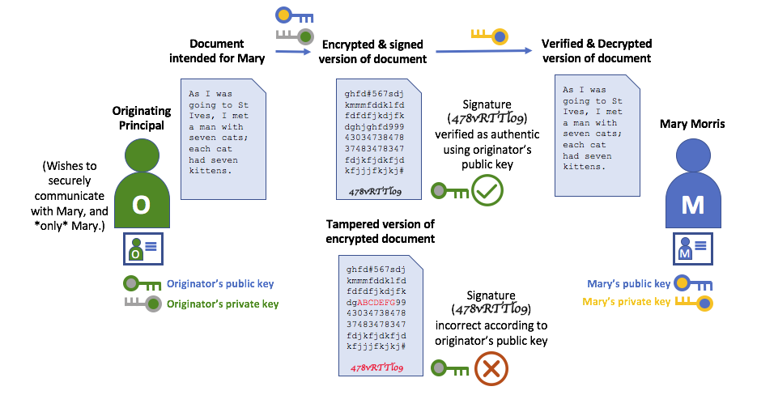
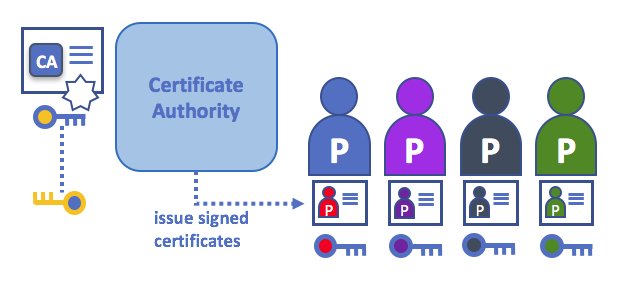

# Identity

Identities really matter in a Hyperledger Fabric blockchain network! That's because the identity of a **principal** -- the users, organizations, or organizational units that use or provide network services -- **determines the exact permissions over resources that they have in a blockchain network**. Most importantly, **a principal's identity must have two qualities** -- it must be **verifiable** (a real identity, in other words), and it must also come from a **trusted** source.

These two identity concepts -- verification and trust -- are provided by a **Public Key Infrastructure** (PKI) and a **Membership Service Provider** (MSP), respectively. A PKI is a set of existing internet standards which provide secure communications for many different types of networks, whereas an MSP (we'll refer to MSPs here but for a deeper conceptual dive click [here](../Membership/Membership.md))is a Hyperledger Fabric concept for managing identities in a blockchain network. In combination, PKIs and MSPs form the definition of the **members** of a blockchain network.

## A simple scenario to explain verification and trust

Imagine that you visit a supermarket to buy some groceries. At the checkout you see a sign that says that only Visa, Mastercard and AMEX cards are accepted. If you try to pay with a different card -- let's call it an "ImagineCard" -- it doesn't matter whether the card is authentic and you have sufficient funds in your account. It will be not be accepted.

*Having a valid credit card is not enough -- it must also be accepted by the store! PKIs and MSPs work together in the same way -- PKI provides a list of valid identities, and an MSP says which of these are members of a given blockchain network.*

PKIs and MSPs provide this combination of verification and trust. A PKI is like a card provider -- it dispenses many different types of verifiable identities. An MSP, on the other hand, is like the list of card providers accepted by the store -- determining which identities are the trusted members of the store payment network. **MSPs turn verifiable identities into the members of a blockchain network**.

Let's drill into these concepts in a little more detail.

## What are PKIs?

**A public key infrastructure (PKI) is a collection of internet technologies that provides secure communications in a network.** It's PKI that puts the **S** in **HTTPS** -- and if you're reading this documentation on a web browser, you're probably using a PKI to make sure it comes from a verified source.

*The elements of Public Key Infrastructure (PKI). A PKI is comprised of Certificate Authorities who issue digital certificates to principals (in this example the principal is a user, but there can be other types of principals), who then use them in conjunction with public and private keys to authenticate and encrypt information. A CA's Certificate Revocation List (CRL) identifies the certificates that are no longer valid (this can happen for a number of reasons. Private material associated with a certificate might have been exposed, for example).*

Although a blockchain network is more than a simple communications network, it makes sense for it to use the PKI standard as much as possible. You'll see that even though PKIs aren't sufficient for all the needs of a blockchain network, it's still the fundamental basis of blockchain security. It's therefore really helpful if you understand the basics of PKI and then why MSPs are so important.

There are four key elements to PKI:

 * **Digital Certificates**
 * **Public and Private Keys**
 * **Certificate Authorities**
 * **Certificate Revocation Lists**

Let's quickly describe these PKI basics, and if you want to know more details, [Wikipedia](./https://en.wikipedia.org/wiki/Public_key_infrastructure) is a good place to start.

## Digital Certificates

A digital certificate is a document which holds a set of attributes relating to a principal's identity. The most common type of certificate is an [X.509 certificate](https://en.wikipedia.org/wiki/X.509), which allows the encoding of a principal's identifying details in its structure. For example, Mary Morris of Mitchell Cars in Detroit, Michigan might have a digital certificate with a `SUBJECT` attribute of `C=US, ST=Michigan, L=Detroit, O=Mitchell Cars, OU=Manufacturing, CN=Mary Morris/UID=123456`. Mary's certificate is similar to her government identity card -- it provides information about Mary which she can use to prove key facts about her. There are many other attributes in an X.509 certificate, but concentrate on just these for now.

*A digital certificate describing a principal called Mary Morris. Mary is the `SUBJECT` of the certificate, and the highlighted `SUBJECT` text shows key facts about Mary. The certificate also holds many more pieces of information, as you can see. Most importantly, Mary's public key is distributed within her certificate, whereas her private key is not. This private key must be kept private.*

What is important is that all of Mary's attributes can be written using a mathematical technique called cryptography (literally, "*secret writing*") so that tampering will invalidate the certificate. Cryptography allows Mary to present her certificate to others to prove her identity so long as the other party trusts the certificate issuer, known as a **Certificate Authority** (CA). As long as the CA keeps certain cryptographic information securely (meaning, its own **private key**), anyone reading the certificate can be sure that the information about Mary has not been tampered with -- it will always have those particular attributes for Mary Morris. Think of Mary's X.509 certificate as a digital identity card that is impossible to change.

## Public keys and private keys

There are two key elements to secure communication -- authentication and encryption, and these are made possible by the idea of public and private keys. **The unique relationship between a public-private key pair is the cryptographic magic that makes secure communications possible**.

Let's first recap the key ideas of authentication and encryption and then you'll see how they are made possible by public-private key pairs.

### Authentication and encryption

**Authentication** ensures that anything that might relate to a principal's identity, or information they generate, is not tampered with. For example, you might want to be sure you're communicating with the real Mary Mitchell rather than an impersonator. Or if Mary has sent you some information, you might want to be sure that it hasn't been changed by anyone else during transmission. In both cases, being able to established authenticity is of primary importance.

**Encryption**, on other hand, is quite different from authentication -- it enables the private transmission of information between Mary and other principals by ensuring that encrypted information can only be decrypted by its intended recipients and no one else.

**To enable authentication and encrypted communications**, a principal can use a pair of mathematically related keys. **One of these keys is public and can be widely shared, while the other key is private and absolutely must not be shared**. The unique mathematical relationship between the keys is such that the private key can be used to transform information that only the public key can interpret, and vice-versa.

### Using Public and Private Keys for Authentication

To authenticate a document, Mary uses her private key to attach a unique data signature to it. The signature is generated by a process called **hashing** in which the content of the document being signed is mathematically combined with Mary's private key to generate a small signature of fixed size. This signature can be verified by other principals in the network using Mary's **public key**.

*Authenticating data using private keys and public keys. Mary's private key is used to sign an original document with the unique signature (`X13vRZQql41`).*

The hashing process doesn't prevent tampering itself, but it does make tampering **obvious** -- without the original document and the private key, it is statistically impossible to generate the same signature.

### Using Public Keys and Private Keys for Encryption

To allow messages to be written in way such that only Mary can read them, Mary's public key can be used by anyone in a PKI to create a secret encoding of data that can only be transformed back to its original form by Mary's private key.

*Encrypting data using private keys and public keys. Any principal in the network who wishes to securely communicate with Mary can use Mary's public key to encrypt a document -- a document that only Mary can decrypt with her private key.*

Only Mary is able to decrypt the message as only she holds her private key -- that's why it's so important that private keys are not shared and remain secure. To prevent the encrypted message from being tampered with it is also signed by the originating principal with their private key. This signature is then checked by Mary (using the principal's public key) before she decrypts it.

If Mary wants to communicate securely back to another party she uses exactly the same process as others use to communicate with her, only using their public key to encrypt the data and her own private key to sign the data.

Again, if an intermediary tries to generate the same signature as the originating principal or Mary would do, it will be statistically impossible without that principal's private key -- again, the mathematics of cryptography at work!

## Certificate Authorities

As you've seen, an identity is brought to the blockchain network by a principal in the form of a cryptographically validated digital certificate issued by a Certificate Authority (CA). CAs are a common part of internet security protocols, and you've probably heard of some of the more popular ones: Symantec (originally Verisign), GeoTrust, DigiCert, GoDaddy, and Comodo, among others.

*A Certificate Authority dispenses certificates to different principals, which they use to authenticate and encrypt information. These certificates are signed by the CA using its private key. A principal's certificate includes their public key, but not their private key, and this applies to the CA's certificate too!*

The digital certificate provided by a CA for a principal incorporates the principal's public key as well as a comprehensive set of their attributes. Crucially, CAs themselves also have a certificate, which they make widely available. This allows the consumers of identities issued by a given CA to verify them by checking that the certificate could only have been generated by the holder of the corresponding private key (the CA). Because every principal who wants to interact with a blockchain needs an identity, you might say that **a CA defines an organization's principals from a digital perspective**. It's the CA that provides the basis for an organization's principals to have a verifiable identity, expressed as a digital certificate.

### Root CAs, Intermediate CAs and Chains of Trust

CAs come in two flavors: **Root CAs** and **Intermediate CAs**. Because Root CAs (Symantec, Geotrust, etc) have to **securely distribute** hundreds of millions of certificates to internet users, it makes sense to spread this process out across what are called *Intermediate CAs*. These Intermediate CAs provide their certificates under the authority of the Root CA, and this linkage between a Root CA and Intermediate CAs establishes a **Chain of Trust** for any certificate that is issued by any CA in the chain. This ability to track back to the Root CA not only allows the function of CAs to scale while still providing security -- allowing organizations that consume certificates to use Intermediate CAs with confidence -- it limits the exposure of the Root CA, which, if compromised, would destroy the entire chain of trust. If an Intermediate CA is compromised, on the other hand, there is a much smaller exposure.

*A chain of trust is established between a Root CA and a set of Intermediate CAs using a simple chain. Many other configurations are possible to meet the needs of collaborating organizations.*

Intermediate CAs provide a huge amount of flexibility when it comes to the issuance of certificates across multiple organizations, and that's very helpful in a permissioned blockchain system. For example, you'll see that different organizations may use different Root CAs, or the same Root CA with different Intermediate CAs -- it really does depend on the needs of the network.

### Fabric CA

It's because CAs are so important that Hyperledger Fabric provides a built-in CA component to allow you to create CAs in the blockchain networks you form. You don't have to use the Fabric CA, but you will find it very helpful when you're starting to build a blockchain network for the first time.

If you're interested, you can read a lot more about fabric-ca [in the CA documentation section](./http://hyperledger-fabric-ca.readthedocs.io/en/latest/).

## Certificate Revocation Lists

A Certificate Revocation List (CRL) is easy to understand -- it's just a list of certificates that a CA knows to be revoked for one reason or another. If you recall the store scenario, a CRL would be like a list of stolen credit cards.

When a third party wants to verify a principal's identity, it first checks the issuing CA's CRL to make sure that the certificate has not been declared invalid. A verifier doesn't have to check the CRL, but if they don't they run the risk of accepting a compromised identity.

*Using a CRL to check that a certificate is still valid. If an impersonator tries to pass a compromised digital certificate to a validating principal, it can be first checked against the issuing CA's CRL to make sure it's not listed as no longer valid.*

Note that a certificate being revoked is very different from a certificate expiring. Revoked certificates have not expired -- they are, by every other measure, a fully valid certificate. For more in depth information into CRLs, click [here](./https://hyperledger-fabric-ca.readthedocs.io/en/latest/users-guide.html#generating-a-crl-certificate-revocation-list).

Now that you've seen how a PKI can provide verifiable identities through a chain of trust, the next step is to see how these identities can be used to represent the trusted members of a blockchain network. That's where a Membership Service Provider (MSP) comes into play -- **it identifies the principals who are the members of a given organization in the blockchain network**.

To learn more about membership, check out the conceptual documentation on [MSPs](./Membership/Membership.md).

<!---
Licensed under Creative Commons Attribution 4.0 International License
   https://creativecommons.org/licenses/by/4.0/
-->
