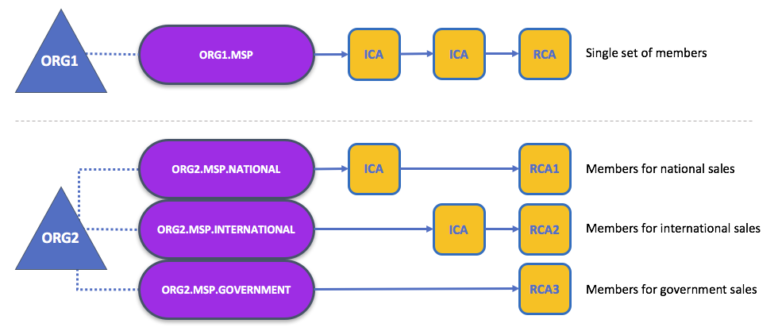

# Membership

If you've read through the documentation on [Identity](./identity/identity.md) you've seen how a PKI can provide verifiable identities through a chain of trust. Now let's see how these identities can be used to represent the trusted members of a blockchain network. This is where a **Membership Service** Provider (MSP) comes into play -- **it identifies the principals who are the members of a given organization in the blockchain network**.

Whereas a PKI provides a verifiable identity, an MSP complements this by identifying which Root CAs and Intermediate CAs are trusted to define the principals who are considered members of an organization. An MSP can also recognize other things related to membership of a network -- a list of identities that have been revoked, for example -- but those things will be covered later. For now, **think of an MSP as providing a list of administrators of a given organization**, with the MSP either holding certificates itself or by listing which CAs can issue valid certificates, or -- as will usually be the case -- through some combination of both.

If an MSP is defined on the local file system of a peer node, orderer node, or user (client application or administrator), it is a **Local MSP**. If it's found in the policy configuration of the network or each channel, it is a **Global MSP**. You'll hear more about local and global MSPs and why the distinction between them is important later.

### Mapping MSPs to Organizations

An organization is a managed group of members and can be something as big as a multinational corporation or as small as a flower shop. What's most important about organizations (or **orgs**) is that they will usually manage their members under a single MSP. Note that this is different from the concept of an X.509 organization, which we'll talk about later.

The exclusive relationship between an organization and its MSP makes it sensible to name the MSP after the organization, a convention you'll find adopted in most policy configurations. For example, organization `ORG1` would have an MSP called `ORG1.MSP`. In some cases an organization may require multiple membership lists -- for example, where channels are used to perform very different business functions with other organizations. In these cases it makes sense to have multiple MSPs and name them accordingly, e.g., `ORG2.MSP.NATIONAL` and `ORG2.MSP.GOVERNMENT`, reflecting the different membership roots of trust within `ORG2` in the NATIONAL sales channel compared to the GOVERNMENT regulatory channel.

*Two different MSP configurations for an organization. The first configuration shows the typical MSP relationship -- a single MSP defines the list of verifiable members of an organization. In the second configuration, different MSPs are used to support different identity providers for national, international, and governmental memberships.*

#### Organizational Units and MSPs

An organization is often divided up into multiple **organizational units** (OUs), each of which has a certain set of responsibilities. For example, the `MITCHELL` organization might have both `MITCHELL.MANUFACTURING` and `MITCHELL.DISTRIBUTION` OUs to reflect these separate lines of business. When a CA issues X.509 certificates, the `OU` field in the certificate specifies the line of business to which the identity belongs.

We'll see later how OUs can be helpful to control the parts of an organization who are considered to be the members of a blockchain network. For example, only identities from the `MITCHELL.MANUFACTURING` OU might be able to access a channel, whereas `MITCHELL.DISTRIBUTION` cannot.

Finally, though this is a slight misuse of OUs, they can sometimes be used by *different* organizations in a consortium to identify each other. In such cases, the different organizations use the same Root CAs and Intermediate CAs for their chain of trust, but assign the `OU` field appropriately to identify membership of each organization. We'll also see how to configure MSPs to achieve this later.

### Local and Global MSPs

There are two different types of MSPs: local and global. **Local MSPs are defined for nodes** (peer or orderer) and **users** (administrators that use the CLI or client applications that use the SDK). **Every node and user must have a local MSP defined**.

In contrast, **global MSPs are defined either for channels or the entire network**, and they apply to all of the nodes that are part of a channel or network. Every channel or network must have at least one MSP defined for it, and peers and orderers on a channel will all share the same global MSP. The key difference here between local and global MSPs is not how they function, but their **scope**.

*Local and Global MSPs. The MSPs for the peers are local, whereas the MSPs for the channel are global. Each peer is managed by its own organization, ORG1 or ORG2. This channel is managed by both ORG1 and ORG2. Similar principles apply for the network, orderers, and users, but these are not shown here for simplicity.*

You can see that **local MSPs are only defined on the file system of the node or user** to which they apply. Therefore, physically and logically there is only one local MSP per node or user. However, as **global MSPs apply to all nodes in a channel or network**, they are logically defined once for the network or the channel. However, **a global MSP is instantiated on the file system of every node and kept synchronized via consensus**. So while there is a copy of a global MSP on the local file system of every node, logically the global MSP exists on the channel or the network.

You may find it helpful to see how local and global MSPs are used by seeing what happens when a blockchain administrator installs and instantiates a smart contract, as shown in the [diagram above](MSP2).

An administrator `B` connects to the peer with an identity issued by `RCA1` and stored in their local MSP. When `B` tries to install a smart contract on the peer, the peer checks its local MSP, `ORG1.MSP`, to verify that the identity of `B` is indeed a member of `ORG1`. A successful verification will allow the install command to complete successfully. Subsequently, `B` wishes to instantiate the smart contract on the channel. Because this is a channel operation, all organizations in the channel must agree to it. Therefore, the peer must check the global MSP in the channel policy before it can successfully complete this command.  (Other things must happen too, but concentrate on the above for now.)

You can see that the channel and the ledger are really **logical constructs** when they are defined at the channel level. It is only when they are instantiated on a peer's local filesystem and managed by it that they become physical. It's really important to understand how concepts like global MSPs, channel policies and even the ledger itself are **defined at the channel level, but instantiated and managed on the peers** of the different organizations in the channel.

### MSP Levels

The split between global and local MSPs reflects the needs of organizations to administer their local resources, such as a peer or orderer nodes, and their global resources, such as ledgers, smart contracts, and consortia, which operate at the channel or network level. It's helpful to think of these MSPs as being at different **levels**, with **MSPs at a higher level relating to network administration concerns** while **MSPs at a lower level handle identity for the administration of private resources**. This tiering is helpful because it supports the mix of both broad and narrow administrative control depending on how the network needs to be constituted. MSPs are mandatory at every level of administration -- they must be defined for the network, channel, peer, orderer and users.

*MSP Levels. The MSPs for the peer and orderer are local, whereas the MSPs for the channel and network are global. Here, the network is administered by ORG1, but the channel can be managed by ORG1 and ORG2. The peer is managed by ORG2, whereas ORG1 manages the orderer. ORG1 trusts identities from RCA1, whereas ORG2 trusts identities from RCA2. Note that these are administration identities, reflecting who can administer these components. So while ORG1 administers the network, ORG2.MSP does exist in the network definition.*

 * **Network MSP:** The configuration policy of a network has two parts when it comes to members. Firstly, it identifies who members are (through an MSP definition of how principals become members). And secondly, it defines what members can do in the network. It will also specify particular organizations as having administrative control over the network, permitting its members to perform administrative tasks (such as creating a channel).

 * **Channel MSP:** Just as the MSPs of the network are held in the configuration policy of the network, the configuration policy of the channels are held in each channel. It is helpful for a channel to have its own set of MSPs because a channel provides private communications between a particular set of organizations which in turn have administrative control over it. You can see that the need for **a separate set of channel MSPs stems from the need for local autonomy** -- the organizations in a channel can, and will often need to be, largely independent from the rest of the network. It also means that administrative control over the network doesn't necessarily imply control over any particular channel; again reflecting the real administrative needs of collaborating organizations who may sometimes require separation of control. We see this kind of separation at the levels of control in the real world, too. The authority of the President of the United States, for example, exists at the federal level. He or she has no authority to veto state laws.

 * **Peer MSP:** This local MSP is defined on the file system of each peer. Conceptually, it performs exactly the same function as global MSPs with the restriction that it only applies to the peer where it is defined. As peers are owned by a particular organization and connect  applications from that organization to the ledger, there is only a single MSP for a peer. It's possible to specify multiple CAs in this MSP, but in practice a local MSP will usually refer to fewer CAs than a set of global MSPs. An example of a peer permission might be the ability to install or upgrade smart contract chaincode on that peer.

 * **Orderer MSP:** Like a peer MSP, an orderer local MSP is also defined on the file system of the node and only applies to that node. Like peer nodes, orderers are also owned by a single organization and therefore have a single MSP to list the principals it trusts, though again it's possible to specify multiple Root CAs.

### MSP Structure

So far, you've seen that the two most important elements of an MSP are the identification of the root and intermediate CAs that are used to used to establish a principal's membership of an organization. There are, however, more elements that are used in conjunction with these two to assist with membership functions.

*The figure above shows how a local MSP is stored on a local filesystem. Even though global MSPs are not physically structured in exactly this way, it's still a helpful way to think about them.*

As you can see, there are nine elements to an MSP. It's easiest to think of these elements in a directory structure, where the MSP name is the root folder name with each subfolder representing different elements of an MSP.

Let's describe these folders in a little more detail and see why they are important.

 * **Root CAs:** This folder contains a list of self-signed X.509 certificates of the Root CAs trusted by this organization. There must be at least one Root CA X.509 certificate in this MSP folder.

 This is the most important folder because it identifies the CAs from which all other certificates must be derived to be considered members of this organization.

 * **Intermediate CAs:** This folder contains a list of X.509 certificates of the Intermediate CAs trusted by this organization. Each certificate must be signed by one of the Root CAs in the MSP or by an Intermediate CA -- or a chain of ICAs -- that ultimately lead back to a trusted Root CA. It is possible to have a functioning network that does not have any Intermediate CAs, in which case this folder would be empty. However, this is not a best practice.

 Like the Root CA folder, this folder defines the CAs from which certificates must be issued to be considered members of the organization. It's slightly less important than the Root CA folder, because it's not the **root** of trusted membership.

 * **Organizational Units (OUs):** These are listed in the `$FABRIC_CFG_PATH/msp/config.yaml` file and contain a list of organizational units that are considered to be part of the MSP. This is particularly useful when you want to restrict membership to only those principals who are part of a particular organization (as will be the case when an organization has a rich structure).

 Specifying OUs is optional. If no OUs are listed, all of the principals that are part of an MSP -- as identified by the Root CA and Intermediate CA folders -- will be considered members of the organization.

 * **Administrators:** This folder contains a list of X.509 certificates that define the principals who have the role of administrators of this organization. Typically there should be one or more certificates in this list.  

 It's worth noting that just because a principal has the role of an administrator it doesn't mean that they can administer particular resources! This seems strange, but will make more sense after you learn about the nature of policy permissions and how those permissions -- and not a principal's "role" -- are what define what any given organization's administrators can actually do. For example, a channel policy might specify that `MITCHELL.MANUFACTURING` administrators have the rights to add new organizations to the channel, whereas the `MITCHELL.DISTRIBUTION` administrators have no such rights.

 Even though an X.509 certificate has a `ROLE` attribute (specifying, for example, that a principal is an `admin`), this refers to a principal's role within its organization rather than on the blockchain network. This is distinctly different from the purpose of the `OU` attribute, which -- if it has been defined -- refers to a principal's place in the network. Indeed, this is why we need the Administrators folder - because the blockchain role is quite different to the X.509 `ROLE`.

 The `ROLE` attribute **can** be used to confer administrative rights at the channel level if the policy for that channel has been written to allow any administrator from an organization (or certain organizations) permission to perform certain channel functions (such as instantiating chaincode). In this way, an organization role can confer a network role. This is conceptually similar to how having a driver's license issued by the US state of Florida entitles someone to drive in every state in the US. This is how `ROLE` of have a driver's license has been structured. Compare this to being a lawyer, where to practice
 law in a state you must pass the bar exam for that specific state.

 * **Revoked Certificates:** If the X.509 certificate of a principal has been revoked, identifying information about the cert -- not the cert itself -- is held in this folder. These identifiers -- known as a Subject Key Identifier (SKI) and Authority Access Identifier (AKI) -- are checked whenever a certificate is being used to make sure the certificate is still valid.

 This list is conceptually the same as a CA's Certificate Revocation List (CRL), but relates to revocation of membership from the organization rather than revocation from the CA. As a result, the administrator of an MSP, local or global, can quickly revoke a principal from an organization without having to resort to revoking their certificate from a CA -- which, of course, might not be appropriate.

 This "list of lists" is optional. It will only become populated as certificates are revoked.

 * **Signing Certificate:** This folder contains the **public X.509 certificate** used by a node or user when they need to identify themselves to another principal in the network. This is the certificate a peer places in a transaction proposal response, for example, to indicate that a peer's organization has endorsed it -- which can subsequently be checked against an endorsement policy (containing the organizations that must endorse a transaction) by a validating node.

 This folder is mandatory for local MSPs, and there must be exactly one X.509 certificate for the node. It is not used for global MSPs.

 * **KeyStore for Private Key:** This folder is defined for the local MSP of a peer or orderer node (or in a user's local MSP), and contains the **private key**. This key is used to sign or encrypt data -- for example to sign a transaction proposal response, indicating that a peer's organization has endorsed it.

 This folder is mandatory for local MSPs, and must contain exactly one private key. Obviously, access to this folder must be limited only to those operators administrators who have responsibility for local MSPs.

 For **global MSPs**, do not include this folder or any private keys, as by their nature they are shared across the network or channel.

 * **TLS Root CA:** This folder contains a list of self-signed X.509 certificates of the Root CAs trusted by this organization **for TLS communications**. An example of a TLS communication would be when a peer needs to connect to an orderer so that it can receive ledger updates.

 MSP TLS information relates to the principals inside the network -- the peers and the orderers -- rather than those that consume the network -- applications and administrators.

 There must be at least one TLS Root CA X.509 certificate in this MSP folder.

 * **TLS Intermediate CA:** This folder contains a list of X.509 certificates of the Intermediate CAs trusted by this organization **for TLS communications**.

 By analogy to the TLS Root CA folder, this folder is kept separate to the MSP Intermediate CA folder for the same reason. There do not need any Intermediate CA X.509 certificates in this MSP folder -- they are optional.

 For more information on TLS, click [here](./http://hyperledger-fabric.readthedocs.io/en/latest/enable_tls.html).

## That's it!

If you've read this doc as well as our doc on [Identity](./identity/identity.md), you should have a pretty good grasp of how identities and membership work in Hyperledger Fabric. You've seen how a PKI and MSPs are used to identify the principals collaborating in a blockchain network. You've learned how certificates, public/private keys, and roots of trust work, in addition to how MSPs are physically and logically structured.

<!---
Licensed under Creative Commons Attribution 4.0 International License https://creativecommons.org/licenses/by/4.0/
-->

