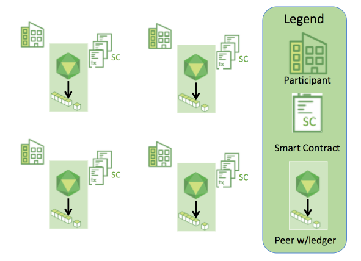
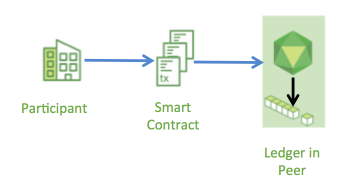
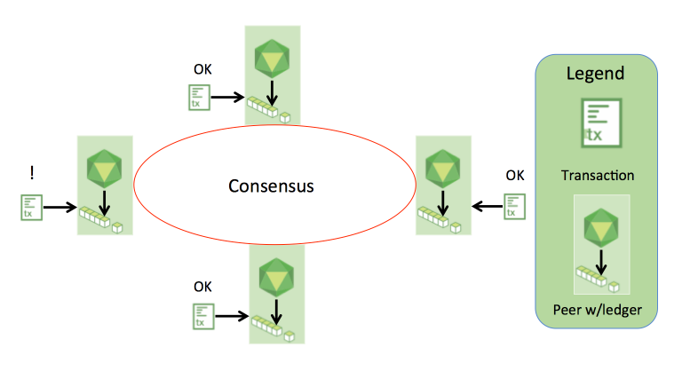
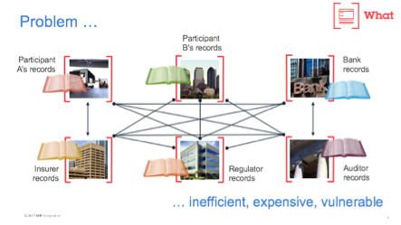
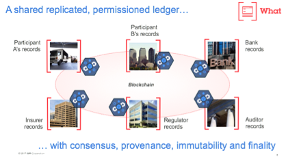
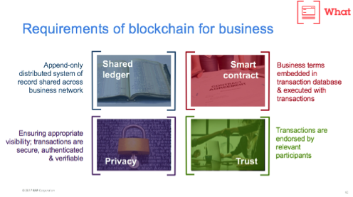
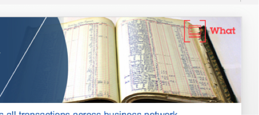
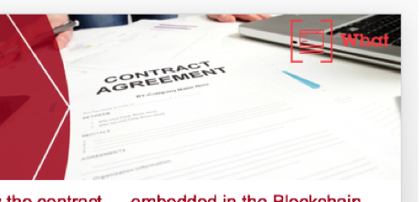

Introduction
============
This section provides an introduction to blockchain that will allow you to
quickly determine whether it might be useful for you or your business. It also
explains the characteristics of the Hyperledger Fabric blockchain and suggests
some ways to increase your knowledge and understanding.

What is a Blockchain?
---------------------
**A Distributed Ledger**

At the heart of a blockchain network is a distributed ledger that records all
the transactions that take place on the network.

A blockchain ledger is often described as **decentralized** because it is replicated
across many network participants, each of whom **collaborate** in its maintenance.
We’ll see that decentralization and collaboration are powerful attributes that
mirror the way businesses exchange goods and services in the real world.

In addition to being decentralized and collaborative, the information recorded
to a blockchain is append-only, using cryptographic techniques that guarantee
that once a transaction has been added
to the ledger it cannot be modified. This property of immutability makes it
simple to determine the provenance of information because participants can be
sure information has not been changed after the fact. It’s why blockchains
are sometimes described as **systems of proof**.

 
**Smart Contracts**

To support the consistent update of information – and to enable a whole host of
ledger functions (transacting, querying, etc) – a blockchain network uses **smart
contracts** to provide controlled access to the ledger.

Smart contracts are not only a key mechanism for encapsulating information
and keeping it simple across the network, they can also be written to allow
participants to execute certain aspects of transactions automatically.

A smart contract can, for example, be written to stipulate the cost of shipping
an item that changes depending on when it arrives. With the terms agreed to
by both parties and written to the ledger, the appropriate funds change hands
automatically when the item is received.

**Consensus**

The process of keeping the ledger transactions synchronized across the network –
to ensure that ledgers only update when transactions are approved by the appropriate
participants, and that when ledgers do update, they update with the
same transactions in the same order – is called **consensus**.

We’ll learn a lot more about ledgers, smart contracts and consensus later. For
now, it’s enough to think of a blockchain as a shared, replicated transaction
system which is updated via smart contracts and kept consistently
synchronized through a collaborative process called consensus.

Why is a Blockchain useful?
---------------------------

**Today’s Systems of Record**

The transactional networks of today are little more than slightly updated
versions of networks that have existed since business records have been kept.
The members of a **Business Network** transact with each other, but they maintain
separate records of their transactions. And the things they’re transacting –
whether it’s Flemish tapestries in the 16th century or the securities of today
– must have their provenance established each time they’re sold to ensure that
the business selling an item possesses a chain of title verifying their
ownership of it.

What you’re left with is a business network that looks like this:

Modern technology has taken this process from stone tablets and paper folders
to hard drives and cloud platforms, but the underlying structure is the same.
Unified systems for managing the identity of network participants do not exist,
establishing provenance is so laborious it takes days to clear securities
transactions (the world volume of which is numbered in the many trillions of
dollars), contracts must be signed and executed manually, and every database in
the system contains unique information and therefore represents a single point
of failure.

It’s impossible with today’s fractured approach to information and
process sharing to build a system of record that spans a business network, even
though the needs of visibility and trust are clear.

**The Blockchain Difference**

What if instead of the rat’s nest of inefficiencies represented by the “modern”
system of transactions, business networks had standard methods for establishing
identity on the network, executing transactions, and storing data? What
if establishing the provenance of an asset could be determined by looking
through a list of transactions that, once written, cannot be changed, and can
therefore be trusted?

That business network would look more like this:

This is a blockchain network. Every participant in it has their own replicated
copy of the ledger. In addition to ledger information being shared, the processes
which update the ledger are also shared. Unlike today’s systems, where a
participant’s **private** programs are used to update their **private** ledgers,
a blockchain system has **shared** programs to update **shared** ledgers.

With the ability to coordinate their business network through a shared ledger,
blockchain networks can reduce the time, cost, and risk associated with private information and
processing while improving trust and visibility.

You now know what blockchain is and why it’s useful. There are a lot of other
details that are important, but they all relate to these fundamental ideas of
the sharing of information and processes.

What is Hyperledger Fabric?
---------------------------

The Linux Foundation founded the Hyperledger Project in 2015 to advance
cross-industry blockchain technologies. Rather than declaring a single
blockchain standard, it encourages a collaborative approach to developing
blockchain technologies via a community process, with intellectual property
rights that encourage open development and the adoption of key standards over
time.

Hyperledger Fabric is a one of the blockchain projects within Hyperledger.
Like other blockchain technologies, it has a ledger, uses smart contracts,
and is a system by which participants manage their transactions.

Where Hyperledger Fabric breaks from some other blockchain systems is that
it is **private** and **permissioned**. Rather than the “proof of work” some 
blockchain networks use to verify identity (allowing anyone who meets those 
criteria to join the network), the members of a Fabric network enroll through 
a **membership services provider**.

Fabric also offers several pluggable options. Ledger data can be stored in
multiple formats, consensus mechanisms can be switched in and out,
and different membership service providers are supported.

Fabric also offers the ability to create **channels**, allowing a group of
participants to create a separate ledger of transactions. This is an especially
important option for networks where some participants might be competitors and not
want every transaction they make - a special price they're offering to some participants
and not others, for example - known to every participant. If two
participants form a channel, then those participants – and no others – have copies
of the ledger for that channel.

The following diagram outlines the four building blocks of Hyperledger Fabric:

**Shared Ledger**

Hyperledger Fabric has a ledger subsystem comprising two components: the **world
state** and the **transaction log**. Each participant has a copy of the ledger to
every Fabric network they belong to.

The world state component describes the state of the ledger at a given point
in time. It’s the database of the ledger. The transaction log component records
all transactions which have resulted in the current value of the world state.
It’s the update history for the world state. The ledger, then, is a combination
of the world state database and the transaction log history.

The ledger has a replaceable data store for the world state. By default, this
is a LevelDB key-value store database. The transaction log does not need to be
pluggable. It simply records the before and after values of the ledger database
being used by the blockchain network.

**Smart Contracts**

Hyperledger Fabric smart contracts are written in **chaincode** and are invoked
by an application external to the blockchain when that
application needs to interact with the ledger. In most cases chaincode only
interacts with the database component of the ledger, the world state (querying
it, for example), and not the transaction log.

You can write chaincode in several programming languages. Currently supported
languages include GOLANG and Java with others coming soon.

**Privacy**

Depending on the needs of a network, participants in a Business-to-Business
(B2B) network might be extremely sensitive about how much information they share.
For other networks, privacy will not be a top concern.

Hyperledger Fabric supports networks where privacy (using channels) is a key
operational requirement as well as networks that are comparatively open.

**Consensus**

Transactions must be written to the ledger in the order in which they occur,
even though they might be between different sets of participants within the
network. For this to happen, the order of transactions must be established
and a method for rejecting bad transactions that have been inserted into the
ledger in error (or maliciously) must be put into place.

This is a thoroughly researched area of computer science, and there are many
ways to achieve it, each with different trade-offs. For example, PBFT (Practical
Byzantine Fault Tolerance) can provide a mechanism for file replicas to
communicate with each other to keep each copy consistent, even in the event
of corruption. Alternatively, in Bitcoin, ordering happens through a process
called mining where competing computers race to solve a cryptographic puzzle
which defines the order that all processes subsequently build upon.

Hyperledger Fabric has been designed to allow network starters to choose a
consensus mechanism that best represents the relationships that exist between
participants. As with privacy, there is a spectrum of needs; from networks
that are highly structured in their relationships to those that are more 
peer-to-peer.

We’ll learn more about the Hyperledger Fabric consensus mechanisms, which
currently include SOLO, Kafka, and will soon extend to SBFT (Simplified
Byzantine Fault Tolerance), in another document.

Where can I learn more?
-----------------------

:doc:`getting_started`

Where you learn how to set up a sample network on your local machine. You’ll be
introduced to most of the key components within a blockchain network, learn
more about how they interact with each other, and then you’ll actually get the
code and run some simple query and update transactions.

:doc:`fabric_model`

A deeper look at the components and concepts brought up in this introduction as
well as a few others and describes how they work together in a sample
transaction flow.

:doc:`marbles`

Where you can learn how to write a sample smart contract in GOLANG and invoke
it from an application written in JavaScript. You’ll become comfortable with
the key APIs used by both smart contract developers and application developers
and ready to write your own application using the Hyperledger Fabric API
reference information.

Designing a Business Network (coming soon)

Takes you through how to design a business network using a standard process.
You’ll start by defining the business network and identify the participants
and the goods and services that move between them. You’ll think about the key
lifecycles and how they are impacted by the activities of the key participants.
By the time you’re through, you’ll be ready to start working with key
stakeholders in your company to design a business network that uses Hyperledger
Fabric.

:doc:`planning_guide`

Deals with the practical concerns of setting up and managing a production
Hyperledger Fabric blockchain. You’ll understand the key factors to consider
when planning a blockchain solution, such as compute, storage and network
requirements. You’ll also understand the key non-functional requirements,
including maintainability, performance, availability and disaster recovery.
