# Fabric chaincode lifecycle

## What is Chaincode?

Chaincode is a program, written in [Go](https://golang.org), [Node.js](https://nodejs.org),
or [Java](https://java.com/en/) that implements a prescribed interface.
Chaincode runs in a secured Docker container isolated from the endorsing peer
process. Chaincode initializes and manages ledger state through transactions
submitted by applications.

A chaincode typically handles business logic agreed to by members of the
network, so it may be considered as a "smart contract". Ledger updates created
by a chaincode are scoped exclusively to that chaincode and can't be accessed
directly by another chaincode. However, within the same network, given the
appropriate permission a chaincode may invoke another chaincode to access
its state.

In this concept topic, we will explore chaincode through the eyes of a
blockchain network operator rather than an application developer. Chaincode
operators can use this topic as a guide to how to use the Fabric chaincode
lifecycle to deploy and manage chaincode on their network.

## Deploying a chaincode

The Fabric chaincode lifecycle is a process that allows multiple organizations
to agree on how a chaincode will be operated before it can be used on a channel.
A network operator would use the Fabric lifecycle to perform the following tasks:

- [Install and define a chaincode](#install-and-define-a-chaincode)
- [Upgrade a chaincode](#upgrade-a-chaincode)
- [Deployment Scenarios](#deployment-scenarios)
- [Migrate to the new Fabric lifecycle](#migrate-to-the-new-fabric-lifecycle)

You can use the Fabric chaincode lifecycle by creating a new channel and setting
the channel capabilities to V2_0. You will not be able to use the old lifecycle
to install, instantiate, or update a chaincode on channels with V2_0 capabilities
enabled. However, you can still invoke chaincode installed using the previous
lifecycle model after you enable V2_0 capabilities. If you are upgrading from a
v1.4.x network and need to edit your channel configurations to enable the new
lifecycle, check out [Enabling the new chaincode lifecycle](./enable_cc_lifecycle.html).

## Install and define a chaincode

Fabric chaincode lifecycle requires that organizations agree to the parameters
that define a chaincode, such as name, version, and the chaincode endorsement
policy. Channel members come to agreement using the following four steps. Not
every organization on a channel needs to complete each step.

1. **Package the chaincode:** This step can be completed by one organization or
  by each organization.
2. **Install the chaincode on your peers:** Every organization that will use the
  chaincode to endorse a transaction or query the ledger needs to complete this
  step.
3. **Approve a chaincode definition for your organization:** Every organization
  that will use the chaincode needs to complete this step. The chaincode
  definition needs to be approved by a sufficient number of organizations
  to satisfy the channel's LifecycleEndorsement policy (a majority, by default)
  before the chaincode can be started on the channel.
4. **Commit the chaincode definition to the channel:** The commit transaction
  needs to be submitted by one organization once the required number of
  organizations on the channel have approved. The submitter first collects
  endorsements from enough peers of the organizations that have approved, and
  then submits the transaction to commit the chaincode definition.

This topic provides a detailed overview of the operations of the Fabric
chaincode lifecycle rather than the specific commands. To learn more about how
to use the Fabric lifecycle using the Peer CLI, see the
[Deploying a smart contract to a channel tutorial](deploy_chaincode.html)
or the [peer lifecycle command reference](commands/peerlifecycle.html).

### Step One: Packaging the smart contract

Chaincode needs to be packaged in a tar file before it can be installed on your
peers. You can package a chaincode using the Fabric peer binaries, the Node
Fabric SDK, or a third party tool such as GNU tar. When you create a chaincode
package, you need to provide a chaincode package label to create a succinct and
human readable description of the package.

If you use a third party tool to package the chaincode, the resulting file needs
to be in the format below. The Fabric peer binaries and the Fabric SDKs will
automatically create a file in this format.
- The chaincode needs to be packaged in a tar file, ending with a `.tar.gz` file
  extension.
- The tar file needs to contain two files (no directory): a metadata file
  "metadata.json" and another tar "code.tar.gz" containing the chaincode files.
- "metadata.json" contains JSON that specifies the
  chaincode language, code path, and package label. You can see an example of
  a metadata file below:
  ```
  {"Path":"fabric-samples/asset-transfer-basic/chaincode-go","Type":"golang","Label":"basicv1"}
  ```

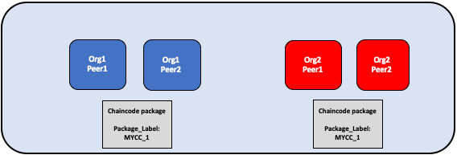

*The chaincode is packaged separately by Org1 and Org2. Both organizations use
MYCC_1 as their package label in order to identify the package using the name
and version. It is not necessary for organizations to use the same package
label.*

### Step Two: Install the chaincode on your peers

You need to install the chaincode package on every peer that will execute and
endorse transactions. Whether using the CLI or an SDK, you need to complete this
step using your **Peer Administrator**. Your peer will build the chaincode
after the chaincode is installed, and return a build error if there is a problem
with your chaincode. It is recommended that organizations only package a chaincode
once, and then install the same package on every peer that belongs to their org.
If a channel wants to ensure that each organization is running the same chaincode,
one organization can package a chaincode and send it to other channel members
out of band.

A successful install command will return a chaincode package identifier, which
is the package label combined with a hash of the package. This package
identifier is used to associate a chaincode package installed on your peers with
a chaincode definition approved by your organization. **Save the identifier**
for next step. You can also find the package identifier by querying the packages
installed on your peer using the Peer CLI.

  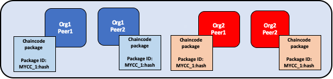

*A peer administrator from Org1 and Org2 installs the chaincode package MYCC_1
on the peers joined to the channel. Installing the chaincode package builds the
chaincode and creates a package identifier of MYCC_1:hash.*

### Step Three: Approve a chaincode definition for your organization

The chaincode is governed by a **chaincode definition**. When channel members
approve a chaincode definition, the approval acts as a vote by an organization
on the chaincode parameters it accepts. These approved organization definitions
allow channel members to agree on a chaincode before it can be used on a channel.
The chaincode definition includes the following parameters, which need to be
consistent across organizations:

- **Name:** The name that applications will use when invoking the chaincode.
- **Version:** A version number or value associated with a given chaincodes
  package. If you upgrade the chaincode binaries, you need to change your
  chaincode version as well. Versions may contain any characters,
  but it is typical to use a format such as `v1.2.3`. The version is not checked by the peer,
  it is only an indicator intended to help organizations coordinate as they update their chaincode logic.
- **Sequence:** The number of times the chaincode has been defined on a channel. This value
  is an integer, and is used to keep track of chaincode upgrades. For example,
  when you first approve and commit a chaincode definition on a channel, the sequence number
  must be set to 1. When you next upgrade the chaincode or update the chaincode definition,
  increment the sequence number to 2. The sequence number is used by the peer to
  ensure that all organizations stay in sync regarding the chaincode definitions that they approve and commit.
- **Endorsement Policy:** Which organizations need to execute and validate the
  transaction output. The endorsement policy can be expressed as a string passed
  to the CLI, or it can reference a policy in the channel config. By
  default, the endorsement policy is set to ``Channel/Application/Endorsement``,
  which defaults to require that a majority of organizations in the channel
  endorse a transaction.
- **Collection Configuration:** The path to a private data collection definition
  file associated with your chaincode. For more information about private data
  collections, see the [Private Data architecture reference](https://hyperledger-fabric.readthedocs.io/en/{RTD_TAG}/private-data-arch.html).
- **ESCC/VSCC Plugins:** The name of a custom endorsement or validation
  plugin to be used by this chaincode.
- **Initialization:** If you use the low level APIs provided by the Fabric Chaincode
  Shim API, your chaincode needs to contain an `Init` function that is used to
  initialize the chaincode. This function is required by the chaincode interface,
  but does not necessarily need to invoked by your applications. When you approve
  a chaincode definition, you can specify whether `Init` must be called prior to
  Invokes. If you specify that `Init` is required, Fabric will ensure that the `Init`
  function is invoked before any other function in the chaincode and is only invoked
  once. Requesting the execution of the `Init` function allows you to implement
  logic that is run when the chaincode is initialized, for example to set some
  initial state. You will need to call `Init` to initialize the chaincode every
  time you increment the version of a chaincode, assuming the chaincode definition
  that increments the version indicates that `Init` is required.

  If you are using the Fabric peer CLI, you can use the `--init-required` flag
  when you approve and commit the chaincode definition to indicate that the `Init`
  function must be called to initialize the new chaincode version. To call `Init`
   using the Fabric peer CLI, use the `peer chaincode invoke` command and pass the
  `--isInit` flag.

  If you are using the Fabric contract API, you do not need to include an `Init`
  method in your chaincode. However, you can still use the `--init-required` flag
  to request that the chaincode be initialized by a call from your applications.
  If you use the `--init-required` flag, you will need to pass the `--isInit` flag
  or parameter to a chaincode call in order to initialize the chaincode every time
  you increment the chaincode version. You can pass `--isInit` and initialize the
  chaincode using any function in your chaincode.

  Note that in most scenarios it is recommended to embed initialization logic into chaincode rather than use the chaincode lifecycle mechanism described above.
  Chaincode functions often perform checks against existing state, and initialization state can be implemented like any other chaincode state and be checked in subsequent chaincode function calls.
  Handling initialization state within chaincode logic rather than with the chaincode lifecycle
  mechanism has the benefit that you are not limited to a single initialization function,
  rather you are in full control of initialization logic and can call your own
  functions that initialize state from an application consistent with how all other application functions are called.

The chaincode definition also includes the **Package Identifier**. This is a
required parameter for each organization that wants to use the chaincode. The
package ID does not need to be the same for all organizations. An organization
can approve a chaincode definition without installing a chaincode package or
including the identifier in the definition.

Each channel member that wants to use the chaincode needs to approve a chaincode
definition for their organization. This approval needs to be submitted to the
ordering service, after which it is distributed to all peers. This approval
needs to be submitted by your **Organization Administrator**. After the approval
transaction has been successfully submitted, the approved definition is stored
in a collection that is available to all the peers of your organization. As a
result you only need to approve a chaincode for your organization once, even if
you have multiple peers.

  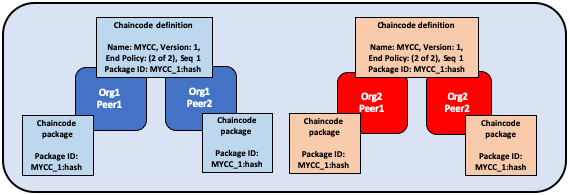

*An organization administrator from Org1 and Org2 approve the chaincode definition
of MYCC for their organization. The chaincode definition includes the chaincode
name, version, and the endorsement policy, among other fields. Since both
organizations will use the chaincode to endorse transactions, the approved
definitions for both organizations need to include the packageID.*

### Step Four: Commit the chaincode definition to the channel

Once a sufficient number of channel members have approved a chaincode definition,
one organization can commit the definition to the channel. You can use the
``checkcommitreadiness`` command to check whether committing the chaincode
definition should be successful based on which channel members have approved a
definition before committing it to the channel using the peer CLI. The commit
transaction proposal is first sent to the peers of channel members, who query the
chaincode definition approved for their organizations and endorse the definition
if their organization has approved it. The transaction is then submitted to the
ordering service, which then commits the chaincode definition to the channel.
The commit definition transaction needs to be submitted as the **Organization**
**Administrator**.

The number of organizations that need to approve a definition before it can be
successfully committed to the channel is governed by the
``Channel/Application/LifecycleEndorsement`` policy. By default, this policy
requires that a majority of organizations in the channel endorse the transaction.
The LifecycleEndorsement policy is separate from the chaincode endorsement
policy. For example, even if a chaincode endorsement policy only requires
signatures from one or two organizations, a majority of channel members still
need to approve the chaincode definition according to the default policy. When
committing a channel definition, you need to target enough peer organizations in
the channel to satisfy your LifecycleEndorsement policy. You can learn more
about the Fabric chaincode lifecycle policies in the [Policies concept topic](policies/policies.html).

You can also set the ``Channel/Application/LifecycleEndorsement`` policy to be a
signature policy and explicitly specify the set of organizations on the channel
that can approve a chaincode definition. This allows you to create a channel where
a select number of organizations act as chaincode administrators and govern the
business logic used by the channel. You can also use a signature policy if your
channel has a large number Idemix organizations, which cannot approve
chaincode definitions or endorse chaincode and may prevent the channel from
reaching a majority as a result.

  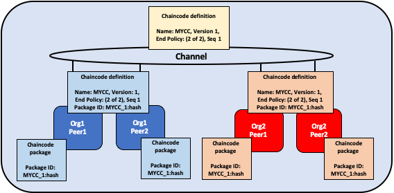

*One organization administrator from Org1 or Org2 commits the chaincode definition
to the channel. The definition on the channel does not include the packageID.*

An organization can approve a chaincode definition without installing the
chaincode package. If an organization does not need to use the chaincode, they
can approve a chaincode definition without a package identifier to ensure that
the Lifecycle Endorsement policy is satisfied.

After the chaincode definition has been committed to the channel, the chaincode
container will launch on all of the peers where the chaincode has been installed,
allowing channel members to start using the chaincode. It may take a few minutes for
the chaincode container to start. You can use the chaincode definition to require
the invocation of the ``Init`` function to initialize the chaincode. If the
invocation of the ``Init`` function is requested, the first invoke of the
chaincode must be a call to the ``Init`` function. The invoke of the ``Init``
function is subject to the chaincode endorsement policy.

  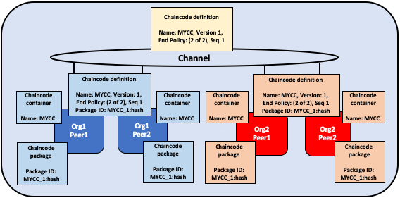

*Once MYCC is defined on the channel, Org1 and Org2 can start using the chaincode. The first invoke of the chaincode on each peer starts the chaincode
container on that peer.*  

## Upgrade a chaincode

You can upgrade a chaincode using the same Fabric lifecycle process as you used
to install and start the chaincode. You can upgrade the chaincode binaries, or
only update the chaincode policies. Follow these steps to upgrade a chaincode:

1. **Repackage the chaincode:** You only need to complete this step if you are
  upgrading the chaincode binaries.

    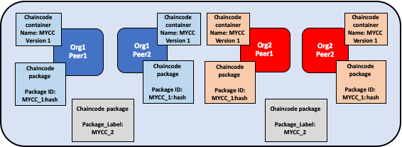

   *Org1 and Org2 upgrade the chaincode binaries and repackage the chaincode. Both organizations use a different package label.*  

2. **Install the new chaincode package on your peers:** Once again, you only
  need to complete this step if you are upgrading the chaincode binaries.
  Installing the new chaincode package will generate a package ID, which you will
  need to pass to the new chaincode definition. You also need to change the
  chaincode version, which is used by the lifecycle process to track if the
  chaincode binaries have been upgraded.

    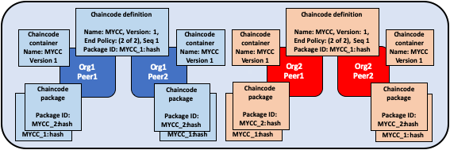

   *Org1 and Org2 install the new package on their peers. The installation creates a new packageID.*  

3. **Approve a new chaincode definition:** If you are upgrading the chaincode
  binaries, you need to update the chaincode version and the package ID in the
  chaincode definition. You can also update your chaincode endorsement policy
  without having to repackage your chaincode binaries. Channel members simply
  need to approve a definition with the new policy. The new definition needs to
  increment the **sequence** variable in the definition by one.

    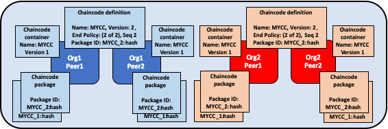

   *Organization administrators from Org1 and Org2 approve the new chaincode definition for their respective organizations. The new definition references the new packageID and changes the chaincode version. Since this is the first update of the chaincode, the sequence is incremented from one to two.*

4. **Commit the definition to the channel:** When a sufficient number of channel
  members have approved the new chaincode definition, one organization can
  commit the new definition to upgrade the chaincode definition to the channel.
  There is no separate upgrade command as part of the lifecycle process.

    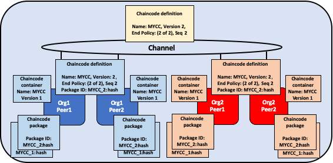

   *An organization administrator from Org1 or Org2 commits the new chaincode definition to the channel.*  

After you commit the chaincode definition, a new chaincode container will
launch with the code from the upgraded chaincode binaries. If you requested the
execution of the ``Init`` function in the chaincode definition, you need to
initialize the upgraded chaincode by invoking the ``Init`` function again after
the new definition is successfully committed. If you updated the chaincode
definition without changing the chaincode version, the chaincode container will
remain the same and you do not need to invoke ``Init`` function.

  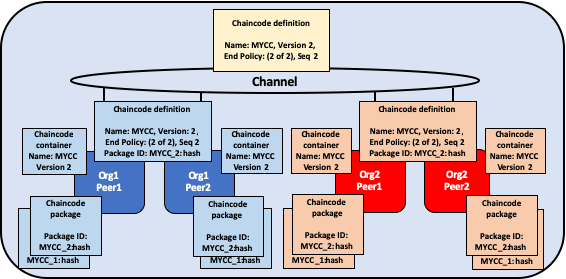

 *Once the new definition has been committed to the channel, each peer will automatically start the new chaincode container.*

The Fabric chaincode lifecycle uses the **sequence** in the chaincode definition
to keep track of upgrades. All channel members need to increment the sequence
number by one and approve a new definition to upgrade the chaincode. The version
parameter is used to track the chaincode binaries, and needs to be changed only
when you upgrade the chaincode binaries.

## Deployment scenarios

The following examples illustrate how you can use the Fabric chaincode lifecycle
to manage channels and chaincode.

### Joining a channel

A new organization can join a channel with a chaincode already defined, and start
using the chaincode after installing the chaincode package and approving the
chaincode definition that has already been committed to the channel.

  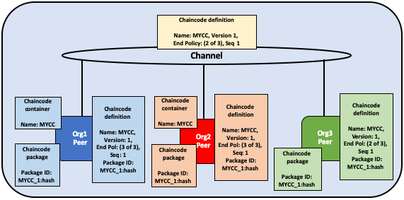

*Org3 joins the channel and approves the same chaincode definition that was
previously committed to the channel by Org1 and Org2.*

After approving the chaincode definition, the new organization can start using
the chaincode after the package has been installed on their peers. The definition
does not need to be committed again. If the endorsement policy is set the default
policy that requires endorsements from a majority of channel members, then the
endorsement policy will be updated automatically to include the new organization.

  

*The chaincode container will start after the first invoke of the chaincode on
the Org3 peer.*

### Updating an endorsement policy

You can use the chaincode definition to update an endorsement policy without
having to repackage or re-install the chaincode. Channel members can approve
a chaincode definition with a new endorsement policy and commit it to the
channel.

  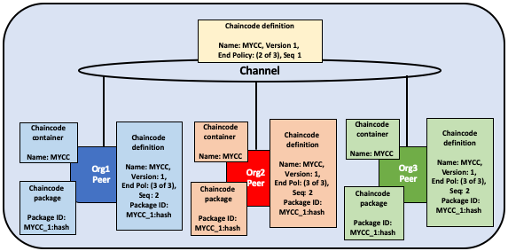

*Org1, Org2, and Org3 approve a new endorsement policy requiring that all three
organizations endorse a transaction. They increment the definition sequence from
one to two, but do not need to update the chaincode version.*

The new endorsement policy will take effect after the new definition is
committed to the channel. Channel members do not have to restart the chaincode
container by invoking the chaincode or executing the `Init` function in order to
update the endorsement policy.

  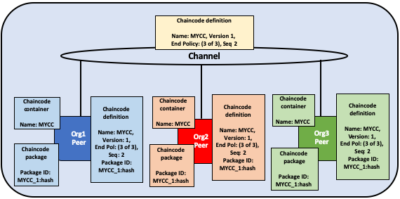

*One organization commits the new chaincode definition to the channel to
update the endorsement policy.*

### Approving a definition without installing the chaincode

You can approve a chaincode definition without installing the chaincode package.
This allows you to endorse a chaincode definition before it is committed to the
channel, even if you do not want to use the chaincode to endorse transactions or
query the ledger. You need to approve the same parameters as other members of the
channel, but not need to include the packageID as part of the chaincode
definition.

  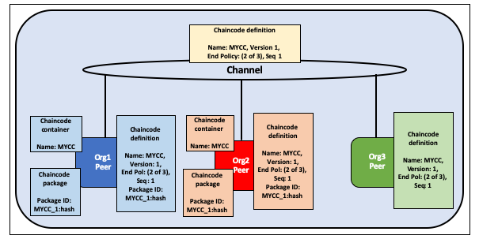

*Org3 does not install the chaincode package. As a result, they do not need to
provide a packageID as part of chaincode definition. However, Org3 can still
endorse the definition of MYCC that has been committed to the channel.*

### One organization disagrees on the chaincode definition

An organization that does not approve a chaincode definition that has been
committed to the channel cannot use the chaincode. Organizations that have
either not approved a chaincode definition, or approved a different chaincode
definition will not be able to execute the chaincode on their peers.

  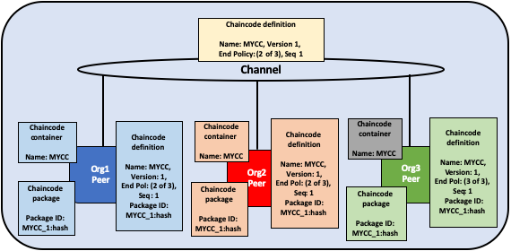

*Org3 approves a chaincode definition with a different endorsement policy than
Org1 and Org2. As a result, Org3 cannot use the MYCC chaincode on the channel.
However, Org1 or Org2 can still get enough endorsements to commit the definition
to the channel and use the chaincode. Transactions from the chaincode will still
be added to the ledger and stored on the Org3 peer. However, the Org3 will not
be able to endorse transactions.*

An organization can approve a new chaincode definition with any sequence number
or version. This allows you to approve the definition that has been committed
to the channel and start using the chaincode. You can also approve a new
chaincode definition in order to correct any mistakes made in the process of
approving or packaging a chaincode.

### The channel does not agree on a chaincode definition

If the organizations on a channel do not agree on a chaincode definition, the
definition cannot be committed to the channel. None of the channel members will
be able to use the chaincode.

  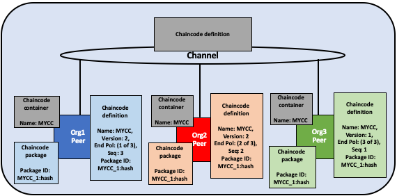

*Org1, Org2, and Org3 all approve different chaincode definitions. As a result,
no member of the channel can get enough endorsements to commit a chaincode
definition to the channel. No channel member will be able to use the chaincode.*

### Organizations install different chaincode packages

Each organization can use a different packageID when they approve a chaincode
definition. This allows channel members to install different chaincode binaries
that use the same endorsement policy and read and write to data in the same
chaincode namespace.

Organizations can use this capability to install smart contracts that
contain business logic that is specific to their organization. Each
organization's smart contract could contain additional validation that the
organization requires before their peers endorse a transaction. Each organization
can also write code that helps integrate the smart contract with data from their
existing systems.

  

*Org1 and Org2 each install versions of the MYCC chaincode containing business
logic that is specific to their organization.*

### Creating multiple chaincodes using one package

You can use one chaincode package to create multiple chaincode instances on a
channel by approving and committing multiple chaincode definitions. Each
definition needs to specify a different chaincode name. This allows you to run
multiple instances of a smart contract on a channel, but have the contract be
subject to different endorsement policies.

  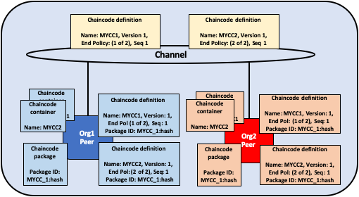

*Org1 and Org2 use the MYCC_1 chaincode package to approve and commit two
different chaincode definitions. As a result, both peers have two chaincode
containers running on their peers. MYCC1 has an endorsement policy of 1 out of 2,
while MYCC2 has an endorsement policy of 2 out of 2.*

## Migrate to the new Fabric lifecycle

For information about migrating to the new lifecycle, check out [Considerations for getting to v2.0](./upgrade_to_newest_version.html#chaincode-lifecycle).

If you need to update your channel configurations to enable the new lifecycle, check out [Enabling the new chaincode lifecycle](./enable_cc_lifecycle.html).

## More information

You can watch video below to learn more about the motivation of the new Fabric chaincode lifecycle and how it is implemented.

<iframe class="embed-responsive-item" id="youtubeplayer2" title="Starter Plan videos" type="text/html" width="560" height="315" src="https://www.youtube.com/embed/XvEMDScFU2M" frameborder="0" webkitallowfullscreen mozallowfullscreen allowfullscreen> </iframe>

<!--- Licensed under Creative Commons Attribution 4.0 International License
https://creativecommons.org/licenses/by/4.0/ -->
