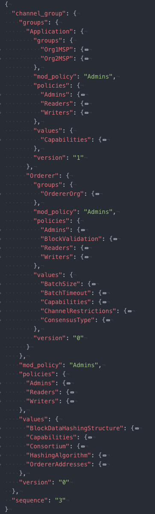

# Updating a channel configuration

*Audience: network administrators, node administrators*

## What is a channel configuration?

Like many complex systems, Hyperledger Fabric networks are comprised of both **structure** and a number related of **processes**.

* **Structure**: encompassing users (like admins), organizations, peers, ordering nodes, CAs, smart contracts, and applications.
* **Process**: the way these structures interact. Most important of these are [Policies](./policies/policies.html), the rules that govern which users can do what, and under what conditions.

Information identifying the structure of blockchain networks and the processes governing how structures interact are contained in **channel configurations**. These configurations are collectively decided upon by the members of channels and are contained in blocks that are committed to the ledger of a channel. Channel configurations can be built using a tool called `configtxgen`, which uses a `configtx.yaml` file as its input. You can look at a [sample `configtx.yaml` file here](http://github.com/hyperledger/fabric/blob/release-2.0/sampleconfig/configtx.yaml).

Because configurations are contained in blocks (the first of these is known as the genesis block with the latest representing the current configuration of the channel), the process for updating a channel configuration (changing the structure by adding members, for example, or processes by modifying channel policies) is known as a **configuration update transaction**.

In production networks, these configuration update transactions will normally be proposed by a single channel admin after an out of band discussion, just as the initial configuration of the channel will be decided on out of band by the initial members of the channel.

In this topic, we'll:

* Show a full sample configuration of an application channel.
* Discuss many of the channel parameters that can be edited.
* Show the process for updating a channel configuration, including the commands necessary to pull, translate, and scope a configuration into something that humans can read.
* Discuss the methods that can be used to edit a channel configuration.
* Show the process used to reformat a configuration and get the signatures necessary for it to be approved.

## Channel parameters that can be updated

Channels are highly configurable, but not infinitely so. Once certain things about a channel (for example, the name of the channel) have been specified, they cannot be changed. And changing one of the parameters we'll talk about in this topic requires satisfying the relevant policy as specified in the channel configuration.

In this section, we'll look a sample channel configuration and show the configuration parameters that can be updated.

### Sample channel configuration

To see what the configuration file of an application channel looks like after it has been pulled and scoped, click **Click here to see the config** below. For ease of readability, it might be helpful to put this config into a viewer that supports JSON folding, like atom or Visual Studio.

Note: for simplicity, we are only showing an application channel configuration here. The configuration of the orderer system channel is very similar, but not identical, to the configuration of an application channel. However, the same basic rules and structure apply, as do the commands to pull and edit a configuration, as you can see in our topic on [Updating the capability level of a channel](./updating_capabilities.html).

<details>
  <summary>
    **Click here to see the config**. Note that this is the configuration of an application channel, not the orderer system channel.
  </summary>
  ```
  {
    "channel_group": {
      "groups": {
        "Application": {
          "groups": {
            "Org1MSP": {
              "groups": {},
              "mod_policy": "Admins",
              "policies": {
                "Admins": {
                  "mod_policy": "Admins",
                  "policy": {
                    "type": 1,
                    "value": {
                      "identities": [
                        {
                          "principal": {
                            "msp_identifier": "Org1MSP",
                            "role": "ADMIN"
                          },
                          "principal_classification": "ROLE"
                        }
                      ],
                      "rule": {
                        "n_out_of": {
                          "n": 1,
                          "rules": [
                            {
                              "signed_by": 0
                            }
                          ]
                        }
                      },
                      "version": 0
                    }
                  },
                  "version": "0"
                },
                "Endorsement": {
                  "mod_policy": "Admins",
                  "policy": {
                    "type": 1,
                    "value": {
                      "identities": [
                        {
                          "principal": {
                            "msp_identifier": "Org1MSP",
                            "role": "PEER"
                          },
                          "principal_classification": "ROLE"
                        }
                      ],
                      "rule": {
                        "n_out_of": {
                          "n": 1,
                          "rules": [
                            {
                              "signed_by": 0
                            }
                          ]
                        }
                      },
                      "version": 0
                    }
                  },
                  "version": "0"
                },
                "Readers": {
                  "mod_policy": "Admins",
                  "policy": {
                    "type": 1,
                    "value": {
                      "identities": [
                        {
                          "principal": {
                            "msp_identifier": "Org1MSP",
                            "role": "ADMIN"
                          },
                          "principal_classification": "ROLE"
                        },
                        {
                          "principal": {
                            "msp_identifier": "Org1MSP",
                            "role": "PEER"
                          },
                          "principal_classification": "ROLE"
                        },
                        {
                          "principal": {
                            "msp_identifier": "Org1MSP",
                            "role": "CLIENT"
                          },
                          "principal_classification": "ROLE"
                        }
                      ],
                      "rule": {
                        "n_out_of": {
                          "n": 1,
                          "rules": [
                            {
                              "signed_by": 0
                            },
                            {
                              "signed_by": 1
                            },
                            {
                              "signed_by": 2
                            }
                          ]
                        }
                      },
                      "version": 0
                    }
                  },
                  "version": "0"
                },
                "Writers": {
                  "mod_policy": "Admins",
                  "policy": {
                    "type": 1,
                    "value": {
                      "identities": [
                        {
                          "principal": {
                            "msp_identifier": "Org1MSP",
                            "role": "ADMIN"
                          },
                          "principal_classification": "ROLE"
                        },
                        {
                          "principal": {
                            "msp_identifier": "Org1MSP",
                            "role": "CLIENT"
                          },
                          "principal_classification": "ROLE"
                        }
                      ],
                      "rule": {
                        "n_out_of": {
                          "n": 1,
                          "rules": [
                            {
                              "signed_by": 0
                            },
                            {
                              "signed_by": 1
                            }
                          ]
                        }
                      },
                      "version": 0
                    }
                  },
                  "version": "0"
                }
              },
              "values": {
                "AnchorPeers": {
                  "mod_policy": "Admins",
                  "value": {
                    "anchor_peers": [
                      {
                        "host": "peer0.org1.example.com",
                        "port": 7051
                      }
                    ]
                  },
                  "version": "0"
                },
                "MSP": {
                  "mod_policy": "Admins",
                  "value": {
                    "config": {
                      "admins": [],
                      "crypto_config": {
                        "identity_identifier_hash_function": "SHA256",
                        "signature_hash_family": "SHA2"
                      },
                      "fabric_node_ous": {
                        "admin_ou_identifier": {
                          "certificate": "LS0tLS1CRUdJTiBDRVJUSUZJQ0FURS0tLS0tCk1JSUNKekNDQWMyZ0F3SUJBZ0lVYWVSeWNkQytlR1lUTUNyWTg2UFVXUEdzQUw0d0NnWUlLb1pJemowRUF3SXcKY0RFTE1Ba0dBMVVFQmhNQ1ZWTXhGekFWQmdOVkJBZ1REazV2Y25Sb0lFTmhjbTlzYVc1aE1ROHdEUVlEVlFRSApFd1pFZFhKb1lXMHhHVEFYQmdOVkJBb1RFRzl5WnpFdVpYaGhiWEJzWlM1amIyMHhIREFhQmdOVkJBTVRFMk5oCkxtOXlaekV1WlhoaGJYQnNaUzVqYjIwd0hoY05NakF3TXpJME1qQXhPREF3V2hjTk16VXdNekl4TWpBeE9EQXcKV2pCd01Rc3dDUVlEVlFRR0V3SlZVekVYTUJVR0ExVUVDQk1PVG05eWRHZ2dRMkZ5YjJ4cGJtRXhEekFOQmdOVgpCQWNUQmtSMWNtaGhiVEVaTUJjR0ExVUVDaE1RYjNKbk1TNWxlR0Z0Y0d4bExtTnZiVEVjTUJvR0ExVUVBeE1UClkyRXViM0puTVM1bGVHRnRjR3hsTG1OdmJUQlpNQk1HQnlxR1NNNDlBZ0VHQ0NxR1NNNDlBd0VIQTBJQUJLWXIKSmtqcEhjRkcxMVZlU200emxwSmNCZEtZVjc3SEgvdzI0V09sZnphYWZWK3VaaEZ2YTFhQm9aaGx5RloyMGRWeApwMkRxb09BblZ4MzZ1V3o2SXl1alJUQkRNQTRHQTFVZER3RUIvd1FFQXdJQkJqQVNCZ05WSFJNQkFmOEVDREFHCkFRSC9BZ0VCTUIwR0ExVWREZ1FXQkJTcHpDQWdPaGRuSkE3VVpxUWlFSVFXSFpnYXZEQUtCZ2dxaGtqT1BRUUQKQWdOSUFEQkZBaUVBbEZtYWdIQkJoblFUd3dDOXBQRTRGbFY2SlhIbTdnQ1JyWUxUbVgvc0VySUNJRUhLZG51KwpIWDgrVTh1ZkFKbTdrL1laZEtVVnlWS2E3bGREUjlWajNveTIKLS0tLS1FTkQgQ0VSVElGSUNBVEUtLS0tLQo=",
                          "organizational_unit_identifier": "admin"
                        },
                        "client_ou_identifier": {
                          "certificate": "LS0tLS1CRUdJTiBDRVJUSUZJQ0FURS0tLS0tCk1JSUNKekNDQWMyZ0F3SUJBZ0lVYWVSeWNkQytlR1lUTUNyWTg2UFVXUEdzQUw0d0NnWUlLb1pJemowRUF3SXcKY0RFTE1Ba0dBMVVFQmhNQ1ZWTXhGekFWQmdOVkJBZ1REazV2Y25Sb0lFTmhjbTlzYVc1aE1ROHdEUVlEVlFRSApFd1pFZFhKb1lXMHhHVEFYQmdOVkJBb1RFRzl5WnpFdVpYaGhiWEJzWlM1amIyMHhIREFhQmdOVkJBTVRFMk5oCkxtOXlaekV1WlhoaGJYQnNaUzVqYjIwd0hoY05NakF3TXpJME1qQXhPREF3V2hjTk16VXdNekl4TWpBeE9EQXcKV2pCd01Rc3dDUVlEVlFRR0V3SlZVekVYTUJVR0ExVUVDQk1PVG05eWRHZ2dRMkZ5YjJ4cGJtRXhEekFOQmdOVgpCQWNUQmtSMWNtaGhiVEVaTUJjR0ExVUVDaE1RYjNKbk1TNWxlR0Z0Y0d4bExtTnZiVEVjTUJvR0ExVUVBeE1UClkyRXViM0puTVM1bGVHRnRjR3hsTG1OdmJUQlpNQk1HQnlxR1NNNDlBZ0VHQ0NxR1NNNDlBd0VIQTBJQUJLWXIKSmtqcEhjRkcxMVZlU200emxwSmNCZEtZVjc3SEgvdzI0V09sZnphYWZWK3VaaEZ2YTFhQm9aaGx5RloyMGRWeApwMkRxb09BblZ4MzZ1V3o2SXl1alJUQkRNQTRHQTFVZER3RUIvd1FFQXdJQkJqQVNCZ05WSFJNQkFmOEVDREFHCkFRSC9BZ0VCTUIwR0ExVWREZ1FXQkJTcHpDQWdPaGRuSkE3VVpxUWlFSVFXSFpnYXZEQUtCZ2dxaGtqT1BRUUQKQWdOSUFEQkZBaUVBbEZtYWdIQkJoblFUd3dDOXBQRTRGbFY2SlhIbTdnQ1JyWUxUbVgvc0VySUNJRUhLZG51KwpIWDgrVTh1ZkFKbTdrL1laZEtVVnlWS2E3bGREUjlWajNveTIKLS0tLS1FTkQgQ0VSVElGSUNBVEUtLS0tLQo=",
                          "organizational_unit_identifier": "client"
                        },
                        "enable": true,
                        "orderer_ou_identifier": {
                          "certificate": "LS0tLS1CRUdJTiBDRVJUSUZJQ0FURS0tLS0tCk1JSUNKekNDQWMyZ0F3SUJBZ0lVYWVSeWNkQytlR1lUTUNyWTg2UFVXUEdzQUw0d0NnWUlLb1pJemowRUF3SXcKY0RFTE1Ba0dBMVVFQmhNQ1ZWTXhGekFWQmdOVkJBZ1REazV2Y25Sb0lFTmhjbTlzYVc1aE1ROHdEUVlEVlFRSApFd1pFZFhKb1lXMHhHVEFYQmdOVkJBb1RFRzl5WnpFdVpYaGhiWEJzWlM1amIyMHhIREFhQmdOVkJBTVRFMk5oCkxtOXlaekV1WlhoaGJYQnNaUzVqYjIwd0hoY05NakF3TXpJME1qQXhPREF3V2hjTk16VXdNekl4TWpBeE9EQXcKV2pCd01Rc3dDUVlEVlFRR0V3SlZVekVYTUJVR0ExVUVDQk1PVG05eWRHZ2dRMkZ5YjJ4cGJtRXhEekFOQmdOVgpCQWNUQmtSMWNtaGhiVEVaTUJjR0ExVUVDaE1RYjNKbk1TNWxlR0Z0Y0d4bExtTnZiVEVjTUJvR0ExVUVBeE1UClkyRXViM0puTVM1bGVHRnRjR3hsTG1OdmJUQlpNQk1HQnlxR1NNNDlBZ0VHQ0NxR1NNNDlBd0VIQTBJQUJLWXIKSmtqcEhjRkcxMVZlU200emxwSmNCZEtZVjc3SEgvdzI0V09sZnphYWZWK3VaaEZ2YTFhQm9aaGx5RloyMGRWeApwMkRxb09BblZ4MzZ1V3o2SXl1alJUQkRNQTRHQTFVZER3RUIvd1FFQXdJQkJqQVNCZ05WSFJNQkFmOEVDREFHCkFRSC9BZ0VCTUIwR0ExVWREZ1FXQkJTcHpDQWdPaGRuSkE3VVpxUWlFSVFXSFpnYXZEQUtCZ2dxaGtqT1BRUUQKQWdOSUFEQkZBaUVBbEZtYWdIQkJoblFUd3dDOXBQRTRGbFY2SlhIbTdnQ1JyWUxUbVgvc0VySUNJRUhLZG51KwpIWDgrVTh1ZkFKbTdrL1laZEtVVnlWS2E3bGREUjlWajNveTIKLS0tLS1FTkQgQ0VSVElGSUNBVEUtLS0tLQo=",
                          "organizational_unit_identifier": "orderer"
                        },
                        "peer_ou_identifier": {
                          "certificate": "LS0tLS1CRUdJTiBDRVJUSUZJQ0FURS0tLS0tCk1JSUNKekNDQWMyZ0F3SUJBZ0lVYWVSeWNkQytlR1lUTUNyWTg2UFVXUEdzQUw0d0NnWUlLb1pJemowRUF3SXcKY0RFTE1Ba0dBMVVFQmhNQ1ZWTXhGekFWQmdOVkJBZ1REazV2Y25Sb0lFTmhjbTlzYVc1aE1ROHdEUVlEVlFRSApFd1pFZFhKb1lXMHhHVEFYQmdOVkJBb1RFRzl5WnpFdVpYaGhiWEJzWlM1amIyMHhIREFhQmdOVkJBTVRFMk5oCkxtOXlaekV1WlhoaGJYQnNaUzVqYjIwd0hoY05NakF3TXpJME1qQXhPREF3V2hjTk16VXdNekl4TWpBeE9EQXcKV2pCd01Rc3dDUVlEVlFRR0V3SlZVekVYTUJVR0ExVUVDQk1PVG05eWRHZ2dRMkZ5YjJ4cGJtRXhEekFOQmdOVgpCQWNUQmtSMWNtaGhiVEVaTUJjR0ExVUVDaE1RYjNKbk1TNWxlR0Z0Y0d4bExtTnZiVEVjTUJvR0ExVUVBeE1UClkyRXViM0puTVM1bGVHRnRjR3hsTG1OdmJUQlpNQk1HQnlxR1NNNDlBZ0VHQ0NxR1NNNDlBd0VIQTBJQUJLWXIKSmtqcEhjRkcxMVZlU200emxwSmNCZEtZVjc3SEgvdzI0V09sZnphYWZWK3VaaEZ2YTFhQm9aaGx5RloyMGRWeApwMkRxb09BblZ4MzZ1V3o2SXl1alJUQkRNQTRHQTFVZER3RUIvd1FFQXdJQkJqQVNCZ05WSFJNQkFmOEVDREFHCkFRSC9BZ0VCTUIwR0ExVWREZ1FXQkJTcHpDQWdPaGRuSkE3VVpxUWlFSVFXSFpnYXZEQUtCZ2dxaGtqT1BRUUQKQWdOSUFEQkZBaUVBbEZtYWdIQkJoblFUd3dDOXBQRTRGbFY2SlhIbTdnQ1JyWUxUbVgvc0VySUNJRUhLZG51KwpIWDgrVTh1ZkFKbTdrL1laZEtVVnlWS2E3bGREUjlWajNveTIKLS0tLS1FTkQgQ0VSVElGSUNBVEUtLS0tLQo=",
                          "organizational_unit_identifier": "peer"
                        }
                      },
                      "intermediate_certs": [],
                      "name": "Org1MSP",
                      "organizational_unit_identifiers": [],
                      "revocation_list": [],
                      "root_certs": [
                        "LS0tLS1CRUdJTiBDRVJUSUZJQ0FURS0tLS0tCk1JSUNKekNDQWMyZ0F3SUJBZ0lVYWVSeWNkQytlR1lUTUNyWTg2UFVXUEdzQUw0d0NnWUlLb1pJemowRUF3SXcKY0RFTE1Ba0dBMVVFQmhNQ1ZWTXhGekFWQmdOVkJBZ1REazV2Y25Sb0lFTmhjbTlzYVc1aE1ROHdEUVlEVlFRSApFd1pFZFhKb1lXMHhHVEFYQmdOVkJBb1RFRzl5WnpFdVpYaGhiWEJzWlM1amIyMHhIREFhQmdOVkJBTVRFMk5oCkxtOXlaekV1WlhoaGJYQnNaUzVqYjIwd0hoY05NakF3TXpJME1qQXhPREF3V2hjTk16VXdNekl4TWpBeE9EQXcKV2pCd01Rc3dDUVlEVlFRR0V3SlZVekVYTUJVR0ExVUVDQk1PVG05eWRHZ2dRMkZ5YjJ4cGJtRXhEekFOQmdOVgpCQWNUQmtSMWNtaGhiVEVaTUJjR0ExVUVDaE1RYjNKbk1TNWxlR0Z0Y0d4bExtTnZiVEVjTUJvR0ExVUVBeE1UClkyRXViM0puTVM1bGVHRnRjR3hsTG1OdmJUQlpNQk1HQnlxR1NNNDlBZ0VHQ0NxR1NNNDlBd0VIQTBJQUJLWXIKSmtqcEhjRkcxMVZlU200emxwSmNCZEtZVjc3SEgvdzI0V09sZnphYWZWK3VaaEZ2YTFhQm9aaGx5RloyMGRWeApwMkRxb09BblZ4MzZ1V3o2SXl1alJUQkRNQTRHQTFVZER3RUIvd1FFQXdJQkJqQVNCZ05WSFJNQkFmOEVDREFHCkFRSC9BZ0VCTUIwR0ExVWREZ1FXQkJTcHpDQWdPaGRuSkE3VVpxUWlFSVFXSFpnYXZEQUtCZ2dxaGtqT1BRUUQKQWdOSUFEQkZBaUVBbEZtYWdIQkJoblFUd3dDOXBQRTRGbFY2SlhIbTdnQ1JyWUxUbVgvc0VySUNJRUhLZG51KwpIWDgrVTh1ZkFKbTdrL1laZEtVVnlWS2E3bGREUjlWajNveTIKLS0tLS1FTkQgQ0VSVElGSUNBVEUtLS0tLQo="
                      ],
                      "signing_identity": null,
                      "tls_intermediate_certs": [],
                      "tls_root_certs": [
                        "LS0tLS1CRUdJTiBDRVJUSUZJQ0FURS0tLS0tCk1JSUNKekNDQWMyZ0F3SUJBZ0lVYWVSeWNkQytlR1lUTUNyWTg2UFVXUEdzQUw0d0NnWUlLb1pJemowRUF3SXcKY0RFTE1Ba0dBMVVFQmhNQ1ZWTXhGekFWQmdOVkJBZ1REazV2Y25Sb0lFTmhjbTlzYVc1aE1ROHdEUVlEVlFRSApFd1pFZFhKb1lXMHhHVEFYQmdOVkJBb1RFRzl5WnpFdVpYaGhiWEJzWlM1amIyMHhIREFhQmdOVkJBTVRFMk5oCkxtOXlaekV1WlhoaGJYQnNaUzVqYjIwd0hoY05NakF3TXpJME1qQXhPREF3V2hjTk16VXdNekl4TWpBeE9EQXcKV2pCd01Rc3dDUVlEVlFRR0V3SlZVekVYTUJVR0ExVUVDQk1PVG05eWRHZ2dRMkZ5YjJ4cGJtRXhEekFOQmdOVgpCQWNUQmtSMWNtaGhiVEVaTUJjR0ExVUVDaE1RYjNKbk1TNWxlR0Z0Y0d4bExtTnZiVEVjTUJvR0ExVUVBeE1UClkyRXViM0puTVM1bGVHRnRjR3hsTG1OdmJUQlpNQk1HQnlxR1NNNDlBZ0VHQ0NxR1NNNDlBd0VIQTBJQUJLWXIKSmtqcEhjRkcxMVZlU200emxwSmNCZEtZVjc3SEgvdzI0V09sZnphYWZWK3VaaEZ2YTFhQm9aaGx5RloyMGRWeApwMkRxb09BblZ4MzZ1V3o2SXl1alJUQkRNQTRHQTFVZER3RUIvd1FFQXdJQkJqQVNCZ05WSFJNQkFmOEVDREFHCkFRSC9BZ0VCTUIwR0ExVWREZ1FXQkJTcHpDQWdPaGRuSkE3VVpxUWlFSVFXSFpnYXZEQUtCZ2dxaGtqT1BRUUQKQWdOSUFEQkZBaUVBbEZtYWdIQkJoblFUd3dDOXBQRTRGbFY2SlhIbTdnQ1JyWUxUbVgvc0VySUNJRUhLZG51KwpIWDgrVTh1ZkFKbTdrL1laZEtVVnlWS2E3bGREUjlWajNveTIKLS0tLS1FTkQgQ0VSVElGSUNBVEUtLS0tLQo="
                      ]
                    },
                    "type": 0
                  },
                  "version": "0"
                }
              },
              "version": "1"
            },
            "Org2MSP": {
              "groups": {},
              "mod_policy": "Admins",
              "policies": {
                "Admins": {
                  "mod_policy": "Admins",
                  "policy": {
                    "type": 1,
                    "value": {
                      "identities": [
                        {
                          "principal": {
                            "msp_identifier": "Org2MSP",
                            "role": "ADMIN"
                          },
                          "principal_classification": "ROLE"
                        }
                      ],
                      "rule": {
                        "n_out_of": {
                          "n": 1,
                          "rules": [
                            {
                              "signed_by": 0
                            }
                          ]
                        }
                      },
                      "version": 0
                    }
                  },
                  "version": "0"
                },
                "Endorsement": {
                  "mod_policy": "Admins",
                  "policy": {
                    "type": 1,
                    "value": {
                      "identities": [
                        {
                          "principal": {
                            "msp_identifier": "Org2MSP",
                            "role": "PEER"
                          },
                          "principal_classification": "ROLE"
                        }
                      ],
                      "rule": {
                        "n_out_of": {
                          "n": 1,
                          "rules": [
                            {
                              "signed_by": 0
                            }
                          ]
                        }
                      },
                      "version": 0
                    }
                  },
                  "version": "0"
                },
                "Readers": {
                  "mod_policy": "Admins",
                  "policy": {
                    "type": 1,
                    "value": {
                      "identities": [
                        {
                          "principal": {
                            "msp_identifier": "Org2MSP",
                            "role": "ADMIN"
                          },
                          "principal_classification": "ROLE"
                        },
                        {
                          "principal": {
                            "msp_identifier": "Org2MSP",
                            "role": "PEER"
                          },
                          "principal_classification": "ROLE"
                        },
                        {
                          "principal": {
                            "msp_identifier": "Org2MSP",
                            "role": "CLIENT"
                          },
                          "principal_classification": "ROLE"
                        }
                      ],
                      "rule": {
                        "n_out_of": {
                          "n": 1,
                          "rules": [
                            {
                              "signed_by": 0
                            },
                            {
                              "signed_by": 1
                            },
                            {
                              "signed_by": 2
                            }
                          ]
                        }
                      },
                      "version": 0
                    }
                  },
                  "version": "0"
                },
                "Writers": {
                  "mod_policy": "Admins",
                  "policy": {
                    "type": 1,
                    "value": {
                      "identities": [
                        {
                          "principal": {
                            "msp_identifier": "Org2MSP",
                            "role": "ADMIN"
                          },
                          "principal_classification": "ROLE"
                        },
                        {
                          "principal": {
                            "msp_identifier": "Org2MSP",
                            "role": "CLIENT"
                          },
                          "principal_classification": "ROLE"
                        }
                      ],
                      "rule": {
                        "n_out_of": {
                          "n": 1,
                          "rules": [
                            {
                              "signed_by": 0
                            },
                            {
                              "signed_by": 1
                            }
                          ]
                        }
                      },
                      "version": 0
                    }
                  },
                  "version": "0"
                }
              },
              "values": {
                "AnchorPeers": {
                  "mod_policy": "Admins",
                  "value": {
                    "anchor_peers": [
                      {
                        "host": "peer0.org2.example.com",
                        "port": 9051
                      }
                    ]
                  },
                  "version": "0"
                },
                "MSP": {
                  "mod_policy": "Admins",
                  "value": {
                    "config": {
                      "admins": [],
                      "crypto_config": {
                        "identity_identifier_hash_function": "SHA256",
                        "signature_hash_family": "SHA2"
                      },
                      "fabric_node_ous": {
                        "admin_ou_identifier": {
                          "certificate": "LS0tLS1CRUdJTiBDRVJUSUZJQ0FURS0tLS0tCk1JSUNIakNDQWNXZ0F3SUJBZ0lVQVFkb1B0S0E0bEk2a0RrMituYzk5NzNhSC9Vd0NnWUlLb1pJemowRUF3SXcKYkRFTE1Ba0dBMVVFQmhNQ1ZVc3hFakFRQmdOVkJBZ1RDVWhoYlhCemFHbHlaVEVRTUE0R0ExVUVCeE1IU0hWeQpjMnhsZVRFWk1CY0dBMVVFQ2hNUWIzSm5NaTVsZUdGdGNHeGxMbU52YlRFY01Cb0dBMVVFQXhNVFkyRXViM0puCk1pNWxlR0Z0Y0d4bExtTnZiVEFlRncweU1EQXpNalF5TURFNE1EQmFGdzB6TlRBek1qRXlNREU0TURCYU1Hd3gKQ3pBSkJnTlZCQVlUQWxWTE1SSXdFQVlEVlFRSUV3bElZVzF3YzJocGNtVXhFREFPQmdOVkJBY1RCMGgxY25OcwpaWGt4R1RBWEJnTlZCQW9URUc5eVp6SXVaWGhoYlhCc1pTNWpiMjB4SERBYUJnTlZCQU1URTJOaExtOXlaekl1ClpYaGhiWEJzWlM1amIyMHdXVEFUQmdjcWhrak9QUUlCQmdncWhrak9QUU1CQndOQ0FBVFk3VGJqQzdYSHNheC8Kem1yVk1nWnpmODBlb3JFbTNIdis2ZnRqMFgzd2cxdGZVM3hyWWxXZVJwR0JGeFQzNnJmVkdLLzhUQWJ2cnRuZgpUQ1hKak93a28wVXdRekFPQmdOVkhROEJBZjhFQkFNQ0FRWXdFZ1lEVlIwVEFRSC9CQWd3QmdFQi93SUJBVEFkCkJnTlZIUTRFRmdRVWJJNkV4dVRZSEpjczRvNEl5dXZWOVFRa1lGZ3dDZ1lJS29aSXpqMEVBd0lEUndBd1JBSWcKWndjdElBNmdoSlFCZmpDRXdRK1NmYi9iemdsQlV4b0g3ZHVtOUJrUjFkd0NJQlRqcEZkWlcyS2UzSVBMS1h2aApERmQvVmMrcloyMksyeVdKL1BIYXZWWmkKLS0tLS1FTkQgQ0VSVElGSUNBVEUtLS0tLQo=",
                          "organizational_unit_identifier": "admin"
                        },
                        "client_ou_identifier": {
                          "certificate": "LS0tLS1CRUdJTiBDRVJUSUZJQ0FURS0tLS0tCk1JSUNIakNDQWNXZ0F3SUJBZ0lVQVFkb1B0S0E0bEk2a0RrMituYzk5NzNhSC9Vd0NnWUlLb1pJemowRUF3SXcKYkRFTE1Ba0dBMVVFQmhNQ1ZVc3hFakFRQmdOVkJBZ1RDVWhoYlhCemFHbHlaVEVRTUE0R0ExVUVCeE1IU0hWeQpjMnhsZVRFWk1CY0dBMVVFQ2hNUWIzSm5NaTVsZUdGdGNHeGxMbU52YlRFY01Cb0dBMVVFQXhNVFkyRXViM0puCk1pNWxlR0Z0Y0d4bExtTnZiVEFlRncweU1EQXpNalF5TURFNE1EQmFGdzB6TlRBek1qRXlNREU0TURCYU1Hd3gKQ3pBSkJnTlZCQVlUQWxWTE1SSXdFQVlEVlFRSUV3bElZVzF3YzJocGNtVXhFREFPQmdOVkJBY1RCMGgxY25OcwpaWGt4R1RBWEJnTlZCQW9URUc5eVp6SXVaWGhoYlhCc1pTNWpiMjB4SERBYUJnTlZCQU1URTJOaExtOXlaekl1ClpYaGhiWEJzWlM1amIyMHdXVEFUQmdjcWhrak9QUUlCQmdncWhrak9QUU1CQndOQ0FBVFk3VGJqQzdYSHNheC8Kem1yVk1nWnpmODBlb3JFbTNIdis2ZnRqMFgzd2cxdGZVM3hyWWxXZVJwR0JGeFQzNnJmVkdLLzhUQWJ2cnRuZgpUQ1hKak93a28wVXdRekFPQmdOVkhROEJBZjhFQkFNQ0FRWXdFZ1lEVlIwVEFRSC9CQWd3QmdFQi93SUJBVEFkCkJnTlZIUTRFRmdRVWJJNkV4dVRZSEpjczRvNEl5dXZWOVFRa1lGZ3dDZ1lJS29aSXpqMEVBd0lEUndBd1JBSWcKWndjdElBNmdoSlFCZmpDRXdRK1NmYi9iemdsQlV4b0g3ZHVtOUJrUjFkd0NJQlRqcEZkWlcyS2UzSVBMS1h2aApERmQvVmMrcloyMksyeVdKL1BIYXZWWmkKLS0tLS1FTkQgQ0VSVElGSUNBVEUtLS0tLQo=",
                          "organizational_unit_identifier": "client"
                        },
                        "enable": true,
                        "orderer_ou_identifier": {
                          "certificate": "LS0tLS1CRUdJTiBDRVJUSUZJQ0FURS0tLS0tCk1JSUNIakNDQWNXZ0F3SUJBZ0lVQVFkb1B0S0E0bEk2a0RrMituYzk5NzNhSC9Vd0NnWUlLb1pJemowRUF3SXcKYkRFTE1Ba0dBMVVFQmhNQ1ZVc3hFakFRQmdOVkJBZ1RDVWhoYlhCemFHbHlaVEVRTUE0R0ExVUVCeE1IU0hWeQpjMnhsZVRFWk1CY0dBMVVFQ2hNUWIzSm5NaTVsZUdGdGNHeGxMbU52YlRFY01Cb0dBMVVFQXhNVFkyRXViM0puCk1pNWxlR0Z0Y0d4bExtTnZiVEFlRncweU1EQXpNalF5TURFNE1EQmFGdzB6TlRBek1qRXlNREU0TURCYU1Hd3gKQ3pBSkJnTlZCQVlUQWxWTE1SSXdFQVlEVlFRSUV3bElZVzF3YzJocGNtVXhFREFPQmdOVkJBY1RCMGgxY25OcwpaWGt4R1RBWEJnTlZCQW9URUc5eVp6SXVaWGhoYlhCc1pTNWpiMjB4SERBYUJnTlZCQU1URTJOaExtOXlaekl1ClpYaGhiWEJzWlM1amIyMHdXVEFUQmdjcWhrak9QUUlCQmdncWhrak9QUU1CQndOQ0FBVFk3VGJqQzdYSHNheC8Kem1yVk1nWnpmODBlb3JFbTNIdis2ZnRqMFgzd2cxdGZVM3hyWWxXZVJwR0JGeFQzNnJmVkdLLzhUQWJ2cnRuZgpUQ1hKak93a28wVXdRekFPQmdOVkhROEJBZjhFQkFNQ0FRWXdFZ1lEVlIwVEFRSC9CQWd3QmdFQi93SUJBVEFkCkJnTlZIUTRFRmdRVWJJNkV4dVRZSEpjczRvNEl5dXZWOVFRa1lGZ3dDZ1lJS29aSXpqMEVBd0lEUndBd1JBSWcKWndjdElBNmdoSlFCZmpDRXdRK1NmYi9iemdsQlV4b0g3ZHVtOUJrUjFkd0NJQlRqcEZkWlcyS2UzSVBMS1h2aApERmQvVmMrcloyMksyeVdKL1BIYXZWWmkKLS0tLS1FTkQgQ0VSVElGSUNBVEUtLS0tLQo=",
                          "organizational_unit_identifier": "orderer"
                        },
                        "peer_ou_identifier": {
                          "certificate": "LS0tLS1CRUdJTiBDRVJUSUZJQ0FURS0tLS0tCk1JSUNIakNDQWNXZ0F3SUJBZ0lVQVFkb1B0S0E0bEk2a0RrMituYzk5NzNhSC9Vd0NnWUlLb1pJemowRUF3SXcKYkRFTE1Ba0dBMVVFQmhNQ1ZVc3hFakFRQmdOVkJBZ1RDVWhoYlhCemFHbHlaVEVRTUE0R0ExVUVCeE1IU0hWeQpjMnhsZVRFWk1CY0dBMVVFQ2hNUWIzSm5NaTVsZUdGdGNHeGxMbU52YlRFY01Cb0dBMVVFQXhNVFkyRXViM0puCk1pNWxlR0Z0Y0d4bExtTnZiVEFlRncweU1EQXpNalF5TURFNE1EQmFGdzB6TlRBek1qRXlNREU0TURCYU1Hd3gKQ3pBSkJnTlZCQVlUQWxWTE1SSXdFQVlEVlFRSUV3bElZVzF3YzJocGNtVXhFREFPQmdOVkJBY1RCMGgxY25OcwpaWGt4R1RBWEJnTlZCQW9URUc5eVp6SXVaWGhoYlhCc1pTNWpiMjB4SERBYUJnTlZCQU1URTJOaExtOXlaekl1ClpYaGhiWEJzWlM1amIyMHdXVEFUQmdjcWhrak9QUUlCQmdncWhrak9QUU1CQndOQ0FBVFk3VGJqQzdYSHNheC8Kem1yVk1nWnpmODBlb3JFbTNIdis2ZnRqMFgzd2cxdGZVM3hyWWxXZVJwR0JGeFQzNnJmVkdLLzhUQWJ2cnRuZgpUQ1hKak93a28wVXdRekFPQmdOVkhROEJBZjhFQkFNQ0FRWXdFZ1lEVlIwVEFRSC9CQWd3QmdFQi93SUJBVEFkCkJnTlZIUTRFRmdRVWJJNkV4dVRZSEpjczRvNEl5dXZWOVFRa1lGZ3dDZ1lJS29aSXpqMEVBd0lEUndBd1JBSWcKWndjdElBNmdoSlFCZmpDRXdRK1NmYi9iemdsQlV4b0g3ZHVtOUJrUjFkd0NJQlRqcEZkWlcyS2UzSVBMS1h2aApERmQvVmMrcloyMksyeVdKL1BIYXZWWmkKLS0tLS1FTkQgQ0VSVElGSUNBVEUtLS0tLQo=",
                          "organizational_unit_identifier": "peer"
                        }
                      },
                      "intermediate_certs": [],
                      "name": "Org2MSP",
                      "organizational_unit_identifiers": [],
                      "revocation_list": [],
                      "root_certs": [
                        "LS0tLS1CRUdJTiBDRVJUSUZJQ0FURS0tLS0tCk1JSUNIakNDQWNXZ0F3SUJBZ0lVQVFkb1B0S0E0bEk2a0RrMituYzk5NzNhSC9Vd0NnWUlLb1pJemowRUF3SXcKYkRFTE1Ba0dBMVVFQmhNQ1ZVc3hFakFRQmdOVkJBZ1RDVWhoYlhCemFHbHlaVEVRTUE0R0ExVUVCeE1IU0hWeQpjMnhsZVRFWk1CY0dBMVVFQ2hNUWIzSm5NaTVsZUdGdGNHeGxMbU52YlRFY01Cb0dBMVVFQXhNVFkyRXViM0puCk1pNWxlR0Z0Y0d4bExtTnZiVEFlRncweU1EQXpNalF5TURFNE1EQmFGdzB6TlRBek1qRXlNREU0TURCYU1Hd3gKQ3pBSkJnTlZCQVlUQWxWTE1SSXdFQVlEVlFRSUV3bElZVzF3YzJocGNtVXhFREFPQmdOVkJBY1RCMGgxY25OcwpaWGt4R1RBWEJnTlZCQW9URUc5eVp6SXVaWGhoYlhCc1pTNWpiMjB4SERBYUJnTlZCQU1URTJOaExtOXlaekl1ClpYaGhiWEJzWlM1amIyMHdXVEFUQmdjcWhrak9QUUlCQmdncWhrak9QUU1CQndOQ0FBVFk3VGJqQzdYSHNheC8Kem1yVk1nWnpmODBlb3JFbTNIdis2ZnRqMFgzd2cxdGZVM3hyWWxXZVJwR0JGeFQzNnJmVkdLLzhUQWJ2cnRuZgpUQ1hKak93a28wVXdRekFPQmdOVkhROEJBZjhFQkFNQ0FRWXdFZ1lEVlIwVEFRSC9CQWd3QmdFQi93SUJBVEFkCkJnTlZIUTRFRmdRVWJJNkV4dVRZSEpjczRvNEl5dXZWOVFRa1lGZ3dDZ1lJS29aSXpqMEVBd0lEUndBd1JBSWcKWndjdElBNmdoSlFCZmpDRXdRK1NmYi9iemdsQlV4b0g3ZHVtOUJrUjFkd0NJQlRqcEZkWlcyS2UzSVBMS1h2aApERmQvVmMrcloyMksyeVdKL1BIYXZWWmkKLS0tLS1FTkQgQ0VSVElGSUNBVEUtLS0tLQo="
                      ],
                      "signing_identity": null,
                      "tls_intermediate_certs": [],
                      "tls_root_certs": [
                        "LS0tLS1CRUdJTiBDRVJUSUZJQ0FURS0tLS0tCk1JSUNIakNDQWNXZ0F3SUJBZ0lVQVFkb1B0S0E0bEk2a0RrMituYzk5NzNhSC9Vd0NnWUlLb1pJemowRUF3SXcKYkRFTE1Ba0dBMVVFQmhNQ1ZVc3hFakFRQmdOVkJBZ1RDVWhoYlhCemFHbHlaVEVRTUE0R0ExVUVCeE1IU0hWeQpjMnhsZVRFWk1CY0dBMVVFQ2hNUWIzSm5NaTVsZUdGdGNHeGxMbU52YlRFY01Cb0dBMVVFQXhNVFkyRXViM0puCk1pNWxlR0Z0Y0d4bExtTnZiVEFlRncweU1EQXpNalF5TURFNE1EQmFGdzB6TlRBek1qRXlNREU0TURCYU1Hd3gKQ3pBSkJnTlZCQVlUQWxWTE1SSXdFQVlEVlFRSUV3bElZVzF3YzJocGNtVXhFREFPQmdOVkJBY1RCMGgxY25OcwpaWGt4R1RBWEJnTlZCQW9URUc5eVp6SXVaWGhoYlhCc1pTNWpiMjB4SERBYUJnTlZCQU1URTJOaExtOXlaekl1ClpYaGhiWEJzWlM1amIyMHdXVEFUQmdjcWhrak9QUUlCQmdncWhrak9QUU1CQndOQ0FBVFk3VGJqQzdYSHNheC8Kem1yVk1nWnpmODBlb3JFbTNIdis2ZnRqMFgzd2cxdGZVM3hyWWxXZVJwR0JGeFQzNnJmVkdLLzhUQWJ2cnRuZgpUQ1hKak93a28wVXdRekFPQmdOVkhROEJBZjhFQkFNQ0FRWXdFZ1lEVlIwVEFRSC9CQWd3QmdFQi93SUJBVEFkCkJnTlZIUTRFRmdRVWJJNkV4dVRZSEpjczRvNEl5dXZWOVFRa1lGZ3dDZ1lJS29aSXpqMEVBd0lEUndBd1JBSWcKWndjdElBNmdoSlFCZmpDRXdRK1NmYi9iemdsQlV4b0g3ZHVtOUJrUjFkd0NJQlRqcEZkWlcyS2UzSVBMS1h2aApERmQvVmMrcloyMksyeVdKL1BIYXZWWmkKLS0tLS1FTkQgQ0VSVElGSUNBVEUtLS0tLQo="
                      ]
                    },
                    "type": 0
                  },
                  "version": "0"
                }
              },
              "version": "1"
            }
          },
          "mod_policy": "Admins",
          "policies": {
            "Admins": {
              "mod_policy": "Admins",
              "policy": {
                "type": 3,
                "value": {
                  "rule": "MAJORITY",
                  "sub_policy": "Admins"
                }
              },
              "version": "0"
            },
            "Endorsement": {
              "mod_policy": "Admins",
              "policy": {
                "type": 3,
                "value": {
                  "rule": "MAJORITY",
                  "sub_policy": "Endorsement"
                }
              },
              "version": "0"
            },
            "LifecycleEndorsement": {
              "mod_policy": "Admins",
              "policy": {
                "type": 3,
                "value": {
                  "rule": "MAJORITY",
                  "sub_policy": "Endorsement"
                }
              },
              "version": "0"
            },
            "Readers": {
              "mod_policy": "Admins",
              "policy": {
                "type": 3,
                "value": {
                  "rule": "ANY",
                  "sub_policy": "Readers"
                }
              },
              "version": "0"
            },
            "Writers": {
              "mod_policy": "Admins",
              "policy": {
                "type": 3,
                "value": {
                  "rule": "ANY",
                  "sub_policy": "Writers"
                }
              },
              "version": "0"
            }
          },
          "values": {
            "Capabilities": {
              "mod_policy": "Admins",
              "value": {
                "capabilities": {
                  "V2_0": {}
                }
              },
              "version": "0"
            }
          },
          "version": "1"
        },
        "Orderer": {
          "groups": {
            "OrdererOrg": {
              "groups": {},
              "mod_policy": "Admins",
              "policies": {
                "Admins": {
                  "mod_policy": "Admins",
                  "policy": {
                    "type": 1,
                    "value": {
                      "identities": [
                        {
                          "principal": {
                            "msp_identifier": "OrdererMSP",
                            "role": "ADMIN"
                          },
                          "principal_classification": "ROLE"
                        }
                      ],
                      "rule": {
                        "n_out_of": {
                          "n": 1,
                          "rules": [
                            {
                              "signed_by": 0
                            }
                          ]
                        }
                      },
                      "version": 0
                    }
                  },
                  "version": "0"
                },
                "Readers": {
                  "mod_policy": "Admins",
                  "policy": {
                    "type": 1,
                    "value": {
                      "identities": [
                        {
                          "principal": {
                            "msp_identifier": "OrdererMSP",
                            "role": "MEMBER"
                          },
                          "principal_classification": "ROLE"
                        }
                      ],
                      "rule": {
                        "n_out_of": {
                          "n": 1,
                          "rules": [
                            {
                              "signed_by": 0
                            }
                          ]
                        }
                      },
                      "version": 0
                    }
                  },
                  "version": "0"
                },
                "Writers": {
                  "mod_policy": "Admins",
                  "policy": {
                    "type": 1,
                    "value": {
                      "identities": [
                        {
                          "principal": {
                            "msp_identifier": "OrdererMSP",
                            "role": "MEMBER"
                          },
                          "principal_classification": "ROLE"
                        }
                      ],
                      "rule": {
                        "n_out_of": {
                          "n": 1,
                          "rules": [
                            {
                              "signed_by": 0
                            }
                          ]
                        }
                      },
                      "version": 0
                    }
                  },
                  "version": "0"
                }
              },
              "values": {
                "MSP": {
                  "mod_policy": "Admins",
                  "value": {
                    "config": {
                      "admins": [],
                      "crypto_config": {
                        "identity_identifier_hash_function": "SHA256",
                        "signature_hash_family": "SHA2"
                      },
                      "fabric_node_ous": {
                        "admin_ou_identifier": {
                          "certificate": "LS0tLS1CRUdJTiBDRVJUSUZJQ0FURS0tLS0tCk1JSUNDekNDQWJHZ0F3SUJBZ0lVUkgyT0tlV1loaStFMkFHZ3IwWUdlVTRUOWs0d0NnWUlLb1pJemowRUF3SXcKWWpFTE1Ba0dBMVVFQmhNQ1ZWTXhFVEFQQmdOVkJBZ1RDRTVsZHlCWmIzSnJNUkV3RHdZRFZRUUhFd2hPWlhjZwpXVzl5YXpFVU1CSUdBMVVFQ2hNTFpYaGhiWEJzWlM1amIyMHhGekFWQmdOVkJBTVREbU5oTG1WNFlXMXdiR1V1ClkyOXRNQjRYRFRJd01ETXlOREl3TVRnd01Gb1hEVE0xTURNeU1USXdNVGd3TUZvd1lqRUxNQWtHQTFVRUJoTUMKVlZNeEVUQVBCZ05WQkFnVENFNWxkeUJaYjNKck1SRXdEd1lEVlFRSEV3aE9aWGNnV1c5eWF6RVVNQklHQTFVRQpDaE1MWlhoaGJYQnNaUzVqYjIweEZ6QVZCZ05WQkFNVERtTmhMbVY0WVcxd2JHVXVZMjl0TUZrd0V3WUhLb1pJCnpqMENBUVlJS29aSXpqMERBUWNEUWdBRS9yb2dWY0hFcEVQMDhTUTl3VTVpdkNxaUFDKzU5WUx1dkRDNkx6UlIKWXdyZkFxdncvT0FodVlQRkhnRFZ1SFExOVdXMGxSV2FKWmpVcDFxNmRCWEhlYU5GTUVNd0RnWURWUjBQQVFILwpCQVFEQWdFR01CSUdBMVVkRXdFQi93UUlNQVlCQWY4Q0FRRXdIUVlEVlIwT0JCWUVGTG9kWFpjaTVNNlFxYkNUCm1YZ3lTbU1aYlZHWE1Bb0dDQ3FHU000OUJBTUNBMGdBTUVVQ0lRQ0hFTElvajJUNG15ODI0SENQRFc2bEZFRTEKSDc1c2FyN1V4TVJSNmFWckZnSWdMZUxYT0ZoSDNjZ0pGeDhJckVyTjlhZmdjVVIyd0ZYUkQ0V0V0MVp1bmxBPQotLS0tLUVORCBDRVJUSUZJQ0FURS0tLS0tCg==",
                          "organizational_unit_identifier": "admin"
                        },
                        "client_ou_identifier": {
                          "certificate": "LS0tLS1CRUdJTiBDRVJUSUZJQ0FURS0tLS0tCk1JSUNDekNDQWJHZ0F3SUJBZ0lVUkgyT0tlV1loaStFMkFHZ3IwWUdlVTRUOWs0d0NnWUlLb1pJemowRUF3SXcKWWpFTE1Ba0dBMVVFQmhNQ1ZWTXhFVEFQQmdOVkJBZ1RDRTVsZHlCWmIzSnJNUkV3RHdZRFZRUUhFd2hPWlhjZwpXVzl5YXpFVU1CSUdBMVVFQ2hNTFpYaGhiWEJzWlM1amIyMHhGekFWQmdOVkJBTVREbU5oTG1WNFlXMXdiR1V1ClkyOXRNQjRYRFRJd01ETXlOREl3TVRnd01Gb1hEVE0xTURNeU1USXdNVGd3TUZvd1lqRUxNQWtHQTFVRUJoTUMKVlZNeEVUQVBCZ05WQkFnVENFNWxkeUJaYjNKck1SRXdEd1lEVlFRSEV3aE9aWGNnV1c5eWF6RVVNQklHQTFVRQpDaE1MWlhoaGJYQnNaUzVqYjIweEZ6QVZCZ05WQkFNVERtTmhMbVY0WVcxd2JHVXVZMjl0TUZrd0V3WUhLb1pJCnpqMENBUVlJS29aSXpqMERBUWNEUWdBRS9yb2dWY0hFcEVQMDhTUTl3VTVpdkNxaUFDKzU5WUx1dkRDNkx6UlIKWXdyZkFxdncvT0FodVlQRkhnRFZ1SFExOVdXMGxSV2FKWmpVcDFxNmRCWEhlYU5GTUVNd0RnWURWUjBQQVFILwpCQVFEQWdFR01CSUdBMVVkRXdFQi93UUlNQVlCQWY4Q0FRRXdIUVlEVlIwT0JCWUVGTG9kWFpjaTVNNlFxYkNUCm1YZ3lTbU1aYlZHWE1Bb0dDQ3FHU000OUJBTUNBMGdBTUVVQ0lRQ0hFTElvajJUNG15ODI0SENQRFc2bEZFRTEKSDc1c2FyN1V4TVJSNmFWckZnSWdMZUxYT0ZoSDNjZ0pGeDhJckVyTjlhZmdjVVIyd0ZYUkQ0V0V0MVp1bmxBPQotLS0tLUVORCBDRVJUSUZJQ0FURS0tLS0tCg==",
                          "organizational_unit_identifier": "client"
                        },
                        "enable": true,
                        "orderer_ou_identifier": {
                          "certificate": "LS0tLS1CRUdJTiBDRVJUSUZJQ0FURS0tLS0tCk1JSUNDekNDQWJHZ0F3SUJBZ0lVUkgyT0tlV1loaStFMkFHZ3IwWUdlVTRUOWs0d0NnWUlLb1pJemowRUF3SXcKWWpFTE1Ba0dBMVVFQmhNQ1ZWTXhFVEFQQmdOVkJBZ1RDRTVsZHlCWmIzSnJNUkV3RHdZRFZRUUhFd2hPWlhjZwpXVzl5YXpFVU1CSUdBMVVFQ2hNTFpYaGhiWEJzWlM1amIyMHhGekFWQmdOVkJBTVREbU5oTG1WNFlXMXdiR1V1ClkyOXRNQjRYRFRJd01ETXlOREl3TVRnd01Gb1hEVE0xTURNeU1USXdNVGd3TUZvd1lqRUxNQWtHQTFVRUJoTUMKVlZNeEVUQVBCZ05WQkFnVENFNWxkeUJaYjNKck1SRXdEd1lEVlFRSEV3aE9aWGNnV1c5eWF6RVVNQklHQTFVRQpDaE1MWlhoaGJYQnNaUzVqYjIweEZ6QVZCZ05WQkFNVERtTmhMbVY0WVcxd2JHVXVZMjl0TUZrd0V3WUhLb1pJCnpqMENBUVlJS29aSXpqMERBUWNEUWdBRS9yb2dWY0hFcEVQMDhTUTl3VTVpdkNxaUFDKzU5WUx1dkRDNkx6UlIKWXdyZkFxdncvT0FodVlQRkhnRFZ1SFExOVdXMGxSV2FKWmpVcDFxNmRCWEhlYU5GTUVNd0RnWURWUjBQQVFILwpCQVFEQWdFR01CSUdBMVVkRXdFQi93UUlNQVlCQWY4Q0FRRXdIUVlEVlIwT0JCWUVGTG9kWFpjaTVNNlFxYkNUCm1YZ3lTbU1aYlZHWE1Bb0dDQ3FHU000OUJBTUNBMGdBTUVVQ0lRQ0hFTElvajJUNG15ODI0SENQRFc2bEZFRTEKSDc1c2FyN1V4TVJSNmFWckZnSWdMZUxYT0ZoSDNjZ0pGeDhJckVyTjlhZmdjVVIyd0ZYUkQ0V0V0MVp1bmxBPQotLS0tLUVORCBDRVJUSUZJQ0FURS0tLS0tCg==",
                          "organizational_unit_identifier": "orderer"
                        },
                        "peer_ou_identifier": {
                          "certificate": "LS0tLS1CRUdJTiBDRVJUSUZJQ0FURS0tLS0tCk1JSUNDekNDQWJHZ0F3SUJBZ0lVUkgyT0tlV1loaStFMkFHZ3IwWUdlVTRUOWs0d0NnWUlLb1pJemowRUF3SXcKWWpFTE1Ba0dBMVVFQmhNQ1ZWTXhFVEFQQmdOVkJBZ1RDRTVsZHlCWmIzSnJNUkV3RHdZRFZRUUhFd2hPWlhjZwpXVzl5YXpFVU1CSUdBMVVFQ2hNTFpYaGhiWEJzWlM1amIyMHhGekFWQmdOVkJBTVREbU5oTG1WNFlXMXdiR1V1ClkyOXRNQjRYRFRJd01ETXlOREl3TVRnd01Gb1hEVE0xTURNeU1USXdNVGd3TUZvd1lqRUxNQWtHQTFVRUJoTUMKVlZNeEVUQVBCZ05WQkFnVENFNWxkeUJaYjNKck1SRXdEd1lEVlFRSEV3aE9aWGNnV1c5eWF6RVVNQklHQTFVRQpDaE1MWlhoaGJYQnNaUzVqYjIweEZ6QVZCZ05WQkFNVERtTmhMbVY0WVcxd2JHVXVZMjl0TUZrd0V3WUhLb1pJCnpqMENBUVlJS29aSXpqMERBUWNEUWdBRS9yb2dWY0hFcEVQMDhTUTl3VTVpdkNxaUFDKzU5WUx1dkRDNkx6UlIKWXdyZkFxdncvT0FodVlQRkhnRFZ1SFExOVdXMGxSV2FKWmpVcDFxNmRCWEhlYU5GTUVNd0RnWURWUjBQQVFILwpCQVFEQWdFR01CSUdBMVVkRXdFQi93UUlNQVlCQWY4Q0FRRXdIUVlEVlIwT0JCWUVGTG9kWFpjaTVNNlFxYkNUCm1YZ3lTbU1aYlZHWE1Bb0dDQ3FHU000OUJBTUNBMGdBTUVVQ0lRQ0hFTElvajJUNG15ODI0SENQRFc2bEZFRTEKSDc1c2FyN1V4TVJSNmFWckZnSWdMZUxYT0ZoSDNjZ0pGeDhJckVyTjlhZmdjVVIyd0ZYUkQ0V0V0MVp1bmxBPQotLS0tLUVORCBDRVJUSUZJQ0FURS0tLS0tCg==",
                          "organizational_unit_identifier": "peer"
                        }
                      },
                      "intermediate_certs": [],
                      "name": "OrdererMSP",
                      "organizational_unit_identifiers": [],
                      "revocation_list": [],
                      "root_certs": [
                        "LS0tLS1CRUdJTiBDRVJUSUZJQ0FURS0tLS0tCk1JSUNDekNDQWJHZ0F3SUJBZ0lVUkgyT0tlV1loaStFMkFHZ3IwWUdlVTRUOWs0d0NnWUlLb1pJemowRUF3SXcKWWpFTE1Ba0dBMVVFQmhNQ1ZWTXhFVEFQQmdOVkJBZ1RDRTVsZHlCWmIzSnJNUkV3RHdZRFZRUUhFd2hPWlhjZwpXVzl5YXpFVU1CSUdBMVVFQ2hNTFpYaGhiWEJzWlM1amIyMHhGekFWQmdOVkJBTVREbU5oTG1WNFlXMXdiR1V1ClkyOXRNQjRYRFRJd01ETXlOREl3TVRnd01Gb1hEVE0xTURNeU1USXdNVGd3TUZvd1lqRUxNQWtHQTFVRUJoTUMKVlZNeEVUQVBCZ05WQkFnVENFNWxkeUJaYjNKck1SRXdEd1lEVlFRSEV3aE9aWGNnV1c5eWF6RVVNQklHQTFVRQpDaE1MWlhoaGJYQnNaUzVqYjIweEZ6QVZCZ05WQkFNVERtTmhMbVY0WVcxd2JHVXVZMjl0TUZrd0V3WUhLb1pJCnpqMENBUVlJS29aSXpqMERBUWNEUWdBRS9yb2dWY0hFcEVQMDhTUTl3VTVpdkNxaUFDKzU5WUx1dkRDNkx6UlIKWXdyZkFxdncvT0FodVlQRkhnRFZ1SFExOVdXMGxSV2FKWmpVcDFxNmRCWEhlYU5GTUVNd0RnWURWUjBQQVFILwpCQVFEQWdFR01CSUdBMVVkRXdFQi93UUlNQVlCQWY4Q0FRRXdIUVlEVlIwT0JCWUVGTG9kWFpjaTVNNlFxYkNUCm1YZ3lTbU1aYlZHWE1Bb0dDQ3FHU000OUJBTUNBMGdBTUVVQ0lRQ0hFTElvajJUNG15ODI0SENQRFc2bEZFRTEKSDc1c2FyN1V4TVJSNmFWckZnSWdMZUxYT0ZoSDNjZ0pGeDhJckVyTjlhZmdjVVIyd0ZYUkQ0V0V0MVp1bmxBPQotLS0tLUVORCBDRVJUSUZJQ0FURS0tLS0tCg=="
                      ],
                      "signing_identity": null,
                      "tls_intermediate_certs": [],
                      "tls_root_certs": [
                        "LS0tLS1CRUdJTiBDRVJUSUZJQ0FURS0tLS0tCk1JSUNDekNDQWJHZ0F3SUJBZ0lVUkgyT0tlV1loaStFMkFHZ3IwWUdlVTRUOWs0d0NnWUlLb1pJemowRUF3SXcKWWpFTE1Ba0dBMVVFQmhNQ1ZWTXhFVEFQQmdOVkJBZ1RDRTVsZHlCWmIzSnJNUkV3RHdZRFZRUUhFd2hPWlhjZwpXVzl5YXpFVU1CSUdBMVVFQ2hNTFpYaGhiWEJzWlM1amIyMHhGekFWQmdOVkJBTVREbU5oTG1WNFlXMXdiR1V1ClkyOXRNQjRYRFRJd01ETXlOREl3TVRnd01Gb1hEVE0xTURNeU1USXdNVGd3TUZvd1lqRUxNQWtHQTFVRUJoTUMKVlZNeEVUQVBCZ05WQkFnVENFNWxkeUJaYjNKck1SRXdEd1lEVlFRSEV3aE9aWGNnV1c5eWF6RVVNQklHQTFVRQpDaE1MWlhoaGJYQnNaUzVqYjIweEZ6QVZCZ05WQkFNVERtTmhMbVY0WVcxd2JHVXVZMjl0TUZrd0V3WUhLb1pJCnpqMENBUVlJS29aSXpqMERBUWNEUWdBRS9yb2dWY0hFcEVQMDhTUTl3VTVpdkNxaUFDKzU5WUx1dkRDNkx6UlIKWXdyZkFxdncvT0FodVlQRkhnRFZ1SFExOVdXMGxSV2FKWmpVcDFxNmRCWEhlYU5GTUVNd0RnWURWUjBQQVFILwpCQVFEQWdFR01CSUdBMVVkRXdFQi93UUlNQVlCQWY4Q0FRRXdIUVlEVlIwT0JCWUVGTG9kWFpjaTVNNlFxYkNUCm1YZ3lTbU1aYlZHWE1Bb0dDQ3FHU000OUJBTUNBMGdBTUVVQ0lRQ0hFTElvajJUNG15ODI0SENQRFc2bEZFRTEKSDc1c2FyN1V4TVJSNmFWckZnSWdMZUxYT0ZoSDNjZ0pGeDhJckVyTjlhZmdjVVIyd0ZYUkQ0V0V0MVp1bmxBPQotLS0tLUVORCBDRVJUSUZJQ0FURS0tLS0tCg=="
                      ]
                    },
                    "type": 0
                  },
                  "version": "0"
                }
              },
              "version": "0"
            }
          },
          "mod_policy": "Admins",
          "policies": {
            "Admins": {
              "mod_policy": "Admins",
              "policy": {
                "type": 3,
                "value": {
                  "rule": "MAJORITY",
                  "sub_policy": "Admins"
                }
              },
              "version": "0"
            },
            "BlockValidation": {
              "mod_policy": "Admins",
              "policy": {
                "type": 3,
                "value": {
                  "rule": "ANY",
                  "sub_policy": "Writers"
                }
              },
              "version": "0"
            },
            "Readers": {
              "mod_policy": "Admins",
              "policy": {
                "type": 3,
                "value": {
                  "rule": "ANY",
                  "sub_policy": "Readers"
                }
              },
              "version": "0"
            },
            "Writers": {
              "mod_policy": "Admins",
              "policy": {
                "type": 3,
                "value": {
                  "rule": "ANY",
                  "sub_policy": "Writers"
                }
              },
              "version": "0"
            }
          },
          "values": {
            "BatchSize": {
              "mod_policy": "Admins",
              "value": {
                "absolute_max_bytes": 103809024,
                "max_message_count": 10,
                "preferred_max_bytes": 524288
              },
              "version": "0"
            },
            "BatchTimeout": {
              "mod_policy": "Admins",
              "value": {
                "timeout": "2s"
              },
              "version": "0"
            },
            "Capabilities": {
              "mod_policy": "Admins",
              "value": {
                "capabilities": {
                  "V2_0": {}
                }
              },
              "version": "0"
            },
            "ChannelRestrictions": {
              "mod_policy": "Admins",
              "value": null,
              "version": "0"
            },
            "ConsensusType": {
              "mod_policy": "Admins",
              "value": {
                "metadata": {
                  "consenters": [
                    {
                      "client_tls_cert": "LS0tLS1CRUdJTiBDRVJUSUZJQ0FURS0tLS0tCk1JSUN3akNDQW1pZ0F3SUJBZ0lVZG9JbmpzaW5vVnZua0llbE5WUU8wbDRMbEdrd0NnWUlLb1pJemowRUF3SXcKWWpFTE1Ba0dBMVVFQmhNQ1ZWTXhFVEFQQmdOVkJBZ1RDRTVsZHlCWmIzSnJNUkV3RHdZRFZRUUhFd2hPWlhjZwpXVzl5YXpFVU1CSUdBMVVFQ2hNTFpYaGhiWEJzWlM1amIyMHhGekFWQmdOVkJBTVREbU5oTG1WNFlXMXdiR1V1ClkyOXRNQjRYRFRJd01ETXlOREl3TVRnd01Gb1hEVEl4TURNeU5ESXdNak13TUZvd1lERUxNQWtHQTFVRUJoTUMKVlZNeEZ6QVZCZ05WQkFnVERrNXZjblJvSUVOaGNtOXNhVzVoTVJRd0VnWURWUVFLRXd0SWVYQmxjbXhsWkdkbApjakVRTUE0R0ExVUVDeE1IYjNKa1pYSmxjakVRTUE0R0ExVUVBeE1IYjNKa1pYSmxjakJaTUJNR0J5cUdTTTQ5CkFnRUdDQ3FHU000OUF3RUhBMElBQkdGaFd3SllGbHR3clBVellIQ3loNTMvU3VpVU1ZYnVJakdGTWRQMW9FRzMKSkcrUlRSOFR4NUNYTXdpV05sZ285dU00a1NGTzBINURZUWZPQU5MU0o5NmpnZjB3Z2Zvd0RnWURWUjBQQVFILwpCQVFEQWdPb01CMEdBMVVkSlFRV01CUUdDQ3NHQVFVRkJ3TUJCZ2dyQmdFRkJRY0RBakFNQmdOVkhSTUJBZjhFCkFqQUFNQjBHQTFVZERnUVdCQlJ2M3lNUmh5cHc0Qi9Cc1NHTlVJL0VpU1lNN2pBZkJnTlZIU01FR0RBV2dCUzYKSFYyWEl1VE9rS213azVsNE1rcGpHVzFSbHpBZUJnTlZIUkVFRnpBVmdoTnZjbVJsY21WeUxtVjRZVzF3YkdVdQpZMjl0TUZzR0NDb0RCQVVHQndnQkJFOTdJbUYwZEhKeklqcDdJbWhtTGtGbVptbHNhV0YwYVc5dUlqb2lJaXdpCmFHWXVSVzV5YjJ4c2JXVnVkRWxFSWpvaWIzSmtaWEpsY2lJc0ltaG1MbFI1Y0dVaU9pSnZjbVJsY21WeUluMTkKTUFvR0NDcUdTTTQ5QkFNQ0EwZ0FNRVVDSVFESHNrWUR5clNqeWpkTVVVWDNaT05McXJUNkdCcVNUdmZXN0dXMwpqVTg2cEFJZ0VIZkloVWxVV0VpN1hTb2Y4K2toaW9PYW5PWG80TWxQbGhlT0xjTGlqUzA9Ci0tLS0tRU5EIENFUlRJRklDQVRFLS0tLS0K",
                      "host": "orderer.example.com",
                      "port": 7050,
                      "server_tls_cert": "LS0tLS1CRUdJTiBDRVJUSUZJQ0FURS0tLS0tCk1JSUN3akNDQW1pZ0F3SUJBZ0lVZG9JbmpzaW5vVnZua0llbE5WUU8wbDRMbEdrd0NnWUlLb1pJemowRUF3SXcKWWpFTE1Ba0dBMVVFQmhNQ1ZWTXhFVEFQQmdOVkJBZ1RDRTVsZHlCWmIzSnJNUkV3RHdZRFZRUUhFd2hPWlhjZwpXVzl5YXpFVU1CSUdBMVVFQ2hNTFpYaGhiWEJzWlM1amIyMHhGekFWQmdOVkJBTVREbU5oTG1WNFlXMXdiR1V1ClkyOXRNQjRYRFRJd01ETXlOREl3TVRnd01Gb1hEVEl4TURNeU5ESXdNak13TUZvd1lERUxNQWtHQTFVRUJoTUMKVlZNeEZ6QVZCZ05WQkFnVERrNXZjblJvSUVOaGNtOXNhVzVoTVJRd0VnWURWUVFLRXd0SWVYQmxjbXhsWkdkbApjakVRTUE0R0ExVUVDeE1IYjNKa1pYSmxjakVRTUE0R0ExVUVBeE1IYjNKa1pYSmxjakJaTUJNR0J5cUdTTTQ5CkFnRUdDQ3FHU000OUF3RUhBMElBQkdGaFd3SllGbHR3clBVellIQ3loNTMvU3VpVU1ZYnVJakdGTWRQMW9FRzMKSkcrUlRSOFR4NUNYTXdpV05sZ285dU00a1NGTzBINURZUWZPQU5MU0o5NmpnZjB3Z2Zvd0RnWURWUjBQQVFILwpCQVFEQWdPb01CMEdBMVVkSlFRV01CUUdDQ3NHQVFVRkJ3TUJCZ2dyQmdFRkJRY0RBakFNQmdOVkhSTUJBZjhFCkFqQUFNQjBHQTFVZERnUVdCQlJ2M3lNUmh5cHc0Qi9Cc1NHTlVJL0VpU1lNN2pBZkJnTlZIU01FR0RBV2dCUzYKSFYyWEl1VE9rS213azVsNE1rcGpHVzFSbHpBZUJnTlZIUkVFRnpBVmdoTnZjbVJsY21WeUxtVjRZVzF3YkdVdQpZMjl0TUZzR0NDb0RCQVVHQndnQkJFOTdJbUYwZEhKeklqcDdJbWhtTGtGbVptbHNhV0YwYVc5dUlqb2lJaXdpCmFHWXVSVzV5YjJ4c2JXVnVkRWxFSWpvaWIzSmtaWEpsY2lJc0ltaG1MbFI1Y0dVaU9pSnZjbVJsY21WeUluMTkKTUFvR0NDcUdTTTQ5QkFNQ0EwZ0FNRVVDSVFESHNrWUR5clNqeWpkTVVVWDNaT05McXJUNkdCcVNUdmZXN0dXMwpqVTg2cEFJZ0VIZkloVWxVV0VpN1hTb2Y4K2toaW9PYW5PWG80TWxQbGhlT0xjTGlqUzA9Ci0tLS0tRU5EIENFUlRJRklDQVRFLS0tLS0K"
                    }
                  ],
                  "options": {
                    "election_tick": 10,
                    "heartbeat_tick": 1,
                    "max_inflight_blocks": 5,
                    "snapshot_interval_size": 16777216,
                    "tick_interval": "500ms"
                  }
                },
                "state": "STATE_NORMAL",
                "type": "etcdraft"
              },
              "version": "0"
            }
          },
          "version": "0"
        }
      },
      "mod_policy": "Admins",
      "policies": {
        "Admins": {
          "mod_policy": "Admins",
          "policy": {
            "type": 3,
            "value": {
              "rule": "MAJORITY",
              "sub_policy": "Admins"
            }
          },
          "version": "0"
        },
        "Readers": {
          "mod_policy": "Admins",
          "policy": {
            "type": 3,
            "value": {
              "rule": "ANY",
              "sub_policy": "Readers"
            }
          },
          "version": "0"
        },
        "Writers": {
          "mod_policy": "Admins",
          "policy": {
            "type": 3,
            "value": {
              "rule": "ANY",
              "sub_policy": "Writers"
            }
          },
          "version": "0"
        }
      },
      "values": {
        "BlockDataHashingStructure": {
          "mod_policy": "Admins",
          "value": {
            "width": 4294967295
          },
          "version": "0"
        },
        "Capabilities": {
          "mod_policy": "Admins",
          "value": {
            "capabilities": {
              "V2_0": {}
            }
          },
          "version": "0"
        },
        "Consortium": {
          "mod_policy": "Admins",
          "value": {
            "name": "SampleConsortium"
          },
          "version": "0"
        },
        "HashingAlgorithm": {
          "mod_policy": "Admins",
          "value": {
            "name": "SHA256"
          },
          "version": "0"
        },
        "OrdererAddresses": {
          "mod_policy": "/Channel/Orderer/Admins",
          "value": {
            "addresses": [
              "orderer.example.com:7050"
            ]
          },
          "version": "0"
        }
      },
      "version": "0"
    },
    "sequence": "3"
  }
```
</details>

A config might look intimidating in this form, but once you study it you’ll see that it has a logical structure.

For example, let's take a look at the config with a few of the tabs closed.

Note that this is the configuration of an application channel, not the orderer system channel.



The structure of the config should now be more obvious. You can see the config groupings: `Channel`, `Application`, and `Orderer`, and the configuration parameters related to each config grouping (we'll talk more about these in the next section), but also where the MSPs representing organizations are. Note that the `Channel` config grouping is below the `Orderer` group config values.

### More about these parameters

In this section, we'll take a deeper look at the configurable values in the context of where they sit in the configuration.

First, there are config parameters that occur in multiple parts of the configuration:

* **Policies**. Policies are not just a configuration value (which can be updated as defined in a `mod_policy`), they define the circumstances under which all parameters can be changed. For more information, check out [Policies](./policies/policies.html).

* **Capabilities**. Ensures that networks and channels process things in the same way, creating deterministic results for things like channel configuration updates and chaincode invocations. Without deterministic results, one peer on a channel might invalidate a transaction while another peer may validate it. For more information, check out [Capabilities](./capabilities_concept.html).

#### `Channel/Application`

Governs the configuration parameters unique to application channels (for example, adding or removing channel members). By default, changing these parameters requires the signature of a majority of the application organization admins.

* **Add orgs to a channel**. To add an organization to a channel, their MSP and other organization parameters must be generated and added here (under `Channel/Application/groups`).

* **Organization-related parameters**. Any parameters specific to an organization, (identifying an anchor peer, for example, or the certificates of org admins), can be changed. Note that changing these values will by default not require the majority of application organization admins but only an admin of the organization itself.

#### `Channel/Orderer`

Governs configuration parameters unique to the ordering service or the orderer system channel, requires a majority of the ordering organizations’ admins (by default there is only one ordering organization, though more can be added, for example when multiple organizations contribute nodes to the ordering service).

* **Batch size**. These parameters dictate the number and size of transactions in a block. No block will appear larger than `absolute_max_bytes` large or with more than `max_message_count` transactions inside the block. If it is possible to construct a block under `preferred_max_bytes`, then a block will be cut prematurely, and transactions larger than this size will appear in their own block.

* **Batch timeout**. The amount of time to wait after the first transaction arrives for additional transactions before cutting a block. Decreasing this value will improve latency, but decreasing it too much may decrease throughput by not allowing the block to fill to its maximum capacity.

* **Block validation**. This policy specifies the signature requirements for a block to be considered valid. By default, it requires a signature from some member of the ordering org.

* **Consensus type**. To enable the migration of Kafka based ordering services to Raft based ordering services, it is possible to change the consensus type of a channel. For more information, check out [Migrating from Kafka to Raft](./kafka_raft_migration.html).

* **Raft ordering service parameters**. For a look at the parameters unique to a Raft ordering service, check out [Raft configuration](./raft_configuration.html).

* **Kafka brokers** (where applicable). When `ConsensusType` is set to `kafka`, the `brokers` list enumerates some subset (or preferably all) of the Kafka brokers for the orderer to initially connect to at startup.

#### `Channel`

Governs configuration parameters that both the peer orgs and the ordering service orgs need to consent to, requires both the agreement of a majority of application organization admins and orderer organization admins.

* **Orderer addresses**. A list of addresses where clients may invoke the orderer `Broadcast` and `Deliver` functions. The peer randomly chooses among these addresses and fails over between them for retrieving blocks.

* **Hashing structure**. The block data is an array of byte arrays. The hash of the block data is computed as a Merkle tree. This value specifies the width of that Merkle tree. For the time being, this value is fixed to `4294967295` which corresponds to a simple flat hash of the concatenation of the block data bytes.

* **Hashing algorithm**. The algorithm used for computing the hash values encoded into the blocks of the blockchain. In particular, this affects the data hash, and the previous block hash fields of the block. Note, this field currently only has one valid value (`SHA256`) and should not be changed.

#### System channel configuration parameters

Certain configuration values are unique to the orderer system channel.

* **Channel creation policy.** Defines the policy value which will be set as the mod_policy for the Application group of new channels for the consortium it is defined in. The signature set attached to the channel creation request will be checked against the instantiation of this policy in the new channel to ensure that the channel creation is authorized. Note that this config value is only set in the orderer system channel.

* **Channel restrictions.** Only editable in the orderer system channel. The total number of channels the orderer is willing to allocate may be specified as `max_count`. This is primarily useful in pre-production environments with weak consortium `ChannelCreation` policies.

## Editing a config

Updating a channel configuration is a three step operation that's conceptually simple:

1. Get the latest channel config
2. Create a modified channel config
3. Create a config update transaction

However, as you'll see, this conceptual simplicity is wrapped in a somewhat convoluted process. As a result, some users might choose to script the process of pulling, translating, and scoping a config update. Users also have the option of how to modify the channel configuration itself, either manually or by using a tool like `jq`.

We have two tutorials that deal specifically with editing a channel configuration to achieve a specific end:

* [Adding an Org to a Channel](./channel_update_tutorial.html): shows the process for adding an additional organization to an existing channel.
* [Updating channel capabilities](./updating_a_channel.html): shows how to update channel capabilities.

In this topic, we'll show the process of editing a channel configuration independent of the end goal of the configuration update.

### Set environment variables for your config update

Before you attempt to use the sample commands, make sure to export the following environment variables, which will depend on the way you have structured your deployment. Note that the channel name, `CH_NAME` will have to be set for every channel being updated, as channel configuration updates only apply to the configuration of the channel being updated (with the exception of the ordering system channel, whose configuration is copied into the configuration of application channels by default).

* `CH_NAME`: the name of the channel being updated.
* `TLS_ROOT_CA`: the path to the root CA cert of the TLS CA of the organization proposing the update.
* `CORE_PEER_LOCALMSPID`: the name of your MSP.
* `CORE_PEER_MSPCONFIGPATH`: the absolute path to the MSP of your organization.
* `ORDERER_CONTAINER`: the name of an ordering node container. Note that when targeting the ordering service, you can target any active node in the ordering service. Your requests will be forwarded to the leader automatically.

Note: this topic will provide default names for the various JSON and protobuf files being pulled and modified (`config_block.pb`, `config_block.json`, etc). You are free to use whatever names you want. However, be aware that unless you go back and erase these files at the end of each config update, you will have to select different when making an additional update.

### Step 1: Pull and translate the config

The first step in updating a channel configuration is getting the latest config block. This is a three step process. First, we'll pull the channel configuration in protobuf format, creating a file called `config_block.pb`.

Make sure you are in the peer container.

Now issue:

```
peer channel fetch config config_block.pb -o $ORDERER_CONTAINER -c $CH_NAME --tls --cafile $TLS_ROOT_CA
```

Next, we'll convert the protobuf version of the channel config into a JSON version called `config_block.json` (JSON files are easier for humans to read and understand):

```
configtxlator proto_decode --input config_block.pb --type common.Block --output config_block.json
```

Finally, we'll scope out all of the unnecessary metadata from the config, which makes it easier to read. You are free to call this file whatever you want, but in this example we'll call it `config.json`.

```
jq .data.data[0].payload.data.config config_block.json > config.json
```

Now let's make a copy of `config.json` called `modified_config.json`. **Do not edit ``config.json`` directly**, as we will be using it to compute the difference between ``config.json`` and ``modified_config.json`` in a later step.

```
cp config.json modified_config.json
```

### Step 2: Modify the config

At this point, you have two options of how you want to modify the config.

1. Open ``modified_config.json`` using the text editor of your choice and make edits. Online tutorials exist that describe how to copy a file from a container that does not have an editor, edit it, and add it back to the container.
2. Use ``jq`` to apply edits to the config.

Whether you choose to edit the config manually or using `jq` depends on your use case. Because `jq` is concise and scriptable (an advantage when the same configuration update will be made to multiple channels), it's the recommend method for performing a channel update. For an example on how `jq` can be used, check out [Updating channel capabilities](./updating_a_channel.html#Create-a-capabilities-config-file), which shows multiple `jq` commands leveraging a capabilities config file called `capabilities.json`. If you are updating something other than the capabilities in your channel, you will have to modify your `jq` command and JSON file accordingly.

For more information about the content and structure of a channel configuration, check out our [sample channel config](#Sample-channel-configuration) above.

### Step 3: Re-encode and submit the config

Whether you make your config updates manually or using a tool like `jq`, you now have to run the process you ran to pull and scope the config in reverse, along with a step to calculate the difference between the old config and the new one, before submitting the config update to the other administrators on the channel to be approved.

First, we'll turn our `config.json` file back to protobuf format, creating a file called `config.pb`. Then we'll do the same with our `modified_config.json` file. Afterwards, we'll compute the difference between the two files, creating a file called `config_update.pb`.

```
configtxlator proto_encode --input config.json --type common.Config --output config.pb

configtxlator proto_encode --input modified_config.json --type common.Config --output modified_config.pb

configtxlator compute_update --channel_id $CH_NAME --original config.pb --updated modified_config.pb --output config_update.pb
```

Now that we have calculated the difference between the old config and the new one, we can apply the changes to the config.

```
configtxlator proto_decode --input config_update.pb --type common.ConfigUpdate --output config_update.json

echo '{"payload":{"header":{"channel_header":{"channel_id":"'$CH_NAME'", "type":2}},"data":{"config_update":'$(cat config_update.json)'}}}' | jq . > config_update_in_envelope.json

configtxlator proto_encode --input config_update_in_envelope.json --type common.Envelope --output config_update_in_envelope.pb
```

Submit the config update transaction:

```
peer channel update -f config_update_in_envelope.pb -c $CH_NAME -o $ORDERER_CONTAINER --tls --cafile $TLS_ROOT_CA
```

Our config update transaction represents the difference between the original config and the modified one, but the ordering service will translate this into a full channel config.

## Get the Necessary Signatures

Once you’ve successfully generated the new configuration protobuf file, it will need to satisfy the relevant policy for whatever it is you’re trying to change, typically (though not always) by requiring signatures from other organizations.

*Note: you may be able to script the signature collection, dependent on your application. In general, you may always collect more signatures than are required.*

The actual process of getting these signatures will depend on how you’ve set up your system, but there are two main implementations. Currently, the Fabric command line defaults to a “pass it along” system. That is, the Admin of the Org proposing a config update sends the update to someone else (another Admin, typically) who needs to sign it. This Admin signs it (or doesn’t) and passes it along to the next Admin, and so on, until there are enough signatures for the config to be submitted.

This has the virtue of simplicity --- when there are enough signatures, the last admin can simply submit the config transaction (in Fabric, the `peer channel update` command includes a signature by default). However, this process will only be practical in smaller channels, since the “pass it along” method can be time consuming.

The other option is to submit the update to every Admin on a channel and wait for enough signatures to come back. These signatures can then be stitched together and submitted. This makes life a bit more difficult for the Admin who created the config update (forcing them to deal with a file per signer) but is the recommended workflow for users which are developing Fabric management applications.

Once the config has been added to the ledger, it will be a best practice to pull it and convert it to JSON to check to make sure everything was added correctly. This will also serve as a useful copy of the latest config.

<!--- Licensed under Creative Commons Attribution 4.0 International License
https://creativecommons.org/licenses/by/4.0/ -->
