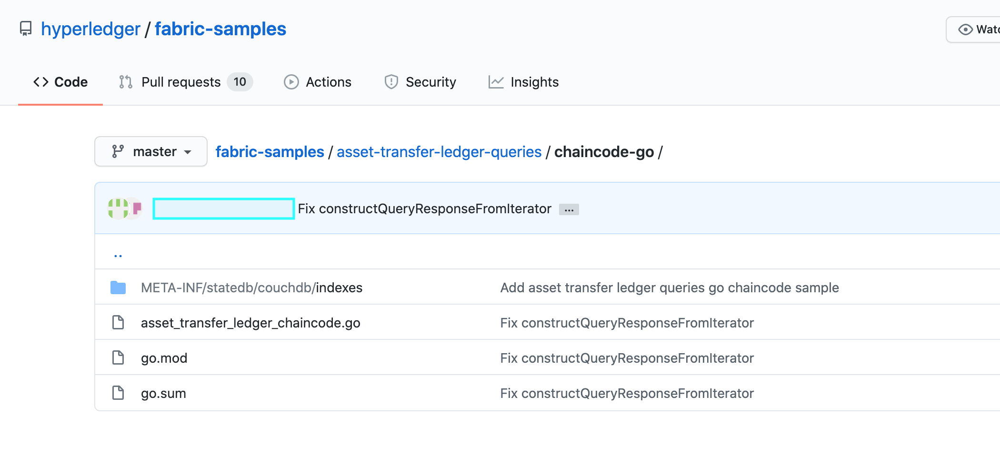

Using CouchDB
=============

This tutorial will describe the steps required to use the CouchDB as the state
database with Hyperledger Fabric. By now, you should be familiar with Fabric
concepts and have explored some of the samples and tutorials.

.. note:: These instructions use the new Fabric chaincode lifecycle introduced
          in the Fabric v2.0 release. If you would like to use the previous
          lifecycle model to use indexes with chaincode, visit the v1.4
          version of the `Using CouchDB <https://hyperledger-fabric.readthedocs.io/en/release-1.4/couchdb_tutorial.html>`__.

The tutorial will take you through the following steps:

#. :ref:`cdb-enable-couch`
#. :ref:`cdb-create-index`
#. :ref:`cdb-add-index`
#. :ref:`cdb-install-deploy`
#. :ref:`cdb-query`
#. :ref:`cdb-best`
#. :ref:`cdb-pagination`
#. :ref:`cdb-update-index`
#. :ref:`cdb-delete-index`

For a deeper dive into CouchDB refer to :doc:`couchdb_as_state_database`
and for more information on the Fabric ledger refer to the `Ledger <ledger/ledger.html>`_
topic. Follow the tutorial below for details on how to leverage CouchDB in your
blockchain network.

Throughout this tutorial, we will use the `Marbles sample <https://github.com/hyperledger/fabric-samples/blob/{BRANCH}/chaincode/marbles02/go/marbles_chaincode.go>`__
as our use case to demonstrate how to use CouchDB with Fabric and will deploy
Marbles to the Fabric test network. You should have completed the task
:doc:`install`.

Why CouchDB?
~~~~~~~~~~~~

Fabric supports two types of peer databases. LevelDB is the default state
database embedded in the peer node. LevelDB stores chaincode data as simple
key-value pairs and only supports key, key range, and composite key queries.
CouchDB is an optional, alternate state database that allows you to model data
on the ledger as JSON and issue rich queries against data values rather than
the keys. CouchDB also allows you to deploy indexes with your chaincode to make
queries more efficient and enable you to query large datasets.

In order to leverage the benefits of CouchDB, namely content-based JSON
queries, your data must be modeled in JSON format. You must decide whether to use
LevelDB or CouchDB before setting up your network. Switching a peer from using
LevelDB to CouchDB is not supported due to data compatibility issues. All peers
on the network must use the same database type. If you have a mix of JSON and
binary data values, you can still use CouchDB, however the binary values can
only be queried based on key, key range, and composite key queries.

.. _cdb-enable-couch:

Enable CouchDB in Hyperledger Fabric
~~~~~~~~~~~~~~~~~~~~~~~~~~~~~~~~~~~~

CouchDB runs as a separate database process alongside the peer. There
are additional considerations in terms of setup, management, and operations.
A Docker image of `CouchDB <https://hub.docker.com/_/couchdb/>`__
is available and we recommend that it be run on the same server as the
peer. You will need to setup one CouchDB container per peer
and update each peer container by changing the configuration found in
``core.yaml`` to point to the CouchDB container. The ``core.yaml``
file must be located in the directory specified by the environment variable
FABRIC_CFG_PATH:

* For Docker deployments, ``core.yaml`` is pre-configured and located in the peer
  container ``FABRIC_CFG_PATH`` folder. However, when using Docker environments,
  you typically pass environment variables by editing the
  ``docker-compose-couch.yaml``  to override the core.yaml

* For native binary deployments, ``core.yaml`` is included with the release artifact
  distribution.

Edit the ``stateDatabase`` section of ``core.yaml``. Specify ``CouchDB`` as the
``stateDatabase`` and fill in the associated ``couchDBConfig`` properties. For
more information, see `CouchDB configuration <couchdb_as_state_database.html#couchdb-configuration>`__.

.. _cdb-create-index:

Create an index
~~~~~~~~~~~~~~~

Why are indexes important?

Indexes allow a database to be queried without having to examine every row
with every query, making them run faster and more efficiently. Normally,
indexes are built for frequently occurring query criteria allowing the data to
be queried more efficiently. To leverage the major benefit of CouchDB -- the
ability to perform rich queries against JSON data -- indexes are not required,
but they are strongly recommended for performance. Also, if sorting is required
in a query, CouchDB requires an index of the sorted fields.

.. note::

   Rich queries that do not have an index will work but may throw a warning
   in the CouchDB log that the index was not found. However, if a rich query
   includes a sort specification, then an index on that field is required;
   otherwise, the query will fail and an error will be thrown.

To demonstrate building an index, we will use the data from the `Marbles
sample <https://github.com/hyperledger/fabric-samples/blob/{BRANCH}/chaincode/marbles02/go/marbles_chaincode.go>`__.
In this example, the Marbles data structure is defined as:

.. code:: javascript

  type marble struct {
	   ObjectType string `json:"docType"` //docType is used to distinguish the various types of objects in state database
	   Name       string `json:"name"`    //the field tags are needed to keep case from bouncing around
	   Color      string `json:"color"`
           Size       int    `json:"size"`
           Owner      string `json:"owner"`
  }

In this structure, the attributes (``docType``, ``name``, ``color``, ``size``,
``owner``) define the ledger data associated with the asset. The attribute
``docType`` is a pattern used in the chaincode to differentiate different data
types that may need to be queried separately. When using CouchDB, it
recommended to include this ``docType`` attribute to distinguish each type of
document in the chaincode namespace. (Each chaincode is represented as its own
CouchDB database, that is, each chaincode has its own namespace for keys.)

With respect to the Marbles data structure, ``docType`` is used to identify
that this document/asset is a marble asset. Potentially there could be other
documents/assets in the chaincode database. The documents in the database are
searchable against all of these attribute values.

When defining an index for use in chaincode queries, each one must be defined
in its own text file with the extension `*.json` and the index definition must
be formatted in the CouchDB index JSON format.

To define an index, three pieces of information are required:

  * `fields`: these are the frequently queried fields
  * `name`: name of the index
  * `type`: always json in this context

For example, a simple index named ``foo-index`` for a field named ``foo``.

.. code:: json

    {
        "index": {
            "fields": ["foo"]
        },
        "name" : "foo-index",
        "type" : "json"
    }

Optionally the design document  attribute ``ddoc`` can be specified on the index
definition. A `design document <http://guide.couchdb.org/draft/design.html>`__ is
CouchDB construct designed to contain indexes. Indexes can be grouped into
design documents for efficiency but CouchDB recommends one index per design
document.

.. tip:: When defining an index it is a good practice to include the ``ddoc``
         attribute and value along with the index name. It is important to
         include this attribute to ensure that you can update the index later
         if needed. Also it gives you the ability to explicitly specify which
         index to use on a query.

Here is another example of an index definition from the Marbles sample with
the index name ``indexOwner`` using multiple fields ``docType`` and ``owner``
and includes the ``ddoc`` attribute:

.. _indexExample:

.. code:: json

  {
    "index":{
        "fields":["docType","owner"] // Names of the fields to be queried
    },
    "ddoc":"indexOwnerDoc", // (optional) Name of the design document in which the index will be created.
    "name":"indexOwner",
    "type":"json"
  }

In the example above, if the design document ``indexOwnerDoc`` does not already
exist, it is automatically created when the index is deployed. An index can be
constructed with one or more attributes specified in the list of fields and
any combination of attributes can be specified. An attribute can exist in
multiple indexes for the same docType. In the following example, ``index1``
only includes the attribute ``owner``, ``index2`` includes the attributes
``owner and color`` and ``index3`` includes the attributes ``owner, color and
size``. Also, notice each index definition has its own ``ddoc`` value, following
the CouchDB recommended practice.

.. code:: json

  {
    "index":{
        "fields":["owner"] // Names of the fields to be queried
    },
    "ddoc":"index1Doc", // (optional) Name of the design document in which the index will be created.
    "name":"index1",
    "type":"json"
  }

  {
    "index":{
        "fields":["owner", "color"] // Names of the fields to be queried
    },
    "ddoc":"index2Doc", // (optional) Name of the design document in which the index will be created.
    "name":"index2",
    "type":"json"
  }

  {
    "index":{
        "fields":["owner", "color", "size"] // Names of the fields to be queried
    },
    "ddoc":"index3Doc", // (optional) Name of the design document in which the index will be created.
    "name":"index3",
    "type":"json"
  }

In general, you should model index fields to match the fields that will be used
in query filters and sorts. For more details on building an index in JSON
format refer to the `CouchDB documentation <http://docs.couchdb.org/en/latest/api/database/find.html#db-index>`__.

A final word on indexing, Fabric takes care of indexing the documents in the
database using a pattern called ``index warming``. CouchDB does not typically
index new or updated documents until the next query. Fabric ensures that
indexes stay 'warm' by requesting an index update after every block of data is
committed.  This ensures queries are fast because they do not have to index
documents before running the query. This process keeps the index current
and refreshed every time new records are added to the state database.

.. _cdb-add-index:

Add the index to your chaincode folder
~~~~~~~~~~~~~~~~~~~~~~~~~~~~~~~~~~~~~~

Once you finalize an index, you need to package it with your chaincode for
deployment by placing it in the appropriate metadata folder. You can install the
chaincode using the :doc:`commands/peerlifecycle` command. The JSON index files
must be located under the path ``META-INF/statedb/couchdb/indexes`` which is
located inside the directory where the chaincode resides.

The `Marbles sample <https://github.com/hyperledger/fabric-samples/tree/{BRANCH}/chaincode/marbles02/go>`__  below illustrates how the index
is packaged with the chaincode.

This sample includes one index named indexOwnerDoc:

.. code:: json

  {"index":{"fields":["docType","owner"]},"ddoc":"indexOwnerDoc", "name":"indexOwner","type":"json"}

Start the network
-----------------

:guilabel:`Try it yourself`

We will bring up the Fabric test network and use it to deploy the marbles
chaincode. Use the following command to navigate to the `test-network` directory
in the Fabric samples:

.. code:: bash

    cd fabric-samples/test-network

For this tutorial, we want to operate from a known initial state. The following
command will kill any active or stale Docker containers and remove previously
generated artifacts:

.. code:: bash

    ./network.sh down

If you have not run through the tutorial before, you will need to vendor the
chaincode dependencies before we can deploy it to the network. Run the
following commands:

.. code:: bash

    cd ../chaincode/marbles02/go
    GO111MODULE=on go mod vendor
    cd ../../../test-network

From the `test-network` directory, deploy the test network with CouchDB with the
following command:

.. code:: bash

    ./network.sh up createChannel -s couchdb

This will create two fabric peer nodes that use CouchDB as the state database.
It will also create one ordering node and a single channel named
``mychannel``.

.. _cdb-install-deploy:

Install and define the Chaincode
~~~~~~~~~~~~~~~~~~~~~~~~~~~~~~~~

Client applications interact with the blockchain ledger through chaincode.
Therefore we need to install a chaincode on every peer that will execute and
endorse our transactions. However, before we can interact with our chaincode,
the members of the channel need to agree on a chaincode definition that
establishes chaincode governance. In the previous section, we demonstrated how
to add the index to the chaincode folder so that the index is deployed with
the chaincode.

The chaincode needs to be packaged before it can be installed on our peers.
We can use the `peer lifecycle chaincode package <commands/peerlifecycle.html#peer-lifecycle-chaincode-package>`__ command
to package the marbles chaincode.

:guilabel:`Try it yourself`

1. After you start the test network, copy and paste the following environment
variables in your CLI to interact with the network as the Org1 admin. Make sure
that you are in the `test-network` directory.

.. code:: bash

    export PATH=${PWD}/../bin:$PATH
    export FABRIC_CFG_PATH=${PWD}/../config/
    export CORE_PEER_TLS_ENABLED=true
    export CORE_PEER_LOCALMSPID="Org1MSP"
    export CORE_PEER_TLS_ROOTCERT_FILE=${PWD}/organizations/peerOrganizations/org1.example.com/peers/peer0.org1.example.com/tls/ca.crt
    export CORE_PEER_MSPCONFIGPATH=${PWD}/organizations/peerOrganizations/org1.example.com/users/Admin@org1.example.com/msp
    export CORE_PEER_ADDRESS=localhost:7051

2. Use the following command to package the marbles chaincode:

.. code:: bash

    peer lifecycle chaincode package marbles.tar.gz --path ../chaincode/marbles02/go --lang golang --label marbles_1

This command will create a chaincode package named marbles.tar.gz.

3. Use the following command to install the chaincode package onto the peer
``peer0.org1.example.com``:

.. code:: bash

    peer lifecycle chaincode install marbles.tar.gz

A successful install command will return the chaincode identifier, similar to
the response below:

.. code:: bash

    2019-04-22 18:47:38.312 UTC [cli.lifecycle.chaincode] submitInstallProposal -> INFO 001 Installed remotely: response:<status:200 payload:"\nJmarbles_1:0907c1f3d3574afca69946e1b6132691d58c2f5c5703df7fc3b692861e92ecd3\022\tmarbles_1" >
    2019-04-22 18:47:38.312 UTC [cli.lifecycle.chaincode] submitInstallProposal -> INFO 002 Chaincode code package identifier: marbles_1:0907c1f3d3574afca69946e1b6132691d58c2f5c5703df7fc3b692861e92ecd3

After installing the chaincode on ``peer0.org1.example.com``, we need to approve
a chaincode definition for Org1.

4. Use the following command to query your peer for the package ID of the
installed chaincode.

.. code:: bash

    peer lifecycle chaincode queryinstalled

The command will return the same package identifier as the install command.
You should see output similar to the following:

.. code:: bash

    Installed chaincodes on peer:
    Package ID: marbles_1:60ec9430b221140a45b96b4927d1c3af736c1451f8d432e2a869bdbf417f9787, Label: marbles_1

5. Declare the package ID as an environment variable. Paste the package ID of
marbles_1 returned by the ``peer lifecycle chaincode queryinstalled`` command
into the command below. The package ID may not be the same for all users, so
you need to complete this step using the package ID returned from your console.

.. code:: bash

    export CC_PACKAGE_ID=marbles_1:60ec9430b221140a45b96b4927d1c3af736c1451f8d432e2a869bdbf417f9787

6. Use the following command to approve a definition of the marbles chaincode
for Org1.

.. code:: bash

    export ORDERER_CA=${PWD}/organizations/ordererOrganizations/example.com/orderers/orderer.example.com/msp/tlscacerts/tlsca.example.com-cert.pem
    peer lifecycle chaincode approveformyorg -o localhost:7050 --ordererTLSHostnameOverride orderer.example.com --channelID mychannel --name marbles --version 1.0 --signature-policy "OR('Org1MSP.member','Org2MSP.member')" --init-required --package-id $CC_PACKAGE_ID --sequence 1 --tls --cafile $ORDERER_CA

When the command completes successfully you should see something similar to :

.. code:: bash

    2020-01-07 16:24:20.886 EST [chaincodeCmd] ClientWait -> INFO 001 txid [560cb830efa1272c85d2f41a473483a25f3b12715d55e22a69d55abc46581415] committed with status (VALID) at

We need a majority of organizations to approve a chaincode definition before
it can be committed to the channel. This implies that we need Org2 to approve
the chaincode definition as well. Because we do not need Org2 to endorse the
chaincode and did not install the package on any Org2 peers, we do not need to
provide a packageID as part of the chaincode definition.

7. Use the CLI to operate as the Org2 admin. Copy and paste the following block
of commands as a group into the peer container and run them all at once.

.. code:: bash

    export CORE_PEER_LOCALMSPID="Org2MSP"
    export CORE_PEER_TLS_ROOTCERT_FILE=${PWD}/organizations/peerOrganizations/org2.example.com/peers/peer0.org2.example.com/tls/ca.crt
    export CORE_PEER_MSPCONFIGPATH=${PWD}/organizations/peerOrganizations/org2.example.com/users/Admin@org2.example.com/msp
    export CORE_PEER_ADDRESS=localhost:9051

8. Use the following command to approve the chaincode definition for Org2:

.. code:: bash

    peer lifecycle chaincode approveformyorg -o localhost:7050 --ordererTLSHostnameOverride orderer.example.com --channelID mychannel --name marbles --version 1.0 --signature-policy "OR('Org1MSP.member','Org2MSP.member')" --init-required --sequence 1 --tls --cafile $ORDERER_CA

9. We can now use the `peer lifecycle chaincode commit <commands/peerlifecycle.html#peer-lifecycle-chaincode-commit>`__ command
to commit the chaincode definition to the channel:

.. code:: bash

    export ORDERER_CA=${PWD}/organizations/ordererOrganizations/example.com/orderers/orderer.example.com/msp/tlscacerts/tlsca.example.com-cert.pem
    export ORG1_CA=${PWD}/organizations/peerOrganizations/org1.example.com/peers/peer0.org1.example.com/tls/ca.crt
    export ORG2_CA=${PWD}/organizations/peerOrganizations/org2.example.com/peers/peer0.org2.example.com/tls/ca.crt
    peer lifecycle chaincode commit -o localhost:7050 --ordererTLSHostnameOverride orderer.example.com --channelID mychannel --name marbles --version 1.0 --sequence 1 --signature-policy "OR('Org1MSP.member','Org2MSP.member')" --init-required --tls --cafile $ORDERER_CA --peerAddresses localhost:7051 --tlsRootCertFiles $ORG1_CA --peerAddresses localhost:9051 --tlsRootCertFiles $ORG2_CA

When the commit transaction completes successfully you should see something
similar to:

.. code:: bash

    2019-04-22 18:57:34.274 UTC [chaincodeCmd] ClientWait -> INFO 001 txid [3da8b0bb8e128b5e1b6e4884359b5583dff823fce2624f975c69df6bce614614] committed with status (VALID) at peer0.org2.example.com:9051
    2019-04-22 18:57:34.709 UTC [chaincodeCmd] ClientWait -> INFO 002 txid [3da8b0bb8e128b5e1b6e4884359b5583dff823fce2624f975c69df6bce614614] committed with status (VALID) at peer0.org1.example.com:7051

10. Because the marbles chaincode contains an initialization function, we need to
use the `peer chaincode invoke <commands/peerchaincode.html?%20chaincode%20instantiate#peer-chaincode-invoke>`__ command
to invoke ``Init()`` before we can use other functions in the chaincode:

.. code:: bash

    peer chaincode invoke -o localhost:7050 --ordererTLSHostnameOverride orderer.example.com --channelID mychannel --name marbles --isInit --tls --cafile $ORDERER_CA --peerAddresses localhost:7051 --tlsRootCertFiles $ORG1_CA -c '{"Args":["Init"]}'

Verify index was deployed
-------------------------

Indexes will be deployed to each peer's CouchDB state database once the
chaincode has been installed on the peer and deployed to the channel. You can
verify that the CouchDB index was created successfully by examining the peer log
in the Docker container.

:guilabel:`Try it yourself`

To view the logs in the peer Docker container, open a new Terminal window and
run the following command to grep for message confirmation that the index was
created.

::

   docker logs peer0.org1.example.com  2>&1 | grep "CouchDB index"

You should see a result that looks like the following:

::

   [couchdb] CreateIndex -> INFO 0be Created CouchDB index [indexOwner] in state database [mychannel_marbles] using design document [_design/indexOwnerDoc]

.. note:: If you installed Marbles on a different peer than ``peer0.org1.example.com``,
          you may need to replace it with the name of a different peer where
          Marbles was installed.

.. _cdb-query:

Query the CouchDB State Database
~~~~~~~~~~~~~~~~~~~~~~~~~~~~~~~~

Now that the index has been defined in the JSON file and deployed alongside the
chaincode, chaincode functions can execute JSON queries against the CouchDB
state database, and thereby peer commands can invoke the chaincode functions.

Specifying an index name on a query is optional. If not specified, and an index
already exists for the fields being queried, the existing index will be
automatically used.

.. tip:: It is a good practice to explicitly include an index name on a
         query using the ``use_index`` keyword. Without it, CouchDB may pick a
         less optimal index. Also CouchDB may not use an index at all and you
         may not realize it, at the low volumes during testing. Only upon
         higher volumes you may realize slow performance because CouchDB is not
         using an index and you assumed it was.

Build the query in chaincode
----------------------------

You can perform complex rich queries against the data on the ledger using
queries defined within your chaincode. The `marbles02 sample <https://github.com/hyperledger/fabric-samples/blob/{BRANCH}/chaincode/marbles02/go/marbles_chaincode.go>`__
includes two rich query functions:

  * **queryMarbles** --

      Example of an **ad hoc rich query**. This is a query
      where a (selector) string can be passed into the function. This query
      would be useful to client applications that need to dynamically build
      their own selectors at runtime. For more information on selectors refer
      to `CouchDB selector syntax <http://docs.couchdb.org/en/latest/api/database/find.html#find-selectors>`__.

  * **queryMarblesByOwner** --

      Example of a **parameterized query** where the
      query logic is baked into the chaincode. In this case the function accepts
      a single argument, the marble owner. It then queries the state database for
      JSON documents matching the docType of “marble” and the owner id using the
      JSON query syntax.

Run the query using the peer command
------------------------------------

In absence of a client application, we can use the peer command to test the
queries defined in the chaincode. We will customize the `peer chaincode query <commands/peerchaincode.html?%20chaincode%20query#peer-chaincode-query>`__
command to use the Marbles index ``indexOwner`` and query for all marbles owned
by "tom" using the ``queryMarbles`` function.

:guilabel:`Try it yourself`

Before querying the database, we should add some data. Run the following
command as Org1 to create a marble owned by "tom":

.. code:: bash

    export CORE_PEER_LOCALMSPID="Org1MSP"
    export CORE_PEER_TLS_ROOTCERT_FILE=${PWD}/organizations/peerOrganizations/org1.example.com/peers/peer0.org1.example.com/tls/ca.crt
    export CORE_PEER_MSPCONFIGPATH=${PWD}/organizations/peerOrganizations/org1.example.com/users/Admin@org1.example.com/msp
    export CORE_PEER_ADDRESS=localhost:7051
    peer chaincode invoke -o localhost:7050 --ordererTLSHostnameOverride orderer.example.com --tls --cafile ${PWD}/organizations/ordererOrganizations/example.com/orderers/orderer.example.com/msp/tlscacerts/tlsca.example.com-cert.pem -C mychannel -n marbles -c '{"Args":["initMarble","marble1","blue","35","tom"]}'

After an index has been deployed when the chaincode is initialized, it will
automatically be utilized by chaincode queries. CouchDB can determine which
index to use based on the fields being queried. If an index exists for the
query criteria it will be used. However the recommended approach is to
specify the ``use_index`` keyword on the query. The peer command below is an
example of how to specify the index explicitly in the selector syntax by
including the ``use_index`` keyword:

.. code:: bash

   // Rich Query with index name explicitly specified:
   peer chaincode query -C mychannel -n marbles -c '{"Args":["queryMarbles", "{\"selector\":{\"docType\":\"marble\",\"owner\":\"tom\"}, \"use_index\":[\"_design/indexOwnerDoc\", \"indexOwner\"]}"]}'

Delving into the query command above, there are three arguments of interest:

*  ``queryMarbles``

  Name of the function in the Marbles chaincode. Notice a `shim <https://godoc.org/github.com/hyperledger/fabric-chaincode-go/shim>`__
  ``shim.ChaincodeStubInterface`` is used to access and modify the ledger. The
  ``getQueryResultForQueryString()`` passes the queryString to the shim API ``getQueryResult()``.

.. code:: bash

  func (t *SimpleChaincode) queryMarbles(stub shim.ChaincodeStubInterface, args []string) pb.Response {

	  //   0
	  // "queryString"
	   if len(args) < 1 {
		   return shim.Error("Incorrect number of arguments. Expecting 1")
	   }

	   queryString := args[0]

	   queryResults, err := getQueryResultForQueryString(stub, queryString)
	   if err != nil {
		 return shim.Error(err.Error())
	   }
	   return shim.Success(queryResults)
  }

*  ``{"selector":{"docType":"marble","owner":"tom"}``

  This is an example of an **ad hoc selector** string which finds all documents
  of type ``marble`` where the ``owner`` attribute has a value of ``tom``.

*  ``"use_index":["_design/indexOwnerDoc", "indexOwner"]``

  Specifies both the design doc name  ``indexOwnerDoc`` and index name
  ``indexOwner``. In this example the selector query explicitly includes the
  index name, specified by using the ``use_index`` keyword. Recalling the
  index definition above :ref:`cdb-create-index`, it contains a design doc,
  ``"ddoc":"indexOwnerDoc"``. With CouchDB, if you plan to explicitly include
  the index name on the query, then the index definition must include the
  ``ddoc`` value, so it can be referenced with the ``use_index`` keyword.

The query runs successfully and the index is leveraged with the following results:

.. code:: json

  Query Result: [{"Key":"marble1", "Record":{"color":"blue","docType":"marble","name":"marble1","owner":"tom","size":35}}]

.. _cdb-best:

Use best practices for queries and indexes
~~~~~~~~~~~~~~~~~~~~~~~~~~~~~~~~~~~~~~~~~~

Queries that use indexes will complete faster, without having to scan the full
database in couchDB. Understanding indexes will allow you to write your queries
for better performance and help your application handle larger amounts
of data or blocks on your network.

It is also important to plan the indexes you install with your chaincode. You
should install only a few indexes per chaincode that support most of your queries.
Adding too many indexes, or using an excessive number of fields in an index, will
degrade the performance of your network. This is because the indexes are updated
after each block is committed. The more indexes need to be updated through
"index warming", the longer it will take for transactions to complete.

The examples in this section will help demonstrate how queries use indexes and
what type of queries will have the best performance. Remember the following
when writing your queries:

* All fields in the index must also be in the selector or sort sections of your query
  for the index to be used.
* More complex queries will have a lower performance and will be less likely to
  use an index.
* You should try to avoid operators that will result in a full table scan or a
  full index scan such as ``$or``, ``$in`` and ``$regex``.

In the previous section of this tutorial, you issued the following query against
the marbles chaincode:

.. code:: bash

  // Example one: query fully supported by the index
  export CHANNEL_NAME=mychannel
  peer chaincode query -C $CHANNEL_NAME -n marbles -c '{"Args":["queryMarbles", "{\"selector\":{\"docType\":\"marble\",\"owner\":\"tom\"}, \"use_index\":[\"indexOwnerDoc\", \"indexOwner\"]}"]}'

The marbles chaincode was installed with the ``indexOwnerDoc`` index:

.. code:: json

  {"index":{"fields":["docType","owner"]},"ddoc":"indexOwnerDoc", "name":"indexOwner","type":"json"}

Notice that both the fields in the query, ``docType`` and ``owner``, are
included in the index, making it a fully supported query. As a result this
query will be able to use the data in the index, without having to search the
full database. Fully supported queries such as this one will return faster than
other queries from your chaincode.

If you add extra fields to the query above, it will still use the index.
However, the query will additionally have to scan the indexed data for the
extra fields, resulting in a longer response time. As an example, the query
below will still use the index, but will take a longer time to return than the
previous example.

.. code:: bash

  // Example two: query fully supported by the index with additional data
  peer chaincode query -C $CHANNEL_NAME -n marbles -c '{"Args":["queryMarbles", "{\"selector\":{\"docType\":\"marble\",\"owner\":\"tom\",\"color\":\"red\"}, \"use_index\":[\"/indexOwnerDoc\", \"indexOwner\"]}"]}'

A query that does not include all fields in the index will have to scan the full
database instead. For example, the query below searches for the owner, without
specifying the type of item owned. Since the ownerIndexDoc contains both
the ``owner`` and ``docType`` fields, this query will not be able to use the
index.

.. code:: bash

  // Example three: query not supported by the index
  peer chaincode query -C $CHANNEL_NAME -n marbles -c '{"Args":["queryMarbles", "{\"selector\":{\"owner\":\"tom\"}, \"use_index\":[\"indexOwnerDoc\", \"indexOwner\"]}"]}'

In general, more complex queries will have a longer response time, and have a
lower chance of being supported by an index. Operators such as ``$or``, ``$in``,
and ``$regex`` will often cause the query to scan the full index or not use the
index at all.

As an example, the query below contains an ``$or`` term that will search for every
marble and every item owned by tom.

.. code:: bash

  // Example four: query with $or supported by the index
  peer chaincode query -C $CHANNEL_NAME -n marbles -c '{"Args":["queryMarbles", "{\"selector\":{\"$or\":[{\"docType\":\"marble\"},{\"owner\":\"tom\"}]}, \"use_index\":[\"indexOwnerDoc\", \"indexOwner\"]}"]}'

This query will still use the index because it searches for fields that are
included in ``indexOwnerDoc``. However, the ``$or`` condition in the query
requires a scan of all the items in the index, resulting in a longer response
time.

Below is an example of a complex query that is not supported by the index.

.. code:: bash

  // Example five: Query with $or not supported by the index
  peer chaincode query -C $CHANNEL_NAME -n marbles -c '{"Args":["queryMarbles", "{\"selector\":{\"$or\":[{\"docType\":\"marble\",\"owner\":\"tom\"},{\"color\":\"yellow\"}]}, \"use_index\":[\"indexOwnerDoc\", \"indexOwner\"]}"]}'

The query searches for all marbles owned by tom or any other items that are
yellow. This query will not use the index because it will need to search the
entire table to meet the ``$or`` condition. Depending the amount of data on your
ledger, this query will take a long time to respond or may timeout.

While it is important to follow best practices with your queries, using indexes
is not a solution for collecting large amounts of data. The blockchain data
structure is optimized to validate and confirm transactions and is not suited
for data analytics or reporting. If you want to build a dashboard as part
of your application or analyze the data from your network, the best practice is
to query an off chain database that replicates the data from your peers. This
will allow you to understand the data on the blockchain without degrading the
performance of your network or disrupting transactions.

You can use block or chaincode events from your application to write transaction
data to an off-chain database or analytics engine. For each block received, the block
listener application would iterate through the block transactions and build a data
store using the key/value writes from each valid transaction's ``rwset``. The
:doc:`peer_event_services` provide replayable events to ensure the integrity of
downstream data stores. For an example of how you can use an event listener to write
data to an external database, visit the `Off chain data sample <https://github.com/hyperledger/fabric-samples/tree/{BRANCH}/off_chain_data>`__
in the Fabric Samples.

.. _cdb-pagination:

Query the CouchDB State Database With Pagination
~~~~~~~~~~~~~~~~~~~~~~~~~~~~~~~~~~~~~~~~~~~~~~~~

When large result sets are returned by CouchDB queries, a set of APIs is
available which can be called by chaincode to paginate the list of results.
Pagination provides a mechanism to partition the result set by
specifying a ``pagesize`` and a start point -- a ``bookmark`` which indicates
where to begin the result set. The client application iteratively invokes the
chaincode that executes the query until no more results are returned. For more information refer to
this `topic on pagination with CouchDB <couchdb_as_state_database.html#couchdb-pagination>`__.

We will use the `Marbles sample <https://github.com/hyperledger/fabric-samples/blob/{BRANCH}/chaincode/marbles02/go/marbles_chaincode.go>`__
function ``queryMarblesWithPagination`` to  demonstrate how
pagination can be implemented in chaincode and the client application.

* **queryMarblesWithPagination** --

    Example of an **ad hoc rich query with pagination**. This is a query
    where a (selector) string can be passed into the function similar to the
    above example.  In this case, a ``pageSize`` is also included with the query as
    well as a ``bookmark``.

In order to demonstrate pagination, more data is required. This example assumes
that you have already added marble1 from above. Run the following commands in
the peer container to create four more marbles owned by "tom", to create a
total of five marbles owned by "tom":

:guilabel:`Try it yourself`

.. code:: bash

    export CORE_PEER_LOCALMSPID="Org1MSP"
    export CORE_PEER_TLS_ROOTCERT_FILE=${PWD}/organizations/peerOrganizations/org1.example.com/peers/peer0.org1.example.com/tls/ca.crt
    export CORE_PEER_MSPCONFIGPATH=${PWD}/organizations/peerOrganizations/org1.example.com/users/Admin@org1.example.com/msp
    export CORE_PEER_ADDRESS=localhost:7051
    peer chaincode invoke -o localhost:7050 --ordererTLSHostnameOverride orderer.example.com --tls --cafile  ${PWD}/organizations/ordererOrganizations/example.com/orderers/orderer.example.com/msp/tlscacerts/tlsca.example.com-cert.pem -C mychannel -n marbles -c '{"Args":["initMarble","marble2","yellow","35","tom"]}'
    peer chaincode invoke -o localhost:7050 --ordererTLSHostnameOverride orderer.example.com --tls --cafile  ${PWD}/organizations/ordererOrganizations/example.com/orderers/orderer.example.com/msp/tlscacerts/tlsca.example.com-cert.pem -C mychannel -n marbles -c '{"Args":["initMarble","marble3","green","20","tom"]}'
    peer chaincode invoke -o localhost:7050 --ordererTLSHostnameOverride orderer.example.com --tls --cafile  ${PWD}/organizations/ordererOrganizations/example.com/orderers/orderer.example.com/msp/tlscacerts/tlsca.example.com-cert.pem -C mychannel -n marbles -c '{"Args":["initMarble","marble4","purple","20","tom"]}'
    peer chaincode invoke -o localhost:7050 --ordererTLSHostnameOverride orderer.example.com --tls --cafile  ${PWD}/organizations/ordererOrganizations/example.com/orderers/orderer.example.com/msp/tlscacerts/tlsca.example.com-cert.pem -C mychannel -n marbles -c '{"Args":["initMarble","marble5","blue","40","tom"]}'

In addition to the arguments for the query in the previous example,
queryMarblesWithPagination adds ``pagesize`` and ``bookmark``. ``PageSize``
specifies the number of records to return per query.  The ``bookmark`` is an
"anchor" telling couchDB where to begin the page. (Each page of results returns
a unique bookmark.)

*  ``queryMarblesWithPagination``

  Name of the function in the Marbles chaincode. Notice a `shim <https://godoc.org/github.com/hyperledger/fabric-chaincode-go/shim>`__
  ``shim.ChaincodeStubInterface`` is used to access and modify the ledger. The
  ``getQueryResultForQueryStringWithPagination()`` passes the queryString along
  with the pagesize and bookmark to the shim API ``GetQueryResultWithPagination()``.

.. code:: bash

  func (t *SimpleChaincode) queryMarblesWithPagination(stub shim.ChaincodeStubInterface, args []string) pb.Response {

  	//   0
  	// "queryString"
  	if len(args) < 3 {
  		return shim.Error("Incorrect number of arguments. Expecting 3")
  	}

  	queryString := args[0]
  	//return type of ParseInt is int64
  	pageSize, err := strconv.ParseInt(args[1], 10, 32)
  	if err != nil {
  		return shim.Error(err.Error())
  	}
  	bookmark := args[2]

  	queryResults, err := getQueryResultForQueryStringWithPagination(stub, queryString, int32(pageSize), bookmark)
  	if err != nil {
  		return shim.Error(err.Error())
  	}
  	return shim.Success(queryResults)
  }

The following example is a peer command which calls queryMarblesWithPagination
with a pageSize of ``3`` and no bookmark specified.

.. tip:: When no bookmark is specified, the query starts with the "first"
         page of records.

:guilabel:`Try it yourself`

.. code:: bash

  // Rich Query with index name explicitly specified and a page size of 3:
  peer chaincode query -C $CHANNEL_NAME -n marbles -c '{"Args":["queryMarblesWithPagination", "{\"selector\":{\"docType\":\"marble\",\"owner\":\"tom\"}, \"use_index\":[\"_design/indexOwnerDoc\", \"indexOwner\"]}","3",""]}'

The following response is received (carriage returns added for clarity), three
of the five marbles are returned because the ``pagsize`` was set to ``3``:

.. code:: bash

  [{"Key":"marble1", "Record":{"color":"blue","docType":"marble","name":"marble1","owner":"tom","size":35}},
   {"Key":"marble2", "Record":{"color":"yellow","docType":"marble","name":"marble2","owner":"tom","size":35}},
   {"Key":"marble3", "Record":{"color":"green","docType":"marble","name":"marble3","owner":"tom","size":20}}]
  [{"ResponseMetadata":{"RecordsCount":"3",
  "Bookmark":"g1AAAABLeJzLYWBgYMpgSmHgKy5JLCrJTq2MT8lPzkzJBYqz5yYWJeWkGoOkOWDSOSANIFk2iCyIyVySn5uVBQAGEhRz"}}]

.. note::  Bookmarks are uniquely generated by CouchDB for each query and
           represent a placeholder in the result set. Pass the
           returned bookmark on the subsequent iteration of the query to
           retrieve the next set of results.

The following is a peer command to call queryMarblesWithPagination with a
pageSize of ``3``. Notice this time, the query includes the bookmark returned
from the previous query.

:guilabel:`Try it yourself`

.. code:: bash

  peer chaincode query -C $CHANNEL_NAME -n marbles -c '{"Args":["queryMarblesWithPagination", "{\"selector\":{\"docType\":\"marble\",\"owner\":\"tom\"}, \"use_index\":[\"_design/indexOwnerDoc\", \"indexOwner\"]}","3","g1AAAABLeJzLYWBgYMpgSmHgKy5JLCrJTq2MT8lPzkzJBYqz5yYWJeWkGoOkOWDSOSANIFk2iCyIyVySn5uVBQAGEhRz"]}'

The following response is received (carriage returns added for clarity).  The
last two records are retrieved:

.. code:: bash

  [{"Key":"marble4", "Record":{"color":"purple","docType":"marble","name":"marble4","owner":"tom","size":20}},
   {"Key":"marble5", "Record":{"color":"blue","docType":"marble","name":"marble5","owner":"tom","size":40}}]
  [{"ResponseMetadata":{"RecordsCount":"2",
  "Bookmark":"g1AAAABLeJzLYWBgYMpgSmHgKy5JLCrJTq2MT8lPzkzJBYqz5yYWJeWkmoKkOWDSOSANIFk2iCyIyVySn5uVBQAGYhR1"}}]

The final command is a peer command to call queryMarblesWithPagination with
a pageSize of ``3`` and with the bookmark from the previous query.

:guilabel:`Try it yourself`

.. code:: bash

    peer chaincode query -C $CHANNEL_NAME -n marbles -c '{"Args":["queryMarblesWithPagination", "{\"selector\":{\"docType\":\"marble\",\"owner\":\"tom\"}, \"use_index\":[\"_design/indexOwnerDoc\", \"indexOwner\"]}","3","g1AAAABLeJzLYWBgYMpgSmHgKy5JLCrJTq2MT8lPzkzJBYqz5yYWJeWkmoKkOWDSOSANIFk2iCyIyVySn5uVBQAGYhR1"]}'

The following response is received (carriage returns added for clarity).
No records are returned, indicating that all pages have been retrieved:

.. code:: bash

    []
    [{"ResponseMetadata":{"RecordsCount":"0",
    "Bookmark":"g1AAAABLeJzLYWBgYMpgSmHgKy5JLCrJTq2MT8lPzkzJBYqz5yYWJeWkmoKkOWDSOSANIFk2iCyIyVySn5uVBQAGYhR1"}}]

For an example of how a client application can iterate over
the result sets using pagination, search for the ``getQueryResultForQueryStringWithPagination``
function in the `Marbles sample <https://github.com/hyperledger/fabric-samples/blob/{BRANCH}/chaincode/marbles02/go/marbles_chaincode.go>`__.

.. _cdb-update-index:

Update an Index
~~~~~~~~~~~~~~~

It may be necessary to update an index over time. The same index may exist in
subsequent versions of the chaincode that gets installed. In order for an index
to be updated, the original index definition must have included the design
document ``ddoc`` attribute and an index name. To update an index definition,
use the same index name but alter the index definition. Simply edit the index
JSON file and add or remove fields from the index. Fabric only supports the
index type JSON. Changing the index type is not supported. The updated
index definition gets redeployed to the peer’s state database when the chaincode
definition is committed to the channel. Changes to the index name or ``ddoc``
attributes will result in a new index being created and the original index remains
unchanged in CouchDB until it is removed.

.. note:: If the state database has a significant volume of data, it will take
          some time for the index to be re-built, during which time chaincode
          invokes that issue queries may fail or timeout.

Iterating on your index definition
----------------------------------

If you have access to your peer's CouchDB state database in a development
environment, you can iteratively test various indexes in support of
your chaincode queries. Any changes to chaincode though would require
redeployment. Use the `CouchDB Fauxton interface <http://docs.couchdb.org/en/latest/fauxton/index.html>`__ or a command
line curl utility to create and update indexes.

.. note:: The Fauxton interface is a web UI for the creation, update, and
          deployment of indexes to CouchDB. If you want to try out this
          interface, there is an example of the format of the Fauxton version
          of the index in Marbles sample. If you have deployed the test network
          with CouchDB, the Fauxton interface can be loaded by opening a browser
          and navigating to ``http://localhost:5984/_utils``.

Alternatively, if you prefer not use the Fauxton UI, the following is an example
of a curl command which can be used to create the index on the database
``mychannel_marbles``:

.. code:: bash

  // Index for docType, owner.
  // Example curl command line to define index in the CouchDB channel_chaincode database
   curl -i -X POST -H "Content-Type: application/json" -d
          "{\"index\":{\"fields\":[\"docType\",\"owner\"]},
            \"name\":\"indexOwner\",
            \"ddoc\":\"indexOwnerDoc\",
            \"type\":\"json\"}" http://hostname:port/mychannel_marbles/_index

.. note:: If you are using the test network configured with CouchDB, replace
    hostname:port with ``localhost:5984``.

.. _cdb-delete-index:

Delete an Index
~~~~~~~~~~~~~~~

Index deletion is not managed by Fabric tooling. If you need to delete an index,
manually issue a curl command against the database or delete it using the
Fauxton interface.

The format of the curl command to delete an index would be:

.. code:: bash

   curl -X DELETE http://localhost:5984/{database_name}/_index/{design_doc}/json/{index_name} -H  "accept: */*" -H  "Host: localhost:5984"

To delete the index used in this tutorial, the curl command would be:

.. code:: bash

   curl -X DELETE http://localhost:5984/mychannel_marbles/_index/indexOwnerDoc/json/indexOwner -H  "accept: */*" -H  "Host: localhost:5984"

.. Licensed under Creative Commons Attribution 4.0 International License
   https://creativecommons.org/licenses/by/4.0/
