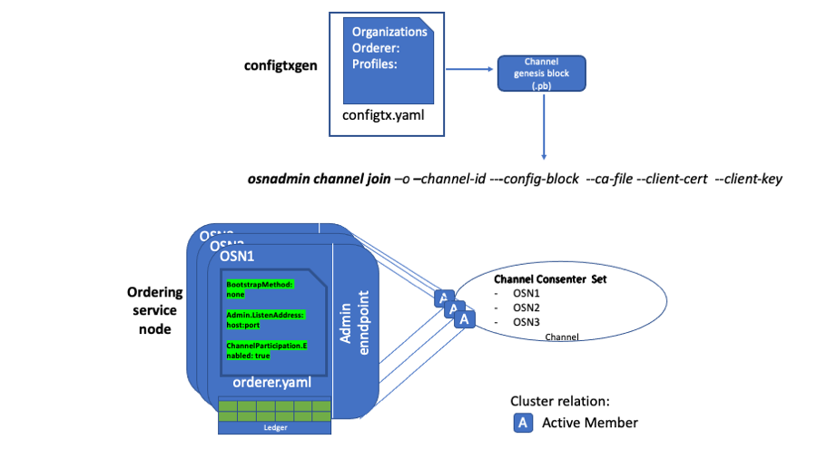
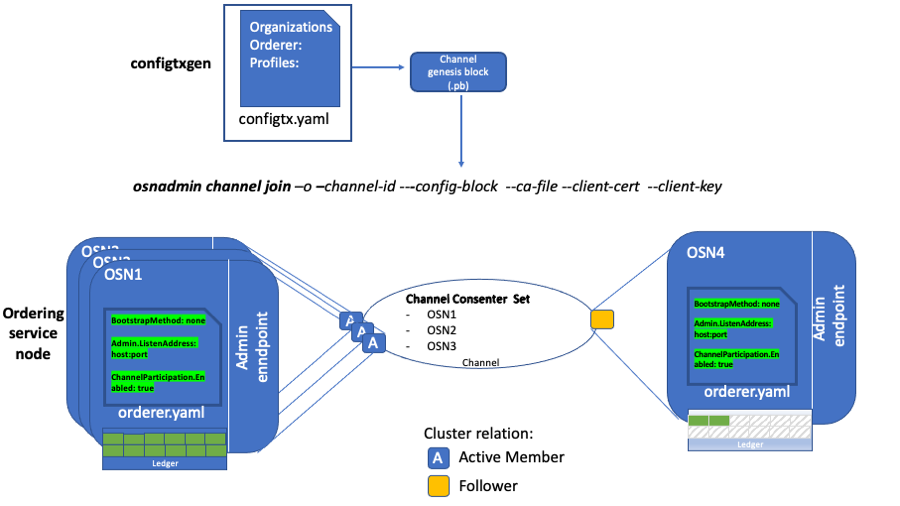

# Create a channel without a system channel

<<<<<<< HEAD
Fabric v2.3 introduces the ability to create channels between network members without requiring an ordering service system channel. This feature greatly simplifies the channel creation process and provides a mechanism for Raft consenters to join a channel with zero downtime. Use this tutorial to learn how to create new channels without a system channel by using [configtxgen](../commands/configtxgen.html) tool along with the [osnadmin CLI](../commands/osnadminchannel.html).

**How this process differs from the legacy process:**

 * **System channel no longer required**: Previously a channel managed by the ordering service (called the "system channel") was defined using the `configtxgen` tool to create a genesis block. This channel was exclusively managed by the ordering service and was the template on which all application channels were based. Besides the creation of the system representing an extra step (as compared to the new process), this system channel created an extra layer of administration that, for some use cases, provided no tangible benefit.
 * **Consortium no longer required**: You no longer need to define the set of organizations, known as the "consortium", who are permitted to create channels on a particular ordering service. With this new process, **all channels are application channels**, so the concept of a list of organizations who can create channels no longer applies. Any set of organizations can get together and create a channel using a defined set of ordering nodes (which become the ordering service of that channel). Additionally, if the MSP of the peer organization, as listed in the system channel, needs to be changed, the peer organization to coordinate with an orderer organization to change the MSP.
 * **Simplified ordering node creation process**: Because a genesis block no longer needs to exist before an ordering node is created, admins can now focus on the process of setting up their infrastructure and making sure their node is working correctly before joining a particular application channel. Additionally, because an ordering node no longer needs to scan the system channel to determine which channels it is joined to and then replicate those ledgers, the node starts up more rapidly.

**Benefits of the new process:**

 * **Increased privacy**: Because all ordering nodes used to be joined to the system channel, every ordering node in a network knew about the existence of every channel on that ordering service, even if the node itself wasn't a consenter on that channel and therefore wasn't ordering or store its blocks. Now, an ordering node only knows about the channels it is joined to.
 * **Scalability**: When there is a large number of ordering nodes on the system channel, starting the node can take a long time as it has to wait for each orderer to replicate the system channel ledger showing it has joined. Additionally, large numbers of nodes on the system channel increases the number of "alive" messages being sent between nodes. In large system channels with large numbers of nodes, this can cause processing issues, even if no application channels has a large number of ordering nodes on it.
 * **Flexibility**: Whereas ordering nodes could only be part of a single ordering service, orderers can now join or leave channels as needed, similar to how peers can join any channel its organization is a member of.
 * **Operational benefits**:
  * It is now easy to list the channels the ordering node is a consenter on.
  * Is now easy to delete a channel and all of the ledger associated with that channel.
  * Ordering nodes now detect that they have been added to a channel more quickly. Previously, this process could take several minutes, causing ordering node admins to restart their nodes so that the node could detect that it was joined more quickly.

Whereas in the past an orderer could only be part of a single ordering service, now orderers can join (or leave) any number of channels as needed, similar to how peers can participate in multiple channels.

**Note:** The osnadmin `join channel` and `remove channel` commands only works with Raft ordering nodes, they cannot be used with a Solo or Kafka ordering service.
=======
To simplify the channel creation process and enhance the privacy and scalability of channels, it is now possible to create application channels (where transactions involving assets happen) without first creating a "system channel" managed by the ordering service. Use this tutorial to learn how to create new channels without a system channel by using the [configtxgen](../commands/configtxgen.html) tool to create a genesis block and the [osnadmin CLI](../commands/osnadminchannel.html) (which runs against a REST API exposed by each ordering service node) to join ordering nodes to a channel. This process allows ordering nodes to join (or leave) any number of channels as needed, similar to how peers can participate in multiple channels.

**How this process differs from the legacy process:**

 * **System channel no longer required**: Besides the creation of the system channel representing an extra step (as compared to the new process), this system channel created an extra layer of administration that, for some use cases, provided no tangible benefit.
 * **Consortium no longer required**: You no longer need to define the set of organizations, known as the "consortium", who are permitted to create channels on a particular ordering service. With this new process, **all channels are application channels**, so the concept of a list of organizations who can create channels no longer applies. Any set of organizations can get together and create a channel using a defined set of ordering nodes (which become the ordering service of that channel).
 * **Simplified ordering node creation process**: Because a system channel genesis block no longer needs to exist before an ordering node is created, admins can now focus on the process of setting up their infrastructure and making sure their node is working correctly before joining a particular application channel.

**Benefits of the new process:**

 * **Increased privacy**: Because all ordering nodes used to be joined to the system channel, every ordering node in a network knew about the existence of every channel on that ordering service, even if the node itself wasn't a consenter on that channel and therefore wasn't ordering or storing its blocks. Now, an ordering node only knows about the channels it is joined to.
 * **Scalability**: When there is a large number of ordering nodes on the system channel, starting the node can take a long time as it has to wait for each orderer to replicate the system channel ledger showing it has joined. Additionally, large numbers of nodes on the system channel increases the number of heartbeat messages being sent between nodes. In large system channels with a large number of nodes, this can cause processing issues, even if no application channels have a large number of ordering nodes on it.
 * **Flexibility**: Whereas ordering nodes could only be part of a single ordering service, orderers can now join or leave channels as needed, similar to how peers can join any channel its organization is a member of.
 * **Operational benefits**:
    * Easy to list the channels that the ordering node is a consenter on.
    * Simple process to remove a channel and the blocks associated with that channel.
    * Orderer nodes can now track channels as a follower before being added to a channel's consenter set, allowing them to detect this addition more quickly. Previously, this process could take several minutes, causing ordering node admins to restart their nodes so that the node could detect that it was joined more quickly.
    * If the MSP of a peer organization, as listed in the system channel, needs to be changed, the peer organization no longer needs to coordinate with an admin of the system channel to change the MSP.

**Note: the new mode of creating channels is incompatible with creating a channel using a system channel. If the system channel exists, the `channel join` operation is not supported. Similarly, `channel join` and `channel remove` cannot be used with a Solo or Kafka ordering service.**

Note: “Mixed mode” management, where the system channel is to create channels on some ordering nodes and the new process is used to create channels on other ordering nodes is not supported and highly discouraged. You must either transition to the new process or continue to use the system channel process. For information about removing the system channel from an existing ordering service as part of transitioning to the new process, check out [Remove the system channel](#remove-the-system-channel).
>>>>>>> 8d01fe602... Edits for RFC language

While creating the channel, this tutorial will take you through the following steps and concepts:

- [Prerequisites](#prerequisites)
- [Step one: Generate the genesis block of the channel](#step-one-generate-the-genesis-block-of-the-channel)
- [Step two: Use the `osnadmin` CLI to add the first orderer to the channel](#step-two-use-the-osnadmin-cli-to-add-the-first-orderer-to-the-channel)
- [Step three: Join additional ordering nodes](#step-three-join-additional-ordering-nodes)
- [Next steps](#next-steps)

## Folder structure

This tutorial uses the following folder structure for the generated orderer organization MSP and orderer certificates, and while it is not mandatory, it is useful when referring to the certificates referenced by the commands.

```
├── organizations
│       ├── ordererOrganizations
│       │   └── ordererOrg1.example.com
│       │       ├── msp
│       │       │   ├── cacerts
│       │       │   | └── ca-cert.pem
│       │       │   ├── config.yaml
│       │       │   ├── tlscacerts
│       │       │   | └── tls-ca-cert.pem
│       │       └── ordering-service-nodes
│       │           ├── osn1.ordererOrg1.example.com
│       │           │   ├── msp
│       │           │   │   ├── IssuerPublicKey
│       │           │   │   ├── IssuerRevocationPublicKey
│       │           │   │   ├── cacerts
│       │           │   │   │   └── ca-cert.pem
│       │           │   │   ├── config.yaml
│       │           │   │   ├── keystore
│       │           │   │   │   └── key.pem
│       │           │   │   ├── signcerts
│       │           │   │   │   └── cert.pem
│       │           │   │   └── user
│       │           │   └── tls
│       │           │       ├── IssuerPublicKey
│       │           │       ├── IssuerRevocationPublicKey
│       │           │       ├── cacerts
│       │           │       │   └── tls-ca-cert.pem
│       │           │       ├── keystore
│       │           │       │   └── tls-key.pem
│       │           │       ├── signcerts
│       │           │       │   └── cert.pem
│       │           │       └── user

```

There are three sections in the folder structure above to consider:
- **Orderer organization MSP:** the `organizations/ordererOrganizations/ordererOrg1.example.com/msp` folder contains the orderer organization MSP that includes the `cacerts` and  `tlscacerts` folders that you need to create and then copy in the root certificates (`ca-cert.pem`) for the organization CA and TLS CA respectively. If you are using an intermediate CA, you also need to include the corresponding `intermediatecerts` and `tlsintermediatecerts` folders.
<<<<<<< HEAD
- **Orderer local MSP:** the `organizations/ordererOrganizations/ordererOrg1.example.com/ordering-service-nodes/osn1.ordererOrg1.example.com/msp` folder, also known as the orderer local MSP, contains the enrollment certificate and private key for the ordering service `osn1` node. This folder is automatically generated when you enroll the orderer identity with the organization CA.
- **TLS certificates:** the `organizations/ordererOrganizations/ordererOrg1.example.com/ordering-service-nodes/osn1.ordererOrg1.example.com/tls` folder contains the TLS certificate and private key for the ordering service `osn1` node as well as the TLS CA root cert `tls-ca-cert.pem`.

The `config.yaml` file in the orderer organization MSP and orderer local MSP enables Node OU support for the channel, allowing the channel to recognize certificates that contain the "admin" OU as representing organization admins (who are admins of the ordering nodes owned by the organization by default). Learn more in the [Fabric CA](https://hyperledger-fabric-ca.readthedocs.io/en/release-1.4/deployguide/use_CA.html#nodeous) documentation.

## Prerequisites

Because `osnadmin` commands are performed by an admin using an ordering service node (which executes the actions), the ordering service needs to exist before you can create a channel. You can attempt this tutorial with your existing ordering service or deploy a new ordering service. If you decide to use `osnadmin` command  with an existing ordering service, the system channel must first be removed from each ordering node before you can create any new channels. Choose whether you want to use your existing ordering service or deploy a new one:
=======
- **Orderer local MSP:** the `organizations/ordererOrganizations/ordererOrg1.example.com/ordering-service-nodes/osn1.ordererOrg1.example.com/msp` folder, also known as the orderer local MSP, contains the enrollment certificate and private key for the ordering node `osn1`. This folder is automatically generated when you enroll the orderer identity with a Fabric CA for the organization.
- **TLS certificates:** the `organizations/ordererOrganizations/ordererOrg1.example.com/ordering-service-nodes/osn1.ordererOrg1.example.com/tls` folder contains the TLS certificate (`tls-cert.pem`) and private key (`tls-key.pem`) for the ordering node `osn1` as well as the TLS CA root cert `tls-ca-cert.pem`. You will need to copy those files into this folder or point to where they exist on your file system.   
- **Admin client certificates** - `admin-client/` folder contains the TLS certificates for the admin client that will be issuing the `osadmin` commands. The connection between the admin client that calls the `osnadmin` CLI and an orderer requires mutual TLS, although it is not required for the network itself. This means the admin client needs to enroll and register with a TLS CA to generate the TLS certificate (`client-tls-cert.pem`) and private key (`client-tls-key.pem`) that is provided to the `osnadmin` CLI. You will need to copy those certificates and the client TLS CA root cert (`client-tls-ca-cert.pem`) into this folder or point to where they exist on your file system. For simplicity of the tutorial, you could use the same TLS CA that the orderer organization uses. On a production network, they would likely be separate TLS CAs.  

Certificate names used in this example are for illustration purposes and may not reflect the actual names of the certificates generated by the CA. When you generate the certificates you can rename them accordingly to make it easier to differentiate them.

**Important:** You need to create the `config.yaml` file and add it to the organization MSP and local MSP folder for each ordering node. This file enables Node OU support for the MSP, an important feature that allows the MSP's admin to be identified based on an "admin" OU in an identity's certificate. Learn more in the [Fabric CA](https://hyperledger-fabric-ca.readthedocs.io/en/release-1.4/deployguide/use_CA.html#nodeous) documentation.

If you are using a containerized solution for running your network (which for obvious reasons is a popular choice), **it is a best practice to mount volumes for the certificate directories external to the container where the node itself is running. This will allow the certificates to be used by an ordering node container, regardless whether the ordering node container goes down, becomes corrupted, or is restarted.**

## Prerequisites

Because `osnadmin` commands are performed against an ordering node (which executes the actions), at least one orderer needs to exist so that you can join the orderer to the channel. You can attempt this tutorial with your existing ordering service or deploy a new set of ordering nodes.  If you decide to use `osnadmin` commands against orderers in an existing ordering service, the system channel must first be removed from each ordering node before you can create any new channels. Choose whether you want to use your existing ordering service or deploy a new set of orderers:
>>>>>>> 8d01fe602... Edits for RFC language

- [Use existing ordering service](#use-existing-ordering-service)
- [Deploy a new set of orderers](#deploy-a-new-set-of-orderers)

### Use existing ordering service

Before you can take advantage of this feature on a deployed ordering service, you need to remove the system channel from each ordering node that is a consenter in your application channels. A "mixed mode" of orderers on a channel, where some nodes are part of a system channel and others are not, is not supported. The `osadmin` CLI includes both a `channel list` and a `channel remove` command to facilitate the process of removing the system channel. If you prefer to deploy a new ordering service instead, skip ahead to [Deploy a new ordering service](#deploy-a-new-ordering-service).

#### Remove the system channel

<<<<<<< HEAD
- Before attempting these steps ensure that you have [upgraded](../upgrade.html) your Fabric network to v2.3 or higher.
- Modify the `orderer.yaml` for each ordering node to support this feature and restart the node. See the orderer [sampleconfig](https://github.com/hyperledger/fabric/blob/{BRANCH}/sampleconfig/orderer.yaml) for these new parameters.
    - `General.BootstrapMethod` - Set this value to `none`. Because the system channel is no longer required, the `orderer.yaml` file on each orderer needs to be configured with `BootstrapMethod: none` which means that no genesis block is required or used to start up the ordering service.
    - `Admin.ListenAddress` - The orderer admin server address (host and port) that can be used by the `osnadmin` command to configure channels on the ordering service. This value should be a unique `host:port` combination to avoid conflicts.
    - `Admin.TLS.PrivateKey:` - The path to and file name of the orderer private key issued by the TLS CA.
    - `Admin.TLS.Certificate:` - The path to and file name of the orderer signed certificate issued by the TLS CA.
    - `Admin.TLS.RootCAs:`  - The path to and file name of the TLS CA Root cert `tls-ca-cert.pem`.
    - `Admin.TLS.ClientRootCAs:` - The path to and file name of the TLS CA Root cert `tls-ca-cert.pem`.
    - `ChannelParticipation:Enabled` - Set this value to `true` to enable this feature on the orderer.
- Restart the orderers.
=======
- Before attempting these steps ensure that you have [upgraded](../upgrade.html) your Fabric ordering nodes to v2.3 or higher.
- Modify the `orderer.yaml` for each ordering node to support this feature and restart the node. See the orderer [sampleconfig](https://github.com/hyperledger/fabric/blob/{BRANCH}/sampleconfig/orderer.yaml) for more information about these required parameters.
    - `General.BootstrapMethod` - Set this value to `none`. Because the system channel is no longer required, the `orderer.yaml` file on each orderer needs to be configured with `BootstrapMethod: none` which means that no bootstrap block is required or used to start up the ordering service.
    - `Admin.ListenAddress` - The orderer admin server address (host and port) that can be used by the `osnadmin` command to configure channels on the ordering service. This value should be a unique `host:port` combination to avoid conflicts.
    - `Admin.TLS.Enabled:` - Technically this can be set to `false`, but this is not recommended. In general, you should always set this value to `true`.
    - `Admin.TLS.PrivateKey:` - The path to and file name of the orderer private key issued by the TLS CA.
    - `Admin.TLS.Certificate:` - The path to and file name of the orderer signed certificate issued by the TLS CA.
    - `Admin.TLS.ClientAuthRequired:` This value must be set to `true`. Note that while mutual TLS is required for all operations on the orderer Admin endpoint, the entire network is not required to use Mutual TLS.
    - `Admin.TLS.ClientRootCAs:` - The path to and file name of the admin client TLS CA Root certificate. In the folder structure above, this is `admin-client/client-tls-ca-cert.pem`.
    - `ChannelParticipation.Enabled:` - Set this value to `true` to enable this feature on the orderer.
- Restart each ordering node.
>>>>>>> 8d01fe602... Edits for RFC language
- Put the [system channel into maintenance mode](../kafka_raft_migration.html#entry-to-maintenance-mode) using the same process for the Kafka to Raft migration. This action stops new channel creation transactions from coming in.
- Remove the system channel from the set of orderers, one by one. Care must be taken to ensure that the remaining orderers can still function and reach consensus. This operation can be staggered, such that depending on the fault tolerance setup of the respective channels, no channel down time is experienced. If an application channel can tolerate one server offline, you should still be able to submit transactions to the channel, via the other orderers that are not undergoing the removal at that time.  Use the `osnadmin channel list` command to view the channels that this orderer is a member of:
    ```
    export TLS_CA_ROOT_CERT=../config/organizations/ordererOrganizations/ordererOrg1.example.com/ordering-service-nodes/osn1.ordererOrg1.example.com/tls/cacerts/tls-ca-cert.pem
    export OSN_TLS_SIGN_CERT=../config/organizations/ordererOrganizations/ordererOrg1.example.com/ordering-service-nodes/osn1.ordererOrg1.example.com/tls/signcerts/cert.pem
    export OSN_TLS_PRIVATE_KEY=../config/organizations/ordererOrganizations/ordererOrg1.example.com/ordering-service-nodes/osn1.ordererOrg1.example.com/tls/keystore/key.pem

    osnadmin channel list -o [ORDERER_ADMIN_LISTENADDRESS] --ca-file $TLS_CA_ROOT_CERT --client-cert $OSN_TLS_SIGN_CERT --client-key $OSN_TLS_PRIVATE_KEY
    ```

    Where:

    - `ORDERER_ADMIN_LISTENADDRESS` corresponds to the `Orderer.Admin.ListenAddress` defined in the `orderer.yaml` for this orderer.
    - `TLS_CA_ROOT_CERT` is the fully qualified path and file name of the orderer organization TLS CA root certificate and intermediate certificate if using an intermediate TLS CA.
    - `OSN_TLS_SIGN_CERT` is the fully qualified path and file name of the orderer signed certificate from the TLS CA.
    - `OSN_TLS_PRIVATE_KEY` is the fully qualified path and file name of the orderer private key from the TLS CA.

    **Note:** The connection between the `osnadmin` CLI and the orderer requires mutual TLS, although it is not required for the network itself. This means you need to pass the `--client-cert` and `--client-key` parameters on each `osadmin` command. The `--client-cert` parameter points to the orderer certificate issued by the TLS CA, and `--client-key` refers to the orderer private key issued by the TLS CA.

    For example:
    ```
    osnadmin channel list -o HOST1:7081 --ca-file $TLS_CA_ROOT_CERT --client-cert $OSN_TLS_SIGN_CERT --client-key $OSN_TLS_PRIVATE_KEY
    ```

    The output of this command looks similar to:

    ```
    {
      "systemChannel": {
          "name": "syschannel",
          "url": "/participation/v1/channels/systemchannel"
      },
      "channels":[
          {
            "name": "channel1",
            "url": "/participation/v1/channels/channel1"
          }
      ]
    }
    ```
    Run `osnadmin channel remove` to remove the system channel from the node configuration:

    ```
    osnadmin channel remove -o [ORDERER_ADMIN_LISTENADDRESS] --channel-id syschannel --ca-file $TLS_CA_ROOT_CERT --client-cert $OSN_TLS_SIGN_CERT --client-key $OSN_TLS_PRIVATE_KEY
    ```

    For example:
    ```
    osnadmin channel remove -o HOST1:7081 --channel-id syschannel --ca-file $TLS_CA_ROOT_CERT --client-cert $OSN_TLS_SIGN_CERT --client-key $OSN_TLS_PRIVATE_KEY
    ```
    When successful you see:
    ```
    Status: 204
    ```

    And when you rerun the `osnadmin channel list` command, you can verify that the system channel was removed:
    ```
    osnadmin channel list -o [ORDERER_ADMIN_LISTENADDRESS] --ca-file $TLS_CA_ROOT_CERT --client-cert $OSN_TLS_SIGN_CERT --client-key $OSN_TLS_PRIVATE_KEY
    ```

    Examine the output of the command to verify that the system channel was removed:

    ```
    {
      "systemChannel": null,
      "channels":[
          {
            "name": "channel1",
            "url": "/participation/v1/channels/channel1"
          }
      ]
    }
    ```

    Repeat these commands for each ordering node.


### Deploy a new set of orderers

Use these steps if you prefer to deploy a new set of orderers to try out this feature. Deploying the orderers is a two-step process:

- [Create the ordering organization MSP and generate ordering node certificates](#create-the-ordering-organization-msp-and-generate-ordering-node-certificates)
- [Configure the orderer.yaml file for each orderer](#configure-the-orderer-yaml-file-for-each-orderer)

#### Create the ordering organization MSP and generate ordering node certificates

Before you can deploy an orderer, you need to define the ordering organization MSP definition and generate the TLS and enrollment certificates for each Raft ordering node. To learn how to use a CA to create these identities, check out [Registering and enrolling identities with a CA](https://hyperledger-fabric-ca.readthedocs.io/en/release-1.4/deployguide/use_CA.html). After completing that process, you should have the enrollment and TLS certificates for each node as well as the orderer organization MSP definition. To keep track of the generated certificates and MSP you can use the [folder structure](#folder-structure) defined in this topic, although it is not mandatory.

<<<<<<< HEAD
If you are using a containerized solution for running your network (which for obvious reasons is a popular choice), **it is a best practice to mount these folders (also known as "volumes") external to the container where the node itself is running. This will allow the certificates to be used to create a new node should the node container go down, become corrupted, or be restarted.**

**Repeat this process for the each ordering node**  

Because this tutorial demonstrates the process for creating a channel with **three orderers** deployed for a single organization, you need to generate enrollment and TLS certificates for each node. Why three orderers? This configuration allows for a policy of `MAJORITY` quorum on the Raft cluster. Namely, when there are three orderers, one at a time can go down for maintenance, while a `MAJORITY` (two of three) is maintained. For more information about the number of nodes you should deploy in production, check out [The Ordering Service](../orderer/ordering_service.html#raft). For simplicity and learning purposes, you have the ability to deploy a single node ordering service, even though such an ordering service will not be highly available and cannot therefore be considered a "production" deployment.

#### Configure the `orderer.yaml` file for each orderer

Follow the instructions in the [ordering service deployment guide](../deployorderer/ordererdeploy.html) to build an ordering service with three ordering nodes. Because the system channel is no longer required when you start an ordering service, you can skip the entire process of [generating the genesis block](../deployorderer/ordererdeploy.html#creating-the-genesis-block) in those instructions. However, when you configure the `orderer.yaml` file for each orderer, there are a few additional modifications you need to make to leverage this feature. You can refer to the orderer [sampleconfig](https://github.com/hyperledger/fabric/blob/{BRANCH}/sampleconfig/orderer.yaml) for more information about these new parameters.
=======
Because this tutorial demonstrates the process for creating a channel with **three orderers** deployed for a single organization, you need to generate enrollment and TLS certificates for each node. Why three orderers? This configuration allows for a majority quorum on the Raft cluster. Namely, when there are three orderers, one at a time can go down for maintenance, while a `MAJORITY` (two of three) is maintained. For more information about the number of nodes you should deploy in production, check out [The Ordering Service](../orderer/ordering_service.html#raft). For simplicity and learning purposes, you have the ability to deploy a single node ordering service, even though such an ordering service will not be highly available and cannot therefore be considered a "production" deployment.

#### Configure the `orderer.yaml` file for each orderer

Follow the instructions in the [ordering service deployment guide](../deployorderer/ordererdeploy.html) to build an ordering service with three ordering nodes. However, because the system channel is no longer required when you start an orderer, you can skip the entire process of [generating the genesis block](../deployorderer/ordererdeploy.html#creating-the-genesis-block) in those instructions. In addition, when you configure the `orderer.yaml` file for each orderer, there are a few other modifications you need to make to leverage this feature. You can refer to the orderer [sampleconfig](https://github.com/hyperledger/fabric/blob/{BRANCH}/sampleconfig/orderer.yaml) for more information about these parameters.
>>>>>>> 8d01fe602... Edits for RFC language

- `General.BootstrapMethod` - Set this value to `none`. Because the system channel is no longer required, the `orderer.yaml` file on each orderer needs to be configured with `BootstrapMethod: none` which means that no genesis block is required or used to start up the ordering service.
- `Admin.ListenAddress` - The orderer admin server address (host and port) that can be used by the `osnadmin` command to configure channels on the ordering service. This value should be a unique `host:port` combination to avoid conflicts.
<<<<<<< HEAD
- `Admin.TLS.PrivateKey:` - The path to and file name of the orderer private key issued by the TLS CA.
- `Admin.TLS.Certificate:` - The path to and file name of the orderer signed certificate issued by the TLS CA.
- `Admin.TLS.RootCAs:`  - The path to and file name of the TLS CA Root cert `tls-ca-cert.pem`.
- `Admin.TLS.ClientRootCAs:` - The path to and file name of the TLS CA Root cert `tls-ca-cert.pem`.
- `ChannelParticipation:Enabled` - Set this value to `true` to enable this feature on the orderer.
=======
- `Admin.TLS.Enabled:` - Technically this can be set to `false`, but this is not recommended. In general, you should always set this value to `true`.
- `Admin.TLS.PrivateKey:` - The path to and file name of the orderer private key issued by the TLS CA.
- `Admin.TLS.Certificate:` - The path to and file name of the orderer signed certificate issued by the TLS CA.
- `Admin.TLS.ClientAuthRequired:` This value must be set to `true`. Note that while mutual TLS is required for all operations on the orderer Admin endpoint, the entire network is not required to use Mutual TLS.
- `Admin.TLS.ClientRootCAs:` - The path to and file name of the admin client TLS CA Root certificate. In the folder structure above, this is `admin-client/client-tls-ca-cert.pem`.
- `ChannelParticipation.Enabled:` - Set this value to `true` to enable this feature on the orderer.
>>>>>>> 8d01fe602... Edits for RFC language

**Start each orderer**  

1. If you have not already, set the path to the location of the Fabric binaries on your system:
    ```
    export PATH=<path to download location>/bin:$PATH
    ```
2. In your terminal window set the `FABRIC_CFG_PATH` to point to the location of the `orderer.yaml` file, relative to where you are running the Fabric commands from. For example, if you download the binaries, and run the commands from the `/bin` directory and the `orderer.yaml` is under `/config`, the path would be:
    ```
    export FABRIC_CFG_PATH=../config
    ```
3. You can now start the orderer by running the following command on each ordering node:
    ```
    orderer start
    ```

<<<<<<< HEAD
When the ordering service starts successfully and a Raft leader is elected, you should see something similar to the following output:
=======
When the orderer starts successfully, you should see something similar to the following output:
>>>>>>> 8d01fe602... Edits for RFC language
```
INFO 01a Beginning to serve requests
INFO 01b Applied config change to add node 1, current nodes in channel: [1] channel=syschannel node=1
INFO 01c Applied config change to add node 2, current nodes in channel: [1 2] channel=syschannel node=1
INFO 01d Applied config change to add node 3, current nodes in channel: [1 2 3] channel=syschannel node=1
INFO 01e raft.node: 1 elected leader 2 at term 11 channel=syschannel node=1
INFO 01f Raft leader changed: 0 -> 2 channel=syschannel node=1
```

While the ordering service is started, there are no channels on the ordering service yet, we create a channel in the subsequent steps.

### Define your peer organizations

Because the channel you are creating is meant to be used by two or more peer organizations to transact privately on the network, you need to have at least one peer organization defined to act as the channel administrator who can add other organizations. Technically, the peer nodes themselves do not yet have to be deployed, but you do need to create one or more peer organization MSP definitions and at least one peer organization needs to be provided in the `configtx.yaml` in the next step. Before proceeding to the next section, follow the steps in the [Fabric CA](https://hyperledger-fabric-ca.readthedocs.io/en/release-1.4/deployguide/use_CA.html#create-the-org-msp-needed-to-add-an-org-to-a-channel) documentation to build your peer organization MSP definition. If the peers have been deployed, you should also include their address in the `AnchorPeers:` section.

## Step one: Generate the genesis block of the channel

Channels are created by building a channel creation transaction that will be submitted to the ordering service, which turns it into a block known as the "genesis block". The channel creation transaction specifies the initial configuration of the channel and is used by the ordering service to write the genesis block of the channel. While only one member needs to create the genesis block, it can be shared out of band with the other members on the channel who can inspect it to ensure they agree to the channel configuration and then used by each orderer.

### Set up the `configtxgen` tool

While it is possible to build the channel creation transaction file manually, it is easier to use the [configtxgen](../commands/configtxgen.html) tool to build the transaction by reading a `configtx.yaml` file that defines the configuration of your channel.

The  `configtxgen` tool is located in the `bin` folder of downloaded Fabric binaries.

Before using `configtxgen`, confirm you have to set the `FABRIC_CFG_PATH` environment variable to the path of the directory that contains your local copy of the `configtx.yaml` file, for example:

```
export FABRIC_CFG_PATH=../config
```

 You can check that you can are able to use the tool by printing the `configtxgen` help text:

```
configtxgen --help
```

### The `configtx.yaml` file

The `configtx.yaml` file specifies the **channel configuration** of new channels in a format that is both readable and editable and that can be used by `configtxgen`. The `configtxgen` tool uses the channel profiles that are defined in `configtx.yaml` to create the channel configuration and write it to the [protobuf format](https://developers.google.com/protocol-buffers) that can be consumed by Fabric.

A sample `configtx.yaml` file is located in the `config` folder of the binary alongside images that you downloaded. The file contains the following configuration sections that we need to create our new channel:

- **[Organizations:](#organizations)** The organizations that can become members of your channel. Each organization has a reference to the cryptographic material that is used to build the [channel MSP](../membership/membership.html). Exactly which members are part of a channel configuration is defined in the **Profiles** section below.
<<<<<<< HEAD
- **[Orderer:](#orderer)** Contains the list of ordering nodes will form the consenter set of the channel.
- **[Policies](#policies)** Different sections of the file work together to define the channel policies that will govern how organizations interact with the channel and which organizations need to approve channel updates. For the purposes of this tutorial, we will use the default that are used by Fabric.
- **[Profiles](#profiles)** Each channel profile references information from other sections of the `configtx.yaml` file to build a channel configuration. Every channel that is created must reference a profile, which contains information like the peer organizations and ordering service consenters that will be a part of the channel. An unlimited number of profiles can be listed in the `Profiles` section. However, each must have a distinctive name (this will not become the name of the channel itself, as that is specified by a flag given when the channel is created).
=======
- **[Orderer:](#orderer)** Contains the list of ordering nodes that will form the consenter set of the channel.
- **[Profiles:](#profiles)** Each channel profile references information from other sections of the `configtx.yaml` file to build a channel configuration. Every channel that is created must reference a profile, which contains information like the peer organizations and the channel's set of consenters. An unlimited number of profiles can be listed in the `Profiles` section. However, each must have a distinctive name (this will not become the name of the channel itself, as that is specified by a flag given when the channel is created).
>>>>>>> 8d01fe602... Edits for RFC language

Refer to the [Using `configtx.yaml` to build a channel configuration](create_channel_config.html) tutorial to learn more about this file. However, the following three sections require specific configuration in order to create a channel without a system channel.

**Note:** Peer organizations are not required when you initially create the channel, but if you know them it is recommended to add them now to the Profiles `Organizations:` and `Applications` section to avoid having to update the channel configuration later.

#### Organizations:

Provide the orderer organization MSP and any peer organization MSPs that are known. Also provide the endpoint addresses of each ordering node.

- **Organizations.OrdererEndpoints:**

For example:
```
OrdererEndpoints:
            - "Host1:7080"
            - "Host2:7080"
            - "Host3:7080"
```

#### Orderer:

- **Orderer.OrdererType** Set this value to `etcdraft`. As mentioned before, this process does not work with Solo or Kafka ordering nodes.
- **Orderer.EtcdRaft.Consenters** Provide the list of ordering node addresses, in the form of `host:port`, that are considered active members of the consenter set. All orderers that are listed in this section will become active "consenters" on the channel when they join the channel.

For example:
```
EtcdRaft:
    Consenters:
        - Host: Host1
          Port: 7090
          ClientTLSCert: ../config/organizations/ordererOrganizations/ordererOrg1.example.com/ordering-service-nodes/osn1.ordererOrg1.example.com/tls/signcerts/cert.pem
          ServerTLSCert: ../config/organizations/ordererOrganizations/ordererOrg1.example.com/ordering-service-nodes/osn1.ordererOrg1.example.com/tls/signcerts/cert.pem
        - Host: Host2
          Port: 7091
          ClientTLSCert: ../config/organizations/ordererOrganizations/ordererOrg1.example.com/ordering-service-nodes/osn2.ordererOrg1.example.com/tls/signcerts/cert.pem
          ServerTLSCert: ../config/organizations/ordererOrganizations/ordererOrg1.example.com/ordering-service-nodes/osn2.ordererOrg1.example.com/tls/signcerts/cert.pem
        - Host: Host3
          Port: 7092
          ClientTLSCert: ../config/organizations/ordererOrganizations/ordererOrg1.example.com/ordering-service-nodes/osn3.ordererOrg1.example.com/tls/signcerts/cert.pem
          ServerTLSCert: ../config/organizations/ordererOrganizations/ordererOrg1.example.com/ordering-service-nodes/osn3.ordererOrg1.example.com/tls/signcerts/cert.pem
```

For simplicity, each orderer in this example is using the same TLS certificate for both the server and client, although this is not required.

When the channel configuration block is created, `configtxgen` reads the paths to the TLS certificates and replaces the paths with the corresponding bytes of the certificates.

#### Profiles:

If you are familiar with the legacy process for creating channels, you will recall that the `Profiles:` section of the `configtx.yaml` contained a consortium section under the `Orderer:` group. This consortium definition, which previously specified the peer organizations allowed to create channels on the ordering service, is no longer required. If this section exists in the profile, you cannot use this feature to create a channel. Rather, under the `Orderer:` section you simply include MSP ID of the ordering organization or organizations in the case of a multi-organization ordering service and list the peer organizations in `Application:` section that will be members of the channel. At least one orderer organization and one peer organization must be provided.

The following snippet is an example of a channel profile that contains an orderer configuration based on the default channel, orderer, organization, and policy configurations. The `Application:` section, where the peer organizations are listed, includes the default `Application` settings as well as at least one peer organization (`SampleOrg`, in this example) and the corresponding policies for the channel.

```
Profiles:
    # SampleAppGenesisEtcdRaft defines a channel configuration with only the
    # sample org as a member. It uses the etcd/raft-based orderer.
    SampleAppGenesisEtcdRaft:
        <<: *ChannelDefaults
        Orderer:
            <<: *OrdererDefaults
            OrdererType: etcdraft
            Organizations:
                - <<: *OrdererOrg
                  Policies:
                      <<: *OrdererOrgPolicies
                      Admins:
                          Type: Signature
                          Rule: "OR('OrdererOrg.member')"
        Application:
            <<: *ApplicationDefaults
            Organizations:
                - <<: *SampleOrg
                  Policies:
                      <<: *SampleOrgPolicies
                      Admins:
                          Type: Signature
                          Rule: "OR('SampleOrg.member')"

```

<<<<<<< HEAD
**Note:** This snippet assumes that you have also defined the `SampleOrg` in the `Organizations:` section of the configtx.yaml. Refer to the [sample config](https://github.com/hyperledger/fabric/blob/{BRANCH}/sampleconfig/configtx.yaml) for an example.
=======
**Note:** For simplicity, this snippet assumes that the peers and orderers belong to the same organization `SampleOrg`. You can refer to the [sample config](https://github.com/hyperledger/fabric/blob/{BRANCH}/sampleconfig/configtx.yaml) for the full example. For a production deployment however, it is recommended that the peer and ordering nodes belong to separate organizations which is why this tutorial uses `ordererOrg1.example.com` for the orderer organization. If you are doing the same, throughout the `configtx.yaml` you would need to change all references of the orderer organization from `SampleOrg` to `ordererOrg1.example.com`. This would include adding a new orderer organization `ordererOrg1.example.com` to the `Organizations:` section of the file.
>>>>>>> 8d01fe602... Edits for RFC language

An unlimited number of profiles can be listed in the `Profiles` section according to the needs of your use cases. However, each must have a distinctive name (this will not become the name of the channel itself, as that is specified by a flag given when the channel is created). In the next step, you specify which profile to use when you generate the channel genesis block.

### Generate the genesis block

<<<<<<< HEAD
After you have completed editing the `configtx.yaml`, you can start to create a new channel for the peer organizations. Every channel configuration starts with a genesis block. Because we previously set the environment variables for the `configtxgen` tool, you can run the following command to build the genesis block for `channel1` using the `SampleAppGenesisEtcdRaft` profile:
=======
After you have completed editing the `configtx.yaml`, you can use it to create a new channel for the peer organizations. Every channel configuration starts with a genesis block. Because we previously set the environment variables for the `configtxgen` tool, you can run the following command to build the genesis block for `channel1` using the `SampleAppChannelEtcdRaft` profile:
>>>>>>> 8d01fe602... Edits for RFC language

```
configtxgen -profile SampleAppGenesisEtcdRaft -outputBlock ./channel-artifacts/channel1.tx -channelID channel1
```

Where:
- `-profile` -  Is the name of the profile in `configtx.yaml` that will be used to create the channel.
- `-outputBlock` - Is the location of where to store the generated configuration block file.
- `-channelID` - Is the name of the channel being created. Channel names must be all lower case, less than 250 characters long and match the regular expression ``[a-z][a-z0-9.-]*``. The command uses the `-profile` flag to reference the `SampleAppGenesisEtcdRaft:` profile from `configtx.yaml`.

When the command successful, you will see logs of `configtxgen` loading the `configtx.yaml` file and printing a channel creation transaction:
```
2020-03-11 16:37:12.695 EDT [common.tools.configtxgen] main -> INFO 001 Loading configuration
2020-03-11 16:37:12.738 EDT [common.tools.configtxgen.localconfig] Load -> INFO 002 Loaded configuration: /Usrs/fabric-samples/test-network/configtx/configtx.yaml
2020-03-11 16:37:12.740 EDT [common.tools.configtxgen] doOutputChannelCreateTx -> INFO 003 Generating new channel configtx
2020-03-11 16:37:12.789 EDT [common.tools.configtxgen] doOutputChannelCreateTx -> INFO 004 Writing new channel tx
```

## Step two: Use the `osnadmin` CLI to add the first orderer to the channel

Now that the genesis block has been created, the first ordering node that receives the `osnadmin channel join` command effectively "activates" the channel, though the channel is not fully operational until a quorum of consenters is established (if your profile listed three consenters, at least one more node, for a total of two, would have to join using the `osnadmin channel join` command).

**Note:** If you try to run the `osnadmin` commands (aside from the `channel list` command) against an ordering node that is a member of a system channel, you get an error which indicates that the system channel still exists. The system channel needs to be [removed](#remove-the-system-channel) before the `osnadmin` commands can be used to create or join channels.

Each orderer needs to run the following command:

```
export TLS_CA_ROOT_CERT=../config/organizations/ordererOrganizations/ordererOrg1.example.com/ordering-service-nodes/osn1.ordererOrg1.example.com/tls/cacerts/tls-ca-cert.pem
export OSN_TLS_SIGN_CERT=../config/organizations/ordererOrganizations/ordererOrg1.example.com/ordering-service-nodes/osn1.ordererOrg1.example.com/tls/signcerts/cert.pem
export OSN_TLS_PRIVATE_KEY=../config/organizations/ordererOrganizations/ordererOrg1.example.com/ordering-service-nodes/osn1.ordererOrg1.example.com/tls/keystore/key.pem

osnadmin channel join –-channel-id [CHANNEL_NAME]  --config-block [CHANNEL_CONFIG_BLOCK] -o [ORDERER_ADMIN_LISTENADDRESS] --ca-file $TLS_CA_ROOT_CERT --client-cert $OSN_TLS_SIGN_CERT --client-key $OSN_TLS_PRIVATE_KEY
```

Replace:
- `CHANNEL_NAME` with the name you want to call this channel.
- `CHANNEL_CONFIG_BLOCK` with the path and file name of the genesis block you created in Step one if you are creating the channel. Each subsequent ordering node can join the configuration starting with the genesis block, or they can join by providing the latest config block instead.
- `ORDERER_ADMIN_LISTENADDRESS` corresponds to the `Orderer.Admin.ListenAddress` defined in the `orderer.yaml` for this orderer.
- `TLS_CA_ROOT_CERT` is the fully qualified path and file name of the orderer organization TLS CA root certificate and intermediate certificate if using an intermediate TLS CA.
- `OSN_TLS_SIGN_CERT` is the path and file name of the orderer signed certificate from the TLS CA.
- `OSN_TLS_PRIVATE_KEY` is the path and file name of the orderer private key from the TLS CA.

For example:
```
osnadmin channel join –-channel-id channel1 --config-block genesis_block.pb -o OSN1.example.com:7050 --ca-file $TLS_CA_ROOT_CERT --client-cert $OSN_TLS_SIGN_CERT --client-key $OSN_TLS_PRIVATE_KEY
```

<!--**Note:** Because this tutorial assumes you have enabled _server-side_ TLS communications on your network, which is recommended for a Production environment, you need to provide the TLS CA root certificate. If _mutual TLS_ is enabled on your network, you also need to pass the `--client-cert`, and `--clientKey` files on the commands which are omitted from the sample commands throughout this tutorial. -->

The output of this command looks similar to:
```
{
  "name": "channel1",
  "url": "participation/v1/channels/channel1",
  "consensusRelation": "consenter",
  "status": "active",
  "height": 1
}
```

When successful, the orderer is joined to the channel with ledger height `1`. Because this orderer is joining from the genesis block, the `status` is "active". And because the orderer is part of the channel's consenter set, its `consensusRelation` is "consenter". We delve more into the `consensusRelation` value in the next section.

You can repeat the same command on the other two orderers. Because these two orderers join the channel from the genesis block and are part of the consenter set, their status transitions almost immediately from  "onboarding" to "active" and the "consensusRelation" status is "consenter". At this point, the channel becomes operational because the majority of consenters (as defined in the channel configuration) are "active". You should see something similar in your orderer logs:

```
INFO 087 raft.node: 1 elected leader 1 at term 2 channel=channel1 node=1
INFO 088 Raft leader changed: 0 -> 1 channel=channel1 node=1
INFO 089 Start accepting requests as Raft leader at block [0] channel=channel1 node=1
```

After the first orderer is added to the channel, subsequent nodes can join from either the genesis block or from the latest config block. When an orderer joins from a config block, its status is always "onboarding" while its ledger catches up to the config block that was specified in the join command, after which the status is automatically updated to "active".

Use the `osnadmin channel list` command with the `--channel-id` flag to view the detailed `status` and `consensusRelation` of any ordering node:

```
osnadmin channel list –-channel-id [CHANNEL_NAME] -o [ORDERER_ADMIN_LISTENADDRESS] --ca-file $TLS_CA_ROOT_CERT --client-cert $OSN_TLS_SIGN_CERT --client-key $OSN_TLS_PRIVATE_KEY
```

For example:
```
osnadmin channel list –-channel-id channel1 -o HOST2:7081 --ca-file $TLS_CA_ROOT_CERT --client-cert $OSN_TLS_SIGN_CERT --client-key $OSN_TLS_PRIVATE_KEY
```

Replace:

- `CHANNEL_NAME` with the name of the channel specified in the `configtxgen` command when you generated the channel.
- `ORDERER_ADMIN_LISTENADDRESS` with Orderer.Admin.ListenAddress defined in the orderer.yaml for this orderer.
- `TLS_CA_ROOT_CERT` is the fully qualified path and file name of the orderer organization TLS CA root certificate and intermediate certificate if using an intermediate TLS CA.
- `OSN_TLS_SIGN_CERT` is the path and file name of the orderer signed certificate from the TLS CA.
- `OSN_TLS_PRIVATE_KEY` is the path and file name of the orderer private key from the TLS CA.

The output of this command looks similar to:
```
{
  "name": "channel1",
  "url": "participation/v1/channels/channel1",
  "consensusRelation": "consenter",
  "status": "active",
  "height": 1
}
```

The following diagram summarizes the steps you have completed:


_You used the configtxgen command to create the channel genesis block and provided that file when you ran the osnadmin channel join command for each orderer by targeting the admin endpoint on each node._

Assuming you have successfully run the `osnadmin channel join` on all three ordering nodes, you now have an active channel and the ordering service is ready to order transactions into blocks. Peers can join the channel and clients can begin to transact.

If you want to join additional ordering nodes to the consenter set of the channel, following the instructions in the next section.

## Step three: Join additional ordering nodes

Over time it may be necessary to add additional ordering nodes to the consenter set of a channel. Other organizations may want to contribute their own orderers to the cluster, or it might prove advantageous under production conditions to permit multiple orderers to go down for maintenance at the same time.

Anytime a new orderer joins the cluster, you need to ensure that you do not lose quorum while the ledger on the new orderer catches up. Adding a fourth orderer to an existing three node cluster changes the majority from two to three. Therefore, during the catch-up process and until the new orderer starts executing consensus, the cluster is in a state of reduced fault tolerance. To account for this situation and avoid any downtime, a command that can ascertain the `consensusRelation` status of an orderer, which can be either "consenter" or "follower", has been introduced. When a node joins as a follower, the channel ledger is replicated from other orderers, but as it does not take part in consensus, channel operations are not impacted. Because replicating a long chain of blocks could take a long time, joining as a follower is most useful for channels with high block heights because it allows you to confirm that an orderer is able to replicate blocks before having it count towards quorum. To join an orderer to a channel as a follower, **do not include the node in the channel configuration consenter set**.

To simplify the tutorial, we assume this additional orderer is part of the same organization as the previous three orderers and the orderer organization is already part of the channel configuration. If the orderer organization is not part of the channel configuration, a channel configuration update must be signed by a set of signatures that satisfies the orderer group's admins policy to add the organization with a minimum of "read" privileges so its orderers can begin pulling blocks. Run the following command to join the new orderer to the channel:

```
osnadmin channel join –-channel-id [CHANNEL_NAME]  --config-block [CHANNEL_CONFIG_BLOCK] -o [ORDERER_ADMIN_LISTENADDRESS] --ca-file [TLS_CA_ROOT_CERT] --client-cert [OSN_TLS_SIGN_CERT] --client-key [OSN_TLS_PRIVATE_KEY]
```

The orderer can join the channel by providing the genesis block, or the latest config block. But the value of `consensusRelation` is always  "follower" until this orderer is added to the channel consenter set by submitting an update to the channel configuration.

If joining from the genesis block, the output of this command looks similar to:
```
{
  "name": "channel1",
  "url": "participation/v1/channels/channel1",
  "status": "active",
  "consensusRelation": "follower",
  "height": 1
}
```

Otherwise, if joining from the latest config block, the `status` is "onboarding". In that case, after the channel ledger has caught up to the specified config block, you can issue the same `osnadmin channel list` command to confirm the status changes to **active** and the ledger height has caught up. For example, if the total number of blocks on the channel ledger at the specified config block was `1151`, the output would look similar to:

```
{
  "name": "channel1",
  "url": "participation/v1/channels/channel1",
  "status": "active",
  "consensusRelation": "follower",
  "height": 1151
}
```

Note that to pull the blocks to the channel ledger, even as a follower, this new orderer must belong to an organization that is part of the current channel configuration. Otherwise, it is unable to replicate any blocks to its ledger. Also, notice the `consensusRelation` status is still **follower** because the node is not part of the channel consenter set.

The diagram shows the new ordering node that has been added as a follower:


_OSN4 is added to the channel as a follower. Its status is "onboarding" while its ledger catches up to the config block provided on the osnadmin channel join command._


While the orderer status is now **active**, it is still not able to participate in the ordering service because its `consensusRelation` status is still a **follower**, it will continue to pull blocks and stay current with the ledger. After the status becomes **active** and you are ready for the orderer to transition from a follower to a consenter, any orderer organization admin can add the orderer to the consenter set on the channel by submitting a [channel configuration update transaction](../config_update.html), or by using the [fabric-config](https://github.com/hyperledger/fabric-config) library.

Note: you should never attempt any configuration changes to the Raft consenters, such as adding a consenter, unless all consenters are online and healthy, as you risk losing quorum and therefore the ability to process transactions.

Ensure that the orderer organization has write privileges in the channel configuration so the orderer can become a consenter. When the channel update transaction is complete, you can use the `osnadmin channel list` command again to confirm that the `consensusRelation` status for the orderer automatically changes to **consenter**.

```
{
  "name": "channel1",
  "url": "participation/v1/channels/channel1",
  "status": "active",
  "consensusRelation": "consenter",
  "height": 1151
}
```

## Next steps

### Join peers to the channel

After the channel has been created, you can follow the normal process to join peers to the channel and configure anchor peers.  If the peer organization was not originally included in the channel configuration, you need to submit a [channel configuration update transaction](../config_update.html) to add the organization. If it did include the peer organization, then all peer organizations that are members of the channel can fetch the channel genesis block from the ordering service using the [peer channel fetch](../commands/peerchannel.html#peer-channel-fetch) command. The organization can then use the genesis block to join the peer to the channel using the [peer channel join](../commands/peerchannel.html#peer-channel-join) command. Once the peer is joined to the channel, the peer will build the blockchain ledger by retrieving the other blocks on the channel from the ordering service.

### Add or remove orderers from existing channels

You can continue to use the `osnadmin channel join` and `osnadmin channel remove` commands to add and remove orderers on each channel according to your business needs. Be aware that before you remove a channel from an orderer, you need to first remove the orderer from the channel's consenter set by submitting a channel update request.

<!--- Licensed under Creative Commons Attribution 4.0 International License
https://creativecommons.org/licenses/by/4.0/ -->
