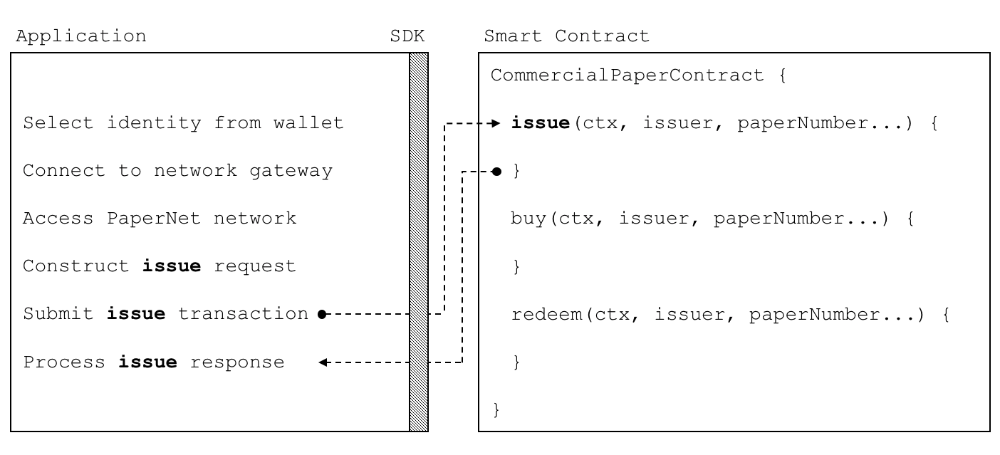

# Application

**Audience**: Architects, Application and smart contract developers

An application can interact with a blockhain network by submitting transactions
to a ledger or querying ledger content. This topic covers the mechanics of how
an application does this; in our scenario, organizations access PaperNet using
applications which invoke **issue**, **buy** and **redeem** transactions
defined in a commercial paper smart contract. Even though MagnetoCorp's
application to issue a commercial paper is basic, it covers all the major points
of understanding.

In this topic, we're going to cover:

* [The application flow to invoke a smart contract](#basic-flow)
* [How an application uses a wallet and identity](#wallet)
* [How an application connects using a gateway](#gateway)
* [How to access a particular network](#network-channel)
* [How to construct a transaction request](#construct-request)
* [How to submit a transaction](#submit-transaction)
* [How to process a transaction response](#process-response)

To help your understanding, we'll make reference to the commercial paper sample
application provided with Hyperledger Fabric. You can [download
it](../install.html) and [run it locally](../tutorial/commercial_paper.html). It
is written in both JavaScript and Java, but the logic is quite language independent, so you'll
be easily able to see what's going on! (The sample will become available for  Go as well.)

## Basic Flow

An application interacts with a blockchain network using the Fabric SDK. Here's
a simplified diagram of how an application invokes a commercial paper smart
contract:

 *A PaperNet application invokes
the commercial paper smart contract to submit an issue transaction request.*

An application has to follow six basic steps to submit a transaction:

* Select an identity from a wallet
* Connect to a gateway
* Access the desired network
* Construct a transaction request for a smart contract
* Submit the transaction to the network
* Process the response

You're going to see how a typical application performs these six steps using the
Fabric SDK. You'll find the application code in the `issue.js` file. [View
it](https://github.com/hyperledger/fabric-samples/blob/master/commercial-paper/organization/magnetocorp/application/issue.js)
in your browser, or open it in your favourite editor if you've downloaded it.
Spend a few moments looking at the overall structure of the application; even
with comments and spacing, it's only 100 lines of code!

## Wallet

Towards the top of `issue.js`, you'll see two Fabric classes are brought
into scope:

```JavaScript
const { FileSystemWallet, Gateway } = require('fabric-network');
```

You can read about the `fabric-network` classes in the
[node SDK documentation](https://fabric-sdk-node.github.io/master/module-fabric-network.html), but for
now, let's see how they are used to connect MagnetoCorp's application to
PaperNet. The application uses the Fabric **Wallet** class as follows:

```JavaScript
const wallet = new FileSystemWallet('../identity/user/isabella/wallet');
```

See how `wallet` locates a [wallet](./wallet.html) in the local filesystem. The
identity retrieved from the wallet is clearly for a user called Isabella, who is
using the `issue` application. The wallet holds a set of identities -- X.509
digital certificates -- which can be used to access PaperNet or any other Fabric
network. If you run the tutorial, and look in this directory, you'll see the
identity credentials for Isabella.

Think of a [wallet](./wallet.html) holding the digital equivalents of your
government ID, driving license or ATM card. The X.509 digital certificates
within it will associate the holder with a organization, thereby entitling them
to rights in a network channel. For example, `Isabella` might be an
administrator in MagnetoCorp, and this could give her more privileges than a
different user -- `Balaji` from DigiBank.  Moreover, a smart contract can
retrieve this identity during smart contract processing using the [transaction
context](./transactioncontext.html).

Note also that wallets don't hold any form of cash or tokens -- they hold
identities.

## Gateway

The second key class is a Fabric **Gateway**. Most importantly, a
[gateway](./gateway.html) identifies one or more peers that provide access to a
network -- in our case, PaperNet. See how `issue.js` connects to its gateway:

```JavaScript
await gateway.connect(connectionProfile, connectionOptions);
```

`gateway.connect()` has two important parameters:

  * **connectionProfile**: the file system location of a
    [connection profile](./connectionprofile.html) that identifies
    a set of peers as a gateway to PaperNet

  * **connectionOptions**: a set of options used to control how `issue.js`
    interacts with PaperNet


See how the client application uses a gateway to insulate itself from the
network topology, which might change. The gateway takes care of sending the
transaction proposal to the right peer nodes in the network using the
[connection profile](./connectionprofile.html) and [connection
options](./connectionoptions.html).

Spend a few moments examining the connection
[profile](https://github.com/hyperledger/fabric-samples/blob/master/commercial-paper/organization/magnetocorp/gateway/networkConnection.yaml)
`./gateway/connectionProfile.yaml`. It uses
[YAML](http://yaml.org/spec/1.2/spec.html#Preview), making it easy to read.

It was loaded and converted into a JSON object:

```JavaScript
let connectionProfile = yaml.safeLoad(file.readFileSync('./gateway/connectionProfile.yaml', 'utf8'));
```

Right now, we're only interested in the `channels:` and `peers:` sections of the
profile: (We've modified the details slightly to better explain what's
happening.)

```YAML
channels:
  papernet:
    peers:
      peer1.magnetocorp.com:
        endorsingPeer: true
        eventSource: true

      peer2.digibank.com:
        endorsingPeer: true
        eventSource: true

peers:
  peer1.magnetocorp.com:
    url: grpcs://localhost:7051
    grpcOptions:
      ssl-target-name-override: peer1.magnetocorp.com
      request-timeout: 120
    tlsCACerts:
      path: certificates/magnetocorp/magnetocorp.com-cert.pem

  peer2.digibank.com:
    url: grpcs://localhost:8051
    grpcOptions:
      ssl-target-name-override: peer1.digibank.com
    tlsCACerts:
      path: certificates/digibank/digibank.com-cert.pem
```

See how `channel:` identifies the `PaperNet:` network channel, and two of its
peers. MagnetoCorp has `peer1.magenetocorp.com` and DigiBank has
`peer2.digibank.com`, and both have the role of endorsing peers. Link to these
peers via the `peers:` key, which contains details about how to connect to them,
including their respective network addresses.

The connection profile contains a lot of information -- not just peers -- but
network channels, network orderers, organizations, and CAs, so don't worry if
you don't understand all of it!

Let's now turn our attention to the `connectionOptions` object:

```JavaScript
let connectionOptions = {
  identity: userName,
  wallet: wallet
}
```

See how it specifies that identity, `userName`, and wallet, `wallet`, should be
used to connect to a gateway. These were assigned values earlier in the code.

There are other [connection options](./connectionoptions.html) which an
application could use to instruct the SDK to act intelligently on its behalf.
For example:

```JavaScript
let connectionOptions = {
  identity: userName,
  wallet: wallet,
  eventHandlerOptions: {
    commitTimeout: 100,
    strategy: EventStrategies.MSPID_SCOPE_ANYFORTX
  },
}
```

Here, `commitTimeout` tells the SDK to wait 100 seconds to hear whether a
transaction has been committed. And `strategy:
EventStrategies.MSPID_SCOPE_ANYFORTX` specifies that the SDK can notify an
application after a single MagnetoCorp peer has confirmed the transaction, in
contrast to `strategy: EventStrategies.NETWORK_SCOPE_ALLFORTX` which requires
that all peers from MagnetoCorp and DigiBank to confirm the transaction.

If you'd like to, [read more](./connectionoptions.html) about how connection
options allow applications to specify goal-oriented behaviour without having to
worry about how it is achieved.

## Network channel

The peers defined in the gateway `connectionProfile.yaml` provide
`issue.js` with access to PaperNet. Because these peers can be joined to
multiple network channels, the gateway actually provides the application with
access to multiple network channels!

See how the application selects a particular channel:

```JavaScript
const network = await gateway.getNetwork('PaperNet');
```

From this point onwards, `network` will provide access to PaperNet.  Moreover,
if the application wanted to access another network, `BondNet`, at the same
time, it is easy:

```JavaScript
const network2 = await gateway.getNetwork('BondNet');
```

Now our application has access to a second network, `BondNet`, simultaneously
with `PaperNet`!

We can see here a powerful feature of Hyperledger Fabric -- applications can
participate in a **network of networks**, by connecting to multiple gateway
peers, each of which is joined to multiple network channels. Applications will
have different rights in different channels according to their wallet identity
provided in `gateway.connect()`.

## Construct request

The application is now ready to **issue** a commercial paper.  To do this, it's
going to use `CommercialPaperContract` and again, its fairly straightforward to
access this smart contract:

```JavaScript
const contract = await network.getContract('papercontract', 'org.papernet.commercialpaper');
```

Note how the application provides a name -- `papercontract` -- and an explicit
contract name: `org.papernet.commercialpaper`! We see how a [contract
name](./contractname.html) picks out one contract from the `papercontract.js`
chaincode file that contains many contracts. In PaperNet, `papercontract.js` was
installed and instantiated with the name `papercontract`, and if you're
interested, read [how](../chaincode4noah.html) to install and instantiate a
chaincode containing multiple smart contracts.

If our application simultaneously required access to another contract in
PaperNet or BondNet this would be easy:

```JavaScript
const euroContract = await network.getContract('EuroCommercialPaperContract');

const bondContract = await network2.getContract('BondContract');
```

In these examples, note how we didn't use a qualifying contract name -- we have
only one smart contract per file, and `getContract()` will use the first
contract it finds.

Recall the transaction MagnetoCorp uses to issue its first commercial paper:

```
Txn = issue
Issuer = MagnetoCorp
Paper = 00001
Issue time = 31 May 2020 09:00:00 EST
Maturity date = 30 November 2020
Face value = 5M USD
```

Let's now submit this transaction to PaperNet!

## Submit transaction

Submitting a transaction is a single method call to the SDK:

```JavaScript
const issueResponse = await contract.submitTransaction('issue', 'MagnetoCorp', '00001', '2020-05-31', '2020-11-30', '5000000');
```

See how the `submitTransaction()` parameters match those of the transaction
request.  It's these values that will be passed to the `issue()` method in the
smart contract, and used to create a new commercial paper.  Recall its
signature:

```JavaScript
async issue(ctx, issuer, paperNumber, issueDateTime, maturityDateTime, faceValue) {...}
```

It might appear that a smart contract receives control shortly after the
application issues `submitTransaction()`, but that's not the case. Under the
covers, the SDK uses the `connectionOptions` and `connectionProfile` details to
send the transaction proposal to the right peers in the network, where it can
get the required endorsements. But the application doesn't need to worry about
any of this -- it just issues `submitTransaction` and the SDK takes care of it
all!

Note that the `submitTransaction` API includes a process for listening for
transaction commits. Listening for commits is required because without it,
you will not know whether your transaction has successfully been orderered,
validated, and committed to the ledger.

Let's now turn our attention to how the application handles the response!

## Process response

Recall from `papercontract.js` how the **issue** transaction returns a
commercial paper response:

```JavaScript
return paper.toBuffer();
```

You'll notice a slight quirk -- the new `paper` needs to be converted to a
buffer before it is returned to the application. Notice how `issue.js` uses the
class method `CommercialPaper.fromBuffer()` to rehydrate the response buffer as
a commercial paper:

```JavaScript
let paper = CommercialPaper.fromBuffer(issueResponse);
```

This allows `paper` to be used in a natural way in a descriptive completion
message:

```JavaScript
console.log(`${paper.issuer} commercial paper : ${paper.paperNumber} successfully issued for value ${paper.faceValue}`);
```

See how the same `paper` class has been used in both the application and smart
contract -- if you structure your code like this, it'll really help readability
and reuse.

As with the transaction proposal, it might appear that the application receives
control soon after the smart contract completes, but that's not the case. Under
the covers, the SDK manages the entire consensus process, and notifies the
application when it is complete according to the `strategy` connectionOption. If
you're interested in what the SDK does under the covers, read the detailed
[transaction flow](../../txflow.html).

That’s it! In this topic you’ve understood how to call a smart contract from a
sample application by examining how MagnetoCorp's application issues a new
commercial paper in PaperNet. Now examine the key ledger and smart contract data
structures are designed by in the [architecture topic](./architecture.html) behind
them.

<!--- Licensed under Creative Commons Attribution 4.0 International License
https://creativecommons.org/licenses/by/4.0/ -->
