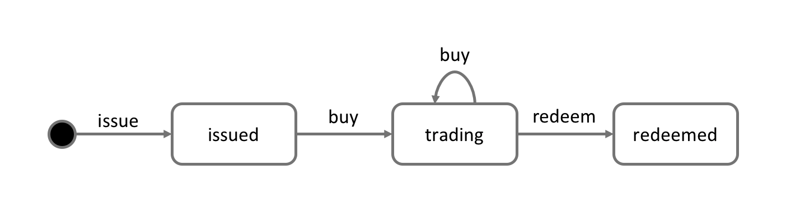
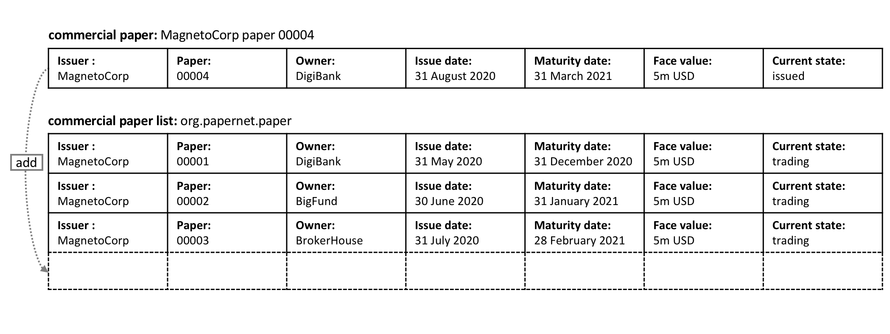

# Process and Data Design

**Audience**: Architects, Application and smart contract developers, Business
professionals

This topic shows you how to design the commercial paper processes and their
related data structures in PaperNet. Our [analysis](./analysis.html) highlighted
that modelling PaperNet using states and transactions provided a precise way to
understand what's happening. We're now going to elaborate on these two strongly
related concepts to help us subsequently design the smart contracts and
applications of PaperNet.

## Lifecycle

As we've seen, there are two important concepts that concern us when dealing
with commercial paper; **states** and **transactions**. Indeed, this is true for
*all* blockchain use cases; there are conceptual objects of value, modeled as
states, whose lifecycle transitions are described by transactions. An effective
analysis of states and transactions is an essential starting point for a
successful implementation.

We can represent the life cycle of a commercial paper using a state transition
diagram:

 *The state transition
diagram for commercial paper. Commercial papers transition between **issued**,
**trading** and **redeemed** states by means of the **issue**, **buy** and
**redeem** transactions.*

See how the state diagram describes how commercial papers change over time, and
how specific transactions govern the life cycle transitions. In Hyperledger
Fabric, smart contracts implement transaction logic that transition commercial
papers between their different states. Commercial paper states are actually held
in the ledger world state; so let's take a closer look at them.

## Ledger state

Recall the structure of a commercial paper:

 *A commercial paper can be
represented as a set of properties, each with a value. Typically, some
combination of these properties will provide a unique key for each paper.*

See how a commercial paper `Paper` property has value `00001`, and the `Face
value` property has value `5M USD`. Most importantly, the `Current state`
property indicates whether the commercial paper is `issued`,`trading` or
`redeemed`. In combination, the full set of properties make up the **state** of
a commercial paper. Moreover, the entire collection of these individual
commercial paper states constitutes the ledger
[world state](../ledger/ledger.html#world-state).

All ledger state share this form; each has a set of properties, each with a
different value. This *multi-property* aspect of states is a powerful feature --
it allows us to think of a Fabric state as a vector rather than a simple scalar.
We then represent facts about whole objects as individual states, which
subsequently undergo transitions controlled by transaction logic. A Fabric state
is implemented as a key/value pair, in which the value encodes the object
properties in a format that captures the object's multiple properties, typically
JSON. The [ledger
database](../ledger/ledger.html#ledger-world-state-database-options) can support
advanced query operations against these properties, which is very helpful for
sophisticated object retrieval.

See how MagnetoCorp's paper `00001` is represented as a state vector that
transitions according to different transaction stimuli:

 *A commercial paper state is
brought into existence and transitions as a result of different transactions.
Hyperledger Fabric states have multiple properties, making them vectors rather
than scalars.*

Notice how each individual paper starts with the empty state, which is
technically a [`nil`](https://en.wikipedia.org/wiki/Null_(SQL)) state for the
paper, as it doesn't exist! See how paper `00001` is brought into existence by
the **issue** transaction, and how it is subsequently updated as a result of the
**buy** and **redeem** transactions.

Notice how each state is self-describing; each property has a name and a value.
Although all our commercial papers currently have the same properties, this need
not be the case for all time, as Hyperledger Fabric supports different states
having different properties. This allows the same ledger world state to contain
different forms of the same asset as well as different types of asset. It also
makes it possible to update a state's structure; imagine a new regulation that
requires an additional data field. Flexible state properties support the
fundamental requirement of data evolution over time.

## State keys

In most practical applications, a state will have a combination of properties
that uniquely identify it in a given context -- it's **key**. The key for a
PaperNet commercial paper is formed by a concatenation of the `Issuer` and
`paper` properties; so for MagnetoCorp's first paper, it's `MagnetoCorp00001`.

A state key allows us to uniquely identify a paper; it is created as a result
of the **issue** transaction and subsequently updated by **buy** and **redeem**.
Hyperledger Fabric requires each state in a ledger to have a unique key.

When a unique key is not available from the available set of properties, an
application-determined unique key is specified as an input to the transaction
that creates the state. This unique key is usually with some form of
[UUID](https://en.wikipedia.org/wiki/Universally_unique_identifier), which
although less readable, is a standard practice. What's important is that every
individual state object in a ledger must have a unique key.

_Note: You should avoid using U+0000 (nil byte) in keys._

## Multiple states

As we've seen, commercial papers in PaperNet are stored as state vectors in a
ledger. It's a reasonable requirement to be able to query different commercial
papers from the ledger; for example: find all the papers issued by MagnetoCorp,
or: find all the papers issued by MagnetoCorp in the `redeemed` state.

To make these kinds of search tasks possible, it's helpful to group all related
papers together in a logical list. The PaperNet design incorporates the idea of
a commercial paper list -- a logical container which is updated whenever
commercial papers are issued or otherwise changed.

### Logical representation

It's helpful to think of all PaperNet commercial papers being in a single list
of commercial papers:

 *MagnetoCorp's
newly created commercial  paper 00004 is added to the list of existing
commercial papers.*

New papers can be added to the list as a result of an **issue** transaction, and
papers already in the list can be updated with **buy** or **redeem**
transactions. See how the list has a descriptive name: `org.papernet.papers`;
it's a really good idea to use this kind of [DNS
name](https://en.wikipedia.org/wiki/Domain_Name_System) because well-chosen
names will make your blockchain designs intuitive to other people. This idea
applies equally well to smart contract [names](./contractname.html).

### Physical representation

While it's correct to think of a single list of papers in PaperNet --
`org.papernet.papers` -- lists are best implemented as a set of individual
Fabric states, whose composite key associates the state with its list. In this
way, each state's composite key is both unique and supports effective list query.

 *Representing a list of
PaperNet commercial papers as a set of distinct Hyperledger Fabric states*

Notice how each paper in the list is represented by a vector state, with a
unique **composite** key formed by the concatenation of `org.papernet.paper`,
`Issuer` and `Paper` properties. This structure is helpful for two reasons:

  * It allows us to examine any state vector in the ledger to determine which
    list it's in, without reference to a separate list. It's analogous to
    looking at set of sports fans, and identifying which team they support by
    the colour of the shirt they are wearing. The sports fans self-declare their
    allegiance; we don't need a list of fans.

  * Hyperlegder Fabric internally uses a concurrency control
    [mechanism](../arch-deep-dive.html#the-endorsing-peer-simulates-a-transaction-and-produces-an-endorsement-signature)
    to update a ledger, such that keeping papers in separate state vectors vastly
    reduces the opportunity for shared-state collisions. Such collisions require
    transaction re-submission, complicate application design, and decrease
    performance.

This second point is actually a key take-away for Hyperledger Fabric; the
physical design of state vectors is **very important** to optimum performance
and behaviour. Keep your states separate!

## Trust relationships

We have discussed how the different roles in a network, such as issuer, trader
or rating agencies as well as different business interests determine who needs
to sign off on a transaction. In Fabric, these rules are captured by so-called
[**endorsement policies**](endorsementpolicies.html). The rules can be set on
a chaincode granularity, as well as for individual state keys.

This means that in PaperNet, we can set one rule for the whole namespace that
determines which organizations can issue new papers. Later, rules can be set
and updated for individual papers to capture the trust relationships of buy
and redeem transactions.

In the next topic, we will show you how to combine these design concepts to
implement the PaperNet commercial paper smart contract, and then an application
in exploits it!

<!--- Licensed under Creative Commons Attribution 4.0 International License
https://creativecommons.org/licenses/by/4.0/ -->
