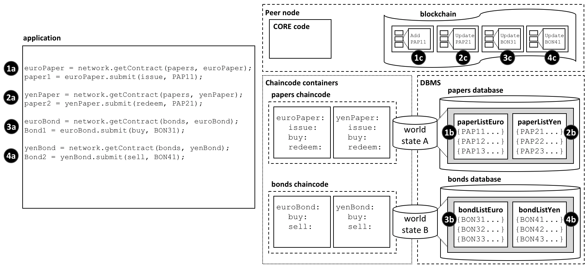
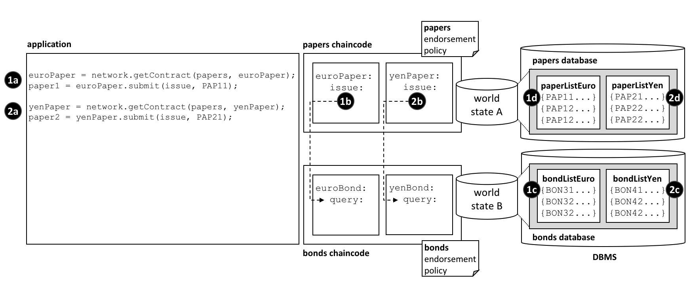

# Chaincode namespace

**Audience**: Architects, application and smart contract developers,
administrators

A chaincode namespace allows it to keep its world state separate from other
chaincodes. Specifically, smart contracts in the same chaincode share direct
access to the same world state, whereas smart contracts in different chaincodes
cannot directly access each other's world state. If a smart contract needs to
access another chaincode world state, it can do this by performing a
chaincode-to-chaincode invocation. Finally, a blockchain can contain
transactions which relate to different world states.

In this topic, we're going to cover:

* [The importance of namespaces](#motivation)
* [What is a chaincode namespace](#scenario)
* [Channels and namespaces](#channels)
* [How to use chaincode namespaces](#usage)
* [How to access world states across smart contracts](#cross-chaincode-access)
* [Design considerations for chaincode namespaces](#considerations)

## Motivation

A namespace is a common concept. We understand that *Park Street, New York* and
*Park Street, Seattle* are different streets even though they have the same
name. The city forms a **namespace** for Park Street, simultaneously providing
freedom and clarity.

It's the same in a computer system. Namespaces allow different users to program
and operate different parts of a shared system, without getting in each other's
way. Many programming languages have namespaces so that programs can freely
assign unique identifiers, such as variable names, without worrying about other
programs doing the same. We'll see that Hyperledger Fabric uses namespaces to
help smart contracts keep their ledger world state separate from other smart
contracts.

## Scenario

Let's examine how the ledger world state organizes facts about business objects
that are important to the organizations in a channel using the diagram below.
Whether these objects are commercial papers, bonds, or vehicle registrations,
and wherever they are in their lifecycle, they are maintained as states within
the ledger world state database. A smart contract manages these business objects
by interacting with the ledger (world state and blockchain), and in most cases
this will involve it querying or updating the ledger world state.

It's vitally important to understand that the ledger world state is partitioned
according to the chaincode of the smart contract that accesses it, and this
partitioning, or *namespacing* is an important design consideration for
architects, administrators and programmers.

 *The ledger world state is
separated into different namespaces according to the chaincode that accesses it.
Within a given channel, smart contracts in the same chaincode share the same
world state, and smart contracts in different chaincodes cannot directly access
each other's world state. Likewise, a blockchain can contain transactions that
relate to different chaincode world states.*

In our example, we can see four smart contracts defined in two different
chaincodes, each of which is in their own chaincode container. The `euroPaper`
and `yenPaper` smart contracts are defined in the `papers` chaincode. The
situation is similar for the `euroBond` and `yenBond` smart contracts  -- they
are defined in the `bonds` chaincode. This design helps application programmers
understand whether they are working with commercial papers or bonds priced in
Euros or Yen, and because the rules for each financial product don't really
change for different currencies, it makes sense to manage their deployment in
the same chaincode.

The [diagram](#scenario) also shows the consequences of this deployment choice.
The database management system (DBMS) creates different world state databases
for the `papers` and `bonds` chaincodes and the smart contracts contained within
them. `World state A` and `world state B` are each held within distinct
databases; the data are isolated from each other such that a single world state
query (for example) cannot access both world states. The world state is said to
be *namespaced* according to its chaincode.

See how `world state A` contains two lists of commercial papers `paperListEuro`
and `paperListYen`. The states `PAP11` and `PAP21` are instances of each paper
managed by the `euroPaper` and `yenPaper` smart contracts respectively. Because
they share the same chaincode namespace, their keys (`PAPxyz`) must be unique
within the namespace of the `papers` chaincode, a little like a street name is
unique within a town. Notice how it would be possible to write a smart contract
in the `papers` chaincode that performed an aggregate calculation over all the
commercial papers -- whether priced in Euros or Yen -- because they share the
same namespace. The situation is similar for bonds -- they are held within
`world state B` which maps to a separate `bonds` database, and their keys must
be unique.

Just as importantly, namespaces mean that `euroPaper` and `yenPaper` cannot
directly access `world state B`, and that `euroBond` and `yenBond` cannot
directly access `world state A`. This isolation is helpful, as commercial papers
and bonds are very distinct financial instruments; they have different
attributes and are subject to different rules. It also means that `papers` and
`bonds` could have the same keys, because they are in different namespaces. This
is helpful; it provides a significant degree of freedom for naming. Use this
freedom to name different business objects meaningfully.

Most importantly, we can see that a blockchain is associated with the peer
operating in a particular channel, and that it contains transactions that affect
both `world state A` and `world state B`. That's because the blockchain is the
most fundamental data structure contained in a peer. The set of world states can
always be recreated from this blockchain, because they are the cumulative
results of the blockchain's transactions. A world state helps simplify smart
contracts and improve their efficiency, as they usually only require the current
value of a state. Keeping world states separate via namespaces helps smart
contracts isolate their logic from other smart contracts, rather than having to
worry about transactions that correspond to different world states. For example,
a `bonds` contract does not need to worry about `paper` transactions, because it
cannot see their resultant world state.

It's also worth noticing that the peer, chaincode containers and DBMS all are
logically different processes. The peer and all its chaincode containers are
always in physically separate operating system processes, but the DBMS can be
configured to be embedded or separate, depending on its
[type](../ledger/ledger.html#world-state-database-options). For LevelDB, the
DBMS is wholly contained within the peer, but for CouchDB, it is a separate
operating system process.

It's important to remember that namespace choices in this example are the result
of a business requirement to share commercial papers in different currencies but
isolate them separate from bonds. Think about how the namespace structure would
be modified to meet a business requirement to keep every financial asset class
separate, or share all commercial papers and bonds?

## Channels

If a peer is joined to multiple channels, then a new blockchain is created
and managed for each channel. Moreover, every time a chaincode is deployed to
a new channel, a new world state database is created for it. It means that
the channel also forms a kind of namespace alongside that of the chaincode for
the world state.

However, the same peer and chaincode container processes can be simultaneously
joined to multiple channels -- unlike blockchains, and world state databases,
these processes do not increase with the number of channels joined.

For example, if you deployed the `papers` and `bonds` chaincode to a new
channel, there would a totally separate blockchain created, and two new world
state databases created. However, the peer and chaincode containers would not
increase; each would just be connected to multiple channels.

## Usage

Let's use our commercial paper [example](#scenario) to show how an application
uses a smart contract with namespaces. It's worth noting that an application
communicates with the peer, and the peer routes the request to the appropriate
chaincode container which then accesses the DBMS. This routing is done by the
peer **core** component shown in the diagram.

Here's the code for an application that uses both commercial papers and bonds,
priced in Euros and Yen. The code is fairly self-explanatory:

```javascript
const euroPaper = network.getContract(papers, euroPaper);
paper1 = euroPaper.submit(issue, PAP11);

const yenPaper = network.getContract(papers, yenPaper);
paper2 = yenPaper.submit(redeem, PAP21);

const euroBond = network.getContract(bonds, euroBond);
bond1 = euroBond.submit(buy, BON31);

const yenBond = network.getContract(bonds, yenBond);
bond2 = yenBond.submit(sell, BON41);
```

See how the application:

* Accesses the `euroPaper` and `yenPaper` contracts using the `getContract()`
  API specifying the `papers` chaincode. See interaction points **1a** and
  **2a**.

* Accesses the `euroBond` and `yenBond` contracts using the `getContract()` API
  specifying the `bonds` chaincode. See interaction points **3a** and **4a**.

* Submits an `issue` transaction to the network for commercial paper `PAP11`
  using the `euroPaper` contract. See interaction point **1a**. This results in
  the creation of a commercial paper represented by state `PAP11` in `world
  state A`; interaction point **1b**. This operation is captured as a
  transaction in the blockchain at interaction point **1c**.

* Submits a `redeem` transaction to the network for commercial paper `PAP21`
  using the `yenPaper` contract. See interaction point **2a**. This results in
  the creation of a commercial paper represented by state `PAP21` in `world
  state A`; interaction point **2b**. This operation is captured as a
  transaction in the blockchain at interaction point **2c**.

* Submits a `buy` transaction to the network for bond `BON31` using the
  `euroBond` contract. See interaction point **3a**. This results in the
  creation of a bond represented by state `BON31` in `world state B`;
  interaction point **3b**. This operation is captured as a transaction in the
  blockchain at interaction point **3c**.

* Submits a `sell` transaction to the network for bond `BON41` using the
  `yenBond` contract. See interaction point **4a**. This results in the creation
  of a bond represented by state `BON41` in `world state B`; interaction point
  **4b**. This operation is captured as a transaction in the blockchain at
  interaction point **4c**.


See how smart contracts interact with the world state:

* `euroPaper` and `yenPaper` contracts can directly access `world state A`, but
  cannot directly access `world state B`. `World state A` is physically held in
  the `papers` database in the database management system (DBMS) corresponding
  to the `papers` chaincode.

* `euroBond` and `yenBond` contracts can directly access `world state B`, but
  cannot directly access `world state A`. `World state B` is physically held in
  the `bonds` database in the database management system (DBMS) corresponding to
  the `bonds` chaincode.


See how the blockchain captures transactions for all world states:

* Interactions **1c** and **2c** correspond to transactions create and update
  commercial papers `PAP11` and `PAP21` respectively. These are both contained
  within `world state A`.

* Interactions **3c** and **4c** correspond to transactions both update bonds
  `BON31` and `BON41`. These are both contained within `world state B`.

* If `world state A` or `world state B` were destroyed for any reason, they
  could be recreated by replaying all the transactions in the blockchain.


## Cross chaincode access

As we saw in our example [scenario](#scenario), `euroPaper` and `yenPaper`
cannot directly access `world state B`.  That's because we have designed our
chaincodes and smart contracts so that these chaincodes and world states are
kept separately from each other.  However, let's imagine that `euroPaper` needs
to access `world state B`.

Why might this happen? Imagine that when a commercial paper was issued, the
smart contract wanted to price the paper according to the current return on
bonds with a similar maturity date.  In this case it will be necessary for the
`euroPaper` contract to be able to query the price of bonds in `world state B`.
Look at the following diagram to see how we might structure this interaction.

 *How chaincodes and smart
contracts can indirectly access another world state -- via its chaincode.*

Notice how:

* the application submits an `issue` transaction in the `euroPaper` smart
  contract to issue `PAP11`. See interaction **1a**.

* the `issue` transaction in the `euroPaper` smart contract calls the `query`
  transaction in the `euroBond` smart contract. See interaction point **1b**.

* the `query`in `euroBond` can retrieve information from `world state B`. See
   interaction point **1c**.

* when control returns to the `issue` transaction, it can use the information in
  the response to price the paper and update `world state A` with information.
  See interaction point **1d**.

* the flow of control for issuing commercial paper priced in Yen is the same.
  See interaction points **2a**, **2b**, **2c** and **2d**.

Control is passed between chaincode using the `invokeChaincode()`
[API](https://hyperledger.github.io/fabric-chaincode-node/{BRANCH}/api/fabric-shim.ChaincodeStub.html#invokeChaincode__anchor).

This API passes control from one chaincode to another chaincode.

Although we have only discussed query transactions in the example, it is
possible to invoke a smart contract which will update the called chaincode's
world state.  See the [considerations](#considerations) below.

## Considerations

* In general, each chaincode will have a single smart contract in it.

* Multiple smart contracts should only be deployed in the same chaincode if they
  are very closely related.  Usually, this is only necessary if they share the
  same world state.

* Chaincode namespaces provide isolation between different world states. In
  general it makes sense to isolate unrelated data from each other. Note that
  you cannot choose the chaincode namespace; it is assigned by Hyperledger
  Fabric, and maps directly to the name of the chaincode.

* For chaincode to chaincode interactions using the `invokeChaincode()` API,
  both chaincodes must be installed on the same peer.

    * For interactions that only require the called chaincode's world state to
      be queried, the invocation can be in a different channel to the caller's
      chaincode.

    * For interactions that require the called chaincode's world state to be
      updated, the invocation must be in the same channel as the caller's
      chaincode.

<!--- Licensed under Creative Commons Attribution 4.0 International License
https://creativecommons.org/licenses/by/4.0/ -->
