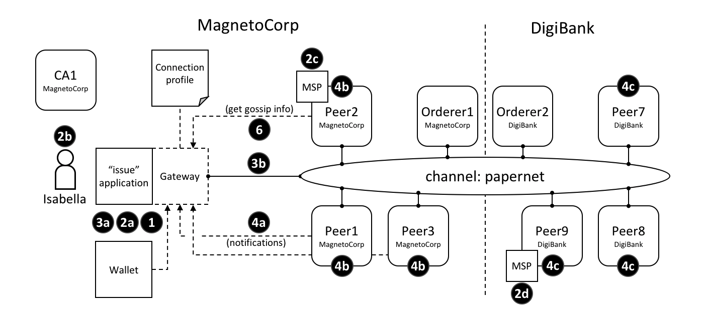

# Connection Options

**Audience**: Architects, administrators, application and smart contract
developers

Connection options are used in conjunction with a connection profile to control
*precisely* how a gateway interacts with a network. Using a gateway allows an
application to focus on business logic rather than network topology.

In this topic, we're going to cover:

* [Why connection options are important](#scenario)
* [How an application uses connection options](#usage)
* [What each connection option does](#options)
* [When to use a particular connection option](#considerations)

## Scenario

A connection option specifies a particular aspect of a gateway's behaviour.
Gateways are important for [many reasons](./gateway.html), the primary being to
allow an application to focus on business logic and smart contracts, while it
manages interactions with the many components of a network.

 *The different interaction points
where connection options control behaviour. These options are explained fully in
the text.*

One example of a connection option might be to specify that the gateway used by
the `issue` application should use identity `Isabella` to submit transactions to
the `papernet` network. Another might be that a gateway should wait for all
three nodes from MagnetoCorp to confirm a transaction has been committed
returning control. Connection options allow applications to specify the precise
behaviour of a gateway's interaction with the network. Without a gateway,
applications need to do a lot more work; gateways save you time, make your
application more readable, and less error prone.

## Usage

We'll describe the [full set](#options) of connection options available to an
application in a moment; let's first see how they are specified by the
sample MagnetoCorp `issue` application:

```javascript
const userName = 'User1@org1.example.com';
const wallet = new FileSystemWallet('../identity/user/isabella/wallet');

const connectionOptions = {
  identity: userName,
  wallet: wallet,
  eventHandlerOptions: {
    commitTimeout: 100,
    strategy: EventStrategies.MSPID_SCOPE_ANYFORTX
    }
  };

await gateway.connect(connectionProfile, connectionOptions);
```

See how the `identity` and `wallet` options are simple properties of the
`connectionOptions` object. They have values `userName` and `wallet`
respectively, which were set earlier in the code. Contrast these options with
the `eventHandlerOptions` option which is an object in its own right. It has
two properties: `commitTimeout: 100` (measured in seconds) and `strategy:
EventStrategies.MSPID_SCOPE_ANYFORTX`.

See how `connectionOptions` is passed to a gateway as a complement to
`connectionProfile`; the network is identified by the connection profile and
the options specify precisely how the gateway should interact with it. Let's now
look at the available options.

## Options

Here's a list of the available options and what they do.

* `wallet` identifies the wallet that will be used by the gateway on behalf of
  the application. See interaction **1**; the wallet is specified by the
  application, but it's actually the gateway that retrieves identities from it.

  A wallet must be specified; the most important decision is the
  [type](./wallet.html#type) of wallet to use, whether that's file system,
  in-memory, HSM or database.


* `identity` is the user identity that the application will use from `wallet`.
  See interaction **2a**; the user identity is specified by the application and
  represents the user of the application, Isabella, **2b**. The identity is
  actually retrieved by the gateway.

  In our example, Isabella's identity will be used by different MSPs (**2c**,
  **2d**) to identify her as being from MagnetoCorp, and having a particular
  role within it. These two facts will correspondingly determine her permission
  over resources, such as being able to read and write the ledger, for example.

  A user identity must be specified. As you can see, this identity is
  fundamental to the idea that Hyperledger Fabric is a *permissioned* network --
  all actors have an identity, including applications, peers and orderers, which
  determines their control over resources. You can read more about this idea in the membership services [topic](../membership/membership.html).


* `clientTlsIdentity` is the identity that is retrieved from a wallet (**3a**)
  and used for secure communications (**3b**) between the gateway and different
  channel components, such as peers and orderers.

  Note that this identity is different to the user identity.  Even though
  `clientTlsIdentity` is important for secure communications, it is not as
  foundational as the user identity because its scope does not extend beyond
  secure network communications.

  `clientTlsIdentity` is optional. You are advised to set it in production
  environments. You should always use a different `clientTlsIdentity` to
  `identity` because these identities have very different meanings and
  lifecycles. For example, if your `clientTlsIdentity` was compromised, then so
  would your `identity`; it's more secure to keep them separate.


* `eventHandlerOptions.commitTimeout` is optional. It specifies, in seconds, the
    maximum amount of time the gateway should wait for a transaction to be
    committed by any peer (**4a**) before returning control to the application.
    The set of peers to use for notification is determined by the
    `eventHandlerOptions.strategy` option. If a commitTimeout is not
    specified, the gateway will use a timeout of 300 seconds.


* `eventHandlerOptions.strategy` is optional. It identifies the set of peers
    that a gateway should use to listen for notification that a transaction has
    been committed. For example, whether to listen for a single peer, or all
    peers, from its organization. It can take one of the following values:

  * `EventStrategies.MSPID_SCOPE_ANYFORTX` Listen for **any** peer within the
    user's organization. In our example, see interaction points **4b**; any of
    peer 1, peer 2 or peer 3 from MagnetoCorp can notify the gateway.

  * `EventStrategies.MSPID_SCOPE_ALLFORTX` **This is the default value**. Listen
     for **all** peers within the user's organization. In our example peer, see
     interaction point **4b**. All peers from MagnetoCorp must all have notified
     the gateway; peer 1, peer 2 and peer 3. Peers are only counted if they are
     known/discovered and available; peers that are stopped or have failed are
     not included.

  * `EventStrategies.NETWORK_SCOPE_ANYFORTX` Listen for **any** peer within the
    entire network channel. In our example, see interaction points **4b** and
    **4c**; any of peer 1-3 from MagnetoCorp or peer 7-9 of DigiBank can notify
    the gateway.

  * `EventStrategies.NETWORK_SCOPE_ALLFORTX` Listen for **all** peers within the
    entire network channel. In our example, see interaction points **4b** and
    **4c**. All peers from MagnetoCorp and DigiBank must notify the gateway;
    peers 1-3 and peers 7-9. Peers are only counted if they are known/discovered
    and available; peers that are stopped or have failed are not included.

  * <`PluginEventHandlerFunction`> The name of a user-defined event handler.
    This allows a user to define their own logic for event handling. See how to
    [define](https://hyperledger.github.io/fabric-sdk-node/{BRANCH}/tutorial-transaction-commit-events.html)
    a plugin event handler, and examine a [sample
    handler](https://github.com/hyperledger/fabric-sdk-node/blob/{BRANCH}/test/integration/network-e2e/sample-transaction-event-handler.js).

    A user-defined event handler is only necessary if you have very specific
    event handling requirements; in general, one of the built-in event
    strategies will be sufficient. An example of a user-defined event handler
    might be to wait for more than half the peers in an organization to confirm
    a transaction has been committed.

    If you do specify a user-defined event handler, it does not affect your
    application logic; it is quite separate from it. The handler is called by
    the SDK during processing; it decides when to call it, and uses its results
    to select which peers to use for event notification. The application
    receives control when the SDK has finished its processing.

    If a user-defined event handler is not specified then the default values for
    `EventStrategies` are used.


* `discovery.enabled` is optional and has possible values `true` or `false`. The
  default is `true`. It determines whether the gateway uses [service
  discovery](../discovery-overview.html) to augment the network topology
  specified in the connection profile. See interaction point **6**; peer's
  gossip information used by the gateway.

  This value will be overridden by the `INITIALIIZE-WITH-DISCOVERY` environment
  variable, which can be set to `true` or `false`.


* `discovery.asLocalhost` is optional and has possible values `true` or `false`.
  The default is `true`. It determines whether IP addresses found during service
  discovery are translated from the docker network to the local host.

  Typically developers will write applications that use docker containers for
  their network components such as peers, orderers and CAs, but that do not run
  in docker containers themselves. This is why `true` is the default; in
  production environments, applications will likely run in docker containers in
  the same manner as network components and therefore address translation is not
  required. In this case, applications should either explicitly specify `false`
  or use the environment variable override.

  This value will be overridden by the `DISCOVERY-AS-LOCALHOST` environment
  variable, which can be set to `true` or `false`.

## Considerations

The following list of considerations is helpful when deciding how to choose
connection options.

* `eventHandlerOptions.commitTimeout` and `eventHandlerOptions.strategy` work
  together. For example, `commitTimeout: 100` and `strategy:
  EventStrategies.MSPID_SCOPE_ANYFORTX` means that the gateway will wait for up
  to 100 seconds for *any* peer to confirm a transaction has been committed. In
  contrast, specifying `strategy:  EventStrategies.NETWORK_SCOPE_ALLFORTX` means
  that the gateway will wait up to 100 seconds for *all* peers in *all*
  organizations.


* The default value of `eventHandlerOptions.strategy:
  EventStrategies.MSPID_SCOPE_ALLFORTX` will wait for all peers in the
  application's organization to commit the transaction. This is a good default
  because applications can be sure that all their peers have an up-to-date copy
  of the ledger, minimizing concurrency
  issues <!-- Add a link with more information explaining this topic-->

  However, as the number of peers in an organization grows, it becomes a little
  unnecessary to wait for all peers, in which case using a pluggable event
  handler can provide a more efficient strategy. For example the same set of
  peers could be used to submit transactions and listen for notifications, on
  the safe assumption that consensus will keep all ledgers synchronized.


* Service discovery requires `clientTlsIdentity` to be set. That's because the
  peers exchanging information with an application need to be confident that
  they are exchanging information with entities they trust. If
  `clientTlsIdentity` is not set, then `discovery` will not be obeyed,
  regardless of whether or not it is set.


* Although applications can set connection options when they connect to the
  gateway, it can be necessary for these options to be overridden by an
  administrator. That's because options relate to network interactions, which
  can vary over time. For example, an administrator trying to understand the
  effect of using service discovery on network performance.

  A good approach is to define application overrides in a configuration file
  which is read by the application when it configures its connection to the
  gateway.

  Because the discovery options `enabled` and `asLocalHost` are most frequently
  required to be overridden by administrators, the environment variables
  `INITIALIIZE-WITH-DISCOVERY` and `DISCOVERY-AS-LOCALHOST` are provided for
  convenience. The administrator should set these in the production runtime
  environment of the application, which will most likely be a docker container.

<!--- Licensed under Creative Commons Attribution 4.0 International License
https://creativecommons.org/licenses/by/4.0/ -->
