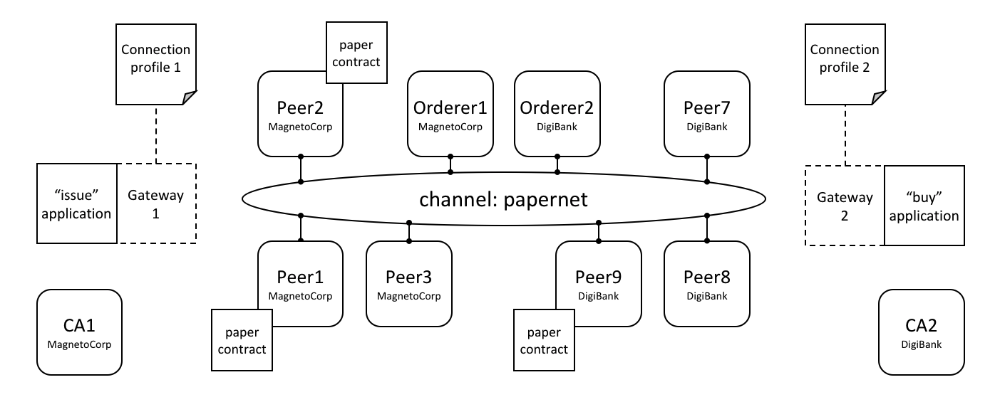

# Connection Profile

**Audience**: Architects, application and smart contract developers

A connection profile describes a set of components, including peers, orderers
and certificate authorities in a Hyperledger Fabric blockchain network. It also
contains channel and organization information relating to these components. A
connection profile is primarily used by an application to configure a
[gateway](./gateway.html) that handles all network interactions, allowing it it
to focus on business logic. A connection profile is normally created by an
administrator who understands the network topology.

In this topic, we're going to cover:

* [Why connection profiles are important](#scenario)
* [How applications use a connection profile](#usage)
* [How to define a connection profile](#structure)

## Scenario

A connection profile is used to configure a gateway. Gateways are important for
[many reasons](./gateway.html), the primary being to simplify an application's
interaction with a network channel.

 *Two applications, issue and buy,
 use gateways 1&2 configured with connection profiles 1&2. Each profile
 describes a different subset of MagnetoCorp and DigiBank network components.
 Each connection profile must contain sufficient information for a gateway to
 interact with the network on behalf of the issue and buy applications. See the
 text for a detailed explanation.*

A connection profile contains a description of a network view, expressed in a
technical syntax, which can either be JSON or YAML. In this topic, we use the
YAML representation, as it's easier for you to read. Static gateways need more
information than dynamic gateways because the latter can use [service
discovery](../discovery-overview.html) to dynamically augment the information in
a connection profile.

A connection profile should not be an exhaustive description of a network
channel; it just needs to contain enough information sufficient for a gateway
that's using it. In the network above, connection profile 1 needs to contain at
least the endorsing organizations and peers for the `issue` transaction, as well
as identifying the peers that will notify the gateway when the transaction has
been committed to the ledger.

It's easiest to think of a connection profile as describing a *view* of the
network. It could be a comprehensive view, but that's unrealistic for a few
reasons:

* Peers, orderers, certificate authorities, channels, and organizations are
  added and removed according to demand.

* Components can start and stop, or fail unexpectedly (e.g. power outage).

* A gateway doesn't need a view of the whole network, only what's necessary to
  successfully handle transaction submission or event notification for example.

* Service Discovery can augment the information in a connection profile.
  Specifically, dynamic gateways can be configured with minimal Fabric topology
  information; the rest can be discovered.

A static connection profile is normally created by an administrator who
understands the network topology in detail. That's because a static profile can
contain quite a lot of information, and an administrator needs to capture this
in the corresponding connection profile. In contrast, dynamic profiles minimize
the amount of definition required, and therefore can be a better choice for
developers who want to get going quickly, or administrators who want to create a
more responsive gateway. Connection profiles are created in either the YAML or
JSON format using an editor of choice.

## Usage

We'll see how to define a connection profile in a moment; let's first see how it
is used by a sample MagnetoCorp `issue` application:

```javascript
const yaml = require('js-yaml');
const { Gateway } = require('fabric-network');

const connectionProfile = yaml.safeLoad(fs.readFileSync('../gateway/paperNet.yaml', 'utf8'));

const gateway = new Gateway();

await gateway.connect(connectionProfile, connectionOptions);
```

After loading some required classes, see how the `paperNet.yaml` gateway file is
loaded from the file system, converted to a JSON object using the
`yaml.safeLoad()` method, and used to configure a gateway using its `connect()`
method.

By configuring a gateway with this connection profile, the issue application is
providing the gateway with the relevant network topology it should use to
process transactions. That's because the connection profile contains sufficient
information about the PaperNet channels, organizations, peers, orderers and CAs
to ensure transactions can be successfully processed.

It's good practice for a connection profile to define more than one peer for any
given organization -- it prevents a single point of failure. This practice also
applies to dynamic gateways; to provide more than one starting point for service
discovery.

A DigiBank `buy` application would typically configure its gateway with a
similar connection profile, but with some important differences. Some elements
will be the same, such as the channel; some elements will overlap, such as the
endorsing peers. Other elements will be completely different, such as
notification peers or certificate authorities for example.

The `connectionOptions` passed to a gateway complement the connection profile.
They allow an application to declare how it would like the gateway to use the
connection profile. They are interpreted by the SDK to control interaction
patterns with network components, for example to select which identity to
connect with, or which peers to use for event notifications. Read
[about](./connectoptions.html) the list of available connection options and
when to use them.

## Structure

To help you understand the structure of a connection profile, we're going to
step through an example for the network shown [above](#scenario). Its connection
profile is based on the PaperNet commercial paper sample, and
[stored](https://github.com/hyperledger/fabric-samples/blob/master/commercial-paper/organization/magnetocorp/gateway/networkConnection.yaml)
in the GitHub repository. For convenience, we've reproduced it [below](#sample).
You will find it helpful to display it in another browser window as you now read
about it:

* Line 9: `name: "papernet.magnetocorp.profile.sample"`

  This is the name of the connection profile. Try to use DNS style names; they
  are a very easy way to convey meaning.


* Line 16: `x-type: "hlfv1"`

  Users can add their own `x-` properties that are "application-specific" --
  just like with HTTP headers. They are provided primarily for future use.


* Line 20: `description: "Sample connection profile for documentation topic"`

  A short description of the connection profile. Try to make this helpful for
  the reader who might be seeing this for the first time!


* Line 25: `version: "1.0"`

  The schema version for this connection profile.  Currently only version 1.0 is
  supported, and it is not envisioned that this schema will change frequently.


* Line 32: `channels:`

  This is the first really important line. `channels:` identifies that what
  follows are *all* the channels that this connection profile describes. However,
  it is good practice to keep different channels in different connection
  profiles, especially if they are used independently of each other.


* Line 36: `papernet:`

  Details of `papernet`, the first channel in this connection profile, will
  follow.


* Line 41: `orderers:`

  Details of all the orderers for `papernet` follow. You can see in line 45 that
  the orderer for this channel is `orderer1.magnetocorp.example.com`. This is
  just a logical name; later in the connection profile (lines 134 - 147), there
  will be details of how to connect to this orderer. Notice that
  `orderer2.digibank.example.com` is not in this list; it makes sense that
  applications use their own organization's orderers, rather than those from a
  different organization.


* Line 49: `peers:`

  Details of all the peers for `papernet` will follow.

  You can see three peers listed from MagnetoCorp:
  `peer1.magnetocorp.example.com`, `peer2.magnetocorp.example.com` and
  `peer3.magnetocorp.example.com`. It's not necessary to list all the peers in
  MagnetoCorp, as has been done here. You can see only one peer listed from
  DigiBank: `peer9.digibank.example.com`; including this peer starts to imply
  that the endorsement policy requires MagnetoCorp and DigiBank to endorse
  transactions, as we'll now confirm. It's good practice to have multiple peers
  to avoid single points of failure.

  Underneath each peer you can see four non-exclusive roles: **endorsingPeer**,
  **chaincodeQuery**, **ledgerQuery** and **eventSource**. See how `peer1` and
  `peer2` can perform all roles as they host `papercontract`. Contrast to
  `peer3`, which can only be used for notifications, or ledger queries that
  access the blockchain component of the ledger rather than the world state, and
  hence do not need to have smart contracts installed. Notice how `peer9` should
  not be used for anything other than endorsement, because those roles are
  better served by MagnetoCorp peers.

  Again, see how the peers are described according to their logical names and
  their roles. Later in the profile, we'll see the physical information for
  these peers.


* Line 97: `organizations:`

  Details of all the organizations will follow, for all channels.  Note that
  these organizations are for all channels, even though `papernet` is currently
  the only one listed.  That's because organizations can be in multiple
  channels, and channels can have multiple organizations. Moreover, some
  application operations relate to organizations rather than channels. For
  example, an application can request notification from one or all peers within
  its organization, or all organizations within the network -- using [connection
  options](./connectoptions.html).  For this, there needs to be an organization
  to peer mapping, and this section provides it.

* Line 101: `MagnetoCorp:`

  All peers that are considered part of MagnetoCorp are listed: `peer1`,
  `peer2` and `peer3`. Likewise for Certificate Authorities. Again, note the
  logical name usages, the same as the `channels:` section; physical information
  will follow later in the profile.


* Line 121: `DigiBank:`

  Only `peer9` is listed as part of DigiBank, and no Certificate Authorities.
  That's because these other peers and the DigiBank CA are not relevant for
  users of this connection profile.


* Line 134: `orderers:`

  The physical information for orderers is now listed. As this connection
  profile only mentioned one orderer for `papernet`, you see
  `orderer1.magnetocorp.example.com` details listed. These include its IP
  address and port, and gRPC options that can override the defaults used when
  communicating with the orderer, if necessary. As with `peers:`, for high
  availability, specifying more than one orderer is a good idea.


* Line 152: `peers:`

  The physical information for all previous peers is now listed.  This
  connection profile has three peers for MagnetoCorp: `peer1`, `peer2`, and
  `peer3`; for DigiBank, a single peer `peer9` has its information listed. For
  each peer, as with orderers, their IP address and port is listed, together
  with gRPC options that can override the defaults used when communicating with
  a particular peer, if necessary.


* Line 194: `certificateAuthorities:`

  The physical information for certificate authorities is now listed.  The
  connection profile has a single CA listed for MagnetoCorp, `ca1-magnetocorp`,
  and its physical information follows. As well as IP details, the registrar
  information allows this CA to be used for Certificate Signing Requests (CSR).
  These are used to request new certificates for locally generated
  public/private key pairs.

Now you've understood a connection profile for MagnetoCorp, you might like to
look at a
[corresponding](https://github.com/hyperledger/fabric-samples/blob/master/commercial-paper/organization/magnetocorp/gateway/networkConnection.yaml)
profile for DigiBank. Locate where the profile is the same as MagnetoCorp's, see
where it's similar, and finally where it's different. Think about why these
differences make sense for DigiBank applications.

That's everything you need to know about connection profiles. In summary, a
connection profile defines sufficient channels, organizations, peers, orderers
and certificate authorities for an application to configure a gateway. The
gateway allows the application to focus on business logic rather than the
details of the network topology.

## Sample

This file is reproduced inline from the GitHub commercial paper
[sample](https://github.com/hyperledger/fabric-samples/blob/master/commercial-paper/organization/magnetocorp/gateway/networkConnection.yaml).

```yaml
1: ---
2: #
3: # [Required]. A connection profile contains information about a set of network
4: # components. It is typically used to configure gateway, allowing applications
5: # interact with a network channel without worrying about the underlying
6: # topology. A connection profile is normally created by an administrator who
7: # understands this topology.
8: #
9: name: "papernet.magnetocorp.profile.sample"
10: #
11: # [Optional]. Analogous to HTTP, properties with an "x-" prefix are deemed
12: # "application-specific", and ignored by the gateway. For example, property
13: # "x-type" with value "hlfv1" was originally used to identify a connection
14: # profile for Fabric 1.x rather than 0.x.
15: #
16: x-type: "hlfv1"
17: #
18: # [Required]. A short description of the connection profile
19: #
20: description: "Sample connection profile for documentation topic"
21: #
22: # [Required]. Connection profile schema version. Used by the gateway to
23: # interpret these data.
24: #
25: version: "1.0"
26: #
27: # [Optional]. A logical description of each network channel; its peer and
28: # orderer names and their roles within the channel. The physical details of
29: # these components (e.g. peer IP addresses) will be specified later in the
30: # profile; we focus first on the logical, and then the physical.
31: #
32: channels:
33:   #
34:   # [Optional]. papernet is the only channel in this connection profile
35:   #
36:   papernet:
37:     #
38:     # [Optional]. Channel orderers for PaperNet. Details of how to connect to
39:     # them is specified later, under the physical "orderers:" section
40:     #
41:     orderers:
42:     #
43:     # [Required]. Orderer logical name
44:     #
45:       - orderer1.magnetocorp.example.com
46:     #
47:     # [Optional]. Peers and their roles
48:     #
49:     peers:
50:     #
51:     # [Required]. Peer logical name
52:     #
53:       peer1.magnetocorp.example.com:
54:         #
55:         # [Optional]. Is this an endorsing peer? (It must have chaincode
56:         # installed.) Default: true
57:         #
58:         endorsingPeer: true
59:         #
60:         # [Optional]. Is this peer used for query? (It must have chaincode
61:         # installed.) Default: true
62:         #
63:         chaincodeQuery: true
64:         #
65:         # [Optional]. Is this peer used for non-chaincode queries? All peers
66:         # support these types of queries, which include queryBlock(),
67:         # queryTransaction(), etc. Default: true
68:         #
69:         ledgerQuery: true
70:         #
71:         # [Optional]. Is this peer used as an event hub? All peers can produce
72:         # events. Default: true
73:         #
74:         eventSource: true
75:       #
76:       peer2.magnetocorp.example.com:
77:         endorsingPeer: true
78:         chaincodeQuery: true
79:         ledgerQuery: true
80:         eventSource: true
81:       #
82:       peer3.magnetocorp.example.com:
83:         endorsingPeer: false
84:         chaincodeQuery: false
85:         ledgerQuery: true
86:         eventSource: true
87:       #
88:       peer9.digibank.example.com:
89:         endorsingPeer: true
90:         chaincodeQuery: false
91:         ledgerQuery: false
92:         eventSource: false
93: #
94: # [Required]. List of organizations for all channels. At least one organization
95: # is required.
96: #
97: organizations:
98:    #
99:    # [Required]. Organizational information for MagnetoCorp
100:   #
101:   MagnetoCorp:
102:     #
103:     # [Required]. The MSPID used to identify MagnetoCorp
104:     #
105:     mspid: MagnetoCorpMSP
106:     #
107:     # [Required]. The MagnetoCorp peers
108:     #
109:     peers:
110:       - peer1.magnetocorp.example.com
111:       - peer2.magnetocorp.example.com
112:       - peer3.magnetocorp.example.com
113:     #
114:     # [Optional]. Fabric-CA Certificate Authorities.
115:     #
116:     certificateAuthorities:
117:       - ca-magnetocorp
118:   #
119:   # [Optional]. Organizational information for DigiBank
120:   #
121:   DigiBank:
122:     #
123:     # [Required]. The MSPID used to identify DigiBank
124:     #
125:     mspid: DigiBankMSP
126:     #
127:     # [Required]. The DigiBank peers
128:     #
129:     peers:
130:       - peer9.digibank.example.com
131: #
132: # [Optional]. Orderer physical information, by orderer name
133: #
134: orderers:
135:   #
136:   # [Required]. Name of MagnetoCorp orderer
137:   #
138:   orderer1.magnetocorp.example.com:
139:     #
140:     # [Required]. This orderer's IP address
141:     #
142:     url: grpc://localhost:7050
143:     #
144:     # [Optional]. gRPC connection properties used for communication
145:     #
146:     grpcOptions:
147:       ssl-target-name-override: orderer1.magnetocorp.example.com
148: #
149: # [Required]. Peer physical information, by peer name. At least one peer is
150: # required.
151: #
152: peers:
153:   #
154:   # [Required]. First MagetoCorp peer physical properties
155:   #
156:   peer1.magnetocorp.example.com:
157:     #
158:     # [Required]. Peer's IP address
159:     #
160:     url: grpc://localhost:7151
161:     #
162:     # [Optional]. gRPC connection properties used for communication
163:     #
164:     grpcOptions:
165:       ssl-target-name-override: peer1.magnetocorp.example.com
166:       request-timeout: 120001
167:   #
168:   # [Optional]. Other MagnetoCorp peers
169:   #
170:   peer2.magnetocorp.example.com:
171:     url: grpc://localhost:7251
172:     grpcOptions:
173:       ssl-target-name-override: peer2.magnetocorp.example.com
174:       request-timeout: 120001
175:   #
176:   peer3.magnetocorp.example.com:
177:     url: grpc://localhost:7351
178:     grpcOptions:
179:       ssl-target-name-override: peer3.magnetocorp.example.com
180:       request-timeout: 120001
181:   #
182:   # [Required]. Digibank peer physical properties
183:   #
184:   peer9.digibank.example.com:
185:     url: grpc://localhost:7951
186:     grpcOptions:
187:       ssl-target-name-override: peer9.digibank.example.com
188:       request-timeout: 120001
189: #
190: # [Optional]. Fabric-CA Certificate Authority physical information, by name.
191: # This information can be used to (e.g.) enroll new users. Communication is via
192: # REST, hence options relate to HTTP rather than gRPC.
193: #
194: certificateAuthorities:
195:   #
196:   # [Required]. MagnetoCorp CA
197:   #
198:   ca1-magnetocorp:
199:     #
200:     # [Required]. CA IP address
201:     #
202:     url: http://localhost:7054
203:     #
204:     # [Optioanl]. HTTP connection properties used for communication
205:     #
206:     httpOptions:
207:       verify: false
208:     #
209:     # [Optional]. Fabric-CA supports Certificate Signing Requests (CSRs). A
210:     # registrar is needed to enroll new users.
211:     #
212:     registrar:
213:       - enrollId: admin
214:         enrollSecret: adminpw
215:     #
216:     # [Optional]. The name of the CA.
217:     #
218:     caName: ca-magnetocorp
```

<!--- Licensed under Creative Commons Attribution 4.0 International License
https://creativecommons.org/licenses/by/4.0/ -->