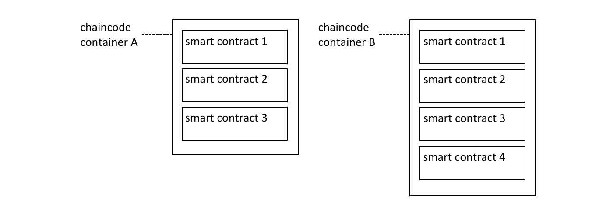
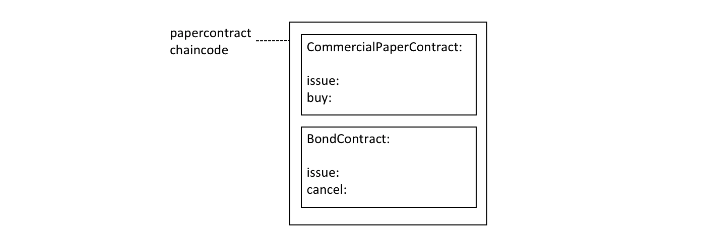

# Contract names

**Audience**: Architects, application and smart contract developers,
administrators

A chaincode is a generic container for deploying code to a Hyperledger Fabric
blockchain network. One or more related smart contracts are defined within a
chaincode. Every smart contract has a name that uniquely identifies it within a
chaincode. Applications access a particular smart contract within an
instantiated chaincode using its contract name.

In this topic, we're going to cover:
* [How a chaincode contains multiple smart contracts](#chaincode)
* [How to assign a smart contract name](#name)
* [How to use a smart contract from an application](#application)
* [The default smart contract](#default-contract)

## Chaincode

In the [Developing Applications](./developing_applications.html) topic, we can
see how the Fabric SDKs provide high level programming abstractions which help
application and smart contract developers to focus on their business problem,
rather than the low level details of how to interact with a Fabric network.

Smart contracts are one example of a high level programming abstraction, and it
is possible to define smart contracts within in a chaincode container. When a
chaincode is installed and instantiated, all the smart contracts within it are
made available to the corresponding channel.

 *Multiple smart contracts can be
defined within a chaincode. Each is uniquely identified by their name within a
chaincode.*

In the diagram [above](#chaincode), chaincode A has three smart contracts
defined within it, whereas chaincode B has four smart contracts. See how the
chaincode name is used to fully qualify a particular smart contract.

The ledger structure is defined by a set of deployed smart contracts. That's
because the ledger contains facts about the business objects of interest to the
network (such as commercial paper within PaperNet), and these business objects
are moved through their lifecycle (e.g. issue, buy, redeem) by the transaction
functions defined within a smart contract.

In most cases, a chaincode will only have one smart contract defined within it.
However, it can make sense to keep related smart contracts together in a single
chaincode. For example, commercial papers denominated in different currencies
might have contracts `EuroPaperContract`, `DollarPaperContract`,
`YenPaperContract` which might need to be kept synchronized with each other in
the channel to which they are deployed.

## Name

Each smart contract within a chaincode is uniquely identified by its contract
name. A smart contract can explicitly assign this name when the class is
constructed, or let the `Contract` class implicitly assign a default name.

Examine the `papercontract.js` chaincode
[file](https://github.com/hyperledger/fabric-samples/blob/master/commercial-paper/organization/magnetocorp/contract/lib/papercontract.js#L31):

```javascript
class CommercialPaperContract extends Contract {

    constructor() {
        // Unique name when multiple contracts per chaincode file
        super('org.papernet.commercialpaper');
    }
```

See how the `CommercialPaperContract` constructor specifies the contract name as
`org.papernet.commercialpaper`. The result is that within the `papercontract`
chaincode, this smart contract is now associated with the contract name
`org.papernet.commercialpaper`.

If an explicit contract name is not specified, then a default name is assigned
-- the name of the class.  In our example, the default contract name would be
`CommercialPaperContract`.

Choose your names carefully. It's not just that each smart contract must have a
unique name; a well-chosen name is illuminating. Specifically, using an explicit
DNS-style naming convention is recommended to help organize clear and meaningful
names; `org.papernet.commercialpaper` conveys that the PaperNet network has
defined a standard commercial paper smart contract.

Contract names are also helpful to disambiguate different smart contract
transaction functions with the same name in a given chaincode. This happens when
smart contracts are closely related; their transaction names will tend to be the
same. We can see that a transaction is uniquely defined within a channel by the
combination of its chaincode and smart contract name.

Contract names must be unique within a chaincode file. Some code editors will
detect multiple definitions of the same class name before deployment. Regardless
the chaincode will return an error if multiple classes with the same contract
name are explicitly or implicitly specified.

## Application

Once a chaincode has been installed on a peer and instantiated on a channel, the
smart contracts in it are accessible to an application:

```javascript
const network = await gateway.getNetwork(`papernet`);

const contract = await network.getContract('papercontract', 'org.papernet.commercialpaper');

const issueResponse = await contract.submitTransaction('issue', 'MagnetoCorp', '00001', '2020-05-31', '2020-11-30', '5000000');
```

See how the application accesses the smart contract with the
`contract.getContract()` method. The `papercontract` chaincode name
`org.papernet.commercialpaper` returns a `contract` reference which can be
used to submit transactions to issue commercial paper with the
`contract.submitTransaction()` API.

## Default contract

The first smart contract defined in a chaincode is the called the *default*
smart contract. A default is helpful because a chaincode will usually have one
smart contract defined within it; a default allows the application to access
those transactions directly -- without specifying a contract name.

 *A default smart contract is the
first contract defined in a chaincode.*

In this diagram, `CommercialPaperContract` is the default smart contract. Even
though we have two smart contracts, the default smart contract makes our
[previous](#application) example easier to write:

```javascript
const network = await gateway.getNetwork(`papernet`);

const contract = await network.getContract('papercontract');

const issueResponse = await contract.submitTransaction('issue', 'MagnetoCorp', '00001', '2020-05-31', '2020-11-30', '5000000');
```

This works because the default smart contract in `papercontract` is
`CommercialPaperContract` and it has an `issue` transaction. Note that the
`issue` transaction in `BondContract` can only be invoked by explicitly
addressing it. Likewise, even though the `cancel` transaction is unique, because
`BondContract` is *not* the default smart contract, it must also be explicitly
addressed.

In most cases, a chaincode will only contain a single smart contract, so careful
naming of the chaincode can reduce the need for developers to care about
chaincode as a concept. In the example code [above](#default-contract) it feels
like `papercontract` is a smart contract.

In summary, contract names are a straightforward mechanism to identify
individual smart contracts within a given chaincode. Contract names make it easy
for applications to find a particular smart contract and use it to access the
ledger.

<!--- Licensed under Creative Commons Attribution 4.0 International License
https://creativecommons.org/licenses/by/4.0/ -->