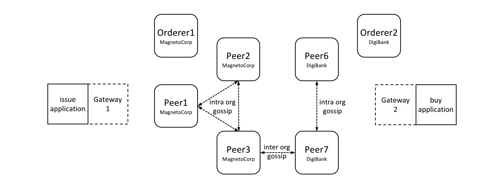

# Gateway

**Audience**: Architects, application and smart contract developers

A gateway manages the network interactions on behalf of an application, allowing
it to focus on business logic. Applications connect to a gateway and then all
subsequent interactions are managed using that gateway's configuration.

In this topic, we're going to cover:

* [Why gateways are important](#scenario)
* [How applications use a gateway](#connect)
* [How to define a static gateway](#static)
* [How to define a dynamic gateway for service discovery](#dynamic)
* [Using multiple gateways](#multiple-gateways)

## Scenario

A Hyperledger Fabric network channel can constantly change.  The peer, orderer
and CA components, contributed by the different organizations in the network,
will come and go. Reasons for this include increased or reduced business demand,
and both planned and unplanned outages. A gateway relieves an application of
this burden, allowing it to focus on the business problem it is trying to solve.

 *A MagnetoCorp and DigiBank
applications (issue and buy) delegate their respective network interactions to
their gateways. Each gateway understands the network channel topology comprising
the multiple peers and orderers of two organizations MagnetoCorp and DigiBank,
leaving applications to focus on business logic. Peers can talk to each other
both within and across organizations using the gossip protocol.*

A gateway can be used by an application in two different ways:

* **Static**: The gateway configuration is *completely* defined in a [connection
  profile](./connectionprofile.html). All the peers, orderers and CAs
  available to an application are statically defined in the connection profile
  used to configure the gateway. For peers, this includes their role as an
  endorsing peer or event notification hub, for example. You can read more about
  these roles in the connection profile [topic](./connectionprofile.html).

  The SDK will use this static topology, in conjunction with gateway
  [connection options](./connectionoptions), to manage the transaction
  submission and notification processes. The connection profile must contain
  enough of the network topology to allow a gateway to interact with the
  network on behalf of the application; this includes the network channels,
  organizations, orderers, peers and their roles.


* **Dynamic**: The gateway configuration is minimally defined in a connection
  profile. Typically, one or two peers from the application's organization are
  specified, and they use [service discovery](../discovery-overview.html) to
  discover the available network topology. This includes peers, orderers,
  channels, deployed smart contracts and their endorsement policies. (In
  production environments, a gateway configuration should specify at least two
  peers for availability.)

  The SDK will use all of the static and discovered topology information, in
  conjunction with gateway connection options, to manage the transaction
  submission and notification processes. As part of this, it will also
  intelligently use the discovered topology; for example, it will *calculate*
  the minimum required endorsing peers using the discovered endorsement policy
  for the smart contract.

You might ask yourself whether a static or dynamic gateway is better? The
trade-off is between predictability and responsiveness. Static networks will
always behave the same way, as they perceive the network as unchanging. In this
sense they are predictable -- they will always use the same peers and orderers
if they are available. Dynamic networks are more responsive as they understand
how the network changes -- they can use newly added peers and orderers, which
brings extra resilience and scalability, at potentially some cost in
predictability. In general it's fine to use dynamic networks, and indeed this
the default mode for gateways.

Note that the *same* connection profile can be used statically or dynamically.
Clearly, if a profile is going to be used statically, it needs to be
comprehensive, whereas dynamic usage requires only sparse population.

Both styles of gateway are transparent to the application; the application
program design does not change whether static or dynamic gateways are used. This
also means that some applications may use service discovery, while others may
not. In general using dynamic discovery means less definition and more
intelligence by the SDK; it is the default.

## Connect

When an application connects to a gateway, two options are provided. These are
used in subsequent SDK processing:

```javascript
  await gateway.connect(connectionProfile, connectionOptions);
```

* **Connection profile**: `connectionProfile` is the gateway configuration that
  will be used for transaction processing by the SDK, whether statically or
  dynamically. It can be specified in YAML or JSON, though it must be converted
  to a JSON object when passed to the gateway:

  ```javascript
  let connectionProfile = yaml.safeLoad(fs.readFileSync('../gateway/paperNet.yaml', 'utf8'));
  ```

  Read more about [connection profiles](./connectionprofile.html) and how
  to configure them.


* **Connection options**: `connectionOptions` allow an application to declare
  rather than implement desired transaction processing behaviour. Connection
  options are interpreted by the SDK to control interaction patterns with
  network components, for example to select which identity to connect with, or
  which peers to use for event notifications. These options significantly reduce
  application complexity without compromising functionality. This is possible
  because the SDK has implemented much of the low level logic that would
  otherwise be required by applications; connection options control this logic
  flow.

  Read about the list of available [connection options](./connectionoptions.html)
  and when to use them.

## Static

Static gateways define a fixed view of a network. In the MagnetoCorp
[scenario](#scenario), a gateway might identify a single peer from MagnetoCorp,
a single peer from DigiBank, and a MagentoCorp orderer. Alternatively, a gateway
might define *all* peers and orderers from MagnetCorp and DigiBank. In both
cases, a gateway must define a view of the network sufficient to get commercial
paper transactions endorsed and distributed.

Applications can use a gateway statically by explicitly specifying the connect
option `discovery: { enabled:false }` on the `gateway.connect()` API.
Alternatively, the environment variable setting `FABRIC_SDK_DISCOVERY=false`
will always override the application choice.

Examine the [connection
profile](https://github.com/hyperledger/fabric-samples/blob/{BRANCH}/commercial-paper/organization/magnetocorp/gateway/networkConnection.yaml)
used by the MagnetoCorp issue application. See how all the peers, orderers and
even CAs are specified in this file, including their roles.

It's worth bearing in mind that a static gateway represents a view of a network
at a *moment in time*.  As networks change, it may be important to reflect this
in a change to the gateway file. Applications will automatically pick up these
changes when they re-load the gateway file.

## Dynamic

Dynamic gateways define a small, fixed *starting point* for a network. In the
MagnetoCorp [scenario](#scenario), a dynamic gateway might identify just a
single peer from MagnetoCorp; everything else will be discovered! (To provide
resiliency, it might be better to define two such bootstrap peers.)

If [service discovery](../discovery-overview.html) is selected by an
application, the topology defined in the gateway file is augmented with that
produced by this process. Service discovery starts with the gateway definition,
and finds all the connected peers and orderers within the MagnetoCorp
organization using the [gossip protocol](../gossip.html). If [anchor
peers](../glossary.html#anchor-peer) have been defined for a channel, then
service discovery will use the gossip protocol across organizations to discover
components within the connected organization. This process will also discover
smart contracts installed on peers and their endorsement policies defined at a
channel level. As with static gateways, the discovered network must be
sufficient to get commercial paper transactions endorsed and distributed.

Dynamic gateways are the default setting for Fabric applications. They can be
explicitly specified using the connect option `discovery: { enabled:true }` on
the `gateway.connect()` API. Alternatively, the environment variable setting
`FABRIC_SDK_DISCOVERY=true` will always override the application choice.

A dynamic gateway represents an up-to-date view of a network. As networks
change, service discovery will ensure that the network view is an accurate
reflection of the topology visible to the application. Applications will
automatically pick up these changes; they do not even need to re-load the
gateway file.

## Multiple gateways

Finally, it is straightforward for an application to define multiple gateways,
both for the same or different networks. Moreover, applications can use the name
gateway both statically and dynamically.

It can be helpful to have multiple gateways. Here are a few reasons:

* Handling requests on behalf of different users.

* Connecting to different networks simultaneously.

* Testing a network configuration, by simultaneously comparing its behaviour
  with an existing configuration.

<!--- Licensed under Creative Commons Attribution 4.0 International License
https://creativecommons.org/licenses/by/4.0/ -->
