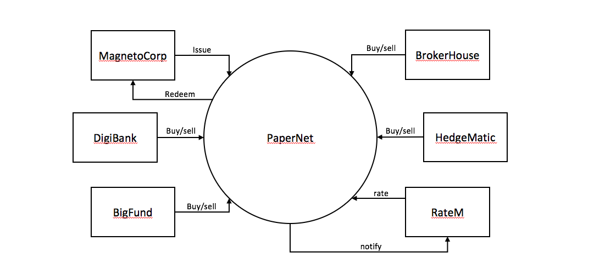

# The scenario

**Audience**: Architects, Application and smart contract developers, Business
professionals

In this topic, we're going to describe a business scenario involving six
organizations who use PaperNet, a commercial paper network built on Hyperledger
Fabric, to issue, buy and redeem commercial paper. We're going to use the
scenario to outline requirements for the development of commercial paper
applications and smart contracts used by the participant organizations.

## PaperNet network

PaperNet is a commercial paper network that allows suitably authorized
participants to issue, trade, redeem and rate commercial paper.

*The PaperNet commercial paper network. Six organizations currently use PaperNet
network to issue, buy, sell, redeem and rate commercial paper. MagentoCorp
issues and redeems commercial paper.  DigiBank, BigFund, BrokerHouse and
HedgeMatic all trade commercial paper with each other. RateM provides various
measures of risk for commercial paper.*

Let's see how MagnetoCorp uses PaperNet and commercial paper to help its
business.

## Introducing the actors

MagnetoCorp is a well-respected company that makes self-driving electric
vehicles. In early April 2020, MagnetoCorp won a large order to manufacture
10,000 Model D cars for Daintree, a new entrant in the personal transport
market. Although the order represents a significant win for MagnetoCorp,
Daintree will not have to pay for the vehicles until they start to be delivered
on November 1, six months after the deal was formally agreed between MagnetoCorp
and Daintree.

To manufacture the vehicles, MagnetoCorp will need to hire 1000 workers for at
least 6 months. This puts a short term strain on its finances -- it will require
an extra 5M USD each month to pay these new employees. **Commercial paper** is
designed to help MagnetoCorp overcome its short term financing needs -- to meet
payroll every month based on the expectation that it will be cash rich when
Daintree starts to pay for its new Model D cars.

At the end of May, MagnetoCorp needs 5M USD to meet payroll for the extra
workers it hired on May 1. To do this, it issues a commercial paper with a face
value of 5M USD with a maturity date 6 months in the future -- when it expects
to see cash flow from Daintree. DigiBank thinks that MagnetoCorp is
creditworthy, and therefore doesn't require much of a premium above the central
bank base rate of 2%, which would value 4.95M USD today at 5M USD in 6 months
time. It therefore purchases the MagnetoCorp 6 month commercial paper for 4.94M
USD -- a slight discount compared to the 4.95M USD it is worth. DigiBank fully
expects that it will be able to redeem 5M USD from MagnetoCorp in 6 months time,
making it a profit of 10K USD for bearing the increased risk associated with
this commercial paper. This extra 10K means it receives a 2.4% return on
investment -- significantly better than the risk free return of 2%.

At the end of June, when MagnetoCorp issues a new commercial paper for 5M USD to
meet June's payroll, it is purchased by BigFund for 4.94M USD.  That's because
the commercial conditions are roughly the same in June as they are in May,
resulting in BigFund valuing MagnetoCorp commercial paper at the same price that
DigiBank did in May.

Each subsequent month, MagnetoCorp can issue new commercial paper to meet its
payroll obligations, and these may be purchased by DigiBank, or any other
participant in the PaperNet commercial paper network -- BigFund, HedgeMatic or
BrokerHouse. These organizations may pay more or less for the commercial paper
depending on two factors -- the central bank base rate, and the risk associated
with MagnetoCorp. This latter figure depends on a variety of factors such as the
production of Model D cars, and the creditworthiness of MagnetoCorp as assessed
by RateM, a ratings agency.

The organizations in PaperNet have different roles, MagnetoCorp issues paper,
DigiBank, BigFund, HedgeMatic and BrokerHouse trade paper and RateM rates paper.
Organizations of the same role, such as DigiBank, Bigfund, HedgeMatic and
BrokerHouse are competitors. Organizations of different roles are not
necessarily competitors, yet might still have opposing business interest, for
example MagentoCorp will desire a high rating for its papers to sell them at
a high price, while DigiBank would benefit from a low rating, such that it can
buy them at a low price. As can be seen, even a seemingly simple network such
as PaperNet can have complex trust relationships. A blockchain can help
establish trust among organizations that are competitors or have opposing
business interests that might lead to disputes. Fabric in particular has the
means to capture even fine-grained trust relationships.

Let's pause the MagnetoCorp story for a moment, and develop the client
applications and smart contracts that PaperNet uses to issue, buy, sell and
redeem commercial paper as well as capture the trust relationships between
the organizations.  We'll come back to the role of the rating agency,
RateM, a little later.

<!--- Licensed under Creative Commons Attribution 4.0 International License
https://creativecommons.org/licenses/by/4.0/ -->
