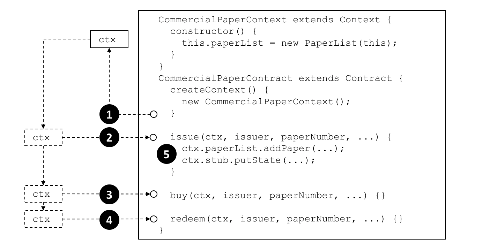
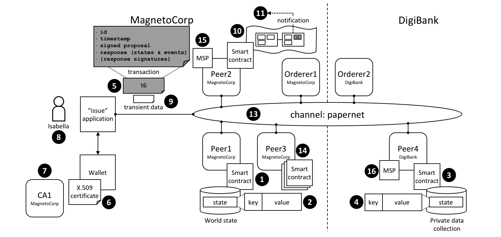

# Transaction context

**Audience**: Architects, application and smart contract developers

A transaction context performs two functions. Firstly, it allows a developer to
define and maintain user variables across transaction invocations within a smart
contract. Secondly, it provides access to a wide range of Fabric APIs that allow
smart contract developers to perform operations relating to detailed transaction
processing. These range from querying or updating the ledger, both the immutable
blockchain and the modifiable world state, to retrieving the
transaction-submitting application's digital identity.

A transaction context is created when a smart contract is deployed to a channel and
made available to every subsequent transaction invocation. A transaction context
helps smart contract developers write programs that are powerful, efficient and
easy to reason about.

* [Why a transaction context is important](#scenario)
* [How to use a transaction context](#programming)
* [What's in a transaction context](#structure)
* [Using a context `stub`](#stub)
* [Using a context `clientIdentity`](#clientIdentity)

## Scenario

In the commercial paper sample,
[papercontract](https://github.com/hyperledger/fabric-samples/blob/{BRANCH}/commercial-paper/organization/magnetocorp/contract/lib/papercontract.js)
initially defines the name of the list of commercial papers for which it's
responsible. Each transaction subsequently refers to this list; the issue
transaction adds new papers to it, the buy transaction changes its owner, and
the redeem transaction marks it as complete. This is a common pattern; when
writing a smart contract it's often helpful to initialize and recall particular
variables in sequential transactions.

 *A smart contract transaction
context allows smart contracts to define and maintain user variables across
transaction invocations. Refer to the text for a detailed explanation.*

## Programming

When a smart contract is constructed, a developer can optionally override the
built-in `Context` class `createContext` method to create a custom context:

```JavaScript
createContext() {
    new CommercialPaperContext();
}
```

In our example, the `CommercialPaperContext` is specialized for
`CommercialPaperContract`. See how the custom context, addressed through `this`,
adds the specific variable `PaperList` to itself:

```JavaScript
CommercialPaperContext extends Context {
    constructor () {
        this.paperList = new PaperList(this);
    }
}
```

When the createContext() method returns at point **(1)** in the diagram
[above](#scenario), a custom context `ctx` has been created which contains
`paperList` as one of its variables.

Subsequently, whenever a smart contract transaction such as issue, buy or redeem
is called, this context will be passed to it. See how at points **(2)**, **(3)**
and **(4)** the same commercial paper context is passed into the transaction
method using the `ctx` variable.

See how the context is then used at point **(5)**:

```JavaScript
ctx.paperList.addPaper(...);
ctx.stub.putState(...);
```

Notice how `paperList` created in `CommercialPaperContext` is available to the
issue transaction. See how `paperList` is similarly used by the **redeem** and
**buy** transactions; `ctx` makes the smart contracts efficient and easy to
reason about.

You can also see that there's another element in the context -- `ctx.stub` --
which was not explicitly added by `CommercialPaperContext`. That's because
`stub` and other variables are part of the built-in context. Let's now examine
the structure of this built-in context, these implicit variables and how to
use them.

## Structure

As we've seen from the [example](#programming), a transaction context can
contain any number of user variables such as `paperList`.

The transaction context also contains two built-in elements that provide access
to a wide range of Fabric functionality ranging from the client application that
submitted the transaction to ledger access.

  * `ctx.stub` is used to access APIs that provide a broad range of transaction
    processing operations from `putState()` and `getState()` to access the
    ledger, to `getTxID()` to retrieve the current transaction ID.

  * `ctx.clientIdentity` is used to get information about the identity of the
    user who submitted the transaction.

We'll use the following diagram to show you what a smart contract can do using
the `stub` and `clientIdentity` using the APIs available to it:

 *A smart contract can access a
range of functionality in a smart contract via the transaction context `stub`
and `clientIdentity`. Refer to the text for a detailed explanation.*

## Stub

The APIs in the stub fall into the following categories:

* **World state data APIs**. See interaction point **(1)**. These APIs enable
  smart contracts to get, put and delete state corresponding to individual
  objects from the world state, using their key:

    * [getState()](https://hyperledger.github.io/fabric-chaincode-node/{BRANCH}/api/fabric-shim.ChaincodeStub.html#getState__anchor)
    * [putState()](https://hyperledger.github.io/fabric-chaincode-node/{BRANCH}/api/fabric-shim.ChaincodeStub.html#putState__anchor)
    * [deleteState()](https://hyperledger.github.io/fabric-chaincode-node/{BRANCH}/api/fabric-shim.ChaincodeStub.html#deleteState__anchor)

  <br> These basic APIs are complemented by query APIs which enable contracts to
  retrieve a set of states, rather than an individual state. See interaction
  point **(2)**. The set is either defined by a range of key values, using full
  or partial keys, or a query according to values in the underlying world state
  [database](../ledger/ledger.html#world-state-database-options).  For large
  queries, the result sets can be paginated to reduce storage requirements:

    * [getStateByRange()](https://hyperledger.github.io/fabric-chaincode-node/{BRANCH}/api/fabric-shim.ChaincodeStub.html#getStateByRange__anchor)
    * [getStateByRangeWithPagination()](https://hyperledger.github.io/fabric-chaincode-node/{BRANCH}/api/fabric-shim.ChaincodeStub.html#getStateByRangeWithPagination__anchor)
    * [getStateByPartialCompositeKey()](https://hyperledger.github.io/fabric-chaincode-node/{BRANCH}/api/fabric-shim.ChaincodeStub.html#getStateByPartialCompositeKey__anchor)
    * [getStateByPartialCompositeKeyWithPagination()](https://hyperledger.github.io/fabric-chaincode-node/{BRANCH}/api/fabric-shim.ChaincodeStub.html#getStateByPartialCompositeKeyWithPagination__anchor)
    * [getQueryResult()](https://hyperledger.github.io/fabric-chaincode-node/{BRANCH}/api/fabric-shim.ChaincodeStub.html#getQueryResult__anchor)
    * [getQueryResultWithPagination()](https://hyperledger.github.io/fabric-chaincode-node/{BRANCH}/api/fabric-shim.ChaincodeStub.html#getQueryResultWithPagination__anchor)

* **Private data APIs**. See interaction point **(3)**. These APIs enable smart
  contracts to interact with a private data collection. They are analogous to
  the APIs for world state interactions, but for private data. There are APIs to
  get, put and delete a private data state by its key:

    * [getPrivateData()](https://hyperledger.github.io/fabric-chaincode-node/{BRANCH}/api/fabric-shim.ChaincodeStub.html#getPrivateData__anchor)
    * [putPrivateData()](https://hyperledger.github.io/fabric-chaincode-node/{BRANCH}/api/fabric-shim.ChaincodeStub.html#putPrivateData__anchor)
    * [deletePrivateData()](https://hyperledger.github.io/fabric-chaincode-node/{BRANCH}/api/fabric-shim.ChaincodeStub.html#deletePrivateData__anchor)

  <br> This set is complemented by set of APIs to query private data **(4)**.
  These APIs allow smart contracts to retrieve a set of states from a private
  data collection, according to a range of key values, either full or partial
  keys, or a query according to values in the underlying world state
  [database](../ledger/ledger.html#world-state-database-options). There are
  currently no pagination APIs for private data collections.

    * [getPrivateDataByRange()](https://hyperledger.github.io/fabric-chaincode-node/{BRANCH}/api/fabric-shim.ChaincodeStub.html#getPrivateDataByRange__anchor)
    * [getPrivateDataByPartialCompositeKey()](https://hyperledger.github.io/fabric-chaincode-node/{BRANCH}/api/fabric-shim.ChaincodeStub.html#getPrivateDataByPartialCompositeKey__anchor)
    * [getPrivateDataQueryResult()](https://hyperledger.github.io/fabric-chaincode-node/{BRANCH}/api/fabric-shim.ChaincodeStub.html#getPrivateDataQueryResult__anchor)

* **Transaction APIs**. See interaction point **(5)**. These APIs are used by a
  smart contract to retrieve details about the current transaction proposal
  being processed by the smart contract. This includes the transaction
  identifier and the time when the transaction proposal was created.

    * [getTxID()](https://hyperledger.github.io/fabric-chaincode-node/{BRANCH}/api/fabric-shim.ChaincodeStub.html#getTxID__anchor)
      returns the identifier of the current transaction proposal **(5)**.
    * [getTxTimestamp()](https://hyperledger.github.io/fabric-chaincode-node/{BRANCH}/api/fabric-shim.ChaincodeStub.html#getTxTimestamp__anchor)
      returns the timestamp when the current transaction proposal was created by
      the application **(5)**.
    * [getCreator()](https://hyperledger.github.io/fabric-chaincode-node/{BRANCH}/api/fabric-shim.ChaincodeStub.html#getCreator__anchor)
      returns the raw identity (X.509 or otherwise) of the creator of
      transaction proposal. If this is an X.509 certificate then it is often
      more appropriate to use [`ctx.ClientIdentity`](#clientidentity).
    * [getSignedProposal()](https://hyperledger.github.io/fabric-chaincode-node/{BRANCH}/api/fabric-shim.ChaincodeStub.html#getSignedProposal__anchor)
      returns a signed copy of the current transaction proposal being processed
      by the smart contract.
    * [getBinding()](https://hyperledger.github.io/fabric-chaincode-node/{BRANCH}/api/fabric-shim.ChaincodeStub.html#getBinding__anchor)
      is used to prevent transactions being maliciously or accidentally replayed
      using a nonce. (For practical purposes, a nonce is a random number
      generated by the client application and incorporated in a cryptographic
      hash.) For example, this API could be used by a smart contract at **(1)**
      to detect a replay of the transaction **(5)**.
    * [getTransient()](https://hyperledger.github.io/fabric-chaincode-node/{BRANCH}/api/fabric-shim.ChaincodeStub.html#getTransient__anchor)
      allows a smart contract to access the transient data an application passes
      to a smart contract. See interaction points **(9)** and **(10)**.
      Transient data is private to the application-smart contract interaction.
      It is not recorded on the ledger and is often used in conjunction with
      private data collections **(3)**.

  <br>

* **Key APIs** are used by smart contracts to manipulate state key in the world
  state or a private data collection. See interaction points **2** and **4**.

  The simplest of these APIs allows smart contracts to form and split composite
  keys from their individual components. Slightly more advanced are the
  `ValidationParameter()` APIs which get and set the state based endorsement
  policies for world state **(2)** and private data **(4)**. Finally,
  `getHistoryForKey()` retrieves the history for a state by returning the set of
  stored values, including the transaction identifiers that performed the state
  update, allowing the transactions to be read from the blockchain **(10)**.

    * [createCompositeKey()](https://hyperledger.github.io/fabric-chaincode-node/{BRACNH}/api/fabric-shim.ChaincodeStub.html#createCompositeKey__anchor)
    * [splitCompositeKey()](https://hyperledger.github.io/fabric-chaincode-node/{BRANCH}/api/fabric-shim.ChaincodeStub.html#splitCompositeKey__anchor)
    * [setStateValidationParameter()](https://hyperledger.github.io/fabric-chaincode-node/{BRANCH}/api/fabric-shim.ChaincodeStub.html#setStateValidationParameter__anchor)
    * [getStateValidationParameter()](https://hyperledger.github.io/fabric-chaincode-node/{BRANCH}/api/fabric-shim.ChaincodeStub.html#getStateValidationParameter__anchor)
    * [getPrivateDataValidationParameter()](https://hyperledger.github.io/fabric-chaincode-node/{BRANCH}/api/fabric-shim.ChaincodeStub.html#getPrivateDataValidationParameter__anchor)
    * [setPrivateDataValidationParameter()](https://hyperledger.github.io/fabric-chaincode-node/{BRANCH}/api/fabric-shim.ChaincodeStub.html#setPrivateDataValidationParameter__anchor)
    * [getHistoryForKey()](https://hyperledger.github.io/fabric-chaincode-node/{BRANCH}/api/fabric-shim.ChaincodeStub.html#getHistoryForKey__anchor)

  <br>

* **Event APIs** are used to set an event during the processing of a smart contract.

    * [setEvent()](https://hyperledger.github.io/fabric-chaincode-node/{BRANCH}/api/fabric-shim.ChaincodeStub.html#setEvent__anchor)

      Smart contracts use this API to add an event to a transaction response.
      Note that only a single event can be created in a transaction, and must
      originate from the outer-most contract when contracts invoke each other via `invokeChaincode`.
      See interaction point **(5)**. These events are ultimately recorded on the
      blockchain and sent to listening applications at interaction point
      **(11)**.

    <br>

* **Utility APIs** are a collection of useful APIs that don't easily fit in a
  pre-defined category, so we've grouped them together! They include retrieving
  the current channel name and passing control to a different chaincode on the
  same peer.

    * [getChannelID()](https://hyperledger.github.io/fabric-chaincode-node/{BRANCH}/api/fabric-shim.ChaincodeStub.html#getChannelID__anchor)

      See interaction point **(13)**.  A smart contract running on any peer can
      use this API to determined on which channel the application invoked the
      smart contract.

    * [invokeChaincode()](https://hyperledger.github.io/fabric-chaincode-node/{BRANCH}/api/fabric-shim.ChaincodeStub.html#invokeChaincode__anchor)

      See interaction point **(14)**.  Peer3 owned by MagnetoCorp has multiple
      smart contracts installed on it.  These smart contracts are able to call
      each other using this API. The smart contracts must be collocated; it is
      not possible to call a smart contract on a different peer.

    <br> Some of these utility APIs are only used if you're using low-level
  chaincode, rather than smart contracts. These APIs are primarily for the
  detailed manipulation of chaincode input; the smart contract `Contract` class
  does all of this parameter marshalling automatically for developers.

    * [getFunctionAndParameters()](https://hyperledger.github.io/fabric-chaincode-node/{BRANCH}/api/fabric-shim.ChaincodeStub.html#getFunctionAndParameters__anchor)
    * [getStringArgs()](https://hyperledger.github.io/fabric-chaincode-node/{BRANCH}/api/fabric-shim.ChaincodeStub.html#getStringArgs__anchor)
    * [getArgs()](https://hyperledger.github.io/fabric-chaincode-node/{BRANCH}/api/fabric-shim.ChaincodeStub.html#getArgs__anchor)

## ClientIdentity

In most cases, the application submitting a transaction will be using an X.509
certificate. In the [example](#structure), an X.509 certificate **(6)** issued
by `CA1` **(7)** is being used by `Isabella` **(8)** in her application to sign
the proposal in transaction `t6` **(5)**.

`ClientIdentity` takes the information returned by `getCreator()` and puts a set
of X.509 utility APIs on top of it to make it easier to use for this common use
case.

* [getX509Certificate()](https://hyperledger.github.io/fabric-chaincode-node/{BRANCH}/api/fabric-shim.ClientIdentity.html#getX509Certificate__anchor)
  returns the full X.509 certificate of the transaction submitter, including all
  its attributes and their values. See interaction point **(6)**.
* [getAttributeValue()](https://hyperledger.github.io/fabric-chaincode-node/{BRANCH}/api/fabric-shim.ClientIdentity.html#getAttributeValue__anchor)
  returns the value of a particular X.509 attribute, for example, the
  organizational unit `OU`, or distinguished name `DN`. See interaction point
  **(6)**.
* [assertAttributeValue()](https://hyperledger.github.io/fabric-chaincode-node/{BRANCH}/api/fabric-shim.ClientIdentity.html#assertAttributeValue__anchor)
  returns `TRUE` if the specified attribute of the X.509 attribute has a
  specified value. See interaction point **(6)**.
* [getID()](https://hyperledger.github.io/fabric-chaincode-node/{BRANCH}/api/fabric-shim.ClientIdentity.html#getID__anchor)
  returns the unique identity of the transaction submitter, according to their
  distinguished name and the issuing CA's distinguished name. The format is
  `x509::{subject DN}::{issuer DN}`. See interaction point **(6)**.
* [getMSPID()](https://hyperledger.github.io/fabric-chaincode-node/{BRANCH}/api/fabric-shim.ClientIdentity.html#getMSPID__anchor)
  returns the channel MSP of the transaction submitter. This allows a smart
  contract to make processing decisions based on the submitter's organizational
  identity. See interaction point **(15)** or **(16)**.

<!--- Licensed under Creative Commons Attribution 4.0 International License
https://creativecommons.org/licenses/by/4.0/ -->
