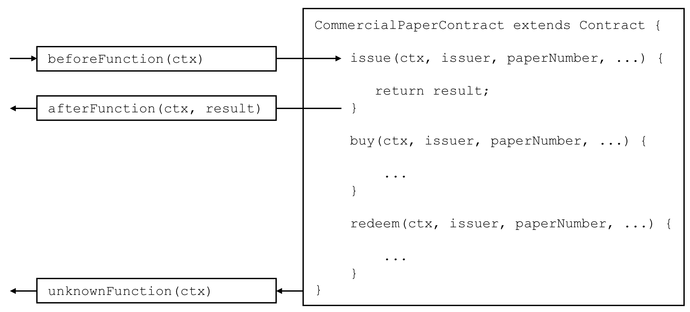

# Transaction handlers

**Audience**: Architects, Application and smart contract developers

Transaction handlers allow smart contract developers to define common processing
at key points during the interaction between an application and a smart
contract. Transaction handlers are optional but, if defined, they will receive
control before or after every transaction in a smart contract is invoked. There
is also a specific handler which receives control when a request is made to
invoke a transaction not defined in a smart contract.

Here's an example of transaction handlers for the [commercial paper smart
contract sample](./smartcontract.html):



*Before, After and Unknown transaction handlers. In this example,
`beforeTransaction()` is called before the **issue**, **buy** and **redeem**
transactions. `afterTransaction()` is called after the **issue**, **buy** and
**redeem** transactions. `unknownTransaction()` is only called if a request is
made to invoke a transaction not defined in the smart contract.  (The diagram is
simplified by not repeating `beforeTransaction` and `afterTransaction` boxes for
each transaction.)*

## Types of handler

There are three types of transaction handlers which cover different aspects
of the interaction between an application and a smart contract:

  * **Before handler**: is called before every smart contract transaction is
    invoked. The handler will usually modify the transaction context to be used
    by the transaction. The handler has access to the full range of Fabric APIs;
    for example, it can issue `getState()` and `putState()`.


  * **After handler**: is called after every smart contract transaction is
    invoked. The handler will usually perform post-processing common to all
    transactions, and also has full access to the Fabric APIs.


  * **Unknown handler**: is called if an attempt is made to invoke a transaction
    that is not defined in a smart contract. Typically, the handler will record
    the failure for subsequent processing by an administrator. The handler has
    full access to the Fabric APIs.

Defining a transaction handler is optional; a smart contract will perform
correctly without handlers being defined. A smart contract can define at most
one handler of each type.

## Defining a handler

Transaction handlers are added to the smart contract as methods with well
defined names.  Here's an example which adds a handler of each type:

```JavaScript
CommercialPaperContract extends Contract {

    ...

    async beforeTransaction(ctx) {
        // Write the transaction ID as an informational to the console
        console.info(ctx.stub.getTxID());
    };

    async afterTransaction(ctx, result) {
        // This handler interacts with the ledger
        ctx.stub.cpList.putState(...);
    };

    async unknownTransaction(ctx) {
        // This handler throws an exception
        throw new Error('Unknown transaction function');
    };

}
```

The form of a transaction handler definition is the similar for all handler
types, but notice how the `afterTransaction(ctx, result)` also receives any
result returned by the transaction. The [API
documentation](https://hyperledger.github.io/fabric-chaincode-node/{BRANCH}/api/fabric-contract-api.Contract.html)
shows you the exact form of these handlers.

## Handler processing

Once a handler has been added to the smart contract, it will be invoked during
transaction processing. During processing, the handler receives `ctx`, the
[transaction context](./transationcontext.md), performs some processing, and
returns control as it completes. Processing continues as follows:

* **Before handler**: If the handler completes successfully, the transaction is
  called with the updated context. If the handler throws an exception, then the
  transaction is not called and the smart contract fails with the exception
  error message.


* **After handler**: If the handler completes successfully, then the smart
  contract completes as determined by the invoked transaction. If the handler
  throws an exception, then the transaction fails with the exception error
  message.


* **Unknown handler**: The handler should complete by throwing an exception with
  the required error message. If an **Unknown handler** is not specified, or an
  exception is not thrown by it, there is sensible default processing; the smart
  contract will fail with an **unknown transaction** error message.

If the handler requires access to the function and parameters, then it is easy to do this:

```JavaScript
async beforeTransaction(ctx) {
    // Retrieve details of the transaction
    let txnDetails = ctx.stub.getFunctionAndParameters();

    console.info(`Calling function: ${txnDetails.fcn} `);
    console.info(util.format(`Function arguments : %j ${stub.getArgs()} ``);
}
```

See how this handler uses the utility API `getFunctionAndParameters` via the
[transaction context](./transactioncontext.html#stub).

## Multiple handlers

It is only possible to define at most one handler of each type for a smart
contract. If a smart contract needs to invoke multiple functions during before,
after or unknown handling, it should coordinate this from within the appropriate
function.
