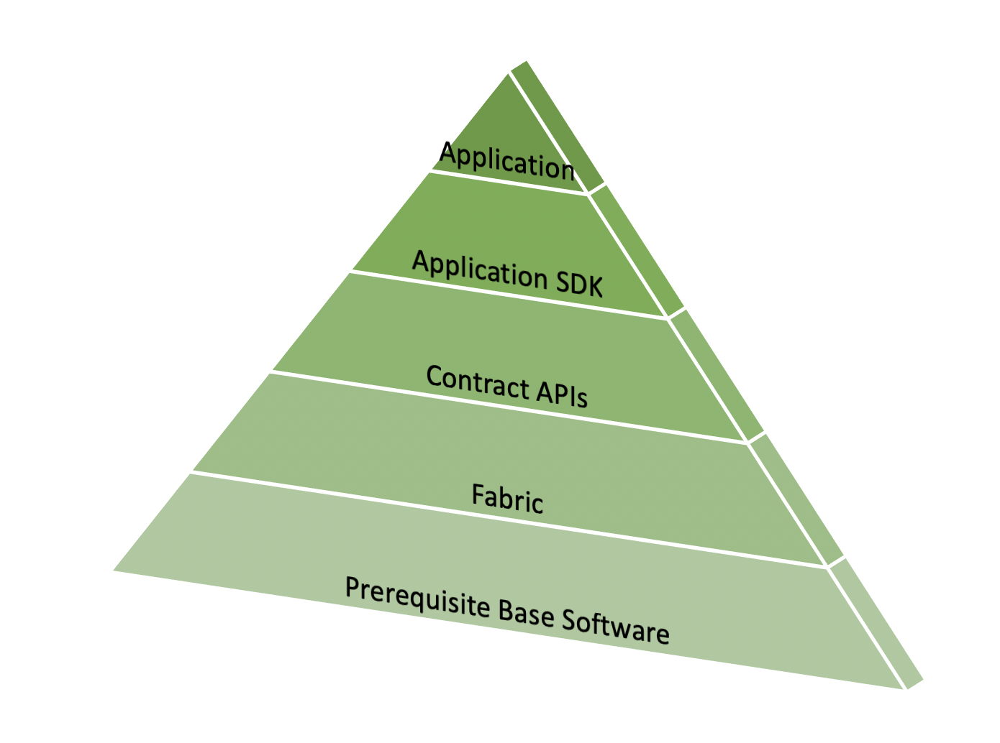

Getting Started - Install
=========================

.. toctree::
   :maxdepth: 1
   :hidden:

   prereqs
   install
   sdk_chaincode

The Fabric application stack has five layers:

* :doc:`Prerequisite software <prereqs>`: the base layer needed to run the software, for example, Docker.
* :doc:`Fabric and Fabric samples <install>`: the Fabric executables to run a Fabric network along with sample code.
* :doc:`Contract APIs <sdk_chaincode>`: to develop smart contracts executed on a Fabric Network.
* :doc:`Application APIs <sdk_chaincode>`: to develop your blockchain application.
* The Application: your blockchain application will utilize the Application SDKs to call smart contracts running on a Fabric network.

.. Licensed under Creative Commons Attribution 4.0 International License
   https://creativecommons.org/licenses/by/4.0/
