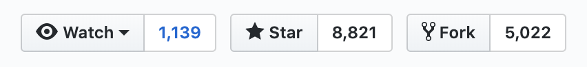
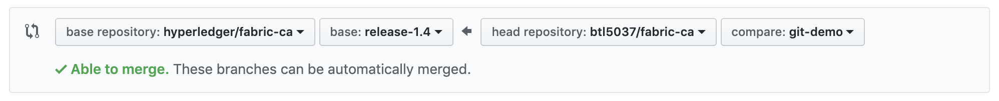

**GitHub Contributions**
========================

Forking the repository
----------------------

To protect the Hyperledger Fabric source code, and maintain a clean state in
the official GitHub repositories, Hyperledger Fabric GitHub pull requests
are accepted from forked repositories only. The act of forking a GitHub
repository creates an identical copy of the repository in your personal
GitHub account. You are then able to edit code and propose these changes
to the official Hyperledger Fabric repositories you forked the code from via
the GitHub pull request process.

To fork a repository:

- Navigate to the GitHub repository you wish to fork in your browser
- In the top right corner select the Fork button

- Your browser will automatically take you to the forked repostiory within
  your personal GitHub account once the forking process has complete

You can now clone your personal fork to your local machine.

Cloning the Repository and Syncing With the Upstream Project
------------------------------------------------------------

Once you have forked the repository you can now clone the project to your
local machine to begin your development work. This will create a local
GitHub repository on your machine.

.. Note ::

   Prerequisite: This guide uses GitHub's SSH protocol for cloning repositories.
   If you have not yet setup SSH access for GitHub please use the
   `GitHub guide <https://help.github.com/en/articles/connecting-to-github-with-ssh>`_
   to configure your SSH access.

To clone a repository:

- Open your terminal
- Navigate to the location on your local disk where you want to clone the repository

.. note::
   For Go-based repositories not yet using Go Modules, the location on your disk
   must be relative to your GOPATH's `src` directory, i.e.,
   `$GOPATH/src/github.com/hyperledger`.

- Execute the following command to clone your fork

.. code::

   git clone git@github.com:<your_github_id>/<repository_name>.git

- Now change to the repositories directory and sync your local
  repository with its remote upstream repository

.. code::

   cd <repository_name>
   git remote add upstream https://github.com/hyperledger/<repository_name>.git

- You can now list your remote branches and confirm your local repository has created
  a link with the remote upstream repository

.. code::

   git remote -v

You have now cloned your forked repository and configured its upstream repository.
You can now begin development.

Create a Local Feature Branch for Your Development work
-------------------------------------------------------

To protect the state of the existing branches in your forked repository
and ensure the work you perform is saved in a logical location, the use
of feature branches in your forked repository is recommended. A feature
branch is created from an existing branch and is where you will perform
your development work before pushing the changes back to your fork of
the GitHub repository. To create a feature branch, perform the following steps:

- Fetch the project branches from the upstream repository

.. code::

   git fetch upstream

- Checkout one of the existing branches

.. code::

   git checkout -t origin/master

- Merge the upstream counterpart into your local master

.. code::

   git merge upstream/master

- Update your fork on GitHub with any changes from the upstream master

.. code::

   git push origin master

- You can now checkout a new local feature branch, this ensures you do not diverge
  the local master branch from its remote counterpart. The feature branch will be
  an exact copy of the branch from which you created it.

.. code::

   git checkout -b <feature_branch_name>

Now that you have created a local feature branch, you can perform your updates.

Commiting and Pushing Changes to Your Forked Repository
-------------------------------------------------------

Once you have completed the work you intend to perform in your local feature branch,
you can commit this code and push it to your forked repository to save its state.
This is a prerequisite to opening pull requests against the Hyperledger repositories.
Perform the following steps to commit and push your code to your forked repository:

- Add existing files you have changed to your commit by executing the following command,
  the '-p' flag will open an interactive terminal for you to review and approve your
  changes before adding them to your commit:

.. code::

   git add -p

- Add new files you have created by executing:

.. code::

   git add <file1> <file2>

- You can now create your commit containing the changes you just added. Your commit
  message should contain meaningingful information as to why this work was completed,
  as well as the Jira number in the commit header:

.. code::

   git commit -s

.. note::

   Hyperledger requires that commits be signed by the commiter.
   When issuing the `commit` command, specify the `-s` flag to
   automatically add your signature to your commit.

- You can now push your local changes to your forked repository

.. code::

   git push origin <feature_branch_name>

.. note::

   If you want to integrate upstream changes from the original repository
   before pushing your changes see the section at the bottom of this page titled,
   `Syncing Your Fork With the Upstream Repository`_.

You have now successfully pushed your local changes to your forked repository. To
integrate these changes you must now go through the pull request process.

Opening a Pull Request in GitHub
--------------------------------

Now that you've created and pushed changes to a feature branch in your forked
repository, you can now open a pull request against the original Hyperledger
repository from which you created your fork and begin the code review process.

- To begin, navigate to `https://github.com/hyperledger/<original_repository>` in your browser
- Select the `Pull Requests` tab at the top of the page
- In the top right corner of the Pull Requests page, select `New Pull Request`
- On the Compare Changes page, select `compare across forks` at the top of the page
- Select the Hyperledger repo from which you created the fork as the `base repository`
  and the branch you want to merge into as the `base`
- Select your fork as the `head repository` and your feature branch as the `compare`

- Select `Create Pull Request`
- You can now enter a title for your pull request and a comment if you desire
- You can now choose one of two options for creating your pull request.
  In the green `Create Pull Request` box select the down-arrow to the right of it.
- You can choose the first option to open your pull request as-is.
  This will automatically assign the repostiories maintainers as reviewers for
  your pull request.
- You can choose the second option to open your pull request as a draft.
  Opening your pull request as a draft will not assign any reviewers, but will
  still allow your change to run through CI.

Congratulations, you have now submitted your first pull request to a Hyperledger project.
Your pull request will now run through CI. You can monitor your pull request CI progress
by navigating to the `Checks` tab of the pull request.

.. warning::

   If you bypass the perscribed pull request process and generate a pull request
   from an edit you made using GitHub's editor UI, you must manually add your
   signature to the commit message when the commit is generated in the UI.

Updating a Pull Request
-----------------------
As you receive review comments on your pull request, you may need to make edits
to your commit. In the local branch you are working from, you may add additional
commits and re-push as documented above. This will automatically add the new
commits to the pull request and CI checks will be re-triggered.

However, it is usually not desired to keep a history of all the changes.
You can keep the pull request and the ultimate merge into the upstream
'clean' by squashing your commits into a single final commit. For example
to squash your two most recent commits into a single commit:

.. code::

   git rebase -i HEAD~2

This will open an interactive dialog. Change the second (and any subsequent)
commit action from 'pick' to 'squash' in the dialog. The dialog will then
present all the commit messages, which you can edit into a final message.

Then do a force push to your remote origin:

.. code::

   git push origin <feature_branch_name> -f

This will update your remote origin to be at the final single commit, and
will update the pull request accordingly.

Alternatively, rather than creating a second commit and squashing, you
could amend the original commit and force push it back to your
remote origin:

.. code::

   git add -p
   git commit --amend
   git push origin <feature_branch_name> -f

Again, the pull request will be updated accordingly and CI checks
will be re-triggered.

Cleaning Up Local And Remote Feature branches
---------------------------------------------

Once you have completed work on a feature branch and the changes have been merged, you
should delete the local and remote feature branches as they are no longer valid to build
on. You can delete them by executing the following commands:

.. code::

   git branch -d <feature_branch_name>
   git push --delete origin <feature_branch_name>

Syncing Your Fork With the Upstream Repository
----------------------------------------------

As your development progresses, invariably new commits will be merged into the original
project from which your forked repo was generated from. To avoid surprise merge conflicts
you should integrate these changes into your local repository. To integrate changes
from the upstream repository, assuming you are working on changes to the master branch,
execute the following commands from the root of your repository:

.. code::

   git fetch upstream
   git rebase upstream/master

Syncing your fork only updates your local repository, you will need to push these
updates to your forked repository to save them using the following command:

.. code::

   git push origin master
