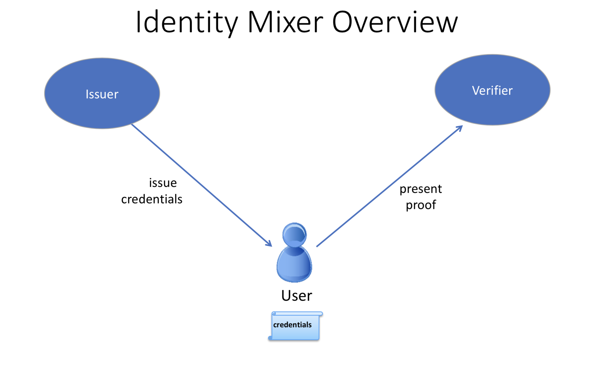
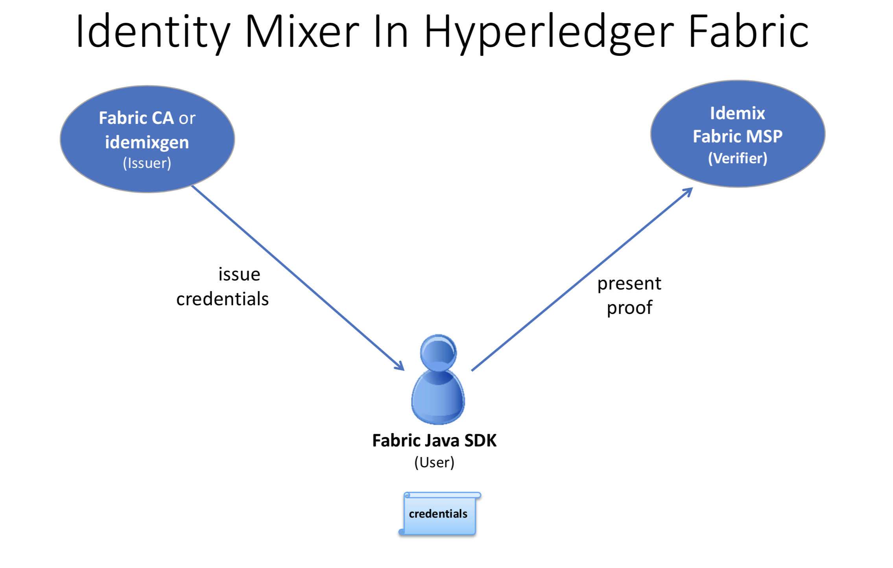

MSP Implementation with Identity Mixer
======================================

What is Idemix?
---------------

Idemix is a cryptographic protocol suite, which provides strong authentication as
well as privacy-preserving features such as **anonymity**, the ability to transact
without revealing the identity of the transactor, and **unlinkability**, the
ability of a single identity to send multiple transactions without revealing
that the transactions were sent by the same identity.

There are three actors involved in an Idemix flow: **user**, **issuer**, and
**verifier**.

* An issuer certifies a set of user's attributes are issued in the form of a
  digital certificate, hereafter called "credential".
* The user later generates a "`zero-knowledge proof <https://en.wikipedia.org/wiki/Zero-knowledge_proof>`_"
  of possession of the credential and also selectively discloses only the
  attributes the user chooses to reveal. The proof, because it is zero-knowledge,
  reveals no additional information to the verifier, issuer, or anyone else.

As an example, suppose "Alice" needs to prove to Bob (a store clerk) that she has
a driver's license issued to her by the DMV.

In this scenario, Alice is the user, the DMV is the issuer, and Bob is the
verifier. In order to prove to Bob that Alice has a driver's license, she could
show it to him. However, Bob would then be able to see Alice's name, address,
exact age, etc. --- much more information than Bob needs to know.

Instead, Alice can use Idemix to generate a "zero-knowledge proof" for Bob, which
only reveals that she has a valid driver's license and nothing else.

So from the proof:

* Bob does not learn any additional information about Alice other than the fact
  that she has a valid license (anonymity).
* If Alice visits the store multiple times and generates a proof each time for Bob,
  Bob would not be able to tell from the proof that it was the same person
  (unlinkability).

Idemix authentication technology provides the trust model and security
guarantees that are similar to what is ensured by standard X.509 certificates but
with underlying cryptographic algorithms that efficiently provide advanced
privacy features including the ones described above. We'll compare Idemix and
X.509 technologies in detail in the technical section below.

How to use Idemix
-----------------

To understand how to use Idemix with Hyperledger Fabric, we need to see which
Fabric components correspond to the user, issuer, and verifier in Idemix.

* The Fabric Java SDK is the API for the **user**. In the future, other Fabric
  SDKs will also support Idemix.

* Fabric provides two possible Idemix **issuers**:

   a) Fabric CA for production environments or development, and
   b) the :doc:`idemixgen <idemixgen>` tool for development environments.

* The **verifier** is an Idemix MSP in Fabric.

In order to use Idemix in Hyperledger Fabric, the following three basic steps
are required:

*Compare the roles in this image to the ones above.*

1. Consider the issuer.

   Fabric CA (version 1.3 or later) has been enhanced to automatically function
   as an Idemix issuer. When ``fabric-ca-server`` is started (or initialized via
   the ``fabric-ca-server init`` command), the following two files are
   automatically created in the home directory of the ``fabric-ca-server``:
   ``IssuerPublicKey`` and ``IssuerRevocationPublicKey``. These files are
   required in step 2.

   For a development environment and if you are not using Fabric CA, you may use
   ``idemixgen``to create these files.

2. Consider the verifier.

   You need to create an Idemix MSP using the ``IssuerPublicKey`` and
   ``IssuerRevocationPublicKey`` from step 1.

   For example, consider the following excerpt from
   `configtx.yaml in the Hyperledger Java SDK sample <https://github.com/hyperledger/fabric-sdk-java/blob/master/src/test/fixture/sdkintegration/e2e-2Orgs/v1.3/configtx.yaml>`_:

   .. code:: bash

      - &Org1Idemix
          # defaultorg defines the organization which is used in the sampleconfig
          # of the fabric.git development environment
          name: idemixMSP1

          # id to load the msp definition as
          id: idemixMSPID1

          msptype: idemix
          mspdir: crypto-config/peerOrganizations/org3.example.com

   The ``msptype`` is set to ``idemix`` and the contents of the ``mspdir``
   directory (``crypto-config/peerOrganizations/org3.example.com/msp`` in this
   example) contains the ``IssuerPublicKey`` and ``IssuerRevocationPublicKey``
   files.

   Note that in this example, ``Org1Idemix`` represents the Idemix MSP for ``Org1``
   (not shown), which would also have an X509 MSP.

3. Consider the user. Recall that the Java SDK is the API for the user.

   There is only a single additional API call required in order to use Idemix
   with the Java SDK: the ``idemixEnroll`` method of the
   ``org.hyperledger.fabric_ca.sdk.HFCAClient`` class. For example, assume
   ``hfcaClient`` is your HFCAClient object and ``x509Enrollment`` is your
   ``org.hyperledger.fabric.sdk.Enrollment`` associated with your X509 certificate.

   The following call will return an ``org.hyperledger.fabric.sdk.Enrollment``
   object associated with your Idemix credential.

   .. code:: bash

      IdemixEnrollment idemixEnrollment = hfcaClient.idemixEnroll(x509enrollment, "idemixMSPID1");

   Note also that ``IdemixEnrollment`` implements the ``org.hyperledger.fabric.sdk.Enrollment``
   interface and can, therefore, be used in the same way that one uses the X509
   enrollment object, except, of course, that this automatically provides the
   privacy enhancing features of Idemix.

Idemix and chaincode
--------------------

From a verifier perspective, there is one more actor to consider: chaincode.
What can chaincode learn about the transactor when an Idemix credential is used?

The `cid (Client Identity) library <https://github.com/hyperledger/fabric/tree/master/core/chaincode/shim/ext/cid>`_
(for golang only) has been extended to support the ``GetAttributeValue`` function
when an Idemix credential is used. However, as mentioned in the "Current
limitations" section below, there are only two attributes which are disclosed in
the Idemix case: ``ou`` and ``role``.

If Fabric CA is the credential issuer:

* the value of the `ou` attribute is the identity's **affiliation** (e.g.
  "org1.department1");
* the value of the ``role`` attribute will be either 'member' or 'admin'. A
  value of 'admin' means that the identity is an MSP administrator. By default,
  identities created by Fabric CA will return the 'member' role. In order to
  create an 'admin' identity, register the identity with the ``role`` attribute
  and a value of ``2``.

For an example of using the `cid` library to retrieve these attributes, see
`this java SDK example <https://github.com/hyperledger/fabric-sdk-java/blob/release-1.3/src/test/fixture/sdkintegration/gocc/sample1/src/github.com/example_cc/example_cc.go>`_.

Current limitations
-------------------

The current version of Idemix does have a few limitations.

* **Fixed set of attributes**

  It not yet possible to issue or use an Idemix credential with custom attributes.
  Custom attributes will be supported in a future release.

  The following four attributes are currently supported:

  1. Organizational Unit attribute ("ou"):

   - Usage: same as X.509
   - Type: String
   - Revealed: always

  2. Role attribute ("role"):

   - Usage: same as X.509
   - Type: integer
   - Revealed: always

  3. Enrollment ID attribute

   - Usage: uniquely identify a user --- same in all enrollment credentials that
     belong to the same user (will be used for auditing in the future releases)
   - Type: BIG
   - Revealed: never in the signature, only when generating an authentication token for Fabric CA

  4. Revocation Handle attribute

   - Usage: uniquely identify a credential (will be used for revocation in future releases)
   - Type: integer
   - Revealed: never

* **Revocation is not yet supported**

   Although much of the revocation framework is in place as can be seen by the
   presence of a revocation handle attribute mentioned above, revocation of an
   Idemix credential is not yet supported.

* **Peers do not use Idemix for endorsement**

   Currently, Idemix MSP is used by the peers only for signature verification.
   Signing with Idemix is only done via Client SDK. More roles (including a
   'peer' role) will be supported by Idemix MSP.

Technical summary
-----------------

Comparing Idemix credentials to X.509 certificates
~~~~~~~~~~~~~~~~~~~~~~~~~~~~~~~~~~~~~~~~~~~~~~~~~~

The certificate/credential concept and the issuance process are very similar in
Idemix and X.509 certs: a set of attributes is digitally signed with a signature
that cannot be forged and there is a secret key to which a credential is
cryptographically bound.

The main difference between a standard X.509 certificate and an Identity Mixer
credential is the signature scheme that is used to certify the attributes. The
signatures underlying the Identity Mixer system allow for efficient proofs of the
possession of a signature and the corresponding attributes without revealing the
signature and (selected) attribute values themselves. We use zero-knowledge proofs
to ensure that such "knowledge" or "information" is not revealed while ensuring
that the signature over some attributes is valid and the user is in possession
of the corresponding credential secret key.

Such proofs, like X.509 certificates, can be verified with the public key of
the authority that originally signed the credential and cannot be successfully
forged. Only the user who knows the credential secret key can generate the proofs
about the credential and its attributes.

With regard to unlinkability, when an X.509 certificate is presented, all attributes
have to be revealed to verify the certificate signature. This implies that all
certificate usages for signing transactions are linkable.

To avoid such linkability, fresh X.509 certificates need to be used every time,
which results in complex key management and communication and storage overhead.
Furthermore, there are cases where it is important that not even the CA issuing
the certificates is able to link all the transactions to the user.

Idemix helps to avoid linkability with respect to both the CA and verifiers,
since even the CA is not able to link proofs to the original credential. Neither
the issuer nor a verifier can tell whether two proofs were derived from the same
credential (or from two different ones).

More details on the concepts and features of the Identity Mixer technology are
described in the paper `Concepts and Languages for Privacy-Preserving Attribute-Based Authentication <https://link.springer.com/chapter/10.1007%2F978-3-642-37282-7_4>`_.

Underlying cryptographic protocols
~~~~~~~~~~~~~~~~~~~~~~~~~~~~~~~~~~

Idemix technology is built from a blind signature scheme that supports multiple
messages and efficient zero-knowledge proofs of signature possession. All of the
cryptographic building blocks for Idemix were published at the top conferences
and journals and verified by the scientific community.

This particular Idemix implementation for Fabric uses a pairing-based
signature scheme that was briefly proposed by `Camenisch and Lysyanskaya <https://link.springer.com/chapter/10.1007/978-3-540-28628-8_4>`_
and described in detail by `Au et al. <https://link.springer.com/chapter/10.1007/11832072_8>`_.
The ability to prove knowledge of a signature in a zero-knowledge proof
`Camenisch et al. <https://eprint.iacr.org/2016/663.pdf>`_ was used.

.. Licensed under Creative Commons Attribution 4.0 International License
   https://creativecommons.org/licenses/by/4.0/
