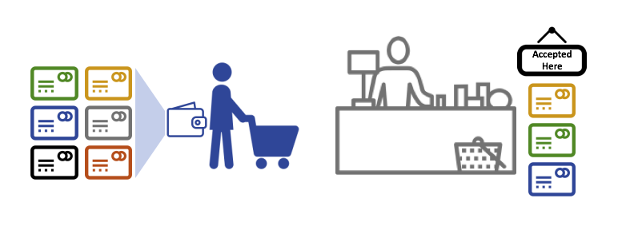
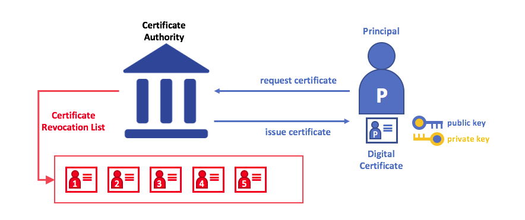
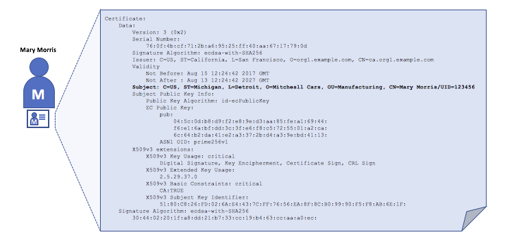
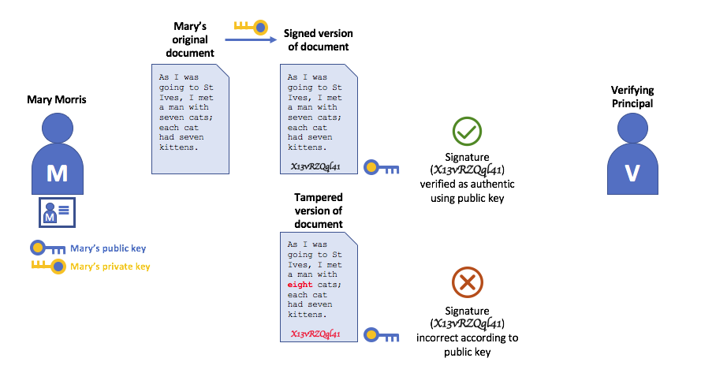
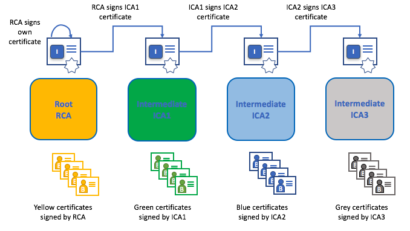
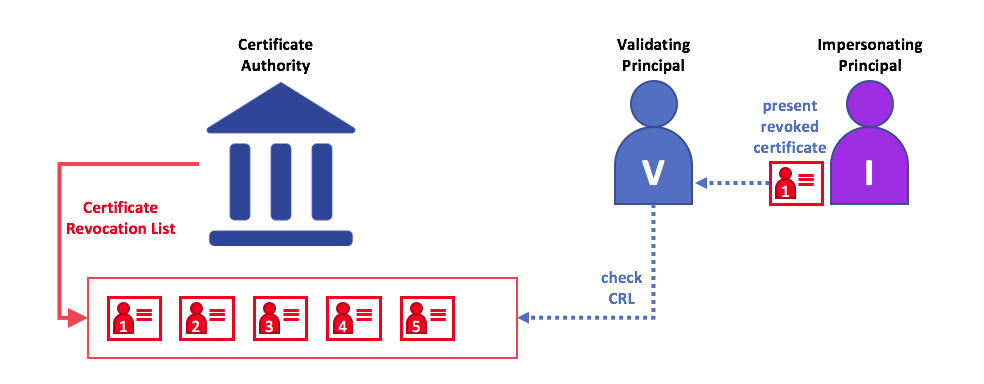

# Identity

## What is an Identity?

The different actors in a blockchain network include peers, orderers, client
applications, administrators and more. Each of these actors --- active elements
inside or outside a network able to consume services --- has a digital identity
encapsulated in an X.509 digital certificate. These identities really matter
because they **determine the exact permissions over resources and access to
information that actors have in a blockchain network.**

A digital identity furthermore has some additional attributes that Fabric uses
to determine permissions, and it gives the union of an identity and the associated
attributes a special name --- **principal**. Principals are just like userIDs or
groupIDs, but a little more flexible because they can include a wide range of
properties of an actor's identity, such as the actor's organization, organizational
unit, role or even the actor's specific identity. When we talk about principals,
they are the properties which determine their permissions.

For an identity to be **verifiable**, it must come from a **trusted** authority.
A [membership service provider](../membership/membership.html)
(MSP) is how this is achieved in Fabric. More specifically, an MSP is a component
that defines the rules that govern the valid identities for this organization.
The default MSP implementation in Fabric uses X.509 certificates as identities,
adopting a traditional Public Key Infrastructure (PKI) hierarchical model (more
on PKI later).

## A Simple Scenario to Explain the Use of an Identity

Imagine that you visit a supermarket to buy some groceries. At the checkout you see
a sign that says that only Visa, Mastercard and AMEX cards are accepted. If you try to
pay with a different card --- let's call it an "ImagineCard" --- it doesn't matter whether
the card is authentic and you have sufficient funds in your account. It will be not be
accepted.

*Having a valid credit card is not enough --- it must also be accepted by the store! PKIs
and MSPs work together in the same way --- a PKI provides a list of identities,
and an MSP says which of these are members of a given organization that participates in
the network.*

PKI certificate authorities and MSPs provide a similar combination of functionalities.
A PKI is like a card provider --- it dispenses many different types of verifiable
identities. An MSP, on the other hand, is like the list of card providers accepted
by the store, determining which identities are the trusted members (actors)
of the store payment network. **MSPs turn verifiable identities into the members
of a blockchain network**.

Let's drill into these concepts in a little more detail.

## What are PKIs?

**A public key infrastructure (PKI) is a collection of internet technologies that provides
secure communications in a network.** It's PKI that puts the **S** in **HTTPS** --- and if
you're reading this documentation on a web browser, you're probably using a PKI to make
sure it comes from a verified source.

*The elements of Public Key Infrastructure (PKI). A PKI is comprised of Certificate
Authorities who issue digital certificates to parties (e.g., users of a service, service
provider), who then use them to authenticate themselves in the messages they exchange
with their environment. A CA's Certificate Revocation List (CRL) constitutes a reference
for the certificates that are no longer valid. Revocation of a certificate can happen for
a number of reasons. For example, a certificate may be revoked because the cryptographic
private material associated to the certificate has been exposed.*

Although a blockchain network is more than a communications network, it relies on the
PKI standard to ensure secure communication between various network participants, and to
ensure that messages posted on the blockchain are properly authenticated.
It's therefore important to understand the basics of PKI and then why MSPs are
so important.

There are four key elements to PKI:

 * **Digital Certificates**
 * **Public and Private Keys**
 * **Certificate Authorities**
 * **Certificate Revocation Lists**

Let's quickly describe these PKI basics, and if you want to know more details,
[Wikipedia](https://en.wikipedia.org/wiki/Public_key_infrastructure) is a good
place to start.

## Digital Certificates

A digital certificate is a document which holds a set of attributes relating to
the holder of the certificate. The most common type of certificate is the one
compliant with the [X.509 standard](https://en.wikipedia.org/wiki/X.509), which
allows the encoding of a party's identifying details in its structure.

For example, Mary Morris in the Manufacturing Division of Mitchell Cars in Detroit,
Michigan might have a digital certificate with a `SUBJECT` attribute of `C=US`,
`ST=Michigan`, `L=Detroit`, `O=Mitchell Cars`, `OU=Manufacturing`, `CN=Mary Morris /UID=123456`.
Mary's certificate is similar to her government identity card --- it provides
information about Mary which she can use to prove key facts about her. There are
many other attributes in an X.509 certificate, but let's concentrate on just these
for now.

*A digital certificate describing a party called Mary Morris. Mary is the `SUBJECT` of the
certificate, and the highlighted `SUBJECT` text shows key facts about Mary. The
certificate also holds many more pieces of information, as you can see. Most importantly,
Mary's public key is distributed within her certificate, whereas her private signing key
is not. This signing key must be kept private.*

What is important is that all of Mary's attributes can be recorded using a mathematical
technique called cryptography (literally, "*secret writing*") so that tampering will
invalidate the certificate. Cryptography allows Mary to present her certificate to others
to prove her identity so long as the other party trusts the certificate issuer, known
as a **Certificate Authority** (CA). As long as the CA keeps certain cryptographic
information securely (meaning, its own **private signing key**), anyone reading the
certificate can be sure that the information about Mary has not been tampered with ---
it will always have those particular attributes for Mary Morris. Think of Mary's X.509
certificate as a digital identity card that is impossible to change.

## Authentication, Public keys, and Private Keys

Authentication and message integrity are important concepts in secure
communications. Authentication requires that parties who exchange messages
are assured of the identity that created a specific message. For a message to have
"integrity" means that cannot have been modified during its transmission.
For example, you might want to be sure you're communicating with the real Mary
Morris rather than an impersonator. Or if Mary has sent you a message, you might want
to be sure that it hasn't been tampered with by anyone else during transmission.

Traditional authentication mechanisms rely on **digital signatures** that,
as the name suggests, allow a party to digitally **sign** its messages. Digital
signatures also provide guarantees on the integrity of the signed message.

Technically speaking, digital signature mechanisms require each party to
hold two cryptographically connected keys: a public key that is made widely available
and acts as authentication anchor, and a private key that is used to produce
**digital signatures** on messages. Recipients of digitally signed messages can verify
the origin and integrity of a received message by checking that the
attached signature is valid under the public key of the expected sender.

**The unique relationship between a private key and the respective public key is the
cryptographic magic that makes secure communications possible**. The unique
mathematical relationship between the keys is such that the private key can be used to
produce a signature on a message that only the corresponding public key can match, and
only on the same message.

In the example above, Mary uses her private key to sign the message. The signature
can be verified by anyone who sees the signed message using her public key.

## Certificate Authorities

As you've seen, an actor or a node is able to participate in the blockchain network,
via the means of a **digital identity** issued for it by an authority trusted by the
system. In the most common case, digital identities (or simply **identities**) have
the form of cryptographically validated digital certificates that comply with X.509
standard and are issued by a Certificate Authority (CA).

CAs are a common part of internet security protocols, and you've probably heard of
some of the more popular ones: Symantec (originally Verisign), GeoTrust, DigiCert,
GoDaddy, and Comodo, among others.

*A Certificate Authority dispenses certificates to different actors. These certificates
are digitally signed by the CA and bind together the actor with the actor's public key
(and optionally with a comprehensive list of properties). As a result, if one trusts
the CA (and knows its public key), it can trust that the specific actor is bound
to the public key included in the certificate, and owns the included attributes,
by validating the CA's signature on the actor's certificate.*

Certificates can be widely disseminated, as they do not include either the
actors' nor the CA's private keys. As such they can be used as anchor of
trusts for authenticating messages coming from different actors.

CAs also have a certificate, which they make widely available. This allows the
consumers of identities issued by a given CA to verify them by checking that the
certificate could only have been generated by the holder of the corresponding
private key (the CA).

In a blockchain setting, every actor who wishes to interact with the network
needs an identity. In this setting, you might say that **one or more CAs** can be used
to **define the members of an organization's from a digital perspective**. It's
the CA that provides the basis for an organization's actors to have a verifiable
digital identity.

### Root CAs, Intermediate CAs and Chains of Trust

CAs come in two flavors: **Root CAs** and **Intermediate CAs**. Because Root CAs
(Symantec, Geotrust, etc) have to **securely distribute** hundreds of millions
of certificates to internet users, it makes sense to spread this process out
across what are called *Intermediate CAs*. These Intermediate CAs have their
certificates issued by the root CA or another intermediate authority, allowing
the establishment of a "chain of trust" for any certificate that is issued by
any CA in the chain. This ability to track back to the Root CA not only allows
the function of CAs to scale while still providing security --- allowing
organizations that consume certificates to use Intermediate CAs with confidence
--- it limits the exposure of the Root CA, which, if compromised, would endanger
the entire chain of trust. If an Intermediate CA is compromised, on the other
hand, there will be a much smaller exposure.

*A chain of trust is established between a Root CA and a set of Intermediate CAs
as long as the issuing CA for the certificate of each of these Intermediate CAs is
either the Root CA itself or has a chain of trust to the Root CA.*

Intermediate CAs provide a huge amount of flexibility when it comes to the issuance
of certificates across multiple organizations, and that's very helpful in a
permissioned blockchain system (like Fabric). For example, you'll see that
different organizations may use different Root CAs, or the same Root CA with
different Intermediate CAs --- it really does depend on the needs of the network.

### Fabric CA

It's because CAs are so important that Fabric provides a built-in CA component to
allow you to create CAs in the blockchain networks you form. This component --- known
as **Fabric CA** is a private root CA provider capable of managing digital identities of
Fabric participants that have the form of X.509 certificates.
Because Fabric CA is a custom CA targeting the Root CA needs of Fabric,
it is inherently not capable of providing SSL certificates for general/automatic use
in browsers. However, because **some** CA must be used to manage identity
(even in a test environment), Fabric CA can be used to provide and manage
certificates. It is also possible --- and fully appropriate --- to use a
public/commerical root or intermediate CA to provide identification.

If you're interested, you can read a lot more about Fabric CA
[in the CA documentation section](http://hyperledger-fabric-ca.readthedocs.io/).

## Certificate Revocation Lists

A Certificate Revocation List (CRL) is easy to understand --- it's just a list of
references to certificates that a CA knows to be revoked for one reason or another.
If you recall the store scenario, a CRL would be like a list of stolen credit cards.

When a third party wants to verify another party's identity, it first checks the
issuing CA's CRL to make sure that the certificate has not been revoked. A
verifier doesn't have to check the CRL, but if they don't they run the risk of
accepting a compromised identity.

*Using a CRL to check that a certificate is still valid. If an impersonator tries to
pass a compromised digital certificate to a validating party, it can be first
checked against the issuing CA's CRL to make sure it's not listed as no longer valid.*

Note that a certificate being revoked is very different from a certificate expiring.
Revoked certificates have not expired --- they are, by every other measure, a fully
valid certificate. For more in-depth information about CRLs, click [here](https://hyperledger-fabric-ca.readthedocs.io/en/latest/users-guide.html#generating-a-crl-certificate-revocation-list).

Now that you've seen how a PKI can provide verifiable identities through a chain of
trust, the next step is to see how these identities can be used to represent the
trusted members of a blockchain network. That's where a Membership Service Provider
(MSP) comes into play --- **it identifies the parties who are the members of a
given organization in the blockchain network**.

To learn more about membership, check out the conceptual documentation on [MSPs](../membership/membership.html).

<!---
Licensed under Creative Commons Attribution 4.0 International License https://creativecommons.org/licenses/by/4.0/
-->
