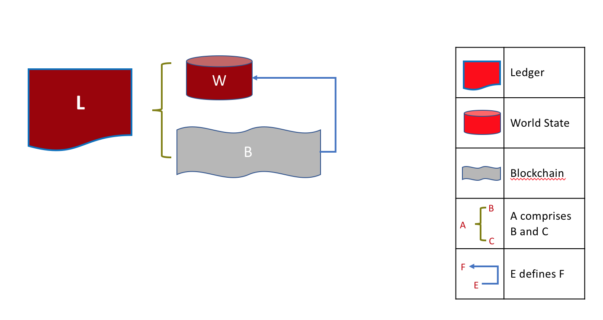
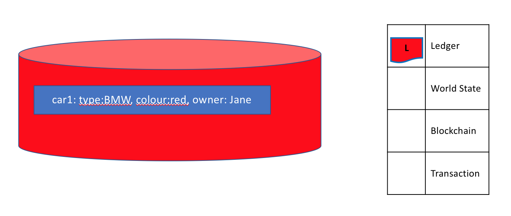
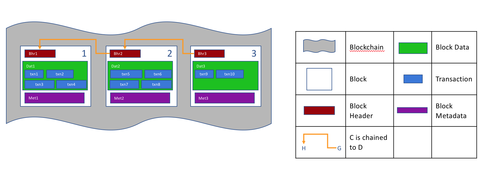
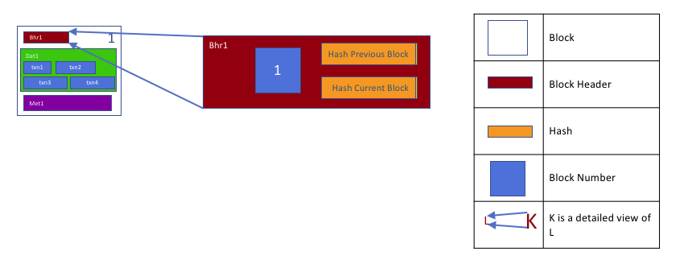
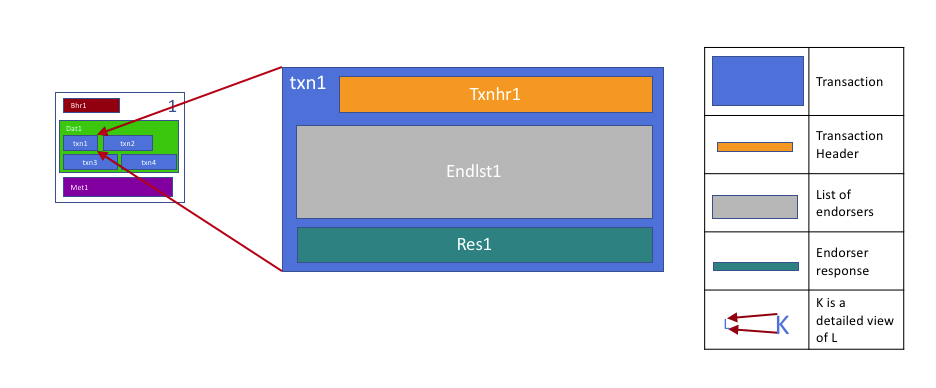
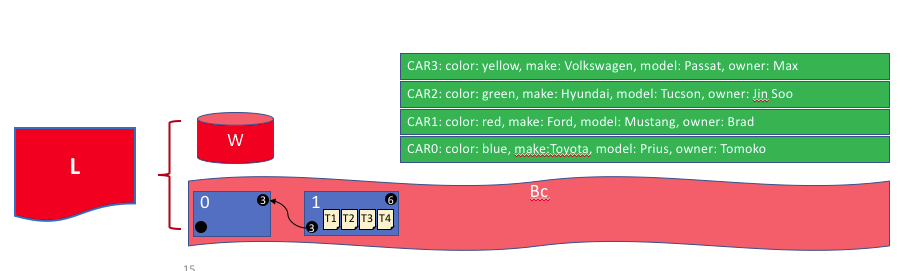

# Ledger

**Audience**: Architects, Application and smart contract developers,
administrators

A **ledger** is a key concept in Hyperledger Fabric; it stores important factual
information about business objects; both the current value of the attributes of
the objects, and the history of transactions that resulted in these current
values.

In this topic, we're going to cover:

* [What is a Ledger?](#what-is-a-ledger)
* [Storing facts about business objects](#ledgers-facts-and-states)
* [A blockchain ledger](#the-ledger)
* [The world state](#world-state)
* [The blockchain data structure](#blockchain)
* [How blocks are stored in a blockchain](#blocks)
* [Transactions](#transactions)
* [World state database options](#world-state-database-options)
* [The **Fabcar** example ledger](#example-ledger-fabcar)
* [Ledgers and namespaces](#namespaces)
* [Ledgers and channels](#channels)

## What is a Ledger?

A ledger contains the current state of a business as a journal of transactions.
The earliest European and Chinese ledgers date from almost 1000 years ago, and
the Sumerians had [stone
ledgers](http://www.sciencephoto.com/media/686227/view/accounting-ledger-sumerian-cuneiform)
4000 years ago -- but let's start with a more up-to-date example!

You're probably used to looking at your bank account. What's most important to
you is the available balance -- it's what you're able to spend at the current
moment in time. If you want to see how your balance was derived, then you can
look through the transaction credits and debits that determined it. This is a
real life example of a ledger -- a state (your bank balance), and a set of
ordered transactions (credits and debits) that determine it. Hyperledger Fabric
is motivated by these same two concerns -- to present the current value of a set
of ledger states, and to capture the history of the transactions that determined
these states.

## Ledgers, Facts, and States

A ledger doesn't literally store business objects -- instead it stores **facts**
about those objects. When we say "we store a business object in a ledger" what
we really mean is that we're recording the facts about the current state of an
object, and the facts about the history of transactions that led to the current
state. In an increasingly digital world, it can feel like we're looking at an
object, rather than facts about an object. In the case of a digital object, it's
likely that it lives in an external datastore; the facts we store in the ledger
allow us to identify its location along with other key information about it.

While the facts about the current state of a business object may change, the
history of facts about it is **immutable**, it can be added to, but it cannot be
retrospectively changed. We're going to see how thinking of a blockchain as an
immutable history of facts about business objects is a simple yet powerful way
to understand it.

Let's now take a closer look at the Hyperledger Fabric ledger structure!

## The Ledger

In Hyperledger Fabric, a ledger consists of two distinct, though related, parts
-- a world state and a blockchain. Each of these represents a set of facts about
a set of business objects.

Firstly, there's a **world state** -- a database that holds **current values**
of a set of ledger states. The world state makes it easy for a program to directly
access the current value of a state rather than having to calculate it by traversing
the entire transaction log. Ledger states are, by default, expressed as **key-value** pairs,
and we'll see later how Hyperledger Fabric provides flexibility in this regard.
The world state can change frequently, as states can be created, updated and deleted.

Secondly, there's a **blockchain** -- a transaction log that records all the
changes that have resulted in the current the world state. Transactions are
collected inside blocks that are appended to the blockchain -- enabling you to
understand the history of changes that have resulted in the current world state.
The blockchain data structure is very different to the world state because once
written, it cannot be modified; it is **immutable**.

 *A Ledger L comprises blockchain B and
world state W, where blockchain B determines world state W. We can also say that
world state W is derived from blockchain B.*

It's helpful to think of there being one **logical** ledger in a Hyperledger
Fabric network. In reality, the network maintains multiple copies of a ledger --
which are kept consistent with every other copy through a process called
**consensus**. The term **Distributed Ledger Technology** (**DLT**) is often
associated with this kind of ledger -- one that is logically singular, but has
many consistent copies distributed throughout a network.

Let's now examine the world state and blockchain data structures in more detail.

## World State

The world state holds the current value of the attributes of a business object
as a unique ledger state. That's useful because programs usually require the
current value of an object; it would be cumbersome to traverse the entire
blockchain to calculate an object's current value -- you just get it directly
from the world state.

 *A ledger world state containing
two states. The first state is: key=CAR1 and value=Audi. The second state has a
more complex value: key=CAR2 and value={model:BMW, color=red, owner=Jane}. Both
states are at version 0.*

A ledger state records a set of facts about a particular business object. Our
example shows ledger states for two cars, CAR1 and CAR2, each having a key and a
value. An application program can invoke a smart contract which uses simple
ledger APIs to **get**, **put** and **delete** states. Notice how a state value
can be simple (Audi...) or compound (type:BMW...). The world state is often
queried to retrieve objects with certain attributes, for example to find all red
BMWs.

The world state is implemented as a database. This makes a lot of sense because
a database provides a rich set of operators for the efficient storage and
retrieval of states.  We'll see later that Hyperledger Fabric can be configured
to use different world state databases to address the needs of different types
of state values and the access patterns required by applications, for example in
complex queries.

Applications submit transactions which capture changes to the world state, and
these transactions end up being committed to the ledger blockchain. Applications
are insulated from the details of this [consensus](../txflow.html) mechanism by
the Hyperledger Fabric SDK; they merely invoke a smart contract, and are
notified when the transaction has been included in the blockchain (whether valid
or invalid). The key design point is that only transactions that are **signed**
by the required set of **endorsing organizations** will result in an update to
the world state. If a transaction is not signed by sufficient endorsers, it will
not result in a change of world state. You can read more about how applications
use [smart contracts](../smartcontract/smartcontract.html), and how to [develop
applications](../developapps/developing_applications.html).

You'll also notice that a state has a version number, and in the diagram above,
states CAR1 and CAR2 are at their starting versions, 0. The version number is for
internal use by Hyperledger Fabric, and is incremented every time the state
changes. The version is checked whenever the state is updated to make sure the
current states matches the version at the time of endorsement. This ensures that
the world state is changing as expected; that there has not been a concurrent
update.

Finally, when a ledger is first created, the world state is empty. Because any
transaction which represents a valid change to world state is recorded on the
blockchain, it means that the world state can be re-generated from the
blockchain at any time. This can be very convenient -- for example, the world
state is automatically generated when a peer is created. Moreover, if a peer
fails abnormally, the world state can be regenerated on peer restart, before
transactions are accepted.

## Blockchain

Let's now turn our attention from the world state to the blockchain. Whereas the
world state contains a set of facts relating to the current state of a set of
business objects, the blockchain is an historical record of the facts about how
these objects arrived at their current states. The blockchain has recorded every
previous version of each ledger state and how it has been changed.

The blockchain is structured as sequential log of interlinked blocks, where each
block contains a sequence of transactions, each transaction representing a query
or update to the world state. The exact mechanism by which transactions are
ordered is discussed [elsewhere](../peers/peers.html#peers-and-orderers);
what's important is that block sequencing, as well as transaction sequencing
within blocks, is established when blocks are first created by a Hyperledger
Fabric component called the **ordering service**.

Each block's header includes a hash of the block's transactions, as well a hash
of the prior block's header. In this way, all transactions on the ledger are sequenced
and cryptographically linked together. This hashing and linking makes the ledger data
very secure. Even if one node hosting the ledger was tampered with, it would not be able to
convince all the other nodes that it has the 'correct' blockchain because the ledger is
distributed throughout a network of independent nodes.

The blockchain is always implemented as a file, in contrast to the world state,
which uses a database. This is a sensible design choice as the blockchain data
structure is heavily biased towards a very small set of simple operations.
Appending to the end of the blockchain is the primary operation, and query is
currently a relatively infrequent operation.

Let's have a look at the structure of a blockchain in a little more detail.

 *A blockchain B containing blocks
B0, B1, B2, B3. B0 is the first block in the blockchain, the genesis block.*

In the above diagram, we can see that **block** B2 has a **block data** D2 which
contains all its transactions: T5, T6, T7.

Most importantly, B2 has a **block header** H2, which contains a cryptographic
**hash** of all the transactions in D2 as well as a hash of H1. In this way,
blocks are inextricably and immutably linked to each other, which the term **blockchain**
so neatly captures!

Finally, as you can see in the diagram, the first block in the blockchain is
called the **genesis block**.  It's the starting point for the ledger, though it
does not contain any user transactions. Instead, it contains a configuration
transaction containing the initial state of the network channel (not shown). We
discuss the genesis block in more detail when we discuss the blockchain network
and [channels](../channels.html) in the documentation.

## Blocks

Let's have a closer look at the structure of a block. It consists of three
sections

* **Block Header**

  This section comprises three fields, written when a block is created.

  * **Block number**: An integer starting at 0 (the genesis block), and
  increased by 1 for every new block appended to the blockchain.

  * **Current Block Hash**: The hash of all the transactions contained in the
  current block.

  * **Previous Block Header Hash**: The hash from the previous block header.

  These fields are internally derived by cryptographically hashing the block
  data. They ensure that each and every block is inextricably linked to its
  neighbour, leading to an immutable ledger.

   *Block header details. The header H2
  of block B2 consists of block number 2, the hash CH2 of the current block data
  D2, and the hash of the prior block header H1.*

* **Block Data**

  This section contains a list of transactions arranged in order. It is written
  when the block is created by the ordering service. These transactions have a
  rich but straightforward structure, which we describe [later](#Transactions)
  in this topic.

* **Block Metadata**

  This section contains the certificate and signature of the block creator which is used to verify
  the block by network nodes.
  Subsequently, the block committer adds a valid/invalid indicator for every transaction into
  a bitmap that also resides in the block metadata, as well as a hash of the cumulative state updates
  up until and including that block, in order to detect a state fork.
  Unlike the block data  and header fields, this section is not an input to the block hash computation.

## Transactions

As we've seen, a transaction captures changes to the world state. Let's have a
look at the detailed **blockdata** structure which contains the transactions in
a block.

 *Transaction details. Transaction
T4 in blockdata D1 of block B1 consists of transaction header, H4, a transaction
signature, S4, a transaction proposal P4, a transaction response, R4, and a list
of endorsements, E4.*

In the above example, we can see the following fields:

* **Header**

  This section, illustrated by H4, captures some essential metadata about the
  transaction -- for example, the name of the relevant chaincode, and its
  version.

* **Signature**

  This section, illustrated by S4, contains a cryptographic signature, created
  by the client application. This field is used to check that the transaction
  details have not been tampered with, as it requires the application's private
  key to generate it.

* **Proposal**

  This field, illustrated by P4, encodes the input parameters supplied by an
  application to the smart contract which creates the proposed ledger update.
  When the smart contract runs, this proposal provides a set of input
  parameters, which, in combination with the current world state, determines the
  new world state.

* **Response**

  This section, illustrated by R4, captures the before and after values of the
  world state, as a **Read Write set** (RW-set). It's the output of a smart
  contract, and if the transaction is successfully validated, it will be applied
  to the ledger to update the world state.

* **Endorsements**

  As shown in E4, this is a list of signed transaction responses from each
  required organization sufficient to satisfy the endorsement policy. You'll
  notice that, whereas only one transaction response is included in the
  transaction, there are multiple endorsements. That's because each endorsement
  effectively encodes its organization's particular transaction response --
  meaning that there's no need to include any transaction response that doesn't
  match sufficient endorsements as it will be rejected as invalid, and not
  update the world state.

That concludes the major fields of the transaction -- there are others, but
these are the essential ones that you need to understand to have a solid
understanding of the ledger data structure.

## World State database options

The world state is physically implemented as a database, to provide simple and
efficient storage and retrieval of ledger states. As we've seen, ledger states
can have simple or compound values, and to accommodate this, the world state
database implementation can vary, allowing these values to be efficiently
implemented. Options for the world state database currently include LevelDB and
CouchDB.

LevelDB is the default and is particularly appropriate when ledger states are
simple key-value pairs. A LevelDB database is co-located with the peer
node -- it is embedded within the same operating system process.

CouchDB is a particularly appropriate choice when ledger states are structured
as JSON documents because CouchDB supports the rich queries and update of richer
data types often found in business transactions. Implementation-wise, CouchDB
runs in a separate operating system process, but there is still a 1:1 relation
between a peer node and a CouchDB instance. All of this is invisible to a smart
contract. See [CouchDB as the StateDatabase](../couchdb_as_state_database.html)
for more information on CouchDB.

In LevelDB and CouchDB, we see an important aspect of Hyperledger Fabric -- it
is *pluggable*. The world state database could be a relational data store, or a
graph store, or a temporal database.  This provides great flexibility in the
types of ledger states that can be efficiently accessed, allowing Hyperledger
Fabric to address many different types of problems.

## Example Ledger: fabcar

As we end this topic on the ledger, let's have a look at a sample ledger. If
you've run the [fabcar sample application](../write_first_app.html), then you've
created this ledger.

The fabcar sample app creates a set of 10 cars each with a unique identity; a
different color, make, model and owner. Here's what the ledger looks like after
the first four cars have been created.

 *The ledger, L, comprises a world
state, W and a blockchain, B. W contains four states with keys: CAR0, CAR1, CAR2
and CAR3. B contains two blocks, 0 and 1. Block 1 contains four transactions:
T1, T2, T3, T4.*

We can see that the world state contains states that correspond to CAR0, CAR1,
CAR2 and CAR3. CAR0 has a value which indicates that it is a blue Toyota Prius,
currently owned by Tomoko, and we can see similar states and values for the
other cars. Moreover, we can see that all car states are at version number 0,
indicating that this is their starting version number -- they have not been
updated since they were created.

We can also see that the blockchain contains two blocks.  Block 0 is the genesis
block, though it does not contain any transactions that relate to cars. Block 1
however, contains transactions T1, T2, T3, T4 and these correspond to
transactions that created the initial states for CAR0 to CAR3 in the world
state. We can see that block 1 is linked to block 0.

We have not shown the other fields in the blocks or transactions, specifically
headers and hashes.  If you're interested in the precise details of these, you
will find a dedicated reference topic elsewhere in the documentation. It gives
you a fully worked example of an entire block with its transactions in glorious
detail -- but for now, you have achieved a solid conceptual understanding of a
Hyperledger Fabric ledger. Well done!

## Namespaces

Even though we have presented the ledger as though it were a single world state
and single blockchain, that's a little bit of an over-simplification. In
reality, each chaincode has its own world state that is separate from all other
chaincodes. World states are in a namespace so that only smart contracts within
the same chaincode can access a given namespace.

A blockchain is not namespaced. It contains transactions from many different
smart contract namespaces. You can read more about chaincode namespaces in this
[topic](../developapps/chaincodenamespace.html).

Let's now look at how the concept of a namespace is applied within a Hyperledger
Fabric channel.

## Channels

In Hyperledger Fabric, each [channel](../channels.html) has a completely
separate ledger. This means a completely separate blockchain, and completely
separate world states, including namespaces. It is possible for applications and
smart contracts to communicate between channels so that ledger information can
be accessed between them.

You can read more about how ledgers work with channels in this
[topic](../developapps/chaincodenamespace.html#channels).

## More information

See the [Transaction Flow](../txflow.html),
[Read-Write set semantics](../readwrite.html) and
[CouchDB as the StateDatabase](../couchdb_as_state_database.html) topics for a
deeper dive on transaction flow, concurrency control, and the world state
database.

<!--- Licensed under Creative Commons Attribution 4.0 International License
https://creativecommons.org/licenses/by/4.0/ -->
