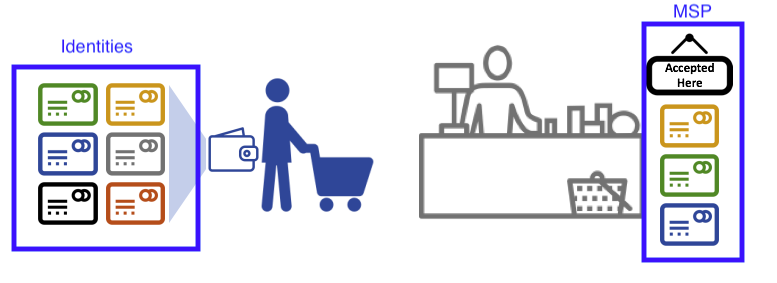
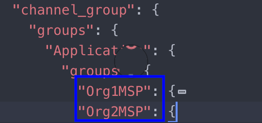
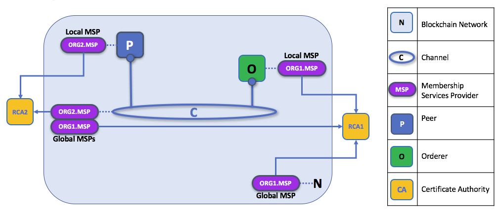
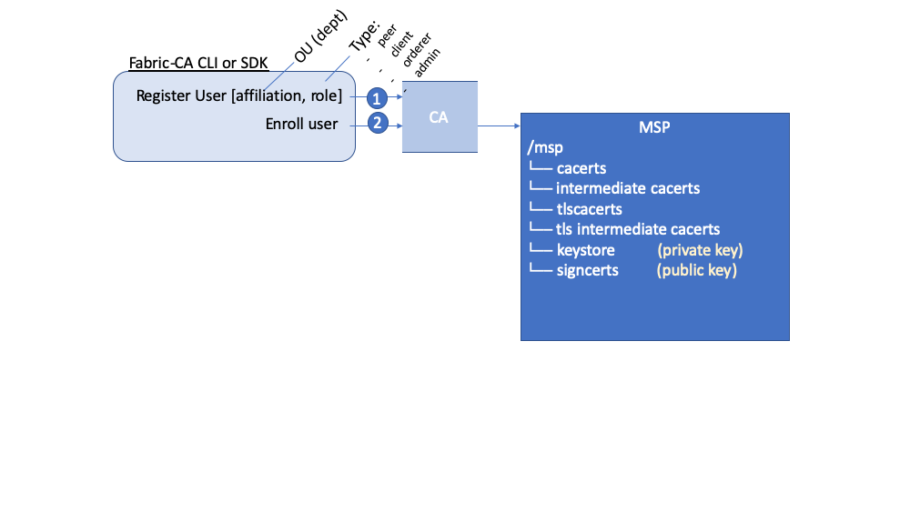
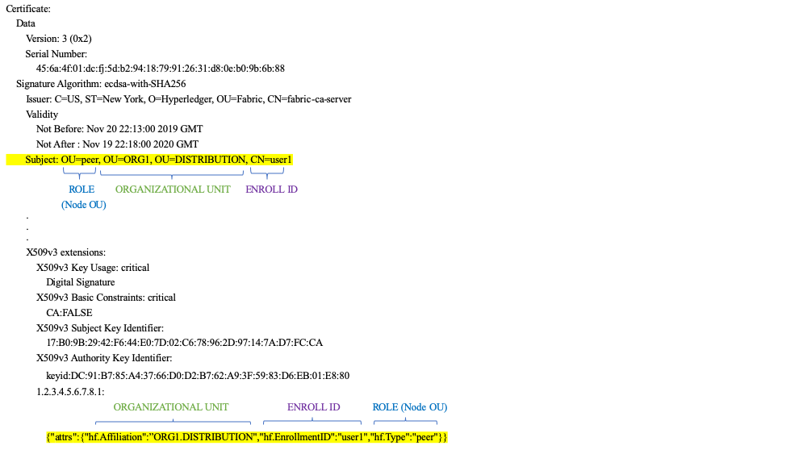
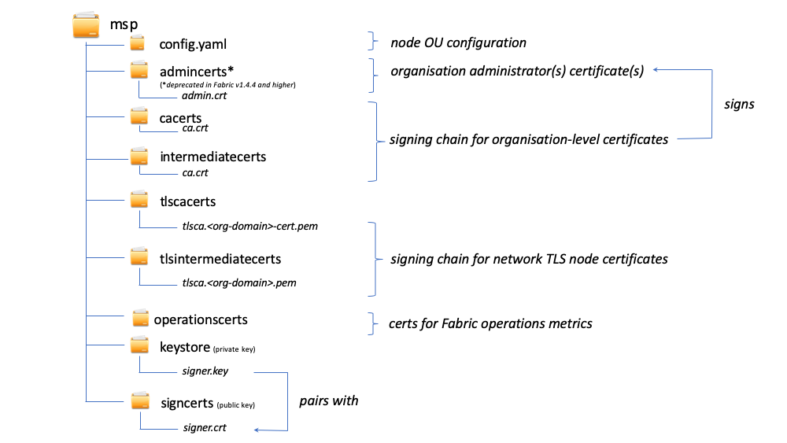

# Membership Service Provider (MSP)

## Why do I need an MSP?

Because Fabric is a permissioned network, blockchain participants need a way to prove their identity to the rest of the network in order to transact on the network. If you've read through the documentation on [Identity](../identity/identity.html)
you've seen how a Public Key Infrastructure (PKI) can provide verifiable identities through a chain of trust. How is that chain of trust used by the blockchain network?

Certificate Authorities issue identities by generating a public and private key which forms a key-pair that can be used to prove identity. Because a private key can never be shared publicly, a mechanism is required to enable that proof which is where the MSP comes in. For example, a peer uses its private key to digitally sign, or endorse, a transaction.  The MSP on the ordering service contains the peer's public key which is then used to verify that the signature attached to the transaction is valid. The private key is used to produce a signature on a transaction that only the corresponding public key, that is part of an MSP, can match. Thus, the MSP is the mechanism that allows that identity to be trusted and recognized by the rest of the network without ever revealing the member’s private key.

Recall from the credit card scenario in the Identity topic that the Certificate Authority is like a card provider — it dispenses many different types of verifiable identities. An MSP, on the other hand, determines which credit card providers are accepted at the store. In this way, the MSP turns an identity (the credit card) into a role (the ability to buy things at the store).

This ability to turn verifiable identities into roles is fundamental to the way Fabric networks function, since it allows organizations, nodes, and channels the ability establish MSPs that determine who is allowed to do what at the organization, node, and channel level.



*Identities are similar to your credit cards that are used to prove you can pay. The MSP is similar to the list of accepted credit cards.*

Consider a consortium of banks that operate a blockchain network. Each bank operates peer and ordering nodes, and the peers endorse transactions submitted to the network. However, each bank would also have departments and account holders. The account holders would belong to each organization, but would not run nodes on the network. They would only interact with the system from their mobile or web application. So how does the network recognize and differentiate these identities? A CA was used to create the identities, but like the card example, those identities can't just be issued, they need to be recognized by the network. MSPs are used to define the organizations that are trusted by the network members. MSPs are also the mechanism that provide members with a set of roles and permissions within the network. Because the MSPs defining these organizations are known to the members of a network, they can then be used to validate that network entities that attempt to perform actions are allowed to.

Finally, consider if you want to join an _existing_ network, you need a way to turn your identity into something that is recognized by the network. The MSP is the mechanism that enables you to participate on a permissioned blockchain network. To transact on a Fabric network a member needs to:

1. Have an identity issued by a CA that is trusted by the network.
2. Become a member of an _organization_ that is recognized and approved by the network members. The MSP is how the identity is linked to the membership of an organization. Membership is achieved by adding the member's public key (also known as certificate, signing cert, or signcert) to the organization’s MSP.
3. Add the MSP to either a [consortium](../glossary.html#consortium) on the network or a channel.
4. Ensure the MSP is included in the [policy](../policies/policies.html) definitions on the network.

## What is an MSP?

Despite its name, the Membership Service Provider does not actually provide anything. Rather, the implementation of the MSP requirement is a set of folders that are added to the configuration of the network and is used to define an organization both inwardly (organizations decide who its admins are) and outwardly (by allowing other organizations to validate that entities have the authority to do what they are attempting to do).  Whereas Certificate Authorities generate the certificates that represent identities, the MSP contains a list of permissioned identities.

The MSP identifies which Root CAs and Intermediate CAs are accepted to define the members of a trust domain by listing the identities of their members, or by identifying which CAs are authorized to issue valid identities for their members.

But the power of an MSP goes beyond simply listing who is a network participant or member of a channel. It is the MSP that turns an identity into a **role** by identifying specific privileges an actor has on a node or channel. Note that when a user is registered with a Fabric CA, a role of admin, peer, client, orderer, or member must be associated with the user. For example, identities registered with the "peer" role should, naturally, be given to a peer. Similarly, identities registered with the "admin" role should be given to organization admins. We'll delve more into the significance of these roles later in the topic.

In addition, an MSP can allow for the identification of a list of identities that have been revoked --- as discussed in the [Identity](../identity/identity.html) documentation --- but we will talk about how that process also extends to an MSP.

## MSP domains

MSPs occur in two domains in a blockchain network:

* Locally on an actor's node (**local MSP**)
* In channel configuration (**channel MSP**)

The key difference between local and channel MSPs is not how they function -- both turn identities into roles -- but their **scope**. Each MSP lists roles and permissions at a particular level of administration.

### Local MSPs

**Local MSPs are defined for clients and for nodes (peers and orderers)**.
Local MSPs define the permissions for a node (who are the peer admins who can operate the node, for example). The local MSPs of clients (the account holders in the banking scenario above), allow the user to authenticate itself in its transactions as a member of a channel (e.g. in chaincode transactions), or as the owner of a specific role into the system such as an organization admin, for example, in configuration transactions.

**Every node must have a local MSP defined**, as it defines who has administrative or participatory rights at that level (peer admins will not necessarily be channel admins, and vice versa).  This allows for authenticating member messages outside the context of a channel and to define the permissions over a particular node (who has the ability to install chaincode on a peer, for example). Note that one or more nodes can be owned by an organization. An MSP defines the organization admins. And the organization, the admin of the organization, the admin of the node, and the node itself should all have the same root of trust.

An orderer local MSP is also defined on the file system of the node and only applies to that node. Like peer nodes, orderers are also owned by a single organization and therefore have a single MSP to list the actors or nodes it trusts.

### Channel MSPs

In contrast, **channel MSPs define administrative and participatory rights at the channel level**. Peers and ordering nodes on an application channel share the same view of channel MSPs, and will therefore be able to correctly authenticate the channel participants. This means that if an organization wishes to join the channel, an MSP incorporating the chain of trust for the organization's members would need to be included in the channel configuration. Otherwise transactions originating from this organization's identities will be rejected. Whereas local MSPs are represented as a folder structure on the file system, channel MSPs are described in a channel configuration.



*Snippet from a channel config.json file that includes two organization MSPs.*

**Channel MSPs identify who has authorities at a channel level**.
The channel MSP defines the _relationship_ between the identities of channel members (which themselves are MSPs) and the enforcement of channel level policies. Channel MSPs contain the MSPs of the organizations of the channel members.

**Every organization participating in a channel must have an MSP defined for it**. In fact, it is recommended that there is a one-to-one mapping between organizations and MSPs. The MSP defines which members are empowered to act on behalf of the organization. This includes configuration of the MSP itself as well as approving administrative tasks that the organization has role, such as adding new members to a channel. If all network members were part of a single organization or MSP, data privacy is sacrificed. Multiple organizations facilitate privacy by segregating ledger data to only channel members. If more granularity is required within an organization, the organization can be further divided into organizational units (OUs) which we describe in more detail later in this topic.

**The system channel MSP includes the MSPs of all the organizations that participate in an ordering service.** An ordering service will likely include ordering nodes from multiple organizations and collectively these organizations run the ordering service, most importantly managing the consortium of organizations and the default policies that are inherited by the application channels.

**Local MSPs are only defined on the file system of the node or user** to which they apply. Therefore, physically and logically there is only one local MSP per
node. However, as channel MSPs are available to all nodes in the channel, they are logically defined once in the channel configuration. However, **a channel MSP is also instantiated on the file system of every node in the channel and kept synchronized via consensus**. So while there is a copy of each channel MSP on the local file system of every node, logically a channel MSP resides on and is maintained by the channel or the network.

The following diagram illustrates how local and channel MSPs coexist on the network:  



*The MSPs for the peer and orderer are local, whereas the MSPs for a channel (including the network configuration channel, also known as the system channel) are global, shared across all participants of that channel. In this figure, the network system channel is administered by ORG1, but another application channel can be managed by ORG1 and ORG2. The peer is a member of and managed by ORG2, whereas ORG1 manages the orderer of the figure. ORG1 trusts identities from RCA1, whereas ORG2 trusts identities from RCA2. It is important to note that these are administration identities, reflecting who can administer these components. So while ORG1 administers the network, ORG2.MSP does exist in the network definition.*

## What role does an organization play in an MSP?

An **organization** is a logical managed group of members. This can be something as big as a multinational corporation or a small as a flower shop. What's most important about organizations (or **orgs**) is that they manage their members under a single MSP. The MSP allows an identity to be linked to an organization. Note that this is different from the organization concept defined in an X.509 certificate, which we mentioned above.

The exclusive relationship between an organization and its MSP makes it sensible to name the MSP after the organization, a convention you'll find adopted in most policy configurations. For example, organization `ORG1` would likely have an MSP called something like `ORG1-MSP`. In some cases an organization may require multiple membership groups --- for example, where channels are used to perform very different business functions between organizations. In these cases it makes sense to have multiple MSPs and name them accordingly, e.g., `ORG2-MSP-NATIONAL` and `ORG2-MSP-GOVERNMENT`, reflecting the different membership roots of trust within `ORG2` in the `NATIONAL` sales channel compared to the `GOVERNMENT` regulatory channel.

### Organizational Units (OUs) and MSPs

An organization can also be divided into multiple **organizational units**, each of which has a certain set of responsibilities, also referred to as `affiliations`. Think of an OU as a department inside an organization. For example, the `ORG1` organization might have both `ORG1.MANUFACTURING` and `ORG1.DISTRIBUTION` OUs to reflect these separate lines of business. When a CA issues X.509 certificates, the `OU` field in the certificate specifies the line of business to which the identity belongs. A benefit of using OUs like this is that these values can then be used in policy definitions in order to restrict access or in smart contracts for attribute-based access control. Otherwise, separate MSPs would need to be created for each organization.

Specifying OUs is optional. If OUs are not used, all of the identities that are part of an MSP --- as identified by the Root CA and Intermediate CA folders --- will be considered members of the organization.

### Node OU Roles and MSPs

Additionally, there is a special kind of OU, sometimes referred to as a `Node OU`, that can be used to confer a role onto an identity. These Node OU roles are defined in the `$FABRIC_CFG_PATH/msp/config.yaml` file and contain a list of organizational units whose members are considered to be part of the organization represented by this MSP. This is particularly useful when you want to restrict the members of an organization to the ones holding an identity (signed by one of MSP designated CAs) with a specific Node OU role in it. For example, with node OU's you can implement a more granular endorsement policy that requires Org1 peers to endorse a transaction, rather than any member of Org1.

In order to use the Node OU roles, the "identity classification" feature must be enabled for the network. When using the folder-based MSP structure, this is accomplished by enabling "Node OUs" in the config.yaml file which resides in the root of the MSP folder:

```
NodeOUs:
  Enable: true
  ClientOUIdentifier:
    Certificate: cacerts/ca.sampleorg-cert.pem
    OrganizationalUnitIdentifier: client
  PeerOUIdentifier:
    Certificate: cacerts/ca.sampleorg-cert.pem
    OrganizationalUnitIdentifier: peer
  AdminOUIdentifier:
    Certificate: cacerts/ca.sampleorg-cert.pem
    OrganizationalUnitIdentifier: admin
  OrdererOUIdentifier:
    Certificate: cacerts/ca.sampleorg-cert.pem
    OrganizationalUnitIdentifier: orderer
```

In the example above, there are 4 possible Node OU `ROLES` for the MSP:

   * client
   * peer
   * admin
   * orderer

This convention allows you to distinguish MSP roles by the OU present in the CommonName attribute of the X509 certificate. The example above says that any certificate issued by cacerts/ca.sampleorg-cert.pem in which OU=client will identified as a client, OU=peer as a peer, etc. Starting with Fabric v1.4.3, there is also an OU for the orderer and for admins. The new admins role means that you no longer have to explicitly place certs in the admincerts folder of the MSP directory. Rather, the `admin` role present in the user's signcert qualifies the identity as an admin user.

These Role and OU attributes are assigned to an identity when the Fabric CA or SDK is used to `register` a user with the CA. It is the subsequent `enroll` user command that generates the certificates in the users' `/msp` folder.   



The resulting ROLE and OU attributes are visible inside the X.509 signing certificate located in the `/signcerts` folder. The `ROLE` attribute is identified as `hf.Type` and  refers to an actor's role within its organization, (specifying, for example, that an actor is a `peer`). See the following snippet from a signing certificate shows how the Roles and OUs are represented in the certificate.



**Note:** For Channel MSPs, just because an actor has the role of an administrator it doesn't mean that they can administer particular resources. The actual power a given identity has with respect to administering the system is determined by the _policies_ that manage system resources. For example, a channel policy might specify that `ORG1-MANUFACTURING` administrators, meaning identities with a role of `admin` and a Node OU of  `ORG1-MANUFACTURING`, have the rights to add new organizations to the channel, whereas the `ORG1-DISTRIBUTION` administrators have no such rights.

Finally, OUs could be used by different organizations in a consortium to distinguish each other. But in such cases, the different organizations have to use the same Root CAs and Intermediate CAs for their chain of trust, and assign the OU field to identify members of each organization. When every organization has the same CA or chain of trust, this makes the system more centralized than what might be desirable and therefore deserves careful consideration on a blockchain network.

## MSP Structure

Let's explore the MSP elements that render the functionality we've described so far.

A local MSP folder contains the following sub-folders:



*The figure above shows the subfolders in a local MSP on the file system*

* **config.yaml:**  Used to configure the identity classification feature in Fabric by enabling "Node OUs" and defining the accepted roles.

* **cacerts:** This folder contains a list of self-signed X.509 certificates of the Root CAs trusted by the organization represented by this MSP. There must be at least one Root CA certificate in this MSP folder.

  This is the most important folder because it identifies the CAs from which all other certificates must be derived to be considered members of the
  corresponding organization to form the chain of trust.

* **intermediatecerts:** This folder contains a list of X.509 certificates of the Intermediate CAs trusted by this organization. Each certificate must be signed by one of the Root CAs in the MSP or by any Intermediate CA whose issuing CA chain ultimately leads back to a trusted Root CA.

  An intermediate CA may represent a different subdivision of the organization (like `ORG1-MANUFACTURING` and `ORG1-DISTRIBUTION` do for `ORG1`), or the
  organization itself (as may be the case if a commercial CA is leveraged for the organization's identity management). In the latter case intermediate CAs
  can be used to represent organization subdivisions. [Here](../msp.html) you may find more information on best practices for MSP configuration. Notice, that
  it is possible to have a functioning network that does not have an Intermediate CA, in which case this folder would be empty.

  Like the Root CA folder, this folder defines the CAs from which certificates must be issued to be considered members of the organization.

* **admincerts (Deprecated from Fabric v1.4.3 and higher):** This folder contains a list of identities that define the actors who have the role of administrators for this organization. In general, there should be one or more X.509 certificates in this list.

  **Note:** Prior to Fabric v1.4.3, admins were defined by explicitly putting certs in the `admincerts` folder in the local MSP directory of your peer. **With Fabric v1.4.3 or higher, certificates in this folder are no longer required.** Instead, it is recommended that when the user is registered with the CA, that the `admin` role is used to designate the node administrator. Then, the identity is recognized as an `admin` by the Node OU role value in their signcert. As a reminder, in order to leverage the admin role, the "identity classification" feature must be enabled in the config.yaml above by setting "Node OUs" to `Enable: true`. We'll explore this more later.

  And as a reminder, for Channel MSPs, just because an actor has the role of an administrator it doesn't mean that they can administer particular resources. The actual power a given identity has with respect to administering the system is determined by the _policies_ that manage system resources. For example, a channel policy might specify that `ORG1-MANUFACTURING` administrators have the rights to add new organizations to the channel, whereas the `ORG1-DISTRIBUTION` administrators have no such rights.

* **keystore: (private Key)** This folder is defined for the local MSP of a peer or orderer node (or in a client's local MSP), and contains the node's private key. This key is used to sign data --- for example to sign a transaction proposal response, as part of the endorsement phase.

  This folder is mandatory for local MSPs, and must contain exactly one private key. Obviously, access to this folder must be limited only to the identities of users who have administrative responsibility on the peer.

  The **channel MSP** configuration does not include this folder, because channel MSPs solely aim to offer identity validation functionalities and not signing abilities.

  **Note:** If you are using a [Hardware Security Module(HSM)](../hsm.html) for key management, this folder is empty because the private key is generated by and stored in the HSM.

* **signcert:** For a peer or orderer node (or in a client's local MSP) this folder contains the node's **signing key**. This key matches cryptographically the node's identity included in **Node Identity** folder and is used to sign data --- for example to sign a transaction proposal response, as part of the endorsement phase.

  This folder is mandatory for local MSPs, and must contain exactly one public key. Obviously, access to this folder must be limited only to the identities of users who have  administrative responsibility on the peer.

  Configuration of a **channel MSP** does not include this folder, as channel MSPs solely aim to offer identity validation functionalities and not signing abilities.

* **tlscacerts:** This folder contains a list of self-signed X.509 certificates of the Root CAs trusted by this organization **for secure communications between nodes using TLS**. An example of a TLS communication would be when a peer needs to connect to an orderer so that it can receive ledger updates.

  MSP TLS information relates to the nodes inside the network --- the peers and the orderers, in other words, rather than the applications and administrations that consume the network.

  There must be at least one TLS Root CA certificate in this folder. For more information about TLS, see [Securing Communication with Transport Layer Security (TLS)](../enable_tls.html).

* **tlsintermediatecacerts:** This folder contains a list intermediate CA certificates CAs trusted by the organization represented by this MSP **for secure communications between nodes using TLS**. This folder is specifically useful when commercial CAs are used for TLS certificates of an organization. Similar to membership intermediate CAs, specifying intermediate TLS CAs is optional.

* **operationscerts:** This folder contains the certificates required to communicate with the [Fabric Operations Service](../operations_service.html) API.

A channel MSP includes the following additional folder:

* **Revoked Certificates:** If the identity of an actor has been revoked, identifying information about the identity --- not the identity itself --- is held in this folder. For X.509-based identities, these identifiers are pairs of strings known as Subject Key Identifier (SKI) and Authority Access Identifier (AKI), and are checked whenever the certificate is being used to make sure the certificate has not been revoked.

  This list is conceptually the same as a CA's Certificate Revocation List (CRL), but it also relates to revocation of membership from the organization. As a result, the administrator of a channel MSP can quickly revoke an actor or node from an organization by advertising the updated CRL of the CA. This "list of lists" is optional. It will only become populated as certificates are revoked.

If you've read this doc as well as our doc on [Identity](../identity/identity.html), you
should now have a pretty good grasp of how identities and MSPs work in Hyperledger Fabric.
You've seen how a PKI and MSPs are used to identify the actors collaborating in a blockchain
network. You've learned how certificates, public/private keys, and roots of trust work,
in addition to how MSPs are physically and logically structured.

<!---
Licensed under Creative Commons Attribution 4.0 International License https://creativecommons.org/licenses/by/4.0/
-->
