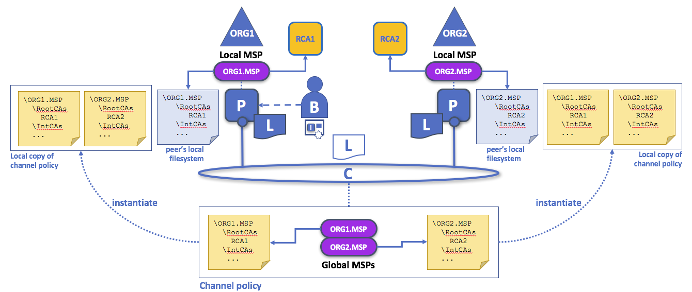
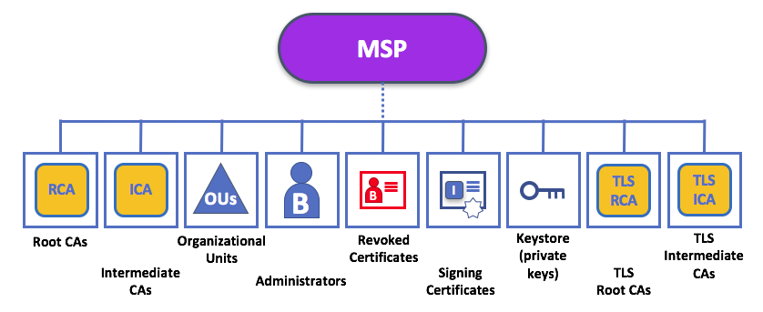

# Membership Service Provider (MSP)

## Why do I need an MSP?

Because Fabric is a permissioned network, blockchain participants need a way to
prove their identity to the rest of the network in order to transact on the
network. If you've read through the documentation on [identity](../identity/identity.html)
you've seen how a PKI can provide verifiable identities through a chain
of trust. Recall in the credit card scenario that the
Certificate Authority is like a card provider — it dispenses many
different types of verifiable identities. An MSP, on the other hand,
is like the list of card providers accepted by the store, determining
which identities are the trusted members (actors) of the store  payment
network.


*Identities are similar to your credit cards that are used to prove
you can pay. The MSP is similar to the list of accepted credit cards.*

Or consider a consortium of banks that each operate peer
nodes that both endorse and validate transactions. They could also optionally
operate ordering nodes. All the Bank A account holders have identities affiliated
with Bank A, and all the Bank B account holders have identities affiliated
with Bank B. But the account holders don't operate nodes, they simply
interact with the system from their mobile or web application.

So how does the network recognize and differentiate the identities?
The MSP is the mechanism that allows that identity to
be trusted and turns it into a role with a set of permissions on the
network. MSP's are also used to define organizations on a network that
are recognized by other organizations. In the credit card scenario, it's
like having a credit card that is recognized by multiple vendors.

Finally, consider if you want to join an _existing_ network,
you need a way to turn your identity into something that is recognized
by the network. The MSP is the entity that enables you to participate on
a permissioned blockchain network. Thus, to participate on a
Fabric network you need to:

- Have an identity issued by a CA (that is trusted by the network).
- Become a member of an _organization_ that is recognized and trusted
by the network. The MSP is how the identity is linked to the
membership of an organization. Membership is achieved by adding your
public key (also known as certificate, signing cert, or signcert) to
the organization’s MSP.

## What is an MSP?

Despite its name, the Membership Service Provider does not actually provide
anything. Rather, the implementation of the MSP requirement is a folder
that contains a list of related identities and is used to store users's
certificates or in the case of an organization or channel, related identities.
Whereas Certificate Authorities generate the certificates that represent
identities, the MSP contains a list of permissioned identities.

The MSP identifies which Root CAs and Intermediate CAs are accepted to define
the members of a trust domain, e.g. a node, organization, or channel", either by listing the
identities of their members, or by identifying which CAs are authorized to
issue valid identities for their members, or --- as will usually be the case ---
through a combination of both.

The power of an MSP goes beyond simply listing who is a network participant or
member of a channel. It is the MSP that turns an identity into a **role** by
identifying specific roles an actor might play within the scope of the
organization the MSP represents (e.g., admins, or as members of a
sub-organization group), and sets the basis for defining **access
privileges** in the context of a network and channel e.g., channel admins,
readers, writers). Also, when a user is registered with a CA, a role of
admin, peer, client, orderer, or member must be associated with the
user.

In addition, an MSP can allow for the identification of a list of identities that
have been revoked --- as discussed in the [Identity](../identity/identity.html)
documentation --- but we will talk about how that process also extends to an MSP.

## What role does an organization play in an MSP?

An **organization** is a logical managed group of members. This can be
something as big as a multinational corporation or a small as a flower
shop. What's most important about organizations (or **orgs**) is that
they manage their members under a single MSP. The MSP allows an identity
to be linked to an organization. Note that this is different from the
organization concept defined in an X.509 certificate, which we'll talk about later.

The exclusive relationship between an organization and its MSP makes it sensible to
name the MSP after the organization, a convention you'll find adopted in most policy
configurations. For example, organization `ORG1` would likely have an MSP called
something like `ORG1-MSP`. In some cases an organization may require multiple
membership groups --- for example, where channels are used to perform very different
business functions between organizations. In these cases it makes sense to have
multiple MSPs and name them accordingly, e.g., `ORG2-MSP-NATIONAL` and
`ORG2-MSP-GOVERNMENT`, reflecting the different membership roots of trust within
`ORG2` in the `NATIONAL` sales channel compared to the `GOVERNMENT` regulatory
channel.


*Two different MSP configurations for an organization. The first configuration shows
the typical relationship between an MSP and an organization --- a single MSP defines
the list of members of an organization. In the second configuration, different MSPs
are used to represent different organizational groups with national, international,
and governmental affiliation.*

### Organizational Units (OUs) and MSPs

An organization can also be divided into multiple **organizational units**, each
of which has a certain set of responsibilities. Think of an OU as a department
inside an organization. For example, the `ORG1` organization might have both
`ORG1.MANUFACTURING` and `ORG1.DISTRIBUTION` OUs to reflect these separate
lines of business. When a CA issues X.509 certificates, the `OU` field in
the certificate specifies the line of business to which the identity
belongs.

OUs are defined in the `$FABRIC_CFG_PATH/msp/config.yaml`
file and contain a list of organizational units, whose members are considered
to be part of the organization represented by this MSP. This is particularly
useful when you want to restrict the members of an organization to the ones
holding an identity (signed by one of MSP designated CAs) with a specific OU
in it.

Specifying OUs is optional. If no OUs are listed, all the identities that are part of
an MSP --- as identified by the Root CA and Intermediate CA folders --- will be considered
members of the organization.

### Roles and MSPs

Inside the X.509 certificate is a `ROLE` attribute, (identified as `hf.Type`),
which refers to an actor's role within its organization, (specifying, for example, that
an actor is an `admin`)
rather than on the blockchain network. This is similar to the purpose of
the `OU` attribute, which --- if it has been defined --- refers to an actor's place in
the organization.

The `ROLE` attribute on an identity **can** be used to confer administrative
rights at the channel level if the policy for that channel has been written
to allow any administrator from an organization (or certain organizations)
permission to perform certain channel functions (such as instantiating
chaincode). In this way, an organizational role can confer a network role.

In order to use the peer, client, admin, and orderer roles, the "identity classification"
feature must be enabled for the network. When using the folder-based MSP structure, this is
accomplished by setting enabling "NodeOUs" in the config.yaml file in
the root of the MSP directory:

```
NodeOUs:
  Enable: true
  ClientOUIdentifier:
    Certificate: cacerts/ca.sampleorg-cert.pem
    OrganizationalUnitIdentifier: client
  PeerOUIdentifier:
    Certificate: cacerts/ca.sampleorg-cert.pem
    OrganizationalUnitIdentifier: peer
  AdminOUIdentifier:
    Certificate: cacerts/ca.sampleorg-cert.pem
    OrganizationalUnitIdentifier: admin
  OrdererOUIdentifier:
    Certificate: cacerts/ca.sampleorg-cert.pem
    OrganizationalUnitIdentifier: orderer
```

In the example above, there are 4 possible `ROLES`:

   * client
   * peer
   * admin
   * orderer

This defines how to distinguish MSP roles by OU present in the CommonName
attribute of the X509 certificate. The example above says that any certificate
issued by cacerts/ca.sampleorg-cert.pem which has OU=client will identified as a
client, OU=peer as a peer, etc. Starting with Fabric v1.4.3, there is also an OU for
admins so you no longer have to explicitly place certs in the admincerts
folder of the MSP directory.

Finally, though this is a slight misuse of OUs, they can sometimes be used by
different organizations in a consortium to distinguish each other. In such cases, the
different organizations use the same Root CAs and Intermediate CAs for their chain
of trust, but assign the `OU` field to identify members of each organization.
We'll also see how to configure MSPs to achieve this later.

## MSP domains

MSPs occur in two domains in a blockchain network:

* Locally on an actor's node (**local MSP**)
* In channel configuration (**channel MSP**)

#### Local MSPs

**Local MSPs are defined for clients (users) and for nodes (peers and
orderers)**.
Local MSPs define the permissions for that node (who the peer admins
are, for example). The local MSPs of clients (the account holders in
the banking scenario above) or nodes, allow the user to authenticate
itself in its transactions as a member of a channel (e.g. in chaincode
transactions), or as the owner of a specific role into the system (an
org admin, for example, in configuration transactions).

**Every node and user must have a local MSP defined**, as it defines
who has administrative or participatory rights at that level (peer
admins will not necessarily be channel admins, and vice versa).  This
allows for authenticating member messages outside the context of a
channel and to define the permissions over a particular node (who has
the ability to install chaincode on a peer, for example).

#### Channel MSPs

In contrast, **channel MSPs define administrative and participatory rights at the
channel level**. Peers and orderers on a channel share the same view of channel
MSPs, and will therefore be able to correctly authenticate the channel participants.
This means that if an organization wishes to join the channel, an MSP incorporating
the chain of trust for the organization's members would need to be included in the
channel configuration. Otherwise transactions originating from this organization's
identities will be rejected. Whereas local MSPs are represented as a folder
structure on the file system, channel MSPs are described in a channel
config.json file.


*Snippet from a channel config.json file that includes two organization
MSPs.*

**Channel MSPs identify who has permissions at a channel level**.

The channel MSP defines the _relationship_ between the identities of
channel members (which themselves are MSPs) and the enforcement of
channel level policies. Channel MSPs contain the MSPs of the organizations of the
channel members.

**Every organization participating in a channel must have an MSP
defined for it**. In fact, it is recommended that there is a one-to-one mapping
between organizations and MSPs. If all network members are in part of
a single organization or MSP, data privacy is sacrificed. Multiple
organizations facilitate privacy by segregating ledger data to only channel
members. If more granularity is required within an
organization, the organization can be divided into organization units (OUs).
More on this later.

**The organization MSP identifies the organization admins**. The org
admin (identified in the MSP) has the right to act on behalf of the org.
But the organization itself can have a limited set of permissions outlined in
the channel MSP.

The key difference here between local and channel MSPs
is not how they function -- both turn identities into roles -- but their **scope**.
Each MSP lists roles and permissions at a particular level of administration.

## MSP Levels

The split between local and channel MSPs reflects the needs of organizations
to administer their local resources, such as a peer or orderer nodes, and their
channel resources, such as ledgers, smart contracts, and consortia, which
operate at the channel or network level. It's helpful to think of these MSPs
as being at different **levels**, with **MSPs at a higher level relating to
network administration concerns** while **MSPs at a lower level handle
identity for the administration of private resources**. MSPs are mandatory
at every level of administration --- they must be defined for the network,
channel, peer, orderer, and users.


*MSP Levels. The MSPs for the peer and orderer are local, whereas the MSPs for a
channel (including the network configuration channel) are shared across all
participants of that channel. In this figure, the network configuration channel
is administered by ORG1, but another application channel can be managed by ORG1
and ORG2. The peer is a member of and managed by ORG2, whereas ORG1 manages the
orderer of the figure. ORG1 trusts identities from RCA1, whereas ORG2 trusts
identities from RCA2. Note that these are administration identities, reflecting
who can administer these components. So while ORG1 administers the network,
ORG2.MSP does exist in the network definition.*

 * **Network MSP:** The configuration of a network, in the system channel,
 defines who are the members in the network, the consortium,  --- by defining the MSPs of
 the participant organizations --- as well as which of these members
 are authorized to perform administrative tasks (e.g., creating a channel).
 This MSP originates when the ordering service is created and is updated
 as more organizations join the network.

 * **Channel MSP:** It is important for a channel to maintain the MSPs of its members
 separately. A channel provides private communications between a particular set of
 organizations which in turn have administrative control over it. Channel policies
 interpreted in the context of that channel's MSPs define who has ability to
 participate in certain action on the channel, e.g., adding organizations, or
 instantiating chaincodes. Note that there is no necessary relationship between
 the permission to administrate a channel and the ability to administrate the
 network configuration channel (or any other channel). Administrative rights
 exist within the scope of what is being administrated (unless the rules have
 been written otherwise --- see the discussion of the `ROLE` attribute below).

 * **Peer MSP:** This local MSP is defined on the file system of each peer and there is a
 single MSP instance for each peer. Conceptually, it performs exactly the same function
 as channel MSPs with the restriction that it only applies to the peer where it is defined.
 An example of an action whose authorization is evaluated using the peer's local MSP is
 the installation of a chaincode on the peer.

 * **Orderer MSP:** Like a peer MSP, an orderer local MSP is also defined on the file system
 of the node and only applies to that node. Like peer nodes, orderers are also owned by a single
 organization and therefore have a single MSP to list the actors or nodes it trusts.

<a name="msp2img"></a>



*Local and channel MSPs. The trust domain (e.g., the organization) of each
peer is defined by the peer's local MSP, e.g., ORG1 or ORG2. Representation
of an organization on a channel is achieved by adding the organization's MSP to
the channel configuration. For example, the channel of this figure is managed by
both ORG1 and ORG2. Similar principles apply for the network, orderers, and users,
but these are not shown here for simplicity.*

You may find it helpful to see how local and channel MSPs are used by seeing
what happens when a blockchain administrator installs and instantiates a smart
contract, as shown in the [diagram above](#msp2img).

An administrator `B` connects to the peer with an identity issued by `RCA1`
and stored in their local MSP. When `B` tries to install a smart contract on
the peer, the peer checks its local MSP, `ORG1-MSP`, to verify that the identity
of `B` is indeed a member of `ORG1`. A successful verification will allow the
install command to complete successfully. Subsequently, `B` wishes
to instantiate the smart contract on the channel. Because this is a channel
operation, all organizations on the channel must agree to it. Therefore, the
peer must check the MSPs of the channel before it can successfully commit this
command. (Other things must happen too, but concentrate on the above for now.)

**Local MSPs are only defined on the file system of the node or user** to which
they apply. Therefore, physically and logically there is only one local MSP per
node or user. However, as channel MSPs are available to all nodes in the
channel, they are logically defined once in the channel configuration. However,
**a channel MSP is also instantiated on the file system of every node in the
channel and kept synchronized via consensus**. So while there is a copy of each
channel MSP on the local file system of every node, logically a channel MSP
resides on and is maintained by the channel or the network.

## MSP Structure

So far, you've seen that the most important element of an MSP are the specification
of the root or intermediate CAs that are used to establish an actor's or node's
membership in the respective organization. There are, however, more elements that are
used in conjunction with these two to assist with membership functions.



*The figure above shows how a local MSP is stored on a local filesystem. Even though
_channel_ MSPs are not physically structured in exactly this way, it's still a helpful
way to think about them.*

As you can see, there are nine elements to an MSP. It's easiest to think of these elements
in a directory structure, where the MSP name is the root folder name with each
subfolder representing different elements of an MSP configuration.

A Local MSP folder contains the following sub-folders:


*The figure above shows the subfolders in a local MSP on the file system*

* **admincerts (Deprecated from Fabric v1.4.3 and higher):** This folder
  contains a list of identities that define the actors who have the
  role of administrators for this organization. For the standard MSP type,
  there should be one or more X.509 certificates in this list.

  **Note:** Prior to Fabric v1.4.3, admins were defined by explicitly putting certs in the
  `admincerts` folder in the local MSP directory of your peer. **With Fabric v1.4.3 or higher,
  certificates in this folder are no longer required.** Instead, it is recommended that when
  the user is registered with the CA, that the `admin` Role is used to designate the node
  administrator. Then, the identity is recognized as an `admin` by the Node OU value
  in their signcert. As a reminder, in order to leverage the admin role, the "identity
  classification" feature must be enabled in the config.yaml by setting "NodeOUs"
  to `Enable: true`.

  It's worth noting that just because an actor has the role of an administrator it doesn't
  mean that they can administer particular resources! The actual power a given identity has
  with respect to administering the system is determined by the policies that manage system
  resources. For example, a channel policy might specify that `ORG1-MANUFACTURING`
  administrators have the rights to add new organizations to the channel, whereas the
  `ORG1-DISTRIBUTION` administrators have no such rights.

* **cacerts:** This folder contains a list of self-signed X.509 certificates of
  the Root CAs trusted by the organization represented by this MSP.
  There must be at least one Root CA X.509 certificate in this MSP folder.

  This is the most important folder because it identifies the CAs from
  which all other certificates must be derived to be considered members of the
  corresponding organization to form the chain of trust.

* **intermediatecerts:** This folder contains a list of X.509 certificates of the
  Intermediate CAs trusted by this organization. Each certificate must be signed by
  one of the Root CAs in the MSP or by an Intermediate CA whose issuing CA chain ultimately
  leads back to a trusted Root CA.

  An intermediate CA may represent a different subdivision of the organization
  (like `ORG1-MANUFACTURING` and `ORG1-DISTRIBUTION` do for `ORG1`), or the
  organization itself (as may be the case if a commercial CA is leveraged for
  the organization's identity management). In the latter case intermediate CAs
  can be used to represent organization subdivisions. [Here](../msp.html) you
  may find more information on best practices for MSP configuration. Notice, that
  it is possible to have a functioning network that does not have an Intermediate
  CA, in which case this folder would be empty.

  Like the Root CA folder, this folder defines the CAs from which certificates must be
  issued to be considered members of the organization.

* **tlscacerts:** This folder contains a list of self-signed X.509 certificates of the
  Root CAs trusted by this organization **for TLS communications**. An example of a TLS
  communication would be when a peer needs to connect to an orderer so that it can receive
  ledger updates.

  MSP TLS information relates to the nodes inside the network --- the peers and the
  orderers, in other words, rather than the applications and administrations that
  consume the network.

  There must be at least one TLS Root CA X.509 certificate in this folder.

* **tlsintermediatecacerts:** This folder contains a list intermediate CA certificates
  CAs trusted by the organization represented by this MSP **for TLS communications**.
  This folder is specifically useful when commercial CAs are used for TLS certificates of an
  organization. Similar to membership intermediate CAs, specifying intermediate TLS CAs is
  optional.

  For more information about TLS, see [Securing Communication with Transport Layer Security (TLS)](../enable_tls.html).

* **keystore: (for private Key)** This folder is defined for the local MSP of a peer or
  orderer node (or in an client's local MSP), and contains the node's private key.
  This key matches cryptographically the node's identity included in **Node Identity**
  folder and is used to sign data --- for example to sign a transaction proposal response,
  as part of the endorsement phase.

  This folder is mandatory for local MSPs, and must contain exactly one private key.
  Obviously, access to this folder must be limited only to the identities of users who have
  administrative responsibility on the peer.

  Configuration of a **channel MSPs** does not include this folder, as channel MSPs
  solely aim to offer identity validation functionalities and not signing abilities.

  **Note:** If you are using a [Hardware Security Module(HSM)](../hsm.html) for key management,
  this folder is empty because the private key is stored in the HSM.

* **signcert:** This folder is defined for the (channel) MSP of a peer or
  orderer node (or in an client's local MSP), and contains the node's **signing key**.
  This key matches cryptographically the node's identity included in **Node Identity**
  folder and is used to sign data --- for example to sign a transaction proposal response,
  as part of the endorsement phase.

  This folder is mandatory for local MSPs, and must contain exactly one private key.
  Obviously, access to this folder must be limited only to the identities of users who have
  administrative responsibility on the peer.

  Configuration of a **channel MSPs** does not include this folder, as channel MSPs
  solely aim to offer identity validation functionalities and not signing abilities.

* **Node Identity:** This folder contains the identity of the node, i.e.,
  cryptographic material that --- in combination to the content of `KeyStore` --- would
  allow the node to authenticate itself in the messages that is sends to other
  participants of its channels and network. For X.509 based identities, this
  folder contains an **X.509 certificate**. This is the certificate a peer places
  in a transaction proposal response, for example, to indicate that the peer has
  endorsed it --- which can subsequently be checked against the resulting
  transaction's endorsement policy at validation time.

  This folder is mandatory for local MSPs, and there must be exactly one X.509
  certificate for the node. It is not used for channel MSPs.

Channel MSPs can include the following additional folder:

* **Revoked Certificates:** If the identity of an actor has been revoked,
  identifying information about the identity --- not the identity itself --- is held
  in this folder. For X.509-based identities, these identifiers are pairs of strings known as
  Subject Key Identifier (SKI) and Authority Access Identifier (AKI), and are checked
  whenever the X.509 certificate is being used to make sure the certificate has not
  been revoked.

  This list is conceptually the same as a CA's Certificate Revocation List (CRL),
  but it also relates to revocation of membership from the organization. As a result,
  the administrator of an MSP, local or channel, can quickly revoke an actor or node
  from an organization by advertising the updated CRL of the CA the revoked certificate
  as issued by. This "list of lists" is optional. It will only become populated
  as certificates are revoked.

If you've read this doc as well as our doc on [Identity](../identity/identity.html), you
should now have a pretty good grasp of how identities and membership work in Hyperledger Fabric.
You've seen how a PKI and MSPs are used to identify the actors collaborating in a blockchain
network. You've learned how certificates, public/private keys, and roots of trust work,
in addition to how MSPs are physically and logically structured.

<!---
Licensed under Creative Commons Attribution 4.0 International License https://creativecommons.org/licenses/by/4.0/
-->
