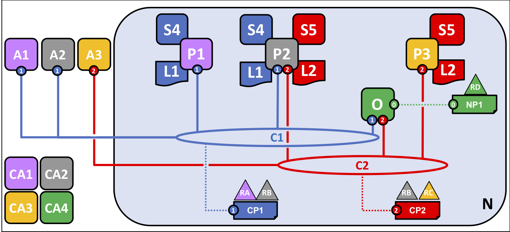
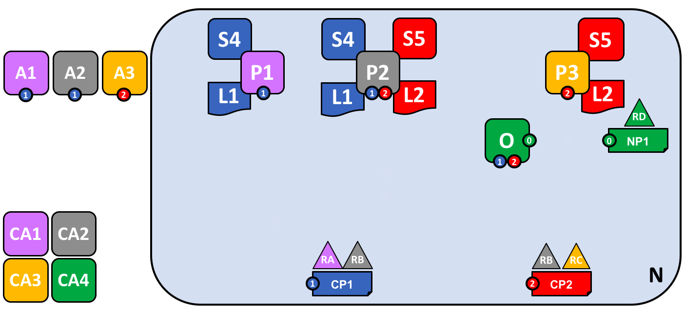

# Hyperledger Fabric Network

## What is a Fabric Network?
A Fabric permissioned blockchain network is a technical infrastructure that provides ledger services to application consumers and administrators. In most
cases, multiple [organizations](../glossary.html#organization) come together as a [consortium](../glossary.html#consortium) to form the network and their permissions are determined by a set of [policies](../glossary.html#policy) that are agreed to by the
the consortium when the network is originally configured. Moreover, network policies
can change over time subject to the agreement of the organizations in the consortium.

This document will take you through the decisions that organizations will need to make to configure and deploy a Hyperledger Fabric network, form channels to transact within the network, and how to update those decisions within the life of the network. You will also learn how those decisions are embedded in the architecture and components of Hyperledger Fabric.

## Who should read this?

In this topic, we'll focus on the major components of the network, why they exist, and when to use them.  This topic is intended for Blockchain Architects and Blockchain Network Administrators.  Blockchain application developers may also have an interest.  As this is intended to be a conceptual document, if you would like to dig deeper into the technical details we encourage you to review the available technical documents on this site.

## The business requirements for the blockchain network -- Example

The organizations RA, RB, RC and RD have decided to jointly invest in a Fabric blockchain network. Organization RA will contribute 3 peers, and 2 client applications of RA will consume the services of the blockchain network. Organization RB will contribute 4 peers and has 1 client application. Organization RC contributes 3 peers and has 2 client applications. Organization RD contributes 4 orderers.
Organization RA and RB have decided to form a consortium and exploit a separate application channel between the two of them. Organization RB and RC have decided to form another consortium and also exploit a separate application channel between the two of them. Each application channel has its own policy.

## Components of a Network

A network consists of:

* [Ledgers](../glossary.html#ledger) (one per channel -- comprised of the [blockchain](../glossary.html#block) and the [state database](../glossary.html#state-database))
* [Smart contract(s)](../glossary.html#smart-contract) (aka chaincode)
* [Peer](../glossary.html#peer) nodes
* [Ordering service(s)](../glossary.html#ordering-service)
* [Channel(s)](../glossary.html#channel)
* [Fabric Certificate Authorities](../glossary.html#hyperledger-fabric-ca)

### Consumers of Network Services

* Client applications owned by organizations
* Clients of Blockchain network administrators

### Network Policies and Identities

The Fabric Certificate Authority (CA) issues the certificates for organizations to authenticate to the network.  There can be one or more CAs on the network and organizations can choose to use their own CA.  Additionally, client applications owned by organizations in the consortium use certificates to authenticate [transaction](../glossary.html#transaction) [proposals](../glossary.html#proposal), and peers use them to endorse proposals and commit transactions to the ledger if they are valid.

*The explanation of the diagram is as follows:
There is a Fabric network N with network policy NP1 and ordering service O. Channel C1 is governed by channel policy CP1.  Channel C1 has been established by consortium RARB. Channel C1 is managed by ordering service O and peers P1 and P2 and client applications A1 and A2 have been granted permission to transact on C1. Client application A1 is owned by organization RA. Certificate authority CA1 serves organization RA. Peer P2 maintains ledger L1 associated with channel C1 and L2 associated with C2. Peer P2 makes use of chain code S4 and S5. The orderer nodes of ordering service O are owned by organization RD.*

## Creating the Network

The network is created from the definition of the consortium including its clients, peers, channels, and ordering service(s).  The ordering service is the administration point for the network because it contains the configuration for the channel(s) within the network.  The configurations for each channel includes the policies for the channel and the [membership](../glossary.html#membership-services) information (in this example X509 root certificates) for each member of the channel.

## Defining a Consortium

A consortium is comprised of two or more organizations on the network.  Consortiums are defined by organizations that have a need for transacting business with one another and they must agree to the policies that govern the network.

## Creating a channel for a consortium

A channel is a communication means used to connect the components of the network and/or the member client applications.  Channels are created by generating the configuration block on the ordering service, which evaluates the validity of the channel configuration. Channels are useful because they allow for data isolation and confidentiality.  Transacting organizations must be authenticated to a channel in order to interact with it.  Channels are governed by the policies they are configured with.

## Peers and Channels

Peers are joined to channels by the organizations that own them, and there can be multiple peer nodes on channels within the network.  Peers can take on multiple roles:

* [*Endorsing peer*](../glossary.html#endorsement) -- defined by policy as specific nodes that execute smart contract transactions in simulation and return a proposal response (endorsement) to the client application.
* [*Committing peer*](../glossary.html#commitment) -- validates blocks of ordered transactions and commits (writes/appends) the blocks to a copy of the ledger it maintains.

Because all peers maintain a copy of the ledger for every channel to which they are joined, all peers are committing peers.  However, only peers specified by the endorsement policy of the smart contract can be endorsing peers.  A peer may be further defined by the roles below:

* [*Anchor peer*](../glossary.html#anchor-peer) -- defined in the channel configuration and is the first peer that will be discovered on the network by other organizations within a channel they are joined to.
* [*Leading peer*](../glossary.html#leading-peer) -- exists on the network to communicate with the ordering service on behalf of an organization that has multiple peers.

## Applications and Smart Contracts

Smart contract chaincode must be [installed](../glossary.html#install) and [instantiated](../glossary.html#instantiate) on a peer in order for a client application to be able to [invoke](../glossary.html#invoke) the smart contract.  Client applications are the only place outside the network where transaction proposals are generated.  When a transaction is proposed by a client application, the smart contract is invoked on the endorsing peers who simulate the execution of the smart contract against their copy of the ledger and send the proposal response (endorsement) back to the client application.  The client application assembles these responses into a transaction and broadcasts it to the ordering service.

## Growing the network

While there no theoretical limit to how big a network can get, as the network grows it is important to consider design choices that will help optimize network throughput, stability, and resilience.  Evaluations of network policies and implementation of [gossip protocol](../gossip.html#gossip-protocol) to accommodate a large number of peer nodes are potential considerations.

## Simplifying the visual vocabulary

*In the diagram below we see that there are two client applications connected to two peer nodes and an ordering service on one channel.  Since there is only one channel, there is only one logical ledger in this example.  As in the case of this single channel, P1 and P2 will have identical copies of the ledger (L1) and smart contract -- aka chaincode (S4).*

## Adding another consortium definition

As consortia are defined and added to the existing channel, we must update the channel configuration by sending a channel configuration update transaction to the ordering service. If the transaction is valid, the ordering service will generate a new configuration block.  Peers on the network will then have to validate the new channel configuration block generated by the ordering service and update their channel configurations if they validate the new block.  It is important to note that the channel configuration update transaction is handled by [*system chaincode*](../glossary.html#system-chain) as invoked by the Blockchain network Administrator, and is not invoked by client application transaction proposals.

## Adding a new channel

Organizations are what form and join channels, and channel configurations can be amended to add organizations as the network grows. When adding a new channel to the network, channel policies remain separate from other channels configured on the same network.

*In this example, the configurations for channel 1 and channel 2 on the ordering service will remain separate from one another.*

## Adding another peer

*In this example, peer 3 (P3) owned by organization 3 has been added to channel 2 (C2).  Note that although there can be multiple ordering services on the network, there can also be a single ordering service that governs multiple channels.  In this example, the channel policies of C2 are isolated from those of C1.  Peer 3 (P3) is also isolated from C1 as it is authenticated only to C2.*

## Joining a peer to multiple channels

*In this example, peer 2 (P2) has been joined to channel 2 (C2).  P2 will keep channels C1 and C2 and their associated transactions private and isolated.  Additionally, client application A3 will also be isolated from C1.  The ordering service maintains network governance and channel isolation by evaluating policies and digital signatures of all nodes configured on all channels.*

## Network fully formed

*In this example, the network has been developed to include multiple client applications, peers, and channels connected to a single ordering service. Peer 2 (P2) is the only peer node connected to channels C1 and C2, which will be kept isolated from each other and their data will remain private.  There are now two logical ledgers in this example, one for C1, and one for C2.*

Simple vocabulary

Better arrangement

