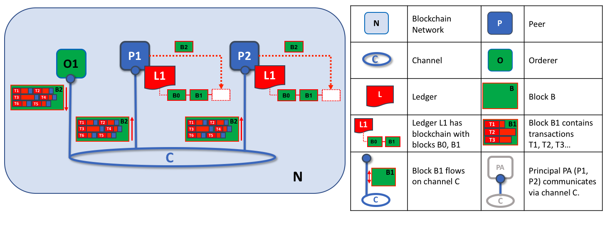

# The Ordering Service

**Audience:** Architects, ordering service admins, channel creators

This topic serves as a conceptual introduction to the concept of ordering, how
orderers interact with peers, the role they play in a transaction flow, and an
overview of the currently available implementations of the ordering service,
with a particular focus on the recommended **Raft** ordering service implementation.

## What is ordering?

Many distributed blockchains, such as Ethereum and Bitcoin, are not permissioned,
which means that any node can participate in the consensus process, wherein
transactions are ordered and bundled into blocks. Because of this fact, these
systems rely on **probabilistic** consensus algorithms which eventually
guarantee ledger consistency to a high degree of probability, but which are
still vulnerable to divergent ledgers (also known as a ledger "fork"), where
different participants in the network have a different view of the accepted
order of transactions.

Hyperledger Fabric works differently. It features a node called an
**orderer** (it's also known as an "ordering node") that does this transaction
ordering, which along with other orderer nodes forms an **ordering service**.
Because Fabric's design relies on **deterministic** consensus algorithms, any block
validated by the peer is guaranteed to be final and correct. Ledgers cannot fork
the way they do in many other distributed and permissionless blockchain networks.

In addition to promoting finality, separating the endorsement of chaincode
execution (which happens at the peers) from ordering gives Fabric advantages
in performance and scalability, eliminating bottlenecks which can occur when
execution and ordering are performed by the same nodes.

## Orderer nodes and channel configuration

Orderers also enforce basic access control for channels, restricting who can
read and write data to them, and who can configure them. Remember that who
is authorized to modify a configuration element in a channel is subject to the
policies that the relevant administrators set when they created the consortium
or the channel. Configuration transactions are processed by the orderer,
as it needs to know the current set of policies to execute its basic
form of access control. In this case, the orderer processes the
configuration update to make sure that the requestor has the proper
administrative rights. If so, the orderer validates the update request against
the existing configuration, generates a new configuration transaction,
and packages it into a block that is relayed to all peers on the channel. The
peers then process the configuration transactions in order to verify that the
modifications approved by the orderer do indeed satisfy the policies defined in
the channel.

## Orderer nodes and identity

Everything that interacts with a blockchain network, including peers,
applications, admins, and orderers, acquires their organizational identity from
their digital certificate and their Membership Service Provider (MSP) definition.

For more information about identities and MSPs, check out our documentation on
[Identity](../identity/identity.html) and [Membership](../membership/membership.html).

Just like peers, ordering nodes belong to an organization. And similar to peers,
a separate Certificate Authority (CA) should be used for each organization.
Whether this CA will function as the root CA, or whether you choose to deploy
a root CA and then intermediate CAs associated with that root CA, is up to you.

## Orderers and the transaction flow

### Phase one: Transaction Proposal and Endorsement

We've seen from our topic on [Peers](../peers/peers.html) that they form the basis
for a blockchain network, hosting ledgers, which can be queried and updated by
applications through smart contracts.

Specifically, applications that want to update the ledger are involved in a
process with three phases that ensures all of the peers in a blockchain network
keep their ledgers consistent with each other.

In the first phase, a client application sends a transaction proposal to the Fabric
Gateway service, via a trusted peer. This peer executes the proposed transaction or
forwards it to another peer in its organization for execution.

The gateway also forwards the transaction to peers in the organizations required by the endorsement policy. These endorsing peers run the transaction and return the
transaction response to the gateway service. They do not apply the proposed update to
their copy of the ledger at this time. The endorsed transaction proposals will ultimately
be ordered into blocks in phase two, and then distributed to all peers for final validation
and commitment to the ledger in phase three.

Note: Fabric v2.3 SDKs embed the logic of the v2.4 Fabric Gateway service in the client application --- refer to the [v2.3 Applications and Peers](https://hyperledger-fabric.readthedocs.io/en/release-2.3/peers/peers.html#applications-and-peers) topic for details.

For an in-depth look at phase one, refer back to the [Peers](../peers/peers.html#applications-and-peers) topic.

### Phase two: Transaction Submission and Ordering

With successful completion of the first transaction phase (proposal), the client
application has received an endorsed transaction proposal response from the
Fabric Gateway service for signing. For an endorsed transaction, the gateway service
forwards the transaction to the ordering service, which orders it with
other endorsed transactions, and packages them all into a block.

The ordering service creates these blocks of transactions, which will ultimately
be distributed to all peers on the channel for validation and commitment to
the ledger in phase three. The blocks themselves are also ordered and are the
basic components of a blockchain ledger.

Ordering service nodes receive transactions from many different application
clients (via the gateway) concurrently. These ordering service nodes collectively
form the ordering service, which may be shared by multiple channels.

The number of transactions in a block depends on channel configuration
parameters related to the desired size and maximum elapsed duration for a
block (`BatchSize` and `BatchTimeout` parameters, to be exact). The blocks are
then saved to the orderer's ledger and distributed to all peers on the channel.
If a peer happens to be down at this time, or joins
the channel later, it will receive the blocks by gossiping with another peer.
We'll see how this block is processed by peers in the third phase.

It's worth noting that the sequencing of transactions in a block is not
necessarily the same as the order received by the ordering service, since there
can be multiple ordering service nodes that receive transactions at approximately
the same time.  What's important is that the ordering service puts the transactions
into a strict order, and peers will use this order when validating and committing
transactions.

This strict ordering of transactions within blocks makes Hyperledger Fabric a
little different from other blockchains where the same transaction can be
packaged into multiple different blocks that compete to form a chain.
In Hyperledger Fabric, the blocks generated by the ordering service are
**final**. Once a transaction has been written to a block, its position in the
ledger is immutably assured. As we said earlier, Hyperledger Fabric's finality
means that there are no **ledger forks** --- validated and committed transactions
will never be reverted or dropped.

We can also see that, whereas peers execute smart contracts (chaincode) and process transactions,
orderers most definitely do not. Every authorized transaction that arrives at an
orderer is then mechanically packaged into a block --- the orderer makes no judgement
as to the content of a transaction (except for channel configuration transactions,
as mentioned earlier).

At the end of phase two, we see that orderers have been responsible for the simple
but vital processes of collecting proposed transaction updates, ordering them,
and packaging them into blocks, ready for distribution to the channel peers.

### Phase three: Transaction Validation and Commitment

The third phase of the transaction workflow involves the distribution of
ordered and packaged blocks from the ordering service to the channel peers
for validation and commitment to the ledger.

Phase three begins with the ordering service distributing blocks to all channel
peers. It's worth noting that not every peer needs to be connected to an orderer ---
peers can cascade blocks to other peers using the [**gossip**](../gossip.html)
protocol --- although receiving blocks directly from the ordering service is
recommended.

Each peer will validate distributed blocks independently, ensuring that ledgers
remain consistent. Specifically, each peer in the channel will validate each
transaction in the block to ensure it has been endorsed
by the required organizations, that its endorsements match, and that
it hasn't become invalidated by other recently committed transactions. Invalidated
transactions are still retained in the immutable block created by the orderer,
but they are marked as invalid by the peer and do not update the ledger's state.

*The second role of an ordering node is to distribute blocks to peers. In this
example, orderer O1 distributes block B2 to peer P1 and peer P2. Peer P1
processes block B2, resulting in a new block being added to ledger L1 on P1. In
parallel, peer P2 processes block B2, resulting in a new block being added to
ledger L1 on P2. Once this process is complete, the ledger L1 has been
consistently updated on peers P1 and P2, and each may inform connected
applications that the transaction has been processed.*

In summary, phase three sees the blocks of transactions created by the ordering
service applied consistently to the ledger by the peers. The strict
ordering of transactions into blocks allows each peer to validate that transaction
updates are consistently applied across the channel.

For a deeper look at phase 3, refer back to the [Peers](../peers/peers.html#phase-3-validation-and-commit) topic.

## Ordering service implementations

While every ordering service currently available handles transactions and
configuration updates the same way, there are nevertheless several different
implementations for achieving consensus on the strict ordering of transactions
between ordering service nodes.

For information about how to stand up an ordering node (regardless of the
implementation the node will be used in), check out [our documentation on deploying a production ordering service](../deployorderer/ordererplan.html).

* **Raft** (recommended)

  New as of v1.4.1, Raft is a crash fault tolerant (CFT) ordering service
  based on an implementation of [Raft protocol](https://raft.github.io/raft.pdf)
  in [`etcd`](https://coreos.com/etcd/). Raft follows a "leader and
  follower" model, where a leader node is elected (per channel) and its decisions
  are replicated by the followers. Raft ordering services should be easier to set
  up and manage than Kafka-based ordering services, and their design allows
  different organizations to contribute nodes to a distributed ordering service.

* **Kafka** (deprecated in v2.x)

  Similar to Raft-based ordering, Apache Kafka is a CFT implementation that uses
  a "leader and follower" node configuration. Kafka utilizes a ZooKeeper
  ensemble for management purposes. The Kafka based ordering service has been
  available since Fabric v1.0, but many users may find the additional
  administrative overhead of managing a Kafka cluster intimidating or undesirable.

* **Solo** (deprecated in v2.x)

  The Solo implementation of the ordering service is intended for test only and
  consists only of a single ordering node. It has been deprecated and may be
  removed entirely in a future release. Existing users of Solo should move to
  a single node Raft network for equivalent function.

## Raft

For information on how to customize the `orderer.yaml` file that determines the configuration of an ordering node, check out the [Checklist for a production ordering node](../deployorderer/ordererchecklist.html).

The go-to ordering service choice for production networks, the Fabric
implementation of the established Raft protocol uses a "leader and follower"
model, in which a leader is dynamically elected among the ordering
nodes in a channel (this collection of nodes is known as the "consenter set"),
and that leader replicates messages to the follower nodes. Because the system
can sustain the loss of nodes, including leader nodes, as long as there is a
majority of ordering nodes (what's known as a "quorum") remaining, Raft is said
to be "crash fault tolerant" (CFT). In other words, if there are three nodes in a
channel, it can withstand the loss of one node (leaving two remaining). If you
have five nodes in a channel, you can lose two nodes (leaving three
remaining nodes). This feature of a Raft ordering service is a factor in the
establishment of a high availability strategy for your ordering service. Additionally,
in a production environment, you would want to spread these nodes across data
centers and even locations. For example, by putting one node in three different
data centers. That way, if a data center or entire location becomes unavailable,
the nodes in the other data centers continue to operate.

From the perspective of the service they provide to a network or a channel, Raft
and the existing Kafka-based ordering service (which we'll talk about later) are
similar. They're both CFT ordering services using the leader and follower
design. If you are an application developer, smart contract developer, or peer
administrator, you will not notice a functional difference between an ordering
service based on Raft versus Kafka. However, there are a few major differences worth
considering, especially if you intend to manage an ordering service.

* Raft is easier to set up. Although Kafka has many admirers, even those
admirers will (usually) admit that deploying a Kafka cluster and its ZooKeeper
ensemble can be tricky, requiring a high level of expertise in Kafka
infrastructure and settings. Additionally, there are many more components to
manage with Kafka than with Raft, which means that there are more places where
things can go wrong. Kafka also has its own versions, which must be coordinated
with your orderers. **With Raft, everything is embedded into your ordering node**.

* Kafka and Zookeeper are not designed to be run across large networks. While
Kafka is CFT, it should be run in a tight group of hosts. This means that
practically speaking you need to have one organization run the Kafka cluster.
Given that, having ordering nodes run by different organizations when using Kafka
(which Fabric supports) doesn't decentralize the nodes because ultimately
the nodes all go to a Kafka cluster which is under the control of a
single organization. With Raft, each organization can have its own ordering
nodes, participating in the ordering service, which leads to a more decentralized
system.

* Kafka is supported natively, which means that users are required to get the requisite images and
learn how to use Kafka and ZooKeeper on their own. Likewise, support for
Kafka-related issues is handled through [Apache](https://kafka.apache.org/), the
open-source developer of Kafka, not Hyperledger Fabric. The Fabric Raft implementation,
on the other hand, has been developed and will be supported within the Fabric
developer community and its support apparatus.

* Where Kafka uses a pool of servers (called "Kafka brokers") and the admin of
the orderer organization specifies how many nodes they want to use on a
particular channel, Raft allows the users to specify which ordering nodes will
be deployed to which channel. In this way, peer organizations can make sure
that, if they also own an orderer, this node will be made a part of a ordering
service of that channel, rather than trusting and depending on a central admin
to manage the Kafka nodes.

* Raft is the first step toward Fabric's development of a byzantine fault tolerant
(BFT) ordering service. As we'll see, some decisions in the development of
Raft were driven by this. If you are interested in BFT, learning how to use
Raft should ease the transition.

For all of these reasons, support for Kafka-based ordering service is being
deprecated in Fabric v2.x.

Note: Similar to Solo and Kafka, a Raft ordering service can lose transactions
after acknowledgement of receipt has been sent to a client. For example, if the
leader crashes at approximately the same time as a follower provides
acknowledgement of receipt. Therefore, application clients should listen on peers
for transaction commit events regardless (to check for transaction validity), but
extra care should be taken to ensure that the client also gracefully tolerates a
timeout in which the transaction does not get committed in a configured timeframe.
Depending on the application, it may be desirable to resubmit the transaction or
collect a new set of endorsements upon such a timeout.

### Raft concepts

While Raft offers many of the same features as Kafka --- albeit in a simpler and
easier-to-use package --- it functions substantially different under the covers
from Kafka and introduces a number of new concepts, or twists on existing
concepts, to Fabric.

**Log entry**. The primary unit of work in a Raft ordering service is a "log
entry", with the full sequence of such entries known as the "log". We consider
the log consistent if a majority (a quorum, in other words) of members agree on
the entries and their order, making the logs on the various orderers replicated.

**Consenter set**. The ordering nodes actively participating in the consensus
mechanism for a given channel and receiving replicated logs for the channel.

**Finite-State Machine (FSM)**. Every ordering node in Raft has an FSM and
collectively they're used to ensure that the sequence of logs in the various
ordering nodes is deterministic (written in the same sequence).

**Quorum**. Describes the minimum number of consenters that need to affirm a
proposal so that transactions can be ordered. For every consenter set, this is a
**majority** of nodes. In a cluster with five nodes, three must be available for
there to be a quorum. If a quorum of nodes is unavailable for any reason, the
ordering service cluster becomes unavailable for both read and write operations
on the channel, and no new logs can be committed.

**Leader**. This is not a new concept --- Kafka also uses leaders ---
but it's critical to understand that at any given time, a channel's consenter set
elects a single node to be the leader (we'll describe how this happens in Raft
later). The leader is responsible for ingesting new log entries, replicating
them to follower ordering nodes, and managing when an entry is considered
committed. This is not a special **type** of orderer. It is only a role that
an orderer may have at certain times, and then not others, as circumstances
determine.

**Follower**. Again, not a new concept, but what's critical to understand about
followers is that the followers receive the logs from the leader and
replicate them deterministically, ensuring that logs remain consistent. As
we'll see in our section on leader election, the followers also receive
"heartbeat" messages from the leader. In the event that the leader stops
sending those message for a configurable amount of time, the followers will
initiate a leader election and one of them will be elected the new leader.

### Raft in a transaction flow

Every channel runs on a **separate** instance of the Raft protocol, which allows each instance to elect a different leader. This configuration also allows further decentralization of the service in use cases where clusters are made up of ordering nodes controlled by different organizations. Ordering nodes can be added or removed from a channel as needed as long as only a single node is added or removed at a time. While this configuration creates more overhead in the form of redundant heartbeat messages and goroutines, it lays necessary groundwork for BFT.

In Raft, transactions (in the form of proposals or configuration updates) are
automatically routed by the ordering node that receives the transaction to the
current leader of that channel. This means that peers and applications do not
need to know who the leader node is at any particular time. Only the ordering
nodes need to know.

When the orderer validation checks have been completed, the transactions are
ordered, packaged into blocks, consented on, and distributed, as described in
phase two of our transaction flow.

### Architectural notes

#### How leader election works in Raft

Although the process of electing a leader happens within the orderer's internal
processes, it's worth noting how the process works.

Raft nodes are always in one of three states: follower, candidate, or leader.
All nodes initially start out as a **follower**. In this state, they can accept
log entries from a leader (if one has been elected), or cast votes for leader.
If no log entries or heartbeats are received for a set amount of time (for
example, five seconds), nodes self-promote to the **candidate** state. In the
candidate state, nodes request votes from other nodes. If a candidate receives a
quorum of votes, then it is promoted to a **leader**. The leader must accept new
log entries and replicate them to the followers.

For a visual representation of how the leader election process works, check out
[The Secret Lives of Data](http://thesecretlivesofdata.com/raft/).

#### Snapshots

If an ordering node goes down, how does it get the logs it missed when it is
restarted?

While it's possible to keep all logs indefinitely, in order to save disk space,
Raft uses a process called "snapshotting", in which users can define how many
bytes of data will be kept in the log. This amount of data will conform to a
certain number of blocks (which depends on the amount of data in the blocks.
Note that only full blocks are stored in a snapshot).

For example, let's say lagging replica `R1` was just reconnected to the network.
Its latest block is `100`. Leader `L` is at block `196`, and is configured to
snapshot at amount of data that in this case represents 20 blocks. `R1` would
therefore receive block `180` from `L` and then make a `Deliver` request for
blocks `101` to `180`. Blocks `180` to `196` would then be replicated to `R1`
through the normal Raft protocol.

### Kafka (deprecated in v2.x)

The other crash fault tolerant ordering service supported by Fabric is an
adaptation of a Kafka distributed streaming platform for use as a cluster of
ordering nodes. You can read more about Kafka at the [Apache Kafka Web site](https://kafka.apache.org/intro),
but at a high level, Kafka uses the same conceptual "leader and follower"
configuration used by Raft, in which transactions (which Kafka calls "messages")
are replicated from the leader node to the follower nodes. In the event the
leader node goes down, one of the followers becomes the leader and ordering can
continue, ensuring fault tolerance, just as with Raft.

The management of the Kafka cluster, including the coordination of tasks,
cluster membership, access control, and controller election, among others, is
handled by a ZooKeeper ensemble and its related APIs.

Kafka clusters and ZooKeeper ensembles are notoriously tricky to set up, so our
documentation assumes a working knowledge of Kafka and ZooKeeper. If you decide
to use Kafka without having this expertise, you should complete, *at a minimum*,
the first six steps of the [Kafka Quickstart guide](https://kafka.apache.org/quickstart) before experimenting with the
Kafka-based ordering service. You can also consult
[this sample configuration file](https://github.com/hyperledger/fabric/blob/release-1.1/bddtests/dc-orderer-kafka.yml)
for a brief explanation of the sensible defaults for Kafka and ZooKeeper.

To learn how to bring up a Kafka-based ordering service, check out [our documentation on Kafka](../kafka.html).

<!--- Licensed under Creative Commons Attribution 4.0 International License
https://creativecommons.org/licenses/by/4.0/) -->
