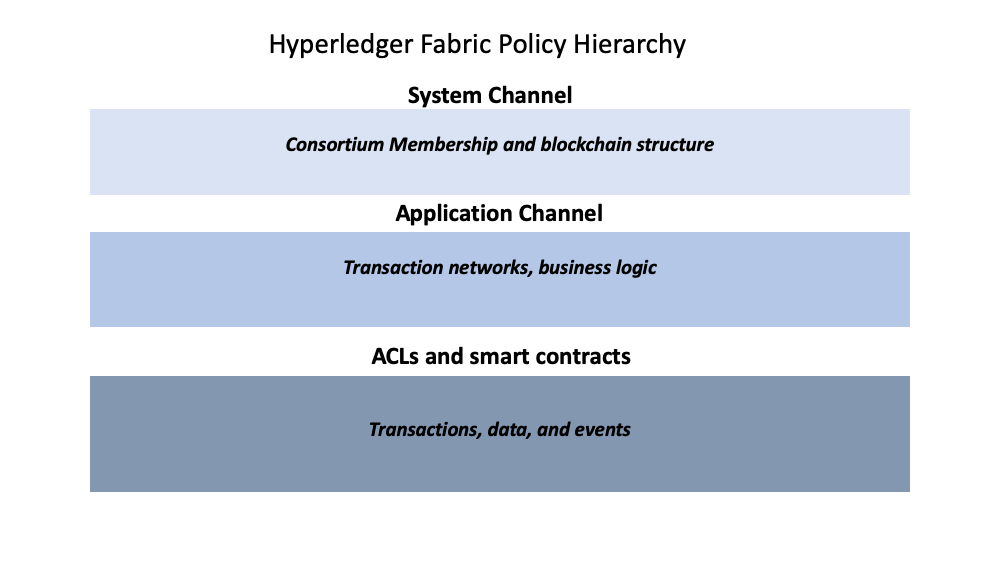
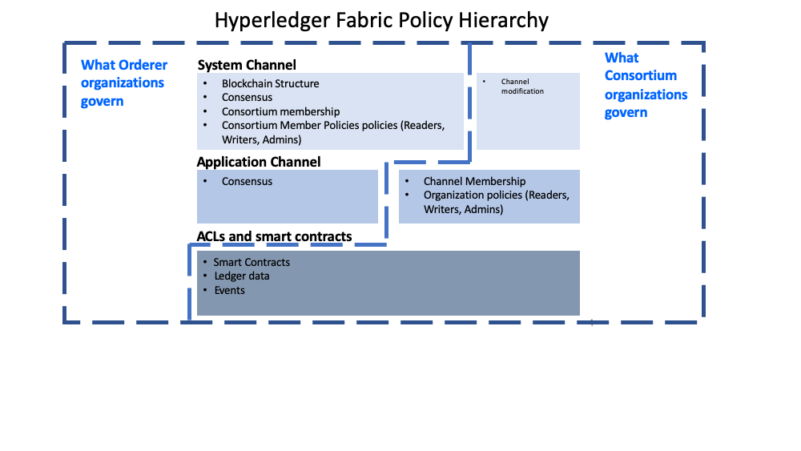
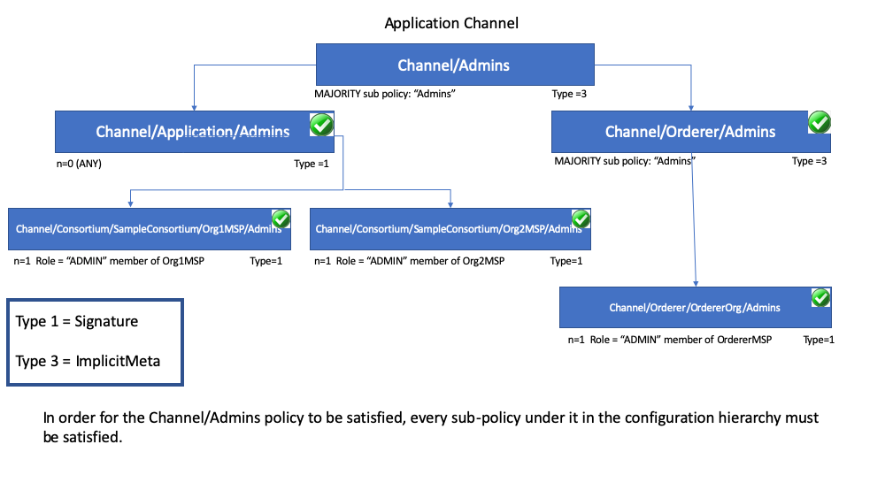

# Policies

**Audience**: Architects, application and smart contract developers,
administrators

In this topic, we'll cover:

* [What is a policy](#what-is-a-policy)
* [Why are policies needed](#why-are-policies-needed)
* [How are policies implemented throughout Fabric](#how-are-policies-implemented-throughout-fabric)
* [Fabric policy domains](#the-fabric-policy-domains)
* [How do you write a policy in Fabric](#how-do-you-write-a-policy-in-fabric)
* [Fabric chaincode lifecycle](#fabric-chaincode-lifecycle)
* [Overriding policy definitions](#overriding-policy-definitions)

## What is a policy

At its most basic level, a policy is a set of rules that define the structure
for how decisions are made and specific outcomes are reached. To that end,
policies typically describe a **who** and a **what**, such as the access or
rights that an individual has over an **asset**. We can see that policies are
used throughout our daily lives to protect assets of value to us, from car
rentals, health, our homes, and many more.

For example, an insurance policy defines the conditions, terms, limits, and
expiration under which an insurance payout will be made. The policy is
agreed to by the policy holder and the insurance company, and defines the rights
and responsibilities of each party.

Whereas an insurance policy is put in place for risk management, in Hyperledger
Fabric, policies are the mechanism for infrastructure management. Fabric policies
represent how members come to agreement on accepting or rejecting changes to the
network, a channel, or a smart contract. Policies are agreed to by the consortium
members when a network is originally configured, but they can also be modified
as the network evolves. For example, they describe the criteria for adding or
removing members from a channel, change how blocks are formed, or specify the
number of organizations required to endorse a smart contract. All of these
actions are described by a policy which defines who can perform the action.
Simply put, everything you want to do on a Fabric network is controlled by a
policy.

## Why are policies needed

Policies are one of the things that make Hyperledger Fabric different from other
blockchains like Ethereum or Bitcoin. In those systems, transactions can be
generated and validated by any node in the network. The policies that govern the
network are fixed at any point in time and can only be changed using the same
process that governs the code. Because Fabric is a permissioned blockchain whose
users are recognized by the underlying infrastructure, those users have the
ability to decide on the governance of the network before it is launched, and
change the governance of a running network.

Policies allow members to decide which organizations can access or update a Fabric
network, and provide the mechanism to enforce those decisions. Policies contain
the lists of organizations that have access to a given resource, such as a
user or system chaincode. They also specify how many organizations need to agree
on a proposal to update a resource, such as a channel or smart contracts. Once
they are written, policies evaluate the collection of signatures attached to
transactions and proposals and validate if the signatures fulfill the governance
agreed to by the network.

## How are policies implemented throughout Fabric

Policies are implemented at different levels of a Fabric network. Each policy
domain governs different aspects of how a network operates.

 *A visual representation
of the Fabric policy hierarchy.*

### System channel configuration

Every network begins with an ordering **system channel**. There must be exactly
one ordering system channel for an ordering service, and it is the first channel
to be created. The system channel also contains the organizations who are the
members of the ordering service (ordering organizations) and those that are
on the networks to transact (consortium organizations).

The policies in the ordering system channel configuration blocks govern the
consensus used by the ordering service and define how new blocks are created.
The system channel also governs which members of the consortium are allowed to
create new channels.

### Application channel configuration

Application _channels_ are used to provide a private communication mechanism
between organizations in the consortium.

The policies in an application channel govern the ability to add or remove
members from the channel. Application channels also govern which organizations
are required to approve a chaincode before the chaincode is defined and
committed to a channel using the Fabric chaincode lifecyle. When an application
channel is initially created, it inherits all the ordering service parameters
from the orderer system channel by default. However, those parameters (and the
policies governing them) can be customized in each channel.

### Access control lists (ACLs)

Network administrators will be especially interested in the Fabric use of ACLs,
which provide the ability to configure access to resources by associating those
resources with existing policies. These "resources" could be functions on system
chaincode (e.g., "GetBlockByNumber" on the "qscc" system chaincode) or other
resources (e.g.,who can receive Block events). ACLs refer to policies
defined in an application channel configuraton and extends them to control
additional resources. The default set of Fabric ACLs is visible in the
`configtx.yaml` file under the `Application: &ApplicationDefaults` section but
they can and should be overridden in a production environment. The list of
resources named in `configtx.yaml` is the complete set of all internal resources
currently defined by Fabric.

In that file, ACLs are expressed using the following format:

```
# ACL policy for chaincode to chaincode invocation
peer/ChaincodeToChaincode: /Channel/Application/Readers
```

Where `peer/ChaincodeToChaincode` represents the resource being secured and
`/Channel/Application/Readers` refers to the policy which must be satisfied for
the associated transaction to be considered valid.

For a deeper dive into ACLS, refer to the topic in the Operations Guide on [ACLs](../access_control.html).

### Smart contract endorsement policies

Every smart contract inside a chaincode package has an endorsement policy that
specifies how many peers belonging to different channel members need to execute
and validate a transaction against a given smart contract in order for the
transaction to be considered valid. Hence, the endorsement policies define the
organizations (through their peers) who must “endorse” (i.e., approve of) the
execution of a proposal.

### Modification policies

There is one last type of policy that is crucial to how policies work in Fabric,
the `Modification policy`. Modification policies specify the group of identities
required to sign (approve) any configuration _update_. It is the policy that
defines how the policy is updated. Thus, each channel configuration element
includes a reference to a policy which governs its modification.

## The Fabric policy domains

While Fabric policies are flexible and can be configured to meet the needs of a
network, the policy structure naturally leads to a division between the domains
governed by either the Ordering Service organizations or the members of the
consortium. In the following diagram you can see how the default policies
implement control over the Fabric policy domains below.

 *A more detailed look at the
policy domains governed by the Orderer organizations and consortium organizations.*

A fully functional Fabric network can feature many organizations with different
responsibilities. The domains provide the ability to extend different privileges
and roles to different organizations by allowing the founders of the ordering
service the ability to establish the initial rules and membership of the
consortium. They also allow the organizations that join the consortium to create
private application channels, govern their own business logic, and restrict
access to the data that is put on the network.

The system channel configuration and a portion of each application channel
configuration provides the ordering organizations control over which organizations
are members of the consortium, how blocks are delivered to channels, and the
consensus mechanism used by the nodes of the ordering service.

The system channel configuration provides members of the consortium the ability
to create channels. Application channels and ACLs are the mechanism that
consortium organizations use to add or remove members from a channel and restrict
access to data and smart contracts on a channel.

## How do you write a policy in Fabric

If you want to change anything in Fabric, the policy associated with the resource
describes **who** needs to approve it, either with an explicit sign off from
individuals, or an implicit sign off by a group. In the insurance domain, an
explicit sign off could be a single member of the homeowners insurance agents
group. And an implicit sign off would be analogous to requiring approval from a
majority of the managerial members of the homeowners insurance group. This is
particularly useful because the members of that group can change over time
without requiring that the policy be updated. In Hyperledger Fabric, explicit
sign offs in policies are expressed using the `Signature` syntax and implicit
sign offs use the `ImplicitMeta` syntax.

### Signature policies

`Signature` policies define specific types of users who must sign in order for a
policy to be satisfied such as `Org1.Peer OR Org2.Peer`. These policies are
considered the most versatile because they allow for the construction of
extremely specific rules like: “An admin of org A and 2 other admins, or 5 of 6
organization admins”. The syntax supports arbitrary combinations of `AND`, `OR`
and `NOutOf`. For example, a policy can be easily expressed by using `AND
(Org1, Org2)` which means that a signature from at least one member in Org1 AND
one member in Org2 is required for the policy to be satisfied.

### ImplicitMeta policies

`ImplicitMeta` policies are only valid in the context of channel configuration
which is based on a tiered hierarchy of policies in a configuration tree. ImplicitMeta
policies aggregate the result of policies deeper in the configuration tree that
are ultimately defined by Signature policies. They are `Implicit` because they
are constructed implicitly based on the current organizations in the
channel configuration, and they are `Meta` because their evaluation is not
against specific MSP principals, but rather against other sub-policies below
them in the configuration tree.

The following diagram illustrates the tiered policy structure for an application
channel and shows how the `ImplicitMeta` channel configuration admins policy,
named `/Channel/Admins`, is resolved when the sub-policies named `Admins` below it
in the configuration hierarchy are satisfied where each check mark represents that
the conditions of the sub-policy were satisfied.



As you can see in the diagram above, `ImplicitMeta` policies, Type = 3, use a
different syntax, `"<ANY|ALL|MAJORITY> <SubPolicyName>"`, for example:
```
`MAJORITY sub policy: Admins`
```
The diagram shows a sub-policy `Admins`, which refers to all the `Admins` policy
below it in the configuration tree. You can create your own sub-policies
and name them whatever you want and then define them in each of your
organizations.

As mentioned above, a key benefit of an `ImplicitMeta` policy such as `MAJORITY
Admins` is that when you add a new admin organization to the channel, you do not
have to update the channel policy. Therefore `ImplicitMeta` policies are
considered to be more flexible as the consortium members change. The consortium
on the orderer can change as new members are added or an existing member leaves
with the consortium members agreeing to the changes, but no policy updates are
required. Recall that `ImplicitMeta` policies ultimately resolve the
`Signature` sub-policies underneath them in the configuration tree as the
diagram shows.

You can also define an application level implicit policy to operate across
organizations, in a channel for example, and either require that ANY of them
are satisfied, that ALL are satisfied, or that a MAJORITY are satisfied. This
format lends itself to much better, more natural defaults, so that each
organization can decide what it means for a valid endorsement.

Further granularity and control can be achieved if you include [`NodeOUs`](msp.html#organizational-units) in your
organization definition. Organization Units (OUs) are defined in the Fabric CA
client configuration file and can be associated with an identity when it is
created. In Fabric, `NodeOUs` provide a way to classify identities in a digital
certificate hierarchy. For instance, an organization having specific `NodeOUs`
enabled could require that a 'peer' sign for it to be a valid endorsement,
whereas an organization without any might simply require that any member can
sign.

## An example: channel configuration policy

Understanding policies begins with examining the `configtx.yaml` where the
channel policies are defined. We can use the `configtx.yaml` file in the Fabric
test network to see examples of both policy syntax types. We are going to examine
the configtx.yaml file used by the [fabric-samples/test-network](https://github.com/hyperledger/fabric-samples/blob/{BRANCH}/test-network/configtx/configtx.yaml) sample.

The first section of the file defines the organizations of the network. Inside each
organization definition are the default policies for that organization, `Readers`, `Writers`,
`Admins`, and `Endorsement`, although you can name your policies anything you want.
Each policy has a `Type` which describes how the policy is expressed (`Signature`
or `ImplicitMeta`) and a `Rule`.

The test network example below shows the Org1 organization definition in the system
channel, where the policy `Type` is `Signature` and the endorsement policy rule
is defined as `"OR('Org1MSP.peer')"`. This policy specifies that a peer that is
a member of `Org1MSP` is required to sign. It is these signature policies that
become the sub-policies that the ImplicitMeta policies point to.  

<details>
  <summary>
    **Click here to see an example of an organization defined with signature policies**
  </summary>

```
 - &Org1
        # DefaultOrg defines the organization which is used in the sampleconfig
        # of the fabric.git development environment
        Name: Org1MSP

        # ID to load the MSP definition as
        ID: Org1MSP

        MSPDir: crypto-config/peerOrganizations/org1.example.com/msp

        # Policies defines the set of policies at this level of the config tree
        # For organization policies, their canonical path is usually
        #   /Channel/<Application|Orderer>/<OrgName>/<PolicyName>
        Policies:
            Readers:
                Type: Signature
                Rule: "OR('Org1MSP.admin', 'Org1MSP.peer', 'Org1MSP.client')"
            Writers:
                Type: Signature
                Rule: "OR('Org1MSP.admin', 'Org1MSP.client')"
            Admins:
                Type: Signature
                Rule: "OR('Org1MSP.admin')"
            Endorsement:
                Type: Signature
                Rule: "OR('Org1MSP.peer')"
```
</details>

The next example shows the `ImplicitMeta` policy type used in the `Application`
section of the `configtx.yaml`. These set of policies lie on the
`/Channel/Application/` path. If you use the default set of Fabric ACLs, these
policies define the behavior of many important features of application channels,
such as who can query the channel ledger, invoke a chaincode, or update a channel
config. These policies point to the sub-policies defined for each organization.
The Org1 defined in the section above contains `Reader`, `Writer`, and `Admin`
sub-policies that are evaluated by the `Reader`, `Writer`, and `Admin` `ImplicitMeta`
policies in the `Application` section. Because the test network is built with the
default policies, you can use the example Org1 to query the channel ledger, invoke a
chaincode, and approve channel updates for any test network channel that you
create.

<details>
  <summary>
    **Click here to see an example of ImplicitMeta policies**
  </summary>
```
################################################################################
#
#   SECTION: Application
#
#   - This section defines the values to encode into a config transaction or
#   genesis block for application related parameters
#
################################################################################
Application: &ApplicationDefaults

    # Organizations is the list of orgs which are defined as participants on
    # the application side of the network
    Organizations:

    # Policies defines the set of policies at this level of the config tree
    # For Application policies, their canonical path is
    #   /Channel/Application/<PolicyName>
    Policies:
        Readers:
            Type: ImplicitMeta
            Rule: "ANY Readers"
        Writers:
            Type: ImplicitMeta
            Rule: "ANY Writers"
        Admins:
            Type: ImplicitMeta
            Rule: "MAJORITY Admins"
        LifecycleEndorsement:
            Type: ImplicitMeta
            Rule: "MAJORITY Endorsement"
        Endorsement:
            Type: ImplicitMeta
            Rule: "MAJORITY Endorsement"
```
</details>

## Fabric chaincode lifecycle

In the Fabric 2.0 release, a new chaincode lifecycle process was introduced,
whereby a more democratic process is used to govern chaincode on the network.
The new process allows multiple organizations to vote on how a chaincode will
be operated before it can be used on a channel. This is significant because it is
the combination of this new lifecycle process and the policies that are
specified during that process that dictate the security across the network. More details on
the flow are available in the [Fabric chaincode lifecyle](../chaincode_lifecycle.html)
concept topic, but for purposes of this topic you should understand how policies are
used in this flow. The new flow includes two steps where policies are specified:
when chaincode is **approved** by organization members, and when it is **committed**
to the channel.

The `Application` section of  the `configtx.yaml` file includes the default
chaincode lifecycle endorsement policy. In a production environment you would
customize this definition for your own use case.

```
################################################################################
#
#   SECTION: Application
#
#   - This section defines the values to encode into a config transaction or
#   genesis block for application related parameters
#
################################################################################
Application: &ApplicationDefaults

    # Organizations is the list of orgs which are defined as participants on
    # the application side of the network
    Organizations:

    # Policies defines the set of policies at this level of the config tree
    # For Application policies, their canonical path is
    #   /Channel/Application/<PolicyName>
    Policies:
        Readers:
            Type: ImplicitMeta
            Rule: "ANY Readers"
        Writers:
            Type: ImplicitMeta
            Rule: "ANY Writers"
        Admins:
            Type: ImplicitMeta
            Rule: "MAJORITY Admins"
        LifecycleEndorsement:
            Type: ImplicitMeta
            Rule: "MAJORITY Endorsement"
        Endorsement:
            Type: ImplicitMeta
            Rule: "MAJORITY Endorsement"
```

- The `LifecycleEndorsement` policy governs who needs to _approve a chaincode
definition_.
- The `Endorsement` policy is the _default endorsement policy for
a chaincode_. More on this below.

## Chaincode endorsement policies

The endorsement policy is specified for a **chaincode** when it is approved
and committed to the channel using the Fabric chaincode lifecycle (that is, one
endorsement policy covers all of the state associated with a chaincode). The
endorsement policy can be specified either by reference to an endorsement policy
defined in the channel configuration or by explicitly specifying a Signature policy.

If an endorsement policy is not explicitly specified during the approval step,
the default `Endorsement` policy `"MAJORITY Endorsement"` is used which means
that a majority of the peers belonging to the different channel members
(organizations) need to execute and validate a transaction against the chaincode
in order for the transaction to be considered valid.  This default policy allows
organizations that join the channel to become automatically added to the chaincode
endorsement policy. If you don't want to use the default endorsement
policy, use the Signature policy format to specify a more complex endorsement
policy (such as requiring that a chaincode be endorsed by one organization, and
then one of the other organizations on the channel).

Signature policies also allow you to include `principals` which are simply a way
of matching an identity to a role. Principals are just like user IDs or group
IDs, but they are more versatile because they can include a wide range of
properties of an actor’s identity, such as the actor’s organization,
organizational unit, role or even the actor’s specific identity. When we talk
about principals, they are the properties which determine their permissions.
Principals are described as 'MSP.ROLE', where `MSP` represents the required MSP
ID (the organization),  and `ROLE` represents one of the four accepted roles:
Member, Admin, Client, and Peer. A role is associated to an identity when a user
enrolls with a CA. You can customize the list of roles available on your Fabric
CA.

Some examples of valid principals are:
* 'Org0.Admin': an administrator of the Org0 MSP
* 'Org1.Member': a member of the Org1 MSP
* 'Org1.Client': a client of the Org1 MSP
* 'Org1.Peer': a peer of the Org1 MSP
* 'OrdererOrg.Orderer': an orderer in the OrdererOrg MSP

There are cases where it may be necessary for a particular state
(a particular key-value pair, in other words) to have a different endorsement
policy. This **state-based endorsement** allows the default chaincode-level
endorsement policies to be overridden by a different policy for the specified
keys.

For a deeper dive on how to write an endorsement policy refer to the topic on
[Endorsement policies](../endorsement-policies.html) in the Operations Guide.

**Note:**  Policies work differently depending on which version of Fabric you are
  using:
- In Fabric releases prior to 2.0, chaincode endorsement policies can be
  updated during chaincode instantiation or by using the chaincode lifecycle
  commands. If not specified at instantiation time, the endorsement policy
  defaults to “any member of the organizations in the channel”. For example,
  a channel with “Org1” and “Org2” would have a default endorsement policy of
  “OR(‘Org1.member’, ‘Org2.member’)”.
- Starting with Fabric 2.0, Fabric introduced a new chaincode
  lifecycle process that allows multiple organizations to agree on how a
  chaincode will be operated before it can be used on a channel.  The new process
  requires that organizations agree to the parameters that define a chaincode,
  such as name, version, and the chaincode endorsement policy.

## Overriding policy definitions

Hyperledger Fabric includes default policies which are useful for getting started,
developing, and testing your blockchain, but they are meant to be customized
in a production environment. You should be aware of the default policies
in the `configtx.yaml` file. Channel configuration policies can be extended
with arbitrary verbs, beyond the default `Readers, Writers, Admins` in
`configtx.yaml`. The orderer system and application channels are overridden by
issuing a config update when you override the default policies by editing the
`configtx.yaml` for the orderer system channel or the `configtx.yaml` for a
specific channel.

See the topic on
[Updating a channel configuration](../config_update.html#updating-a-channel-configuration)
for more information.

<!--- Licensed under Creative Commons Attribution 4.0 International License
https://creativecommons.org/licenses/by/4.0/) -->
