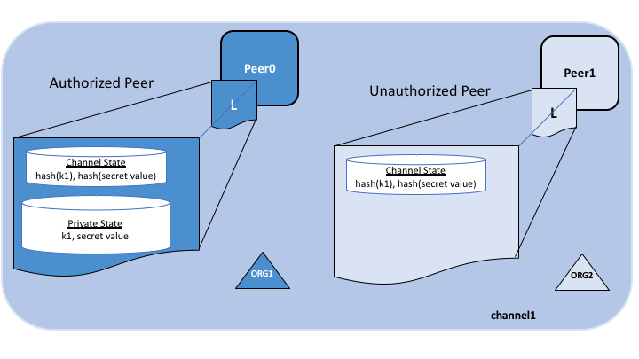
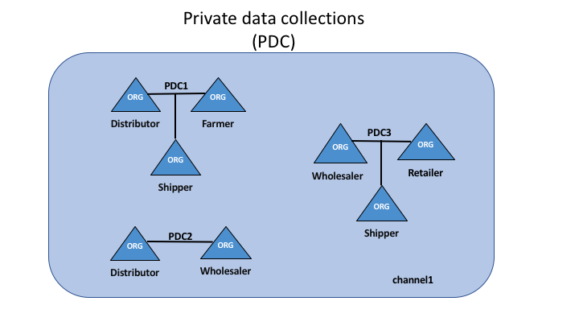
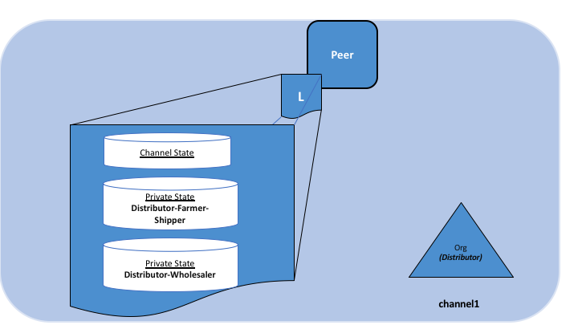

# Private data

## What is private data?

In cases where a group of organizations on a channel need to keep data private from
other organizations on that channel, they have the option to create a new channel
comprising just the organizations who need access to the data. However, creating
separate channels in each of these cases creates additional administrative overhead
(maintaining chaincode versions, policies, MSPs, etc), and doesn't allow for use
cases in which you want all channel participants to see a transaction while keeping
a portion of the data private.

That's why, starting in v1.2, Fabric offers the ability to create
**private data collections**, which allow a defined subset of organizations on a
channel the ability to endorse, commit, or query private data without having to
create a separate channel.

## What is a private data collection?

A collection is the combination of two elements:

1. **The actual private data**, sent peer-to-peer [via gossip protocol](../gossip.html)
   to only the organization(s) authorized to see it. This data is stored in a
   private database on the peer (sometimes called a "side" database, or
   "SideDB"). The ordering service is not involved here and does not see the
   private data. Note that setting up gossip requires setting up anchor peers
   in order to bootstrap cross-organization communication.

2. **A hash of that data**, which is endorsed, ordered, and written to the ledgers
   of every peer on the channel. The hash serves as evidence of the transaction and
   is used for state validation and can be used for audit purposes.

The following diagram illustrates the ledger contents of a peer authorized to have
private data and one which is not.

Collection members may decide to share the private data with other parties if they
get into a dispute or if they want to transfer the asset to a third party. The
third party can then compute the hash of the private data and see if it matches the
state on the channel ledger, proving that the state existed between the collection
members at a certain point in time.

### When to use a collection within a channel vs. a separate channel

* Use **channels** when entire transactions (and ledgers) must be kept
  confidential within a set of organizations that are members of the channel.

* Use **collections** when transactions (and ledgers) must be shared among a set
  of organizations, but when only a subset of those organizations should have
  access to some (or all) of the data within a transaction.  Additionally,
  since private data is disseminated peer-to-peer rather than via blocks,
  use private data collections when transaction data must be kept confidential
  from ordering service nodes.

## Transaction flow with private data

When private data collections are referenced in chaincode, the transaction flow
is slightly different in order to protect the confidentiality of the private
data as transactions are proposed, endorsed, and committed to the ledger.

For details on transaction flows that don't use private data refer to our
documentation on [transaction flow](../txflow.html).

1. The client application submits a proposal request to invoke a chaincode
   function (reading or writing private data) to endorsing peers which are
   part of authorized organizations of the collection. The private data, or
   data used to generate private data in chaincode, is sent in a `transient`
   field of the proposal.

2. The endorsing peers simulate the transaction and store the private data in
   a `transient data store` (a temporary storage local to the peer). They
   distribute the private data, based on the collection policy, to authorized peers
   via [gossip](../gossip.html).

3. The endorsing peer sends the proposal response back to the client with public
   data, including a hash of the private data key and value. *No private data is
   sent back to the client*. For more information on how endorsement works with
   private data, click [here](../private-data-arch.html#endorsement).

4. The client application submits the transaction to the ordering service (with
   hashes of the private data) which gets distributed into blocks as normal.
   The block with the hashed values is distributed to all the peers. In this way,
   all peers on the channel can validate transactions with the hashes of the private
   data in a consistent way, without knowing the actual private data.

5. At block-committal time, authorized peers use the collection policy to
   determine if they are authorized to have access to the private data. If they do,
   they will first check their local `transient data store` to determine if they
   have already received the private data at chaincode endorsement time. If not,
   they will attempt to pull the private data from another peer. Then they will
   validate the private data against the hashes in the public block and commit the
   transaction and the block. Upon validation/commit, the private data is moved to
   their copy of the private state database and private writeset storage. The
   private data is then deleted from the `transient data store`.

### A use case to explain collections

Consider a group of five organizations on a channel who trade produce:

* **A Farmer** selling his goods abroad
* **A Distributor** moving goods abroad
* **A Shipper** moving goods between parties
* **A Wholesaler** purchasing goods from distributors
* **A Retailer** purchasing goods from shippers and wholesalers

The **Distributor** might want to make private transactions with the
**Farmer** and **Shipper** to keep the terms of the trades confidential from
the **Wholesaler** and the **Retailer** (so as not to expose the markup they're
charging).

The **Distributor** may also want to have a separate private data relationship
with the **Wholesaler** because it charges them a lower price than it does the
**Retailer**.

The **Wholesaler** may also want to have a private data relationship with the
**Retailer** and the **Shipper**.

Rather than defining many small channels for each of these relationships, multiple
private data collections **(PDC)** can be defined to share private data between:

1. PDC1: **Distributor**, **Farmer** and **Shipper**
2. PDC2: **Distributor** and **Wholesaler**
3. PDC3: **Wholesaler**, **Retailer** and **Shipper**

Using this example, peers owned by the **Distributor** will have multiple private
databases inside their ledger which includes the private data from the
**Distributor**, **Farmer** and **Shipper** relationship and the
**Distributor** and **Wholesaler** relationship. Because these databases are kept
separate from the database that holds the channel ledger, private data is
sometimes referred to as "SideDB".

## How a private data collection is defined

For more details on collection definitions, and other low level information about
private data and collections, refer to the [private data reference topic](../private-data-arch.html).

## Purging data

For very sensitive data, even the parties sharing the private data might want
--- or might be required by government regulations --- to "purge" the data stored
on their peers after a set amount of time, leaving behind only a hash of the data
to serve as immutable evidence of the transaction.

In some of these cases, the private data only needs to exist on the peer's private
database until it can be replicated into a database external to the blockchain
network. The data might also only need to exist on the peers until a chaincode business
process is done with it (trade settled, contract fulfilled, etc). To support the later
use case, it is possible to purge private data if it has not been modified once a set
number of subsequent blocks have been added to the private database.

<!--- Licensed under Creative Commons Attribution 4.0 International License
https://creativecommons.org/licenses/by/4.0/ -->
