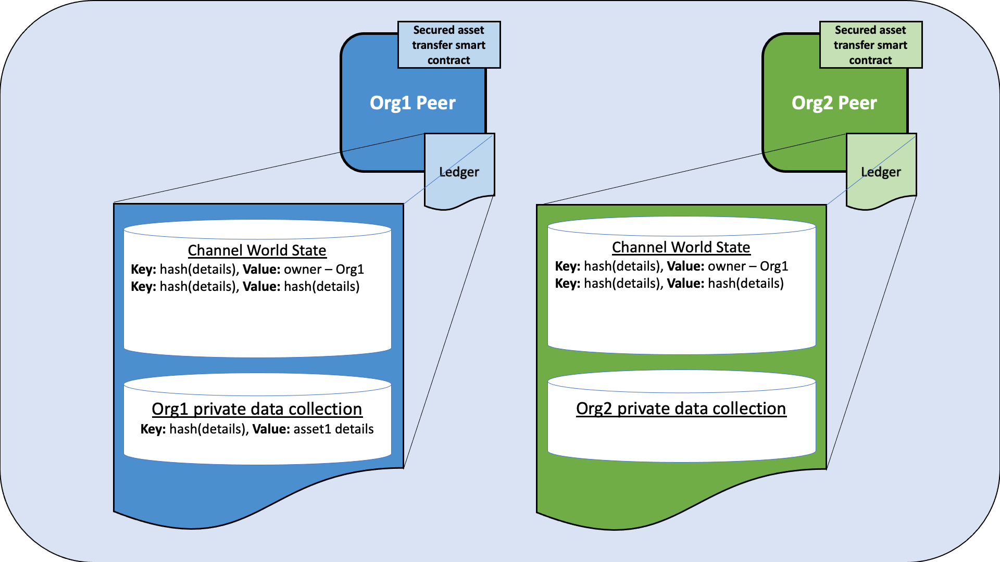
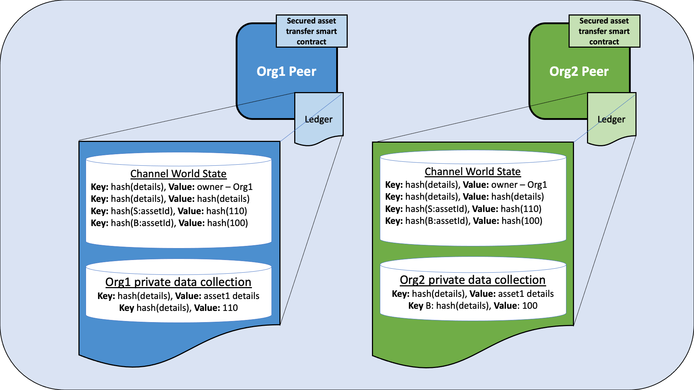
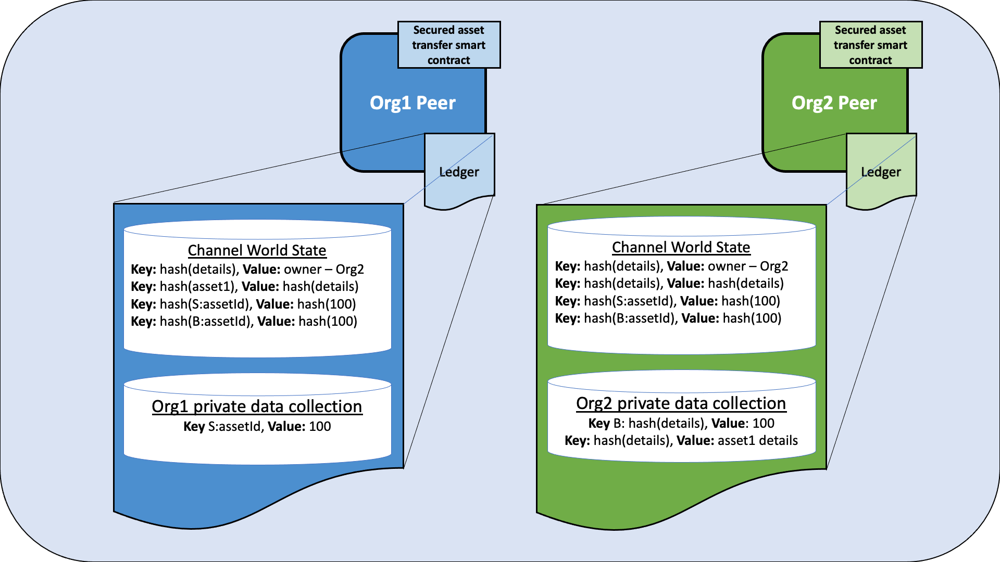

# Secured asset transfer in Fabric

This tutorial will demonstrate how an asset can be represented and traded between organizations in a Hyperledger Fabric blockchain channel, while keeping details of the asset and transaction private using private data.
Each on-chain asset is a non-fungible token (NFT) that represents a specific asset having certain immutable properties (such as size and color) with a unique owner. When the owner wants to sell the asset, both parties need to agree to the same price before the asset is transferred. The private asset transfer smart contract enforces that only the owner of the asset can transfer the asset. In the course of this tutorial, you will learn how Fabric features such as state based endorsement, private data, and access control come together to provide secured transactions that are both private and verifiable.

This tutorial will deploy the [secured asset transfer sample](https://github.com/hyperledger/fabric-samples/tree/main/asset-transfer-secured-agreement/chaincode-go) to demonstrate how to transfer a private asset between two organizations without publicly sharing data. You should have completed the task
[Install Samples, Binaries, and Docker Images](../install.html#install-samples-binaries-and-docker-images).


## Scenario requirements

The private asset transfer scenario is bound by the following requirements:

- An asset may be issued by the first owner's organization (in the real world issuance may be restricted to some authority that certifies an asset's properties).
- Ownership is managed at the organization level (the Fabric permissioning scheme would equally support ownership at an individual identity level within an organization).
- The asset identifier is a hash of the asset's immutable properties, and along with the current owner is stored as public channel data for all channel members to see.
- The asset immutable properties however are private information known only to the asset owner (and prior owners).
- An interested buyer will want to verify an asset's private properties against the hashed asset id before purchasing. This confirms that the buyer has the correct asset description.
- An interested buyer will want to verify an asset's provenance, specifically the asset's origin and chain of custody. This confirms that the asset has not changed since issuance.
- To transfer an asset, a buyer and seller must first agree on the asset's properties and sales price.
- Only the current owner may transfer their asset to another organization.
- The actual private asset transfer must verify that the asset's properties and price have been agreed to. Both buyer and seller must endorse the transfer.

## How privacy is maintained

The smart contract uses the following techniques to ensure that the asset properties remain private:

- The asset properties are stored in the current owning organization's implicit private data collection on the organization's peers only. Each organization on a Fabric channel has a private data collection that their own organization can use. This collection is *implicit* because it does not need to be explicitly defined in the chaincode.
- Although a hash of the private properties is automatically stored on-chain for all channel members to see, a random salt is included in the private properties so that other channel members cannot guess the private data pre-image through a dictionary attack.
- Smart contract requests utilize the transient field for private data so that private data does not get included in the final on-chain transaction.
- Private data queries must originate from a client whose org id matches the peer's org id, which must be the same as the asset owner's org id.

## How the transfer is implemented

Before we start using the private asset transfer smart contract we will provide an overview of the transaction flow and how Fabric features are used to protect the asset created on the blockchain:

### Creating the asset

The private asset transfer smart contract is deployed with an endorsement policy that requires an endorsement from any channel member. This allows any organization to create an asset that they own without requiring an endorsement from other channel members. The creation of the asset is the only transaction that uses the chaincode level endorsement policy. Transactions that update or transfer existing assets will be governed by state based endorsement policies or the endorsement policies of private data collections. Note that in other scenarios, you may want an issuing authority to also endorse create transactions.

The smart contract uses the following Fabric features to ensure that the asset can only be updated or transferred by the organization that owns the asset:

- When the asset is created, the smart contract gets the MSP ID of the organization that submitted the request, and stores the MSP ID as the owner in the asset key/value in the public chaincode world state. Subsequent smart contract requests to update or transfer the asset will use access control logic to verify that the requesting client is from the same organization. Note that in other scenarios, the ownership could be based on a specific client identity within an organization, rather than an organization itself.
- Also when the asset is created, the smart contract sets a state based endorsement policy for the asset key. The state based policy specifies that a peer from the organization that owns the asset must endorse a subsequent request to update or transfer the asset. This prevents any other organization from updating or initiating the transfer of the asset using a smart contract that has been maliciously altered on their own peers. To further secure asset transfer, consider including other parties in the asset's state based endorsement policy, such as a trusted third party.

### Agreeing to the transfer

After an asset is created, channel members can use the smart contract to agree to transfer the asset:

- The owner of the asset can change the description in the public ownership record, for example to advertise that the asset is for sale. Smart contract access control enforces that this change needs to be submitted from a member of the asset owner organization. The state based endorsement policy enforces that this description change must be endorsed by a peer from the owner's organization.

The asset owner and the asset buyer agree to transfer the asset for a certain price:
- The price and the private asset properties agreed to by the buyer and the seller is stored in each organization's implicit private data collection. The private data collection keeps the agreed price and asset properties secret from other members of the channel. The endorsement policy of the implicit private data collection ensures that the respective organization's peer endorsed the price agreement, and the smart contract access control logic ensures that the price agreement was submitted by a client of the associated organization.
- A hash of each price agreement and of the asset properties is automatically stored on the ledger when using private data collections. These hashes will match only if the two organizations have agreed to the same price and the two asset descriptions correspond. This allows the organizations to verify that they have come to agreement on the transfer details when they execute and endorse the transfer transaction. A random trade id is added to the price agreement, which serves as a *salt* to ensure that other channel members can not use the hash on the ledger to guess the price.

### Transferring the asset

After the two organizations have agreed to the same price and asset properties, the asset owner can invoke the transfer function to transfer the asset to the buyer:

- Smart contract access control ensures that the transfer must be initiated by a member of the organization that owns the asset.
- The transfer function verifies that the on-chain asset properties present in the seller's private collection correspond to the ones present in the buyer's private collection by comparing their hash, to ensure that the asset owner is *selling* the same asset declared.
- The transfer function also uses the hash of the price agreement on the ledger to ensure that both organizations have agreed to the same price.
- If the transfer conditions are met, the transfer function deletes the asset from the collection of the seller and updates the owner in the public ownership record.
- The price agreements are also deleted from both the seller and buyer implicit private data collection, and a sales receipt is created in each private data collection to record the transaction price and timestamp.
- Because the transfer transaction updates data in the seller and buyer implicit data collections, the transfer must be endorsed by peers from both buyer and seller.
- The state based endorsement policy of the public asset record is updated so that only a peer of the new owner of the asset can update or initialize a subsequent transfer of their new asset.


## Running the secured asset transfer smart contract

You can use the Fabric test network to run the secured asset transfer smart contract. The test network contains two peer organizations, Org1 and Org2, that operate one peer each. In this tutorial, we will deploy the smart contract to a channel of the test network joined by both organizations. We will first create an asset that is owned by Org1. After the two organizations agree on the asset properties and price, we will transfer the asset from Org1 to Org2.

## Deploy the test network

We are going to use the Fabric test network to run the secured asset transfer smart contract. Open a command terminal and navigate to test network directory in your local clone of [fabric-samples](https://github.com/hyperledger/fabric-samples). We will operate from the `test-network` directory for the remainder of the tutorial.
```
cd fabric-samples/test-network
```

First, bring down any running instances of the test network:
```
./network.sh down
```

You can then deploy a new instance the network with the following command:
```
./network.sh up createChannel -c mychannel
```
The script will deploy the nodes of the network and create a single channel named `mychannel` with Org1 and Org2 as channel members. We will use this channel to deploy the smart contract and trade our asset.

## Deploy the smart contract

You can use the test network script to deploy the secured asset transfer smart contract to the channel. Run the following command to deploy the smart contract to `mychannel`:
```
./network.sh deployCC -ccn secured -ccp ../asset-transfer-secured-agreement/chaincode-go/ -ccl go -ccep "OR('Org1MSP.peer','Org2MSP.peer')"
```

Note that we are using the `-ccep` flag to deploy the smart contract with an endorsement policy of `"OR('Org1MSP.peer','Org2MSP.peer')"`. This allows either organization to create an asset without receiving an endorsement from the other organization.

### Set the environment variables to operate as Org1

In the course of running this sample, you need to interact with the network as both Org1 and Org2. To make the tutorial easier to use, we will use separate terminals for each organization. Open a new terminal and make sure that you are operating from the `test-network` directory. Set the following environment variables to operate the `peer` CLI as the Org1 admin:

```
export PATH=${PWD}/../bin:${PWD}:$PATH
export FABRIC_CFG_PATH=$PWD/../config/
export CORE_PEER_TLS_ENABLED=true
export CORE_PEER_LOCALMSPID="Org1MSP"
export CORE_PEER_MSPCONFIGPATH=${PWD}/organizations/peerOrganizations/org1.example.com/users/Admin@org1.example.com/msp
export CORE_PEER_TLS_ROOTCERT_FILE=${PWD}/organizations/peerOrganizations/org1.example.com/peers/peer0.org1.example.com/tls/ca.crt
export CORE_PEER_ADDRESS=localhost:7051
```

The environment variables also specify the endpoint information of the Org1 peer to submit requests.

### Set the environment variables to operate as Org2

Now that we have one terminal that we can operate as Org1, open a new terminal for Org2. Make sure that this terminal is also operating from the `test-network` directory. Set the following environment variables to operate as the Org2 admin:

```
export PATH=${PWD}/../bin:${PWD}:$PATH
export FABRIC_CFG_PATH=$PWD/../config/
export CORE_PEER_TLS_ENABLED=true
export CORE_PEER_LOCALMSPID="Org2MSP"
export CORE_PEER_MSPCONFIGPATH=${PWD}/organizations/peerOrganizations/org2.example.com/users/Admin@org2.example.com/msp
export CORE_PEER_TLS_ROOTCERT_FILE=${PWD}/organizations/peerOrganizations/org2.example.com/peers/peer0.org2.example.com/tls/ca.crt
export CORE_PEER_ADDRESS=localhost:9051
```

You will need switch between the two terminals as you go through the tutorial.

## Create an asset

Any channel member can use the smart contract to create an asset that is owned by their organization. The details of the asset will be stored in a private data collection, and can only accessed by the organization that owns the asset. A public record of the asset, its owner, and a public description is stored on the channel ledger. Any channel member can access the public ownership record to see who owns the asset, and can read the description to see if the asset is for sale.

### Operate from the Org1 terminal

Before we create the asset, we need to specify the details of what our asset will be. Issue the following command to create a JSON that will describe the asset. The `"salt"` parameter is a random string that would prevent another member of the channel from guessing the asset using the hash on the ledger. If there was no salt, a user could theoretically guess asset parameters until the hash of the of the guess and the hash on the ledger matched (this is known as a dictionary attack). This string is encoded in Base64 format so that it can be passed to the creation transaction as transient data.

```
export ASSET_PROPERTIES=$(echo -n "{\"object_type\":\"asset_properties\",\"color\":\"blue\",\"size\":35,\"salt\":\"a94a8fe5ccb19ba61c4c0873d391e987982fbbd3\"}" | base64 | tr -d \\n)
```

We can now use the following command to create an asset that belongs to Org1.

```
peer chaincode invoke -o localhost:7050 --ordererTLSHostnameOverride orderer.example.com --tls --cafile "${PWD}/organizations/ordererOrganizations/example.com/orderers/orderer.example.com/msp/tlscacerts/tlsca.example.com-cert.pem" -C mychannel -n secured -c '{"function":"CreateAsset","Args":["A new asset for Org1MSP"]}' --transient "{\"asset_properties\":\"$ASSET_PROPERTIES\"}"
```

The hash of the asset properties will become the asset ID and is returned by the CreateAsset call. Look for the hash in the response "payload" that was reported to the CLI, and set it as an environment variable for later reference.

```
export ASSET_ID=d9923f21b770adbc79cbcc47a3aeecc81dc7f030bd129155301ce3932be7fbcc
```

We can query the Org1 implicit data collection to see the asset that was created, write the following command by substituting assetId with the id returned from the createAsset function.

```
peer chaincode query -o localhost:7050 --ordererTLSHostnameOverride orderer.example.com --tls --cafile "${PWD}/organizations/ordererOrganizations/example.com/orderers/orderer.example.com/msp/tlscacerts/tlsca.example.com-cert.pem" -C mychannel -n secured -c "{\"function\":\"GetAssetPrivateProperties\",\"Args\":[\"$ASSET_ID\"]}"
```

When successful, the command will return the following result:

```
{"object_type":"asset_properties","color":"blue","size":35,"salt":"a94a8fe5ccb19ba61c4c0873d391e987982fbbd3"}
```

We can also query the ledger to see the public ownership record:

```
peer chaincode query -o localhost:7050 --ordererTLSHostnameOverride orderer.example.com --tls --cafile "${PWD}/organizations/ordererOrganizations/example.com/orderers/orderer.example.com/msp/tlscacerts/tlsca.example.com-cert.pem" -C mychannel -n secured -c "{\"function\":\"ReadAsset\",\"Args\":[\"$ASSET_ID\"]}"

```
The command will return the record that the asset is owned by Org1:

```
{"object_type":"asset","asset_id":"d9923f21b770adbc79cbcc47a3aeecc81dc7f030bd129155301ce3932be7fbcc","owner_org":"Org1MSP","public_description":"A new asset for Org1MSP"}
```

Because the market for assets is hot, Org1 wants to flip this asset and put it up for sale. As the asset owner, Org1 can update the public description to advertise that the asset is for sale. Run the following command to change the asset description:

```
peer chaincode invoke -o localhost:7050 --ordererTLSHostnameOverride orderer.example.com --tls --cafile "${PWD}/organizations/ordererOrganizations/example.com/orderers/orderer.example.com/msp/tlscacerts/tlsca.example.com-cert.pem" -C mychannel -n secured -c "{\"function\":\"ChangePublicDescription\",\"Args\":[\"$ASSET_ID\",\"This asset is for sale\"]}"
```

Query the ledger again to see the updated description:

```
peer chaincode query -o localhost:7050 --ordererTLSHostnameOverride orderer.example.com --tls --cafile "${PWD}/organizations/ordererOrganizations/example.com/orderers/orderer.example.com/msp/tlscacerts/tlsca.example.com-cert.pem" -C mychannel -n secured -c "{\"function\":\"ReadAsset\",\"Args\":[\"$ASSET_ID\"]}"
```

We can now see that the asset is for sale:

```
{"object_type":"asset","asset_id":"d9923f21b770adbc79cbcc47a3aeecc81dc7f030bd129155301ce3932be7fbcc","owner_org":"Org1MSP","public_description":"This asset is for sale"}
```

    
*Figure 1: When Org1 creates an asset that they own, the asset details are stored in the Org1 implicit data collection on the Org1 peer. The public ownership record is stored in the channel world state, and is stored on both the Org1 and Org2 peers. A hash of the asset key and a hash the asset details are also visible in the channel world state and are stored on the peers of both organizations.*

### Operate from the Org2 terminal

If we operate from the Org2 terminal, we can use the smart contract query the public asset data:

```
export ASSET_ID=d9923f21b770adbc79cbcc47a3aeecc81dc7f030bd129155301ce3932be7fbcc
peer chaincode query -o localhost:7050 --ordererTLSHostnameOverride orderer.example.com --tls --cafile "${PWD}/organizations/ordererOrganizations/example.com/orderers/orderer.example.com/msp/tlscacerts/tlsca.example.com-cert.pem" -C mychannel -n secured -c "{\"function\":\"ReadAsset\",\"Args\":[\"$ASSET_ID\"]}"
```

From this query, Org2 learns that the asset is for sale:

```
{"object_type":"asset","asset_id":"d9923f21b770adbc79cbcc47a3aeecc81dc7f030bd129155301ce3932be7fbcc","owner_org":"Org1MSP","public_description":"This asset is for sale"}
```

_In a real chaincode you may want to query for all assets for sale, by using a JSON query, or by creating a different sale key and using a key range query to find the assets currently for sale._
Any changes to the public description of the asset owned by Org1 needs to be endorsed by Org1. The endorsement policy is reinforced by an access control policy within the chaincode that any update needs to be submitted by the organization that owns the asset. Lets see what happens if Org2 tried to change the public description as a prank:

```
peer chaincode invoke -o localhost:7050 --ordererTLSHostnameOverride orderer.example.com --tls --cafile "${PWD}/organizations/ordererOrganizations/example.com/orderers/orderer.example.com/msp/tlscacerts/tlsca.example.com-cert.pem" -C mychannel -n secured -c "{\"function\":\"ChangePublicDescription\",\"Args\":[\"$ASSET_ID\",\"the worst asset\"]}"
```

The smart contract does not allow Org2 to access the public description of the asset.

```
Error: endorsement failure during invoke. response: status:500 message:"a client from Org2MSP cannot update the description of an asset owned by Org1MSP"
```

## Agree to sell the asset

To sell an asset, both the buyer and the seller must agree on an asset price and make sure that they both have the same asset properties in their respective private data collections. Each party stores the price that they agree to in their own private data collection. The private asset transfer smart contract enforces that both parties need to agree to the same price and asset properties before the asset can be transferred.

## Agree to sell as Org1

Operate from the Org1 terminal. Org1 will agree to set the asset price as 110 dollars. The `trade_id` is used as salt to prevent a channel member that is not a buyer or a seller from guessing the price. This value needs to be passed out of band together with the asset properties, through email or other communication, between the buyer and the seller. The buyer and the seller can also add salt to the asset key to prevent other members of the channel from guessing which asset is for sale.

```
export ASSET_PRICE=$(echo -n "{\"asset_id\":\"$ASSET_ID\",\"trade_id\":\"109f4b3c50d7b0df729d299bc6f8e9ef9066971f\",\"price\":110}" | base64 | tr -d \\n)
peer chaincode invoke -o localhost:7050 --ordererTLSHostnameOverride orderer.example.com --tls --cafile "${PWD}/organizations/ordererOrganizations/example.com/orderers/orderer.example.com/msp/tlscacerts/tlsca.example.com-cert.pem" -C mychannel -n secured -c "{\"function\":\"AgreeToSell\",\"Args\":[\"$ASSET_ID\"]}" --transient "{\"asset_price\":\"$ASSET_PRICE\"}"
```

We can query the Org1 private data collection to read the agreed to selling price:

```
peer chaincode query -o localhost:7050 --ordererTLSHostnameOverride orderer.example.com --tls --cafile "${PWD}/organizations/ordererOrganizations/example.com/orderers/orderer.example.com/msp/tlscacerts/tlsca.example.com-cert.pem" -C mychannel -n secured -c "{\"function\":\"GetAssetSalesPrice\",\"Args\":[\"$ASSET_ID\"]}"
```

## Agree to buy as Org2

Operate from the Org2 terminal. Run the following command to verify the asset properties before agreeing to buy. The asset properties and salt would be passed out of band, through email or other communication, between the buyer and seller.

```
export ASSET_PROPERTIES=$(echo -n "{\"object_type\":\"asset_properties\",\"color\":\"blue\",\"size\":35,\"salt\":\"a94a8fe5ccb19ba61c4c0873d391e987982fbbd3\"}" | base64 | tr -d \\n)
peer chaincode query -o localhost:7050 --ordererTLSHostnameOverride orderer.example.com --tls --cafile "${PWD}/organizations/ordererOrganizations/example.com/orderers/orderer.example.com/msp/tlscacerts/tlsca.example.com-cert.pem" -C mychannel -n secured -c "{\"function\":\"VerifyAssetProperties\",\"Args\":[\"$ASSET_ID\"]}" --transient "{\"asset_properties\":\"$ASSET_PROPERTIES\"}"
```

Run the following command to agree to buy asset1 for 100 dollars. As of now, Org2 will agree to a different price than Org1. Don't worry, the two organizations will agree to the same price in a future step. However, we can use this temporary disagreement as a test of what happens if the buyer and the seller agree to a different price. Org2 needs to use the same `trade_id` as Org1.

```
export ASSET_PRICE=$(echo -n "{\"asset_id\":\"$ASSET_ID\",\"trade_id\":\"109f4b3c50d7b0df729d299bc6f8e9ef9066971f\",\"price\":100}" | base64 | tr -d \\n)
export ASSET_PROPERTIES=$(echo -n "{\"object_type\":\"asset_properties\",\"color\":\"blue\",\"size\":35,\"salt\":\"a94a8fe5ccb19ba61c4c0873d391e987982fbbd3\"}" | base64 | tr -d \\n)
peer chaincode invoke -o localhost:7050 --ordererTLSHostnameOverride orderer.example.com --tls --cafile "${PWD}/organizations/ordererOrganizations/example.com/orderers/orderer.example.com/msp/tlscacerts/tlsca.example.com-cert.pem" -C mychannel -n secured -c "{\"function\":\"AgreeToBuy\",\"Args\":[\"$ASSET_ID\"]}" --transient "{\"asset_price\":\"$ASSET_PRICE\", \"asset_properties\":\"$ASSET_PROPERTIES\"}"
```

You can read the agreed purchase price from the Org2 implicit data collection:

```
peer chaincode query -o localhost:7050 --ordererTLSHostnameOverride orderer.example.com --tls --cafile "${PWD}/organizations/ordererOrganizations/example.com/orderers/orderer.example.com/msp/tlscacerts/tlsca.example.com-cert.pem" -C mychannel -n secured -c "{\"function\":\"GetAssetBidPrice\",\"Args\":[\"$ASSET_ID\"]}"
```

    
*Figure 2: After Org1 and Org2 agree to transfer the asset, the price agreed to by each organization is stored in their private data collections. A composite key for the seller and the buyer is used to prevent a collision with the asset details and asset ownership record. The price that is agreed to is only stored on the peers of each organization. However, the hash of both agreements is stored in the channel world state on every peer joined to the channel.*  

## Transfer the asset from Org1 to Org2

After both organizations have agreed to their price and asset properties, Org1 can attempt to transfer the asset to Org2. The private asset transfer function in the smart contract uses the hash on the ledger to check that both organizations have agreed to the same price. The function will also check the asset properties hash of both seller and buyer private collection to check that the asset that is transferred is the same asset that Org1 owns.

### Transfer the asset as Org1

Operate from the Org1 terminal. The owner of the asset needs to initiate the transfer. Note that the command below uses the `--peerAddresses` flag to target the peers of both Org1 and Org2. Both organizations need to endorse the transfer. _Also note that the price is passed in the transfer request as transient properties. This is passed so that the current owner can be sure that the correct asset is transferred for the correct price. These properties will be checked against the on-chain hashes by both endorsers._

```
peer chaincode invoke -o localhost:7050 --ordererTLSHostnameOverride orderer.example.com --tls --cafile "${PWD}/organizations/ordererOrganizations/example.com/orderers/orderer.example.com/msp/tlscacerts/tlsca.example.com-cert.pem" -C mychannel -n secured -c "{\"function\":\"TransferAsset\",\"Args\":[\"$ASSET_ID\",\"Org2MSP\"]}" --transient "{\"asset_price\":\"$ASSET_PRICE\"}" --peerAddresses localhost:7051 --tlsRootCertFiles "${PWD}/organizations/peerOrganizations/org1.example.com/peers/peer0.org1.example.com/tls/ca.crt" --peerAddresses localhost:9051 --tlsRootCertFiles "${PWD}/organizations/peerOrganizations/org2.example.com/peers/peer0.org2.example.com/tls/ca.crt"
```

Because the two organizations have not agreed to the same price, the transfer cannot be completed:

```
Error: endorsement failure during invoke. response: status:500 message:"failed transfer verification: hash cf74b8ce092b637bd28f98f7cdd490534c102a0665e7c985d4f2ab9810e30b1c for passed price JSON {\"asset_id\":\"d9923f21b770adbc79cbcc47a3aeecc81dc7f030bd129155301ce3932be7fbcc\",\"trade_id\":\"109f4b3c50d7b0df729d299bc6f8e9ef9066971f\",\"price\":110} does not match on-chain hash 09341dbb39e81fb50ccb3a81770254525318f777fad217ae49777487116cceb4, buyer hasn't agreed to the passed trade id and price"
```

As a result, Org1 and Org2 come to a new agreement on the price at which the asset will be purchased. Org1 drops the price of the asset to 100:

```
export ASSET_PRICE=$(echo -n "{\"asset_id\":\"$ASSET_ID\",\"trade_id\":\"109f4b3c50d7b0df729d299bc6f8e9ef9066971f\",\"price\":100}" | base64 | tr -d \\n)
peer chaincode invoke -o localhost:7050 --ordererTLSHostnameOverride orderer.example.com --tls --cafile "${PWD}/organizations/ordererOrganizations/example.com/orderers/orderer.example.com/msp/tlscacerts/tlsca.example.com-cert.pem" -C mychannel -n secured -c "{\"function\":\"AgreeToSell\",\"Args\":[\"$ASSET_ID\",\"Org2MSP\"]}" --transient "{\"asset_price\":\"$ASSET_PRICE\"}"
```

Now that the buyer and seller have agreed to the same price, Org1 can transfer the asset to Org2.

```
peer chaincode invoke -o localhost:7050 --ordererTLSHostnameOverride orderer.example.com --tls --cafile "${PWD}/organizations/ordererOrganizations/example.com/orderers/orderer.example.com/msp/tlscacerts/tlsca.example.com-cert.pem" -C mychannel -n secured -c "{\"function\":\"TransferAsset\",\"Args\":[\"$ASSET_ID\",\"Org2MSP\"]}" --transient "{\"asset_price\":\"$ASSET_PRICE\"}" --peerAddresses localhost:7051 --tlsRootCertFiles "${PWD}/organizations/peerOrganizations/org1.example.com/peers/peer0.org1.example.com/tls/ca.crt" --peerAddresses localhost:9051 --tlsRootCertFiles "${PWD}/organizations/peerOrganizations/org2.example.com/peers/peer0.org2.example.com/tls/ca.crt"
```

You can query the asset ownership record to verify that the transfer was successful.

```
peer chaincode query -o localhost:7050 --ordererTLSHostnameOverride orderer.example.com --tls --cafile "${PWD}/organizations/ordererOrganizations/example.com/orderers/orderer.example.com/msp/tlscacerts/tlsca.example.com-cert.pem" -C mychannel -n secured -c "{\"function\":\"ReadAsset\",\"Args\":[\"$ASSET_ID\"]}"
```

The record now lists Org2 as the asset owner:

```
{"object_type":"asset","asset_id":"<asset1>","owner_org":"Org2MSP","public_description":"This asset is for sale"}
```

    
*Figure 3: After the asset is transferred, the asset details are placed in the Org2 implicit data collection and deleted from the Org1 implicit data collection. As a result, the asset details are now only stored on the Org2 peer. The asset ownership record on the ledger is updated to reflect that the asset is owned by Org2.*

### Update the asset description as Org2

Operate from the Org2 terminal. Now that Org2 owns the asset, we can read the asset details from the Org2 implicit data collection:

```
peer chaincode query -o localhost:7050 --ordererTLSHostnameOverride orderer.example.com --tls --cafile "${PWD}/organizations/ordererOrganizations/example.com/orderers/orderer.example.com/msp/tlscacerts/tlsca.example.com-cert.pem" -C mychannel -n secured -c "{\"function\":\"GetAssetPrivateProperties\",\"Args\":[\"$ASSET_ID\"]}"
```

Org2 can now update the asset public description:

```
peer chaincode invoke -o localhost:7050 --ordererTLSHostnameOverride orderer.example.com --tls --cafile "${PWD}/organizations/ordererOrganizations/example.com/orderers/orderer.example.com/msp/tlscacerts/tlsca.example.com-cert.pem" -C mychannel -n secured -c "{\"function\":\"ChangePublicDescription\",\"Args\":[\"$ASSET_ID\",\"This asset is not for sale\"]}"
```

Query the ledger to verify that the asset is no longer for sale:

```
peer chaincode query -o localhost:7050 --ordererTLSHostnameOverride orderer.example.com --tls --cafile "${PWD}/organizations/ordererOrganizations/example.com/orderers/orderer.example.com/msp/tlscacerts/tlsca.example.com-cert.pem" -C mychannel -n secured -c "{\"function\":\"ReadAsset\",\"Args\":[\"$ASSET_ID\"]}"
```

## Clean up

When you are finished transferring assets, you can bring down the test network. The command will remove all the nodes of the test network, and delete any ledger data that you created:

```
./network.sh down
```
