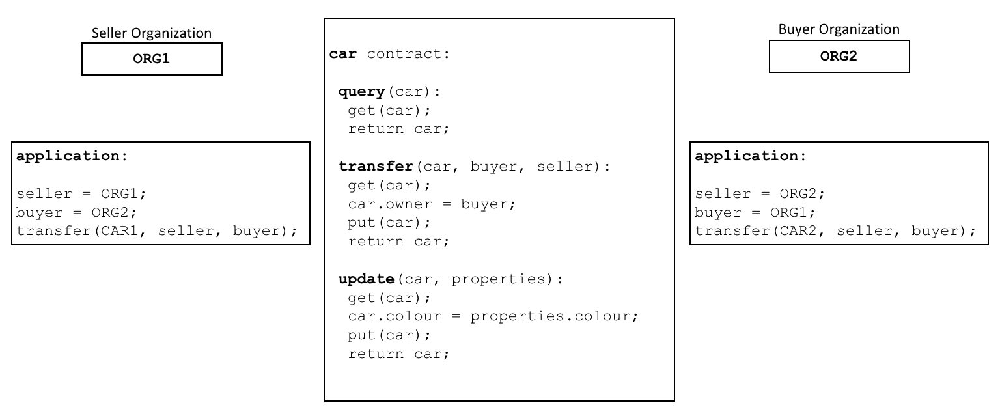
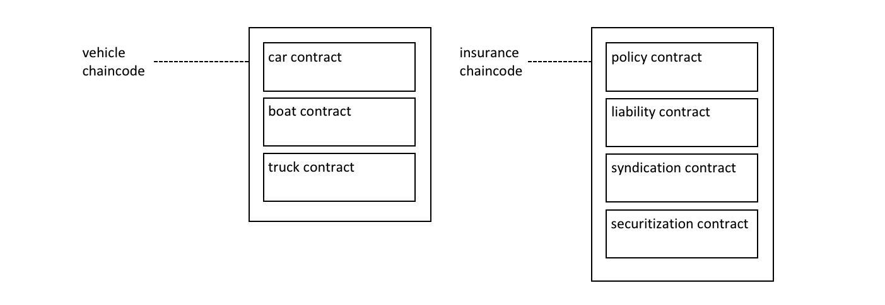
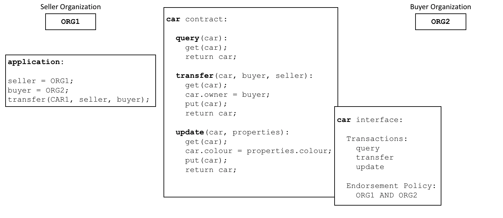
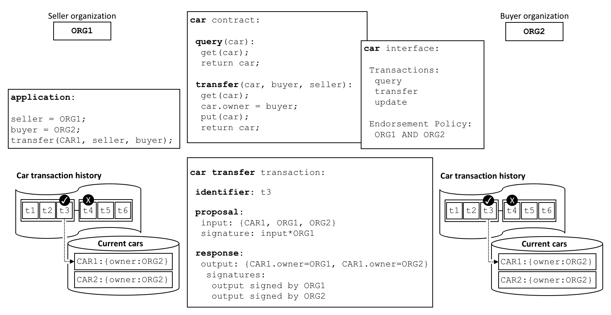
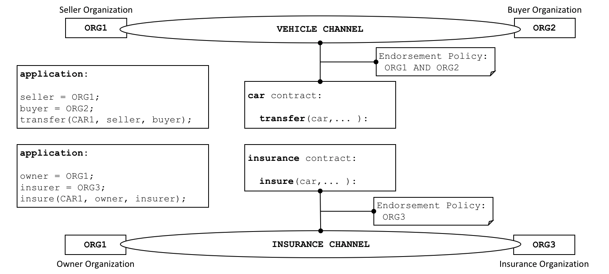

# Smart Contracts and Chaincode

**Audience**: Architects, application and smart contract developers,
administrators

From an application developer's perspective, a **smart contract**, together with
the [ledger](../ledger/ledger.html), form the heart of a Hyperledger Fabric
blockchain system. Whereas a ledger holds facts about the current and historical
state of a set of business objects, a **smart contract** defines the executable
logic that generates new facts that are added to the ledger. A **chaincode**
is typically used by administrators to group related smart contracts for
deployment, but can also be used for low level system programming of Fabric. In
this topic, we'll focus on why both **smart contracts** and **chaincode** exist,
and how and when to use them.

In this topic, we'll cover:

* [What is a smart contract](#smart-contract)
* [A note on terminology](#terminology)
* [Smart contracts and the ledger](#ledger)
* [How to develop a smart contract](#developing)
* [The importance of endorsement policies](#endorsement)
* [Valid transactions](#valid-transactions)
* [Channels and chaincode definitions](#channels)
* [Communicating between smart contracts](#intercommunication)
* [What is system chaincode?](#system-chaincode)

## Smart contract

Before businesses can transact with each other, they must define a common set of
contracts covering common terms, data, rules, concept definitions, and
processes. Taken together, these contracts lay out the **business model** that
govern all of the interactions between transacting parties.

 *A smart contract defines the
rules between different organizations in executable code. Applications invoke a
smart contract to generate transactions that are recorded on the ledger.*

Using a blockchain network, we can turn these contracts into executable programs
-- known in the industry as **smart contracts** -- to open up a wide variety of
new possibilities. That's because a smart contract can implement the governance
rules for **any** type of business object, so that they can be automatically
enforced when the smart contract is executed. For example, a smart contract
might ensure that a new car delivery is made within a specified timeframe, or
that funds are released according to prearranged terms, improving the flow of
goods or capital respectively. Most importantly however, the execution of a
smart contract is much more efficient than a manual human business process.

In the [diagram above](#smart-contract), we can see how two organizations,
`ORG1` and `ORG2` have defined a `car` smart contract to `query`, `transfer` and
`update` cars.  Applications from these organizations invoke this smart contract
to perform an agreed step in a business process, for example to transfer
ownership of a specific car from `ORG1` to `ORG2`.


## Terminology

Hyperledger Fabric users often use the terms **smart contract** and
**chaincode** interchangeably. In general, a smart contract defines the
**transaction logic** that controls the lifecycle of a business object contained
in the world state. It is then packaged into a chaincode which is then deployed
to a blockchain network.  Think of smart contracts as governing transactions,
whereas chaincode governs how smart contracts are packaged for deployment.

 *A smart contract is defined
within a chaincode.  Multiple smart contracts can be defined within the same
chaincode. When a chaincode is deployed, all smart contracts within it are made
available to applications.*

In the diagram, we can see a `vehicle` chaincode that contains three smart
contracts: `cars`, `boats` and `trucks`.  We can also see an `insurance`
chaincode that contains four smart contracts: `policy`, `liability`,
`syndication` and `securitization`.  In both cases these contracts cover key
aspects of the business process relating to vehicles and insurance. In this
topic, we will use the `car` contract as an example. We can see that a smart
contract is a domain specific program which relates to specific business
processes, whereas a chaincode is a technical container of a group of related
smart contracts.


## Ledger

At the simplest level, a blockchain immutably records transactions which update
states in a ledger. A smart contract programmatically accesses two distinct
pieces of the ledger -- a **blockchain**, which immutably records the history of
all transactions, and a **world state** that holds a cache of the current value
of these states, as it's the current value of an object that is usually
required.

Smart contracts primarily **put**, **get** and **delete** states in the world
state, and can also query the immutable blockchain record of transactions.

* A **get** typically represents a query to retrieve information about the
  current state of a business object.
* A **put** typically creates a new business object or modifies an existing one
  in the ledger world state.
* A **delete** typically represents the removal of a business object from the
  current state of the ledger, but not its history.

Smart contracts have many
[APIs](../developapps/transactioncontext.html#structure) available to them.
Critically, in all cases, whether transactions create, read, update or delete
business objects in the world state, the blockchain contains an [immutable
record](../ledger/ledger.html) of these changes.

## Development

Smart contracts are the focus of application development, and as we've seen, one
or more smart contracts can be defined within a single chaincode.  Deploying a
chaincode to a network makes all its smart contracts available to the
organizations in that network. It means that only administrators need to worry
about chaincode; everyone else can think in terms of smart contracts.

At the heart of a smart contract is a set of `transaction` definitions. For
example, look at assetTransfer.js
[here](https://github.com/hyperledger/fabric-samples/blob/{BRANCH}/asset-transfer-basic/chaincode-javascript/lib/assetTransfer.js#L67),
where you can see a smart contract transaction that creates a new asset:

```javascript
    async CreateAsset(ctx, id, color, size, owner, appraisedValue) {
        const asset = {
            ID: id,
            Color: color,
            Size: size,
            Owner: owner,
            AppraisedValue: appraisedValue,
        };
        return ctx.stub.putState(id, Buffer.from(JSON.stringify(asset)));
    }
```

You can learn more about the **Basic** smart contract in the [Writing your
first application](../write_first_app.html) tutorial.

A smart contract can describe an almost infinite array of business use cases
relating to immutability of data in multi-organizational decision making. The
job of a smart contract developer is to take an existing business process that
might govern financial prices or delivery conditions, and express it as
a smart contract in a programming language such as JavaScript, Go, or Java.
The legal and technical skills required to convert centuries of legal language
into programming language is increasingly practiced by **smart contract
auditors**. You can learn about how to design and develop a smart contract in
the [Developing applications
topic](../developapps/developing_applications.html).


## Endorsement

Associated with every chaincode is an endorsement policy that applies to all of
the smart contracts defined within it. An endorsement policy is very important;
it indicates which organizations in a blockchain network must sign a transaction
generated by a given smart contract in order for that transaction to be declared
**valid**.

 *Every smart contract has an
endorsement policy associated with it. This endorsement policy identifies which
organizations must approve transactions generated by the smart contract before
those transactions can be identified as valid.*

An example endorsement policy might define that three of the four organizations
participating in a blockchain network must sign a transaction before it is
considered **valid**. All transactions, whether **valid** or **invalid** are
added to a distributed ledger, but only **valid** transactions update the world
state.

If an endorsement policy specifies that more than one organization must sign a
transaction, then the smart contract must be executed by a sufficient set of
organizations in order for a valid transaction to be generated. In the example
[above](#endorsement), a smart contract transaction to `transfer` a car would
need to be executed and signed by both `ORG1` and `ORG2` for it to be valid.

Endorsement policies are what make Hyperledger Fabric different to other
blockchains like Ethereum or Bitcoin. In these systems valid transactions can be
generated by any node in the network. Hyperledger Fabric more realistically
models the real world; transactions must be validated by trusted organizations
in a network. For example, a government organization must sign a valid
`issueIdentity` transaction, or both the `buyer` and `seller` of a car must sign
a `car` transfer transaction. Endorsement policies are designed to allow
Hyperledger Fabric to better model these types of real-world interactions.

Finally, endorsement policies are just one example of
[policy](../access_control.html#policies) in Hyperledger Fabric. Other policies
can be defined to identify who can query or update the ledger, or add or remove
participants from the network. In general, policies should be agreed in advance
by the consortium of organizations in a blockchain network, although they are
not set in stone. Indeed, policies themselves can define the rules by which they
can be changed. And although an advanced topic, it is also possible to define
[custom endorsement policy](../pluggable_endorsement_and_validation.html) rules
over and above those provided by Fabric.

## Valid transactions

When a smart contract executes, it runs on a peer node owned by an organization
in the blockchain network. The contract takes a set of input parameters called
the **transaction proposal** and uses them in combination with its program logic
to read and write the ledger. Changes to the world state are captured as a
**transaction proposal response** (or just **transaction response**) which
contains a **read-write set** with both the states that have been read, and the
new states that are to be written if the transaction is valid. Notice that the
world state **is not updated when the smart contract is executed**!

 *All transactions have an
identifier, a proposal, and a response signed by a set of organizations. All
transactions are recorded on the blockchain, whether valid or invalid, but only
valid transactions contribute to the world state.*

Examine the `car transfer` transaction. You can see a transaction `t3` for a car
transfer between `ORG1` and `ORG2`. See how the transaction has input `{CAR1,
ORG1, ORG2}` and output `{CAR1.owner=ORG1, CAR1.owner=ORG2}`, representing the
change of owner from `ORG1` to `ORG2`. Notice how the input is signed by the
application's organization `ORG1`, and the output is signed by *both*
organizations identified by the endorsement policy, `ORG1` and `ORG2`.  These
signatures were generated by using each actor's private key, and mean that
anyone in the network can verify that all actors in the network are in agreement
about the transaction details.

A transaction that is distributed to all peer nodes in the network is
**validated** in two phases by each peer. Firstly, the transaction is checked to
ensure it has been signed by sufficient organizations according to the endorsement
policy. Secondly, it is checked to ensure that the current value of the world state
matches the read set of the transaction when it was signed by the endorsing peer
nodes; that there has been no intermediate update. If a transaction passes both
these tests, it is marked as **valid**. All transactions are added to the
blockchain history, whether **valid** or **invalid**, but only **valid**
transactions result in an update to the world state.

In our example, `t3` is a valid transaction, so the owner of `CAR1` has been
updated to `ORG2`. However, `t4` (not shown) is an invalid transaction, so while
it was recorded in the ledger, the world state was not updated, and `CAR2`
remains owned by `ORG2`.

Finally, to understand how to use a smart contract or chaincode with world
state, read the [chaincode namespace
topic](../developapps/chaincodenamespace.html).

## Channels

Hyperledger Fabric allows an organization to simultaneously participate in
multiple, separate blockchain networks via **channels**. By joining multiple
channels, an organization can participate in a so-called **network of networks**.
Channels provide an efficient sharing of infrastructure while maintaining data
and communications privacy. They are independent enough to help organizations
separate their work traffic with different counterparties, but integrated enough
to allow them to coordinate independent activities when necessary.

 *A channel provides a
completely separate communication mechanism between a set of organizations. When
a chaincode definition is committed to a channel, all the smart contracts within
the chaincode are made available to the applications on that channel.*

While the smart contract code is installed inside a chaincode package on an
organizations peers, channel members can only execute a smart contract after
the chaincode has been defined on a channel. The **chaincode definition** is a
struct that contains the parameters that govern how a chaincode operates. These
parameters include the chaincode name, version, and the endorsement policy.
Each channel member agrees to the parameters of a chaincode by approving a
chaincode definition for their organization. When a sufficient number of
organizations (a majority by default) have approved to the same chaincode
definition, the definition can be committed to the channel. The smart contracts
inside the chaincode can then be executed by channel members, subject to the
endorsement policy specified in the chaincode definition. The endorsement policy
applies equally to all smart contracts defined within the same chaincode.

In the example [above](#channels), a `car` contract is defined on the `VEHICLE`
channel, and an `insurance` contract is defined on the `INSURANCE` channel.
The chaincode definition of `car` specifies an endorsement policy that requires
both `ORG1` and `ORG2` to sign transactions before they can be considered valid.
The chaincode definition of the `insurance` contract specifies that only `ORG3`
is required to endorse a transaction. `ORG1` participates in two networks, the
`VEHICLE` channel and the `INSURANCE` network, and can coordinate activity with
`ORG2` and `ORG3` across these two networks.

The chaincode definition provides a way for channel members to agree on the
governance of a chaincode before they start using the smart contract to
transact on the channel. Building on the example above, both `ORG1` and `ORG2`
want to endorse transactions that invoke the `car` contract. Because the default
policy requires that a majority of organizations approve a chaincode definition,
both organizations need to approve an endorsement policy of `AND{ORG1,ORG2}`.
Otherwise, `ORG1` and `ORG2` would approve different chaincode definitions and
would be unable to commit the chaincode definition to the channel as a result.
This process guarantees that a transaction from the `car` smart contract needs
to be approved by both organizations.

## Intercommunication

A Smart Contract can call other smart contracts both within the same
channel and across different channels. It this way, they can read and write
world state data to which they would not otherwise have access due to smart
contract namespaces.

There are limitations to this inter-contract communication, which are described
fully in the [chaincode namespace](../developapps/chaincodenamespace.html#cross-chaincode-access) topic.

## System chaincode

The smart contracts defined within a chaincode encode the domain dependent rules
for a business process agreed between a set of blockchain organizations.
However, a chaincode can also define low-level program code which corresponds to
domain independent *system* interactions, unrelated to these smart contracts
for business processes.

The following are the different types of system chaincodes and their associated
abbreviations:

* `_lifecycle` runs in all peers and manages the installation of chaincode on
  your peers, the approval of chaincode definitions for your organization, and
  the committing of chaincode definitions to channels. You can read more about
  how `_lifecycle` implements the Fabric chaincode lifecycle [process](../chaincode_lifecycle.html).

* Lifecycle system chaincode (LSCC) manages the chaincode lifecycle for the
  1.x releases of Fabric. This version of lifecycle required that chaincode be
  instantiated or upgraded on channels. You can still use LSCC to manage your
  chaincode if you have the channel application capability set to V1_4_x or below.

* **Configuration system chaincode (CSCC)** runs in all peers to handle changes to a
  channel configuration, such as a policy update.  You can read more about this
  process in the following chaincode
  [topic](../configtx.html#configuration-updates).

* **Query system chaincode (QSCC)** runs in all peers to provide ledger APIs which
  include block query, transaction query etc. You can read more about these
  ledger APIs in the transaction context
  [topic](../developapps/transactioncontext.html).

* **Endorsement system chaincode (ESCC)** runs in endorsing peers to
  cryptographically sign a transaction response. You can read more about how
  the ESCC implements this [process](../peers/peers.html#phase-1-proposal).

* **Validation system chaincode (VSCC)** validates a transaction, including checking
  endorsement policy and read-write set versioning. You can read more about the
  VSCC implements this [process](../peers/peers.html#phase-3-validation).

It is possible for low level Fabric developers and administrators to modify
these system chaincodes for their own uses. However, the development and
management of system chaincodes is a specialized activity, quite separate from
the development of smart contracts, and is not normally necessary. Changes to
system chaincodes must be handled with extreme care as they are fundamental to
the correct functioning of a Hyperledger Fabric network. For example, if a
system chaincode is not developed correctly, one peer node may update its copy
of the world state or blockchain differently compared to another peer node. This
lack of consensus is one form of a **ledger fork**, a very undesirable situation.

<!--- Licensed under Creative Commons Attribution 4.0 International License
https://creativecommons.org/licenses/by/4.0/ -->
