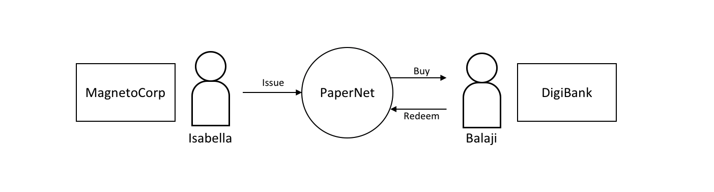
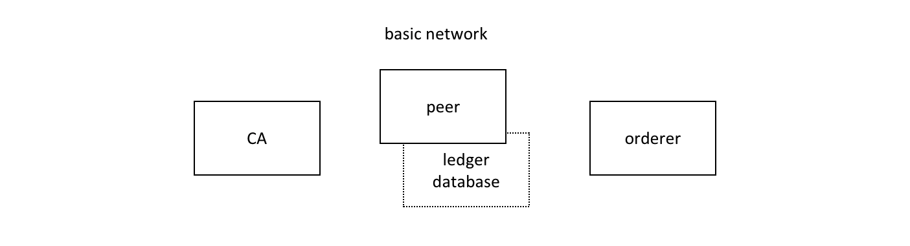
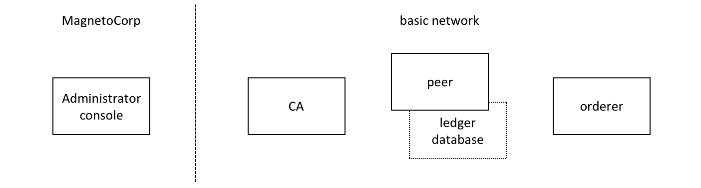
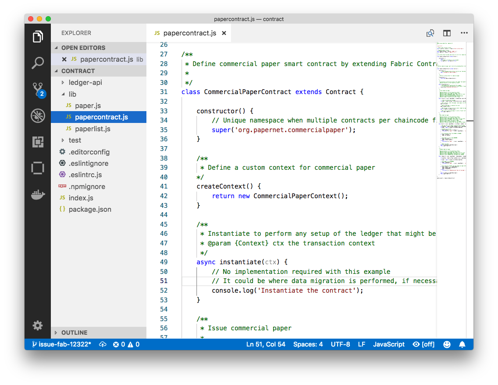
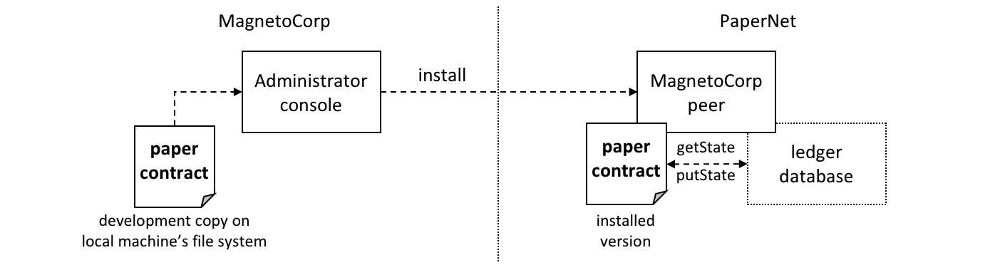
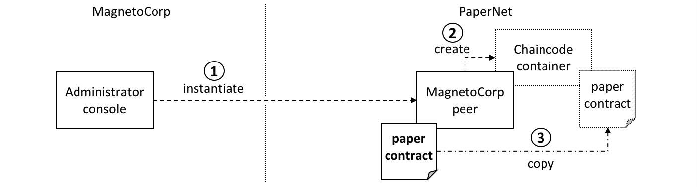
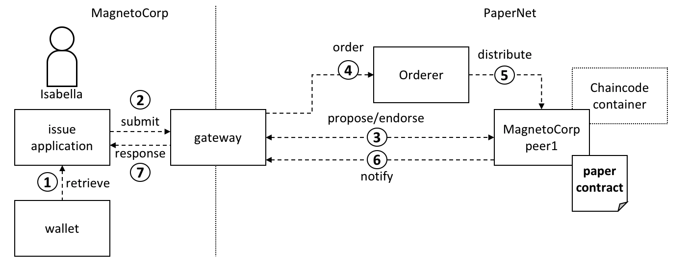
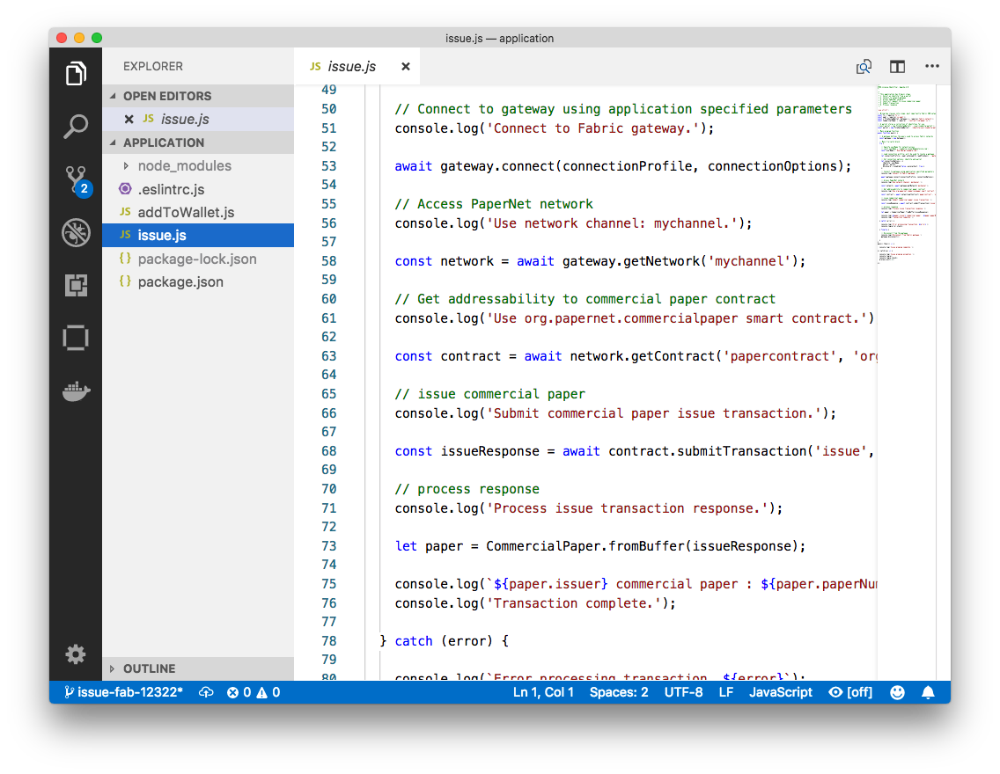
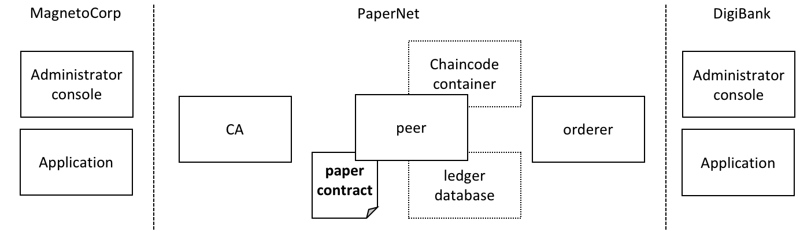
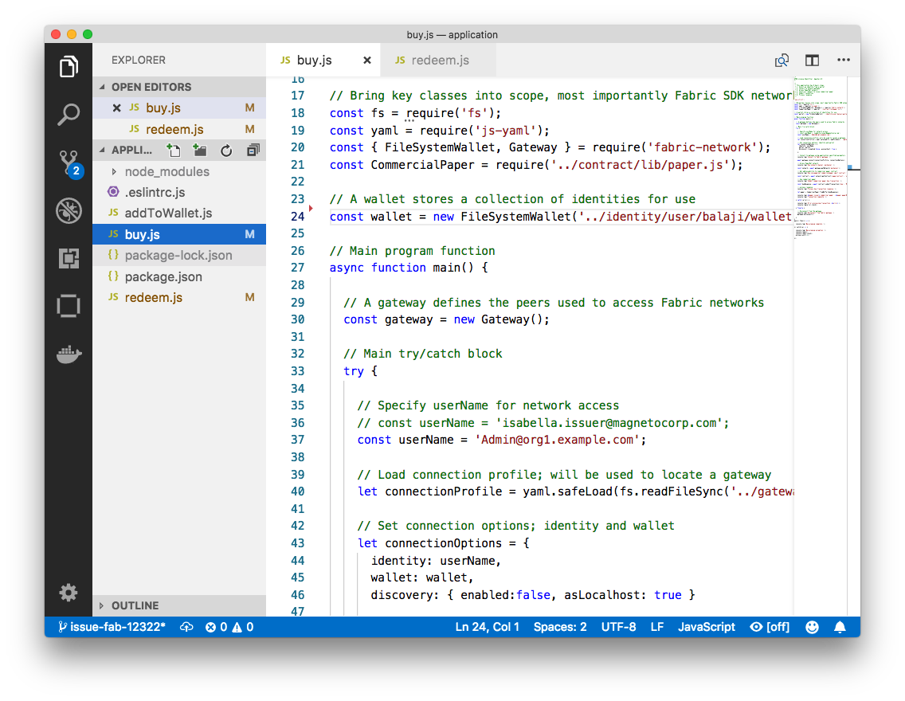

# Commercial paper tutorial

**Audience:** Architects, application and smart contract developers,
administrators

This tutorial will show you how to install and use a commercial paper sample
application and smart contract. It is a task-oriented topic, so it emphasizes
procedures above concepts. When you’d like to understand the concepts in more
detail, you can read the
[Developing Applications](../developapps/developing_applications.html) topic.

 *In this tutorial
two organizations, MagnetoCorp and DigiBank, trade commercial paper with each
other using PaperNet, a Hyperledger Fabric blockchain network.*

Once you've set up a basic network, you'll act as Isabella, an employee of
MagnetoCorp, who will issue a commercial paper on its behalf. You'll then switch
hats to take the role of Balaji, an employee of DigiBank, who will buy this
commercial paper, hold it for a period of time, and then redeem it with
MagnetoCorp for a small profit.

You'll act as an developer, end user, and administrator, each in different
organizations, performing the following steps designed to help you understand
what it's like to collaborate as two different organizations working
independently, but according to mutually agreed rules in a Hyperledger Fabric
network.

* [Set up machine](#prerequisites) and [download samples](#download-samples)
* [Create a network](#create-network)
*  Understand the structure of a [smart contract](#smart-contract)
* Work as an organization, [MagnetoCorp](#working-as-magnetocorp), to
  [install](#install-contract) and [instantiate](#instantiate-contract) smart
  contract
* Understand the structure of a MagnetoCorp
  [application](#application-structure), including its
  [dependencies](#application-dependencies)
* Configure and use a [wallet and identities](#wallet)
* Run a MagnetoCorp application to [issue a commercial
  paper](#issue-application)
* Understand how a second organization, [Digibank](#working-as-digibank), uses
  the smart contract in their [applications](#digibank-applications)
* As Digibank, [run](#run-as-digibank) applications that
  [buy](#buy-application) and [redeem](#redeem-application) commercial paper

This tutorial has been tested on MacOS and Ubuntu, and should work on other
Linux distributions. A Windows version is under development.

## Prerequisites

Before you start, you must install some prerequisite technology required by the
tutorial. We've kept these to a minimum so that you can get going quickly.

You **must** have the following technologies installed:

  * [**Node**](https://nodejs.org/en/about/) version 8.9.0, or higher. Node is
    a JavaScript runtime that you can use to run applications and smart
    contracts. You are recommended to use the LTS (Long Term Support) version
    of node. Install node [here](https://nodejs.org/en/).


  * [**Docker**](https://www.docker.com/get-started) version 18.06, or higher.
    Docker help developers and administrators create standard environments for
    building and running applications and smart contracts. Hyperledger Fabric is
    provided as a set of Docker images, and the PaperNet smart contract will run
    in a docker container. Install Docker
    [here](https://www.docker.com/get-started).

You **will** find it helpful to install the following technologies:

  * A source code editor, such as
    [**Visual Studio Code**](https://code.visualstudio.com/) version 1.28, or
    higher. VS Code will help you develop and test your application and smart
    contract. Install VS Code [here](https://code.visualstudio.com/Download).

    Many excellent code editors are available including
    [Atom](https://atom.io/), [Sublime Text](http://www.sublimetext.com/) and
    [Brackets](http://www.sublimetext.com/).

You **may** find it helpful to install the following technologies as you become
more experienced with application and smart contract development. There's no
requirement to install these when you first run the tutorial:

  * [**Node Version Manager**](https://github.com/creationix/nvm). NVM helps you
    easily switch between different versions of node -- it can be really helpful
    if you're working on multiple projects at the same time. Install NVM
    [here](https://github.com/creationix/nvm#installation).

## Download samples

The commercial paper tutorial is one of the Hyperledger Fabric
[samples](https://github.com/hyperledger/fabric-samples) held in a public
[GitHub](https://www.github.com) repository called `fabric-samples`. As you're
going to run the tutorial on your machine, your first task is to download the
`fabric-samples` repository.

 *Download the
`fabric-samples` GitHub repository to your local machine.*

`$GOPATH` is an important environment variable in Hyperledger Fabric; it
identifies the root directory for installation. It is important to get right no
matter which programming language you're using! Open a new terminal window and
check your `$GOPATH` is set using the `env` command:

```
$ env
...
GOPATH=/Users/username/go
NVM_BIN=/Users/username/.nvm/versions/node/v8.11.2/bin
NVM_IOJS_ORG_MIRROR=https://iojs.org/dist
...
```

Use the following
[instructions](https://github.com/golang/go/wiki/SettingGOPATH) if your
`$GOPATH` is not set.

You can now create a directory relative to `$GOPATH `where `fabric-samples` will
be installed:

```
$ mkdir -p $GOPATH/src/github.com/hyperledger/
$ cd $GOPATH/src/github.com/hyperledger/
```

Use the [`git clone`](https://git-scm.com/docs/git-clone) command to copy
[`fabric-samples`](https://github.com/hyperledger/fabric-samples) repository to
this location:

```
$ git clone https://github.com/hyperledger/fabric-samples.git
```

Feel free to examine the directory structure of `fabric-samples`:

```
$ cd fabric-samples
$ ls

CODE_OF_CONDUCT.md    balance-transfer            fabric-ca
CONTRIBUTING.md       basic-network               first-network
Jenkinsfile           chaincode                   high-throughput
LICENSE               chaincode-docker-devmode    scripts
MAINTAINERS.md        commercial-paper            README.md
fabcar
```

Notice the `commercial-paper` directory -- that's where our sample is located!

You've now completed the first stage of the tutorial! As you proceed, you'll
open multiple command windows open for different users and components. For
example:

* to run applications on behalf of Isabella and Balaji who will trade commercial
  paper with each other
* to issue commands to on behalf of administrators from MagnetoCorp and
  DigiBank, including installing and instantiating smart contracts
* to show peer, orderer and CA log output

We'll make it clear when you should run a command from particular command
window; for example:

```
(isabella)$ ls
```

indicates that you should run the `ls` command from Isabella's window.

## Create network

The tutorial currently uses the basic network; it will be updated soon to a
configuration which better reflects the multi-organization structure of
PaperNet. For now, this network is sufficient to show you how to develop an
application and smart contract.

 *The Hyperledger
Fabric basic network comprises a peer and its ledger database, an orderer and a
certificate authority (CA). Each of these components runs as a docker
container.*

The peer, its [ledger](../ledger/ledger.html#world-state-database-options), the
orderer and the CA each run in the their own docker container. In production
environments, organizations typically use existing CAs that are shared with
other systems; they're not dedicated to the Fabric network.

You can manage the basic network using the commands and configuration included
in the `fabric-samples\basic-network` directory. Let's start the network on your
local machine with the `start.sh` shell script:

```
$ cd fabric-samples/basic-network
$ ./start.sh

docker-compose -f docker-compose.yml up -d ca.example.com orderer.example.com peer0.org1.example.com couchdb
Creating network "net_basic" with the default driver
Pulling ca.example.com (hyperledger/fabric-ca:)...
latest: Pulling from hyperledger/fabric-ca
3b37166ec614: Pull complete
504facff238f: Pull complete
(...)
Pulling orderer.example.com (hyperledger/fabric-orderer:)...
latest: Pulling from hyperledger/fabric-orderer
3b37166ec614: Already exists
504facff238f: Already exists
(...)
Pulling couchdb (hyperledger/fabric-couchdb:)...
latest: Pulling from hyperledger/fabric-couchdb
3b37166ec614: Already exists
504facff238f: Already exists
(...)
Pulling peer0.org1.example.com (hyperledger/fabric-peer:)...
latest: Pulling from hyperledger/fabric-peer
3b37166ec614: Already exists
504facff238f: Already exists
(...)
Creating orderer.example.com ... done
Creating couchdb             ... done
Creating ca.example.com         ... done
Creating peer0.org1.example.com ... done
(...)
2018-11-07 13:47:31.634 UTC [channelCmd] InitCmdFactory -> INFO 001 Endorser and orderer connections initialized
2018-11-07 13:47:31.730 UTC [channelCmd] executeJoin -> INFO 002 Successfully submitted proposal to join channel
```

Notice how the `docker-compose -f docker-compose.yml up -d ca.example.com...`
command pulls the four Hyperledger Fabric container images from
[DockerHub](https://hub.docker.com/), and then starts them. These containers
have the most up-to-date version of the software for these Hyperledger Fabric
components. Feel free to explore the `basic-network` directory -- we'll use
much of its contents during this tutorial.

You can list the docker containers that are running the basic-network components
using the `docker ps` command:

```
$ docker ps

CONTAINER ID        IMAGE                        COMMAND                  CREATED              STATUS              PORTS                                            NAMES
ada3d078989b        hyperledger/fabric-peer      "peer node start"        About a minute ago   Up About a minute   0.0.0.0:7051->7051/tcp, 0.0.0.0:7053->7053/tcp   peer0.org1.example.com
1fa1fd107bfb        hyperledger/fabric-orderer   "orderer"                About a minute ago   Up About a minute   0.0.0.0:7050->7050/tcp                           orderer.example.com
53fe614274f7        hyperledger/fabric-couchdb   "tini -- /docker-ent…"   About a minute ago   Up About a minute   4369/tcp, 9100/tcp, 0.0.0.0:5984->5984/tcp       couchdb
469201085a20        hyperledger/fabric-ca        "sh -c 'fabric-ca-se…"   About a minute ago   Up About a minute   0.0.0.0:7054->7054/tcp                           ca.example.com
```

See if you can map these containers to the basic-network (you may need to
horizontally scroll to locate the information):

* A peer `peer0.org1.example.com` is running in container `ada3d078989b`
* An orderer `orderer.example.com` is running in container `1fa1fd107bfb`
* A CouchDB database `couchdb` is running in container `53fe614274f7`
* A CA `ca.example.com` is running in container `469201085a20`

These containers all form a [docker network](https://docs.docker.com/network/)
called `net_basic`. You can view the network with the `docker network` command:

```
$ docker network inspect net_basic

    {
        "Name": "net_basic",
        "Id": "62e9d37d00a0eda6c6301a76022c695f8e01258edaba6f65e876166164466ee5",
        "Created": "2018-11-07T13:46:30.4992927Z",
        "Containers": {
            "1fa1fd107bfbe61522e4a26a57c2178d82b2918d5d423e7ee626c79b8a233624": {
                "Name": "orderer.example.com",
                "IPv4Address": "172.20.0.4/16",
            },
            "469201085a20b6a8f476d1ac993abce3103e59e3a23b9125032b77b02b715f2c": {
                "Name": "ca.example.com",
                "IPv4Address": "172.20.0.2/16",
            },
            "53fe614274f7a40392210f980b53b421e242484dd3deac52bbfe49cb636ce720": {
                "Name": "couchdb",
                "IPv4Address": "172.20.0.3/16",
            },
            "ada3d078989b568c6e060fa7bf62301b4bf55bed8ac1c938d514c81c42d8727a": {
                "Name": "peer0.org1.example.com",
                "IPv4Address": "172.20.0.5/16",
            }
        },
        "Labels": {}
    }
```

See how the four containers use different IP addresses, while being part of a
single docker network. (We've abbreviated the output for clarity.)

To recap: you've downloaded the Hyperledger Fabric samples repository from
GitHub and you've got the basic network running on your local machine. Let's now
start to play the role of MagnetoCorp, who wish to trade commercial paper.

## Working as MagnetoCorp

To monitor the MagnetoCorp components of PaperNet, an administrator can view the
aggregated output from a set of docker containers using the `logspout`
[tool](https://github.com/gliderlabs/logspout#logspout). It collects the
different output streams into one place, making it easy to see what's happening
from a single window. This can be really helpful for administrators when
installing smart contracts or for developers when invoking smart contracts, for
example.

Let's now monitor PaperNet as a MagnetoCorp administrator. Open a new window in
the `fabric-samples` directory, and locate and run the `monitordocker.sh`
script to start the `logspout` tool for the PaperNet docker containers
associated with the docker network `net_basic`:

```
(magnetocorp admin)$ cd commercial-paper/organization/magnetocorp/configuration/cli/
(magnetocorp admin)$ ./monitordocker.sh net_basic
...
latest: Pulling from gliderlabs/logspout
4fe2ade4980c: Pull complete
decca452f519: Pull complete
(...)
Starting monitoring on all containers on the network net_basic
b7f3586e5d0233de5a454df369b8eadab0613886fc9877529587345fc01a3582
```

Note that you can pass a port number to the above command if the default port in `monitordocker.sh` is already in use.
```
(magnetocorp admin)$ ./monitordocker.sh net_basic <port_number>
```

This window will now show output from the docker containers, so let's start
another terminal window which will allow the MagnetoCorp administrator to
interact with the network.

 *A MagnetoCorp
administrator interacts with the network via a docker container.*

To interact with PaperNet, a MagnetoCorp administrator needs to use the
Hyperledger Fabric `peer` commands. Conveniently, these are available pre-built
in the `hyperledger/fabric-tools`
[docker image](https://hub.docker.com/r/hyperledger/fabric-tools/).

Let's start a MagnetoCorp-specific docker container for the administrator using
the `docker-compose` [command](https://docs.docker.com/compose/overview/):

```
(magnetocorp admin)$ cd commercial-paper/organization/magnetocorp/configuration/cli/
(magnetocorp admin)$ docker-compose -f docker-compose.yml up -d cliMagnetoCorp

Pulling cliMagnetoCorp (hyperledger/fabric-tools:)...
latest: Pulling from hyperledger/fabric-tools
3b37166ec614: Already exists
(...)
Digest: sha256:058cff3b378c1f3ebe35d56deb7bf33171bf19b327d91b452991509b8e9c7870
Status: Downloaded newer image for hyperledger/fabric-tools:latest
Creating cliMagnetoCorp ... done
```

Again, see how the `hyperledger/fabric-tools` docker image was retrieved from
Docker Hub and added to the network:

```
(magnetocorp admin)$ docker ps

CONTAINER ID        IMAGE                        COMMAND                  CREATED              STATUS              PORTS                                            NAMES
562a88b25149        hyperledger/fabric-tools     "/bin/bash"              About a minute ago   Up About a minute                                                    cliMagnetoCorp
b7f3586e5d02        gliderlabs/logspout          "/bin/logspout"          7 minutes ago        Up 7 minutes        127.0.0.1:8000->80/tcp                           logspout
ada3d078989b        hyperledger/fabric-peer      "peer node start"        29 minutes ago       Up 29 minutes       0.0.0.0:7051->7051/tcp, 0.0.0.0:7053->7053/tcp   peer0.org1.example.com
1fa1fd107bfb        hyperledger/fabric-orderer   "orderer"                29 minutes ago       Up 29 minutes       0.0.0.0:7050->7050/tcp                           orderer.example.com
53fe614274f7        hyperledger/fabric-couchdb   "tini -- /docker-ent…"   29 minutes ago       Up 29 minutes       4369/tcp, 9100/tcp, 0.0.0.0:5984->5984/tcp       couchdb
469201085a20        hyperledger/fabric-ca        "sh -c 'fabric-ca-se…"   29 minutes ago       Up 29 minutes       0.0.0.0:7054->7054/tcp                           ca.example.com
```

The MagnetoCorp administrator will use the command line in container
`562a88b25149` to interact with PaperNet. Notice also the `logspout` container
`b7f3586e5d02`; this is capturing the output of all other docker containers for
the `monitordocker.sh` command.

Let's now use this command line to interact with PaperNet as the MagnetoCorp
administrator.

## Smart contract

`issue`, `buy` and `redeem` are the three functions at the heart of the PaperNet
smart contract. It is used by applications to submit transactions which
correspondingly issue, buy and redeem commercial paper on the ledger. Our next
task is to examine this smart contract.

Open a new terminal window to represent a MagnetoCorp developer and change to
the directory that contains MagnetoCorp's copy of the smart contract to view it
with your chosen editor (VS Code in this tutorial):

```
(magnetocorp developer)$ cd commercial-paper/organization/magnetocorp/contract
(magnetocorp developer)$ code .
```

In the `lib` directory of the folder, you'll see `papercontract.js` file -- this
contains the commercial paper smart contract!

 *An example code
editor displaying the commercial paper smart contract in `papercontract.js`*

`papercontract.js` is a JavaScript program designed to run in the node.js
environment. Note the following key program lines:

* `const { Contract, Context } = require('fabric-contract-api');`

  This statement brings into scope two key Hyperledger Fabric classes that will
  be used extensively by the smart contract  -- `Contract` and `Context`. You
  can learn more about these classes in the
  [`fabric-shim` JSDOCS](https://hyperledger.github.io/fabric-chaincode-node/).


* `class CommercialPaperContract extends Contract {`

  This defines the smart contract class `CommercialPaperContract` based on the
  built-in Fabric `Contract` class.  The methods which implement the key
  transactions to `issue`, `buy` and `redeem` commercial paper are defined
  within this class.


* `async issue(ctx, issuer, paperNumber, issueDateTime, maturityDateTime...) {`

  This method defines the commercial paper `issue` transaction for PaperNet. The
  parameters that are passed to this method will be used to create the new
  commercial paper.

  Locate and examine the `buy` and `redeem` transactions within the smart
  contract.


* `let paper = CommercialPaper.createInstance(issuer, paperNumber, issueDateTime...);`

  Within the `issue` transaction, this statement creates a new commercial paper
  in memory using the `CommercialPaper` class with the supplied transaction
  inputs. Examine the `buy` and `redeem` transactions to see how they similarly
  use this class.


* `await ctx.paperList.addPaper(paper);`

  This statement adds the new commercial paper to the ledger using
  `ctx.paperList`, an instance of a `PaperList` class that was created when the
  smart contract context `CommercialPaperContext` was initialized. Again,
  examine the `buy` and `redeem` methods to see how they use this class.


* `return paper;`

  This statement returns a binary buffer as response from the `issue`
  transaction for processing by the caller of the smart contract.


Feel free to examine other files in the `contract` directory to understand how
the smart contract works, and read in detail how `papercontract.js` is
designed in the smart contract [topic](../developapps/smartcontract.html).

## Install contract

Before `papercontract` can be invoked by applications, it must be installed onto
the appropriate peer nodes in PaperNet.  MagnetoCorp and DigiBank administrators
are able to install `papercontract` onto peers over which they respectively have
authority.

 *A MagnetoCorp
administrator installs a copy of the `papercontract` onto a MagnetoCorp peer.*

Smart contracts are the focus of application development, and are contained
within a Hyperledger Fabric artifact called [chaincode](../chaincode.html). One
or more smart contracts can be defined within a single chaincode, and installing
a chaincode will allow them to be consumed by the different organizations in
PaperNet.  It means that only administrators need to worry about chaincode;
everyone else can think in terms of smart contracts.

The MagnetoCorp administrator uses the `peer chaincode install` command to copy
the `papercontract` smart contract from their local machine's file system to the
file system within the target peer's docker container. Once the smart contract
is installed on the peer and instantiated on a channel,
`papercontract` can be invoked by applications, and interact with the ledger
database via the
[putState()](https://hyperledger.github.io/fabric-chaincode-node/release-1.4/api/fabric-shim.ChaincodeStub.html#putState__anchor)
and
[getState()](https://hyperledger.github.io/fabric-chaincode-node/release-1.4/api/fabric-shim.ChaincodeStub.html#getState__anchor)
Fabric APIs. Examine how these APIs are used by `StateList` class within
`ledger-api\statelist.js`.

Let's now install `papercontract` as the MagnetoCorp administrator. In the
MagnetoCorp administrator's command window, use the `docker exec` command to run
the `peer chaincode install` command in the `cliMagnetCorp` container:

```
(magnetocorp admin)$ docker exec cliMagnetoCorp peer chaincode install -n papercontract -v 0 -p /opt/gopath/src/github.com/contract -l node

2018-11-07 14:21:48.400 UTC [chaincodeCmd] checkChaincodeCmdParams -> INFO 001 Using default escc
2018-11-07 14:21:48.400 UTC [chaincodeCmd] checkChaincodeCmdParams -> INFO 002 Using default vscc
2018-11-07 14:21:48.466 UTC [chaincodeCmd] install -> INFO 003 Installed remotely response:<status:200 payload:"OK" >
```

The `cliMagnetCorp` container has set
`CORE_PEER_ADDRESS=peer0.org1.example.com:7051` to target its commands to
`peer0.org1.example.com`, and the `INFO 003 Installed remotely...` indicates
`papercontract` has been successfully installed on this peer. Currently, the
MagnetoCorp administrator only has to install a copy of `papercontract` on a
single MagentoCorp peer.

Note how `peer chaincode install` command specified the smart contract path,
`-p`, relative to the `cliMagnetoCorp` container's file system:
`/opt/gopath/src/github.com/contract`. This path has been mapped to the local
file system path `.../organization/magnetocorp/contract` via the
`magnetocorp/configuration/cli/docker-compose.yml` file:

```yaml
volumes:
    - ...
    - ./../../../../organization/magnetocorp:/opt/gopath/src/github.com/
    - ...
```

See how the `volume` directive maps `organization/magnetocorp` to
`/opt/gopath/src/github.com/` providing this container access to your local file
system where MagnetoCorp's copy of the `papercontract` smart contract is held.

You can read more about `docker compose`
[here](https://docs.docker.com/compose/overview/) and `peer chaincode install`
command [here](../commands/peerchaincode.html).

## Instantiate contract

Now that `papercontract` chaincode containing the `CommercialPaper` smart
contract is installed on the required PaperNet peers, an administrator can make
it available to different network channels, so that it can be invoked by
applications connected to those channels. Because we're using the basic network
configuration for PaperNet, we're only going to make `papercontract` available
in a single network channel, `mychannel`.

 *A MagnetoCorp
administrator instantiates `papercontract` chaincode containing the smart
contract. A new docker chaincode container will be created to run
`papercontract`.*

The MagnetoCorp administrator uses the `peer chaincode instantiate` command to
instantiate `papercontract` on `mychannel`:

```
(magnetocorp admin)$ docker exec cliMagnetoCorp peer chaincode instantiate -n papercontract -v 0 -l node -c '{"Args":["org.papernet.commercialpaper:instantiate"]}' -C mychannel -P "AND ('Org1MSP.member')"

2018-11-07 14:22:11.162 UTC [chaincodeCmd] InitCmdFactory -> INFO 001 Retrieved channel (mychannel) orderer endpoint: orderer.example.com:7050
2018-11-07 14:22:11.163 UTC [chaincodeCmd] checkChaincodeCmdParams -> INFO 002 Using default escc
2018-11-07 14:22:11.163 UTC [chaincodeCmd] checkChaincodeCmdParams -> INFO 003 Using default vscc
```

One of the most important parameters on `instantiate` is `-P`. It specifies the
[endorsement policy](../endorsement-policies.html) for `papercontract`,
describing the set of organizations that must endorse (execute and sign) a
transaction before it can be determined as valid. All transactions, whether
valid or invalid, will be recorded on the [ledger blockchain](../ledger/ledger.html#blockchain),
but only valid transactions will update the [world
state](../ledger/ledger.html#world-state).

In passing, see how `instantiate` passes the orderer address
`orderer.example.com:7050`. This is because it additionally submits an
instantiate transaction to the orderer, which will include the transaction
in the next block and distribute it to all peers that have joined
`mychannel`, enabling any peer to execute the chaincode in their own
isolated chaincode container. Note that `instantiate` only needs to be issued
once for `papercontract` even though typically it is installed on many peers.

See how a `papercontract` container has been started with the `docker ps`
command:

```
(magnetocorp admin)$ docker ps

CONTAINER ID        IMAGE                                              COMMAND                  CREATED             STATUS              PORTS          NAMES
4fac1b91bfda        dev-peer0.org1.example.com-papercontract-0-d96...  "/bin/sh -c 'cd /usr…"   2 minutes ago       Up 2 minutes                       dev-peer0.org1.example.com-papercontract-0
```

Notice that the container is named
`dev-peer0.org1.example.com-papercontract-0-d96...` to indicate which peer
started it, and the fact that it's running `papercontract` version `0`.

Now that we've got a basic PaperNet up and running, and `papercontract`
installed and instantiated, let's turn our attention to the MagnetoCorp
application which issues a commercial paper.

## Application structure

The smart contract contained in `papercontract` is called by MagnetoCorp's
application `issue.js`. Isabella uses this application to submit a transaction
to the ledger which issues commercial paper `00001`. Let's quickly examine how
the `issue` application works.

 *A gateway
allows an application to focus on transaction generation, submission and
response. It coordinates transaction proposal, ordering and notification
processing between the different network components.*

Because the `issue` application submits transactions on behalf of Isabella, it
starts by retrieving Isabella's X.509 certificate from her
[wallet](../developapps/wallet.html), which might be stored on the local file
system or a Hardware Security Module
[HSM](https://en.wikipedia.org/wiki/Hardware_security_module). The `issue`
application is then able to utilize the gateway to submit transactions on the
channel. The Hyperledger Fabric SDK provides a
[gateway](../developapps/gateway.html) abstraction so that applications can
focus on application logic while delegating network interaction to the
gateway. Gateways and wallets make it straightforward to write Hyperledger
Fabric applications.

So let's examine the `issue` application that Isabella is going to use. open a
separate terminal window for her, and in `fabric-samples` locate the MagnetoCorp
`/application` folder:

```
(magnetocorp user)$ cd commercial-paper/organization/magnetocorp/application/
(magnetocorp user)$ ls

addToWallet.js		issue.js		package.json
```

`addToWallet.js` is the program that Isabella is going to use to load her
identity into her wallet, and `issue.js` will use this identity to create
commercial paper `00001` on behalf of MagnetoCorp by invoking `papercontract`.

Change to the directory that contains MagnetoCorp's copy of the application
`issue.js`, and use your code editor to examine it:

```
(magnetocorp user)$ cd commercial-paper/organization/magnetocorp/application
(magnetocorp user)$ code issue.js
```

Examine this directory; it contains the issue application and all its
dependencies.

 *A code editor
displaying the contents of the commercial paper application directory.*

Note the following key program lines in `issue.js`:

* `const { FileSystemWallet, Gateway } = require('fabric-network');`

  This statement brings two key Hyperledger Fabric SDK classes into scope --
  `Wallet` and `Gateway`. Because Isabella's X.509 certificate is in the local
  file system, the application uses `FileSystemWallet`.


* `const wallet = new FileSystemWallet('../identity/user/isabella/wallet');`

  This statement identifies that the application will use `isabella` wallet when
  it connects to the blockchain network channel. The application will select a
  particular identity within `isabella` wallet. (The wallet must have been
  loaded with the Isabella's X.509 certificate -- that's what `addToWallet.js`
  does.)


* `await gateway.connect(connectionProfile, connectionOptions);`

  This line of code connects to the network using the gateway identified by
  `connectionProfile`, using the identity referred to in `ConnectionOptions`.

  See how `../gateway/networkConnection.yaml` and `User1@org1.example.com` are
  used for these values respectively.


* `const network = await gateway.getNetwork('mychannel');`

  This connects the application to the network channel `mychannel`, where the
  `papercontract` was previously instantiated.


*  `const contract = await network.getContract('papercontract');`

  This statement gives the application access to the `papercontract` chaincode.
  Once an application has issued getContract, it can submit to any smart contract
  transaction implemented within the chaincode.


* `const issueResponse = await contract.submitTransaction('issue', 'MagnetoCorp', '00001'...);`

  This line of code submits the a transaction to the network using the `issue`
  transaction defined within the smart contract. `MagnetoCorp`, `00001`... are
  the values to be used by the `issue` transaction to create a new commercial
  paper.

* `let paper = CommercialPaper.fromBuffer(issueResponse);`

  This statement processes the response from the `issue` transaction. The
  response needs to deserialized from a buffer into `paper`, a `CommercialPaper`
  object which can interpreted correctly by the application.


Feel free to examine other files in the `/application` directory to understand
how `issue.js` works, and read in detail how it is implemented in the
application [topic](../developapps/application.html).

## Application dependencies

The `issue.js` application is written in JavaScript and designed to run in the
node.js environment that acts as a client to the PaperNet network.
As is common practice, MagnetoCorp's application is built on many
external node packages -- to improve quality and speed of development. Consider
how `issue.js` includes the `js-yaml`
[package](https://www.npmjs.com/package/js-yaml) to process the YAML gateway
connection profile, or the `fabric-network`
[package](https://www.npmjs.com/package/fabric-network) to access the `Gateway`
and `Wallet` classes:

```JavaScript
const yaml = require('js-yaml');
const { FileSystemWallet, Gateway } = require('fabric-network');
```

These packages have to be downloaded from [npm](https://www.npmjs.com/) to the
local file system using the `npm install` command. By convention, packages must
be installed into an application-relative `/node_modules` directory for use at
runtime.

Examine the `package.json` file to see how `issue.js` identifies the packages to
download and their exact versions:

```json
  "dependencies": {
    "fabric-network": "^1.4.0",
    "fabric-client": "^1.4.0",
    "js-yaml": "^3.12.0"
  },
```

**npm** versioning is very powerful; you can read more about it
[here](https://docs.npmjs.com/getting-started/semantic-versioning).

Let's install these packages with the `npm install` command -- this may take up
to a minute to complete:

```
(magnetocorp user)$ npm install

(           ) extract:lodash: sill extract ansi-styles@3.2.1
(...)
added 738 packages in 46.701s
```

See how this command has updated the directory:

```
(magnetocorp user)$ ls

addToWallet.js		node_modules	      	package.json
issue.js	      	package-lock.json
```

Examine the `node_modules` directory to see the packages that have been
installed. There are lots, because `js-yaml` and `fabric-network` are themselves
built on other npm packages! Helpfully, the `package-lock.json`
[file](https://docs.npmjs.com/files/package-lock.json) identifies the exact
versions installed, which can prove invaluable if you want to exactly reproduce
environments; to test, diagnose problems or deliver proven applications for
example.

## Wallet

Isabella is almost ready to run `issue.js` to issue MagnetoCorp commercial paper
`00001`; there's just one remaining task to perform! As `issue.js` acts on
behalf of Isabella, and therefore MagnetoCorp, it will use identity from her
[wallet](../developapps/wallet.html) that reflects these facts. We now need to
perform this one-time activity of adding appropriate X.509 credentials to her
wallet.

In Isabella's terminal window, run the `addToWallet.js` program to add identity
information to her wallet:

```
(isabella)$ node addToWallet.js

done
```

Isabella can store multiple identities in her wallet, though in our example, she
only uses one -- `User1@org.example.com`. This identity is currently associated
with the basic network, rather than a more realistic PaperNet configuration --
we'll update this tutorial soon.

`addToWallet.js` is a simple file-copying program which you can examine at your
leisure. It moves an identity from the basic network sample to Isabella's
wallet. Let's focus on the result of this program -- the contents of
the wallet which will be used to submit transactions to `PaperNet`:

```
(isabella)$ ls ../identity/user/isabella/wallet/

User1@org1.example.com
```

See how the directory structure maps the `User1@org1.example.com` identity --
other identities used by Isabella would have their own folder. Within this
directory you'll find the identity information that `issue.js` will use on
behalf of `isabella`:


```
(isabella)$ ls ../identity/user/isabella/wallet/User1@org1.example.com

User1@org1.example.com      c75bd6911a...-priv      c75bd6911a...-pub
```

Notice:

* a private key `c75bd6911a...-priv` used to sign transactions on Isabella's
  behalf, but not distributed outside of her immediate control.


* a public key `c75bd6911a...-pub` which is cryptographically linked to
  Isabella's private key. This is wholly contained within Isabella's X.509
  certificate.


* a certificate `User1@org.example.com` which contains Isabella's public key
  and other X.509 attributes added by the Certificate Authority at certificate
  creation. This certificate is distributed to the network so that different
  actors at different times can cryptographically verify information created by
  Isabella's private key.

  Learn more about certificates
  [here](../identity/identity.html#digital-certificates). In practice, the
  certificate file also contains some Fabric-specific metadata such as
  Isabella's organization and role -- read more in the
  [wallet](../developapps/wallet.html) topic.

## Issue application

Isabella can now use `issue.js` to submit a transaction that will issue
MagnetoCorp commercial paper `00001`:

```
(isabella)$ node issue.js

Connect to Fabric gateway.
Use network channel: mychannel.
Use org.papernet.commercialpaper smart contract.
Submit commercial paper issue transaction.
Process issue transaction response.
MagnetoCorp commercial paper : 00001 successfully issued for value 5000000
Transaction complete.
Disconnect from Fabric gateway.
Issue program complete.
```

The `node` command initializes a node.js environment, and runs `issue.js`. We
can see from the program output that MagnetoCorp commercial paper 00001 was
issued with a face value of 5M USD.

As you've seen, to achieve this, the application invokes the `issue` transaction
defined in the `CommercialPaper` smart contract within `papercontract.js`. This
had been installed and instantiated in the network by the MagnetoCorp
administrator. It's the smart contract which interacts with the ledger via the
Fabric APIs, most notably `putState()` and `getState()`, to represent the new
commercial paper as a vector state within the world state. We'll see how this
vector state is subsequently manipulated by the `buy` and `redeem` transactions
also defined within the smart contract.

All the time, the underlying Fabric SDK handles the transaction endorsement,
ordering and notification process, making the application's logic
straightforward; the SDK uses a [gateway](../developapps/gateway.html) to
abstract away network details and
[connectionOptions](../developapps/connectoptions.html) to declare more advanced
processing strategies such as transaction retry.

Let's now follow the lifecycle of MagnetoCorp `00001` by switching our emphasis
to DigiBank, who will buy the commercial paper.

## Working as DigiBank

Now that commercial paper `00001`has been issued by MagnetoCorp, let's switch
context to interact with PaperNet as employees of DigiBank. First, we'll act as
administrator who will create a console configured to interact with PaperNet.
Then Balaji, an end user, will use Digibank's `buy` application to buy
commercial paper `00001`, moving it to the next stage in its lifecycle.

 *DigiBank
administrators and applications interact with the PaperNet network.*

As the tutorial currently uses the basic network for PaperNet, the network
configuration is quite simple. Administrators use a console similar to
MagnetoCorp, but configured for Digibank's file system. Likewise, Digibank end
users will use applications which invoke the same smart contract as MagnetoCorp
applications, though they contain Digibank-specific logic and configuration.
It's the smart contract which captures the shared business process, and the
ledger which holds the shared business data, no matter which applications call
them.

Let's open up a separate terminal to allow the DigiBank administrator to
interact with PaperNet. In `fabric-samples`:

```
(digibank admin)$ cd commercial-paper/organization/digibank/configuration/cli/
(digibank admin)$ docker-compose -f docker-compose.yml up -d cliDigiBank

(...)
Creating cliDigiBank ... done
```

This docker container is now available for Digibank administrators to interact
with the network:

```(digibank admin)$ docker ps
CONTAINER ID        IMAGE                            COMMAND                  CREATED             STATUS              PORT         NAMES
858c2d2961d4        hyperledger/fabric-tools         "/bin/bash"              18 seconds ago      Up 18 seconds                    cliDigiBank
```

In this tutorial, you'll use the command line container named `cliDigiBank` to
interact with the network on behalf of DigiBank. We've not shown all the docker
containers, and in the real world DigiBank users would only see the network
components (peers, orderers, CAs) to which they have access.

Digibank's administrator doesn't have much to do in this tutorial right now
because the PaperNet network configuration is so simple. Let's turn our
attention to Balaji.

## Digibank applications

Balaji uses DigiBank's `buy` application to submit a transaction to the ledger
which transfers ownership of commercial paper `00001` from MagnetoCorp to
DigiBank. The `CommercialPaper` smart contract is the same as that used by
MagnetoCorp's application, however the transaction is different this time --
it's `buy` rather than `issue`. Let's examine how DigiBank's application works.

Open a separate terminal window for Balaji. In `fabric-samples`, change to the
DigiBank application directory that contains the application, `buy.js`, and open
it with your editor:

```
(balaji)$ cd commercial-paper/organization/digibank/application/
(balaji)$ code buy.js
```

As you can see, this directory contains both the `buy` and `redeem` applications
that will be used by Balaji.


 *DigiBank's
commercial paper directory containing the `buy.js` and `redeem.js`
applications.*

DigiBank's `buy.js` application is very similar in structure to MagnetoCorp's
`issue.js` with two important differences:


  * **Identity**: the user is a DigiBank user `Balaji` rather than MagnetoCorp's
    `Isabella`

    ```JavaScript
    const wallet = new FileSystemWallet('../identity/user/balaji/wallet');`
    ```

    See how the application uses the `balaji` wallet when it connects to the
    PaperNet network channel. `buy.js` selects a particular identity within
    `balaji` wallet.


  * **Transaction**: the invoked transaction is `buy` rather than `issue`

    ```JavaScript
    `const buyResponse = await contract.submitTransaction('buy', 'MagnetoCorp', '00001'...);`
    ```

    A `buy` transaction is submitted with the values `MagnetoCorp`, `00001`...,
    that are used by the `CommercialPaper` smart contract class to transfer
    ownership of commercial paper `00001` to DigiBank.

Feel free to examine other files in the `application` directory to understand
how the application works, and read in detail how `buy.js` is implemented in
the application [topic](../developapps/application.html).

## Run as DigiBank

The DigiBank applications which buy and redeem commercial paper have a very
similar structure to MagnetoCorp's issue application. Therefore, let’s install
their dependencies and set up Balaji's wallet so that he can use these
applications to buy and redeem commercial paper.

Like MagnetoCorp, Digibank must the install the required application packages
using the `npm install` command, and again, this make take a short time to
complete.

In the DigiBank administrator window, install the application dependencies:

```
(digibank admin)$ cd commercial-paper/organization/digibank/application/
(digibank admin)$ npm install

(            ) extract:lodash: sill extract ansi-styles@3.2.1
(...)
added 738 packages in 46.701s
```

In Balaji's terminal window, run the `addToWallet.js` program to add identity
information to his wallet:

```
(balaji)$ node addToWallet.js

done
```

The `addToWallet.js` program has added identity information for `balaji`, to his
wallet, which will be used by `buy.js` and `redeem.js` to submit transactions to
`PaperNet`.

Like Isabella, Balaji can store multiple identities in his wallet, though in our
example, he only uses one -- `Admin@org.example.com`. His corresponding wallet
structure `digibank/identity/user/balaji/wallet/Admin@org1.example.com`
contains is very similar Isabella's -- feel free to examine it.

## Buy application

Balaji can now use `buy.js` to submit a transaction that will transfer ownership
of MagnetoCorp commercial paper `00001` to DigiBank.

Run the `buy` application in Balaji's window:

```
(balaji)$ node buy.js

Connect to Fabric gateway.
Use network channel: mychannel.
Use org.papernet.commercialpaper smart contract.
Submit commercial paper buy transaction.
Process buy transaction response.
MagnetoCorp commercial paper : 00001 successfully purchased by DigiBank
Transaction complete.
Disconnect from Fabric gateway.
Buy program complete.
```

You can see the program output that MagnetoCorp commercial paper 00001 was
successfully purchased by Balaji on behalf of DigiBank. `buy.js` invoked the
`buy` transaction defined in the `CommercialPaper` smart contract which updated
commercial paper `00001` within the world state using the `putState()` and
`getState()` Fabric APIs. As you've seen, the application logic to buy and issue
commercial paper is very similar, as is the smart contract logic.

## Redeem application

The final transaction in the lifecycle of commercial paper `00001` is for
DigiBank to redeem it with MagnetoCorp. Balaji uses `redeem.js` to submit a
transaction to perform the redeem logic within the smart contract.

Run the `redeem` transaction in Balaji's window:

```
(balaji)$ node redeem.js

Connect to Fabric gateway.
Use network channel: mychannel.
Use org.papernet.commercialpaper smart contract.
Submit commercial paper redeem transaction.
Process redeem transaction response.
MagnetoCorp commercial paper : 00001 successfully redeemed with MagnetoCorp
Transaction complete.
Disconnect from Fabric gateway.
Redeem program complete.
```

Again, see how the commercial paper 00001 was successfully redeemed when
`redeem.js` invoked the `redeem` transaction defined in `CommercialPaper`.
Again, it updated commercial paper `00001` within the world state to reflect
that the ownership returned to MagnetoCorp, the issuer of the paper.

## Further reading

To understand how applications and smart contracts shown in this tutorial work
in more detail, you'll find it helpful to read
[Developing Applications](../developapps/developing_applications.html). This
topic will give you a fuller explanation of the commercial paper scenario, the
`PaperNet` business network, its actors, and how the applications and smart
contracts they use work in detail.

Also feel free to use this sample to start creating your own applications and
smart contracts!

<!--- Licensed under Creative Commons Attribution 4.0 International License
https://creativecommons.org/licenses/by/4.0/ -->
