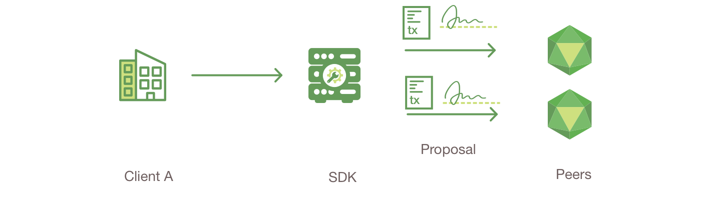
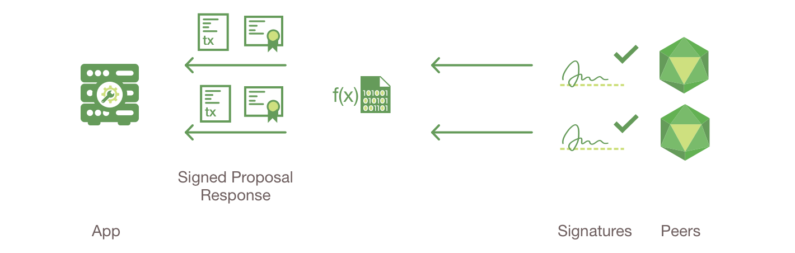
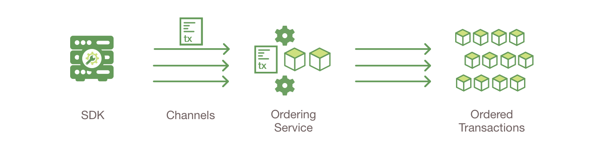
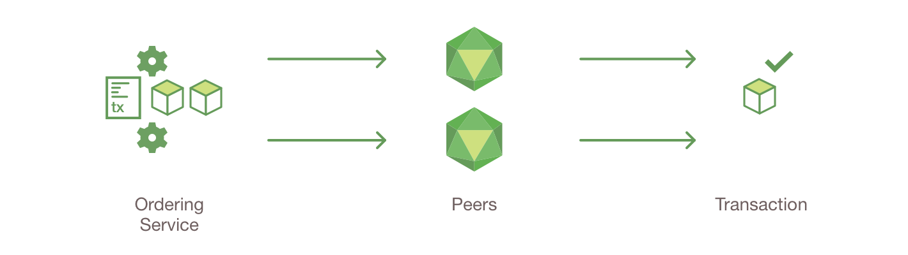
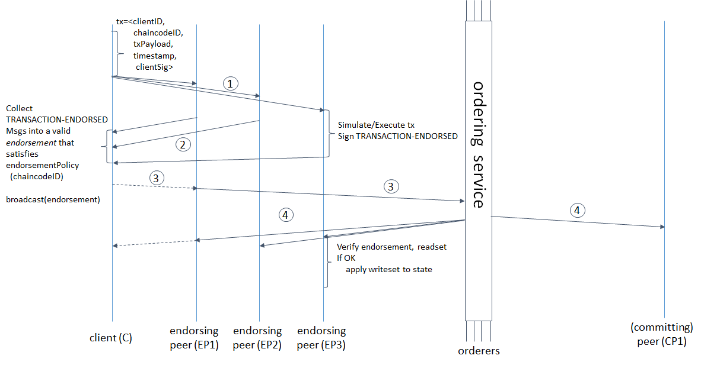

Transaction Flow
================

This document outlines the transactional mechanics that take place during a
standard asset exchange. The scenario includes two clients, A and B, who are
buying and selling radishes. They each have a peer on the network through which
they send their transactions and interact with the ledger.

**Assumptions**

This flow assumes that a channel is set up and running. The application user has
registered and enrolled with the organization’s Certificate Authority (CA) and
received back necessary cryptographic material, which is used to authenticate to
the network.

The chaincode (containing a set of key value pairs representing the initial
state of the radish market) is installed on the peers and deployed to the
channel. The chaincode contains logic defining a set of transaction instructions
and the agreed upon price for a radish. An endorsement policy has also been set
for this chaincode, stating that both ``peerA`` and ``peerB`` must endorse any
transaction.

1. **Client A initiates a transaction**

What's happening? Client A is sending a request to purchase radishes. This
request targets ``peerA`` and ``peerB``, who are respectively representative of
Client A and Client B. The endorsement policy states that both peers must
endorse any transaction, therefore the request goes to ``peerA`` and ``peerB``.

Next, the transaction proposal is constructed. An application leveraging a
supported SDK (Node, Java, Go) utilizes one of the available API's
to generate a transaction proposal. The proposal is a request to invoke a
chaincode function with certain input parameters, with the intent of reading
and/or updating the ledger.

The SDK serves as a shim to package the transaction proposal into the properly
architected format (protocol buffer over gRPC) and takes the user’s
cryptographic credentials to produce a unique signature for this transaction
proposal. The SDK submits the transaction proposal to a target peer,
which will manage the transaction submission on behalf of the client.
The target peer first forwards the transaction proposal to other peers
for execution, as required by the endorsement policy.

2. **Endorsing peers verify signature & execute the transaction**

The endorsing peers verify (1) that the transaction proposal is well formed, (2)
it has not been submitted already in the past (replay-attack protection), (3)
the signature is valid (using the MSP), and (4) that the submitter (Client A, in the
example) is properly authorized to perform the proposed operation on that
channel (namely, each endorsing peer ensures that the submitter satisfies the
channel's *Writers* policy). The endorsing peers take the transaction proposal
inputs as arguments to the invoked chaincode's function. The chaincode is then
executed against the current state database to produce transaction results
including a response value, read set, and write set (i.e. key/value pairs
representing an asset to create or update). No updates are made to the
ledger at this point. The set of these values, along with the endorsing peer’s
signature is passed back as a “proposal response” to the target peer.

.. note:: The MSP is a peer component that allows peers to verify transaction
          requests arriving from clients and to sign transaction results
          (endorsements). The writing policy is defined at channel creation time
          and determines which users are entitled to submit a transaction to
          that channel. For more information about membership, check out our
          :doc:`membership/membership` documentation.

.. image:: images/step3.png

3. **Proposal responses are inspected**

The target peer verifies the proposal responses are the same prior to proceeding with the transaction submission.
The architecture is such that even if a transaction is submitted without this check,
the endorsement policy will still be checked and enforced when each peer validates transactions prior to committing them.

4. **Target peer assembles endorsements into a transaction**

The target peer “broadcasts” the transaction proposal and response within a
“transaction message” to the ordering service. The transaction contains the
Channel ID, the read/write sets, and a signature from each endorsing peer.
The ordering service does not need to inspect the entire content of a transaction in
order to perform its operation, it simply receives transactions, orders them, and creates
blocks of transactions per channel.

5. **Transaction is validated and committed**

The blocks of transactions are “delivered” to all peers on the channel.  The
transactions within the block are validated to ensure endorsement policy is
fulfilled and to ensure that there have been no changes to ledger state for read
set variables since the read set was generated by the transaction execution.
Transactions in the block are tagged as being valid or invalid.

.. image:: images/step6.png

6. **Ledger updated**

Each peer appends the block to the channel’s chain, and for each valid
transaction the write sets are committed to current state database. An event is
emitted by each peer to notify the client application that the transaction (invocation)
has been immutably appended to the chain, as well as notification of whether the
transaction was validated or invalidated.

.. note:: Applications should listen for the transaction event after submitting
          a transaction, for example by using the ``submitTransaction``
          API, which automatically listen for transaction events. Without
          listening for transaction events, you will not know
          whether your transaction has actually been ordered, validated, and
          committed to the ledger.

You can also use the swimlane sequence diagram below to examine the
transaction flow in more detail.

.. Licensed under Creative Commons Attribution 4.0 International License
   https://creativecommons.org/licenses/by/4.0/
