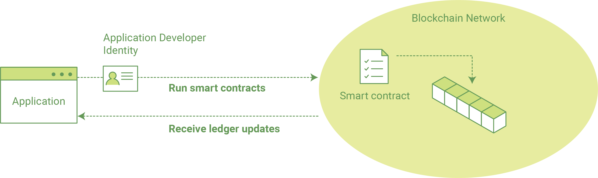

Writing Your First Application
==============================

The goal of this document is to show the tasks and provide a baseline for writing
your first application against a Hyperledger Fabric network.

At the most basic level, applications on a blockchain network are what enable
users to **query** a ledger (asking for specific records it contains), or to
**update** it (adding records to it).

Our application, composed in Javascript, leverages the Node.js SDK to interact
with the network (where our ledger exists). This tutorial will guide you through
the three steps involved in writing your first application.

  **1. Starting a test Hyperledger Fabric blockchain network.** We need some basic components
  in our network in order to query and update the ledger.  These components --
  a peer node, ordering node and Certificate Authority -- serve as the backbone of
  our network; we'll also have a CLI container used for a few administrative commands.
  A single script will download and launch this test network.

  **2. Learning the parameters of the sample smart contract our app will use.** Our
  smart contracts contain various functions that allow us to interact with the ledger
  in different ways.  For example, we can read data holistically or on a more granular
  level.

  **3. Developing the application to be able to query and update records.**
  We provide two sample applications -- one for querying the ledger and another for
  updating it. Our apps will use the SDK APIs to interact with the network and
  ultimately call these functions.

After completing this tutorial, you should have a basic understanding of how
an application, using the Hyperledger Fabric SDK for Node.js, is programmed
in conjunction with a smart contract to interact with the ledger on a
Hyperledger Fabric network.

First, let's launch our test network...

Getting a Test Network
----------------------

Visit the :doc:`prereqs` page and ensure you have the necessary dependencies installed
on your machine.

Now determine a working directory where you want to clone the fabric-samples repo. Issue
the clone command and change into the ``fabcar`` subdirectory

.. code:: bash

  git clone https://github.com/hyperledger/fabric-samples.git
  cd fabric-samples/fabcar

This subdirectory -- ``fabcar`` -- contains the scripts
and application code to run the sample app.  Issue an ``ls`` from
this directory.  You should see the following:

.. code:: bash

   chaincode	invoke.js	network		package.json	query.js	startFabric.sh

Now use the ``startFabric.sh`` script to launch the network.

.. note:: The following command downloads and extracts the Hyperledger Fabric
          Docker images, so it will take a few minutes to complete.

.. code:: bash

  ./startFabric.sh

For the sake of brevity, we won't delve into the details of what's happening with
this command.  Here's a quick synopsis:

* launches a peer node, ordering node, Certificate Authority and CLI container
* creates a channel and joins the peer to the channel
* installs smart contract (i.e. chaincode) onto the peer's file system and instantiates said chaincode on the channel; instantiate starts a chaincode container
* calls the ``initLedger`` function to populate the channel ledger with 10 unique cars

.. note:: These operations will typically be done by an organizational or peer admin.  The script uses the
	  CLI to execute these commands, however there is support in the SDK as well.
	  Refer to the `Hyperledger Fabric Node SDK repo <https://github.com/hyperledger/fabric-sdk-node>`__
	  for example scripts.

Issue a ``docker ps`` command to reveal the processes started by the ``startFabric.sh`` script.
You can learn more about the details and mechanics of these operations in the
:doc:`build_network` section.  Here we'll just focus on the application.  The following picture
provides a simplistic representation of how the application interacts with the
Hyperledger Fabric network.

Alright, now that you’ve got a sample network and some code, let’s take a
look at how the different pieces fit together.

How Applications Interact with the Network
------------------------------------------

Applications use **APIs** to invoke smart contracts (referred to as "chaincode").
These smart contracts are hosted in the network and identified by name and version.
For example, our chaincode container is titled - ``dev-peer0.org1.example.com-fabcar-1.0`` - where
the name is ``fabcar``, the version is ``1.0`` and the peer it is running against is ``dev-peer0.org1.example.com``.

APIs are accessible with a software development kit (SDK). For purposes of this
exercise, we'll be using the `Hyperledger Fabric Node SDK
<https://fabric-sdk-node.github.io/>`__ though there is also a Java SDK and
CLI that can be used to develop applications.

Querying the Ledger
-------------------
Queries are how you read data from the ledger. You can query for the value
of a single key, multiple keys, or -- if the ledger is written in a rich data storage
format like JSON -- perform complex searches against it (looking for all
assets that contain certain keywords, for example).

.. image:: images/QueryingtheLedger.png

As we said earlier, our sample network has an active chaincode container and
a ledger that has been primed with 10 different cars.  We also have some
sample Javascript code - ``query.js`` - in the ``fabcar`` directory that
can be used to query the ledger for details on the cars.

Before we take a look at how that app works, we need to install the SDK node
modules in order for our program to function.  From your ``fabcar`` directory,
issue the following:

.. code:: bash

  npm install

.. note:: You will issue all subsequent commands from the ``fabcar`` directory.

Now we can run our javascript programs.  First, let's run our ``query.js``
program to return a listing of all the cars on the ledger.  A function that
will query all the cars, ``queryAllCars``, is pre-loaded in the app,
so we can simply run the program as is:

.. code:: bash

  node query.js

It should return something like this:

.. code:: json

  Query result count =  1
  Response is  [{"Key":"CAR0", "Record":{"colour":"blue","make":"Toyota","model":"Prius","owner":"Tomoko"}},
  {"Key":"CAR1",   "Record":{"colour":"red","make":"Ford","model":"Mustang","owner":"Brad"}},
  {"Key":"CAR2", "Record":{"colour":"green","make":"Hyundai","model":"Tucson","owner":"Jin Soo"}},
  {"Key":"CAR3", "Record":{"colour":"yellow","make":"Volkswagen","model":"Passat","owner":"Max"}},
  {"Key":"CAR4", "Record":{"colour":"black","make":"Tesla","model":"S","owner":"Adriana"}},
  {"Key":"CAR5", "Record":{"colour":"purple","make":"Peugeot","model":"205","owner":"Michel"}},
  {"Key":"CAR6", "Record":{"colour":"white","make":"Chery","model":"S22L","owner":"Aarav"}},
  {"Key":"CAR7", "Record":{"colour":"violet","make":"Fiat","model":"Punto","owner":"Pari"}},
  {"Key":"CAR8", "Record":{"colour":"indigo","make":"Tata","model":"Nano","owner":"Valeria"}},
  {"Key":"CAR9", "Record":{"colour":"brown","make":"Holden","model":"Barina","owner":"Shotaro"}}]

These are the 10 cars. A black Tesla Model S owned by Adriana, a red Ford Mustang
owned by Brad, a violet Fiat Punto owned by someone named Pari, and so on. The ledger
is key/value based and in our implementation the key is ``CAR0`` through ``CAR9``.
This will become particularly important in a moment.

Now let's see what it looks like under the hood (if you'll forgive the pun).
Use an editor (e.g. atom or visual studio) and open the ``query.js`` program.

The inital section of the application defines certain variables such as chaincode ID, channel name
and network endpoints:

.. code:: bash

    var options = {
	  wallet_path : path.join(__dirname, './network/creds'),
	  user_id: 'PeerAdmin',
	  channel_id: 'mychannel',
	  chaincode_id: 'fabcar',
	  network_url: 'grpc://localhost:7051',

This is the chunk where we construct our query:

.. code:: bash

     // queryCar - requires 1 argument, ex: args: ['CAR4'],
     // queryAllCars - requires no arguments , ex: args: [''],
     const request = {
        chaincodeId: options.chaincode_id,
        txId: transaction_id,
        fcn: 'queryAllCars',
        args: ['']

We define the ``chaincode_id`` variable as ``fabcar`` -- allowing us to target this specific chaincode -- and
then call the ``queryAllCars`` function defined within that chaincode.

When we issued the ``node query.js`` command earlier, this specific function was
called to query the ledger.  However, this isn't the only function that we can pass.

To take a look at the others, navigate to the ``chaincode`` subdirectory and open
``fabcar.go`` in your editor.  You'll see that we have the following functions available
to call - ``initLedger``, ``queryCar``, ``queryAllCars``, ``createCar`` and ``changeCarOwner``.
Let's take a closer look at the ``queryAllCars`` function to see how it interacts with the
ledger.

.. code:: bash

   func (s *SmartContract) queryAllCars(APIstub shim.ChaincodeStubInterface) sc.Response {

	startKey := "CAR0"
	endKey := "CAR999"

	resultsIterator, err := APIstub.GetStateByRange(startKey, endKey)

The function uses the shim interface function ``GetStateByRange`` to return
ledger data between the args of ``startKey`` and ``endKey``.  Those keys are
defined as ``CAR0`` and ``CAR999`` respectively.  Therefore, we could theoretically
create 1,000 cars (assuming the keys are tagged properly) and a ``queryAllCars`` would
reveal every one.

Below is a representation of how an app would call different functions in chaincode.

.. image:: images/RunningtheSample.png

We can see our ``queryAllCars`` function up there, as well as one called ``createCar`` that
will allow us to update the ledger and ultimately append a new block to the chain.
But first, let's do another query.

Go back to the ``query.js`` program and edit the constructor request to query
a specific car.  We'll do this by changing the function from ``queryAllCars``
to ``queryCar`` and passing a specific "Key" to the args parameter.  Let's use
``CAR4`` here.  So our edited ``query.js`` program should now contain the
following:

.. code:: bash

  const request = {
        chaincodeId: options.chaincode_id,
        txId: transaction_id,
        fcn: 'queryCar',
        args: ['CAR4']

Save the program and navigate back to your ``fabcar`` directory.  Now run the
program again:

.. code:: bash

  node query.js

You should see the following:

.. code:: json

  {"colour":"black","make":"Tesla","model":"S","owner":"Adriana"}

So we've gone from querying all cars to querying just one, Adriana's black Tesla
Model S.  Using the ``queryCar`` function, we can query against any key (e.g. ``CAR0``) and
get whatever make, model, color, and owner correspond to that car.

Great.  Now you should be comfortable with the basic query functions in the chaincode,
and the handful of parameters in the query program.  Time to update the ledger...

Updating the Ledger
-------------------

Now that we’ve done a few ledger queries and added a bit of code, we’re ready to
update the ledger. There are a lot of potential updates we could
make, but let's just create a new car for starters.

Ledger updates start with an application generating a transaction proposal.
Just like query, a request is constructed to identify the channel ID,
function, and specific smart contract to target for the transaction. The program
then calls the ``channel.SendTransactionProposal`` API to send the transaction proposal to the peer(s)
for endorsement.

The network (i.e. endorsing peer) returns a proposal response, which the application uses
to build and sign a transaction request.  This request is sent to the ordering service by
calling the ``channel.sendTransaction`` API.  The ordering service will bundle the transaction
into a block and then "deliver" the block to all peers on a channel for validation.  (In our
case we have only the single endorsing peer.)

Finally the application uses the ``eh.setPeerAddr`` API to connect to the peer's
event listener port, and calls ``eh.registerTxEvent`` to register events associated
with a specific transaction ID.  This API allows the application to know the fate of
a transaction (i.e. successfully committed or unsuccessful).  Think of it as a notification mechanism.

.. note:: We don't go into depth here on a transaction's lifecycle.  Consult the
          :doc:`txflow` documentation for lower level details on how a transaction
          is ultimately committed to the ledger.

The goal with our initial invoke is to simply create a new asset (car in this case).  We
have a separate javascript program - ``invoke.js`` - that we will use for these transactions.
Just like query, use an editor to open the program and navigate to the codeblock where we
construct our invocation:

.. code:: bash

    // createCar - requires 5 args, ex: args: ['CAR11', 'Honda', 'Accord', 'Black', 'Tom'],
    // changeCarOwner - requires 2 args , ex: args: ['CAR10', 'Barry'],
    // send proposal to endorser
    var request = {
        targets: targets,
        chaincodeId: options.chaincode_id,
        fcn: '',
        args: [''],
        chainId: options.channel_id,
        txId: tx_id

You'll see that we can call one of two functions - ``createCar`` or ``changeCarOwner``.
Let's create a red Chevy Volt and give it to an owner named Nick.  We're up to ``CAR9``
on our ledger, so we'll use ``CAR10`` as the identifying key here.  The updated codeblock
should look like this:

.. code:: bash

    var request = {
        targets: targets,
        chaincodeId: options.chaincode_id,
        fcn: 'createCar',
        args: ['CAR10', 'Chevy', 'Volt', 'Red', 'Nick'],
        chainId: options.channel_id,
        txId: tx_id

Save it and run the program:

.. code:: bash

   node invoke.js

There will be some output in the terminal about Proposal Response and Transaction ID.  However,
all we're concerned with is this message:

.. code:: bash

   The transaction has been committed on peer localhost:7053

The peer emits this event notification, and our application receives it thanks to our
``eh.registerTxEvent`` API.  So now if we go back to our ``query.js`` program and call
the ``queryCar`` function against an arg of ``CAR10``, we should see the following:

.. code:: bash

   Response is  {"colour":"Red","make":"Chevy","model":"Volt","owner":"Nick"}

Finally, let's call our last function - ``changeCarOwner``.  Nick is feeling generous and
he wants to give his Chevy Volt to a man named Barry.  So, we simply edit ``invoke.js``
to reflect the following:

.. code:: bash

     var request = {
        targets: targets,
        chaincodeId: options.chaincode_id,
        fcn: 'changeCarOwner',
        args: ['CAR10', 'Barry'],
        chainId: options.channel_id,
        txId: tx_id

Execute the program again - ``node invoke.js`` - and then run the query app one final time.
We are still querying against ``CAR10``, so we should see:

.. code:: bash

   Response is  {"colour":"Red","make":"Chevy","model":"Volt","owner":"Barry"}

Additional Resources
--------------------

The `Hyperledger Fabric Node SDK repo <https://github.com/hyperledger/fabric-sdk-node>`__
is an excellent resource for deeper documentation and sample code.  You can also consult
the Hyperledger Fabric community and component experts on `Hyperledger Rocket Chat <https://chat.hyperledger.org/home>`__.

.. Licensed under Creative Commons Attribution 4.0 International License
   https://creativecommons.org/licenses/by/4.0/
