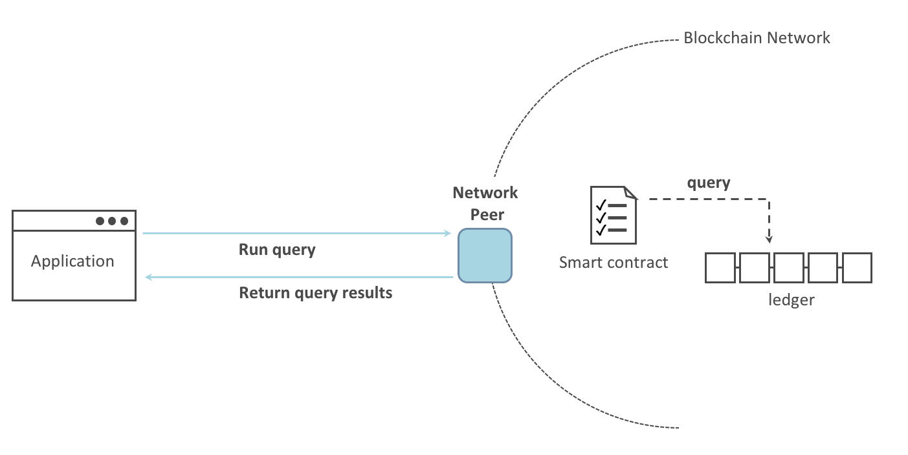
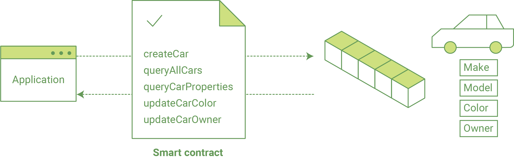
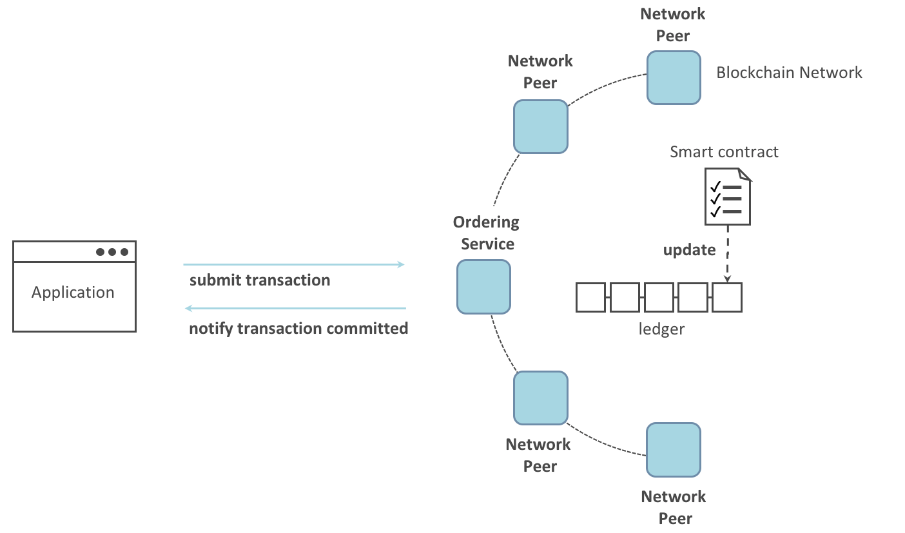

Writing Your First Application
==============================

.. note:: If you're not yet familiar with the fundamental architecture of a
          Fabric network, you may want to visit the :doc:`key_concepts` section
          prior to continuing.

          It is also worth noting that this tutorial serves as an introduction
          to Fabric applications and uses simple smart contracts and
          applications. For a more in-depth look at Fabric applications and
          smart contracts, check out our
          :doc:`developapps/developing_applications` section or the
          :doc:`tutorial/commercial_paper`.

This tutorial provides an introduction to how Fabric applications interact
with deployed blockchain networks. The tutorial uses sample programs built using the
Fabric SDKs -- described in detail in the :doc:`/developapps/application` topic --
to invoke a smart contract which queries and updates the ledger with the smart
contract API -- described in detail in :doc:`/developapps/smartcontract`.
We will also use our sample programs and a deployed Certificate Authority to generate
the X.509 certificates that an application needs to interact with a permissioned
blockchain. The sample applications and the smart contract they invoke are
collectively known as FabCar.

We’ll go through three principle steps:

  **1. Setting up a development environment.** Our application needs a network
  to interact with, so we'll deploy a basic network for our smart contracts and
  application.

  .. image:: images/AppConceptsOverview.png

  **2. Explore a sample smart contract.**
  We’ll inspect the sample Fabcar smart contract to learn about the transactions within them,
  and how they are used by applications to query and update the ledger.

  **3. Interact with the smart contract with a sample application.** Our application will
  use the FabCar smart contract to query and update car assets on the ledger.
  We'll get into the code of the apps and the transactions they create,
  including querying a car, querying a range of cars, and creating a new car.

After completing this tutorial you should have a basic understanding of how Fabric
applications and smart contracts work together to manage data on the distributed
ledger of a blockchain network.

Set up the blockchain network
-----------------------------

If you've already run through :doc:`test_network` tutorial and have a network up
and running, this tutorial will bring down your running network network before
bringing up a new one.

If you are using Mac OS and running Mojave, you will need to `install Xcode
<./tutorial/installxcode.html>`_.

Launch the network
^^^^^^^^^^^^^^^^^^

.. note:: This tutorial demonstrates the JavaScript versions of the FabCar
          smart contract and application, but the ``fabric-samples`` repo also
          contains Go, Java and TypeScript versions of this sample. To try the
          Go, Java or TypeScript versions, change the ``javascript`` argument
          for ``./startFabric.sh`` below to either ``go``, ``java`` or ``typescript``
          and follow the instructions written to the terminal.

Navigate to the ``fabcar`` subdirectory within your local clone of the
``fabric-samples`` repo.

.. code:: bash

  cd fabric-samples/fabcar

Launch your network using the ``startFabric.sh`` shell script.

.. code:: bash

  ./startFabric.sh javascript

This command will deploy the Fabric test network with two peers and an ordering
service. Instead of using the cryptogen tool, we will bring up the test network
using Certificate Authorities. We will use one of these CAs to create the certificates
and keys that will be used by our applications in a future step. The ``startFabric.sh``
script will also deploy and initialize the JavaScript version of the FabCar smart
contract on the channel ``mychannel``, and then invoke the smart contract to
put initial data on the ledger.

Install the application
^^^^^^^^^^^^^^^^^^^^^^^

From the ``fabcar`` directory inside ``fabric-samples``, navigate to the
``javascript`` folder.

.. code:: bash

  cd javascript

This directory contains sample programs that were developed using the Fabric
SDK for Node.js. Run the following command to install the application dependencies.
It will take about a minute to complete:

.. code:: bash

  npm install

This process is installing the key application dependencies defined in
``package.json``. The most important of which is the ``fabric-network`` class;
it enables an application to use identities, wallets, and gateways to connect to
channels, submit transactions, and wait for notifications. This tutorial also
uses the ``fabric-ca-client`` class to enroll users with their respective
certificate authorities, generating a valid identity which is then used by
``fabric-network`` class methods.

Once ``npm install`` completes, everything is in place to run the application.
Let's take a look at the sample JavaScript application files we will be using
in this tutorial:

.. code:: bash

  ls

You should see the following:

.. code:: bash

  enrollAdmin.js  node_modules       package.json  registerUser.js
  invoke.js       package-lock.json  query.js      wallet

There are files for other program languages, for example in the
``fabcar/java`` directory. You can read these once you've used the
JavaScript example -- the principles are the same.

If you are using Mac OS and running Mojave, you will need to `install Xcode
<./tutorial/installxcode.html>`_.

Enrolling the admin user
------------------------

.. note:: The following two sections involve communication with the Certificate
          Authority. You may find it useful to stream the CA logs when running
          the upcoming programs by opening a new terminal shell and running
          ``docker logs -f ca_org1``.

When we created the network, an admin user --- literally called ``admin`` ---
was created as the **registrar** for the certificate authority (CA). Our first
step is to generate the private key, public key, and X.509 certificate for
``admin`` using the ``enroll.js`` program. This process uses a **Certificate
Signing Request** (CSR) --- the private and public key are first generated
locally and the public key is then sent to the CA which returns an encoded
certificate for use by the application. These credentials are then stored
in the wallet, allowing us to act as an administrator for the CA.

Let's enroll user ``admin``:

.. code:: bash

  node enrollAdmin.js

This command stores the CA administrator's credentials in the ``wallet`` directory.
You can find administrator's certificate and private key in the ``wallet/admin.id``
file.

Register and enroll an application user
---------------------------------------

Our ``admin`` is used to work with the CA. Now that we have the administrator's
credentials in a wallet, we can create a new application user which will be used
to interact with the blockchain. Run the following command to register and enroll
a new user named ``appUser``:

.. code:: bash

  node registerUser.js

Similar to the admin enrollment, this program uses a CSR to enroll ``appUser`` and
store its credentials alongside those of ``admin`` in the wallet. We now have
identities for two separate users --- ``admin`` and ``appUser`` --- that can be
used by our application.

Querying the ledger
-------------------

Each peer in a blockchain network hosts a copy of the `ledger <./ledger/ledger.html>`_. An application
program can view the most recent data from the ledger using read only invocations of
a smart contract running on your peers called a query.

Here is a simplified representation of how a query works:

The most common queries involve the current values of data in the ledger -- its
`world state <./ledger/ledger.html#world-state>`_. The world state is
represented as a set of key-value pairs, and applications can query data for a
single key or multiple keys. Moreover, you can use complex queries to read the
data on the ledger when you use CouchDB as your state database and model your data in JSON.
This can be very helpful when looking for all assets that match certain keywords
with particular values; all cars with a particular owner, for example.

First, let's run our ``query.js`` program to return a listing of all the cars on
the ledger. This program uses our second identity -- ``appUser`` -- to access the
ledger:

.. code:: bash

  node query.js

The output should look like this:

.. code:: json

  Wallet path: ...fabric-samples/fabcar/javascript/wallet
  Transaction has been evaluated, result is:
  [{"Key":"CAR0","Record":{"color":"blue","docType":"car","make":"Toyota","model":"Prius","owner":"Tomoko"}},
  {"Key":"CAR1","Record":{"color":"red","docType":"car","make":"Ford","model":"Mustang","owner":"Brad"}},
  {"Key":"CAR2","Record":{"color":"green","docType":"car","make":"Hyundai","model":"Tucson","owner":"Jin Soo"}},
  {"Key":"CAR3","Record":{"color":"yellow","docType":"car","make":"Volkswagen","model":"Passat","owner":"Max"}},
  {"Key":"CAR4","Record":{"color":"black","docType":"car","make":"Tesla","model":"S","owner":"Adriana"}},
  {"Key":"CAR5","Record":{"color":"purple","docType":"car","make":"Peugeot","model":"205","owner":"Michel"}},
  {"Key":"CAR6","Record":{"color":"white","docType":"car","make":"Chery","model":"S22L","owner":"Aarav"}},
  {"Key":"CAR7","Record":{"color":"violet","docType":"car","make":"Fiat","model":"Punto","owner":"Pari"}},
  {"Key":"CAR8","Record":{"color":"indigo","docType":"car","make":"Tata","model":"Nano","owner":"Valeria"}},
  {"Key":"CAR9","Record":{"color":"brown","docType":"car","make":"Holden","model":"Barina","owner":"Shotaro"}}]

Let's take a closer look at how `query.js` program uses the APIs provided by the
`Fabric Node SDK <https://hyperledger.github.io/fabric-sdk-node/>`__ to
interact with our Fabric network. Use an editor (e.g. atom or visual studio) to
open ``query.js``.

The application starts by bringing in scope two key classes from the
``fabric-network`` module; ``Wallets`` and ``Gateway``. These classes
will be used to locate the ``appUser`` identity in the wallet, and use it to
connect to the network:

.. code:: bash

  const { Gateway, Wallets } = require('fabric-network');

First, the program uses the Wallet class to get our application user from our file system.

.. code:: bash

  const identity = await wallet.get('appUser');

Once the program has an identity, it uses the Gateway class to connect to our network.

.. code:: bash

  const gateway = new Gateway();
  await gateway.connect(ccpPath, { wallet, identity: 'appUser', discovery: { enabled: true, asLocalhost: true } });

``ccpPath`` describes the path to the connection profile that our application will use
to connect to our network. The connection profile was loaded from inside the
``fabric-samples/test network`` directory and parsed as a JSON file:

.. code:: bash

  const ccpPath = path.resolve(__dirname, '..', '..', 'test-network','organizations','peerOrganizations','org1.example.com', 'connection-org1.json');

If you'd like to understand more about the structure of a connection profile,
and how it defines the network, check out
`the connection profile topic <./developapps/connectionprofile.html>`_.

A network can be divided into multiple channels, and the next important line of
code connects the application to a particular channel within the network,
``mychannel``, where our smart contract was deployed:

.. code:: bash

  const network = await gateway.getNetwork('mychannel');

Within this channel, we can access the FabCar smart contract to interact
with the ledger:

.. code:: bash

  const contract = network.getContract('fabcar');

Within FabCar there are many different **transactions**, and our application
initially uses the ``queryAllCars`` transaction to access the ledger world state
data:

.. code:: bash

  const result = await contract.evaluateTransaction('queryAllCars');

The ``evaluateTransaction`` method represents one of the simplest interactions
with a smart contract in blockchain network. It simply picks a peer defined in
the connection profile and sends the request to it, where it is evaluated. The
smart contract queries all the cars on the peer's copy of the ledger and returns
the result to the application. This interaction does not result in an update the
ledger.

The FabCar smart contract
-------------------------

Let's take a look at the transactions within the FabCar smart contract. Open a
new terminal and navigate to the JavaScript version of the FabCar Smart contract
inside the ``fabric-samples`` repository:

.. code:: bash

  cd fabric-samples/chaincode/fabcar/javascript/lib

Open the ``fabcar.js`` file in a text editor editor.

See how our smart contract is defined using the ``Contract`` class:

.. code:: bash

  class FabCar extends Contract {...

Within this class structure, you'll see that we have the following
transactions defined: ``initLedger``, ``queryCar``, ``queryAllCars``,
``createCar``, and ``changeCarOwner``. For example:

.. code:: bash

  async queryCar(ctx, carNumber) {...}
  async queryAllCars(ctx) {...}

Let's take a closer look at the ``queryAllCars`` transaction to see how it
interacts with the ledger.

.. code:: bash

  async queryAllCars(ctx) {

    const startKey = 'CAR0';
    const endKey = 'CAR999';

    const iterator = await ctx.stub.getStateByRange(startKey, endKey);

This code defines the range of cars that ``queryAllCars`` will retrieve from the
ledger. Every car between ``CAR0`` and ``CAR999`` -- 1,000 cars in all, assuming
every key has been tagged properly -- will be returned by the query. The
remainder of the code iterates through the query results and packages them into
JSON for the application.

Below is a representation of how an application would call different
transactions in a smart contract. Each transaction uses a broad set of APIs such
as ``getStateByRange`` to interact with the ledger. You can read more about
these APIs in `detail
<https://hyperledger.github.io/fabric-chaincode-node/>`_.

We can see our ``queryAllCars`` transaction, and another called ``createCar``.
We will use this later in the tutorial to update the ledger, and add a new block
to the blockchain.

But first, go back to the ``query`` program and change the
``evaluateTransaction`` request to query ``CAR4``. The ``query`` program should
now look like this:

.. code:: bash

  const result = await contract.evaluateTransaction('queryCar', 'CAR4');

Save the program and navigate back to your ``fabcar/javascript`` directory.
Now run the ``query`` program again:

.. code:: bash

  node query.js

You should see the following:

.. code:: json

  Wallet path: ...fabric-samples/fabcar/javascript/wallet
  Transaction has been evaluated, result is:
  {"color":"black","docType":"car","make":"Tesla","model":"S","owner":"Adriana"}

If you go back and look at the result from when the transaction was
``queryAllCars``, you can see that ``CAR4`` was Adriana’s black Tesla model S,
which is the result that was returned here.

We can use the ``queryCar`` transaction to query against any car, using its
key (e.g. ``CAR0``) and get whatever make, model, color, and owner correspond to
that car.

Great. At this point you should be comfortable with the basic query transactions
in the smart contract and the handful of parameters in the query program.

Time to update the ledger...

Updating the ledger
-------------------

Now that we’ve done a few ledger queries and added a bit of code, we’re ready to
update the ledger. There are a lot of potential updates we could make, but
let's start by creating a **new** car.

From an application perspective, updating the ledger is simple. An application
submits a transaction to the blockchain network, and when it has been
validated and committed, the application receives a notification that
the transaction has been successful. Under the covers this involves the process
of **consensus** whereby the different components of the blockchain network work
together to ensure that every proposed update to the ledger is valid and
performed in an agreed and consistent order.

Above, you can see the major components that make this process work. As well as
the multiple peers which each host a copy of the ledger, and optionally a copy
of the smart contract, the network also contains an ordering service. The
ordering service coordinates transactions for a network; it creates blocks
containing transactions in a well-defined sequence originating from all the
different applications connected to the network.

Our first update to the ledger will create a new car. We have a separate program
called ``invoke.js`` that we will use to make updates to the ledger. Just as with
queries, use an editor to open the program and navigate to the code block where
we construct our transaction and submit it to the network:

.. code:: bash

  await contract.submitTransaction('createCar', 'CAR12', 'Honda', 'Accord', 'Black', 'Tom');

See how the applications calls the smart contract transaction ``createCar`` to
create a black Honda Accord with an owner named Tom. We use ``CAR12`` as the
identifying key here, just to show that we don't need to use sequential keys.

Save it and run the program:

.. code:: bash

  node invoke.js

If the invoke is successful, you will see output like this:

.. code:: bash

  Wallet path: ...fabric-samples/fabcar/javascript/wallet
  Transaction has been submitted

Notice how the ``invoke`` application interacted with the blockchain network
using the ``submitTransaction`` API, rather than ``evaluateTransaction``.

.. code:: bash

  await contract.submitTransaction('createCar', 'CAR12', 'Honda', 'Accord', 'Black', 'Tom');

``submitTransaction`` is much more sophisticated than ``evaluateTransaction``.
Rather than interacting with a single peer, the SDK will send the
``submitTransaction`` proposal to every required organization's peer in the
blockchain network. Each of these peers will execute the requested smart
contract using this proposal, to generate a transaction response which it signs
and returns to the SDK. The SDK collects all the signed transaction responses
into a single transaction, which it then sends to the orderer. The orderer
collects and sequences transactions from every application into a block of
transactions. It then distributes these blocks to every peer in the network,
where every transaction is validated and committed. Finally, the SDK is
notified, allowing it to return control to the application.

.. note:: ``submitTransaction`` also includes a listener that checks to make
          sure the transaction has been validated and committed to the ledger.
          Applications should either utilize a commit listener, or
          leverage an API like ``submitTransaction`` that does this for you.
          Without doing this, your transaction may not have been successfully
          ordered, validated, and committed to the ledger.

``submitTransaction`` does all this for the application! The process by which
the application, smart contract, peers and ordering service work together to
keep the ledger consistent across the network is called consensus, and it is
explained in detail in this `section <./peers/peers.html>`_.

To see that this transaction has been written to the ledger, go back to
``query.js`` and change the argument from ``CAR4`` to ``CAR12``.

In other words, change this:

.. code:: bash

  const result = await contract.evaluateTransaction('queryCar', 'CAR4');

To this:

.. code:: bash

  const result = await contract.evaluateTransaction('queryCar', 'CAR12');

Save once again, then query:

.. code:: bash

  node query.js

Which should return this:

.. code:: bash

  Wallet path: ...fabric-samples/fabcar/javascript/wallet
  Transaction has been evaluated, result is:
  {"color":"Black","docType":"car","make":"Honda","model":"Accord","owner":"Tom"}

Congratulations. You’ve created a car and verified that its recorded on the
ledger!

So now that we’ve done that, let’s say that Tom is feeling generous and he
wants to give his Honda Accord to someone named Dave.

To do this, go back to ``invoke.js`` and change the smart contract transaction
from ``createCar`` to ``changeCarOwner`` with a corresponding change in input
arguments:

.. code:: bash

  await contract.submitTransaction('changeCarOwner', 'CAR12', 'Dave');

The first argument --- ``CAR12`` --- identifies the car that will be changing
owners. The second argument --- ``Dave`` --- defines the new owner of the car.

Save and execute the program again:

.. code:: bash

  node invoke.js

Now let’s query the ledger again and ensure that Dave is now associated with the
``CAR12`` key:

.. code:: bash

  node query.js

It should return this result:

.. code:: bash

   Wallet path: ...fabric-samples/fabcar/javascript/wallet
   Transaction has been evaluated, result is:
   {"color":"Black","docType":"car","make":"Honda","model":"Accord","owner":"Dave"}

The ownership of ``CAR12`` has been changed from Tom to Dave.

.. note:: In a real world application the smart contract would likely have some
          access control logic. For example, only certain authorized users may
          create new cars, and only the car owner may transfer the car to
          somebody else.

Clean up
--------

When you are finished using the FabCar sample, you can bring down the test
network using ``networkDown.sh`` script.

.. code:: bash

  ./networkDown.sh

This command will bring down the CAs, peers, and ordering node of the network
that we created. It will also remove the ``admin`` and ``appUser`` crypto material stored
in the ``wallet`` directory. Note that all of the data on the ledger will be lost.
If you want to go through the tutorial again, you will start from a clean initial state.

Summary
-------

Now that we’ve done a few queries and a few updates, you should have a pretty
good sense of how applications interact with a blockchain network using a smart
contract to query or update the ledger. You’ve seen the basics of the roles
smart contracts, APIs, and the SDK play in queries and updates and you should
have a feel for how different kinds of applications could be used to perform
other business tasks and operations.

Additional resources
--------------------

As we said in the introduction, we have a whole section on
:doc:`developapps/developing_applications` that includes in-depth information on
smart contracts, process and data design, a tutorial using a more in-depth
Commercial Paper `tutorial <./tutorial/commercial_paper.html>`_ and a large
amount of other material relating to the development of applications.

.. Licensed under Creative Commons Attribution 4.0 International License
   https://creativecommons.org/licenses/by/4.0/
