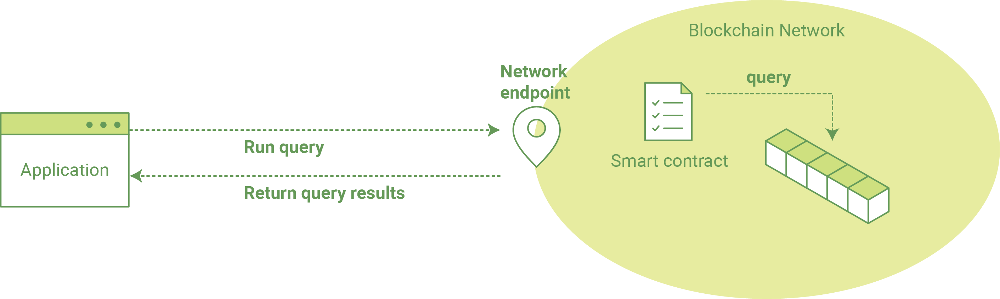

Writing Your First Application
==============================

.. note:: If you're not yet familiar with the fundamental architecture of a
          Fabric network, you may want to visit the :doc:`blockchain` and
          :doc:`build_network` documentation prior to continuing.

In this section we'll be looking at a handful of sample programs to see how Fabric
apps work. These apps (and the smart contract they use) -- collectively known as
``fabcar`` -- provide a broad demonstration of Fabric functionality. Notably, we
will show the process for interacting with a Certificate Authority and generating
enrollment certificates, after which we will leverage these identities to query
and update a ledger.

We’ll go through three principle steps:

  **1. Setting up a development environment.** Our application needs a network to
  interact with, so we'll download one stripped down to just the components we need
  for registration/enrollment, queries and updates:

  .. image:: images/AppConceptsOverview.png

  **2. Learning the parameters of the sample smart contract our app will use.** Our
  smart contract contains various functions that allow us to interact with the ledger
  in different ways. We’ll go in and inspect that smart contract to learn about the
  functions our applications will be using.

  **3. Developing the applications to be able to query and update assets on the ledger.**
  We'll get into the app code itself (our apps have been written in Javascript) and
  manually manipulate the variables to run different kinds of queries and updates.

After completing this tutorial you should have a basic understanding of how
an application is programmed in conjunction with a smart contract to interact
with the ledger (i.e. the peer) on a Fabric network.

Setting up your Dev Environment
-------------------------------

If you've already run through :doc:`build_network`, you should have your dev
environment setup and will have downloaded `fabric-samples` as well as the
accompanying artifacts. To run this tutorial, what you need to do now is tear
down any existing networks you have, which you can do by issuing the following:

.. code:: bash

  ./byfn.sh down

If you don't have a development environment and the accompanying artifacts for
the network and applications, visit the :doc:`prereqs` page and ensure you have
the necessary dependencies installed on your machine.

Next, if you haven't done so already, visit the :doc:`install` page and follow
the provided instructions. Return to this tutorial once you have cloned the
``fabric-samples`` repository, and downloaded the latest stable Fabric images
and available utilities.

At this point everything should be installed. Navigate to the ``fabcar``
subdirectory within your ``fabric-samples`` repository and take a look at what's
inside:

.. code:: bash

  cd fabric-samples/fabcar  && ls

You should see the following:

.. code:: bash

     enrollAdmin.js	invoke.js	package.json	query.js	registerUser.js	startFabric.sh

Before starting we also need to do a little housekeeping. Run the following
command to kill any stale or active containers:

.. code:: bash

  docker rm -f $(docker ps -aq)

Clear any cached networks:

.. code:: bash

  # Press 'y' when prompted by the command

  docker network prune

And lastly if you've already run through this tutorial, you'll also want to
delete the underlying chaincode image for the ``fabcar`` smart contract. If
you're a user going through this content for the first time, then you won't
have this chaincode image on your system:

.. code:: bash

  docker rmi dev-peer0.org1.example.com-fabcar-1.0-5c906e402ed29f20260ae42283216aa75549c571e2e380f3615826365d8269ba

Install the clients & launch the network
^^^^^^^^^^^^^^^^^^^^^^^^^^^^^^^^^^^^^^^^^^

.. note:: The following instructions require you to be in the ``fabcar``
          subdirectory within your local clone of the ``fabric-samples`` repo.
          Remain at the root of this subdirectory for the remainder of this
          tutorial.

Run the following command to install the Fabric dependencies for the
applications. We are concerned with ``fabric-ca-client`` which will allow our
app(s) to communicate with the CA server and retrieve identity material, and
with ``fabric-client`` which allows us to load the identity material and talk
to the peers and ordering service.

.. code:: bash

  npm install

Launch your network using the ``startFabric.sh`` shell script. This command
will spin up our various Fabric entities and launch a smart contract container
for chaincode written in Golang:

.. code:: bash

  ./startFabric.sh

You also have the option of running this tutorial against chaincode written in
`Node.js <https://fabric-shim.github.io/>`__. If you'd like to pursue this route,
issue the following command instead:

.. code:: bash

 ./startFabric.sh node

.. note:: Be aware that the Node.js chaincode scenario will take roughly 90 seconds
          to complete; perhaps longer. The script is not hanging, rather the
          increased time is a result of the fabric-shim being installed as the
          chaincode image is being built.

Alright, now that you’ve got a sample network and some code, let’s take a
look at how the different pieces fit together.

How Applications Interact with the Network
------------------------------------------

For a more in-depth look at the components in our ``fabcar`` network (and how
they're deployed) as well as how applications interact with those components
on more of a granular level, see :doc:`understand_fabcar_network`.

Developers more interested in seeing what applications **do** -- as well as
looking at the code itself to see how an application is constructed -- should
continue. For now, the most important thing to know is that applications use
a software development kit (SDK) to access the **APIs** that permit queries and
updates to the ledger.

Enrolling the Admin User
------------------------

.. note:: The following two sections involve communication with the Certificate
          Authority. You may find it useful to stream the CA logs when running
          the upcoming programs.

To stream your CA logs, split your terminal or open a new shell and issue the following:

.. code:: bash

  docker logs -f ca.example.com

Now hop back to your terminal with the ``fabcar`` content...

When we launched our network, an admin user -- ``admin`` -- was registered with our
Certificate Authority. Now we need to send an enroll call to the CA server and
retrieve the enrollment certificate (eCert) for this user. We won't delve into enrollment
details here, but suffice it to say that the SDK and by extension our applications
need this cert in order to form a user object for the admin. We will then use this admin
object to subsequently register and enroll a new user. Send the admin enroll call to the CA
server:

.. code:: bash

  node enrollAdmin.js

This program will invoke a certificate signing request (CSR) and ultimately output
an eCert and key material into a newly created folder -- ``hfc-key-store`` -- at the
root of this project. Our apps will then look to this location when they need to
create or load the identity objects for our various users.

Register and Enroll ``user1``
-----------------------------

With our newly generated admin eCert, we will now communicate with the CA server
once more to register and enroll a new user. This user -- ``user1`` -- will be
the identity we use when querying and updating the ledger. It's important to
note here that it is the ``admin`` identity that is issuing the registration and
enrollment calls for our new user (i.e. this user is acting in the role of a registrar).
Send the register and enroll calls for ``user1``:

.. code:: bash

  node registerUser.js

Similar to the admin enrollment, this program invokes a CSR and outputs the keys
and eCert into the ``hfc-key-store`` subdirectory. So now we have identity material for two
separate users -- ``admin`` & ``user1``. Time to interact with the ledger...

Querying the Ledger
-------------------

Queries are how you read data from the ledger. This data is stored as a series
of key-value pairs, and you can query for the value of a single key, multiple
keys, or -- if the ledger is written in a rich data storage format like JSON --
perform complex searches against it (looking for all assets that contain
certain keywords, for example).

This is a representation of how a query works:

First, let's run our ``query.js`` program to return a listing of all the cars on
the ledger. We will use our second identity -- ``user1`` -- as the signing entity
for this application. The following line in our program specifies ``user1`` as
the signer:

.. code:: bash

  fabric_client.getUserContext('user1', true);

Recall that the ``user1`` enrollment material has already been placed into our
``hfc-key-store`` subdirectory, so we simply need to tell our application to grab that identity.
With the user object defined, we can now proceed with reading from the ledger.
A function that will query all the cars, ``queryAllCars``, is
pre-loaded in the app, so we can simply run the program as is:

.. code:: bash

  node query.js

It should return something like this:

.. code:: json

  Successfully loaded user1 from persistence
  Query has completed, checking results
  Response is  [{"Key":"CAR0", "Record":{"colour":"blue","make":"Toyota","model":"Prius","owner":"Tomoko"}},
  {"Key":"CAR1",   "Record":{"colour":"red","make":"Ford","model":"Mustang","owner":"Brad"}},
  {"Key":"CAR2", "Record":{"colour":"green","make":"Hyundai","model":"Tucson","owner":"Jin Soo"}},
  {"Key":"CAR3", "Record":{"colour":"yellow","make":"Volkswagen","model":"Passat","owner":"Max"}},
  {"Key":"CAR4", "Record":{"colour":"black","make":"Tesla","model":"S","owner":"Adriana"}},
  {"Key":"CAR5", "Record":{"colour":"purple","make":"Peugeot","model":"205","owner":"Michel"}},
  {"Key":"CAR6", "Record":{"colour":"white","make":"Chery","model":"S22L","owner":"Aarav"}},
  {"Key":"CAR7", "Record":{"colour":"violet","make":"Fiat","model":"Punto","owner":"Pari"}},
  {"Key":"CAR8", "Record":{"colour":"indigo","make":"Tata","model":"Nano","owner":"Valeria"}},
  {"Key":"CAR9", "Record":{"colour":"brown","make":"Holden","model":"Barina","owner":"Shotaro"}}]

These are the 10 cars. A black Tesla Model S owned by Adriana, a red Ford Mustang
owned by Brad, a violet Fiat Punto owned by Pari, and so on. The ledger is
key-value based and, in our implementation, the key is ``CAR0`` through ``CAR9``.
This will become particularly important in a moment.

Let's take a closer look at this program. Use an editor (e.g. atom or visual studio)
and open ``query.js``.

The initial section of the application defines certain variables such as
channel name, cert store location and network endpoints. In our sample app, these
variables have been baked-in, but in a real app these variables would have to
be specified by the app dev.

.. code:: bash

  var channel = fabric_client.newChannel('mychannel');
  var peer = fabric_client.newPeer('grpc://localhost:7051');
  channel.addPeer(peer);

  var member_user = null;
  var store_path = path.join(__dirname, 'hfc-key-store');
  console.log('Store path:'+store_path);
  var tx_id = null;

This is the chunk where we construct our query:

.. code:: bash

  // queryCar chaincode function - requires 1 argument, ex: args: ['CAR4'],
  // queryAllCars chaincode function - requires no arguments , ex: args: [''],
  const request = {
    //targets : --- letting this default to the peers assigned to the channel
    chaincodeId: 'fabcar',
    fcn: 'queryAllCars',
    args: ['']
  };

When the application ran, it invoked the ``fabcar`` chaincode on the peer, ran the
``queryAllCars`` function within it, and passed no arguments to it.

To take a look at the available functions within our smart contract, navigate
to the ``chaincode/fabcar/go`` subdirectory at the root of ``fabric-samples`` and open
``fabcar.go`` in your editor.

.. note:: These same functions are defined within the Node.js version of the
          ``fabcar`` chaincode.

You'll see that we have the following functions available to call: ``initLedger``,
``queryCar``, ``queryAllCars``, ``createCar``, and ``changeCarOwner``.

Let's take a closer look at the ``queryAllCars`` function to see how it
interacts with the ledger.

.. code:: bash

  func (s *SmartContract) queryAllCars(APIstub shim.ChaincodeStubInterface) sc.Response {

	startKey := "CAR0"
	endKey := "CAR999"

	resultsIterator, err := APIstub.GetStateByRange(startKey, endKey)

This defines the range of ``queryAllCars``. Every car between ``CAR0`` and
``CAR999`` -- 1,000 cars in all, assuming every key has been tagged properly
-- will be returned by the query.

Below is a representation of how an app would call different functions in
chaincode. Each function must be coded against an available API in the chaincode
shim interface, which in turn allows the smart contract container to properly
interface with the peer ledger.

.. image:: images/RunningtheSample.png

We can see our ``queryAllCars`` function, as well as one called ``createCar``,
that will allow us to update the ledger and ultimately append a new block to
the chain in a moment.

But first, go back to the ``query.js`` program and edit the constructor request
to query ``CAR4``. We do this by changing the function in ``query.js`` from
``queryAllCars`` to ``queryCar`` and passing ``CAR4`` as the specific key.

The ``query.js`` program should now look like this:

.. code:: bash

  const request = {
    //targets : --- letting this default to the peers assigned to the channel
    chaincodeId: 'fabcar',
    fcn: 'queryCar',
    args: ['CAR4']
  };

Save the program and navigate back to your ``fabcar`` directory. Now run the
program again:

.. code:: bash

  node query.js

You should see the following:

.. code:: json

  {"colour":"black","make":"Tesla","model":"S","owner":"Adriana"}

If you go back and look at the result from when we queried every car before,
you can see that ``CAR4`` was Adriana’s black Tesla model S, which is the result
that was returned here.

Using the ``queryCar`` function, we can query against any key (e.g. ``CAR0``)
and get whatever make, model, color, and owner correspond to that car.

Great. At this point you should be comfortable with the basic query functions
in the smart contract and the handful of parameters in the query program.
Time to update the ledger...

Updating the Ledger
-------------------

Now that we’ve done a few ledger queries and added a bit of code, we’re ready to
update the ledger. There are a lot of potential updates we could make, but
let's start by creating a car.

Below we can see how this process works. An update is proposed, endorsed,
then returned to the application, which in turn sends it to be ordered and
written to every peer's ledger:

.. image:: images/UpdatingtheLedger.png

Our first update to the ledger will be to create a new car. We have a separate
Javascript program -- ``invoke.js`` -- that we will use to make updates. Just
as with queries, use an editor to open the program and navigate to the
code block where we construct our invocation:

.. code:: bash

  // createCar chaincode function - requires 5 args, ex: args: ['CAR12', 'Honda', 'Accord', 'Black', 'Tom'],
  // changeCarOwner chaincode function - requires 2 args , ex: args: ['CAR10', 'Barry'],
  // must send the proposal to endorsing peers
  var request = {
    //targets: let default to the peer assigned to the client
    chaincodeId: 'fabcar',
    fcn: '',
    args: [''],
    chainId: 'mychannel',
    txId: tx_id
  };

You'll see that we can call one of two functions -- ``createCar`` or
``changeCarOwner``. First, let’s create a red Chevy Volt and give it to an
owner named Nick. We're up to ``CAR9`` on our ledger, so we'll use ``CAR10``
as the identifying key here. Edit this code block to look like this:

.. code:: bash

  var request = {
    //targets: let default to the peer assigned to the client
    chaincodeId: 'fabcar',
    fcn: 'createCar',
    args: ['CAR10', 'Chevy', 'Volt', 'Red', 'Nick'],
    chainId: 'mychannel',
    txId: tx_id
  };

Save it and run the program:

.. code:: bash

   node invoke.js

There will be some output in the terminal about ``ProposalResponse`` and
promises. However, all we're concerned with is this message:

.. code:: bash

   The transaction has been committed on peer localhost:7053

To see that this transaction has been written, go back to ``query.js`` and
change the argument from ``CAR4`` to ``CAR10``.

In other words, change this:

.. code:: bash

  const request = {
    //targets : --- letting this default to the peers assigned to the channel
    chaincodeId: 'fabcar',
    fcn: 'queryCar',
    args: ['CAR4']
  };

To this:

.. code:: bash

  const request = {
    //targets : --- letting this default to the peers assigned to the channel
    chaincodeId: 'fabcar',
    fcn: 'queryCar',
    args: ['CAR10']
  };

Save once again, then query:

.. code:: bash

  node query.js

Which should return this:

.. code:: bash

   Response is  {"colour":"Red","make":"Chevy","model":"Volt","owner":"Nick"}

Congratulations. You’ve created a car!

So now that we’ve done that, let’s say that Nick is feeling generous and he
wants to give his Chevy Volt to someone named Dave.

To do this go back to ``invoke.js`` and change the function from ``createCar``
to ``changeCarOwner`` and input the arguments like this:

.. code:: bash

  var request = {
    //targets: let default to the peer assigned to the client
    chaincodeId: 'fabcar',
    fcn: 'changeCarOwner',
    args: ['CAR10', 'Dave'],
    chainId: 'mychannel',
    txId: tx_id
  };

The first argument -- ``CAR10`` -- reflects the car that will be changing
owners. The second argument -- ``Dave`` -- defines the new owner of the car.

Save and execute the program again:

.. code:: bash

  node invoke.js

Now let’s query the ledger again and ensure that Dave is now associated with the
``CAR10`` key:

.. code:: bash

  node query.js

It should return this result:

.. code:: bash

   Response is  {"colour":"Red","make":"Chevy","model":"Volt","owner":"Dave"}

The ownership of ``CAR10`` has been changed from Nick to Dave.

.. note:: In a real world application the chaincode would likely have some access
          control logic. For example, only certain authorized users may create
          new cars, and only the car owner may transfer the car to somebody else.

Summary
-------

Now that we’ve done a few queries and a few updates, you should have a pretty
good sense of how applications interact with the network. You’ve seen the basics
of the roles smart contracts, APIs, and the SDK play in queries and updates and
you should have a feel for how different kinds of applications could be used to
perform other business tasks and operations.

In subsequent documents we’ll learn how to actually **write** a smart contract
and how some of these more low level application functions can be leveraged
(especially relating to identity and membership services).

Additional Resources
--------------------

The `Hyperledger Fabric Node SDK repo <https://github.com/hyperledger/fabric-sdk-node>`__
is an excellent resource for deeper documentation and sample code. You can also consult
the Fabric community and component experts on `Hyperledger Rocket Chat <https://chat.hyperledger.org/home>`__.

.. Licensed under Creative Commons Attribution 4.0 International License
   https://creativecommons.org/licenses/by/4.0/
