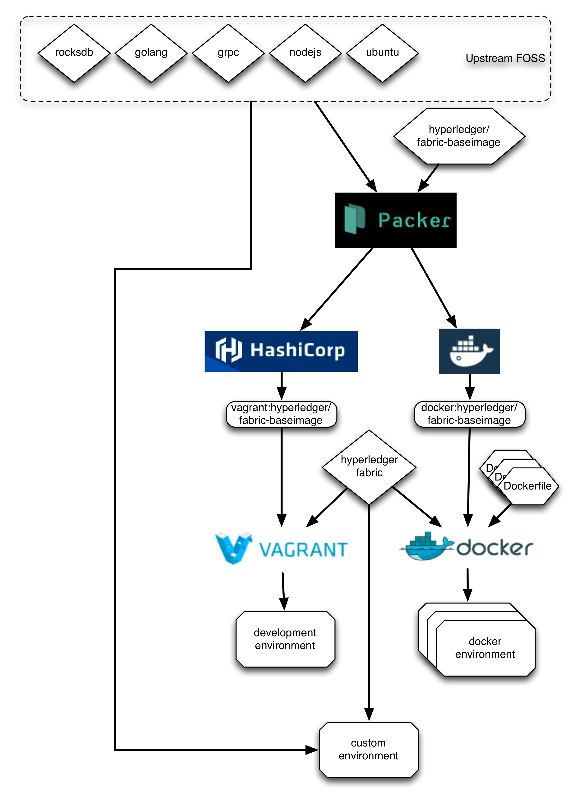

# Baseimage Introduction
This directory contains the infrastructure for creating a new baseimage used as the basis for various functions within the Hyperledger workflow such as our Vagrant based development environment, chaincode compilation/execution, unit-testing, and even cluster simulation. It is based on ubuntu-14.04 with various opensource projects added such as golang, rocksdb, grpc, and node.js. The actual Hyperledger code is injected just-in-time before deployment.  The resulting images are published to public repositories such as [atlas.hashicorp.com](https://atlas.hashicorp.com/hyperledger/boxes/fabric-baseimage) for consumption by Vagrant/developers and [hub.docker.com](https://hub.docker.com/r/hyperledger/fabric-baseimage/) for consumption by docker-based workflows.

The purpose of this baseimage is to act as a bridge between a raw ubuntu/trusty64 configuration and the customizations required for supporting a hyperledger environment.  Some of the FOSS components that need to be added to Ubuntu do not have convenient native packages.  Therefore, they are built from source.  However, the build process is generally expensive (often taking in excess of 30 minutes) so it is fairly inefficient to JIT assemble these components on demand.

Therefore, the expensive FOSS components are built into this baseimage once and subsequently cached on the public repositories so that workflows may simply consume the objects without requiring a local build cycle.

# Intended Audience
This is only intended for release managers curating the base images on atlas and docker-hub.  Typical developers may safely ignore this directory completely.

Anyone wishing to customize their image is encouraged to do so via downstream means, such as the vagrant infrastructure in the root directory of this project or the Dockerfile.

## Exceptions

If a component is found to be both broadly applicable and expensive to build JIT, it may be a candidate for inclusion in a future baseimage.

# Usage

## Usage Pattern 1 - Local baseimage builds for testing a proposed change

* "make vagrant" will build just the vagrant image and install it into the local environment as "hyperledger/fabric-baseimage:v0", making it suitable to local testing.
  * To utilize the new base image in your local tests, run `vagrant destroy` then `USE_LOCAL_BASEIMAGE=true vagrant up`, also preface `vagrant ssh` as `USE_LOCAL_BASEIMAGE=true vagrant ssh` or simply export that variable, or Vagrant will fail to find the ssh key.
* "make docker" will build just the docker image and commit it to your local environment as "hyperledger/fabric-baseimage"

## Usage Pattern 2 - Release manager promoting a new base image to the public repositories

- Step 1: Decide on the version number to be used and update the packer.json template variables:release
- Step 2: Initiate a build

Note: You will need credentials to the public repositories, as discussed in Uploading Permissions below.  If you do not have these credentials, you are probably not an image release manager.  Otherwise, discuss it on the Hyperledger slack to see if you should be added.

### Hosted Build Method

"make push" will push the build configuration to atlas for cloud-hosted building of the images.  You only need to have the ATLAS_TOKEN defined for this to succeed, as the atlas build server will push the artifacts out to the respective hosts once the build completes.  Therefore, the repository credentials are already cached on the build server and you only need credentials for the build-server itself.  You can check the status of the build [here](https://atlas.hashicorp.com/hyperledger/build-configurations/baseimage/)

### Local Build Method

"make [all]" will generate both a vagrant and docker image and push them out to the cloud.   This method requires both ATLAS and DOCKERHUB credentials since the artifacts are pushed directly to the hosting providers from your build machine.

## Uploading Permissions

The system relies on several environment variables to establish credentials with the hosting repositories:

* ATLAS_TOKEN - used to push both vagrant images and packer templates to atlas.hashicorp.com
* DOCKERHUB_[EMAIL|USERNAME|PASSWORD] - used to push docker images to hub.docker.com

Note that if you only plan on pushing the build to the atlas packer build service, you only need the ATLAS_TOKEN set as the dockerhub interaction will occur from the atlas side of the process where the docker credentials are presumably already configured.

## Versioning

Vagrant boxes are only versioned when they are submitted to a repository.  Vagrant does not support applying a version to a vagrant box via the `vagrant box add` command.  Adding the box gives it an implicit version of 0.  Setting `USE_LOCAL_BASEIMAGE=true` in the `vagrant up` command causes the Vagrant file in the the parent directory to pick version 0, instead of the default.
