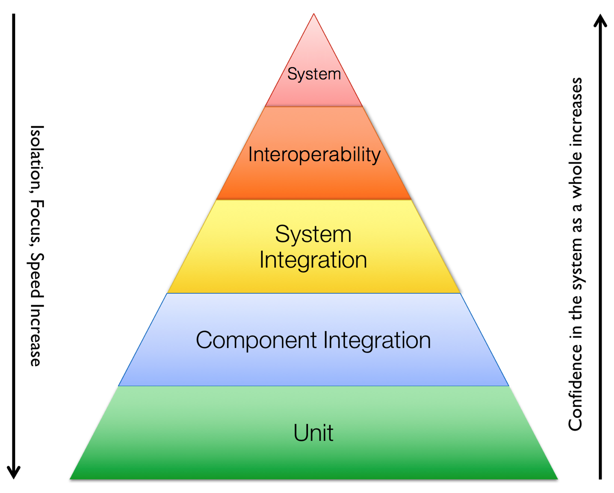

Testing
=======

Unit test
~~~~~~~~~
See `building Hyperledger Fabric <http://hyperledger-fabric.readthedocs.io/en/latest/dev-setup/build.html>` for unit testing instructions.

See `Unit test coverage reports <https://jenkins.hyperledger.org/view/fabric/job/fabric-merge-x86_64/>`__

To see coverage for a package and all sub-packages, execute the test with the ``-cover`` switch:

::

    go test ./... -cover

To see exactly which lines are not covered for a package, generate an html report with source
code annotated by coverage:

::

    go test -coverprofile=coverage.out
    go tool cover -html=coverage.out -o coverage.html

Integration test
~~~~~~~~~~~~~~~~
See `Hyperledger Fabric Integration tests <https://github.com/hyperledger/fabric/blob/master/integration/README.rst>`__
for Hyperledger Fabric integration test details.

Integration tests cover testing between components, e.g., tests between peers and an orderer, and are used to
show that a feature is working as expected across different interfaces. They ensure that components and
systems work together as expected for a specific feature. Integration tests are validation tests that are not
expected to stress the system. Test friendly configurations with real implementations should be used.
Each user consumable feature should extend the suite of integration tests.  These tests use a small number of
assets (eg. chaincode, peers, orgs) across multiple tests.

Integration tests are in 2 categories: Component Integration and System Integration.

Component integration tests could include some mocked interfaces as necessary. This form of integration tests can
be used for negative testing and forced event testing.

System integration tests use live builds and packages. These also have been referred to as end-to-end tests.

Once system integration tests complete successfully, a CR may be merged to a repository.

For more details on how to execute the integration tests, see the integration README.

See `IT Daily Results <https://jenkins.hyperledger.org/view/Daily/>`__

See `IT Weekly Results <https://jenkins.hyperledger.org/view/Weekly/>`__

Interoperability test
~~~~~~~~~~~~~~~~~~~~~
Interoperability tests are higher-level integration tests that span across repositories to test the compatibility
between fabric, fabric-ca and fabric-sdk-*. This test suite contains a very limited number of tests, which are
executed after a merge is performed in any of the repositories. These tests are not feature based and do not need
to be updated often. They use a maximum number of assets in order to verify compatibility between commits. Once
these Interoperability tests pass, a build combination is considered good and the new build artifacts may be
published for use with other repositories.

System test
~~~~~~~~~~~
See `System Testing Hyperledger Fabric <https://github.com/hyperledger/fabric-test/blob/master/README.md>`__
for details on system testing.

System testing includes the following categories:
* Scalability

* Performance and Concurrency

* Upgrades and Fallbacks

* Long Running

* Compatibility

* Chaos and Recovery

* Functional (only for regression purposes)

See `SVT Daily Results <https://jenkins.hyperledger.org/view/fabric-test/job/fabric-test-daily-results-x86_64/test_results_analyzer/>`__

See `SVT Weekly Results <https://jenkins.hyperledger.org/view/fabric-test/job/fabric-test-weekly-results-x86_64/test_results_analyzer/>`__

See `SVT Performance Test Results Graphs With Testviewer <https://testviewer.mybluemix.net>`__

See `SVT Performance TestViewer Details <https://github.com/hyperledger/fabric-test/blob/master/tools/Testviewer/README.md>`__

.. Licensed under Creative Commons Attribution 4.0 International License
   https://creativecommons.org/licenses/by/4.0/
