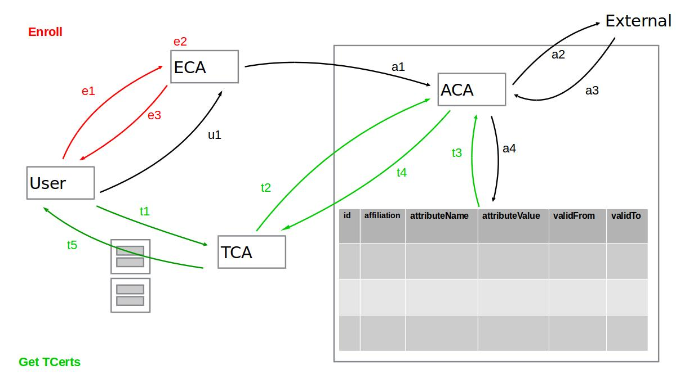

# Attributes support

To support attributes the user has to pass them during TCert creation, these attributes can be used  during transaction deployment, execution or query for Attribute Based Access Control (ABAC) to determine whether the user can or cannot execute a specific chaincode  or used attributes' values for other purposes. A mechanism to validate the ownership of attributes is required in order to prove if the attributes passed by the user are correct. The Attribute Certificate Authority (ACA) has the responsibility of validate attributes and to return an Attribute Certificate (ACert) with the valid attribute values.
Attributes values are encrypted using the keys defined below (section Attributes keys).

## Attribute Keys

The attributes are encrypted using a key derived from a hierarchy called PreKey tree. This approach consists in deriving keys from a parent key, allowing the parent key owner, get access to derived keys. This way keys used to encrypt attributes are different among attributes and TCerts avoiding linkability while allowing an authorized auditor who owns a parent key to derive the keys in the lower levels.


### Example of prekey tree

    Pre3K_BI
            |_Pre2K_B = HMAC(Pre3K_BI, “banks”)
            |   |_Pre1K_BankA = HMAC(Pre2K_B, “Bank A”)
            |   |   |_Pre0K_BankA = HMAC(Pre1K_BankA, TCertID)
            |   |       |_PositionKey_BankA_TIdx = HMAC(Pre0K_BankA, "position")
            |   |       |_CompanyKey_BankA_TIdx = HMAC(Pre0K_BankA, "company")
            |   |
            |   |_Pre1K_BankB = HMAC(Pre2K_B, “BanKB”)
            |       |_Pre0K_BankB = HMAC(Pre1K_BankB, TCertID)
            |            |_PositionKey_BankB_TIdx = HMAC(Pre0K_BankB, "position")
            |            |_CompanyKey_BankB_TIdx = HMAC(Pre0K_BankB, "company")
            |
            |_Pre2K_I = HMAC(Pre3K_BI, "institutions")
                |_Pre1K_InstitutionA= HMAC(Pre2K_I, "Institution A”)
                   |_Pre0K_InstitutionA = HMAC(_Pre1K_InstitutionA, TCertID)
                        |_PositionKey_InstA_TIdx = HMAC(Pre0K_InstitutionA, "position")
                        |_CompanyKey_InstA_TIdx = HMAC(Pre0K_InstitutionA, "company")

- Pre3K_BI: is available to TCA and auditors for banks and institutions.
- Pre2K_B: is available to auditors for banks
- Pre1K_BankA: is available to auditors for Bank A.
- Pre1K_BankB: is available to auditors for Bank B.
- Pre2K_I: is available to auditors for institutions.
- Pre1K_InstitutionA: is available to auditors for Institution A.

Each TCert has a different PreK0 (for example Pre0K_BankA) and each TCert attribute has a different attribute key (for example PositionKey_BankA_TIdx).

## Attribute Certificate Authority

Attribute Certificate Authority (ACA) has the responsibility of certify the ownership of the attributes. ACA has a database to hold attributes for each user and affiliation.

1. id: The id passed by the user during enrollment
2. affiliation: The entity which the user is affiliated to
3. attributeName: The name used to look for the attribute, e.g. 'position'
4. attributeValue: The value of the attribute, e.g. 'software engineer'
5. validFrom: The start of the attribute's validity period
6. validTo: The end of the attribute's validity period

### gRPC ACA API

1. FetchAttributes

```
    rpc FetchAttributes(ACAFetchAttrReq) returns (ACAFetchAttrResp);

    message ACAFetchAttrReq {
        google.protobuf.Timestamp ts = 1;
        Cert eCert = 2;                  // ECert of involved user.
        Signature signature = 3;         // Signed using the ECA private key.
    }

    message ACAFetchAttrResp {
        enum StatusCode {
            SUCCESS = 000;
            FAILURE = 100;
        }
        StatusCode status = 1;
    }
```

2. RequestAttributes

```
    rpc RequestAttributes(ACAAttrReq) returns (ACAAttrResp);

    message ACAAttrReq {
        google.protobuf.Timestamp ts = 1;
        Identity id = 2;
        Cert eCert = 3;                                // ECert of involved user.
        repeated TCertAttributeHash attributes = 4;    // Pairs attribute-key, attribute-value-hash
        Signature signature = 5;                       // Signed using the TCA private key.
    }

    message ACAAttrResp {
        enum StatusCode {
            FULL_SUCCESSFUL     = 000;
            PARTIAL_SUCCESSFUL  = 001;
            NO_ATTRIBUTES_FOUND = 010;
            FAILURE	            = 100;
        }
        StatusCode status = 1;
        Cert cert = 2;                  // ACert with the owned attributes.
        Signature signature = 3;        // Signed using the ACA private key.
    }
```

3. RefreshAttributes

```
    rpc RefreshAttributes(ACARefreshReq) returns (ACARefreshResp);

    message ACARefreshAttrReq {
        google.protobuf.Timestamp ts = 1;
        Cert eCert = 2;                              // ECert of the involved user.
        Signature signature = 3;                     // Signed using enrollPrivKey
    }

    message ACARefreshAttrResp {
        enum StatusCode {
            SUCCESS = 000;
            FAILURE = 100;
	    }
        StatusCode status = 1;
    }
```

## FLOW



### During enrollment

1. The user requests an Enrollment Certificate (ECert) to ECA
2. ECA creates the ECert and responds to the user with it.
3. ECA issues a fetch request under TLS to the ACA passing the newly generated ECert as a parameter. This request is signed with the ECA's private key.
4. The request triggers ACA asynchronous mechanism that fetches attributes' values from external sources and populates the attributes database (in the current implementation attributes are loaded from an internal configuration file).

### During TCert generation

1. When the user needs TCerts to create a new transaction it requests a batch of TCerts to the TCA, and provides the following:
   * The batch size (i.e. how many TCerts the user is expecting)
   * Its ECert
   * A list of attributes (e.g. Company, Position)
2. Under TLS TCA sends a RequestAttributes() to ACA to verify if the user is in possession of those attributes. This request is signed with TCA's private key and it contains:
   * User's ECert
   * A list of attribute names "company, position, ..."
3. The ACA performs a query to the internal attributes database and there are three possible scenarios***:
     a. The user does not have any of the specified attributes – An error is returned.
     b. The user has all the specified attributes – An X.509 certificate (ACert) with all the specified attributes and the ECert public key is returned.
     c. The user has a subset of the requested attributes – An X.509 certificate (ACert) with just the subset of the specified attributes and the ECert public key is returned.
3. The TCA checks the validity period of the ACert's attributes and updates the list by eliminating those that are expired. Then for scenarios b and c from the previous item it checks how many (and which ones) of the attributes the user will actually receive inside each TCert. This information needs to be returned to the user in order to decide whether the TCerts are useful or if further actions needs to be performed (i.e. issue a RefreshAttributes command and request a new batch, throw an error or make use of the TCerts as they are).
4. The TCA could have other criteria to update the valid list of attributes.
5. The TCA creates the batch of TCerts. Each TCert contains the valid attributes encrypted with keys derived from the Prekey tree (each key is unique per attribute, per TCert and per user).
6. The TCA returns the batch of TCerts to the user along with a root key (Prek0) from which each attribute encryption key was derived. There is a Prek0 per TCert. All the TCerts in the batch have the same attributes and the validity period of the TCerts is the same for the entire batch.

*** _In the current implementation an attributes refresh is executed automatically before this step, but once the refresh service is implemented the user will have the responsibility of keeping his/her attributes updated by invoking this method._

### Assumptions

1. An Attribute Certificate Authority (ACA) has been incorporated to the Membership Services internally to provide a trusted source for attribute values.
2. In the current implementation attributes are loaded from a configuration file (membersrvc.yml).
3. Refresh attributes service is not implemented yet, instead, attributes are refreshed in each RequestAttribute invocation.
